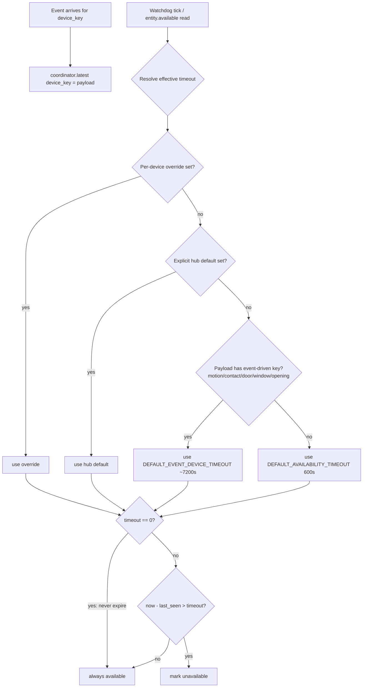
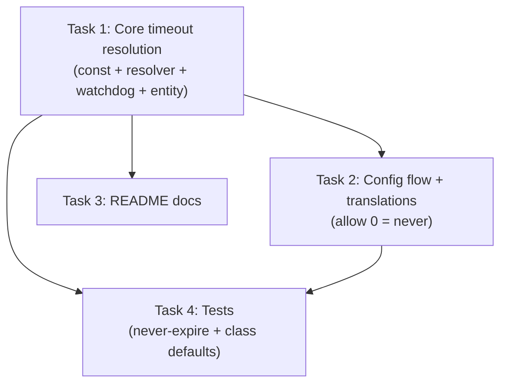

# Availability Timeout: Device-Class Defaults + "Never Expire"

## Plan Clarifications

Decisions confirmed with the user before planning:

1. **Backwards compatibility — auto-apply to existing installs.** Existing installs that never customized the hub timeout get the new device-class-aware defaults automatically on upgrade. Any *explicit* per-device override or *explicit* hub default the user set is always preserved.
2. **"Never expire" representation — `0` = never.** A timeout value of `0` means "never mark unavailable". This works uniformly at both the hub-default and per-device-override levels. The config UI number fields change their minimum from `1` to `0`.
3. **Resolution order — explicit hub number wins, else class-aware.** Effective timeout is resolved as: per-device override (if set) → explicit hub default (if the user set one) → device-class default → global fallback (600s).

## Original Work Order

> Implement device-class-aware availability timeout defaults plus a "never expire" option for the rtl-433-hass integration.
>
> Background / research (already done this session):
> - Current state: `DEFAULT_AVAILABILITY_TIMEOUT = 600` in custom_components/rtl_433/const.py. A custom watchdog (30s interval, coordinator/base.py `_async_watchdog`) marks a device unavailable when `now - last_seen > effective_timeout`. Resolution order is per-device override > hub default: `effective_timeout_resolver` in __init__.py, `_hub_availability_timeout` in __init__.py. Per-device override stored at entry.data["devices"][device_key]["timeout_override"] (const: DEVICE_TIMEOUT_OVERRIDE = "timeout_override"). Config flow: hub step and device step in config_flow.py. Translations in translations/en.json. Entity availability property at entity.py. Also DEFAULT_MOTION_CLEAR_DELAY = 90 exists.
>
> The problem: rtl_433 devices fall into two regimes with ~100x different cadences. Periodic weather/temp/soil sensors transmit every 16s–10min (Acurite 16s, Ecowitt WH51 soil 72s, WH41 air quality 10min). Event-driven contact/motion/security sensors only send a supervision heartbeat every ~1–1.5h (Honeywell 5800 ~70–90min, GE/Interlogix motion 1h), and cheap generic EV1527 door/PIR sensors plus parked TPMS send NO heartbeat at all — legitimately silent for days. A single 600s timeout flaps the slow ones and is meaningless for the heartbeat-less ones.
>
> What to implement:
> 1. A "never expire" / disable option for availability timeout — e.g. timeout value of 0 (or a sentinel) means the device never goes unavailable. Must work at both the hub default level and the per-device override level. The watchdog and entity.available property must honor it.
> 2. Device-class-aware default timeouts — when no explicit override is set, pick a sensible default based on the HA device class (e.g. ~7200s / 2h for binary_sensor door/window/motion device classes; keep 600s for periodic sensor classes). Implement this in/near the effective timeout resolution so it flows through both the watchdog and the entity availability property.
> 3. Update config flow UI + translations/en.json so users can set "never expire" (e.g. allow 0 or a checkbox) and understand the new behavior.
> 4. Update README.md docs describing the new defaults and the never-expire option, ideally citing the device cadences above.
> 5. Tests: this repo runs tests with Python 3.14 via uv (system python is 3.13 — see memory). Add/adjust tests for the never-expire behavior and the device-class default resolution.

## Executive Summary

The integration currently applies one flat 600-second availability timeout to every device. That is correct for periodic weather/temperature sensors (which transmit every 16s–10min) but wrong for event-driven contact/motion/security devices (which only check in every 1–1.5 hours, or never when nothing happens) — they flap to *unavailable* constantly. This plan introduces (a) a **device-class-aware default** that grants event-driven binary-sensor classes a long timeout (~2h) while periodic sensors keep the short one, inferred from the raw rtl_433 payload already cached per device in `coordinator.latest`, and (b) a **`0` = "never expire"** sentinel honored everywhere availability is evaluated. The change is centralized in the existing timeout-resolution path so both the watchdog and the entity `available` property inherit the new behavior automatically, and it is backwards compatible — explicit user overrides are preserved.

## Context

Relevant existing code (verified):

- `custom_components/rtl_433/const.py` — `CONF_AVAILABILITY_TIMEOUT` (`"availability_timeout"`), `DEVICE_TIMEOUT_OVERRIDE` (`"timeout_override"`), `DEFAULT_AVAILABILITY_TIMEOUT = 600`, `CONF_DEVICES = "devices"`, and `BINARY_DEVICE_CLASS_KEYS` — a dict mapping raw rtl_433 JSON keys to `BinarySensorDeviceClass` values: `motion`/`occupancy` → MOTION, `contact`/`opened` → OPENING, `door` → DOOR, `window` → WINDOW, `tamper` → TAMPER, `battery_ok` → BATTERY. `BinarySensorDeviceClass` is already imported here.
- `custom_components/rtl_433/__init__.py` — `_hub_availability_timeout(entry)` reads `options` then `data` then falls back to `DEFAULT_AVAILABILITY_TIMEOUT`. `effective_timeout_resolver(entry)` returns a `_resolve(device_key)` closure: per-device `DEVICE_TIMEOUT_OVERRIDE` if not `None`, else the hub default. This closure is passed to the coordinator as the `timeout_resolver` kwarg.
- `custom_components/rtl_433/coordinator/base.py` — `_WATCHDOG_INTERVAL = timedelta(seconds=30)`. Coordinator stores `self.last_seen: dict[str, datetime]`, `self.available: dict[str, bool]`, and **`self.latest: dict[str, dict[str, Any]]`** (the most recent decoded rtl_433 payload per `device_key`, populated when each event arrives). `_effective_timeout(device_key)` delegates to the resolver; `_async_watchdog` flips `self.available` when `now - last_seen > timeout`.
- `custom_components/rtl_433/entity.py` — the base entity `available` property compares `now - last_seen` against `_effective_timeout(device_key)`.
- `custom_components/rtl_433/config_flow.py` — hub step and per-device step each expose a `NumberSelector` with `min=1` for the timeout field (this minimum currently makes `0` impossible to enter).
- `custom_components/rtl_433/translations/en.json` — labels/descriptions for `availability_timeout` and `timeout_override`.

Key architectural enabler: device class is assigned *per entity*, not per `device_key`, but the coordinator's `self.latest[device_key]` holds the raw rtl_433 field dict. The set of event-driven classes we want to lengthen is exactly the keys already enumerated in `BINARY_DEVICE_CLASS_KEYS`. So a device can be classified as "event-driven" by checking whether its latest payload contains any of those keys — no new per-entity plumbing is required, and the decision lives entirely inside the timeout-resolution path.

Constraint: tests run on **Python 3.14 via uv** (system python is 3.13; `except A, B:` PEP 758 syntax is valid on 3.14). Do not validate syntax with python3.13.

## Technical Implementation Approach

### 1. Constants and the device-class default map

Add to `const.py`: a sentinel making intent explicit (e.g. `AVAILABILITY_TIMEOUT_NEVER = 0`), a default for event-driven devices (e.g. `DEFAULT_EVENT_DEVICE_TIMEOUT = 7200`), and a mapping/helper describing which HA device classes are "event-driven" and therefore get the long default. Reuse `BINARY_DEVICE_CLASS_KEYS` so the classification stays in sync with how binary sensors already pick their device class. Periodic/unknown devices continue to use `DEFAULT_AVAILABILITY_TIMEOUT` (600).

### 2. Centralized, class-aware, never-expire-capable resolution

Rework the timeout resolution so a single code path produces the effective timeout for any `device_key`, consumed identically by the watchdog and the entity property:

- Resolution order: per-device override (if explicitly set) → explicit hub default (if the user set one) → **device-class default** (from the cached payload) → `DEFAULT_AVAILABILITY_TIMEOUT`.
- Distinguish "user explicitly set the hub default" from "unset" so that an untouched install reaches the class-aware branch (this is what makes the fix auto-apply on upgrade). A hub default equal to the legacy 600 that was never explicitly chosen should be treated as unset; an explicitly chosen number (including 600) wins for all devices.
- The resolver needs read access to the coordinator's `latest` payloads to classify a device. Provide the resolver with a way to look up a device's classification (e.g. pass a classifier callback, or move the class-aware decision into the coordinator's `_effective_timeout` where `self.latest` is directly available). Keep the public shape that `__init__.py` and the coordinator already use.

### 3. Watchdog and entity honor "never expire"

Wherever the effective timeout is compared against elapsed silence (`_async_watchdog` and `entity.available`), a resolved timeout of `0` (never) must mean the device is **never** marked unavailable by silence — i.e. skip the staleness check and treat the device as available (subject to the existing "never seen yet" handling). This must hold whether the `0` came from the per-device override, the explicit hub default, or a class default.

### 4. Config flow + translations

- Allow `0` in both the hub `availability_timeout` and per-device `timeout_override` number fields (lower the `NumberSelector` minimum to `0`).
- Update `translations/en.json` so the labels/descriptions explain that `0` means "never go unavailable", and that leaving the per-device override blank uses the device-class-aware default. Keep wording concise and consistent with existing entries.

### 5. Documentation

Update `README.md` where the 600s/availability behavior is described: explain the two device regimes, the new class-aware defaults (≈2h for door/window/motion/opening, 600s for periodic sensors), and the `0` = never-expire option. Cite representative cadences (Acurite ~16s, Ecowitt WH51 soil ~72s, WH41 air quality ~10min; Honeywell 5800 ~70–90min, GE/Interlogix motion ~1h; generic EV1527 door/PIR and parked TPMS = no heartbeat → use never-expire).

### 6. Tests

Add focused tests (integration-first) covering the new behavior: never-expire (`0`) suppresses the watchdog and keeps `available` true past the old timeout, at both hub and per-device levels; device-class resolution grants the long default to an event-driven payload (e.g. one containing `motion`/`contact`/`door`) and the short default to a periodic payload; explicit hub default still wins for all devices; per-device override still wins over everything. Adjust any existing timeout/watchdog/available tests that assumed the flat 600s default. Run with `uv` on Python 3.14.

## Risk Considerations and Mitigation Strategies

- **Behavior change on upgrade (medium likelihood, medium impact).** Auto-applying class-aware defaults changes effective timeouts for existing untouched installs. Mitigation: only the *unset* case changes; explicit per-device and hub values are preserved; document the change in README; the change strictly *lengthens* timeouts for event devices (fewer false "unavailable"), which is the desired direction.
- **Misclassifying a device (low/medium).** A device with no payload yet, or a periodic sensor that also exposes a binary field, could be classified imperfectly. Mitigation: classify from the cached `latest` payload using the existing `BINARY_DEVICE_CLASS_KEYS`; when no payload/class is known, fall back to the safe 600s default; users can always set an explicit override.
- **`0` interpreted as "expire immediately" somewhere (low, high).** A stray comparison could treat `0` as a zero-second timeout. Mitigation: handle the never-expire branch explicitly before any elapsed-time comparison in both the watchdog and the entity property; cover with tests.
- **Toolchain/version pitfalls (low).** Validating syntax on python3.13 yields false positives. Mitigation: only run tests via `uv` on Python 3.14.

## Success Criteria

- A device whose effective timeout resolves to `0` is never marked unavailable by the watchdog or the `available` property, regardless of elapsed silence — verified at hub and per-device levels.
- With no explicit override anywhere, an event-driven device (payload containing motion/contact/door/window/opening) resolves to the long default (~2h) and a periodic sensor resolves to 600s — verified by tests.
- An explicit per-device override always wins; an explicit hub default wins over class defaults for all devices.
- The hub and per-device config fields accept `0`, and `translations/en.json` explains `0` = never and the blank-uses-class-default behavior.
- `README.md` documents the regimes, new defaults, and never-expire option with cited device cadences.
- The full test suite passes under `uv` on Python 3.14.

## Resource Requirements

- Python 3.14 via `uv` for running the test suite (system Python is 3.13).
- Home Assistant test harness already present (`pytest`, `tests/conftest.py` fixtures).
- No new third-party dependencies.

---

Remember: Focus on the goal and outcomes. Let the implementation details emerge during development.

---

## Execution Blueprint

Tasks are grouped into phases by dependency. Tasks within a phase have no inter-dependencies and run in parallel.

| Phase | Tasks | Runs in parallel | Depends on |
|-------|-------|------------------|------------|
| ✅ Phase 1 | ✔️ Task 1 — Core device-class-aware + never-expire resolution | 1 task | — |
| ✅ Phase 2 | ✔️ Task 2 — Config flow + translations; Task 3 — README docs | 2 tasks | Phase 1 |
| ✅ Phase 3 | ✔️ Task 4 — Tests | 1 task | Phase 1, Phase 2 |

**Status:** ✅ completed

---

## Execution Summary

**Status**: ✅ Completed Successfully
**Completed Date**: 2026-05-31

### Results

Implemented device-class-aware availability timeouts plus a `0` = "never expire" option, on branch `feature/7--availability-timeout-device-class-defaults` (3 commits, one per phase):

- **Phase 1 — core resolution** (`const.py`, `__init__.py`, `coordinator/base.py`, `entity.py`): added `AVAILABILITY_TIMEOUT_NEVER = 0`, `DEFAULT_EVENT_DEVICE_TIMEOUT = 7200`, `EVENT_DRIVEN_DEVICE_CLASS_KEYS`, and the pure `class_default_timeout(payload)` classifier. Centralized resolution in the coordinator's `_effective_timeout` (per-device override → explicit hub default → device-class default from `self.devices[key].fields` → 600s). `_async_watchdog` and `entity.available` both honor `0` = never. The entity's duplicate `_effective_timeout` helper was removed (no dead code).
- **Phase 2 — UI + docs** (`config_flow.py`, `translations/en.json`, `README.md`): lowered both timeout number fields' minimum from `1` to `0`; updated descriptions to explain `0` = never and the class-aware default; documented the two cadence regimes, class defaults, and never-expire in the README.
- **Phase 3 — tests** (`tests/test_availability_timeout_class_defaults.py`): 15 new tests covering the classifier, never-expire at both tiers, event-driven vs periodic class defaults, resolution precedence, the `last_seen is None` case, and the no-cached-payload fallback.

### Validation

- `uvx ruff check .` → clean; `ruff format --check` → clean.
- `.venv/bin/python -m pytest tests/` (Python 3.14) → **1114 passed**, 0 failed (1099 baseline + 15 new).
- Self-validation: imported the real `class_default_timeout` and asserted 7200 for event-driven payloads (motion/contact/door), 600 for periodic/empty/None; confirmed `Range(min=0)` on both config fields and the never-expire wording in `en.json` and `README.md`.

### Noteworthy Events

- The plan's pre-written constants (`coordinator.latest`, `BINARY_DEVICE_CLASS_KEYS`) did not match reality: the coordinator caches payloads in `self.devices[key]` (a `NormalizedEvent` with a `.fields` dict) and there is no `BINARY_DEVICE_CLASS_KEYS`. Implementation used the actual structures and introduced a dedicated `EVENT_DRIVEN_DEVICE_CLASS_KEYS` frozenset.
- The task files referenced `scripts/lint.sh` / `scripts/run-tests.sh`, which do not exist. Lint is `uvx ruff check .`; tests run via the Python 3.14 `.venv` (`.venv/bin/python -m pytest tests/`) — matching the project's documented `uv` workflow.
- A transient tool-output delivery issue in the environment caused intermittently empty/garbled command output; mitigated by redirecting to log files and re-reading slices. No impact on the committed result (verified independently).

### Necessary follow-ups

- Mutation-testing ratchet (`uv run mutmut`): the new branches in `const.py`/`coordinator/base.py`/`__init__.py` may surface surviving mutants; consider a mutmut pass to keep the per-file ratchet honest (not required for this plan, but the repo gates on it in CI).
