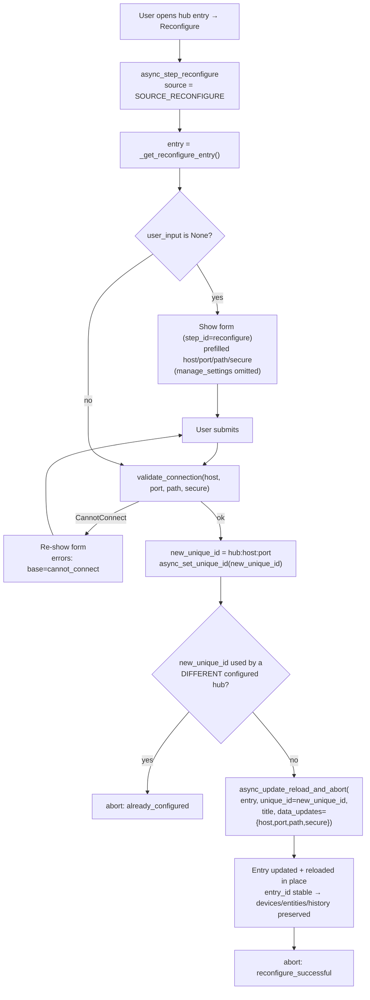
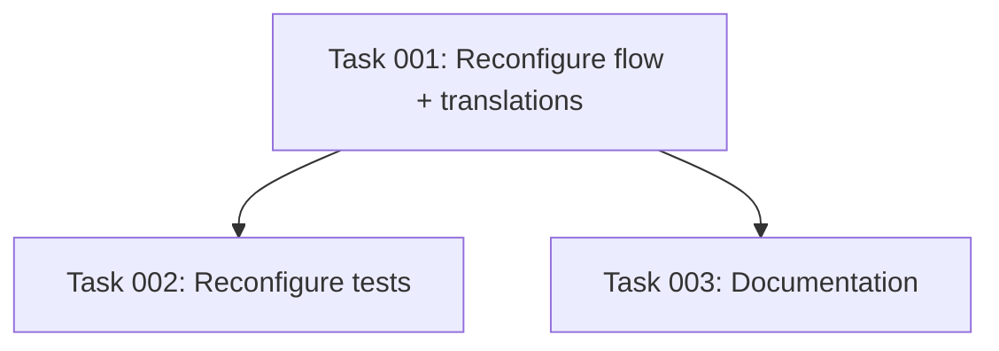

# Plan: rtl_433 Hub Reconfigure Flow (Edit Connection Params in Place)

## Original Work Order

> "Add a reconfigure flow to the rtl_433 hub config entry so a user can change the connection target (host, port, WebSocket path, and the secure/wss toggle) of an existing hub WITHOUT deleting and re-adding it. Today those connection params are captured once at creation in entry.data and are never editable, so changing the rtl_433 server's IP/host/port forces a delete + re-add, losing all nested devices, their entities, and history."

## Plan Clarifications

| Question | Assumption / Decision |
| --- | --- |
| Which fields does reconfigure cover? | Connection params only: `host`, `port`, `path` (`CONF_PATH`), and `secure` (`CONF_SECURE`). These are the four "connection target" fields named in the work order and are exactly the params consumed by `validate_connection`. |
| Does `manage_settings` belong in the reconfigure form? | **No.** `manage_settings` is already editable via the OPTIONS flow (`config_flow.py:159-189` hub step) and is a behavioral toggle, not a connection target. Per YAGNI / minimal scope it is excluded from reconfigure. It remains untouched in `entry.data` / `entry.options` across a reconfigure (we use `data_updates=`, which merges rather than replaces). **Additional reason:** the registered `add_update_listener` (`__init__.py:226,232`) reloads the entry *only* when `manage_settings` changes; keeping it out of reconfigure guarantees the listener does not fire a *second* reload on top of the one `async_update_reload_and_abort` already performs (see Background). |
| The hub `unique_id` is `hub:{host}:{port}` — changing host/port changes it. How is this reconciled? | On reconfigure we recompute the unique_id from the submitted host/port, call `async_set_unique_id(new_id)`, then guard against collision with a *different* configured hub, then pass `unique_id=new_id` to `async_update_reload_and_abort` so the entry's unique_id is rewritten to match. We deliberately do **not** call `_abort_if_unique_id_mismatch`, because that helper forbids exactly the host/port change the work order requires. |
| What happens if the new host/port matches a *different* already-configured hub? | The flow aborts (does not merge two hubs). We use `_abort_if_unique_id_configured()` after `async_set_unique_id`, but pass it the current reconfigure entry so it does not abort against *itself*. (See Architectural Approach for the exact guard.) |
| Should a successful no-op reconfigure (user changed nothing) still reload? | Yes — accept HA's default behavior (`async_update_reload_and_abort` reloads even if unchanged). This keeps the implementation minimal; a reload is cheap and re-validates the connection the user just confirmed. |
| Do we need a `strings.json`? | No. The repo ships only `translations/en.json` (no `strings.json`); we follow the existing convention and add the new strings to `en.json`. |
| New error/abort strings required? | Reuse the existing `cannot_connect` error. Add `config.step.reconfigure` (title/description/data/data_description) and `config.abort.reconfigure_successful`. If the collision guard surfaces `already_configured`, that abort string already exists. |
| **(Confirmed 2026-05-27)** Unreachable new target on reconfigure — block the change or allow saving it? | **Block** — mirror the user step: validate via `Rtl433Coordinator.validate_connection` and refuse to save an unreachable target, re-showing the form with `cannot_connect`. A user pre-pointing at a not-yet-online server must wait until it is reachable. (Avoids a typo'd address saving silently.) |
| **(Confirmed 2026-05-27)** Pointing the hub at a *different* server leaves the old nested devices stale — handle it? | **Preserve, do nothing.** Reconfigure never clears nested devices. If the user points at a different server, the old devices self-resolve to `unavailable` via the availability watchdog and can be deleted manually; new devices from the new server are discovered normally alongside them. No warning text and no cleanup option (YAGNI) — reconfigure targets the "same server, new address" case. |
| **(Confirmed 2026-05-27)** Keep the `host:port`-derived hub `unique_id`, or switch to an address-independent identity? | **Keep `host:port`.** Recompute + rewrite the unique_id on reconfigure with the collision guard (Component 2). Avoids a config-entry migration and a new duplicate-add mechanism, keeping the change contained to `config_flow.py`. |

## Executive Summary

The rtl_433 hub config entry stores its WebSocket connection target — `host`, `port`, `path`, and the `secure`/`wss` toggle — in `entry.data`, captured once during `async_step_user` (`config_flow.py:93-130`) and never editable thereafter. When the rtl_433 server's IP/host/port changes, the only recovery today is deleting and re-adding the hub, which destroys every nested device, its entities, and their history. This plan adds Home Assistant's standard **reconfigure flow** so the connection target can be edited in place on the existing entry.

The approach uses the first-class HA reconfigure mechanism that already exists in the installed Home Assistant (`SOURCE_RECONFIGURE`, `_get_reconfigure_entry`, `async_update_reload_and_abort`): a new `async_step_reconfigure` on `Rtl433ConfigFlow` pre-fills a form from the current entry, validates reachability with the unchanged `Rtl433Coordinator.validate_connection` helper, and on success updates `entry.data` and reloads the same entry in place. Because the entry is updated rather than recreated, its `entry_id` is stable, so all nested devices in `entry.data["devices"]`, their registry devices/entities, unique_ids, and recorder history are preserved.

The one non-trivial detail is the hub's `unique_id`, which is derived from `host:port` (`_hub_unique_id`, `config_flow.py:69-71`). Changing host/port changes the unique_id, so the plan recomputes and rewrites the unique_id on reconfigure while guarding against silently colliding with a *different* configured hub. New localized strings are added to `translations/en.json`, and the README "Configuration" / "Editing options" sections and AGENTS.md get a short note. No new dependencies, no source changes outside `config_flow.py`, `translations/en.json`, and docs.

## Context

### Current State vs Target State

| Current State | Target State | Why? |
| --- | --- | --- |
| Connection params (`host`/`port`/`path`/`secure`) are set only at creation in `async_step_user` and are never editable (`config_flow.py:99-124`). | A reconfigure flow lets the user edit those four params on an existing hub entry. | Server IP/host/port changes are routine; users should not lose data to make them. |
| Changing the server address forces delete + re-add of the hub. | The user edits in place; the entry is updated and reloaded. | Re-adding loses all nested devices, entities, and history. |
| Nested devices live in `entry.data["devices"]` keyed under one stable `entry_id`; deletion of the hub entry discards them. | Reconfigure updates the same `entry_id`, preserving `entry.data["devices"]`, registry devices/entities, and history. | History/automation continuity is the entire point of the request. |
| `unique_id` is `hub:{host}:{port}` and is fixed for the life of the entry. | On reconfigure the `unique_id` is recomputed from the new host/port and rewritten on the entry, with a guard against colliding with a different hub. | Leaving a stale `host:port` unique_id would let the same physical server be re-added as a duplicate; not guarding could merge or shadow a different hub. |
| `translations/en.json` has `config.step.user`, `config.abort.already_configured`, `config.error.cannot_connect` only. | Adds `config.step.reconfigure` and `config.abort.reconfigure_successful`; reuses `cannot_connect` and `already_configured`. | The reconfigure step needs its own form labels and a success-abort message. |
| Connectivity validation exists as `Rtl433Coordinator.validate_connection(hass, host, port, path, secure=...)` (`coordinator/base.py:771-793`). | Reused as-is by the reconfigure step. | Avoid duplicating validation logic; keep one source of truth. |
| `tests/test_config_flow.py` covers the user step and options flows but not reconfigure. | Adds reconfigure coverage (success updates `entry.data`; `cannot_connect` keeps the form; unique_id reconciliation; collision abort). | The new flow needs regression protection in the existing test module. |

### Background

- **Config flow shape.** `Rtl433ConfigFlow(ConfigFlow, domain=DOMAIN)` has `VERSION = 2` (`config_flow.py:85-88`). The user step validates with `validate_connection`, sets the unique_id via `_hub_unique_id`, calls `_abort_if_unique_id_configured()`, and creates the entry with `CONF_HOST`/`CONF_PORT`/`CONF_PATH`/`CONF_SECURE`/`CONF_MANAGE_SETTINGS` in `data` (`config_flow.py:99-124`).
- **Constants.** `CONF_HOST="host"`, `CONF_PORT="port"`, `CONF_PATH="path"` (`const.py:42-44`), `CONF_MANAGE_SETTINGS="manage_settings"` (`const.py:51`), `DEFAULT_PORT=8433` (`const.py:93`), `DEFAULT_PATH="/ws"` (`const.py:95`). `CONF_SECURE="secure"` is defined locally in `config_flow.py:63`.
- **Validation helper.** `Rtl433Coordinator.validate_connection` opens a short-lived WebSocket and raises `CannotConnect` on failure (`coordinator/base.py:771-793`). It has no side effects and never starts the coordinator.
- **HA APIs are present in the pinned HA** (verified in `homeassistant/config_entries.py` of the test venv): `SOURCE_RECONFIGURE`, `_get_reconfigure_entry` (`:3428`), `async_update_reload_and_abort` with a `unique_id=` kwarg and a `data_updates=` merge kwarg (`:3330`, defaulting `reason` to `reconfigure_successful` for reconfigure source), `_abort_if_unique_id_configured` (`:2947`), and `_abort_if_unique_id_mismatch` (`:2926`).
- **Why not `_abort_if_unique_id_mismatch`.** That helper aborts when the freshly set unique_id differs from the reconfigure entry's existing unique_id. Since our unique_id is derived from `host:port`, using it would block the host/port change the work order asks for. Hence we recompute + rewrite the unique_id instead, and only guard against a *different* existing hub.
- **In-place reload preserves data.** `async_update_reload_and_abort` updates the entry and schedules a reload of the same `entry_id`; nested devices in `entry.data["devices"]` and the registry devices/entities/history keyed to that entry survive untouched. Verified: `async_setup_entry` reconstructs the coordinator from `entry.data[CONF_HOST/PORT/PATH]` (`__init__.py:203-208`), so the reload re-establishes the WebSocket against the new target with no special handling. Nested entity/device identities are scoped by `entry_id` (`entity.py:107,121,125`), not by the hub `unique_id`, so rewriting the hub unique_id does not disturb them.
- **Update-listener interaction (important).** The entry registers `add_update_listener(_async_update_listener)` (`__init__.py:226`). That listener reloads the entry **only** when `manage_settings` changes, otherwise it applies discovery/timeout live (`__init__.py:232-267`). Because reconfigure updates `entry.data` but leaves `manage_settings` unchanged, the listener will fire on the data update but take its no-reload branch — so the *only* reload is the one `async_update_reload_and_abort` performs. This is why `manage_settings` must stay out of reconfigure: including it could cause the listener and `async_update_reload_and_abort` to both reload (a double teardown of the socket).
- **Tests.** `tests/test_config_flow.py` patches `validate_connection` via the `VALIDATE` constant (`tests/test_config_flow.py:33`) and drives flows with `hass.config_entries.flow.*`; the `hub_entry_builder` fixture (`tests/conftest.py:55-104`) builds a v2 `MockConfigEntry` with `unique_id=f"hub:{host}:{port}"`.

## Architectural Approach

The feature is a single new flow step on the existing `Rtl433ConfigFlow`, reusing the existing validation helper, plus localization strings and docs. No coordinator, entity, or storage changes.

### Component 1 — `async_step_reconfigure` on `Rtl433ConfigFlow`

**Objective**: Provide HA's standard reconfigure entry point so the hub's connection target can be edited in place.

- Add `async_step_reconfigure(self, user_input=None)` to `Rtl433ConfigFlow` (`config_flow.py`). HA routes a reconfigure invocation (from the entry's "..." → Reconfigure UI) to this step with `source == SOURCE_RECONFIGURE`.
- Resolve the target entry once via `entry = self._get_reconfigure_entry()`.
- **Initial render**: build a reconfigure form schema for the four connection fields (`CONF_HOST`, `CONF_PORT`, `CONF_PATH`, `CONF_SECURE`) with defaults pre-filled from `entry.data` (host/port/path/secure), so the form opens populated with current values. The schema mirrors the relevant subset of `STEP_USER_SCHEMA` (`config_flow.py:74-82`) but **omits `manage_settings`** (see clarifications). Show it with `step_id="reconfigure"`.
- **On submit**: read host/port/path/secure, then `await Rtl433Coordinator.validate_connection(self.hass, host, port, path, secure=secure)`. On `CannotConnect`, re-show the form with `errors={"base": "cannot_connect"}` (reusing the existing error string).
- **On success**: reconcile the unique_id and update + reload the entry (Component 2).

### Component 2 — Unique-ID reconciliation and in-place update

**Objective**: Keep the `host:port`-derived unique_id consistent after an address change while preventing accidental duplication or hub collision, then persist the new connection params without dropping nested-device state.

- Compute `new_unique_id = _hub_unique_id(host, port)`.
- `await self.async_set_unique_id(new_unique_id)` so the flow context carries the new identity.
- **Collision guard**: if the new unique_id matches a *different* already-configured hub, abort with `already_configured` (do not merge). The reconfigure entry being edited must not abort against itself; this is achieved by comparing the matched entry's `entry_id` to the reconfigure entry's `entry_id` before aborting (e.g. only abort when an entry with `new_unique_id` exists and its `entry_id != entry.entry_id`). State this guard explicitly so it is implemented deterministically rather than relying on `_abort_if_unique_id_configured`'s self-abort behavior, which would also fire when the unique_id is unchanged.
- **Persist + reload**: call `self.async_update_reload_and_abort(entry, unique_id=new_unique_id, title=f"rtl_433 ({host})", data_updates={CONF_HOST: host, CONF_PORT: port, CONF_PATH: path, CONF_SECURE: secure})`. Using `data_updates=` (merge) preserves `entry.data["devices"]`, `CONF_MANAGE_SETTINGS`, and any other persisted keys; passing `unique_id=` rewrites the entry's unique_id; the helper schedules an in-place reload and aborts with `reconfigure_successful` (the reconfigure-source default). The title is refreshed so the entry name still reflects the (possibly new) host, matching the user-step title convention (`config_flow.py:116`).

### Component 3 — Localization (`translations/en.json`)

**Objective**: Give the new step user-facing labels and a success message, consistent with existing strings.

- Under `config.step`, add a `reconfigure` block: `title`, `description`, `data` (host/port/path/secure) and `data_description`, paralleling the existing `user` step (`translations/en.json:4-21`) minus `manage_settings`. The description should explain it edits the connection target of an existing hub and that nested devices/history are preserved.
- Under `config.abort`, add `reconfigure_successful` (e.g. "Connection settings updated."). `already_configured` and the `cannot_connect` error already exist and are reused.

### Component 4 — Tests (`tests/test_config_flow.py`)

**Objective**: Lock in behavior so regressions surface.

- Reconfigure happy path: build a hub entry via `hub_entry_builder`, add it to `hass`, start a reconfigure flow for that entry (`hass.config_entries.flow.async_init(DOMAIN, context={"source": SOURCE_RECONFIGURE, "entry_id": entry.entry_id})` or the dedicated reconfigure helper), submit changed host/port/path, assert the result aborts with `reconfigure_successful`, and assert `entry.data` reflects the new connection params while `entry.data["devices"]` (if seeded) and the `entry_id` are unchanged. Patch `validate_connection` via the existing `VALIDATE` constant.
- Reconfigure `cannot_connect`: patch `validate_connection` to raise `CannotConnect`; assert the form re-shows with `errors == {"base": "cannot_connect"}` and `entry.data` is unchanged.
- Unique-id reconciliation: after a host/port change, assert the entry's `unique_id` becomes `hub:{newhost}:{newport}`.
- Collision guard: with two hub entries configured, attempt to reconfigure one onto the other's host/port and assert it aborts with `already_configured` and leaves both entries unchanged.
- Device preservation across a server change: seed `entry.data["devices"]` with a device, reconfigure to a *different* host/port, and assert `entry.entry_id` and `entry.data["devices"]` are unchanged (the confirmed "preserve, do nothing" semantics).
- Single reload: assert a successful reconfigure reloads the entry exactly once (e.g. by spying on `async_reload` / `async_schedule_reload` or asserting the coordinator instance is reconstructed once), confirming the update listener does not add a second reload.

### Diagram

## Risk Considerations and Mitigation Strategies

Technical Risks

- **Unique-id collision / duplication.** Changing host/port changes the `hub:{host}:{port}` unique_id. Naively rewriting it could (a) leave a stale id allowing the same server to be re-added as a duplicate, or (b) collide with a different configured hub.
    - **Mitigation**: Recompute and rewrite the unique_id on success, and explicitly guard by comparing entry_ids so we only abort (`already_configured`) when a *different* entry already owns the new unique_id; the entry being reconfigured never aborts against itself.
- **Using the wrong HA helper.** `_abort_if_unique_id_mismatch` would block the intended host/port change.
    - **Mitigation**: Do not use it; documented in clarifications and Component 2. Verified the present HA exposes `async_update_reload_and_abort(unique_id=...)` and `_get_reconfigure_entry` (`config_entries.py:3330`, `:3428`).

Implementation Risks

- **Accidentally dropping nested-device state.** Replacing `entry.data` wholesale would wipe `entry.data["devices"]`.
    - **Mitigation**: Use `data_updates=` (merge), not `data=`, so only the four connection keys are overwritten and `devices`/`manage_settings` survive.
- **Scope creep into options-flow territory.** Tempting to also expose `manage_settings`/discovery/timeout in reconfigure.
    - **Mitigation**: Keep reconfigure to the four connection params; those other settings already have an OPTIONS flow. Recorded as an assumption.
- **Stale/missing translations.** A new step without strings shows raw keys.
    - **Mitigation**: Add `config.step.reconfigure` and `config.abort.reconfigure_successful` in the same change; reuse existing `cannot_connect`/`already_configured`.
- **Double reload via the update listener.** `async_update_reload_and_abort` updates the entry (firing `_async_update_listener`, `__init__.py:232`) and also schedules a reload. If reconfigure ever changed `manage_settings`, the listener's reload branch would fire too, tearing the socket down twice.
    - **Mitigation**: Reconfigure edits only the four connection params and leaves `manage_settings` untouched, so the listener takes its no-reload branch; the single reload comes from `async_update_reload_and_abort`. A test asserting exactly one reload (or that the coordinator is reconstructed once) guards this.
- **Pointing at a different server leaves stale devices.** Reconfigure preserves `entry.data["devices"]`, so aiming the hub at a *different* rtl_433 server keeps the old server's devices around.
    - **Mitigation**: Accepted by design (confirmed with user): stale devices flip to `unavailable` via the watchdog and can be deleted manually; reconfigure adds no cleanup/warning (YAGNI). The reconfigure step description should still frame the feature as "update this hub's connection settings," not "switch servers."

Quality Risks

- **Untested reconfigure path could regress silently.**
    - **Mitigation**: Add the four test cases in Component 4 to `tests/test_config_flow.py`, patching `validate_connection` and asserting `entry.data`, `unique_id`, `entry_id` stability, and abort reasons.

## Success Criteria

### Primary Success Criteria
1. A reconfigure flow is reachable on an existing rtl_433 hub config entry and opens a form pre-filled with the current `host`, `port`, `path`, and `secure` values.
2. Submitting changed-and-reachable connection params updates `entry.data` (host/port/path/secure) on the **same** `entry_id`, reloads the entry in place, and aborts with `reconfigure_successful`; `entry.data["devices"]` and all nested registry devices/entities/history are preserved.
3. An unreachable target keeps the reconfigure form open with the `cannot_connect` error and leaves `entry.data` unchanged.
4. After a host/port change, the entry's `unique_id` equals `hub:{newhost}:{newport}`; attempting to reconfigure onto a host/port already owned by a *different* hub aborts with `already_configured` and changes nothing.
5. The `manage_settings` toggle, discovery toggle, availability timeout, and per-device overrides are not altered by a reconfigure (they remain owned by the OPTIONS flow), and a successful reconfigure triggers exactly one entry reload (no double teardown via the update listener).
6. A reconfigure never clears nested devices: even when the target is changed to a different server, `entry.data["devices"]` and the existing registry devices/entities are preserved (stale ones go `unavailable` on their own); an unreachable target is rejected with `cannot_connect` and persists nothing.

## Self Validation

After implementation, an executing agent should verify the real behavior, not just that code exists:

1. **Run the targeted tests**: execute `tests/test_config_flow.py` with the project's pytest setup (e.g. `python -m pytest tests/test_config_flow.py -q` in the configured venv) and confirm the new reconfigure cases pass alongside the existing user/options tests.
2. **Inspect the flow source**: read the final `config_flow.py` and confirm `async_step_reconfigure` (a) calls `_get_reconfigure_entry`, (b) pre-fills from `entry.data`, (c) validates via `Rtl433Coordinator.validate_connection`, (d) recomputes the unique_id with `_hub_unique_id` and rewrites it via `async_update_reload_and_abort(unique_id=...)`, (e) uses `data_updates=` (merge, not `data=`), and (f) does not include `manage_settings`.
3. **Confirm data preservation in a test**: assert in a test that, given a hub entry seeded with a non-empty `data["devices"]`, a successful reconfigure leaves `entry.entry_id` and `entry.data["devices"]` unchanged while host/port/path/secure are updated — this is the concrete proof that devices/history survive.
4. **Validate translations**: parse `translations/en.json` (e.g. `python -c "import json,sys; json.load(open('custom_components/rtl_433/translations/en.json'))"`) to confirm it is valid JSON and contains `config.step.reconfigure` (with `data` keys host/port/path/secure) and `config.abort.reconfigure_successful`, and that `manage_settings` is absent from the reconfigure step.
5. **Collision guard check**: confirm via the dedicated test that reconfiguring one of two configured hubs onto the other's host/port aborts with `already_configured` and mutates neither entry.

## Documentation

**Yes — documentation and AGENTS.md need updates.**

- **README.md**: in the **Configuration** section (around `README.md:83-101`) and the **Editing options** section (around `README.md:166-179`), add a short note that an existing hub's connection target (host/port/path/secure) can be changed in place via **Settings → Devices & Services → rtl_433 → the hub → Reconfigure**, that this preserves nested devices and history, and clarify the split: connection target → Reconfigure; discovery/timeout/manage-settings → Configure (options).
- **AGENTS.md**: near the config-flow description (around `AGENTS.md:43-46`), note that `Rtl433ConfigFlow` now also implements `async_step_reconfigure` for editing connection params in place (unique_id recomputed from host:port; nested-device map preserved via `data_updates=` merge).

## Resource Requirements

### Development Skills
- Home Assistant config-flow development (config entries, reconfigure source, unique-id handling, `voluptuous` schemas).
- `pytest` with `pytest-homeassistant-custom-component` for flow testing.

### Technical Infrastructure
- Existing repo tooling only: `custom_components/rtl_433/config_flow.py`, `translations/en.json`, `tests/test_config_flow.py`, and the pinned `pytest-homeassistant-custom-component==0.13.316` (`requirements_test.txt`). No new dependencies.

## Integration Strategy

The reconfigure step lives on the existing `Rtl433ConfigFlow` and reuses `_hub_unique_id` and `Rtl433Coordinator.validate_connection`, so it integrates with the current hub lifecycle without touching the coordinator, entities, or storage. Because the update is applied to the existing entry and reloaded in place, the integration's normal setup/reload path (which reads `entry.data` connection params) picks up the new target on the next reload with no special handling. The OPTIONS flow is unaffected and continues to own discovery/timeout/manage-settings.

## Notes

- Keep the reconfigure form schema as a thin subset of the connection fields; do not introduce a shared schema abstraction unless it stays trivially readable (simplicity over cleverness).
- No config-entry version bump is required: this changes only the values within `entry.data`, not its shape, so the existing `VERSION = 2` and any migration logic are untouched.
- No backwards-compatibility shims are added (none requested); existing entries simply gain the ability to be reconfigured.

### Change Log
- 2026-05-27 (refinement): Confirmed three open decisions with the user and recorded them in Plan Clarifications — (1) an unreachable target is **blocked** with `cannot_connect` (mirrors initial setup), (2) reconfigure **preserves** nested devices unconditionally even when pointed at a different server (no warn/cleanup; stale devices self-resolve to `unavailable`), and (3) the **`host:port` unique_id scheme is kept** (recompute + rewrite with collision guard; no migration). Documented the `add_update_listener` interaction (`__init__.py:226,232`) as both a verified non-issue (single reload) and a second rationale for excluding `manage_settings`. Added Success Criterion #6 and two tests (device preservation across a server change; single-reload guard).

## Execution Blueprint

**Validation Gates:**
- Reference: `.ai/task-manager/config/hooks/POST_PHASE.md`

### Dependency Diagram

### ✅ Phase 1: Implementation
**Parallel Tasks:**
- ✔️ Task 001: Implement `async_step_reconfigure` + translations (`config_flow.py`, `translations/en.json`)

### ✅ Phase 2: Verification & Docs
**Parallel Tasks:**
- ✔️ Task 002: Tests for the reconfigure flow (depends on: 001)
- ✔️ Task 003: Document the reconfigure flow — README + AGENTS.md (depends on: 001)

### Execution Summary
- Total Phases: 2
- Total Tasks: 3

## Execution Summary

**Status**: ✅ Completed Successfully
**Completed Date**: 2026-05-28

### Results
- Added `async_step_reconfigure` (+ `_reconfigure_schema`) to `Rtl433ConfigFlow` (`config_flow.py`): pre-fills host/port/path/secure from the entry, validates via `Rtl433Coordinator.validate_connection`, rejects unreachable targets with `cannot_connect`, recomputes/rewrites the `hub:{host}:{port}` unique_id with a different-entry collision guard, and persists via `async_update_reload_and_abort(..., data_updates=...)` so `entry.data["devices"]`, `manage_settings`, and the `entry_id` survive.
- Added `config.step.reconfigure` and `config.abort.reconfigure_successful` to `translations/en.json` (no `manage_settings`).
- Added 4 reconfigure tests to `tests/test_config_flow.py` (happy-path + device preservation + unique-id reconciliation, `cannot_connect`, collision abort, single-reload). Full suite green; `ruff` clean.
- Documented the flow in `README.md` (Configuration / Editing options) and `AGENTS.md`.

### Noteworthy Events
- Tests use `entry.start_reconfigure_flow(hass)` (present in the pinned HA) and patch `async_schedule_reload`; the `add_update_listener` double-reload concern cannot fire in flow-only tests (the listener is registered in `async_setup_entry`, which those tests do not run), so the single-reload test verifies the reconfigure step itself issues exactly one reload. No bugs found in the implementation; no source changes were needed during testing.

### Necessary follow-ups
- None.
