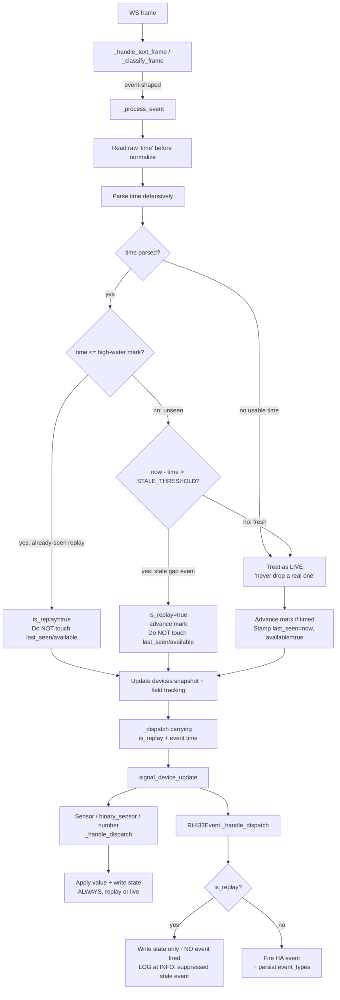
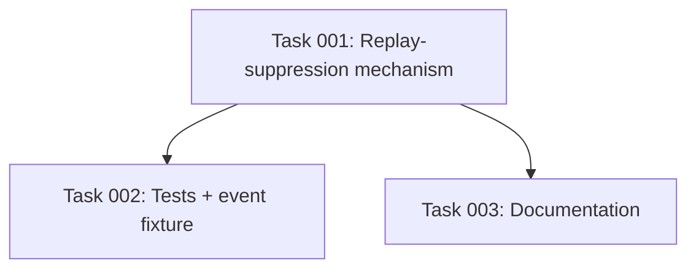

# Plan: Suppress Replayed History on WebSocket Reconnect

## Original Work Order

> On every WebSocket (re)connect, the rtl_433 server replays up to its last 100 historical events. The coordinator currently processes these replayed frames identically to live ones, which causes two problems: (1) event entities (button/motion/doorbell) RE-FIRE Home Assistant events for old transmissions, spuriously triggering automations on every reconnect; and (2) devices that are actually offline briefly flip back to 'available' because each replayed frame stamps last_seen=now. Fix the integration so replayed history does not re-fire event entities or resurrect availability, while still allowing sensors to seed their latest value from the replay.

## Plan Clarifications

| Question | Assumption / Answer |
| --- | --- |
| Which replay-detection strategy should be used? | **Two signals, not one (revised in refinement).** (1) A **high-water mark** of the max raw event `time` ever seen — any frame with `time <= mark` is an already-seen replay (this is what prevents *re-firing* the events HA already fired when a brief blip re-sends the buffer tail). (2) An **event-age / staleness** test — for a frame whose `time` is *newer* than the mark (HA never saw it), it is a stale **gap event** (suppress firing) when `now - event_time > REPLAY_STALE_THRESHOLD`, and a genuine **live** event (fire) when it is recent. Both are needed: the mark alone fires gap events (the bug the work order targets); age alone double-fires the re-sent tail on a short blip. See Background and Component 2. |
| **(Confirmed 2026-05-27)** Should event entities fire for transmissions that occurred *during* a disconnect (gap events), or be suppressed? | **Suppress** them — never fire automations for anything in a reconnect replay, including gap events, so a normal HA restart does not fire stale doorbell/motion/button automations. **Additionally, log each suppressed event-entity transmission at INFO level** (device, model, event type, event time, age) so the user has visibility that a real-but-stale transmission was dropped. |
| **(Confirmed 2026-05-27)** May we drop firing a genuine *live* event that arrives in the first ~1-2 s after reconnect (the blunt-window tradeoff)? | **No — never drop a real one.** This rules out a fixed post-connect "treat-everything-as-replay" window. Liveness is therefore decided by event **age** vs HA's wall clock, which fires a genuinely-fresh event even immediately after reconnect. **This assumes the rtl_433 server and HA clocks are roughly NTP-synced**; `REPLAY_STALE_THRESHOLD` is chosen generously enough to absorb modest skew + transmission latency (so a real live event is never misjudged stale) while still being shorter than a typical HA-restart outage (so restart gap events are suppressed). |
| How is a frame with no/blank/unparseable `time` classified? | **Live (fire).** Because the user requires "never drop a real one" and a frame without a usable timestamp cannot be aged, it is treated as live. Consequence: if the rtl_433 server is configured with timestamps **off** (`report_meta notime`), replay-suppression cannot function and the integration behaves as today (events fire on replay). This is a documented limitation, not a failure — the default rtl_433 config reports timestamps. The frame loop still never raises on a bad `time`. |
| What timestamp formats must be parsed? | rtl_433 `time` may be local `"YYYY-MM-DD HH:MM:SS"` (with optional fractional seconds) OR ISO-8601 with offset/`Z`, depending on server config. Parse defensively; an unparseable value is treated as "no usable timestamp" (see row above), never crashes the frame loop. |
| Should a replayed frame still update sensor state? | **Yes.** Replays must continue to populate/refresh the device's latest cached `NormalizedEvent` and dispatch to sensor/binary_sensor/number entities so values appear immediately after restart. They must NOT (a) fire `event` entities, nor (b) stamp `last_seen` / set `available=True`. |
| Does the `time` value already reach entities through normalization? | No. `time` is dropped: `normalizer.py:30` (`DEFAULT_SKIP_KEYS`) lists it, and it is unmapped, so it never becomes an entity. The coordinator must therefore read raw `time` from the event dict **before/independently of** `normalize()`. The runtime `skip_keys` (from `_skip_keys.yaml`) does NOT list `time`, so absent special handling `time` would leak into `fields` as an unmatched diagnostic key — the fix should keep `time` out of `fields`. |
| Is an internal change to `NormalizedEvent` / the dispatch signal acceptable? | Yes. Carrying a replay flag (and, if needed, the parsed time) on the dispatch is a deliberate internal, non-user-facing change. There is no end-user backwards-compatibility concern. |
| Does the very first connect after an HA restart count as replay? | Yes — its history frames are replays for event-firing and availability purposes (do not fire automations, do not stamp `last_seen`), but they still seed sensor values, which is the desired post-restart behavior. |

## Executive Summary

On every WebSocket (re)connect the rtl_433 server pushes a `meta` object and then a replay of up to its last 100 historical events before the live stream begins (`WEBSOCKET_API.md:42-48`). The coordinator's `_process_event` (`custom_components/rtl_433/coordinator/base.py:697`) treats those replayed frames exactly like live transmissions: it stamps `self.last_seen[key] = now` and sets `self.available[key] = True` (`base.py:706`, `base.py:715`), and it dispatches each frame to the device's entities. As a result, `Rtl433Event` entities re-fire Home Assistant events for old button/motion/doorbell transmissions on every reconnect (its dedupe is by Python object identity only — a replayed frame is a fresh `normalize()` object, so `event.py:89` does not catch it), spuriously triggering automations; and genuinely-offline devices briefly flip back to "available" because each replayed frame baselines `last_seen` to "now".

This plan makes the coordinator distinguish replayed frames from live ones using **two signals** derived from the raw event `time` (read before `normalize()`):

1. A **high-water mark** — the maximum event `time` ever seen. Any frame at or below it is an *already-seen* replay. This is what stops HA re-firing the events it already fired when a brief blip re-sends the buffer tail (without it, the re-sent tail would double-fire).
2. **Event age** — for a frame whose `time` is newer than the mark (one HA never saw), it is a stale **gap event** (occurred while HA was disconnected) when `now - event_time` exceeds `REPLAY_STALE_THRESHOLD`, and a genuine **live** event when it is recent. This is what suppresses transmissions missed during a disconnect (e.g. a doorbell pressed while HA was restarting) while still firing a genuinely-fresh event that arrives immediately after reconnect.

Frames classified as replay or stale-gap are carried through the existing dispatch path with an explicit `is_replay` marker so that sensors still seed their latest value, but event entities do not fire and the device's `last_seen`/`available` liveness is not refreshed. **When an `event`-entity transmission is suppressed, the event entity logs it at INFO** (device, type, time, age) so the user sees that a real-but-stale transmission was dropped rather than silently lost. This is a tight correctness fix — no new user-facing configuration, no new entities, and no change to how genuine live transmissions behave.

Two answers from the refinement session shaped this design (see Plan Clarifications): **gap events must be suppressed** (so an HA restart does not fire stale automations), and a **genuine live event must never be dropped** (which rules out a blunt post-connect window and makes event *age* the liveness signal). The age comparison assumes the rtl_433 server and HA clocks are roughly NTP-synced; `REPLAY_STALE_THRESHOLD` is sized to absorb modest skew and transmission latency while staying shorter than a typical restart outage.

## Context

### Current State vs Target State

| Current State | Target State | Why? |
| --- | --- | --- |
| `_process_event` (`base.py:697`) handles replayed and live frames identically. | `_process_event` classifies each frame as already-seen replay / stale gap event / live (high-water mark + event age, from the raw `time`) and branches behavior. | Replays and stale gap events must not be treated as live transmissions. |
| Every frame stamps `self.last_seen[key] = now` and sets `self.available[key] = True` (`base.py:706`, `base.py:715`). | Replays do NOT update `last_seen` or set `available`; only live frames do. | Replays were resurrecting genuinely-offline devices to "available". |
| Every frame is dispatched to entities with no liveness marker (`_dispatch`, `base.py:728`). | The dispatch carries an `is_replay` marker that entities can honor. | Entities (events vs sensors) need to treat replays differently. |
| `Rtl433Event._handle_dispatch` (`event.py:78`) fires for any non-identical event object, so replayed events fire. | `Rtl433Event._handle_dispatch` does NOT fire (or append event types, or persist) for replayed frames; it may still write state. | Replays were spuriously firing automations on every reconnect. |
| Base `Rtl433Entity._handle_dispatch` (`entity.py:193`) applies the field value and writes state — fine for replays. | Unchanged behavior for replays: sensors still apply the value from a replayed frame. | Seeding latest sensor values from the replay is desired. |
| Raw `time` is not read by the coordinator; it is dropped by `normalize()`. | Coordinator reads raw `time` from the event dict before `normalize()`; `time` continues to NOT appear as an entity field. | The replay decision needs the timestamp, which normalization discards. |
| No tracking of the maximum event `time`. | Coordinator holds a single max-`time` high-water mark in runtime state (`base.py:200-206` block) plus a `REPLAY_STALE_THRESHOLD` constant. | The mark detects already-seen frames; the age threshold distinguishes unseen-but-old gap events from genuinely-fresh live events. |

### Background

- **Replay is documented server behavior**: `WEBSOCKET_API.md:42-48` states the server pushes a `meta` object then "a replay of up to the last 100 events" from its in-memory history ring (`DEFAULT_HISTORY_SIZE`), then the live stream.
- **Frame flow**: `_read_frames` (`base.py:362`) → `_handle_text_frame` (`base.py:378`) → `_classify_frame` (`base.py:394`) → `_process_event` (`base.py:697`) → `_dispatch` (`base.py:728`) → per-device `signal_device_update` → entity `_handle_dispatch`.
- **Event dedupe is identity-only**: `Rtl433Event._handle_dispatch` (`event.py:78-110`) compares `event is self._last_fired_event` (`event.py:89`). A replayed frame is a fresh `normalize()` object, so it is never deduped against the last live fire and therefore fires — re-triggering automations on every reconnect. The watchdog re-dispatch path (`base.py:766`) reuses the SAME cached object, which is why identity dedupe works there but not for replays.
- **`time` is dropped by normalization**: `normalizer.py:30` (`DEFAULT_SKIP_KEYS`) includes `"time"`, and `normalize()` (`normalizer.py:106-139`) excludes identity + skip keys from `fields`. Note the runtime `skip_keys` injected by setup comes from `_skip_keys.yaml` (which does NOT list `time`), so the coordinator must both (a) read raw `time` independently for the replay decision and (b) ensure `time` does not leak into `fields` as an unmatched key.
- **Availability is timestamp-driven on both sides**: the watchdog (`base.py:750-766`) and the entity `available` property (`entity.py:133-146`) both derive availability from `last_seen`. If a replay stamps `last_seen=now`, both will read the device as available until the next watchdog tick — exactly the resurrection bug.
- **The replay includes *gap events*, not just pre-disconnect events.** The server replays "the last 100 events" *as of reconnect* (`WEBSOCKET_API.md:42-48`). When HA is disconnected but the server keeps decoding (network blip, HA restart), the buffer fills with events that occurred *during* the gap. Those gap events have timestamps **newer than the pre-disconnect high-water mark** (which froze when HA dropped). A high-water-mark-only classifier would call them "live" and **fire them** — exactly the late-automation bug the work order targets, and worse the longer the outage. This is why a single high-water mark is insufficient; event **age** is needed to recognise an unseen-but-old frame as a gap replay.
- **Why two signals (not a fixed window).** A blunt "treat the post-connect burst as replay" window would drop a genuine live event arriving right at reconnect — the user explicitly rejected that ("never drop a real one"). Conversely, age **alone** would re-fire the recently-fired buffer tail on a short blip (those events are only seconds old, so they look "recent"). Combining them resolves both: the **high-water mark** suppresses already-seen frames (no double-fire on a blip), and **age** distinguishes an unseen old gap event (suppress) from an unseen fresh live event (fire). Steady state is unaffected: with no reconnect every frame is both newer than the mark and recent, so it is live.
- **Clock-sync assumption (confirmed).** The age test compares the server-stamped `time` to HA's wall clock, so it assumes the rtl_433 server and HA are roughly NTP-synced. `REPLAY_STALE_THRESHOLD` is chosen generously enough that modest skew + transmission latency never makes a genuine live event look stale (honouring "never drop a real one"), while remaining shorter than a typical HA-restart outage so restart gap events are still suppressed. A grossly-skewed server clock degrades gracefully: too-far-behind ⇒ live events look stale (some real events not fired); too-far-ahead ⇒ gap events look fresh (some stale events fired) — the same status quo this plan improves on, never a crash.

## Architectural Approach

The fix is entirely inside the coordinator's event path plus a small honoring change in the event entity. It adds a single piece of coordinator state (a max-`time` high-water mark), a defensive timestamp parser, a replay-classification step in `_process_event`, a replay-aware branch for `last_seen`/`available`, and an `is_replay` marker carried on the existing per-device dispatch so the `event` platform can suppress firing.

### Component 1 — Defensive timestamp parsing

**Objective**: Convert the raw rtl_433 `time` value into a comparable instant, tolerating the two documented formats and any junk, without ever raising into the frame loop.

The coordinator reads `event.get("time")` from the raw dict (before `normalize()`). A helper parses it defensively, accepting local `"YYYY-MM-DD HH:MM:SS"` (optionally with fractional seconds) and ISO-8601 with offset/`Z`. A missing, blank, or unparseable value yields "no usable timestamp". To keep comparisons sound across format variance, parsed local-naive timestamps and offset-aware timestamps must be reduced to a single comparable basis (the existing code base works in UTC via `dt_util`; the parser should normalize to that basis, treating naive local timestamps consistently). The parser never raises; failures degrade to the "no usable timestamp" branch.

### Component 2 — Replay classification in the coordinator

**Objective**: Decide, per frame, whether it is a replay or a live transmission, and maintain the high-water mark.

A new runtime field (added alongside `self.devices` / `self.last_seen` at `base.py:200-206`) holds the maximum parsed `time` seen so far (initially unset). A module constant `REPLAY_STALE_THRESHOLD` (a `timedelta`, e.g. ~30 s — sized per the clock-sync note in Background; defined near the other interval constants at `base.py:63-88` and tunable) sets the age boundary. In `_process_event`, classify each frame into one of three outcomes:

- **Already-seen replay** — the raw `time` parses and is `<= high_water_mark`. (Catches both pre-disconnect events and the re-sent buffer tail on a brief blip, so they never re-fire.) → suppress firing, do not refresh liveness, seed sensors.
- **Stale gap event** — the `time` parses and is `> high_water_mark` (HA never saw it) but `now - time > REPLAY_STALE_THRESHOLD`. (An event that occurred while HA was disconnected.) → suppress firing, log at INFO (Component 4), do not refresh liveness, seed sensors, **and advance the high-water mark** so it is not reconsidered.
- **Live** — the `time` parses and is `> high_water_mark` and `now - time <= REPLAY_STALE_THRESHOLD`; **or** the `time` is missing/unparseable (per "never drop a real one", an un-ageable frame is treated as live). → fire, refresh `last_seen`/`available`, seed sensors, advance the high-water mark (when a usable timestamp is present).

The first two outcomes set `is_replay = True` on the dispatch (Component 3/4); only the third is a live transmission. Because the mark persists across reconnects, a short blip's re-sent tail is `<= mark` (already-seen replay), a long outage's gap events are `> mark` but old (stale), and the first genuinely-fresh post-reconnect event is `> mark` and recent (live, fires immediately — no window delay). `now` is HA's wall clock via `dt_util.utcnow()`, consistent with the existing watchdog (`base.py:752`).

*There is no fixed post-connect "replay window" — it was removed in refinement because it would drop a genuine live event arriving at reconnect (see Plan Clarifications).*

### Component 3 — Replay-aware state update and dispatch

**Objective**: Ensure replays seed sensor values but never refresh liveness or fire events.

In `_process_event`:

- Always update the cached device snapshot (`self.devices[key] = normalized`) and the diagnostic field-tracking (`seen_fields` / `device_fields`) so sensors can render the latest value — this applies to all three outcomes.
- Only on **live** frames: stamp `self.last_seen[key] = now`, set `self.available[key] = True`, and run the back-online logging. Both non-live outcomes (already-seen replay and stale gap event) skip this, so a genuinely-offline device stays offline (fixes bug #2).
- The new-device callback (`base.py:717-721`) should still register a device discovered only via replay/gap (so its entities exist and can seed), but its availability remains governed by liveness; the device reads unavailable until a live frame arrives. **Cross-plan note:** Plan 12 (new-device persistent notification) is wired to this same callback — a device first observed only via a replay/gap frame would therefore also raise a discovery notification. That is acceptable (it *is* new to HA), but the two plans must agree the callback still fires for replay-discovered devices; flag this so whichever lands second does not regress it.
- `_dispatch` (`base.py:728`) is extended to carry an `is_replay` boolean to the per-device `signal_device_update` (set for both non-live outcomes). This is the deliberate internal signal change; no end-user BC concern. The availability **watchdog** re-dispatch (`base.py:766`) must pass `is_replay = False` (a re-dispatch of the cached event is not a replay; it must not be suppressed or it would break the existing unavailable-repaint).

### Component 4 — Carrying the replay flag to entities

**Objective**: Let the `event` platform suppress firing for replays while leaving sensor behavior intact, with a single source of truth for the flag.

The replay flag is conveyed on the dispatch. Two viable carriers — adding an `is_replay` field to `NormalizedEvent` (`normalizer.py:34`, a frozen dataclass) so it travels with the event object, OR adding a second positional argument to the `signal_device_update` dispatch — are both acceptable internal changes; the task phase will select one and update every `_handle_dispatch` signature consistently. Whichever is chosen, the base `Rtl433Entity._handle_dispatch` (`entity.py:193`) continues to apply the field value and write state regardless of the flag (replays seed sensors), and `Rtl433Event._handle_dispatch` (`event.py:78`) gains an early guard: when the frame is a replay/stale, it must NOT call `_trigger_event`, append to `event_types`, or schedule persistence; it may still `async_write_ha_state` (which re-reads `available`, always `True` for events).

**INFO logging of suppressed event transmissions (confirmed requirement).** The suppression decision for an event-platform field is made in `Rtl433Event._handle_dispatch`, which is also the only place that knows the field is an `event` entity — so the INFO log belongs there (it naturally scopes logging to event entities and avoids logging the ~100 sensor replays per reconnect, which would be noise). When `is_replay` is set and the field is present in `event.fields` (i.e. this would have fired), log once at INFO with the device key, model, the event type (`str(value)`), and the event `time`/age, e.g. *"rtl_433 suppressed replayed/stale <button> '<value>' for <device> (event time …, age …s)"*. The coordinator must therefore make the event `time` (or age) reachable by the entity — carry it on the same dispatch carrier chosen above (NormalizedEvent field or dispatch arg), not via a second mechanism.

### Mermaid diagram

## Risk Considerations and Mitigation Strategies

Technical Risks

- **Timestamp format / timezone variance**: rtl_433 `time` may be local `"YYYY-MM-DD HH:MM:SS"` or ISO-8601 with offset, and local-naive vs offset-aware comparisons can be wrong.
    - **Mitigation**: A single defensive parser normalizes all parsed values to one comparable UTC basis; unparseable/ambiguous values fall through to the conservative "treat as replay during the connect window" branch, so a parse mistake can at worst delay seeding a live event, never spuriously fire one.
- **Coarse / duplicate timestamps (1 s resolution)**: a genuine live repeat can share the exact second of an already-seen event, so `time <= high_water_mark` would classify it as an already-seen replay and suppress it.
    - **Mitigation**: Accept this narrow edge — for `event` entities suppressing a same-second repeat is the safe direction (avoid a false trigger) and the value still seeds for sensors; for the targeted button/motion/doorbell devices a second press within the same wall-clock second is rare. The age signal still fires the *next* second's transmission normally. (If a future need arises, the mark could be refined to a per-device `(time, value)` tuple — out of scope now per YAGNI.)
- **Clock skew between the rtl_433 server and HA**: the age test compares server-stamped `time` to HA's wall clock.
    - **Mitigation**: Size `REPLAY_STALE_THRESHOLD` to absorb expected skew + latency so a real live event is never aged-out (honours "never drop a real one"). Document the NTP-sync assumption. Grossly-skewed clocks degrade gracefully (see Background), never crash.
- **`time` leaking into `fields` as an unmatched diagnostic key**: runtime `skip_keys` from `_skip_keys.yaml` does not list `time`.
    - **Mitigation**: Ensure `time` is excluded from `fields` (consume it before normalize and/or include it in the excluded set), and verify via `test_normalizer.py` that `time` never appears as a measurement field.
- **Timestamps disabled on the server (`report_meta notime`)**: frames then have no `time`, so neither signal works and events fire on replay as today.
    - **Mitigation**: Per "never drop a real one", treat un-ageable frames as live (don't crash, don't drop). Document this as a known limitation; the default rtl_433 config reports timestamps.

Implementation Risks

- **Dispatch-signature change touches every platform**: adding `is_replay` to the dispatch affects `entity.py`, `event.py`, and any other `_handle_dispatch` consumer.
    - **Mitigation**: Choose one carrier (NormalizedEvent field vs dispatch arg) and update all `_handle_dispatch` signatures together; the watchdog re-dispatch (`base.py:766`) must pass a consistent value (a watchdog re-dispatch is not a replay).
- **First-connect-after-restart behavior**: post-restart history must seed sensors but not fire automations. The high-water mark starts unset, so the initial replay's frames have no prior mark to compare against.
    - **Mitigation**: With the mark unset, classification falls to the **age** test: a restart outage is long enough that the replayed frames are older than `REPLAY_STALE_THRESHOLD` → stale gap events → suppressed (logged at INFO) while seeding sensors, which is exactly the desired post-restart behavior. Any genuinely-fresh frame arriving after the replay is recent → live → fires. (This is why age, not the mark, is the signal that handles the cold-start case.)

Quality Risks

- **Regression in normal live event firing**: an over-eager filter could stop genuine doorbell/button events firing — in steady state, *or* a genuine event arriving immediately at reconnect ("never drop a real one").
    - **Mitigation**: Dedicated tests assert (a) steady-state live transmissions fire (including a genuine repeat of the same value), and (b) a fresh live event whose `time ≈ now` fires even when delivered right after a reconnect alongside replayed frames. Because liveness is recency-based (not a window), a fresh event is never delayed/dropped at reconnect.

## Success Criteria

### Primary Success Criteria

1. After a simulated reconnect that replays historical frames, `Rtl433Event` entities do NOT fire for those replayed transmissions — including **gap events** that occurred during the disconnect (older than `REPLAY_STALE_THRESHOLD`) — while still firing for genuinely new live transmissions afterward.
2. No double-fire on a brief blip: when the reconnect replays the recently-fired buffer tail (events at/below the high-water mark), those events are NOT re-fired.
3. A genuine **live** event whose `time ≈ now` IS fired even when it arrives immediately after a reconnect interleaved with replayed frames ("never drop a real one") — there is no fixed suppression window.
4. Each suppressed `event`-entity transmission is logged once at **INFO** with device, event type, and event time/age; sensor replays are not logged at INFO (no per-reconnect log spam).
5. A device that is offline (its `last_seen` older than its timeout) is NOT flipped back to `available` by replayed or stale-gap frames; only a live frame restores availability.
6. Sensor / binary_sensor / number entities still seed their latest value from replayed frames immediately after (re)connect, with no regression in live updates.
7. Replay classification tolerates local `"YYYY-MM-DD HH:MM:SS"` and ISO-8601 timestamps; a missing/blank/unparseable `time` is treated as live and never raises in the frame loop.
8. `time` never appears as a measurement field on any entity (`test_normalizer.py` confirms it stays out of `fields`).
9. The full existing test suite passes, plus new coordinator/event tests covering reconnect-with-replay, gap events, the blip-tail no-double-fire case, and a fresh-event-at-reconnect case.

## Self Validation

After implementation, an LLM should perform these concrete checks. Note on test layout (verified): there is **no `tests/test_event.py`**; event-entity behavior is exercised through `tests/test_lifecycle.py`, and coordinator frame-feeding lives in `tests/test_coordinator.py` (`coordinator._handle_text_frame(...)`, e.g. `:83`, `:176`, watchdog `:225`). The existing fixtures (`tests/fixtures/`) are sensor/binary only (`acurite_temp_humidity.json`, `contact_leak.json`, …) — **no event/doorbell fixture exists, so one must be created** (e.g. a `button`/`secret_knock` frame) for these tests. Place new event tests in `tests/test_lifecycle.py` (or a new `tests/test_event.py`), and classification/parse unit tests in `tests/test_coordinator.py`.

1. **Gap-event suppression (core).** Feed a live event for an event device (advancing the mark), simulate a reconnect, then feed a replayed frame whose `time` is older than `REPLAY_STALE_THRESHOLD` and **newer than nothing HA saw** (a gap event). Assert the event entity does NOT fire (spy on `_trigger_event` or HA's event bus) and that an INFO log line recording the suppression was emitted (`caplog`).
2. **No double-fire on a brief blip.** Feed a live event (it fires once), then replay the SAME frame (`time <= mark`) as on a reconnect; assert it does NOT fire again.
3. **Fresh event at reconnect still fires ("never drop a real one").** Immediately after a simulated reconnect (mark already set), feed a frame whose `time ≈ now` (within the threshold); assert the event entity DOES fire. Also assert steady-state live firing is unchanged, including a genuine repeat of the same value.
4. **Offline devices are not resurrected.** Advance time past the device's effective timeout (as `test_coordinator.py:225` does), run the watchdog so it reads unavailable, feed replayed/stale frames, and assert `coordinator.available[key]` stays `False` and `coordinator.last_seen[key]` is unchanged; then feed a fresh live frame and assert it returns to available.
5. **Sensors still seed from replay.** After feeding ONLY replayed/stale frames for a fresh sensor device (no prior live frame), assert `coordinator.devices[key].fields` reflects the values and a dispatched sensor entity wrote state, while `coordinator.last_seen` was NOT stamped for it.
6. **Timestamp parsing variance.** Unit-test the classifier/parser with `"2026-05-25 10:00:00"` (local naive), an ISO-8601/`Z` value, and a blank/garbage value — asserting the expected replay / stale / live decision for each and that the blank/garbage case is treated as live and never raises.
7. **Run the suites.** Run `pytest tests/test_coordinator.py tests/test_normalizer.py tests/test_lifecycle.py` and the full `pytest`, including a new `test_normalizer.py` assertion that `"time"` is absent from `NormalizedEvent.fields`.

## Documentation

- **AGENTS.md**: Yes — document the coordinator/event-flow behavior: the coordinator reads raw `time` before `normalize()` and classifies each frame via **two signals** — a high-water mark (already-seen ⇒ replay) plus event age vs `REPLAY_STALE_THRESHOLD` (unseen-but-old ⇒ stale gap event). Replays and stale gap events seed sensor values but do NOT fire `event` entities or refresh `last_seen`/`available`; suppressed event transmissions are logged at INFO. Note the internal dispatch/`NormalizedEvent` `is_replay` marker (and the watchdog passing `is_replay=False`) so future contributors do not treat replays as live, the NTP clock-sync assumption, and the "timestamps disabled ⇒ events fire on replay" limitation.
- **WEBSOCKET_API.md**: Optional — the replay semantics are already described at `WEBSOCKET_API.md:42-48`; no change required unless the implementation phase surfaces a server-format note worth recording.
- **README.md**: A brief note is now warranted (behavior change, even if not configuration): on reconnect/restart, momentary RF events that occurred while HA was disconnected are intentionally NOT re-fired (they are logged at INFO), so automations are not triggered late. No new configuration or entities.

## Resource Requirements

### Development Skills
- Python / Home Assistant custom-integration development (coordinator + entity platforms, dispatcher signals, `dt_util` time handling).
- Defensive datetime parsing across local-naive and ISO-8601/offset formats.
- pytest with the project's existing HA test harness and fixtures.

### Technical Infrastructure
- Existing repo tooling: `pytest`, the `custom_components/rtl_433` package, and `tests/fixtures/`.
- No new third-party dependencies (use stdlib `datetime` and HA's `homeassistant.util.dt`).

## Notes

- This is a correctness fix scoped tightly per the PRE_PLAN YAGNI guidance: no new user configuration, no new entities, no backwards-compatibility shims (the `NormalizedEvent`/dispatch change is internal and non-user-facing).
- In steady state (no reconnect) every live frame is both newer than the mark and recent, so it is classified live; the change adds only one parse + two comparisons per frame.

### Change Log
- 2026-05-27 (refinement): **Reworked the detection strategy** from a single high-water mark to **two signals** after confirming two decisions with the user. (1) Identified a correctness gap: the replay buffer includes *gap events* (transmissions during the disconnect) whose timestamps are newer than the frozen high-water mark, which the original plan would have fired. The user chose to **suppress** them (and **log at INFO**). (2) The user also required that a genuine live event is **never dropped**, which removed the fixed post-connect "replay window" and made event **age** (`now - event_time > REPLAY_STALE_THRESHOLD`) the liveness signal, paired with the high-water mark for already-seen dedupe (prevents double-firing the re-sent tail on a brief blip). Documented the NTP clock-sync assumption and the timestamps-disabled limitation; un-ageable frames are now treated as live (was: replay). Added Component 4 INFO logging in `Rtl433Event`, expanded Success Criteria (gap-event suppression, no-double-fire, fresh-at-reconnect, INFO log) and Self Validation, and corrected references to a non-existent `tests/test_event.py`/doorbell fixture (event tests live in `test_lifecycle.py`; an event fixture must be created). Flagged the cross-plan interaction with Plan 12 (new-device notification shares the new-device callback that still fires for replay-discovered devices).

## Execution Blueprint

**Validation Gates:**
- Reference: `.ai/task-manager/config/hooks/POST_PHASE.md`

### Dependency Diagram

### ✅ Phase 1: Implementation
**Parallel Tasks:**
- ✔️ Task 001: Implement replay-suppression mechanism (parser + classification + dispatch + event guard)

### ✅ Phase 2: Verification & Docs
**Parallel Tasks:**
- ✔️ Task 002: Tests for replay suppression + event fixture (depends on: 001)
- ✔️ Task 003: Document replay suppression — AGENTS.md + README.md (depends on: 001)

### Execution Summary
- Total Phases: 2
- Total Tasks: 3

## Execution Summary

**Status**: ✅ Completed Successfully
**Completed Date**: 2026-05-28

### Results
- Coordinator (`base.py`) reads raw `time` before `normalize()`, parses it defensively (`_parse_event_time`), maintains a `self._event_high_water` mark, and classifies each frame against it + `REPLAY_STALE_THRESHOLD = timedelta(seconds=30)` into already-seen replay / stale gap event / live. Only live frames stamp `last_seen`/`available`; all outcomes seed the device snapshot. `time` added to `skip_keys` so it never leaks into fields.
- `is_replay`/`event_time` carried on `NormalizedEvent` (via `dataclasses.replace`); the watchdog re-dispatch passes `is_replay=False`. `Rtl433Event` suppresses firing/persisting for replays and logs each suppressed transmission at INFO; base entity still seeds sensors.
- Added a doorbell event fixture + tests (parser variance, gap-event suppression w/ INFO log, no-double-fire, fresh-at-reconnect, offline-not-resurrected, sensor-seeds-without-last_seen, `time` absent from fields). Documented in AGENTS.md + README.md.
- Full suite: 101 passed; `ruff` clean.

### Noteworthy Events
- Carrier chosen: fields on the frozen `NormalizedEvent` (no `_handle_dispatch` signature churn). `_dispatch` gained a keyword `is_replay` override so the watchdog re-paint preserves object identity and is never suppressed.
- The HA test harness default time zone is US/Pacific, not UTC; classification tests use offset-aware (`Z`) timestamps for deterministic, tz-independent age comparisons. One pre-existing coordinator test was wrapped in `freeze_time` so its old-dated frame stays contemporaneous and classifies live.

### Necessary follow-ups
- Cross-plan note (already flagged in the plan): the new-device callback still fires for replay-discovered devices, so Plan 12's discovery notification will also fire for them — acceptable; ensure no regression when plan 12 lands.
