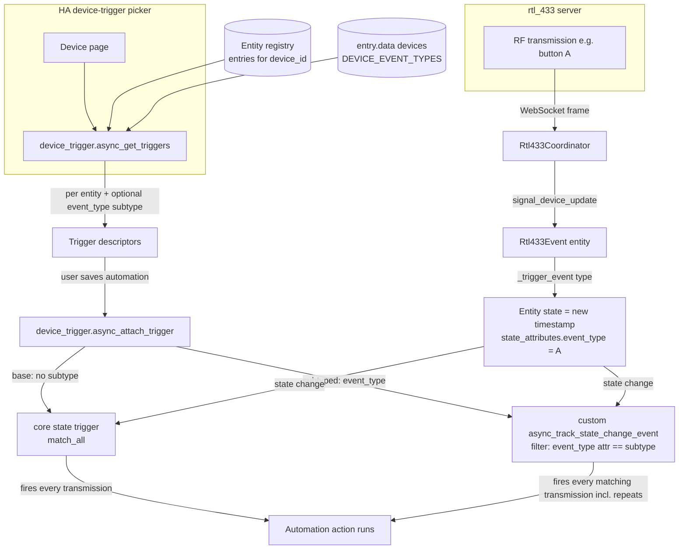
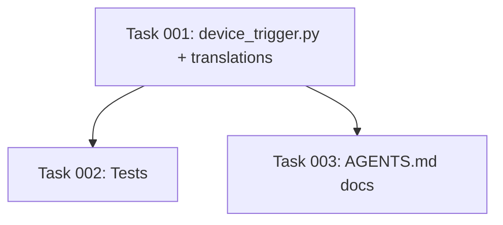

# Plan: Device triggers for rtl_433 event entities

## Original Work Order

> "Add Home Assistant device triggers for the integration's event entities (remote buttons, motion, doorbell), so users can build automations from the UI device-trigger picker (e.g. 'When <device> button pressed') instead of hand-writing event/state triggers. Triggers only — no device conditions or actions."

## Plan Clarifications

| # | Question | Resolution / Assumption |
|---|----------|-------------------------|
| 1 | Trigger granularity: per event ENTITY, or per (entity, event_type) subtype? | **One trigger per event entity, with `event_type` as an OPTIONAL subtype** sourced from the persisted `event_types` list. Rationale below (Architectural Approach → Trigger granularity). |
| 2 | What firing mechanism backs the trigger — a custom event bus event, or the entity's state change? | **Split by necessity, no new event-bus event invented.** The **base** (un-subtyped) trigger delegates to the core `state` trigger (match_all) on the event entity — `Rtl433Event` writes a fresh ISO timestamp `state` on **every** genuine transmission (`event/__init__.py:144-185`), so match_all fires once per transmission. The **subtyped** (`event_type`) trigger does **not** use the core state trigger's `attribute`+`to` filter, because that filter early-returns when `old_value == new_value` (`triggers/state.py:158`) and would drop consecutive same-value presses (button A then A → one fire). Instead the subtyped path uses a direct `async_track_state_change_event` listener that fires whenever the new state's `event_type` attribute equals the subtype — every matching transmission, repeats included (see Clarification #8 and Component 1). |
| 3 | How is a HA `device_id` mapped back to the integration's entities? | Resolve via the **entity registry** filtered to this integration's domain and the device: `er.async_entries_for_device(registry, device_id)` then keep `entry.domain == "event"` and `entry.platform == DOMAIN`. The nested RF device is a normal device-registry device (`{DOMAIN: f"{hub_entry_id}:{device_key}"}`, `entity.py:120-126`), so no hub-specific lookup is needed — the registry already links entities to the device. |
| 4 | Should `event_type` subtypes use the live entity state attribute or the persisted list? | The **persisted list** in `entry.data[CONF_DEVICES][device_key][DEVICE_EVENT_TYPES][field_key]` (`const.py:82`, written by `async_upsert_event_types`, `entity.py:338`). It survives restarts and is populated even when the entity hasn't fired this session; the live `event_types` capability attribute is an acceptable fallback when the entity is loaded. |
| 5 | Are device conditions / actions in scope? | **No.** Triggers only — explicitly out of scope per the work order. No `condition`/`action` keys in the new `device_trigger.py`, no `async_get_conditions`/`async_get_actions`. |
| 6 | New entity-blocking platform listing required? | `device_trigger` is **not** an entity platform; it is discovered by HA's device-automation machinery purely by the module's presence at `custom_components/rtl_433/device_trigger.py` (`DeviceAutomationType.TRIGGER` → module name `device_trigger`, `device_automation/__init__.py:86-87`). It must **not** be added to `PLATFORMS` in `const.py`. |
| 7 | Are `event_type` subtypes in scope? The work order doesn't mention them. | **Yes — keep optional per-`event_type` subtypes** (user decision, 2026-05-27 refinement). They enrich the multi-valued `button` case; `motion`/`secret_knock` are effectively single-valued and rely on the base trigger. |
| 8 | Must a subtyped trigger fire on every matching press, or only on a transition into that type? | **Every matching press**, including consecutive same-value repeats (user decision, 2026-05-27 refinement). The core state trigger cannot do this (`triggers/state.py:158` dedupes same-value), so the subtyped path uses a custom `async_track_state_change_event` listener (Component 1). This is the highest-fidelity option and the small extra code is explicitly accepted. |
| 9 | User-facing README note? | **No — AGENTS.md only** (user decision, 2026-05-27 refinement). Document the durable contract for contributors; no README change. |
| 10 | Picker label wording? | **Generic "triggered"** (user decision, 2026-05-27 refinement): the base reads `"{entity_name} triggered"`; the subtyped reads `"{entity_name} triggered: {subtype}"`, where `{subtype}` is the raw runtime `event_type`. **No** `trigger_subtype` block — codes are discovered at runtime and the HA frontend falls back to the raw `subtype` value. |

## Executive Summary

The integration already exposes momentary RF transmissions (remote buttons, motion, doorbell) as Home Assistant `event` entities (`Rtl433Event`, `event.py`), but users who want to automate on them must hand-write a `state` or `event` trigger in YAML. This plan adds a **device-automation trigger platform** (`custom_components/rtl_433/device_trigger.py`) so those triggers appear in the UI device-trigger picker — e.g. "When <device> Button pressed" — selectable from the device page with no YAML.

The approach mirrors Home Assistant core's entity-backed device-trigger pattern (`sensor`/`binary_sensor` `device_trigger.py`): `async_get_triggers` enumerates the device's `event` entities from the entity registry and returns one **base** trigger per entity plus one optional **subtyped** trigger per persisted `event_type`. Firing is split by necessity. The base trigger delegates to the core `state` trigger (match_all): because an `EventEntity` writes a brand-new timestamp state on every fire, it fires exactly once per genuine transmission. The subtyped trigger **cannot** reuse the core state trigger's `attribute`/`to` filter — that filter drops consecutive same-value presses (`triggers/state.py:158`, `old_value == new_value` early-return), so button A pressed twice would fire only once. Because the requirement is to fire on **every** matching press (Clarification #8), the subtyped path instead uses a direct `async_track_state_change_event` listener that fires on every transmission whose `event_type` attribute matches the subtype. No new event-bus contract is introduced; the available subtypes are read from the already-persisted `DEVICE_EVENT_TYPES` map so they survive restarts.

This is deliberately minimal: triggers only (no conditions, no actions), reusing the integration's existing persisted state and HA's trigger primitives, plus one small custom state-change listener for the subtyped path. The benefit is a discoverable, no-YAML automation UX for the three event device classes — with per-event_type narrowing for multi-valued remotes — while keeping the surface area and maintenance cost low.

## Context

### Current State vs Target State

| Current State | Target State | Why? |
|---|---|---|
| `Rtl433Event` entities exist (`event.py`) for `button`/`motion`/`secret_knock` (`device_library/events.yaml`) and fire on each transmission, but there is **no** `device_trigger.py`. | A `custom_components/rtl_433/device_trigger.py` exposes one device trigger per event entity. | The UI device-trigger picker only offers triggers an integration explicitly registers via the device-automation platform. |
| To automate on a button/motion/doorbell, a user must hand-author a `state`/`event` trigger and know the entity_id and `event_type`. | A user picks "When <device> Button pressed" from the device page; an optional subtype narrows to a specific `event_type`. | Removes the need to know entity_ids and event payload values; matches the discoverable UX of mature integrations. |
| Observed `event_types` are persisted per device-field (`DEVICE_EVENT_TYPES`, `const.py:82`; written by `async_upsert_event_types`, `entity.py:338`) but consumed only by the entity for `_trigger_event` validation. | The same persisted list is read by `async_get_triggers` to enumerate optional `event_type` subtypes. | Reuses existing persisted state — no new storage, and subtypes are available even before the entity fires this session. |
| `translations/en.json` has no `device_automation` block. | `translations/en.json` gains a `device_automation.trigger_type` block with a base type (`"{entity_name} triggered"`) and a subtyped type (`"{entity_name} triggered: {subtype}"`). **No** `trigger_subtype` block — `event_type` codes are runtime values, so the frontend substitutes the raw `subtype`. | The picker shows localized, human-readable trigger names instead of raw keys. |
| No `tests/test_device_trigger.py`. | A new `tests/test_device_trigger.py` covers enumeration and end-to-end firing. | Locks the contract: triggers are discoverable and fire when the event entity emits. |

### Background

- **Hub + nested-devices model.** This is an rfxtrx-style integration: one config entry per rtl_433 server (the hub), and each decoded RF device is a **device-registry device nested under the hub entry** with identifiers `{DOMAIN: f"{hub_entry_id}:{device_key}"}` and `via_device` set to the hub (`entity.py:120-126`; AGENTS.md "Config-entry model"). A device trigger receives a HA `device_id`, which the entity registry already links to that device's entities — so mapping back is a registry query, not a bespoke hub walk.
- **Event firing mechanism (verified).** `Rtl433Event._handle_dispatch` (`event.py:77-110`) calls `EventEntity._trigger_event(event_type)`. Core's `_trigger_event` (`.venv/.../components/event/__init__.py:144-152`) stamps `__last_event_triggered = utcnow()` and `__last_event_type = event_type`; `state` returns that timestamp's ISO string (always new per fire) and `state_attributes` returns `{ATTR_EVENT_TYPE: <type>}` (`__init__.py:173-185`). Therefore every genuine transmission is a distinct state change carrying the event type — exactly what a core `state` trigger keys on. A doorbell pressed twice fires two state changes (identity dedupe in `event.py:88-89` only suppresses the watchdog re-dispatch, not genuine repeats).
- **No core `event` device_trigger to copy verbatim.** The HA `event` component ships no `device_trigger.py`, but `sensor`/`binary_sensor` provide the canonical "enumerate registry entities for the device, delegate to a core trigger" shape (`.venv/.../components/sensor/device_trigger.py:160-300`). This plan follows that shape, delegating to the **state** trigger rather than `numeric_state`.
- **Persisted event types.** `async_upsert_event_types` (`entity.py:338-365`) stores a sorted union per `field_key` under `entry.data[CONF_DEVICES][device_key][DEVICE_EVENT_TYPES]`. This is the authoritative, restart-surviving source for subtype enumeration.

## Architectural Approach

The work is a single new module plus localization and tests. No source changes to `event.py`, the coordinator, or the devices-map writers are required — the trigger consumes existing state and entities.

### Component 1 — `device_trigger.py` platform module

**Objective**: Make the integration's event entities appear as UI-pickable device triggers and wire them to the running automation engine.

- **`async_get_triggers(hass, device_id)`** enumerates the device's event entities via the entity registry: `er.async_entries_for_device(er.async_get(hass), device_id)` filtered to `entry.domain == "event"` **and** `entry.platform == DOMAIN` (so only this integration's event entities are offered, never event entities from other integrations sharing the device — which cannot happen here but is the correct guard). For each entity it returns a base trigger descriptor (`platform: "device"`, `domain: DOMAIN`, `device_id`, `entity_id: entry.id`, plus a `type` identifying the event-entity trigger). It then reads the persisted `DEVICE_EVENT_TYPES` for that field (parsing the entity's `unique_id`/registry record to recover `device_key` + `field_key`, with the live `event_types` capability attribute as a fallback) and emits one **optional subtyped** descriptor per known `event_type` (carrying `subtype: <event_type>`) in addition to the un-subtyped "any" trigger.
- **`async_attach_trigger(hass, config, action, trigger_info)`** branches on whether the config carries a `subtype`:
  - **No subtype (base trigger)**: build a core state-trigger config (`platform: "state"`, `entity_id: config[CONF_ENTITY_ID]` — the schema stores an entity-id-or-uuid per `cv.entity_id_or_uuid`, which the core trigger resolves) and delegate to `homeassistant.components.homeassistant.triggers.state` (`async_validate_trigger_config` then `async_attach_trigger(..., platform_type="device")`). match_all fires on every distinct state, i.e. every transmission. This mirrors `sensor/device_trigger.py:235-257` (swapping `numeric_state` for `state`).
  - **With subtype (`event_type`)**: resolve `config[CONF_ENTITY_ID]` to a concrete `entity_id` via the entity registry (`async_get_entity_registry_entry_or_raise(hass, config[CONF_ENTITY_ID]).entity_id`, as `sensor/device_trigger.py:306` does), then attach `async_track_state_change_event(hass, [entity_id], listener)`. The `@callback` listener fires the action whenever `new_state is not None and new_state.attributes.get(ATTR_EVENT_TYPE) == subtype`. It must **not** early-return on `old == new` — that is exactly the core-state-trigger dedupe (`triggers/state.py:158`) we are avoiding — so button A pressed twice fires twice (Clarification #8). `ATTR_EVENT_TYPE` (`"event_type"`) is imported from `homeassistant.components.event.const`.
  - **Both paths wire the automation payload the same way the core state trigger does**: wrap `action` in a `HassJob` and invoke `hass.async_run_hass_job(job, {"trigger": {**trigger_info["trigger_data"], "platform": "device", "entity_id": entity_id, "description": ...}}, event.context)`, so the action receives a normal `device`-platform trigger with the right context (the core delegation does this automatically; the custom listener must replicate it).
- **`TRIGGER_SCHEMA` / `async_validate_trigger_config`** extend `DEVICE_TRIGGER_BASE_SCHEMA` with the required `entity_id` and `type`, plus the optional `subtype`, validated against this integration's known trigger type(s).
- **Discovery, not a platform forward.** The module is found by HA's device-automation machinery purely by file presence (`DeviceAutomationType.TRIGGER` → `device_trigger`, `device_automation/__init__.py:86-87`). It must **not** be added to `const.py` `PLATFORMS`.

### Component 2 — Trigger granularity decision

**Objective**: Pick the granularity that is discoverable yet maintainable, and justify it against the dynamic `event_types`.

- **Decision**: one device trigger **per event entity** (e.g. "Button", "Motion", "Doorbell"), with `event_type` offered as an **optional subtype** (e.g. "Button A"). The un-subtyped trigger fires on any transmission of that entity; a subtyped trigger fires only for a specific persisted `event_type`.
- **Justification**:
  - `motion` and `secret_knock` are effectively single-valued (one momentary value), so a per-entity trigger is the natural and complete unit; subtypes add little there.
  - `button` is multi-valued and its codes are **discovered at runtime** and only persisted after first observed (`event.py:96-108`). Forcing per-(entity, type) triggers would mean a button never pressed yet exposes **no** trigger at all — a poor first-run UX. A per-entity trigger is always available immediately; subtypes enrich it once codes are known.
  - This mirrors the core entity-backed pattern where the entity is the unit and refinements are optional fields, keeping the schema small.
- **Scope note**: subtypes are confirmed in scope (Clarification #7) and must fire on every matching press (Clarification #8) — see Component 1 for why this forces a custom listener on the subtyped path rather than the core state trigger's `attribute`/`to` filter.

### Component 3 — Localization (`translations/en.json`)

**Objective**: Show human-readable, localized names in the picker.

- Add a top-level `"device_automation"` block with a `"trigger_type"` map holding **two** types (Clarification #10, generic "triggered" wording): a base type rendered `"{entity_name} triggered"` and a subtyped type rendered `"{entity_name} triggered: {subtype}"`. Do **not** add a `"trigger_subtype"` block: `event_type` codes (e.g. button `"A"`) are discovered at runtime and cannot be pre-enumerated, and the HA frontend substitutes the raw `subtype` value into `{subtype}` when no `trigger_subtype` translation exists (mirrors the `mqtt`/`zha` `device_automation` shape). The integration ships only `translations/en.json` (no `strings.json`), so the block goes there. No new platform strings or config-flow changes.

### Component 4 — Tests (`tests/test_device_trigger.py`)

**Objective**: Lock the contract end-to-end with `pytest-homeassistant-custom-component`, reusing the existing `hub_entry_builder` / `_setup_hub` / `_feed` harness (`tests/conftest.py`, `tests/test_lifecycle.py`).

- **Enumeration**: set up a hub seeded with an event-bearing device (e.g. `{device_key: {model, fields: ["button"], event_types: {"button": ["A","B"]}}}`), resolve the nested device in the device registry by `{DOMAIN: f"{hub_entry_id}:{device_key}"}`, and assert `async_get_triggers(hass, device_id)` returns the per-entity trigger (and the expected `event_type` subtypes from the persisted list).
- **Firing**: attach a trigger via the automation engine (or `async_attach_trigger`), feed events through the coordinator (`_feed`), `await hass.async_block_till_done()`, and assert on a captured calls list. Cover three cases:
  - (a) the **base** trigger fires once per transmission **including a consecutive same-value repeat** (feed button `A` then `A` → two fires);
  - (b) a **subtyped** trigger (`subtype: A`) fires on **every** matching transmission, again including a same-value repeat (`A`, `A` → two fires) — this is precisely the behavior the custom listener exists to provide and where delegating to the core state trigger would fail;
  - (c) a subtyped trigger does **not** fire for a non-matching `event_type` (feed `B`; the `A`-subtyped trigger stays silent).
- **Harness note**: `hub_entry_builder` is a shared fixture in `tests/conftest.py:102`, but `_setup_hub`/`_feed` are **module-local** helpers in `tests/test_lifecycle.py:83-110`, not injectable fixtures. The new test must import them (`from tests.test_lifecycle import _setup_hub, _feed`) or promote them to `conftest.py`; do not assume they are available by fixture injection.

### Diagram

## Risk Considerations and Mitigation Strategies

Technical Risks

- **Subtyped trigger silently misses same-value repeats**: the obvious implementation — delegate the subtyped trigger to the core state trigger with `attribute: event_type` + `to: <type>` — drops consecutive same-value presses, because `triggers/state.py:158` early-returns when `old_value == new_value`. Button A pressed twice would fire only once, violating the "fire on every matching press" requirement (Clarification #8).
    - **Mitigation**: the subtyped path uses a custom `async_track_state_change_event` listener that fires on every state change whose `event_type` attribute matches, with **no** same-value dedupe (Component 1). The firing test asserts that a same-value repeat fires twice for **both** the base and subtyped triggers.
- **Custom listener drops automation context/variables**: a hand-rolled listener that just calls `action()` denies the action its trigger payload and context, breaking templates/`trigger.*` in the automation.
    - **Mitigation**: mirror the core state trigger — wrap `action` in a `HassJob` and invoke `hass.async_run_hass_job(job, {"trigger": {**trigger_data, "platform": "device", "entity_id": entity_id, ...}}, event.context)` so the action sees a normal `device`-platform trigger.
- **Watchdog re-dispatch must not fire**: a stale re-dispatch must not look like a transmission.
    - **Mitigation**: `Rtl433Event` re-dispatch keeps the same object and does **not** call `_trigger_event` (`event.py:88-90`), so the entity's timestamp `state` is unchanged and HA emits no `state_changed` event — neither the base state trigger nor the custom listener fires. Genuine transmissions stamp a fresh `utcnow()` each time (`event/__init__.py:144-152`), so each is a distinct new state.
- **Recovering `device_key`/`field_key` from a registry entity**: subtype enumeration needs to map an entity back to its `DEVICE_EVENT_TYPES` slot.
    - **Mitigation**: the `unique_id` is `f"{hub_entry_id}:{device_key}:{object_suffix}"` (`entity.py:107`) and `object_suffix` for events equals the field key (`events.yaml`); parse it, or fall back to the entity's live `event_types` capability attribute. The test seeds `event_types` so the persisted path is exercised.
- **Localization placeholder mismatch**: a `{entity_name}`/`{subtype}` placeholder that HA does not provide renders blank; and a `trigger_subtype` block listing fixed codes would be wrong here because `event_type` codes are dynamic.
    - **Mitigation**: follow the exact placeholder names HA's frontend supplies for device-automation trigger strings (as used by `mqtt`/`zha`), verified against core `strings.json`. Use only `trigger_type` (base + subtyped) and rely on the frontend's raw-`subtype` fallback for the runtime `event_type` value — no `trigger_subtype` block (Clarification #10).

Implementation Risks

- **Accidentally adding conditions/actions (scope creep)**: device-automation modules commonly co-locate all three.
    - **Mitigation**: implement triggers only; do not define `async_get_conditions`/`async_get_actions` or condition/action schemas (Clarification #5).
- **Adding `device_trigger` to `PLATFORMS`**: would break setup, since it is not an entity platform.
    - **Mitigation**: leave `const.py` `PLATFORMS` unchanged; rely on file-presence discovery (Clarification #6).

## Success Criteria

### Primary Success Criteria

1. A new `custom_components/rtl_433/device_trigger.py` exists implementing `async_get_triggers` and `async_attach_trigger` (plus trigger schema/validation), exposing **triggers only** — no conditions, no actions, and `const.py` `PLATFORMS` is unchanged.
2. For a nested RF device that has a `button` (and/or `motion`/`doorbell`) event entity, `async_get_triggers(hass, device_id)` returns one base trigger per event entity, plus one subtyped trigger per persisted `event_type`.
3. An attached **base** trigger fires its automation action once for each genuine transmission of the event entity (including a consecutive same-value repeat). An attached **subtyped** trigger fires on **every** transmission whose `event_type` matches — same-value repeats included — and never for a non-matching `event_type`.
4. `translations/en.json` contains a `device_automation.trigger_type` block with a base type (`"{entity_name} triggered"`) and a subtyped type (`"{entity_name} triggered: {subtype}"`); there is **no** `trigger_subtype` block (runtime codes use the frontend's raw fallback).
5. `tests/test_device_trigger.py` passes under `uv run pytest tests/test_device_trigger.py`, covering enumeration and end-to-end firing (including a same-value repeat and a non-matching subtype).
6. The existing suite (`uv run pytest tests/`) stays green.

## Self Validation

Execute these concrete steps after implementation:

1. **Run the new test file**: `uv run pytest tests/test_device_trigger.py -v` and confirm enumeration and firing tests pass, including the same-value-repeat assertion for **both** the base and the subtyped trigger and the non-matching-subtype assertion.
2. **Run the full suite**: `uv run pytest --cov=custom_components/rtl_433 tests/` and confirm no regressions (the lifecycle/event tests still pass).
3. **Confirm discovery without platform forwarding**: grep `const.py` to verify `PLATFORMS` was not modified (`grep -n "PLATFORMS" custom_components/rtl_433/const.py`), and confirm `device_trigger.py` defines no `async_get_conditions`/`async_get_actions` (`grep -n "async_get_conditions\|async_get_actions" custom_components/rtl_433/device_trigger.py` returns nothing).
4. **Validate the registry mapping in a test/console**: in a test, register a hub with a `button` event device, resolve its `device_id` via `dr.async_get(hass).async_get_device(identifiers={(DOMAIN, f"{hub_entry_id}:{device_key}")})`, call `async_get_triggers(hass, device_id)`, and print/assert the returned descriptors include the per-entity trigger and the persisted `event_type` subtypes (A, B).
5. **Validate localization JSON**: `python3 -c "import json; d=json.load(open('custom_components/rtl_433/translations/en.json')); da=d['device_automation']; assert len(da['trigger_type'])>=2; assert 'trigger_subtype' not in da; print('ok')"` — confirms the base + subtyped `trigger_type` entries exist and no `trigger_subtype` block was added.
6. **(Optional, harness)** In the container/screenshot harness (`tests/integration/`), open a nested device's page and confirm the trigger(s) appear in the "When" device-trigger picker; capture a screenshot as evidence.

## Documentation

- **AGENTS.md**: Yes — add a short "Device triggers (`device_trigger.py`)" subsection documenting the durable contract: discovered by file presence (not a `PLATFORMS` entry), triggers-only (no conditions/actions), per-event-entity granularity with optional `event_type` subtype sourced from the persisted `DEVICE_EVENT_TYPES`, and the **split firing mechanism** — the base trigger delegates to the core `state` trigger (match_all), while the subtyped trigger uses a custom `async_track_state_change_event` listener that fires on every matching transmission (because the core state trigger's `attribute`/`to` filter dedupes same-value presses, `triggers/state.py:158`). Keep it contributor-facing, mirroring the existing "Event platform" section.
- **README.md**: No change (Clarification #9). The contract is documented for contributors in AGENTS.md only.
- **No** change to `docs/device-library.md` (the trigger is not a library/mapping concept).

## Resource Requirements

### Development Skills
- Home Assistant device-automation trigger platform conventions (`device_trigger.py`, `DEVICE_TRIGGER_BASE_SCHEMA`, delegating to core triggers).
- Home Assistant `EventEntity` semantics (state-per-fire, `event_type` attribute).
- The integration's hub + nested-device registry model and the `DEVICE_EVENT_TYPES` persistence path.
- `pytest-homeassistant-custom-component` test authoring.

### Technical Infrastructure
- The existing test harness (`uv`, `requirements_test.txt`, `tests/conftest.py` fixtures).
- HA core modules consumed: `homeassistant.components.device_automation`, `homeassistant.components.homeassistant.triggers.state` (base path), `homeassistant.helpers.event.async_track_state_change_event` (subtyped path), `homeassistant.components.event.const.ATTR_EVENT_TYPE`, `homeassistant.core.HassJob`, `homeassistant.helpers.entity_registry`.

## Notes

- This plan adds **no** new dispatcher signals, no new persisted keys, and no changes to `event.py` or the coordinator — it is purely additive (one module + localization + tests). The subtyped path's custom listener consumes only the existing public state machine (`async_track_state_change_event` + the entity's `event_type` state attribute), not coordinator internals.
- If, during implementation, recovering `field_key` from `unique_id` proves brittle, fall back to the entity's live `event_types` capability attribute for subtype enumeration; the base (un-subtyped) trigger does not depend on either and remains the always-available baseline.

### Change Log

- **2026-05-27 (refinement)**: Confirmed `event_type` subtypes are in scope (Clarification #7) and must fire on **every** matching press incl. consecutive same-value repeats (Clarification #8). Split the firing mechanism: base → core `state` trigger; subtyped → custom `async_track_state_change_event` listener, because the core state trigger's `attribute`/`to` filter early-returns on `old == new` (`triggers/state.py:158`) and would drop repeats. Revised the Executive Summary, Clarification #2, Component 1, the diagram, the Technical Risks, Success Criteria #2–#4, and Self Validation accordingly.
- **2026-05-27 (refinement)**: Set picker wording to generic `"{entity_name} triggered"` / subtyped `"… : {subtype}"`; dropped any `trigger_subtype` block (runtime codes use the frontend's raw fallback) — Clarification #10.
- **2026-05-27 (refinement)**: Dropped the README change; AGENTS.md only — Clarification #9.
- **2026-05-27 (refinement)**: Noted that `_setup_hub`/`_feed` live in `tests/test_lifecycle.py` (module-local), not `conftest.py`; the new test must import or promote them (Component 4 harness note).

## Execution Blueprint

**Validation Gates:**
- Reference: `.ai/task-manager/config/hooks/POST_PHASE.md`

### Dependency Diagram

### ✅ Phase 1: Implementation
**Parallel Tasks:**
- ✔️ Task 001: Implement `device_trigger.py` + `device_automation` translations

### ✅ Phase 2: Verification & Docs
**Parallel Tasks:**
- ✔️ Task 002: Tests for device triggers (depends on: 001)
- ✔️ Task 003: Document device triggers — AGENTS.md (depends on: 001)

### Execution Summary
- Total Phases: 2
- Total Tasks: 3

## Execution Summary

**Status**: ✅ Completed Successfully
**Completed Date**: 2026-05-28

### Results
- Added `custom_components/rtl_433/device_trigger.py`: `async_get_triggers` enumerates each device's `event` entities (base trigger `type: triggered`) plus per-`event_type` subtypes (`type: triggered_subtype`) from persisted `DEVICE_EVENT_TYPES`. Base path delegates to the core `state` trigger; subtyped path uses a custom `async_track_state_change_event` listener (no same-value dedupe) replicating the device-platform payload/context. Triggers only; not added to `PLATFORMS`.
- Added `device_automation.trigger_type` translations (base + subtyped; no `trigger_subtype`).
- Added `tests/test_device_trigger.py` (enumeration; base + subtyped fire on every press incl. same-value repeat; subtyped silent for non-matching type). Documented in AGENTS.md.
- Full suite: 111 passed; ruff check + format clean.

### Noteworthy Events
- Used two `type` values (`triggered`/`triggered_subtype`) so the picker renders the base vs subtyped wording distinctly (the HA frontend keys `trigger_type` by the `type` field). Same-value-repeat tests advance the clock 1s between presses so the event entity writes distinct timestamp states (a test artifact of back-to-back feeding, matching the existing lifecycle test pattern).

### Necessary follow-ups
- None.
