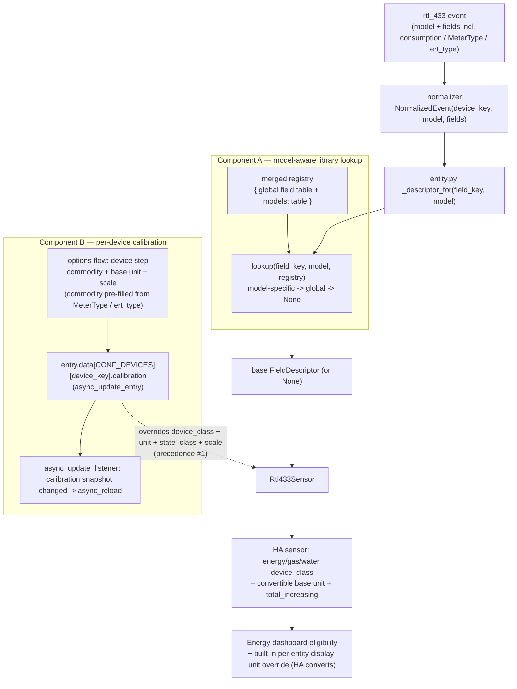
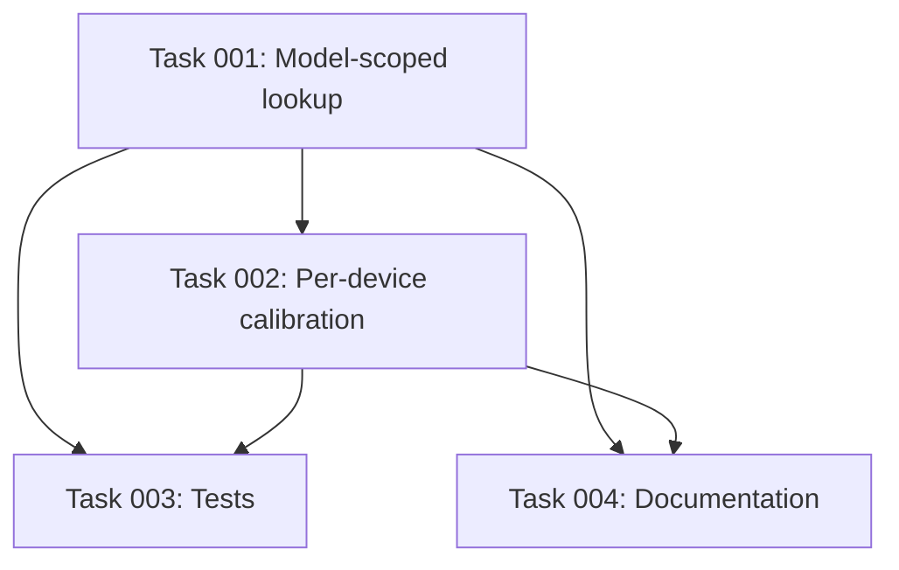

# Plan: Meter Units and Commodity — Energy-Dashboard-Eligible Utility-Meter Sensors

## Original Work Order

> "Make utility-meter consumption sensors (the consumption / consumption_data fields from SCM/ERT decoders) usable with proper units and in the Energy dashboard. Two complementary layers: (1) extend the device library so it can carry MODEL-SCOPED mappings that set device_class/unit/state_class/scale for models where the metadata is known from the model; and (2) add PER-DEVICE user calibration (commodity + base unit + scale) for the long tail, where the unit is meter-specific and cannot be derived from the RF signal. Pre-fill the commodity from decoded data when available."

## Plan Clarifications

| Question | Assumption / Decision |
| --- | --- |
| Can the unit/scale of the consumption counter be derived from the RF signal? | **No.** rtl_433 does not transmit the counter's unit or scale; the SCMplus decoder source even notes that some meter types report in 1 kWh units while others use 10 Wh units. So the unit/scale MUST be user-supplied for the general case. This is the entire premise of Component B. |
| Is the commodity (energy/gas/water) ever in the data? | Sometimes, heuristically. IDM/NetIDM/SCMplus emit a `MeterType` string (`"Electric"`/`"Gas"`/`"Water"`/`"unknown"`); the plainer ERT-SCM decoder emits a raw `ert_type` integer (commodity ≈ `ert_type & 0x0f`, utility-dependent). So commodity can be **pre-filled as a default hint** but the user must be able to override it. |
| Should this integration build its own unit-conversion engine (L↔gal, m³↔ft³, etc.)? | **No (YAGNI).** Attaching a real `device_class` + a convertible base unit + `state_class: total_increasing` makes the sensor Energy-dashboard-eligible AND unlocks HA's built-in per-entity display-unit override; HA does the conversion itself. The integration supplies only a one-time `{commodity, base unit, scale}`. |
| How is a calibration change applied to a live sensor? | By **reloading the hub entry**, detected in `_async_update_listener` (compare a calibration snapshot the coordinator captured at setup, then `await async_reload`) — mirroring the existing `manage_settings` reload-on-change (`__init__.py:257`) — **not** by calling `async_schedule_reload` in the flow and **not** by mutating a live entity. A sensor's `device_class`/unit/`state_class` are construction-time, so a rebuild is the supported way to re-derive them. *(Reload-trigger location decided in refinement.)* |
| Does recalibration preserve long-term statistics? | No, and that is **expected and acceptable**. The recalibrated entity keeps the same `unique_id`/`statistic_id`, so changing its native unit/`device_class` orphans the prior long-term statistics (and the first unitless→unit transition is a non-convertible change the recorder may flag once) **regardless of whether it is applied via reload or in place**. This is documented, not engineered around — reload is chosen for the construction-time reason above, not to dodge this. |
| Where do per-device calibration values live? | In the hub entry's `entry.data[CONF_DEVICES][device_key]` record, alongside the existing `timeout_override` (`const.py:74-82`, written by `config_flow.py:191-241`). This is the established single source of truth for per-device settings; no new Store is introduced. |
| What is the model-scoped library shape? | A new top-level `models:` mapping in a library YAML file: `model -> { field_key -> descriptor }`. The user-override file `rtl_433_mappings.yaml` supports the same `models:` block. The flat field-keyed top level is unchanged and remains the global default. |
| Does Component A change the existing flat-field schema or break existing YAML? | No. The `models:` key is **additive and optional**; every existing themed file and the existing flat top-level keys parse exactly as today. No backwards-compatibility break (per PRE_PLAN: do not add or break BC unrequested). |
| Which models ship as model-scoped examples? | **None speculative.** The premise is that a meter's consumption unit/scale is not knowable from the signal and varies per meter, so shipping a guessed mapping for a real model could silently mis-scale real Energy data. The schema is demonstrated with an **illustrative, non-real-model** worked example in `docs/device-library.md`; a real model-scoped consumption mapping ships only when that model's unit/scale is authoritatively known correct, and the catalog of such models is a follow-up. *(Decided in refinement.)* |
| Do `should_skip` / the skip-key set change? | No. Skip-keys remain global and field-keyed. Only descriptor lookup becomes model-aware. |
| Is a `strings.json` needed? | No. The repo ships only `translations/en.json`; new options-flow strings are added there, matching existing convention. |
| *(Refinement)* When five sources can describe the same field, what is the precedence? | **Specificity-first**: per-device calibration > model-scoped (user-override model > shipped model) > global (user-override global > shipped global) > unmapped. A model-scoped entry beats a global one *regardless of source*, so a **shipped** model-scoped entry outranks a **user-override global** entry. This is exactly what a single merged registry with a `model → global → None` lookup produces; the earlier draft's enumerated chain (which put user-global above shipped-model) was self-contradictory and is corrected here. |
| *(Refinement)* How is the Component A worked example shipped so it cannot mis-scale real data? | As an **illustrative, clearly-labeled, non-real-model** example in `docs/device-library.md` (and/or an example override snippet), exercising loader + model-aware `lookup` + the `entity.py` call site — never as a live shipped consumption mapping for a real model. See the "Which models ship" row. |
| *(Refinement)* Where is the calibration reload triggered? | In **`_async_update_listener`** (`__init__.py`): the device step's `async_update_entry` already fires that listener, so it detects a calibration-snapshot change and `await async_reload`s — one reload path, mirroring `manage_settings`. The flow step does **not** call `async_schedule_reload`; doing both would reload twice. The listener must compare against a coordinator-held snapshot so the *frequent* idempotent devices-map upserts (which also fire it) never trigger a reload. |
| *(Refinement)* Which field(s) does a per-device calibration apply to? | The **known consumption field keys** (`consumption` / `consumption_data`) the chosen device emits — not a generic any-field calibrator. A small constant set names them; the calibration overlay is applied only for those fields. |

## Executive Summary

The utility-meter consumption fields `consumption` (SCMplus) and `consumption_data` (SCM/ERT) are currently shipped as unitless `state_class: total_increasing` sensors with **no `device_class` and no unit** (`device_library/power_electrical.yaml:64-81`). This is a faithful port of the upstream HA example `rtl_433_mqtt_hass.py`, but it leaves the most valuable utility-meter readings ineligible for Home Assistant's Energy dashboard, because that dashboard requires a real energy/gas/water `device_class` and a convertible unit. The raw RF signal does **not** carry the counter's unit or scale (different meter types report in different granularities), so the missing metadata must come from somewhere other than the signal.

This plan supplies that metadata through two complementary layers. **Component A** extends the device library with an optional **model-scoped** lookup: a top-level `models:` table maps a specific rtl_433 `model` string to per-field descriptor overrides, so that for models where the unit/scale/commodity *is* known from the model, a correct `device_class` + convertible base unit + `state_class` + `scale` ship in the library and "just work" with no per-device configuration. **Component B** covers the long tail — meters whose unit is meter-specific and cannot be known from the model — with a **per-device calibration** step in the existing options flow that collects `{commodity, base unit, scale}` for one chosen device, pre-filling the commodity from the decoded `MeterType`/`ert_type` hint when present, and writing the result into the hub's per-device `entry.data[CONF_DEVICES]` map next to the existing timeout override.

The design deliberately leans on Home Assistant's own mechanics rather than reinventing them: attaching a real `device_class` plus a convertible base unit plus `state_class: total_increasing` is sufficient to make a sensor Energy-dashboard-eligible *and* to unlock HA's built-in per-entity display-unit override (HA converts L/gal/m³/ft³ itself). The integration therefore needs no conversion engine — only a one-time `{commodity, base unit, scale}` triple. Calibration scale reuses the existing `value_transform` scale machinery (`mapping.py:403-407`) and applies only to the device's known consumption field keys (`consumption` / `consumption_data`). Changes are applied by **reloading** the hub entry — detected in the existing `_async_update_listener` by comparing a coordinator-held calibration snapshot (the same place the `manage_settings` reload lives), *not* by an `async_schedule_reload` call in the flow — so entities rebuild cleanly with the new descriptor (a sensor's `device_class`/unit/`state_class` are construction-time). Recalibration orphans the prior long-term statistics; this is inherent to a non-convertible unit change and is documented as expected (reload neither causes nor avoids it). Component A is a self-contained first increment (schema + model-aware lookup + one illustrative worked example) shippable independently of Component B, and uses a **specificity-first** precedence chain so a model-scoped entry always beats a global one regardless of source.

## Context

### Current State vs Target State

| Current State | Target State | Why? |
| --- | --- | --- |
| `consumption` / `consumption_data` ship as unitless `total_increasing` sensors with `device_class: null` and `unit_of_measurement: null` (`device_library/power_electrical.yaml:64-81`). | Where the model is known, the shipped library carries a real `device_class` + convertible base unit + `scale` for these fields; otherwise the user can calibrate per device. | Without a real `device_class` + convertible unit, the readings are ineligible for the Energy dashboard — the headline goal. |
| The library registry is a flat `{field_key: FieldDescriptor}` table (`mapping.py:194-228`); `lookup(field_key, registry)` (`mapping.py:346-358`) is field-keyed and model-agnostic. | The registry additionally carries a model-scoped table; `lookup` becomes model-aware (`lookup(field_key, model, registry)`) and resolves model-specific → global → None. | The unit/scale/commodity for some meters is determinable from the model but differs *between* models, so one global field entry cannot serve them all. |
| `load_library`, `merge_overrides`, `load_user_overrides` only understand the flat field-keyed shape (`mapping.py:180-330`). | All three also parse and merge an optional top-level `models:` block; the user-override file `rtl_433_mappings.yaml` supports `models:` too. | The model-scoped layer must be expressible both in the shipped library and the per-installation override file. |
| `entity.py` `_descriptor_for` calls `lookup(field_key, registry)` with no model context (`entity.py:425-430`), even though it already knows the device `model`. | `_descriptor_for` passes the device's `model` into the model-aware `lookup`. | The model is already in scope at entity build; threading it into `lookup` is the only call-site change Component A needs. |
| The options-flow device step (`config_flow.py:191-241`) collects only an availability-timeout override per device. | The device step also collects `{commodity, base unit, scale}` for the chosen device. | The long tail of meters needs user-supplied metadata that no library entry can provide. |
| `Rtl433Sensor` sets `device_class`/`state_class`/`unit`/scale solely from the `FieldDescriptor` at construction (`sensor.py:57-61`). | For a calibrated consumption field, the sensor's `device_class` + native unit + `state_class` + scale come from the per-device calibration (effectively the highest-precedence override). | Per-device calibration must win over any library/global default for that one device. |
| Per-device settings live in `entry.data[CONF_DEVICES][device_key]` (`const.py:67-82`); the only sub-key today is `timeout_override`. | A new calibration sub-record (commodity/unit/scale) is stored in the same per-device record. | One established single source of truth for per-device config; no new storage mechanism (YAGNI). |
| A `manage_settings` change reloads the hub entry from `_async_update_listener` to rebuild entities (`__init__.py:253-257`). | A calibration change is detected the **same way** (calibration snapshot vs. the new entry data) in `_async_update_listener`, which reloads the hub entry so the consumption entity rebuilds with the new unit/class/scale. | A sensor's `device_class`/native unit/`state_class` are construction-time; a clean rebuild is the supported way to re-derive them. (The first unitless→unit change orphans prior statistics regardless of mechanism — expected.) |
| `docs/device-library.md` documents only the flat field-keyed schema and user override; the README has no utility-meter calibration section. | Docs describe the `models:` schema, the calibration step, the precedence chain, and the "recalibration orphans statistics" caveat. | The library doc is authoritative (AGENTS.md:295-300); the new schema and flow must be documented. |
| `tests/test_mapping.py` and `tests/test_config_flow.py` cover the current flat lookup and the timeout-override device step. | They additionally cover model-scoped lookup + precedence and the calibration step. | New behavior needs regression protection in the existing modules. |

### Background

- **The unit is not in the signal.** rtl_433 transmits the raw consumption counter but not its unit or scale; the SCMplus decoder source explicitly notes that some meter types transmit consumption in 1 kWh units while others use 10 Wh units. The general case therefore *requires* a user-supplied `{unit, scale}` — this is why Component B exists and why no scheme can derive it automatically for unknown models.
- **Commodity is a heuristic hint, not authoritative.** IDM/NetIDM/SCMplus decoders emit a `MeterType` string (`"Electric"`/`"Gas"`/`"Water"`/`"unknown"`); the plainer ERT-SCM decoder emits only a raw `ert_type` integer whose low nibble (`ert_type & 0x0f`) maps to a commodity via a hardcoded, utility-dependent switch. Hence commodity is **pre-filled as a default** but always user-overridable.
- **Faithful upstream port.** The two consumption fields were ported verbatim from the upstream `rtl_433_mqtt_hass.py` `mappings` table, which left them unitless `total_increasing` (`device_library/power_electrical.yaml:1-3, 64-81`). This plan corrects that without changing the upstream-derived semantics of other fields.
- **HA Energy-dashboard / display-unit mechanics (the key insight).** A sensor becomes Energy-dashboard-eligible when it has an energy/gas/water `device_class`, a convertible base unit for that class, and `state_class: total_increasing`. The same combination unlocks HA's built-in **per-entity display-unit override** (the user can flip a water meter from L to gal in the entity settings and HA converts). So the integration must supply only `{commodity → device_class, base unit, scale}`; it must **not** build its own conversion engine.
- **Why reload, not mutate.** A sensor's `device_class`, `native_unit_of_measurement` and `state_class` are established at construction; there is no supported way to re-derive them on a live entity, so the clean path is to rebuild the entity from a fresh descriptor by reloading the config entry. The integration already does exactly this for `manage_settings` changes via `await async_reload` inside `_async_update_listener` (`__init__.py:257`); calibration is detected and reloaded the **same way** (see Component B), not via a separate `async_schedule_reload` call in the flow. Recalibration orphans the prior long-term statistics for that entity, and the first time a previously-unitless consumption sensor gains a unit/`device_class` the recorder sees a non-convertible unit change (it may flag `units_changed` once) — this is inherent to HA, expected, and documented; reloading neither causes nor avoids it, so it is *not* the reason for choosing reload.
- **Loader internals to build on.** `FieldDescriptor` is a frozen dataclass (`mapping.py:48-69`); `_descriptor_from_entry` (`mapping.py:79-102`) builds one from a YAML mapping and ignores unknown attributes (so a `models:` top-level key would currently be parsed by `_load_descriptor_file` as if it were a *field* named `models` — Component A must intercept it before that). `load_library` globs `*.yaml`, skips `_`-prefixed files, and merges into a flat registry (`mapping.py:180-228`). `merge_overrides` (`mapping.py:251-284`) replaces whole entries and unions skip-keys. `apply_transform`/`_apply_sensor_transform` already implement `scale`/`offset`/`round`/`int`/`float` (`mapping.py:378-485`), so calibration scale is a `value_transform: { scale: N }`-equivalent.
- **Coordinator carries the last event per device.** `coordinator.devices: dict[str, NormalizedEvent]` (`coordinator/base.py:201`) holds the most recent `NormalizedEvent` per `device_key`, whose `.fields` contains `MeterType`/`ert_type` when the meter emitted them — this is what the config flow reads to pre-fill the commodity default. The flow already reads the per-device map and the running coordinator is reachable via `hass.data[DOMAIN]`.
- **Device step precedent.** `config_flow.py:191-241` already: aborts with `no_devices` when the map is empty, builds a device select from `entry.data[CONF_DEVICES]`, writes a per-device record via `async_update_entry(entry, data=...)`, and finishes without touching `entry.options`. Component B extends this exact step.
- **No source for the C decoders in this repo.** This repository is the HACS integration only (`custom_components/rtl_433`), not the rtl_433 C codebase, so the decoder facts above come from the established research in the work order rather than from local source; the integration consumes the decoded JSON fields, never the C.

## Architectural Approach

Two complementary layers sit between the rtl_433 JSON event and the Home Assistant sensor. Component A enriches the **library lookup** so descriptors can be model-specific; Component B adds a **per-device calibration** that overrides the descriptor for one device. A single explicit precedence chain ties them together. Both reuse existing machinery — the `FieldDescriptor`/`value_transform` model, the per-device `entry.data[CONF_DEVICES]` map, and the reload-on-change pattern — so no new storage, no conversion engine, and no new platform are introduced.

**Precedence chain (highest to lowest)** for resolving the descriptor of a given `field_key` on a given device of a given `model`. *Specificity-first: a model-scoped entry always outranks a global one regardless of source (decided in refinement — see Plan Clarifications).*

1. **Per-device user calibration** (Component B) — for the device's consumption field (the known `consumption` / `consumption_data` keys).
2. **Model-scoped entry** for `(model, field_key)` — the **user-override file** `models:` entry if present, otherwise the **shipped library** `models:` entry.
3. **Global field entry** for `field_key` — the **user-override file** flat top-level key if present, otherwise the **shipped library** flat top-level key (today's behavior).
4. **Unmapped / skip** → no entity.

This is exactly what the single merged registry produces: `lookup(field_key, model, registry)` returns the merged model-scoped entry for `(model, field_key)` if one exists, else the merged global entry for `field_key`, else `None`. `merge_overrides` makes the user-override file replace the shipped entry *within* each tier, so the four conceptual source-tiers — **user-model > shipped-model > user-global > shipped-global** — collapse into the two-step model→global lookup above, with the per-device calibration (Item 1) overlaid at sensor construction. Concretely, a **shipped** model-scoped entry therefore outranks a **user-override global** entry for a matching model. *(Refinement note: the earlier draft enumerated user-global above shipped-model, which contradicted this lookup; corrected to specificity-first.)*

### Component A — Model-scoped device-library lookup

**Objective**: Let the shipped library (and the user-override file) carry per-model descriptor overrides so meters whose unit/scale/commodity is known from the `model` get a correct, Energy-dashboard-eligible mapping with zero per-device configuration. This is the first, self-contained increment and is independently shippable.

- **Schema.** Add an optional top-level `models:` mapping to the library YAML, structured as `model -> { field_key -> descriptor }`, where each descriptor uses the **same attribute schema** as a flat entry (`platform`, `device_class`, `unit_of_measurement`, `state_class`, `name`, `object_suffix`, `value_transform`, etc. — `mapping.py:48-76`). The existing flat top-level keys remain the global defaults and are unchanged; `models:` is purely additive, so no existing file breaks. The `models:` block may appear in any themed file (most naturally `power_electrical.yaml`) and in the user-override file.
- **Registry shape.** Extend the loaded registry from a flat `{field_key: FieldDescriptor}` to additionally carry a model-scoped table, e.g. `{ <model>: { field_key: FieldDescriptor } }`. The exact container shape (a second dict alongside the flat one, or a small struct) is an implementation choice; the constraint is that `load_library`, `merge_overrides`, and `load_user_overrides` all produce and merge it, and `DATA_LIBRARY` (`const.py:89`) continues to hold the once-loaded result.
- **Parsing.** `_load_descriptor_file` (`mapping.py:128-145`) must recognize a top-level `models:` key and route it to a model-scoped parser instead of treating `models` as a field name. `merge_overrides` (`mapping.py:251-284`) must merge a `models:` block from the override file (model-scoped entries replace shipped model-scoped entries for the same `model`+`field_key`; the flat tier and `skip_keys` keep their current merge semantics). Malformed model-scoped entries are logged and skipped, matching the existing per-entry defensiveness.
- **Model-aware lookup.** Change the public `lookup` to accept the device `model`: `lookup(field_key, model, registry)`. Resolution order: the model-scoped entry for `(model, field_key)` if present, else the global flat entry for `field_key`, else `None`. The existing call site `entity.py:427` (`lookup(field_key, registry)` inside `_descriptor_for`) becomes model-aware by passing the `model` already in scope there (`entity.py` threads `model` through entity construction — `entity.py:91-119`).
- **Worked example (illustrative, not a real meter).** Because a meter's consumption unit/scale is not knowable from the RF signal and varies between meters, shipping a speculative consumption mapping for a *real* `model` string would silently mis-scale a real user's Energy data. The schema is therefore demonstrated end-to-end with a **clearly-labeled illustrative example that does not match any real meter model**, placed in `docs/device-library.md` (and/or an example override snippet) rather than as a live shipped mapping for a real model. The example maps a consumption field to `device_class: energy`, a convertible base unit (e.g. `kWh`), `state_class: total_increasing`, and a `scale`, exercising the loader + model-aware `lookup` + the `entity.py` call site without risking incorrect data for any real device. A *real* model-scoped consumption mapping is shipped only when a model's unit/scale is authoritatively known correct; that catalog is deferred (recorded in clarifications). *(Decided in refinement.)*

### Component B — Per-device calibration (commodity + base unit + scale)

**Objective**: Cover the long tail of meters whose unit is meter-specific and unknowable from the model, by letting the user calibrate one device's consumption sensor into a real Energy-dashboard-eligible sensor — without the integration owning any conversion logic.

- **Options-flow extension.** Extend the existing `async_step_device` (`config_flow.py:191-241`) so that, for the chosen device, it also collects: **commodity** (a select: none / energy / gas / water), **base unit** (constrained to units valid for the chosen commodity's `device_class`), and **scale** (a number that multiplies the raw counter). The device select, the `no_devices` abort, and the write-to-`entry.data[CONF_DEVICES]` mechanics are reused as-is; the calibration fields are added to the same per-device record alongside the existing `timeout_override`. The collected calibration applies to the device's **consumption field(s) only** — the known field keys `consumption` / `consumption_data` (a single named constant set) — not to arbitrary fields.
- **Commodity pre-fill.** When rendering the form, read the device's most recent event from the running coordinator (`coordinator.devices[device_key].fields`, `coordinator/base.py:201`) and derive a default commodity: map a `MeterType` string (`"Electric"`→energy, `"Gas"`→gas, `"Water"`→water, anything else→none) or, failing that, the `ert_type` low nibble, to the select's default. Absent any hint, default to none. The user can always override the pre-filled value.
- **Unit constraints.** Constrain the offered base units to those Home Assistant recognizes as convertible for the chosen commodity's `device_class` (energy → energy units, gas/water → volume units), so the resulting sensor is both Energy-dashboard-eligible and benefits from HA's built-in display-unit conversion. Selecting commodity = none clears the calibration (the field falls back to the library/global descriptor).
- **Sensor wiring.** When a device has a stored calibration and the field being built is one of the known consumption keys (`consumption` / `consumption_data`), the sensor (`Rtl433Sensor`, `sensor.py:45-71`) must take its `device_class` (derived from commodity), native unit (the base unit), `state_class` (`total_increasing`), and scale from the calibration rather than from the library descriptor — i.e. the calibration is precedence tier #1. The scale reuses the existing `value_transform` scale path (`mapping.py:403-407`) so the displayed value is the scaled counter (note the base `consumption`/`consumption_data` descriptors carry `value_transform: { int: true }`; adding a `scale` makes the transform float-valued, which is correct for an energy/volume reading). The cleanest realization is to resolve an effective descriptor for the consumption field by overlaying the calibration onto the looked-up base descriptor at construction time; the exact seam (in `_descriptor_for`/`_build` in `entity.py:425-449`, or in the sensor constructor) is an implementation choice constrained only by the precedence chain above. A commodity of `none` clears the calibration so the field falls back to the library/global descriptor.
- **Apply via reload (in the update listener, not the flow).** The device step writes the calibration record via `async_update_entry`, which already fires `_async_update_listener` (`__init__.py:232-264`) — the same listener that reloads on a `manage_settings` change. Extend that listener to detect a *calibration* change and `await hass.config_entries.async_reload(entry.entry_id)` so the affected device's entities are torn down and rebuilt with the new effective descriptor. The reload is triggered in **exactly one place** (the listener); the flow step does **not** also call `async_schedule_reload` (doing both would reload twice). Crucially, `_async_update_listener` fires on *every* `async_update_entry`, including the frequent idempotent devices-map upserts (`async_upsert_device` / `async_upsert_event_types`); to avoid a reload storm, the coordinator captures a **per-device calibration snapshot at setup** (analogous to `coordinator.manage_settings`) and the listener reloads only when the new effective calibration differs from that snapshot. Reload (rather than mutating a live entity) is required because `device_class`/`native_unit_of_measurement`/`state_class` are construction-time. Document that recalibration orphans the prior long-term statistics for the entity (expected) — the reload neither causes nor prevents that.
- **Localization.** Add the new device-step field labels/descriptions (commodity, base unit, scale) and any new select option labels to `translations/en.json` under `options.step.device` (which today carries `device` + `timeout_override` — `en.json` options block).

## Risk Considerations and Mitigation Strategies

Technical Risks

- **`models:` collides with the field-keyed parser.** `_load_descriptor_file` currently treats every top-level key as a field name, and `_descriptor_from_entry` silently ignores unknown attributes, so a naive `models:` block would be mis-parsed as a field called `models`.
    - **Mitigation**: Intercept the reserved `models:` (and reuse the existing `skip_keys` reserved-key precedent in `merge_overrides`, `mapping.py:274-276`) before per-field descriptor parsing, in both the library loader and the override merge.
- **Recalibration changes a sensor's fundamental descriptor.** `device_class`/`native_unit_of_measurement`/`state_class` cannot be re-derived on a live entity; mutating them in place is unsupported and would confuse the recorder mid-stream.
    - **Mitigation**: Never mutate at runtime; apply calibration by reloading the hub entry (detected in `_async_update_listener`, `await async_reload`, matching the `manage_settings` precedent, `__init__.py:257`) so the entity is rebuilt from a fresh descriptor. Note this does *not* avoid the inherent statistics-orphaning / one-time `units_changed` flag on the first unitless→unit transition (the `unique_id`/`statistic_id` are unchanged across reload) — that is accepted and documented, not the reason reload is chosen.
- **Reload storms from the shared update listener.** `_async_update_listener` fires on *every* `async_update_entry`, including the frequent idempotent devices-map upserts (`async_upsert_device` / `async_upsert_event_types`). A naive "reload because the device step ran" would reload on unrelated writes, churning the WebSocket and entities.
    - **Mitigation**: Capture a per-device calibration snapshot on the coordinator at setup (analogous to `coordinator.manage_settings`) and reload only when the new effective calibration differs from that snapshot — never on routine upserts.
- **Non-convertible base unit breaks Energy-dashboard eligibility.** A free-text unit that HA does not recognize as convertible for the device_class would silently fail to appear in the Energy dashboard.
    - **Mitigation**: Constrain the base-unit selector to HA-recognized convertible units for the chosen commodity's device_class; do not allow arbitrary unit strings.

Implementation Risks

- **Lookup signature change ripples to call sites.** Changing `lookup(field_key, registry)` → `lookup(field_key, model, registry)` touches `entity.py:427` and any test that calls `lookup` directly.
    - **Mitigation**: There is exactly one production call site (`entity.py` `_descriptor_for`, which already has `model` in scope); update it and the `tests/test_mapping.py` callers in lockstep. Keep the default-registry fallback behavior of `lookup` (`mapping.py:356-358`) intact.
- **Precedence ambiguity between calibration, override file, and shipped model/global tiers.** Five sources can describe the same field; an unclear order produces surprising results — and the earlier draft's enumerated chain contradicted its own merged-registry lookup.
    - **Mitigation**: The contract is now **specificity-first** (calibration > model-scoped [user > shipped] > global [user > shipped] > unmapped), which is exactly what the single merged registry + `model→global` lookup yields. Tests assert each tier wins over the one below it, including the decisive case that a *shipped* model-scoped entry beats a *user-override global* entry for a matching model.
- **Commodity pre-fill reads a field that may be absent or stale.** `MeterType`/`ert_type` may not be present on the last event, or the coordinator may have no event yet.
    - **Mitigation**: Treat pre-fill as a best-effort default (fall back to none); never block the form or raise if the hint is missing.

Quality / Data Risks

- **Recalibration orphans long-term statistics.** Changing the native unit/device_class abandons the entity's prior statistics.
    - **Mitigation**: This is inherent to HA and accepted; document it clearly in `docs/device-library.md` and the README so users recalibrate intentionally.
- **Backwards-compatible parsing of existing libraries.** A loader change risks breaking the existing flat files.
    - **Mitigation**: `models:` is additive and optional; existing files and the flat top-level keys parse unchanged. Add a regression test asserting an existing themed file still loads identically.

## Success Criteria

### Primary Success Criteria

1. A library `models: { <model>: { <field_key>: <descriptor> } }` entry overrides the **global** field descriptor for a matching device `model` and leaves the global descriptor in effect for all other models (verified via `lookup(field_key, model, registry)`).
2. The full precedence chain resolves correctly (**specificity-first**): per-device calibration > model-scoped (user-override model-scoped > shipped model-scoped) > global (user-override global > shipped global) > unmapped. In particular, a *user-override* model-scoped entry beats a *shipped* model-scoped entry, and a *shipped* model-scoped entry beats a *user-override global* entry for a matching model.
3. A per-device calibration `{commodity, base unit, scale}` produces a sensor whose `device_class` (energy/gas/water), native unit (the base unit), `state_class` (`total_increasing`), and value (raw counter × scale) all reflect the calibration — and the entity survives a hub reload.
4. The options-flow device step pre-fills the commodity default from a decoded `MeterType` string or `ert_type` integer when one is present on the device's last event, and lets the user override it.
5. The shipped library includes at least one worked model-scoped consumption example that is Energy-dashboard-eligible (real `device_class` + convertible base unit + `total_increasing`).
6. Existing themed library files and the existing flat field-keyed lookup behavior are unchanged (no regression for non-meter fields).

## Self Validation

After all tasks are complete, an LLM should execute these concrete checks:

1. **Model-scoped overrides global, scoped to model.** In a Python REPL against the package, call `load_library()` to get the base registry, then merge a synthetic `models:` block for an **illustrative** model string via `merge_overrides` (the shipped library intentionally carries no speculative real-meter consumption mapping — see clarifications). Call `lookup("consumption_data", "<illustrative-model>", merged)` and assert the returned descriptor has the model-scoped `device_class`/unit/`state_class`/`value_transform`; call `lookup("consumption_data", "Some-Other-Model", merged)` and assert it returns the **global** unitless descriptor (the `consumption_data` entry in `power_electrical.yaml`). Confirm `lookup("temperature_C", "<illustrative-model>", merged)` is unaffected (still the global temperature descriptor) to prove non-meter fields don't regress.
2. **Precedence chain (specificity-first).** Build a base registry that includes a *shipped* `models:` entry for `(M, F)`, plus a synthetic user-override dict with a user `models:` entry for `(M, F)` and a user flat entry for `F`; run `merge_overrides`. Assert `lookup(F, M, merged)` returns the **user model-scoped** entry (user-model > shipped-model); drop the user model entry and assert `lookup(F, M, merged)` still returns the **shipped model-scoped** entry even though a user *global* entry for `F` exists (shipped-model > user-global — the decisive specificity-first case); and assert `lookup(F, "Other", merged)` returns the user global entry. Then assert a per-device calibration overlay (Component B) wins over all of them for the calibrated device.
3. **Calibration produces the right sensor and survives reload.** Drive the options flow `async_step_device` (as `tests/test_config_flow.py` already drives flows) selecting a device and submitting `{commodity: water, base unit: <convertible volume unit>, scale: 0.1}`; assert the per-device record in `entry.data[CONF_DEVICES][device_key]` contains the calibration and that the resulting `async_update_entry` causes `_async_update_listener` to reload the hub entry (calibration snapshot differed). Assert that an *unrelated* devices-map upsert does **not** trigger a reload (snapshot unchanged). After a (simulated) reload, build the device's entities and assert the consumption `Rtl433Sensor` reports `device_class == water`, the chosen native unit, `state_class == total_increasing`, and that `apply_transform`/the effective transform yields `raw × 0.1`.
4. **Commodity pre-fill.** Seed the coordinator's `devices[device_key]` last event with `MeterType: "Gas"` (and separately with an `ert_type` integer whose low nibble denotes gas), open the device step, and assert the rendered form's commodity default is `gas`; with no hint present, assert the default is `none`.
5. **YAML validity.** Run the library YAML validation one-liner from `docs/device-library.md:218-220` and confirm every `*.yaml` (including the new `models:` block) parses with `ok`.
6. **Full suite.** Run the project unit-test suite (per AGENTS.md "Running the unit tests") and confirm `tests/test_mapping.py` and `tests/test_config_flow.py` (plus any normalizer/coordinator touch) pass.

## Documentation

- **`docs/device-library.md`** (authoritative): add a section documenting the `models:` model-scoped schema (structure, that it is additive/optional, the same per-field attribute schema), the model-aware lookup resolution order, and the **specificity-first** precedence chain (model-scoped beats global regardless of source; the user file beats the shipped library *within* each tier). Document the user-override file's `models:` support, and include the **illustrative, non-real-model worked example** here so the schema is demonstrated without shipping a speculative consumption mapping for a real meter.
- **`README.md`**: add/extend a utility-meter section describing the per-device calibration step (commodity + base unit + scale), how it makes the consumption sensor Energy-dashboard-eligible, that HA does its own display-unit conversion once a convertible base unit is set, and the caveat that recalibration orphans prior long-term statistics.
- **`AGENTS.md`**: add a short note under the "Device-library YAML format (summary)" / per-device settings sections pointing to the model-scoped `models:` block, the calibration sub-record in `entry.data[CONF_DEVICES]`, the specificity-first precedence chain, and that calibration reloads via `_async_update_listener`, deferring full detail to `docs/device-library.md`.
- **`translations/en.json`**: new `options.step.device` field labels/descriptions for commodity, base unit, and scale (and any select option labels).

This plan **does** update documentation (`docs/device-library.md`, `README.md`, `translations/en.json`) **and AGENTS.md** as described above.

## Resource Requirements

### Development Skills

- Home Assistant integration internals: config/options flows, `SelectSelector`, config-entry data vs options, the entry update-listener reload pattern (`entry.add_update_listener` → `async_reload`), sensor `device_class`/`state_class`/native-unit semantics, and the recorder's unit-change/long-term-statistics behavior.
- The integration's data-driven device-library model (`mapping.py`) and entity-build path (`entity.py`, `sensor.py`).
- YAML schema design and PyYAML parsing edge cases (e.g. the reserved-key interception, the `on`/`off` boolean-key quirk noted in `mapping.py:105-125`).

### Technical Infrastructure

- The existing Python test harness (`tests/test_mapping.py`, `tests/test_config_flow.py`, `tests/conftest.py` fixtures) and the pinned Home Assistant test environment.
- No new third-party dependencies; HA's built-in unit-conversion and Energy-dashboard mechanics are reused rather than reimplemented.

## Integration Strategy

- **Ship Component A first.** The model-scoped schema + model-aware lookup + one worked example is fully self-contained (loader + `lookup` + `entity.py` call site + docs + `tests/test_mapping.py`) and delivers value (known models work out of the box) without any flow change. Component B layers the per-device calibration on top, reusing the same descriptor model and the existing per-device `entry.data[CONF_DEVICES]` plumbing.
- **No BC break.** The flat field-keyed schema, existing themed files, the `lookup` default-registry fallback, and the existing device-step timeout-override behavior are all preserved; the `models:` block and the calibration sub-record are additive.

## Notes

- The integration must **not** implement any unit-conversion engine; supplying `{device_class, convertible base unit, scale, total_increasing}` is sufficient for both Energy-dashboard eligibility and HA's built-in per-entity display-unit override.
- No *real-model* consumption mappings ship in this plan; the schema is proven with an illustrative, non-real-model example (in docs) so it can never mis-scale a real meter. The deliverable is the schema, the model-aware lookup, the specificity-first precedence chain, the calibration flow, and the docs/tests — not an exhaustive (or any speculative) meter catalog. A real model-scoped consumption mapping is a deferred follow-up, added only when a model's unit/scale is authoritatively known.

### Refinement Change Log

- 2026-05-27: Pressure-tested the plan against the live source (`mapping.py`, `entity.py`, `sensor.py`, `config_flow.py`, `const.py`, `coordinator/base.py`, `__init__.py`) and applied four clarified decisions plus one factual correction:
  - **Precedence → specificity-first.** Resolved the contradiction between the enumerated 6-tier chain and the merged-registry `model→global` lookup. A shipped model-scoped entry now (correctly) outranks a user-override global entry. Updated the precedence section, Current/Target table, Success Criteria #2, Self-Validation #1–#2, and the precedence-ambiguity risk.
  - **Worked example → illustrative / docs-only.** Component A demonstrates the `models:` schema with a clearly-labeled non-real-model example (in `docs/device-library.md`), never a speculative shipped mapping for a real meter; updated Component A, the clarifications, and Self-Validation #1.
  - **Reload trigger → `_async_update_listener`.** Calibration reloads via the existing update listener (one path, mirroring `manage_settings`), not `async_schedule_reload` in the flow; added the **reload-storm** risk + the coordinator calibration-snapshot mitigation so routine devices-map upserts don't reload.
  - **Calibration scope → known consumption fields.** Calibration applies only to the `consumption` / `consumption_data` field keys (a named constant set), not arbitrary fields.
  - **Corrected the `units_changed` rationale.** Reload is chosen because `device_class`/unit/`state_class` are construction-time — *not* because it avoids the recorder's `units_changed`/statistics-orphaning, which is inherent to a non-convertible unit change regardless of mechanism. Fixed the Background, the two relevant clarifications rows, the Current/Target table, and the technical risk.

## Execution Blueprint

**Validation Gates:**
- Reference: `.ai/task-manager/config/hooks/POST_PHASE.md`

### Dependency Diagram

### ✅ Phase 1: Component A
**Parallel Tasks:**
- ✔️ Task 001: Model-scoped device-library lookup (`mapping.py`, `entity.py`)

### ✅ Phase 2: Component B
**Parallel Tasks:**
- ✔️ Task 002: Per-device calibration (flow + sensor wiring + reload + translations) (depends on: 001)

### ✅ Phase 3: Verification & Docs
**Parallel Tasks:**
- ✔️ Task 003: Tests for model-scoped lookup + calibration (depends on: 001, 002)
- ✔️ Task 004: Documentation (depends on: 001, 002)

### Execution Summary
- Total Phases: 3
- Total Tasks: 4

## Execution Summary

**Status**: ✅ Completed Successfully
**Completed Date**: 2026-05-28

### Results
- **Component A**: device library gained an optional model-scoped `models:` table; the registry is now `Registry(flat, models)` and `lookup(field_key, model, registry)` resolves model-scoped → global → None (additive, BC-preserving).
- **Component B**: a per-device calibration (commodity → device_class, convertible base unit, scale) collected in a two-step options flow (device/commodity → constrained unit/scale), stored under `entry.data[CONF_DEVICES][device_key]["calibration"]`, overlaid onto the consumption fields (`CONSUMPTION_FIELD_KEYS`) at construction as precedence #1, and applied by a hub reload gated on a coordinator-held calibration snapshot. Commodity pre-filled from `MeterType`/`ert_type`.
- Tests (model-scoped lookup + specificity-first precedence; calibration round-trip, pre-fill, reload gating, sensor wiring) and docs (`docs/device-library.md` with an illustrative non-real-model example, README utility-meter section, AGENTS.md note).
- Full suite: 121 passed; ruff check + format clean.

### Noteworthy Events
- The options flow is two-step (commodity must be known before the base-unit selector can be constrained to convertible units). Specificity-first precedence is exactly what the single merged registry + model→global lookup yields. Recalibration orphaning prior statistics is documented as expected.

### Necessary follow-ups
- A catalog of real model-scoped consumption mappings is a deferred follow-up (shipped only when a model's unit/scale is authoritatively known).
