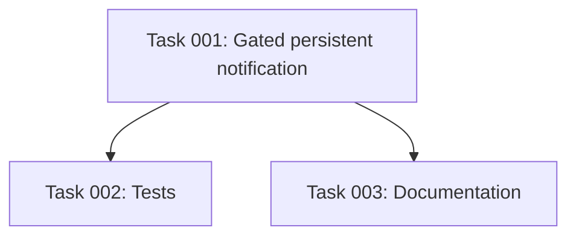

# Plan: New-Device Persistent Notification

## Original Work Order

> "When a new device is discovered by a hub, create a Home Assistant persistent notification (the in-app notification shown in the UI notifications panel via the persistent_notification component — NOT the notify.* / mobile-push notification services) informing the user that a new device has been added."

## Plan Clarifications

| Question | Resolution |
|----------|------------|
| Which notification surface? | The in-app `persistent_notification` component only (the notifications panel in the HA UI). `notify.*` services, mobile-app push, and repair issues are explicitly out of scope. |
| When exactly should it fire? | Only on a **genuinely new** device — one never adopted by this hub before — while discovery is enabled. ⚠️ This is **not** the same as the coordinator's `is_new` flag: `coordinator.devices` is in-memory and starts **empty** after every HA restart / coordinator reload (`coordinator/base.py:201`, never pre-seeded by `async_start`), while known devices are rebuilt from the persisted `entry.data[CONF_DEVICES]` map (`entity.py:529`). So the existing callback fires for *every* known device on its first post-restart transmission. The notification therefore needs **its own gate** on the persisted map (see next row); it cannot ride the callback's gating alone. *(Corrects the original plan's assumption that "no new gating logic is required".)* |
| How do we distinguish "genuinely new" from a restart/reload re-observation, and avoid notifying on restart? | Gate the notification on the **persisted devices map**: notify only when `device_key not in entry.data.get(CONF_DEVICES, {})` at callback time. `entry.data[CONF_DEVICES]` is the registry-backed "ever-adopted" record that survives restarts — this is the same restart-safe pattern core HA integrations use (persisted known-set, not in-memory state). Capture this boolean **before** dispatching `signal_new_device`, because the signal handler schedules an `async_upsert_device` task that adds the key to the map. *(User directive: mirror how core MQTT/Zigbee discovery notifies on a genuinely new device but not on restart — see Decision Log and Sources in Notes.)* |
| Re-appearing devices (deleted then re-transmits). | Deleting a device removes it from `entry.data[CONF_DEVICES]` **and** evicts it via `forget_device` (`__init__.py:309-322`, `coordinator/base.py:271`). So a later transmission is genuinely new again (absent from the persisted map) and **will** re-notify — desired. A **stable per-device `notification_id`** makes that re-notification *replace* any prior one rather than stack a duplicate. |
| Notification dismissal / lifecycle management. | The integration only **creates** the notification. We do not auto-dismiss it (e.g. when the device is later deleted); the user dismisses it from the panel. Keeping creation-only avoids extra lifecycle bookkeeping (YAGNI). |
| Localization of message text. | Persistent notifications use plain text, not entity translation keys. Keep the title/message as simple inline strings (optionally a small constant); do not build a translation pipeline. |
| What should the message contain? | **Model + device key + hub** (per user selection). Title: `"rtl_433: new device discovered"`. Message names the model, the `device_key`, and the hub (`entry.title`), e.g. *"A new device of model 'Acurite-606TX' (key Acurite-606TX-42) was added under hub 'Living Room rtl_433'."* The `device_key` already begins with the model token, but the key disambiguates multiple units of the same model. Handle an **empty `model`** (model-less devices normalize to `model=""`, key prefixed `unknown-…`) gracefully — fall back to naming just the key. |
| What identifies the hub in the message? | Use the hub config entry's `title` (already set as the registry device name at `__init__.py:198`) so the user can tell which hub discovered the device. |

## Executive Summary

This plan adds a small, user-visible improvement: when a hub first decodes an RF device it has **never been adopted before**, the integration raises an in-app **persistent notification** so the user is told a new device was added (today, devices appear silently under the hub with no announcement — see README "Discovery", `README.md:114`).

The change bolts onto an existing, well-defined hook. The coordinator calls a hub-scoped `new_device_callback` defined in `__init__.py` (`__init__.py:181`, wired at `__init__.py:215`) whenever it sees a device that is new *to its in-memory state* while discovery is enabled; that callback dispatches the `signal_new_device` signal that drives device creation. We add one more side effect inside that same callback: a call to `homeassistant.components.persistent_notification.async_create(...)`. The callback runs in the hass event loop and closes over `hass`, the hub `entry` (and its `title`), the `device_key`, and the `model`, so it is the natural place for this logic.

**Critical correctness gate:** the callback's own condition is *not* "genuinely new" — `coordinator.devices` is in-memory and starts empty after every HA restart and every coordinator reload (`coordinator/base.py:201`), while already-known devices are rebuilt from the persisted `entry.data[CONF_DEVICES]` map (`entity.py:529`) without touching `coordinator.devices`. So the callback fires for *every known device* on its first post-restart transmission. To avoid spamming the user with a "new device" notification for every existing device on each restart — the exact anti-pattern of HA core's own "New devices discovered" notification, which famously re-appears after restarts — the notification is gated on the **persisted map**: it fires only when `device_key not in entry.data.get(CONF_DEVICES, {})` (the restart-safe "ever-adopted" record), captured *before* the signal dispatch persists the device. This mirrors how core HA discovery distinguishes a genuinely new device (notify) from a restart re-discovery (silent).

The notification uses a **stable `notification_id`** derived from the domain, the hub entry id, and the device key, so a device that is deleted (removed from the persisted map) and later re-transmits replaces its prior notification instead of stacking duplicates. No new config options, signals, entities, or services are introduced.

## Context

### Current State vs Target State

| Current State | Target State | Why? |
|---------------|--------------|------|
| A newly adopted device is added silently as a nested device + entities; the user gets no in-app signal. | When a **genuinely new** device is first adopted (discovery on), an in-app persistent notification announces it (model, device key, which hub). | The work order: inform the user a new device was added. |
| `new_device_callback` (`__init__.py:181`) only dispatches `signal_new_device`. | The same callback also calls `persistent_notification.async_create(...)` with a stable per-device `notification_id`, **but only when the device is absent from the persisted `entry.data[CONF_DEVICES]` map**. | The callback hook is the right place, but its own condition (`is_new` against in-memory `coordinator.devices`) is *not* "genuinely new" across restarts; a persisted-map gate is required. |
| The callback fires for **every** already-known device on its first transmission after each HA restart / coordinator reload (because `coordinator.devices` starts empty, `coordinator/base.py:201`; known devices rebuild from the persisted map, `entity.py:529`). Adding an ungated notification would re-notify the whole device list on every boot — and `async_create` re-surfaces a previously-dismissed notification. | The notification is suppressed for devices already in `entry.data[CONF_DEVICES]`, so restarts/reloads stay silent. | Avoid the well-known HA "New devices discovered notification reappears on restart" anti-pattern; match the user directive (notify on new, not on restart). |
| A deleted-then-re-transmitting device (removed from the persisted map + `forget_device`, `coordinator/base.py:271`) would, with a random id, stack duplicate notifications. | A stable `notification_id` makes re-notification a *replace*, not a duplicate stack. | Avoid notification spam for devices the user keeps deleting while discovery is on. |
| No tests assert any new-device notification behavior. | Tests assert `async_create` is called with the expected id/message on a genuinely-new first adoption, and is NOT called for an already-known device, on a restart/reload re-observation of a known device, or when discovery is off. | Lock in the gating (incl. the restart-safe gate) and the de-duplication contract. |
| README "Discovery" and `AGENTS.md` do not mention a notification. | Both note that adopting a genuinely-new device raises an in-app persistent notification (and that restarts/reloads do not re-notify). | Keep human and agent docs accurate. |

### Background

Key verified facts from the code:

- **First-observation detection** lives in `coordinator/base.py:_process_event`. `is_new = key not in self.devices` (`coordinator/base.py:702`), and the callback fires only when `is_new and self.discovery_enabled and self.new_device_callback is not None` (`coordinator/base.py:717`), wrapped in a try/except so a bad hook never kills the WebSocket loop (`coordinator/base.py:720`).
- **`is_new` is per-session, not "genuinely new ever" (the pivotal fact).** `self.devices` is initialized empty (`coordinator/base.py:201`) and is populated *only* inside `_process_event` (`:705`); `async_start` (`:244`) does **not** pre-seed it from the persisted map. Meanwhile the entity platform rebuilds every already-known device on startup directly from `entry.data[CONF_DEVICES]` (`entity.py:529`), a path that never writes `coordinator.devices`. Consequence: after every **HA restart** and every **coordinator reload** (e.g. a manage-settings toggle triggers `async_reload`, `__init__.py:257`), the first transmission of each *already-known* device has `is_new = True` and fires `new_device_callback`. Today that is harmless (the `signal_new_device` handler is idempotent and dedups via registry unique_ids), but a notification is not — hence the persisted-map gate.
- **The persisted devices map is the restart-safe "ever-adopted" record.** `entry.data[CONF_DEVICES]` survives restarts and is read live through the `entry` object (the existing `effective_timeout_resolver` closure already reads `entry.data.get(CONF_DEVICES, {})` this way, `__init__.py:172`). `CONF_DEVICES` is already imported in `__init__.py` (`:36`). Gating on `device_key not in entry.data[CONF_DEVICES]` is the integration's equivalent of the registry-persisted known-set that core HA integrations use to avoid re-notifying on restart.
- **The callback** is `new_device_callback(device_key, model)` in `__init__.py:181`; it currently only calls `async_dispatcher_send(hass, signal_new_device(entry.entry_id), device_key, model)` (`__init__.py:189`). It is assigned to the coordinator at `__init__.py:215`. It closes over `hass` and the hub `entry`. The `signal_new_device` handler `_handle_new_device` (`entity.py:543`) persists the device via a **deferred** `hass.async_create_task(async_upsert_device(...))` (`entity.py:552`), so `entry.data` is not mutated synchronously during dispatch — but the gate boolean must still be captured **before** dispatch to be unambiguous.
- **Discovery gating is already correct.** The discovery toggle is read live by the coordinator (`coordinator.discovery_enabled` updated in `_async_update_listener`, `__init__.py:260`), and the callback only fires when discovery is enabled, so the notification inherits that gating for free — no extra discovery check needed in `__init__.py`.
- **Device eviction on deletion** is `forget_device` (`coordinator/base.py:271`), called from `async_remove_config_entry_device` (`__init__.py:322`), which *also* drops the device from `entry.data[CONF_DEVICES]` (`__init__.py:309-317`). So a deleted device is absent from both the in-memory state and the persisted map, making it genuinely new again — it re-notifies (replacing via the stable id).
- **`device_key` format** (`normalizer.py:70`): `model` token prefix plus `-<id>` / `-ch<channel>` / `-st<subtype>`, e.g. `Acurite-606TX-42`, `Foo-ch3`; model-less events yield an `unknown-…` prefix and `model=""`.
- **The hub display name** is `entry.title`, already used as the hub registry device name (`__init__.py:198`).
- **No existing `persistent_notification` usage** exists anywhere in `custom_components/rtl_433/` or `tests/` (confirmed by search), so this is a clean addition.
- **Existing test seams**: `tests/test_coordinator.py:211` (`test_new_device_callback_fires_once_when_discovery_enabled`) proves the callback fires once per per-session first sighting. Wiring-level tests live in `tests/test_lifecycle.py`: `test_new_device_added_when_discovery_on` (`:364`), `test_new_device_not_added_when_discovery_off` (`:386`), and `test_remove_device_then_re_add_with_discovery_on` (`:479`) — the last is the natural seam for the delete-then-re-notify case.

## Architectural Approach

The implementation is a single focused change in the hub setup module plus tests and docs. No new module, signal, constant subsystem, or option is required.

### Notification raise inside `new_device_callback`

**Objective**: Inform the user, in the HA notifications panel, that a hub adopted a genuinely-new device — using the existing callback hook, but with a restart-safe gate so known devices never re-notify.

Inside `new_device_callback` (`__init__.py:181`), in addition to the existing `signal_new_device` dispatch, conditionally call `homeassistant.components.persistent_notification.async_create(hass, message, title=..., notification_id=...)`. The callback already runs on the event loop and has the `hass`, `entry`, `device_key`, and `model` it needs.

**Control flow (the gate is the load-bearing decision):**

1. **Capture genuinely-new before dispatch**: `is_new_device = device_key not in entry.data.get(CONF_DEVICES, {})`. This must be read first because the dispatch schedules a deferred `async_upsert_device` that will add the key to the map.
2. **Dispatch the signal first** (`async_dispatcher_send(...)`), exactly as today, so device/entity creation is never blocked by anything notification-related.
3. **Notify only when `is_new_device`**: call `persistent_notification.async_create(...)`. For a known device (restart/reload re-observation) this branch is skipped entirely — no notification.

Reference shape (illustrative, not prescriptive):

```python
from homeassistant.components import persistent_notification  # top-level import

def new_device_callback(device_key: str, model: str) -> None:
    # entry.data[CONF_DEVICES] is the restart-persisted "ever-adopted" set, so a
    # device already in it is a known device re-observed after a restart/reload
    # (coordinator.devices starts empty) — NOT genuinely new. Read this *before*
    # dispatch, which schedules the upsert that adds the key.
    is_new_device = device_key not in entry.data.get(CONF_DEVICES, {})
    async_dispatcher_send(hass, signal_new_device(entry.entry_id), device_key, model)
    if is_new_device:
        name = model or device_key
        persistent_notification.async_create(
            hass,
            f"A new device '{name}' (key {device_key}) was added under hub "
            f"'{entry.title}'.",
            title="rtl_433: new device discovered",
            notification_id=f"{DOMAIN}_new_device_{entry.entry_id}_{device_key}",
        )
```

Key decisions:

- **Restart-safe gate** on `entry.data[CONF_DEVICES]` (see Background): the single most important change relative to the original plan. Without it, every known device re-notifies on every restart/reload.
- **Stable `notification_id`** of the form `f"{DOMAIN}_new_device_{entry.entry_id}_{device_key}"`. Hub entry id + device key keeps it unique per device per hub and stable across re-discovery, so a re-appearing (previously deleted) device replaces rather than stacks.
- **Title**: a short fixed string such as `"rtl_433: new device discovered"`.
- **Message**: plain text naming the model, the device key, and the hub (`entry.title`); fall back to the key when `model` is empty.
- **Strings**: keep the title/message inline or as small module-level constants in `__init__.py`. Do not introduce translation keys (persistent notifications are plain text) — consistent with the YAGNI guidance.
- **Robustness / ordering**: the callback's existing try/except in the coordinator (`coordinator/base.py:720`) already protects the loop, so the notification call needs no extra guarding beyond dispatching the signal first so a notification failure can never block device creation.

### Test coverage

**Objective**: Lock in the gating and de-duplication behavior.

Add tests (primarily in `tests/test_lifecycle.py` for the wiring path, optionally `tests/test_coordinator.py` for the callback-level path) using `pytest-homeassistant-custom-component`. They should patch/observe `persistent_notification.async_create` and assert:

1. On **adoption of a genuinely-new device** (absent from `entry.data[CONF_DEVICES]`) with discovery **on**, `async_create` is called once with the expected stable `notification_id` (`{DOMAIN}_new_device_{entry_id}_{device_key}`) and a message mentioning the model / device key / hub.
2. On a **second sighting** of the same (now-adopted) device in the same session, `async_create` is **not** called again.
3. **No notification on restart/reload of a known device (the regression this refinement exists to prevent).** Seed the hub with a device already present in `entry.data[CONF_DEVICES]`, then feed that device's event so the callback fires (`is_new` true against the empty in-memory `coordinator.devices`); assert `async_create` is **not** called. The reload variant can drive a manage-settings toggle (`async_reload`) and then re-transmit a known device. `test_remove_device_then_re_add_with_discovery_on` (`tests/test_lifecycle.py:479`) and the seeded-device fixtures show the setup pattern.
4. **Delete-then-re-transmit re-notifies.** After deleting a device (dropped from the persisted map + `forget_device`), a later transmission raises the notification again with the same stable `notification_id`.
5. With discovery **off**, no notification is raised (mirrors how the callback itself does not fire).

### Documentation

**Objective**: Keep human and agent docs accurate.

- **README** "Discovery" section (`README.md:114`): one sentence that a new device also raises an in-app persistent notification.
- **AGENTS.md**: a short note (near the new-device dispatcher description, `AGENTS.md:29`) that `new_device_callback` in `__init__.py` also raises a persistent notification with a stable per-device `notification_id`.

```mermaid
flowchart TD
    A[WebSocket frame] --> B[coordinator._process_event<br/>base.py:697]
    B --> C{is_new AND<br/>discovery_enabled AND<br/>callback set?<br/>base.py:717}
    C -- no --> D[update state only]
    C -- yes --> E[new_device_callback<br/>__init__.py:181]
    E --> G0{device_key in<br/>entry.data CONF_DEVICES?<br/>restart-safe gate}
    E --> F[async_dispatcher_send<br/>signal_new_device<br/>creates/rebuilds nested device + entities<br/>schedules async_upsert_device]
    G0 -- yes: known device<br/>restart/reload re-observe --> X[no notification]
    G0 -- no: genuinely new --> G[persistent_notification.async_create<br/>stable notification_id<br/>DOMAIN_new_device_entryid_devicekey]
    G --> H[In-app notification panel]
    R[HA restart / coordinator reload] -. coordinator.devices empties<br/>known device looks is_new .-> C
    I[device deleted -> drop from CONF_DEVICES<br/>+ forget_device base.py:271] -. genuinely new again .-> G0
    G -. same id replaces, no stacking .-> G
```

*Note: the gate (`G0`) reads `entry.data[CONF_DEVICES]` captured **before** the dispatch (`F`), because `F` schedules the deferred `async_upsert_device` that adds the key.*

## Risk Considerations and Mitigation Strategies

<details>
<summary>Technical Risks</summary>

- **Importing `persistent_notification` at module top vs. lazily**: a top-level import of `homeassistant.components.persistent_notification` is standard for custom components and used widely; risk is negligible.
  - **Mitigation**: import the component the same way other HA helpers are imported in `__init__.py`; rely on it being a core component (always available).
- **Notification call raising in the callback**: an exception would otherwise bubble into the coordinator loop.
  - **Mitigation**: the coordinator already wraps the callback in try/except (`coordinator/base.py:720`); order the signal dispatch before the notification so device creation is never blocked by a notification failure.
</details>

<details>
<summary>Implementation Risks</summary>

- **Restart/reload re-notification (the primary risk; mishandled by the original plan).** `coordinator.devices` starts empty after every HA restart and every coordinator reload, so the callback fires for *every* already-known device on its first post-restart transmission. An ungated notification would re-announce the entire device list on every boot — and because `async_create` with a known id re-surfaces a previously-dismissed notification, the whole backlog reappears (the documented HA-core "New devices discovered reappears on restart" anti-pattern, frontend issue #1174).
  - **Mitigation**: gate on the persisted `entry.data[CONF_DEVICES]` map (`device_key not in …`), the restart-safe "ever-adopted" record, captured before the dispatch persists the device. Add an explicit test that a known device re-observed after restart/reload raises **no** notification.
- **Notification spam for repeatedly-deleted devices** (genuinely-new again after removal from the map + `forget_device`).
  - **Mitigation**: stable per-device `notification_id` so re-discovery replaces the existing notification rather than stacking; documented as accepted behavior.
- **Scope creep** into `notify.*`, mobile push, auto-dismiss, or repair issues.
  - **Mitigation**: PRD explicitly lists these as out of scope; create-only, in-app notification only.
</details>

## Success Criteria

### Primary Success Criteria

1. When a hub adopts a **genuinely-new** device (absent from `entry.data[CONF_DEVICES]`) with discovery enabled, an in-app persistent notification appears naming the device model, its device key, and the hub.
2. The notification uses a stable `notification_id` of the form `{DOMAIN}_new_device_{hub_entry_id}_{device_key}`, so a deleted-then-re-transmitting device replaces (does not duplicate) its notification.
3. **No notification is raised on an HA restart or coordinator reload for devices already in the persisted devices map**, nor for an already-known device within a session, nor when discovery is disabled.
4. A device that is deleted (removed from the persisted map) and later re-transmits re-notifies (replacing via the stable id).
5. No `notify.*` service, mobile-push, repair issue, new option, new entity, or new dispatcher signal is introduced.
6. README "Discovery" and `AGENTS.md` document the new in-app notification and its restart-safe behavior.

## Self Validation

After implementation, an LLM should verify the behavior with the project's test harness (`pytest-homeassistant-custom-component`) and code/doc inspection, not vague claims:

1. Run the new/updated tests (e.g. `pytest tests/test_lifecycle.py tests/test_coordinator.py -q`) and confirm they pass, including an assertion that `persistent_notification.async_create` is invoked exactly once on adoption of a genuinely-new device with the expected `notification_id` (`{DOMAIN}_new_device_{entry_id}_{device_key}`) and a message naming the model/device key/hub.
2. Confirm a test asserts `async_create` is **not** invoked: (a) on a second sighting of the same device in a session, (b) **on a restart/reload re-observation of a device already in `entry.data[CONF_DEVICES]`** (the regression guard), and (c) when `discovery_enabled` is false. Confirm a test asserts it **is** re-invoked after a delete-then-re-transmit.
3. Grep `custom_components/rtl_433/__init__.py` to confirm the `async_create` call lives inside `new_device_callback`, is guarded by a `device_key not in entry.data[CONF_DEVICES]` check captured before the `async_dispatcher_send`, and uses the stable id format; grep the whole package to confirm no `notify.*` / mobile-push / repair-issue code was added for this feature.
4. Run the full suite (`pytest -q`) to confirm no regressions in existing discovery/lifecycle tests.
5. Inspect `README.md` (Discovery) and `AGENTS.md` to confirm both mention the in-app persistent notification and that restarts/reloads do not re-notify known devices.

## Documentation

- **README.md** — add a sentence to the "Discovery" section (`README.md:114`) noting that adopting a genuinely-new device raises an in-app persistent notification (stable per-device id, so a re-appearing deleted device replaces rather than duplicates it), and that **restarting HA does not re-notify** for devices already known.
- **AGENTS.md** — add a short note near the new-device dispatcher description (`AGENTS.md:29`) that `new_device_callback` (`__init__.py`) also raises a `persistent_notification` with a stable per-device `notification_id`, **gated on `entry.data[CONF_DEVICES]`** (not the coordinator's per-session `is_new`) so restarts/reloads don't re-notify; in-app only.

## Resource Requirements

### Development Skills
- Python and Home Assistant custom-integration internals (config entries, dispatcher, `persistent_notification` component).
- `pytest` with `pytest-homeassistant-custom-component`.

### Technical Infrastructure
- Existing test fixtures in `tests/` (`conftest.py`, hub-setup helpers used by `test_lifecycle.py`).
- The core `homeassistant.components.persistent_notification` component (no new dependency).

## Notes

- This is a deliberately small feature; the entire production change is expected to be confined to `custom_components/rtl_433/__init__.py` (plus tests and two doc edits).
- The discovery toggle already gates the callback, so no additional discovery option/check is added. Turning discovery off both stops device creation and suppresses the notification, consistent with current behavior described in `README.md:127`. The **one** new check the feature adds is the persisted-map gate that distinguishes a genuinely-new device from a restart/reload re-observation.

### Decision Log

- **Gate the notification on `entry.data[CONF_DEVICES]`, not the coordinator's `is_new`.** The coordinator's `is_new` is per-session (in-memory `coordinator.devices` starts empty after every restart/reload), so it is *not* a reliable "genuinely new" signal. The persisted devices map is the registry-backed record that survives restarts. This is the integration's analogue of how core HA integrations use a persisted/registry known-set to notify on a newly added device but stay silent on restart — the explicit user directive for this plan. Rejected alternatives: (a) keep the plan's ungated approach → re-notifies the whole device list on every restart (HA's own well-known "New devices discovered reappears on restart" bug); (b) a startup time-window suppression → timing-fragile and still mis-fires for slow-cycling devices.
- **Capture the gate boolean before dispatch.** `signal_new_device` → `_handle_new_device` schedules `async_upsert_device` (deferred task) which adds the key to the map; reading the gate first is unambiguous regardless of task timing.
- **Message content = model + key + hub** (user selection), with a fallback to the key alone when `model` is empty.

### Change Log

- 2026-05-27: Refinement session. **Headline fix:** corrected the plan's central (incorrect) assumption that the existing callback gating means "genuinely new" — verified against the code that `coordinator.devices` is per-session and the callback fires for every known device on first transmission after each HA restart/coordinator reload. Added a restart-safe gate on `entry.data[CONF_DEVICES]`, a control-flow spec + reference code shape, a new restart/reload regression test case, an updated mermaid diagram, the primary restart risk, new success criteria, and a Decision Log. Confirmed message content (model + key + hub) and `device_key` format. Grounded the gating in HA-core behavior via web research (see Sources).

### Sources

- HA frontend issue #1174 — "Newly Discovered Devices Persistent Notification Does Not Stay Dismissed After Subsequent Restarts": <https://github.com/home-assistant/frontend/issues/1174>
- HA community — "New Devices Discovered on Restart": <https://community.home-assistant.io/t/new-devices-discovered-on-restart/495416>
- Zigbee2MQTT ⇄ Home Assistant integration (MQTT discovery / device add): <https://www.zigbee2mqtt.io/guide/usage/integrations/home_assistant.html>

## Execution Blueprint

**Validation Gates:**
- Reference: `.ai/task-manager/config/hooks/POST_PHASE.md`

### Dependency Diagram



### ✅ Phase 1: Implementation
**Parallel Tasks:**
- ✔️ Task 001: Restart-safe persistent notification in `new_device_callback`

### ✅ Phase 2: Verification & Docs
**Parallel Tasks:**
- ✔️ Task 002: Tests for the new-device notification (depends on: 001)
- ✔️ Task 003: Document the notification — README + AGENTS.md (depends on: 001)

### Execution Summary
- Total Phases: 2
- Total Tasks: 3

## Execution Summary

**Status**: ✅ Completed Successfully
**Completed Date**: 2026-05-28

### Results
- `new_device_callback` (`__init__.py`) raises an in-app `persistent_notification` on a genuinely-new device, gated on `entry.data[CONF_DEVICES]` (captured before the dispatch) so HA restarts / coordinator reloads do not re-notify known devices. Stable `notification_id = DOMAIN_new_device_entryid_devicekey`; message names model/key/hub (falls back to key when model is empty).
- Tests: genuinely-new notifies once (+ no second-sighting), no notification on restart/reload of a known device (regression guard, incl. the reload variant), discovery-off, and delete-then-re-notify with the same id. Documented in README (Discovery) and AGENTS.md.
- Full suite: 125 passed; ruff check + format clean.

### Noteworthy Events
- The restart-safe gate was the headline fix from plan refinement (the original assumption that the callback's own gating meant "genuinely new" was wrong). The test agent verified the patch target is non-vacuous (forcing the gate true makes the regression test fail).

### Necessary follow-ups
- None.
