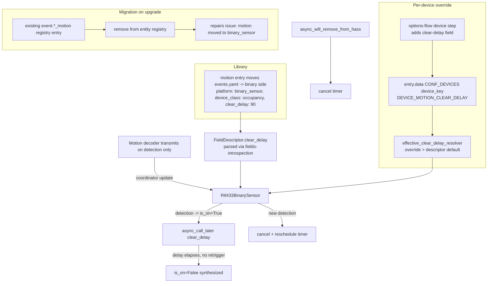
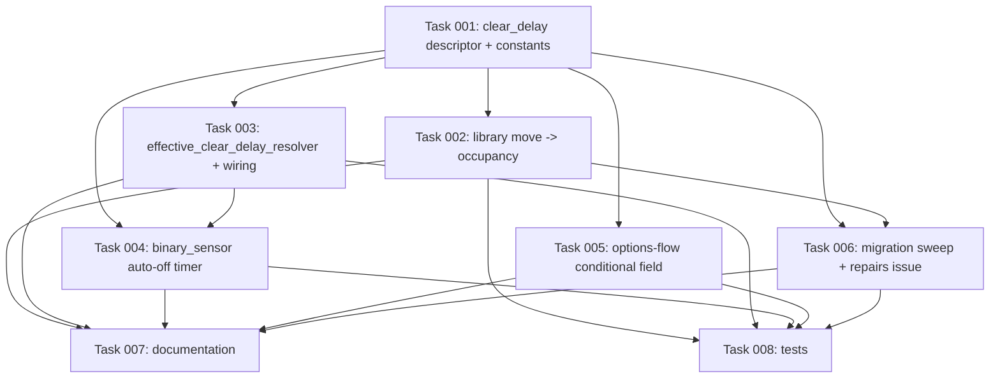

# Plan: Motion as a binary_sensor with a clear-delay

## Original Work Order

> Convert the `motion` field mapping from a `platform: event` entity to a `platform: binary_sensor` (occupancy) entity with a synthesized auto-off clear-delay, because every major bridge (Z2M, ZHA) treats PIR/occupancy motion as a binary_sensor with a software clear timer rather than an event — motion is the lone event mapping on the wrong side of the stateless-action vs. sensing-state line (button/doorbell correctly stay events).
>
> Branch already created off main: feature/13--motion-binary-sensor. Target a new PR off main.
>
> Context from prior analysis:
> - The `motion` mapping currently lives in custom_components/rtl_433/device_library/events.yaml (platform: event, device_class: motion). Move it to the binary_sensor side (device_class: motion / occupancy).
> - Motion decoders (Interlogix, Risco Agility, Kerui, etc.) only transmit ON DETECTION and never send an "off" — so a plain binary_sensor payload mapping would latch on forever. A synthesized off (clear-delay timer, like Z2M's occupancy_timeout) is REQUIRED.
> - No auto-off/clear-delay infrastructure exists today: FieldDescriptor (mapping.py:61) has no timer field, and binary_sensor.py only reflects the last raw value via apply_transform. This is genuinely new infra.
> - PR #26 (device triggers for event entities) is fully generic and has NO motion-specific code — when motion leaves the event platform it simply drops off #26's enumeration and gains HA core's binary_sensor device triggers for free. This conversion is decoupled from #26.
>
> USER DECISIONS (already gathered, do not re-ask):
> 1. Clear-delay control = PER-DEVICE configurable knob, default ~90 seconds. The binary_sensor schedules a synthesized OFF after the delay and RESETS/reschedules the timer on each new detection (Z2M-style), cancelling on entity removal.
> 2. Migration of the existing event.*_motion entity = raise a Home Assistant REPAIRS issue flagging the entity move AND auto-cleanup (remove/disable) the orphaned event entity on upgrade. Reuse the existing repairs.py infrastructure.
>
> Scope includes: new descriptor clear-delay capability parsed in mapping.py; timer logic in Rtl433BinarySensor; moving the motion mapping yaml; the per-device clear delay control; the repairs issue + auto-cleanup migration; tests; and docs. Verify the motion raw value/payload against rtl_433 upstream output.

## Plan Clarifications

| # | Question | Resolution |
|---|----------|------------|
| 1 | What branch does this build on? The per-device override infra and `calibration.py` only exist on the unmerged stack, not `main`. | **Stack on `feature/12`** (not main). The branch `feature/13--motion-binary-sensor` has been re-based onto `feature/12--new-device-notification` so the per-device override pattern, `calibration.py`, and the options-flow device step are available to extend. This is another stacked PR, merging after plans 09–12. |
| 2 | How is the per-device clear-delay configured — a standalone `number` entity or the options-flow device step? | **Options-flow device step override.** There is no per-device `number` entity in the codebase (`number.py` is hub-scoped only). The established pattern for a per-device int-seconds knob is `DEVICE_TIMEOUT_OVERRIDE`, set in the options-flow device step (`config_flow.py` `async_step_device`), persisted into `entry.data[CONF_DEVICES][device_key]`, and read by an `effective_*_resolver` in `__init__.py`. The clear-delay mirrors this exactly; the originally-suggested "number entity" is dropped as net-new and divergent from convention. |
| 3 | Is the event→binary_sensor entity_id change (a BC break) acceptable? | **Yes — confirmed.** `event.*_motion` becomes `binary_sensor.*_motion`. Automations referencing the old entity break and must be updated by the user. Mitigated by a repairs issue + auto-cleanup of the orphaned event entity and a release note. |
| 4 | Plan numbering — the next-id script returns 9 off main but the branch is 13. | **Plan id 13.** Off main the script only sees plans 01–08; from the `feature/12` base it correctly returns 13. 13 matches the branch name and avoids colliding with the unmerged plan 09. |
| 5 | `device_class: motion` or `occupancy`? The summary said "occupancy" but the body set `motion` — a contradiction. | **`occupancy`** (`BinarySensorDeviceClass.OCCUPANCY`). We synthesize a sustained, auto-clearing "occupied" state via the clear-delay timer, which is exactly Z2M's PIR-with-`occupancy_timeout` model — the precedent this plan cites. The entity name stays "Motion" and `object_suffix` stays `motion` (so the entity_id is `binary_sensor.*_motion`); only the device class is `occupancy`. |
| 6 | Should the per-device clear-delay field show for every device in the options-flow step (like the availability timeout) or only motion-bearing ones? | **Only motion-bearing devices.** The clear-delay field is added to the device step **conditionally** — shown only when the selected device has a field whose descriptor carries a `clear_delay` (i.e. a motion field). Avoids surfacing an irrelevant "motion clear delay" on a thermometer. Adds a small conditional to the step (vs. the unconditional availability-timeout field). |

## Executive Summary

The integration currently maps the `motion` field to a `platform: event` entity (`device_library/events.yaml`). Every mature Zigbee bridge (Zigbee2MQTT, ZHA) treats identical PIR/occupancy hardware as a **binary_sensor with a software clear timer**, reserving events for stateless *action* devices (buttons, remotes, doorbells). Motion is the only one of the integration's three event mappings on the wrong side of that line. This plan moves `motion` to a `binary_sensor` and adds the one piece of infrastructure that makes a binary_sensor honest for a device that only ever transmits *on detection*: a synthesized **auto-off clear-delay**.

The approach reuses the integration's existing per-device-override pattern rather than inventing a new one. A new optional descriptor attribute (`clear_delay`, integer seconds) declares the library default; `Rtl433BinarySensor` turns on for each detection and schedules a synthesized off via `async_call_later`, rescheduling on every retrigger (Z2M-style) and cancelling on removal. The per-device override is a new key in the device record, configured through the existing options-flow device step exactly as `DEVICE_TIMEOUT_OVERRIDE` is, and resolved by an `effective_clear_delay_resolver` in `__init__.py` that mirrors `effective_timeout_resolver`. Existing `event.*_motion` entities are removed from the registry on upgrade and a Home Assistant repairs issue announces the move.

The change is deliberately decoupled from PR #26 (event device triggers): that platform is fully generic, so when `motion` leaves the event platform it simply stops being enumerated there and picks up Home Assistant core's binary_sensor device triggers for free — no code in #26 changes. The benefit is an occupancy entity that behaves the way users (and the broader ecosystem) expect: it holds "detected" for a tunable window and clears itself, usable directly in state-based automations and dashboards.

## Context

### Current State vs Target State

| Current State | Target State | Why? |
|---|---|---|
| `motion` is `platform: event`, `device_class: motion` in `device_library/events.yaml`; each transmission fires a momentary HA Event. | `motion` is `platform: binary_sensor`, `device_class: occupancy` (name "Motion", `object_suffix: motion` → `binary_sensor.*_motion`), with a `clear_delay` default, on the binary side of the library. | Matches Z2M/ZHA: occupancy/sensing state belongs on `binary_sensor`; events are for stateless actions. `occupancy` matches Z2M's PIR-with-timeout model (Clarification #5). Enables state-based automations/dashboards. |
| `FieldDescriptor` (`mapping.py:61`) has no timer/auto-off attribute. | `FieldDescriptor` gains an optional `clear_delay: int | None` attribute, auto-parsed (the loader builds from `fields(FieldDescriptor)`, `mapping.py:131`). | A binary_sensor for a detect-only device must synthesize its own off; the library needs to declare the default delay. |
| `Rtl433BinarySensor` (`binary_sensor.py`) only reflects the last raw value via `apply_transform`; no timers. | `Rtl433BinarySensor` starts/reschedules a clear timer when a `clear_delay` descriptor turns on, and cancels it on removal. | Without a synthesized off the sensor would latch on forever — the device never sends a 0. |
| Per-device int-seconds knobs exist only as `DEVICE_TIMEOUT_OVERRIDE` (availability), set in the options-flow device step, resolved by `effective_timeout_resolver` (`__init__.py:188`). | A parallel `DEVICE_MOTION_CLEAR_DELAY` per-device override, set in the same device step, resolved by a new `effective_clear_delay_resolver`. | Reuses the established, idiomatic per-device-override path; no new entity platform. |
| Existing installs expose `event.*_motion`; PR #26 would add device triggers for it. | On upgrade the orphaned `event.*_motion` registry entry is removed and a repairs issue announces the move to `binary_sensor.*_motion`. | The entity_id change is a BC break (confirmed accepted); the repairs issue + cleanup gives users a clear, actionable signal. |
| `docs/device-library.md` documents `motion` under "Event entities"; no `clear_delay` attribute. | Docs move `motion` to the binary side, add the `clear_delay` attribute row, and explain the synthesized-off behaviour; AGENTS.md documents the new infra. | Keep the contributor-facing library reference accurate. |

### Background

- **Exact precedent — `DEVICE_TIMEOUT_OVERRIDE`.** A per-device availability-timeout override is an `int` seconds value collected in the options-flow device step (`config_flow.py` `async_step_device` / device schema around `config_flow.py:276`), persisted into `entry.data[CONF_DEVICES][device_key]` (`const.py:78`), and resolved per-device-override-then-hub-default by `effective_timeout_resolver` (`__init__.py:188-200`, wired at `__init__.py:258`; persisted from options at `__init__.py:456-458`). The motion clear-delay is structurally identical and follows this path step for step.
- **Descriptor parsing is additive.** `_DESCRIPTOR_ATTRS` is derived from `fields(FieldDescriptor)` (`mapping.py:88`) and the loader builds the dataclass via `FieldDescriptor(field_key=field_key, **known)` (`mapping.py:131`), ignoring unknown keys with a debug log. Adding `clear_delay` to the dataclass makes it parse from YAML with no loader change; older loaders simply ignore it.
- **Binary payload semantics.** `Rtl433BinarySensor._apply_value` calls `apply_transform`, which maps the raw value to `True`/`False`/`None` via the descriptor `payload` (`binary_sensor.py`, `mapping.py:553`). A motion mapping only needs an **on** token (the detection value); there is no off token because the device never transmits one — the off is synthesized by the timer.
- **Restore-state caveat.** `Rtl433BinarySensor._async_restore_state` restores a prior `on`/`off`. A stale restored `on` for a momentary motion sensor would be stuck on with no timer running. The plan specifies that `clear_delay` descriptors do **not** restore a stale `on` (they come back unknown/off until the next detection), avoiding a stuck-on after restart.
- **Repairs precedent.** `repairs.py` already creates/deletes issues via `ir.async_create_issue` / `ir.async_delete_issue` with a translation_key and a stable issue id (`repairs.py:39-66`). The migration reuses this shape.
- **Motion raw value must be verified.** Upstream rtl_433 motion decoders are not in the canonical `rtl_433_mqtt_hass.py` mapping table, and different decoders emit the detection differently (commonly `motion: 1`, sometimes a truthy string). The `payload.on` token must be confirmed against real decoder output / test fixtures before finalizing.
- **Decoupled from PR #26.** `device_trigger.py` (on PR #26 only) enumerates any `event`-domain entity generically with no motion-specific code. Once `motion` is a binary_sensor it falls out of that enumeration and gains HA core's binary_sensor device triggers automatically. Nothing in #26 needs editing; at most the word "motion" is dropped from #26's illustrative doc examples when that branch is revisited.

## Architectural Approach

The work is one descriptor capability, one timer behaviour in the binary_sensor, one library move, one per-device override threaded through the existing options-flow/resolver path, one migration, plus docs and tests. No new entity platform and no new dispatcher signal.

### Component 1 — `clear_delay` descriptor capability (`mapping.py`)

**Objective**: Let the library declare a default auto-off delay for a binary_sensor field.

Add an optional `clear_delay: int | None = None` attribute to `FieldDescriptor`. Because `_DESCRIPTOR_ATTRS` and the constructor are derived by introspection (`mapping.py:88,131`), no parser edits are needed — the value flows from YAML automatically. Validate that, when present, it is a positive integer; an invalid value is ignored with a debug log (consistent with the loader's tolerant handling) and falls back to "no auto-off". `clear_delay` is meaningful only for `binary_sensor` descriptors; this is a documentation/convention constraint, not an enforced schema rule (keeping the loader simple).

### Component 2 — Synthesized auto-off timer (`binary_sensor.py`)

**Objective**: Turn the binary_sensor on per detection and clear it after the (effective) delay, Z2M-style.

When a value arrives that maps to `on` and the (effective) clear-delay is set, `Rtl433BinarySensor` sets `is_on = True`, then schedules a one-shot clear via `homeassistant.helpers.event.async_call_later`. Each new detection **cancels and reschedules** the pending timer (the window restarts on every retrigger, matching Z2M `occupancy_timeout`). When the timer fires, the entity sets `is_on = False` and writes state. The pending callback handle is cancelled in `async_will_remove_from_hass` to avoid leaks/late writes. The effective delay is read from the per-device resolver (Component 3), falling back to the descriptor default. For `clear_delay` descriptors, the restore path does not restore a stale `on` (Background → Restore-state caveat). Entities without a `clear_delay` are unchanged.

### Component 3 — Per-device clear-delay override (options flow + resolver)

**Objective**: Let users tune the clear-delay per device, reusing the `DEVICE_TIMEOUT_OVERRIDE` path.

- Add `DEVICE_MOTION_CLEAR_DELAY` to `const.py` alongside `DEVICE_TIMEOUT_OVERRIDE`, plus a `DEFAULT_MOTION_CLEAR_DELAY` (90) used as the library default for the `motion` descriptor.
- Add a clear-delay field to the options-flow device step schema (`config_flow.py` `async_step_device`), mirroring how the availability timeout is presented (a positive-int / `NumberSelector`), pre-filled from the persisted override. **Show it conditionally** (Clarification #6): only when the selected device has a field whose resolved descriptor carries a `clear_delay` (i.e. a motion field). Determine this from the device's observed `DEVICE_FIELDS` looked up against the registry — if none carry a `clear_delay`, the field is omitted from the schema entirely so non-motion devices (thermometers, meters) never see it. Persist it into `entry.data[CONF_DEVICES][device_key][DEVICE_MOTION_CLEAR_DELAY]` via the existing `_write_device_record` / persist path (mirroring `__init__.py:456-458`). A blank submission clears the override (falls back to the descriptor default).
- Add `effective_clear_delay_resolver(device_key)` in `__init__.py` mirroring `effective_timeout_resolver` (`__init__.py:188-200`): per-device override if set, else the descriptor's `clear_delay` default. Wire it onto the coordinator/entity so `Rtl433BinarySensor` can resolve its effective delay (parallel to how the timeout resolver is wired at `__init__.py:258`).
- **Override lifecycle**: as with `DEVICE_TIMEOUT_OVERRIDE`, the options-flow write lands in the entry and a standard options-update reload re-creates the entities, which then read the new effective delay on their next detection. No live in-place re-read is required (the resolver reads the entry record, which is current after reload).

### Component 4 — Library move (`device_library/*.yaml`)

**Objective**: Reclassify `motion` as an occupancy binary_sensor.

Remove the `motion` entry from `events.yaml` and add it to the binary side as `platform: binary_sensor`, `device_class: occupancy` (Clarification #5), `name: Motion`, `object_suffix: motion`, `payload: { on: <verified detection value> }`, and `clear_delay: 90`. Place it in `misc.yaml` (it is neither a safety contact nor a diagnostic state, so it does not belong in `binary_states.yaml`, whose entries are all `device_class: safety` / diagnostic) under a clear "occupancy / motion" comment. The `on` token is confirmed against real decoder output (Background). `force_update` is left at the default; the synthesized off is driven by the timer, not by `force_update`.

### Component 5 — Migration: repairs issue + auto-cleanup

**Objective**: Remove the now-orphaned `event.*_motion` entity on upgrade and tell the user.

Implement this as an **idempotent, guarded registry sweep at setup** (not a config-entry-version `async_migrate_entry` bump — the cleanup is keyed on the presence of orphaned entities, not an entry version, and must be safe to run on every startup). On setup, locate this integration's existing `event`-domain registry entries whose unique-id suffix equals the `motion` field's `object_suffix` (`motion`), remove them from the entity registry, and drop `motion` from any persisted `DEVICE_EVENT_TYPES` slot so the event platform never recreates them. **Only when at least one such orphaned entity was actually found/removed**, raise a single repairs issue (reusing the `repairs.py` `ir.async_create_issue` shape with a new translation_key) explaining that motion is now a `binary_sensor` and that automations referencing the old `event.*_motion` entity must be updated. The issue is **informational and dismissable** — `is_fixable=False`, `severity=IssueSeverity.WARNING` — not a blocking error and not a guided fix flow. On a clean install (no orphaned entity) nothing is removed and no issue is raised.

### Component 6 — Documentation & tests

**Objective**: Keep the library reference accurate and lock the new behaviour.

- `docs/device-library.md`: add a `clear_delay` row to the attributes table, move `motion` out of the "Event entities" section into the binary section, and add a short "Motion / occupancy" note explaining the synthesized-off and the per-device override.
- `AGENTS.md`: document the `clear_delay` descriptor attribute, the binary_sensor timer behaviour, the `DEVICE_MOTION_CLEAR_DELAY` per-device override + resolver, and the event→binary migration.
- Tests (reusing the existing `tests/conftest.py` / lifecycle harness): motion detection turns the binary_sensor on; it auto-offs after the (mocked) delay; a retrigger before expiry reschedules (stays on, then offs once quiet); a per-device override changes the effective delay; the timer is cancelled on removal; the migration removes the old event entity and raises the repairs issue; and the mapping no longer produces a motion event entity.

## Risk Considerations and Mitigation Strategies

Technical Risks

- **Latched-on sensor**: a binary_sensor for a detect-only device with no synthesized off stays on forever.
    - **Mitigation**: the `clear_delay` timer (Component 2) is mandatory for the motion mapping; tests assert the auto-off fires.
- **Timer leak / late state write after removal**: a pending `async_call_later` callback firing after the entity is removed.
    - **Mitigation**: store the unsub handle and cancel it in `async_will_remove_from_hass`; a test removes the entity with a timer pending and asserts no late write.
- **Stuck-on after restart**: restoring a stale `on` with no running timer.
    - **Mitigation**: `clear_delay` descriptors do not restore a stale `on` (Background → Restore-state caveat).
- **Wrong `payload.on` token**: a motion decoder whose detection value doesn't match the configured `on` token would never turn on.
    - **Mitigation**: verify the raw value against real decoder output / fixtures before finalizing the mapping (Component 4); a test feeds the verified value.

Implementation Risks

- **Scope creep into a new number-entity platform**: building a per-device `number` entity (no existing pattern) instead of reusing the override path.
    - **Mitigation**: Clarification #2 fixes the mechanism as the options-flow device-step override, mirroring `DEVICE_TIMEOUT_OVERRIDE`; no new platform.
- **Stacking/merge-order confusion**: this PR depends on infra (`calibration.py`, options-flow device step) that lives only on the unmerged stack.
    - **Mitigation**: Clarification #1 — branch is stacked on `feature/12`; the PR is opened against `feature/12` (or against `main` only after 09–12 merge) and noted as stacked.

Migration Risks

- **Incomplete cleanup leaving a ghost event entity**: removing the registry entry but leaving `motion` in `DEVICE_EVENT_TYPES` could let the event platform recreate it.
    - **Mitigation**: Component 5 removes the registry entry **and** drops `motion` from the persisted event-types slot; a test asserts no motion event entity exists post-migration.
- **Repairs issue noise**: raising the issue on every restart.
    - **Mitigation**: raise once, keyed by a stable issue id; only when an orphaned motion event entity was actually found/removed.

## Success Criteria

### Primary Success Criteria

1. The `motion` field produces a `binary_sensor` (`device_class: occupancy`, name "Motion", entity_id `binary_sensor.*_motion`) — not an `event` entity — and no `motion` entry remains under `platform: event`.
2. A motion detection turns the binary_sensor on; with no further detections it auto-offs after the effective clear-delay; a detection before expiry reschedules the off (Z2M-style), and the pending timer is cancelled on entity removal.
3. `FieldDescriptor` exposes an optional `clear_delay` attribute parsed from the library YAML with no bespoke parser change, and `DEFAULT_MOTION_CLEAR_DELAY` (90) is the motion default.
4. A per-device clear-delay override is settable in the options-flow device step, persisted under `entry.data[CONF_DEVICES][device_key][DEVICE_MOTION_CLEAR_DELAY]`, and resolved (override > descriptor default) by an `effective_clear_delay_resolver` mirroring `effective_timeout_resolver`.
5. On upgrade, an existing `event.*_motion` entity is removed from the registry (and `motion` dropped from persisted `DEVICE_EVENT_TYPES`), and a repairs issue announces the move to `binary_sensor.*_motion`.
6. `docs/device-library.md` and `AGENTS.md` reflect the new `clear_delay` attribute, the binary classification of `motion`, the per-device override, and the migration.
7. `uv run pytest tests/` is green, including new tests for the timer behaviour, the override, the cancel-on-remove, and the migration.

## Self Validation

1. **Library classification**: run a small script/`python -c` that loads the registry (`mapping`) and asserts `lookup(..., "motion").platform == "binary_sensor"` and `device_class == "occupancy"` and `clear_delay == 90`, and that `events.yaml` no longer contains a `motion` key.
2. **Timer behaviour (test harness)**: in a `pytest-homeassistant-custom-component` test, set up a hub with a motion device, feed a detection, assert `binary_sensor.*_motion` is `on`; advance time past the delay with `async_fire_time_changed`, assert it goes `off`; feed two detections within the window and assert it stays `on` until a full quiet window elapses.
3. **Per-device override**: set `DEVICE_MOTION_CLEAR_DELAY` for the device (via the options-flow step or by seeding `entry.data`), feed a detection, and assert the auto-off honors the overridden delay, not the default.
4. **Cancel on remove**: remove the entity with a timer pending; assert no state write occurs after removal (no exception/late update).
5. **Migration**: seed an entity registry with an `event.*_motion` entry for the device, run setup, and assert the event entity is gone, `motion` is absent from the persisted `DEVICE_EVENT_TYPES`, and a repairs issue with the new translation_key exists (`ir.async_get(hass)`).
6. **Full suite + lint**: `uv run pytest tests/` is green; `uvx ruff check .` and `uvx ruff format --check .` are clean.
7. **Verify raw value**: confirm the chosen `payload.on` token matches actual motion-decoder output (test fixture or upstream sample) so a real detection turns the sensor on.

## Documentation

- **`docs/device-library.md`**: Yes — add the `clear_delay` attribute row, move `motion` from "Event entities" to the binary section, and add a short "Motion / occupancy" note (synthesized off + per-device override).
- **`AGENTS.md`**: Yes — document the `clear_delay` descriptor attribute, the `Rtl433BinarySensor` timer behaviour (reschedule-on-retrigger, cancel-on-remove, no stale restore), the `DEVICE_MOTION_CLEAR_DELAY` per-device override + `effective_clear_delay_resolver`, and the event→binary migration (repairs issue + cleanup).
- **`README.md`**: a brief release/upgrade note that `event.*_motion` becomes `binary_sensor.*_motion` (BC break) is warranted given the user-facing entity_id change; keep it short.

## Resource Requirements

### Development Skills
- Home Assistant binary_sensor entities, `async_call_later` timers, and entity lifecycle (`async_will_remove_from_hass`, restore state).
- The integration's device-library descriptor model (`mapping.py`) and the per-device-override path (options flow → `entry.data[CONF_DEVICES]` → `effective_*_resolver`).
- Home Assistant entity registry manipulation and the repairs issue API (`homeassistant.helpers.issue_registry`).
- `pytest-homeassistant-custom-component` test authoring, including `async_fire_time_changed` for timer tests.

### Technical Infrastructure
- The existing test harness (`uv`, `requirements_test.txt`, `tests/conftest.py`), `ruff`.
- HA core modules: `homeassistant.helpers.event.async_call_later`, `homeassistant.helpers.entity_registry`, `homeassistant.helpers.issue_registry`, `homeassistant.helpers.selector` (NumberSelector, already used in the options flow).

### Dependencies / Sequencing
- **Stacked on `feature/12`** (plans 09–12). The PR targets `feature/12` (or `main` once 09–12 land) and is labelled stacked. Decoupled from PR #26 — no changes to `device_trigger.py` are required.

## Notes

- No new dispatcher signal and no new entity platform are introduced; the clear-delay reuses the existing per-device-override path end to end.
- `clear_delay` is added as a general descriptor attribute but is exercised only by `motion` in this plan (YAGNI: no other field gets a timer now).
- The originally-suggested standalone per-device `number` entity was dropped after inspection: `number.py` is hub-scoped and offers nothing to reuse, whereas the options-flow override is the codebase's established per-device-knob pattern.

### Refinement Change Log
- 2026-05-28: Resolved the `device_class` contradiction in favor of `occupancy` (Clarification #5) — updated the summary/target table/diagram/Component 4/success-criteria/self-validation; entity name stays "Motion", `object_suffix`/entity_id stay `*_motion`.
- 2026-05-28: Made the options-flow clear-delay field **conditional** on the device having a `clear_delay`-bearing (motion) field (Clarification #6); documented the override-via-reload lifecycle.
- 2026-05-28: Firmed up the migration as an idempotent guarded setup-time registry sweep (not an `async_migrate_entry` version bump), raising the repairs issue only when an orphaned entity was removed, with `is_fixable=False` / `WARNING`.
- 2026-05-28: Pinned the motion mapping's library file to `misc.yaml` (not `binary_states.yaml`, whose entries are all safety/diagnostic).

## Execution Blueprint

**Validation Gates:**
- Reference: `/config/hooks/POST_PHASE.md`

### Dependency Diagram

### ✅ Phase 1: Foundation
**Parallel Tasks:**
- Task 001: `clear_delay` descriptor attribute + motion constants

### ✅ Phase 2: Library + per-device plumbing
**Parallel Tasks:**
- Task 002: Reclassify `motion` as an occupancy binary_sensor (depends on: 001)
- Task 003: `effective_clear_delay_resolver` + wiring + options→data persist (depends on: 001)
- Task 005: Conditional clear-delay field in options-flow device step (depends on: 001)

### ✅ Phase 3: Runtime behaviour + migration
**Parallel Tasks:**
- Task 004: Synthesized auto-off clear-delay timer in `Rtl433BinarySensor` (depends on: 001, 003)
- Task 006: Migration registry sweep + repairs issue (depends on: 001, 002)

### ✅ Phase 4: Docs + tests
**Parallel Tasks:**
- Task 007: Documentation — device-library schema, AGENTS.md, README note (depends on: 001, 002, 003, 004, 005, 006)
- Task 008: Tests — timer, override, migration (depends on: 002, 003, 004, 005, 006)

### Post-phase Actions
After each phase, run `uvx ruff check .`, `uvx ruff format --check .`, and `uv run pytest tests/` (where applicable) per the POST_PHASE validation gate before proceeding.

### Execution Summary
- Total Phases: 4
- Total Tasks: 8

## Execution Summary

**Status**: ✅ Completed Successfully
**Completed Date**: 2026-05-28

### Results
Converted the `motion` field from an `event` entity to an `occupancy` `binary_sensor` with a synthesized auto-off clear-delay, delivered across 8 tasks in 4 phases:
- **Descriptor + constants**: optional `clear_delay` attribute on `FieldDescriptor` (auto-parsed, positive-int validated); `DEVICE_MOTION_CLEAR_DELAY` / `DEFAULT_MOTION_CLEAR_DELAY` (90).
- **Library**: `motion` moved to `misc.yaml` as `platform: binary_sensor`, `device_class: occupancy`, `payload: {on: "1"}`, `clear_delay: 90`; removed from `events.yaml`.
- **Runtime**: `Rtl433BinarySensor` turns on per detection, schedules a synthesized off via `async_call_later`, reschedules on retrigger, cancels on removal, and never restores a stale `on`.
- **Per-device override**: conditional "Motion clear delay (seconds)" field in the options-flow device step (motion-bearing devices only), persisted under `DEVICE_MOTION_CLEAR_DELAY`, resolved by `effective_clear_delay_resolver` (override > 90 s default).
- **Migration**: idempotent setup-time sweep removes the orphaned `event.*_motion` entity, drops `motion` from persisted `DEVICE_EVENT_TYPES`, and raises a one-time `motion_moved_to_binary_sensor` repairs issue (`is_fixable=False`, WARNING).
- **Docs + tests**: `docs/device-library.md`, `AGENTS.md`, `README.md` updated; `tests/test_binary_sensor_motion.py` added and `tests/test_mapping.py` updated. Full suite: **125 passed**; ruff clean.

### Noteworthy Events
- **Branch base corrected before planning**: the per-device override infra and `calibration.py` live only on the unmerged stack, so the branch was re-based onto `feature/12` (Clarification #1); this is a stacked PR.
- **Mechanism re-decided**: there is no per-device `number` entity to reuse, so the override uses the options-flow device step (the `DEVICE_TIMEOUT_OVERRIDE` precedent) rather than a new entity (Clarification #2).
- **`device_class` resolved to `occupancy`** (Clarification #5), matching the Z2M PIR-with-timeout model; entity name/id stay "Motion"/`*_motion`.
- **Parallel-execution hazard pre-empted**: `const.py` was made Task 1-owned and a single shared key (`DEVICE_MOTION_CLEAR_DELAY`) used for both options and record, avoiding a Phase-2 `const.py` race between Tasks 3 and 5.
- **Pre-existing test fixed**: `tests/test_mapping.py` asserted motion-as-event; updated in the tests task (folded into Task 8 scope when discovered during Phase 2).
- **Test timing**: `async_call_later` anchors to wall-clock, so timer tests advance to absolute offsets / use a ticking `freeze_time` — a test-harness detail, not a product bug.

### Necessary follow-ups
- Open the PR against `feature/12` (stacked); it can retarget `main` once plans 09–12 merge. The BC break (`event.*_motion` → `binary_sensor.*_motion`) is surfaced via the repairs issue and README note.
