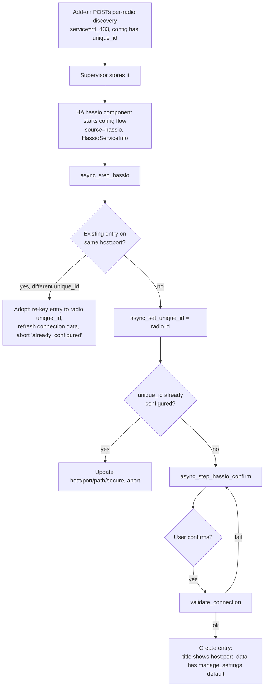
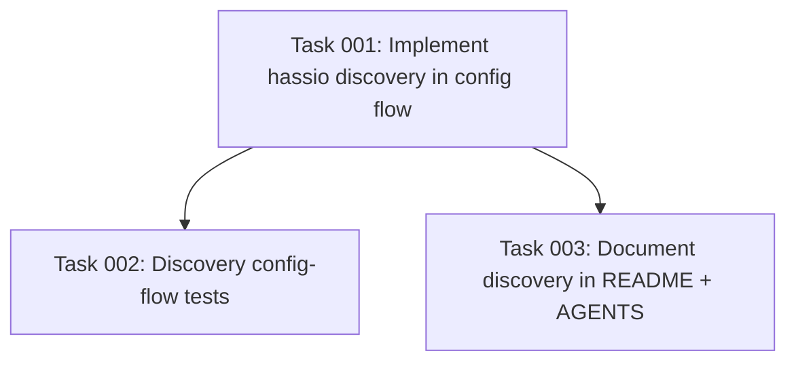

# Plan: Supervisor discovery of rtl_433 radios

## Original Work Order

> The rtl_433 addon at https://github.com/rtl-433-hass/rtl_433-hass-addons now supports registering discovered radios. See the latest commits. Implement any changes or updates to this integration to support that discovery.

## Plan Clarifications

| Question | Answer |
| --- | --- |
| The addon advertises a stable per-radio `unique_id` (serial/usbpath/template). How should config-entry identity work? | **Migrate manual too.** Discovered entries use the advertised radio `unique_id`. Existing manually-added entries are migrated/adopted onto that stable id *when a discovery message matches them by host:port* (a manual entry carries no advertised id at rest, so migration is opportunistic on first matching discovery). |
| Should adopting a discovered radio require user confirmation, or happen automatically? | **Require confirmation.** Radios surface as discovered cards; a `hassio_confirm` step validates connectivity and creates the entry only after the user approves. |
| Backwards compatibility for the existing manual flow and entry schema? | **Refactor allowed.** Reworking the flows is acceptable. The entry *data* shape is unchanged; identity handling is unified so manual and discovered radios never duplicate each other. |

## Executive Summary

The rtl_433 add-on now runs one rtl_433 HTTP/WebSocket server per detected radio and POSTs one Home Assistant Supervisor discovery message per radio (`service: "rtl_433"`, `config: {host, port, path, secure, unique_id}`), where `unique_id` is a hardware-stable, pre-sanitised per-radio key (`serial:…`, `usbpath:…`, or `template:…`). The add-on's own README states that full automatic setup "depends on the rtl_433 integration adding Supervisor discovery support, which it does not have yet." This plan implements exactly that integration-side support.

Home Assistant routes a Supervisor discovery message to the integration whose domain equals the message's `service` (`rtl_433`), starting a config flow with source `hassio` and a `HassioServiceInfo` payload. No `manifest.json` change is required for this routing — implementing `async_step_hassio` is sufficient. The integration's existing "one config entry per `host:port` WebSocket server" hub model maps one-to-one onto "one entry per radio," so discovery slots cleanly into the existing hub flow without a new entry type or data schema.

The approach uses the add-on's advertised per-radio `unique_id` as the config entry's stable identity, so a radio keeps the same entry — and its history — across restarts and port reassignments (the integration updates the stored host/port when the same radio is re-advertised on a new port). To honour the "migrate manual too" decision without duplicating radios, the discovery handler adopts any pre-existing entry that targets the same `host:port` (a manually-added `hub:host:port` entry, or a stale one) by re-keying it onto the stable radio id. The manual user flow and the reconfigure flow are hardened so the two identity schemes coexist and never produce duplicate entries. Adoption of new radios always passes through a user-confirmation step, matching standard Home Assistant discovery UX.

## Context

### Current State vs Target State

| Current State | Target State | Why? |
| --- | --- | --- |
| The config flow exposes only a manual `user` step, a `reconfigure` step, and the options flow. There is no `hassio` discovery step, so add-on discovery messages are rejected by Supervisor and no card ever appears. | The config flow implements `async_step_hassio` + an `async_step_hassio_confirm` step. Radios published by the add-on appear as discovered cards and can be adopted in one click. | This is the core of the work order: consume the add-on's new discovery registration. |
| Hub entries are keyed only by `hub:{host}:{port}`. A radio that moves to a different port (e.g. when the radio count changes) is seen as a brand-new device and loses its history. | Discovered entries are keyed by the add-on's stable per-radio `unique_id`; on re-advertisement the stored host/port is updated in place. | The stable id is the entire purpose of the add-on feature — it lets a radio keep one entry across restarts and port reassignments. |
| A manually-added radio (`hub:host:port`) and the same radio arriving via discovery would create two separate entries (different unique_id namespaces) → duplicate devices. | Discovery adopts a matching pre-existing entry by `host:port`, re-keying it onto the stable radio id; the manual `user` step also refuses a `host:port` already configured by any entry. | "Migrate manual too" + no duplicates: one radio is always exactly one entry regardless of how it was first added. |
| The `reconfigure` step unconditionally recomputes the entry's unique_id as `hub:{host}:{port}`. | `reconfigure` preserves a stable radio unique_id (only legacy `hub:`-scheme entries get the `host:port` identity recomputed). | Without this, reconfiguring a discovered/adopted entry would clobber its stable id back to `host:port` and undo the migration. |
| `translations/en.json` has no discovery strings. | `en.json` adds the `hassio_confirm` step strings (title/description) and any new abort reason. | Discovered cards and the confirmation dialog need user-facing copy; hassfest requires translation keys for every step. |

### Background

- **Add-on contract (already shipped).** `rtl_433/run.sh:publish_discovery()` POSTs, per radio, `{"service": "rtl_433", "config": {"host": "<addon-host>", "port": <int>, "path": "/ws", "secure": false, "unique_id": "<id>"}}` to `http://supervisor/discovery`. The `unique_id` is resolved in order serial → usb port path → template tag and is **already sanitised to a JSON-safe character set** by the add-on; the integration may use it verbatim. `config.json` declares `discovery: ["rtl_433"]` and `hassio_api: true`. Supervisor's discovery schema treats `service` as a free-form string (no allowlist), so `rtl_433` is accepted.
- **HA routing (verified against core).** `homeassistant/components/hassio/discovery.py` calls `discovery_flow.async_create_flow(hass, data.service, context={"source": SOURCE_HASSIO}, data=HassioServiceInfo(config=…, name=<addon name>, slug=<addon slug>, uuid=<hex>))`. It injects `config["addon"] = <addon display name>` before dispatch. `HassioServiceInfo` lives at `homeassistant.helpers.service_info.hassio`. The second positional arg (`data.service`) is the integration **domain**, so `service: "rtl_433"` dispatches to this integration. No manifest key is needed.
- **Integration model.** One config entry per rtl_433 WebSocket server (`host:port`); radios are separate servers on separate ports, so one entry per radio is the natural fit. The manual flow (`Rtl433ConfigFlow.async_step_user`) sets `unique_id = hub:{host}:{port}` and stores `{host, port, path, secure, manage_settings}` in `entry.data`. `Rtl433Coordinator.validate_connection(hass, host, port, path, *, secure=False)` (static) performs the short-lived WebSocket reachability check and raises `CannotConnect`. Connection params live in `const.py` as `CONF_HOST/CONF_PORT/CONF_PATH`, `CONF_SECURE = "secure"` (defined in `config_flow.py`), `CONF_MANAGE_SETTINGS`, `DEFAULT_MANAGE_SETTINGS = True`.
- **No data-schema change / no version bump for adoption.** Discovered entries store the same `entry.data` keys as manual entries, so `async_migrate_entry` and the config-flow `VERSION`/`MINOR_VERSION` are untouched. The "migration" of manual entries is the runtime re-keying of an existing entry's `unique_id`, not a schema migration.
- **Repo conventions.** The project uses Conventional Commits and release-please-managed versioning/changelog; `manifest.json`/`CHANGELOG.md` version fields are **not** hand-edited. Tests run on Python 3.14 via `uv` (system Python is 3.13). The config-flow test suite mocks `custom_components.rtl_433.config_flow.Rtl433Coordinator.validate_connection`.

## Architectural Approach

The change is contained to the config-flow module, its translation strings, and tests. It adds a discovery entry point that reuses the existing connectivity check and entry-creation shape, and unifies identity handling so manual and discovered radios are deduplicated against each other. A small `host:port` lookup helper becomes the single source of "is this server already configured?", used by the discovery, user, and (for clobber-avoidance) reconfigure paths.

### Component 1: `async_step_hassio` discovery entry point

**Objective**: Accept a Supervisor discovery message, establish stable identity, adopt/migrate any pre-existing matching entry, and route new radios to confirmation.

Implement `async_step_hassio(self, discovery_info: HassioServiceInfo)` on `Rtl433ConfigFlow`. Read `host`, `port`, `path`, `secure`, and `unique_id` from `discovery_info.config` (the add-on always supplies all five; `path` defaults to `/ws` and `secure` to `False` if ever absent). The handling order is deliberate:

1. **Adopt/migrate a matching pre-existing entry.** Iterate current entries; if one already targets the same `host` **and** `port` but has a *different* `unique_id`, re-key it via `async_update_entry(entry, unique_id=<radio id>, data={…refreshed connection…})` and abort with `already_configured`. This realises the "migrate manual too" decision (a manual `hub:host:port` entry, or a stale entry, is upgraded onto the stable id in place — history preserved, no duplicate, no confirmation needed because it is already configured).
2. **Same-radio re-advertisement.** `await self.async_set_unique_id(<radio id>)` then `self._abort_if_unique_id_configured(updates={host, port, path, secure})`. This catches the same radio re-advertised on a *new* port (matched by stable id, not host:port) and updates the stored connection target in place.
3. **New radio.** Stash the discovery config on the flow instance and proceed to `async_step_hassio_confirm`.

The stable id is used verbatim from the add-on (already sanitised). The `host:port` adoption check is factored into a small helper shared with the user flow.

### Component 2: `async_step_hassio_confirm` confirmation step

**Objective**: Match Home Assistant's standard discovered-card UX — the user explicitly adopts the radio, and connectivity is verified before the entry is created.

Implement `async_step_hassio_confirm`. On first render show an empty confirmation form (no input fields) carrying description placeholders (`addon` name, `host`, `port`) so the dialog tells the user which radio/add-on it is. On submit, call `Rtl433Coordinator.validate_connection(...)`; on `CannotConnect` re-show the form with a `cannot_connect` error; on success create the entry. The entry `data` mirrors a manual hub entry — `{host, port, path, secure, manage_settings: DEFAULT_MANAGE_SETTINGS}` — and the title distinguishes radios on a shared add-on host (e.g. host:port-based, since multiple radios share one host). Surface the discovered name via `description_placeholders` so HA's discovery card shows a meaningful label.

### Component 3: Identity-coexistence hardening (user + reconfigure flows)

**Objective**: Guarantee one radio = one entry across both identity schemes and prevent the reconfigure flow from clobbering a stable id.

- **User flow**: before creating a manual entry, refuse a `host:port` that any existing entry (manual *or* discovered) already targets, using the shared `host:port` lookup helper, aborting `already_configured`. This closes the "discovered-first, then manually added" duplication gap. The existing `hub:{host}:{port}` unique_id for purely manual adds is retained.
- **Reconfigure flow**: only recompute the `hub:{host}:{port}` unique_id when the entry currently uses the `hub:` scheme; for an entry already carrying a stable radio id, preserve its `unique_id` and update only the connection data. This prevents a reconfigure from undoing an adoption/migration.

### Component 4: Translations

**Objective**: Provide user-facing copy for the new step and satisfy hassfest's requirement that every config-flow step and abort reason has a translation key.

Add a `config.step.hassio_confirm` block (title + description using the `addon`/`host`/`port` placeholders) to `translations/en.json`, reuse the existing `cannot_connect` error string, and add any new abort reason string if one is introduced. The `already_configured` abort already exists.

### Component 5: Tests

**Objective**: Cover the discovery-specific business logic (identity, adoption, dedup, port-change update, confirmation) without re-testing Home Assistant framework plumbing.

Mostly-integration tests driving the flow through `hass.config_entries.flow.async_init(DOMAIN, context={"source": SOURCE_HASSIO}, data=HassioServiceInfo(...))`, mocking `validate_connection` as the existing suite does. Cover: (a) happy path — discovery → confirm → entry created with the radio `unique_id` and `manage_settings` default; (b) adoption/migration — a pre-existing `hub:host:port` entry on the same host:port is re-keyed to the radio id and the flow aborts without creating a duplicate; (c) same-radio re-advertisement on a new port updates the stored port and aborts; (d) the manual `user` step now aborts when the host:port is already configured by a discovered entry; (e) reconfigure preserves a stable radio unique_id instead of recomputing `hub:host:port`; (f) `hassio_confirm` with a failing `validate_connection` re-shows the form. Combine related assertions per the "few tests, mostly integration" guideline.

## Risk Considerations and Mitigation Strategies

Technical Risks

- **`HassioServiceInfo` import path drift across HA versions.** The dataclass moved to `homeassistant.helpers.service_info.hassio` in current cores.
    - **Mitigation**: Import from `homeassistant.helpers.service_info.hassio` (the path used by current core integrations). The integration already targets a current HA via the test stack; confirm by importing in the test environment.
- **Discovery `config` missing optional keys.** A future add-on build could omit `path`/`secure`.
    - **Mitigation**: Default `path` to `DEFAULT_PATH` and `secure` to `False` when reading the config; treat a missing `unique_id` as a malformed message and abort cleanly (the current add-on always sends it).

Implementation Risks

- **Adoption re-keys the wrong entry.** Matching only on host:port could in principle adopt an unrelated entry if two radios ever shared a host:port (they cannot — one server per port).
    - **Mitigation**: One rtl_433 server binds one port; host:port is unique per radio by construction. The match additionally requires a *different* unique_id, so a same-id re-advertisement is handled by the standard abort path, not re-adoption.
- **Reconfigure clobbering the stable id.** The current reconfigure always rewrites the unique_id.
    - **Mitigation**: Gate the `hub:host:port` recompute on the entry already using the `hub:` scheme (Component 3); covered by a dedicated test.

Quality Risks

- **hassfest / translation validation failures.** Missing step/abort translation keys fail CI.
    - **Mitigation**: Add the `hassio_confirm` strings alongside the code; mirror the existing key structure in `en.json`.

## Success Criteria

### Primary Success Criteria
1. A Supervisor discovery message with `service: "rtl_433"` drives the config flow through `async_step_hassio` → `async_step_hassio_confirm` and, on confirmation, creates a hub config entry whose `unique_id` is the add-on's advertised per-radio `unique_id` and whose `data` carries `{host, port, path, secure, manage_settings}`.
2. A pre-existing entry targeting the same `host:port` (including a manual `hub:host:port` entry) is adopted/migrated onto the stable radio id with its history preserved, and no duplicate entry is ever created — in either order of addition.
3. The same radio re-advertised on a different port updates the existing entry's stored host/port in place rather than creating a new entry.
4. The manual `user` flow and the `reconfigure` flow continue to work, do not duplicate a discovered radio, and do not clobber a stable radio unique_id.
5. The full test suite (including new discovery tests) passes under the Python 3.14 `uv` environment, and `ruff` lint is clean.

## Self Validation

After implementation, an LLM should verify the behaviour concretely (not just assert "it works"):

1. **Run the targeted tests**: `uv run --python 3.14 pytest tests/test_config_flow.py -q` (plus any new discovery test module) and confirm all pass, including the new discovery/adoption/reconfigure cases.
2. **Lint**: `uv run --python 3.14 ruff check custom_components/rtl_433/config_flow.py` reports no errors.
3. **Translation/structure sanity**: parse `custom_components/rtl_433/translations/en.json` (e.g. `python -c "import json,sys; json.load(open(...))"`) and confirm a `config.step.hassio_confirm` block exists with `title` and `description`.
4. **Discovery routing smoke check**: in a Python REPL/test using the HA test harness, `await hass.config_entries.flow.async_init(DOMAIN, context={"source": "hassio"}, data=HassioServiceInfo(config={"host": "core-rtl433", "port": 8433, "path": "/ws", "secure": False, "unique_id": "serial:0123", "addon": "rtl_433"}, name="rtl_433", slug="abc123", uuid="deadbeef"))` returns a `form` result with `step_id == "hassio_confirm"`; completing it yields a `create_entry` whose `result.unique_id == "serial:0123"`.
5. **Adoption check**: pre-create a manual entry (`unique_id="hub:core-rtl433:8433"`, matching host:port), drive the same discovery, and assert the flow result is `abort` with reason `already_configured`, that the entry count is unchanged, and that the surviving entry's `unique_id` is now `serial:0123`.

## Documentation

- **Integration `README.md`**: update the setup section to document that, when running under Home Assistant OS with the rtl_433 add-on, radios are now auto-discovered and can be added from **Settings → Devices & Services** with one click (and that the add-on's per-radio `unique_id` keeps each radio's entry stable across restarts/port changes). The add-on README's caveat ("the integration … does not have [discovery] yet") is resolved by this work and should be reflected on the integration side.
- **`AGENTS.md`**: add a short note documenting the supported config-flow sources (now including `hassio` discovery) and the dual identity scheme (`hub:host:port` for manual adds, the add-on's stable radio `unique_id` for discovered/adopted entries) so future contributors understand why the two coexist.
- **No add-on-repo changes**: the add-on side is already shipped; this plan is integration-only.

## Resource Requirements

### Development Skills
- Home Assistant config-flow development (discovery flows, `async_set_unique_id`/`_abort_if_unique_id_configured`, `async_update_entry`), Python (`python`), and the integration's existing conventions.
- pytest with the Home Assistant test harness (`pytest`).

### Technical Infrastructure
- Python 3.14 via `uv` for the test stack; `ruff` for linting; the existing `pytest`/HA test fixtures (`hass`, the config-flow `validate_connection` mock).

## Notes
- Versioning and changelog are release-please-managed; do not hand-edit `manifest.json` version or `CHANGELOG.md`. Use Conventional Commit messages.
- No new runtime dependencies; `HassioServiceInfo` is a core helper. `manifest.json` needs no discovery key for hassio routing.

## Execution Blueprint

**Validation Gates:**
- Reference: `.ai/task-manager/config/hooks/POST_PHASE.md`

### Dependency Diagram

### ✅ Phase 1: Implementation
**Parallel Tasks:**
- ✔️ Task 001: Implement Supervisor (hassio) discovery in the config flow (async_step_hassio + confirm, host:port adoption/dedup, reconfigure stable-id preservation, translations)

### ✅ Phase 2: Verification & Documentation
**Parallel Tasks:**
- ✔️ Task 002: Add config-flow tests for Supervisor discovery (depends on: 001)
- ✔️ Task 003: Document discovery support in README + AGENTS.md (depends on: 001)

### Post-phase Actions
- After Phase 1: run `uv run --python 3.14 ruff check custom_components/rtl_433/config_flow.py` and confirm `en.json` parses as valid JSON.
- After Phase 2: run `uv run --python 3.14 pytest tests/test_config_flow.py -q` and confirm the full suite is green.

### Execution Summary
- Total Phases: 2
- Total Tasks: 3

## Execution Summary

**Status**: ✅ Completed Successfully
**Completed Date**: 2026-06-01

### Results
Home Assistant Supervisor (hassio) discovery support was added to the rtl_433 integration, resolving the gap the add-on README called out ("the integration … does not have [discovery] yet"). Delivered across 2 phases / 3 tasks:

- **Config flow** (`custom_components/rtl_433/config_flow.py`): new `async_step_hassio` and `async_step_hassio_confirm`. Discovered radios surface as cards and are adopted after a confirmation step that revalidates connectivity. Entries are keyed by the add-on's stable per-radio `unique_id` (`serial:…`/`usbpath:…`/`template:…`); re-advertisement on a new port updates the stored connection in place. A discovery message matching an existing entry by `host:port` adopts/re-keys it onto the stable id (migrating manual `hub:{host}:{port}` entries without duplication, history preserved). The manual `user` step now refuses an already-configured `host:port`, and `reconfigure` preserves a stable id instead of recomputing `hub:{host}:{port}`. A shared `_find_entry_by_host_port` helper is the single source of host:port dedup.
- **Translations** (`translations/en.json`): `config.step.hassio_confirm` (title + description) and a `config.abort.invalid_discovery_info` reason; existing `cannot_connect`/`already_configured` reused.
- **Tests** (`tests/test_config_flow.py`): six mostly-integration tests covering happy-path adoption, manual-entry migration, in-place port-change update, manual/discovered dedup, reconfigure stable-id preservation, and confirm cannot_connect.
- **Docs**: README gained an "Automatic discovery (Home Assistant OS add-on)" subsection; AGENTS.md documents the supported config-flow sources and the dual identity scheme.

No `manifest.json` change was required (hassio discovery routes by `service` == domain). No entry-data schema change, so no `async_migrate_entry`/version bump. Versioning/changelog left to release-please.

**Validation**: `ruff check custom_components/ tests/` clean; full suite **1125 passed**; translation structure and discovery-routing/adoption self-validation steps confirmed.

### Noteworthy Events
No significant issues encountered. One minor adjustment during implementation: the new `HassioServiceInfo` import was placed after the `selector` import to satisfy ruff's isort ordering. The "migrate manual too" decision was realized as opportunistic adoption on first matching discovery (a manual entry carries no advertised id at rest, so it is re-keyed when a discovery message matches it by host:port) rather than a standalone schema migration.

### Necessary follow-ups
- None required for this work order. Optional future enhancement (out of scope): translate the new strings into the integration's other supported locales if/when localization is added.
