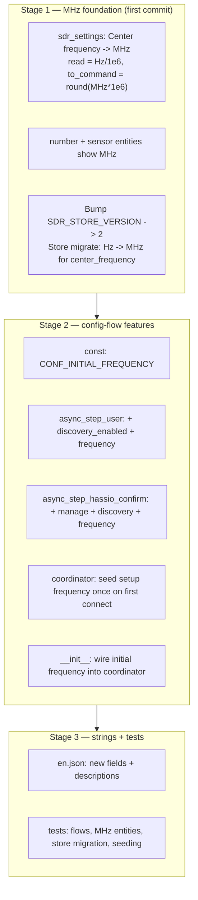
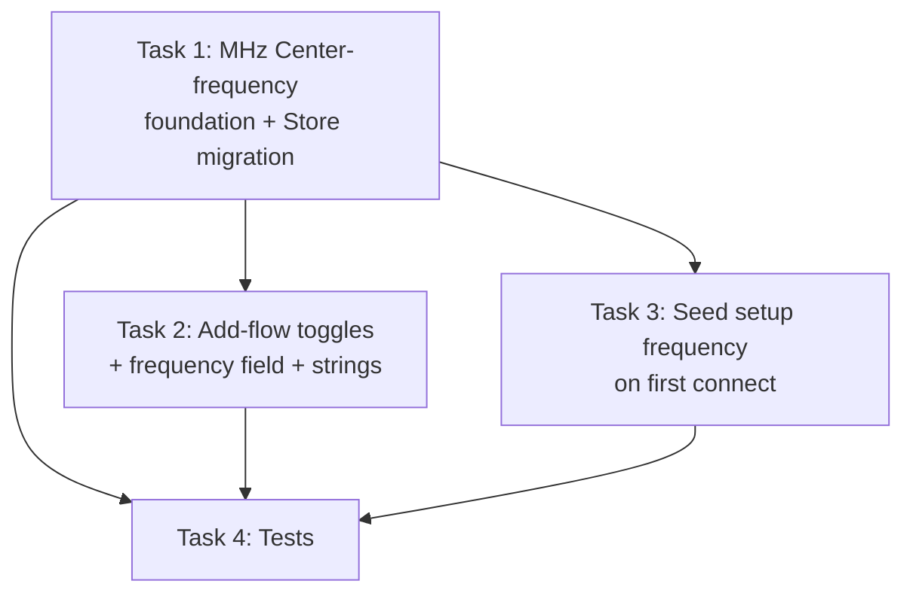

# Plan: Config-flow setup toggles + initial frequency, with MHz Center-frequency entities

## Original Work Order

> Three new features for the rtl_433 Home Assistant integration config flow, all in one PR:
>
> 1. Adding a hub via discovery (Supervisor/hassio discovery flow) should let the user turn "Manage rtl_433 settings from Home Assistant" off with a checkbox, same as the manual add flow already allows.
> 2. For both the discovery and manual add flows, a "Discover new devices" checkbox should be available so users can keep auto-discovery of new devices off from the start if they want.
> 3. For both flows, the user should be able to enter a frequency to set immediately on setup, without having to go into the hub options afterward to change it.

## Plan Clarifications

| Question | Answer |
|----------|--------|
| Frequency input unit on the setup form? | **MHz** (decimal). Additionally, convert the existing Center-frequency entity(ies) to MHz too; this is the first feature commit and needs a persisted-store upgrade path. |
| What if a user enters a frequency but leaves "Manage settings" OFF? | The frequency only applies when settings are managed. Home Assistant config-flow steps are static (a field cannot be dynamically hidden mid-step), so the field is shown but **ignored / not persisted when `manage_settings` is off**, and its help text says so. |
| Keep the current "Manage settings" default? | **Keep default ON** for both add flows (and the new "Discover new devices" checkbox also defaults ON), preserving today's behavior. |
| Backwards compatibility | Required. New config-entry keys are additive and resolved with safe defaults (no config-entry migration). The only stored-data change is the SDR desired-state **Store**, which gets a versioned Hz→MHz migration. |

## Executive Summary

This plan delivers three closely-related config-flow features for the rtl_433 integration plus a unit change to the Center-frequency entities, all in one PR. Today the manual add flow (`async_step_user`) collects `manage_settings`, while the Supervisor discovery confirm step (`async_step_hassio_confirm`) is an input-less confirmation that always uses defaults. The hub options flow already exposes a `discovery_enabled` toggle but it cannot be chosen at add time. There is no way to set the receiver's center frequency at setup — the user must add the hub, wait for it to connect and adopt, then edit the Center-frequency number entity.

The work is sequenced so the **MHz conversion lands first** as its own foundation: the canonical `/cmd` and `meta` layer stays in Hz (that is what rtl_433 speaks), but the desired-state value persisted in the per-hub SDR `Store`, the editable Center-frequency `number` control, and the read-only Center-frequency diagnostic `sensor` all move to MHz. Because pre-existing installs already persisted a desired `center_frequency` in Hz, the SDR Store version is bumped and a one-time Hz→MHz migration converts it on load. With the entity boundary defined in MHz, the three config-flow features build on top: a `manage_settings` checkbox and a `discovery_enabled` checkbox on **both** add flows, and an optional initial center-frequency field (MHz) that is seeded into the hub's desired state exactly once on first connect.

The approach reuses the existing desired-state machinery (`set_sdr` / `_adopt_from_server` / `_enforce_all`) rather than inventing a parallel "apply once" command path: the setup frequency is simply layered over adoption on the first-ever connect, so it survives restarts, is enforced on every reconnect, and is thereafter owned by the Center-frequency entity like any other managed value.

## Context

### Current State vs Target State

| Current State | Target State | Why? |
|---------------|--------------|------|
| Discovery confirm step (`async_step_hassio_confirm`) is input-less and always creates the hub with `manage_settings = DEFAULT_MANAGE_SETTINGS` | Discovery confirm step shows `manage_settings` + `discovery_enabled` checkboxes and an optional frequency field, same as manual add | Feature 1 + parity between the two add flows |
| Manual add (`async_step_user`) collects only `manage_settings` (no discovery toggle, no frequency) | Manual add also collects `discovery_enabled` and an optional initial frequency | Features 2 + 3 |
| `discovery_enabled` is selectable only later, in the options flow | `discovery_enabled` is selectable at add time on both flows (still editable later in options) | Feature 2 — let users start with discovery off |
| Center frequency can only be set after the hub connects, via the number entity | An optional frequency entered at setup is applied to the receiver on first connect | Feature 3 — no post-add round trip |
| Center-frequency `number` control and diagnostic `sensor` report Hz; desired value persisted in Hz | Both entities report MHz; desired value persisted in MHz | Clarified requirement — MHz is the human-facing unit for the setup field and the entities |
| SDR Store schema version 1 (desired `center_frequency` in Hz) | SDR Store version 2 with a Hz→MHz migration of the persisted desired value | Upgrade path so existing managed hubs keep the correct frequency |

### Background

Key architectural facts confirmed by inspection:

- **`sdr_settings.py`** is the single declarative registry. Each `SdrSetting` has `read(meta)` (extract current value from `coordinator.meta`), `to_command(value)` (map a desired value to the `/cmd` `val`/`arg`), and presentation metadata (`native_unit`, `native_min/max/step`). The Center-frequency setting currently reads/sends Hz and presents `UnitOfFrequency.HERTZ`.
- **`coordinator/base.py`** persists `self._desired` (per-key desired value) to a per-hub `Store(hass, SDR_STORE_VERSION, sdr_store_key(entry_id))`. On first connect, when `_desired` is empty, `_adopt_from_server()` seeds it from `meta`; then `_enforce_all()` replays every managed field's `/cmd`. The adoption guard skips `center_frequency` while the server is hopping (`len(frequencies) > 1`).
- **`number.py`** builds the editable Center-frequency control from the registry; `native_value` returns `get_desired(key)` (falling back to `read(meta)`); `async_set_native_value` calls `set_sdr(key, value)`.
- **`sensor.py`** has a read-only diagnostic Center-frequency sensor that reads `meta["center_frequency"]` (Hz) with `device_class=FREQUENCY`.
- **`__init__.py`** constructs the coordinator from `entry.data` via `_hub_manage_settings` / `_hub_discovery_enabled` (options override data, then default). Adding new `entry.data` keys needs no config-entry migration because these resolvers default safely.
- **`config_flow.py`** `STEP_USER_SCHEMA` already has `manage_settings`. `async_step_hassio_confirm` uses `vol.Schema({})` and stores fixed defaults.

Design decision — **canonical unit stays Hz at the wire/meta layer**, MHz only at the three human boundaries (Store value, number entity, sensor entity, setup field). Conversion happens in exactly two registry functions for the Center-frequency setting: `read` (Hz→MHz when seeding desired/entity fallback) and `to_command` (MHz→Hz integer for `/cmd`). This keeps `meta` and the wire protocol untouched and confines the migration to the persisted desired-state Store.

## Architectural Approach

### Stage 1 — MHz Center-frequency foundation (lands as the first feature commit)

**Objective**: Move the human-facing Center-frequency representation to MHz end-to-end (desired Store value, number control, diagnostic sensor) while keeping the rtl_433 wire protocol and `coordinator.meta` in Hz, and provide a one-time upgrade for already-persisted desired state.

- In `sdr_settings.py`, change the `KEY_CENTER_FREQUENCY` setting: `native_unit` → `UnitOfFrequency.MEGAHERTZ`, sensible MHz `native_min`/`native_max`/`native_step` (0 .. 6000 MHz, fine step), `read` converts `meta["center_frequency"]` Hz→MHz, and `to_command` converts the desired MHz value back to an integer Hz `val` (`round(mhz * 1_000_000)`). The hop-mode availability gate and `frequencies`-count logic are unaffected (they read `meta`, still Hz).
- The `number` and `sensor` entities need no per-entity unit logic beyond reading the registry/`meta`: the number inherits `native_unit` from the setting; the diagnostic sensor's `native_unit` and value lambda are updated to MHz (`/1e6`). `device_class=FREQUENCY` is retained on both.
- Bump `SDR_STORE_VERSION` to 2 in `const.py`. Provide an SDR Store that migrates: on load of a version-1 payload, convert `values["center_frequency"]` (Hz) to MHz. Implement by subclassing `homeassistant.helpers.storage.Store` with `_async_migrate_func` (or equivalent migrate hook) and using it where the coordinator constructs `self._store`. Migration is idempotent and only touches the single `center_frequency` key.

### Stage 2 — Config-flow features (build on the MHz boundary)

**Objective**: Let both add flows choose `manage_settings` and `discovery_enabled`, and optionally set an initial center frequency (MHz) that is applied once on first connect.

- `const.py`: add `CONF_INITIAL_FREQUENCY = "initial_frequency"` (MHz value stored in `entry.data`; absent means "adopt from the server").
- `config_flow.py` `async_step_user`: add `discovery_enabled` (default `True`) and an optional `initial_frequency` field (`NumberSelector`, MHz, BOX mode) to `STEP_USER_SCHEMA`. On submit, persist `discovery_enabled` and — only when `manage_settings` is true and a frequency was entered — persist `initial_frequency`.
- `config_flow.py` `async_step_hassio_confirm`: replace the empty schema with `manage_settings` (default `True`), `discovery_enabled` (default `True`), and the optional `initial_frequency` field. Keep the `cannot_connect` re-show behaviour and the `addon`/`host`/`port` placeholders. Persist the same keys as the manual flow.
- `coordinator/base.py`: accept an `initial_center_frequency: float | None` (MHz) constructor arg stored as a one-shot. In `_connect_loop`, inside the existing `if not self._desired:` first-connect branch, after `_adopt_from_server()`, if an initial frequency is set, write it into `self._desired[KEY_CENTER_FREQUENCY]`, mark it managed, and persist — layering the explicit setup choice over adoption (and over the hop-mode adoption skip, since the user explicitly asked for a single frequency). Gating on `if not self._desired` means it is applied only on the first-ever connect and is never re-applied once desired state is persisted.
- `__init__.py`: read `CONF_INITIAL_FREQUENCY` from `entry.data` and pass it to the coordinator constructor. (No new resolver semantics needed — it is a plain one-shot seed, only consulted when `manage_settings` is on, since the whole desired-state path is gated on `manage_settings`.)

### Stage 3 — Translations and tests

**Objective**: Surface the new fields to users and lock in the behaviour with focused tests.

- `translations/en.json`: add `discovery_enabled` and `initial_frequency` `data`/`data_description` to the `user` step; convert `hassio_confirm` into a step with `data`/`data_description` for `manage_settings`, `discovery_enabled`, and `initial_frequency`. Field help for `initial_frequency` states it is in MHz, optional (blank = adopt the server's current frequency), and only applies when "Manage settings" is on.
- Tests (a few, mostly integration), covering only custom logic:
  - SDR Store Hz→MHz migration converts a persisted version-1 value and leaves an already-MHz value untouched.
  - Center-frequency `read`/`to_command` round-trip (MHz presentation ↔ Hz `/cmd`).
  - Manual add flow persists `discovery_enabled` and the initial frequency; the frequency is dropped when `manage_settings` is off.
  - Discovery confirm flow persists `manage_settings` / `discovery_enabled` / initial frequency and still handles `cannot_connect`.
  - Coordinator seeds the setup frequency over adoption on first connect and does not re-apply it once desired state exists.

## Risk Considerations and Mitigation Strategies

Technical Risks

- **Float precision in MHz↔Hz conversion**: storing MHz as a float and reconstructing Hz could drift (e.g. `433.92 * 1e6`).
    - **Mitigation**: convert with `round(mhz * 1_000_000)` to an `int` in `to_command`; this yields exact Hz for typical kHz-resolution frequencies. Tests assert the round-trip for representative bands (433.92 / 868.3 / 915 MHz).
- **Store migration running for hubs that never managed settings**: a version-1 Store may lack a `center_frequency` value.
    - **Mitigation**: migration only converts the key when present and numeric; missing/empty payloads pass through unchanged. Idempotent and guarded.

Implementation Risks

- **HA config-flow steps are static — a field cannot be hidden based on another field's value mid-step**: the frequency field is visible even when `manage_settings` is unchecked.
    - **Mitigation**: per the clarification, the field is ignored/not persisted when `manage_settings` is off, and the help text states it only applies when managing settings is on. No multi-step UX is introduced (scope control).
- **Re-seeding the setup frequency after a manage-off→on toggle**: toggling management off wipes the Store; toggling it back on re-adopts, and the `if not self._desired` gate would re-apply the original setup frequency.
    - **Mitigation**: accepted behaviour — re-applying the originally-requested frequency on re-enable is reasonable and documented; it is not re-applied across ordinary restarts (desired state persists).

## Success Criteria

### Primary Success Criteria
1. The Supervisor discovery confirm step shows working `manage_settings` and `discovery_enabled` checkboxes and an optional MHz frequency field, and persists the chosen values.
2. The manual add step shows a `discovery_enabled` checkbox and an optional MHz frequency field, and persists the chosen values; the frequency is ignored when `manage_settings` is off.
3. An initial frequency entered at setup is applied to the receiver on first connect (visible on the Center-frequency entity) without any post-add edit.
4. The Center-frequency `number` control and diagnostic `sensor` display MHz; an existing managed hub's persisted desired frequency is migrated Hz→MHz and continues to enforce the correct Hz value on the wire.
5. Existing hubs added before this change continue to load and operate with no manual intervention.

## Self Validation

1. **Store migration**: Write a synthetic version-1 SDR Store payload (`{"values": {"center_frequency": 433920000, ...}, "managed": [...]}`) for a fake entry, construct the coordinator's Store, load it, and assert `values["center_frequency"] == 433.92`. Repeat with an already-migrated MHz value and assert it is unchanged.
2. **Round-trip**: In a unit test, call the Center-frequency setting's `read({"center_frequency": 915000000})` → assert `915.0`; call `to_command(915.0)` → assert `915000000` (int).
3. **Manual flow**: Drive `async_step_user` (via `hass.config_entries.flow`) with `manage_settings=True`, `discovery_enabled=False`, `initial_frequency=868.3`; assert the created entry's `data` carries `discovery_enabled=False` and `initial_frequency=868.3`. Re-run with `manage_settings=False` and a frequency; assert `initial_frequency` is absent.
4. **Discovery flow**: Drive `async_step_hassio` → `async_step_hassio_confirm` with the three fields; assert the created entry's `data` carries them; assert a forced `CannotConnect` re-shows the form with `errors["base"] == "cannot_connect"`.
5. **Seeding**: With a mocked server `meta`, start a coordinator constructed with `initial_center_frequency=915.0` and empty Store; after the first connect, assert `get_desired("center_frequency") == 915.0` and that the enforced `/cmd` sent `val=915000000`; restart with persisted desired state and assert the value is not re-seeded.
6. Run the integration test suite under Python 3.14 via `uv` (the project's test stack) and confirm `config_flow`, `number`, `sensor`, and coordinator/store tests pass.

## Documentation

- Update `README.md` where it documents the add flows / managed settings to mention the new add-time `discovery_enabled` and initial-frequency options and the MHz unit for the Center-frequency control.
- Check `AGENTS.md` / `CLAUDE.md` for any statement that the discovery confirm step is input-less or that center frequency is Hz; update if present.
- `translations/en.json` is updated as part of Stage 3 (user-facing strings).

## Notes

- Reconfigure flow (`async_step_reconfigure`) is intentionally **out of scope**: the work order says "on setup". Reconfigure keeps editing only connection params.
- Commit sequencing: Stage 1 (MHz conversion + Store migration) is the first feature commit, per the clarification; Stages 2 and 3 follow. Phase boundaries in the generated tasks should preserve this ordering.

## Execution Blueprint

**Validation Gates:**
- Reference: `.ai/task-manager/config/hooks/POST_PHASE.md`

### ✅ Phase 1: MHz foundation (first commit)
**Parallel Tasks:**
- ✔️ Task 1: Convert Center-frequency to MHz (setting + number + sensor), bump `SDR_STORE_VERSION`, add the Hz→MHz Store migration, add `CONF_INITIAL_FREQUENCY`

### ✅ Phase 2: Config-flow + coordinator features (second commit)
**Parallel Tasks:**
- ✔️ Task 2: Add `discovery_enabled` + initial-frequency to the manual flow and `manage_settings`/`discovery_enabled`/frequency to the discovery confirm step, plus `en.json` strings (depends on: 1)
- ✔️ Task 3: Seed the setup frequency into desired state on first connect and wire it from `entry.data` (depends on: 1)

### ✅ Phase 3: Tests (third commit)
**Parallel Tasks:**
- ✔️ Task 4: Tests for the MHz round-trip, Store migration, both add flows, and frequency seeding (depends on: 1, 2, 3)

### Post-phase Actions
Each phase ends with linting + a conventional-commit per `POST_PHASE.md`. Phase 1's commit is the MHz-conversion foundation; Phase 2's is the three config-flow features; Phase 3's is the tests.

### Execution Summary
- Total Phases: 3
- Total Tasks: 4

## Execution Summary

**Status**: ✅ Completed Successfully
**Completed Date**: 2026-06-01

### Results
All four tasks across three phases completed; each phase landed as one conventional commit on `feature/17--config-flow-setup-toggles-and-mhz-frequency`:

- **Phase 1 (49b6910)** — Center frequency moved to MHz across the desired-state value, the Number control, and the diagnostic Sensor, while `/cmd` and `coordinator.meta` stay Hz (conversion confined to the registry setting's `read`/`to_command`). `SDR_STORE_VERSION` bumped to 2 with a `_SdrStore` Hz→MHz migration of the persisted desired frequency. Added `CONF_INITIAL_FREQUENCY`.
- **Phase 2 (cea0fb2)** — Manual add flow gained a "Discover new devices" checkbox and an optional initial frequency (MHz); the Supervisor discovery confirm step gained "Manage settings" + "Discover new devices" + initial frequency (no longer input-less). The frequency is dropped when settings aren't managed. The coordinator seeds the setup frequency over adoption on the first-ever connect (persisted, never re-seeded); wired from `entry.data` in `__init__.py`. Added matching `en.json` strings.
- **Phase 3 (a92c353)** — Updated existing tests for MHz desired-state semantics and the new `entry.data` shape; added tests for the Store migration, the MHz↔Hz round-trip, both add flows, and the first-connect seeding. Full suite: **1138 passed**.
- **Docs (82de3d9)** — README + AGENTS updated for the new add-time options, the no-longer-input-less confirm step, and the MHz center-frequency representation.

Validation gates: `uv run ruff check custom_components/rtl_433/` and the changed test files pass; `uv run pytest tests/` → 1138 passed; all task frontmatter `status: completed`; self-validation (migration, round-trip, flow persistence, seeding) covered by passing tests.

### Noteworthy Events
- The unit decision was extended mid-planning per user clarification: not just the setup field but the Center-frequency entities themselves move to MHz, requiring a versioned SDR-Store upgrade path (the only stored-data migration; config-entry keys are additive and need no entry migration).
- Home Assistant config-flow steps are static, so the frequency field cannot be dynamically hidden when "Manage settings" is unchecked; per the clarification it is shown but ignored/not persisted when management is off, with help text saying so.
- An untracked `.claude/scheduled_tasks.lock` blocked the automated branch script's clean-tree check; the feature branch was created manually and the lock file added to `.gitignore`.

### Necessary follow-ups
- None required. Optional: localize the new `en.json` strings into other shipped languages (only `en.json` exists today).
