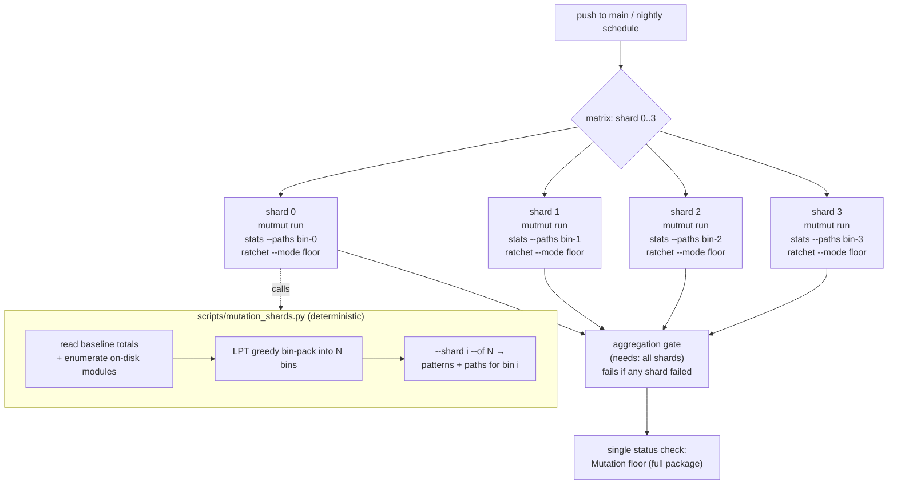
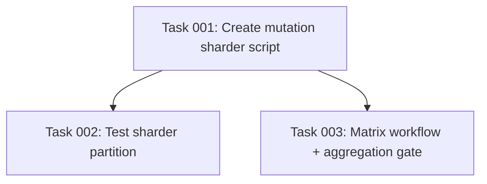

# Plan: Shard the Full-Package Mutation Job into a Balanced Matrix

## Original Work Order
> Split the mutation CI job into a matrix so it runs faster.

## Plan Clarifications

| Question | Answer |
|----------|--------|
| Which mutation run should the matrix cover? | The full-package job only (`mutation-full`, push-to-main + nightly, the ~50 min run). The PR job stays scoped as-is. |
| How should source modules be divided across shards? | Bin-pack by mutant count into 4 shards, reading per-file totals from the committed baseline, so the heavy `coordinator/base.py` (~630 mutants) is isolated and every module is covered exactly once. |
| How should the required status check be handled? | Add an aggregation gate job that depends on all shards, keeping one stable status-check name so branch protection needs no manual changes. |
| Maintain backwards compatibility? | The PR job, the baseline format, and the ratchet/stats/targets scripts are unchanged. Only the full-package job's internal structure changes; its enforcement semantics (per-file floor against the baseline) are preserved. |

## Executive Summary

The `mutation-full` job runs the whole mutmut suite (~3202 mutants, ~50 min on a 2-core runner) on every push to `main` and on the nightly schedule. Because mutmut forks once per mutant and the work is embarrassingly parallel across source modules, a single runner is the bottleneck — nothing about the job needs to be serial.

This plan replaces the single full-package job with a **4-way matrix** that partitions the integration's source modules into balanced shards by mutant count. A small, deterministic helper script reads the per-file mutant totals already recorded in `scripts/mutation_baseline.json` and greedily bin-packs modules so each shard carries roughly a quarter of the total work (~800 mutants), with the long-pole module `coordinator/base.py` isolated in its own bin. Each shard runs `mutmut` only on its assigned modules, exports per-file stats restricted to those paths, and enforces the **same per-file floor** against the baseline — exactly the mechanism the existing PR (scoped) job already uses. A final aggregation gate job depends on all four shards so a single, stable status check (`Mutation floor (full package)`) continues to report pass/fail for branch protection.

The result is a ~4× wall-clock reduction (slowest shard ≈25% of the full run) with no change to coverage, enforcement strictness, baseline format, or the PR workflow. Because shards are computed from the baseline and the on-disk module list rather than hard-coded, new source modules are picked up automatically and every module is mutated in exactly one shard.

## Context

### Current State vs Target State

| Current State | Target State | Why? |
|---------------|--------------|------|
| `mutation-full` is one job running `mutmut run` over the entire package serially (~50 min). | `mutation-full` is a 4-way matrix; each shard mutates ~1/4 of the modules in parallel (slowest ≈13 min). | mutmut work is parallel across modules; one runner is the bottleneck. |
| Module-to-runner assignment is implicit (all modules, one runner). | A deterministic helper bin-packs modules into balanced shards by baseline mutant count. | Naive even splitting is badly unbalanced — `coordinator/base.py` alone is ~20% of all mutants. |
| The full job enforces the floor once over all files via `mutation_stats.py` (no `--paths`). | Each shard enforces the floor over its own paths via `mutation_stats.py --paths …` + `mutation_ratchet.py --mode floor`. | Per-file floor is independent per file, so sharded enforcement is equivalent to the whole-package check. |
| One job → one status check name. | A `needs`-dependent gate job re-exposes one stable status check name. | Avoid breaking branch-protection required checks when the job fans out. |
| New source modules are covered automatically (unfiltered `mutmut run`). | New modules are still covered automatically (sharder enumerates on-disk modules, not a static list). | Preserve the "whole baseline stays honest" guarantee — no silently dropped module. |

### Background

The mutation workflow is already split by trigger: pull requests mutate only the modules the PR could affect (`scripts/mutation_targets.py` → filtered `mutmut run "<module>.*"`), while pushes to `main` and the nightly schedule run the full package to keep the baseline honest. The scoped PR path already proves that filtered `mutmut run` + `mutation_stats.py --paths` + `mutation_ratchet.py --mode floor` works correctly: mutmut copies the entire package into `mutants/` regardless of the filter, so intra-package imports resolve, and the filter only restricts which mutants execute.

This plan reuses that exact mechanism for the full run, but instead of "the modules a PR touched" the filter is "the modules assigned to this shard." The per-file floor in `mutation_ratchet.py` iterates only over files present in the current stats (`check_floor`), so running it once per shard over that shard's files is equivalent to running it once over all files — no module is double-counted and none is skipped, provided the shards partition the module set exactly.

The committed baseline already records a `total` mutant count per file, which is precisely the weight needed to balance the shards. Observed totals (3202 total): `coordinator/base.py` 630, `mapping.py` 561, `config_flow.py` 471, `__init__.py` 465, `entity.py` 319, then a long tail down to `const.py` at 6. A longest-processing-time-first greedy bin-pack into 4 bins yields ~801/793/796/812, so the slowest shard is ~25% of the serial work.

## Architectural Approach

The change has three pieces: a deterministic sharding helper, the matrix-ized `mutation-full` job, and an aggregation gate. The PR job and all existing scripts (`mutation_targets.py`, `mutation_stats.py`, `mutation_ratchet.py`) are untouched.

### Sharding helper script

**Objective**: Deterministically assign every mutable source module to exactly one of N shards, balanced by mutant weight, so each shard knows precisely which modules to mutate and check.

The helper enumerates the mutable source modules the same way `mutation_stats.py` does (mutmut's `walk_source_files` filtered by `should_ignore_for_mutation`), so the shard set tracks exactly what mutmut would mutate — no static module list to drift. It weights each module by its `total` from `scripts/mutation_baseline.json`, falling back to a default weight for any module absent from the baseline (e.g. a brand-new file), so unweighted modules are still placed and never dropped. It runs a longest-processing-time-first greedy bin-pack (sort modules by descending weight, repeatedly place the next module in the currently-lightest bin), which is deterministic given a stable sort and yields well-balanced bins for this distribution.

Given `--shard i --of N`, it prints the same two-line contract the workflow already understands from `mutation_targets.py`: line 1 the space-separated mutmut filter patterns (dotted module paths with `.*`), line 2 the space-separated source paths for `mutation_stats.py --paths`. The partition is a pure function of (baseline, on-disk modules, N), so all shards independently compute the identical partition and agree on who owns what.

### Matrix-ized `mutation-full` job

**Objective**: Run each shard's mutation work on its own runner in parallel while preserving the exact floor-enforcement semantics of the current full job.

`mutation-full` gains `strategy: { fail-fast: false, matrix: { shard: [0,1,2,3] } }` so all shards run to completion even when one regresses (the gate still fails the workflow). Each shard checks out (no `fetch-depth: 0` needed — the full run does not diff against a base branch), installs uv + requirements as today, then:

1. Computes its patterns/paths via `python scripts/mutation_shards.py --shard ${{ matrix.shard }} --of 4`.
2. Runs `mutmut run <patterns>` for its modules.
3. Exports stats restricted to its paths: `mutation_stats.py --paths <paths>`.
4. Enforces the floor: `mutation_ratchet.py --mode floor --stats mutation-stats.json`.

The shard count `4` lives in one place referenced by both the matrix list and the `--of` argument; the plan keeps these consistent. The `timeout-minutes` backstop is reduced to fit a single shard's budget rather than the whole package, since no shard does the full run.

### Aggregation gate job

**Objective**: Re-expose a single, stable status check so branch-protection required checks need no manual edits.

A `mutation-full` (gate) job with `needs: [<the matrix job>]`, `if: always()`, fails when any shard's result is not `success` (inspecting `needs.<job>.result`). Its name is chosen to match the existing required-check name so branch protection continues to gate on one stable check. The per-shard jobs report their own granular statuses for debugging, but the gate is the authoritative pass/fail.

## Risk Considerations and Mitigation Strategies

Technical Risks

- **A module lands in no shard (coverage gap).** If the partition ever dropped a module, the floor would silently stop guarding it.
    - **Mitigation**: The sharder enumerates modules from the live mutmut walk and assigns every one to a bin (LPT places all inputs); a default weight ensures baseline-absent modules are still placed. Self-validation runs all N shards locally and asserts the union of their paths equals the full mutable module set and the baseline file set.
- **Scoped-run score is a slight lower bound vs the full-suite score.** A few mutants are killed only by tests in other modules; a per-shard (filtered) run may not exercise them, mirroring the known scoped-vs-full gap.
    - **Mitigation**: This is the same effect the PR job already absorbs, and the ratchet's tolerance band (`max(2% × N, 3 mutants)`) is designed for exactly it. The floor only ever ratchets upward via the separate `--update` path, which is unaffected.

Implementation Risks

- **Matrix list and `--of` argument drift out of sync.** If the matrix has 4 entries but `--of` says 3 (or vice-versa), partitions disagree and coverage breaks.
    - **Mitigation**: Keep the shard count in lockstep within the single workflow file and assert in self-validation that `--of N` over `shard: [0..N-1]` reproduces a complete, non-overlapping partition.
- **Required status-check name changes break branch protection.** Fanning out renames the job.
    - **Mitigation**: The aggregation gate carries the stable check name; per-shard jobs are supplementary.

Quality Risks

- **Imbalanced shards erode the speedup.** If weighting were wrong, one shard could dominate wall-clock.
    - **Mitigation**: Weights come from real baseline mutant totals; LPT bin-pack yields ~801/793/796/812 for the current distribution (slowest ≈25% of serial work). The strategy rebalances automatically as the baseline evolves.

## Success Criteria

### Primary Success Criteria
1. On push-to-main / nightly, the mutation workflow runs as 4 parallel shards plus one gate job, and the slowest shard's mutmut step processes no more than ~30% of the total mutant count.
2. Running the sharder for `--shard 0..3 --of 4` produces four disjoint module sets whose union equals the full set of mutable modules (and covers every file in `scripts/mutation_baseline.json`).
3. Each shard enforces the per-file floor against the baseline using the unchanged `mutation_stats.py --paths` + `mutation_ratchet.py --mode floor` pipeline; a per-file regression in any shard's modules fails that shard and therefore the gate.
4. The aggregation gate reports a single, stable status check that is green only when all shards pass.
5. The PR (scoped) job, the baseline file, and all three existing mutation scripts are unchanged.

## Self Validation

After all tasks are complete, perform these concrete checks:

1. **Partition completeness & disjointness** — Run `python scripts/mutation_shards.py --shard i --of 4` for `i` in 0..3, collect line 2 (paths) from each, and verify with a shell/Python one-liner that: (a) no path appears in two shards, and (b) the sorted union equals both the on-disk mutable module list and the set of files in `scripts/mutation_baseline.json`. Print the per-shard total mutant weight to confirm balance (each ≈800).
2. **Pattern correctness** — For one shard, confirm line 1 patterns are valid mutmut dotted filters (e.g. `custom_components.rtl_433.coordinator.base.*`) and that `mutmut run <patterns>` followed by `mutation_stats.py --paths <line-2 paths>` emits stats whose `files` keys exactly match that shard's paths.
3. **Workflow validity** — Run a YAML/action linter (e.g. `actionlint` if available, otherwise `python -c "import yaml; yaml.safe_load(open('.github/workflows/mutation.yml'))"`) to confirm `.github/workflows/mutation.yml` parses, the matrix has 4 shard entries, `fail-fast: false` is set, and the gate job lists all shard jobs in `needs` with `if: always()`.
4. **Floor semantics unchanged** — Confirm the PR job (`mutation-pr`) block and `scripts/mutation_targets.py`, `scripts/mutation_stats.py`, `scripts/mutation_ratchet.py`, and `scripts/mutation_baseline.json` are byte-for-byte unchanged via `git diff --stat`.

## Documentation

- Update the header comment block at the top of `.github/workflows/mutation.yml` to describe the new matrix structure and the gate job (the existing comment explains the PR-vs-full split and the no-cache rationale; extend it for the shard split).
- Add a short module docstring to the new `scripts/mutation_shards.py` explaining the bin-packing strategy and the two-line output contract, consistent with the docstrings in the sibling `mutation_*.py` scripts.
- Check whether `AGENTS.md` / `CLAUDE.md` references the mutation job structure; if so, update the description to mention the matrix.

## Resource Requirements

### Development Skills
- `github-actions` — restructuring a workflow into a matrix with a dependent gate job.
- `python` — writing the deterministic bin-packing sharder against mutmut's API and the baseline JSON.

### Technical Infrastructure
- Existing CI stack: GitHub Actions, `astral-sh/setup-uv`, mutmut 3.x, the committed `scripts/mutation_baseline.json`, and the existing `mutation_stats.py` / `mutation_ratchet.py` scripts (consumed, not modified).

## Notes
- The shard count (4) is chosen to balance speedup against runner/concurrency overhead; the sharder is parameterized by `--of N`, so changing the count later is a one-line matrix edit plus the matching `--of` value — no script change.
- Caching policy is unchanged: the `mutants/` working tree is still never cached (a stale cache could mask a regression); only uv's download cache is reused, exactly as today.

## Execution Blueprint

**Validation Gates:**
- Reference: `/config/hooks/POST_PHASE.md`

### Dependency Diagram

No circular dependencies.

### ✅ Phase 1: Sharding helper
**Parallel Tasks:**
- ✔️ Task 001: Create the deterministic mutation sharder script (`scripts/mutation_shards.py`)

### ✅ Phase 2: Consumers
**Parallel Tasks:**
- ✔️ Task 002: Test the sharder partition is complete, disjoint, and balanced (depends on: 001)
- ✔️ Task 003: Convert `mutation-full` into a 4-way matrix with an aggregation gate (depends on: 001)

### Post-phase Actions
After Phase 2, run the Self Validation steps from this plan to confirm the partition covers every module and the workflow parses.

### Execution Summary
- Total Phases: 2
- Total Tasks: 3

## Execution Summary

**Status**: ✅ Completed Successfully
**Completed Date**: 2026-06-02

### Results
The slow full-package mutation job is now a 4-way matrix. Delivered:
- `scripts/mutation_shards.py` — deterministic LPT bin-packer that partitions the integration's mutable modules into N weight-balanced shards (weights from the committed baseline) and prints each shard's mutmut filter patterns + source paths. Exposes `partition`, `mutable_modules`, `load_weights`, `patterns_for`.
- `.github/workflows/mutation.yml` — the `mutation-full` job became `mutation-full-shards` (matrix `shard: [0,1,2,3]`, `fail-fast: false`, `timeout-minutes` 90→45) plus a new `mutation-full` aggregation gate that keeps the stable required-check name "Mutation floor (full package)" and fails if any shard failed. The PR (scoped) job and all `mutation_*.py` scripts and the baseline are unchanged.
- `tests/test_mutation_shards.py` — guards partition completeness, disjointness, baseline coverage, determinism, and pattern round-trip.

Observed partition (`--of 4`): shards carry 803 / 795 / 796 / 810 mutants of 3204 total — the slowest shard is ~25% of the serial work, so wall-clock drops from ~50 min to roughly a quarter.

### Noteworthy Events
- The `test_no_test_file_silently_escalates` meta-test in `test_mutation_targets.py` correctly flagged the new `tests/test_mutation_shards.py` (a meta-test with no 1:1 source module) as something that would escalate PRs to a full run. Fixed by declaring it broad in `_NO_SINGLE_MODULE`, the project's deliberate mechanism for tooling/meta tests — same treatment as `test_mutation_targets.py` itself.
- Self-validation surfaced that `repairs.py` and `coordinator/__init__.py` are mutable but absent from the committed baseline. This is a pre-existing condition, not introduced here: the sharder default-weights them, so they are still mutated and reported (as "+ new file (not yet in baseline)") exactly as the old unfiltered full run did — no coverage regression.
- Validation gates: full `ruff check`/`format --check` clean; full pytest suite 1151 passed; `mutation.yml` parses as valid YAML. The full mutmut matrix itself runs only in CI (too slow to execute locally).

### Necessary follow-ups
- Consider refreshing `scripts/mutation_baseline.json` (via `mutation_ratchet.py --update` after a full run) so `repairs.py` and `coordinator/__init__.py` are recorded and gated rather than reported as new files. Out of scope for this plan.
- `actionlint` was not available locally; the workflow was validated by YAML parse only. The first CI run on `main`/nightly will exercise the matrix end-to-end.
