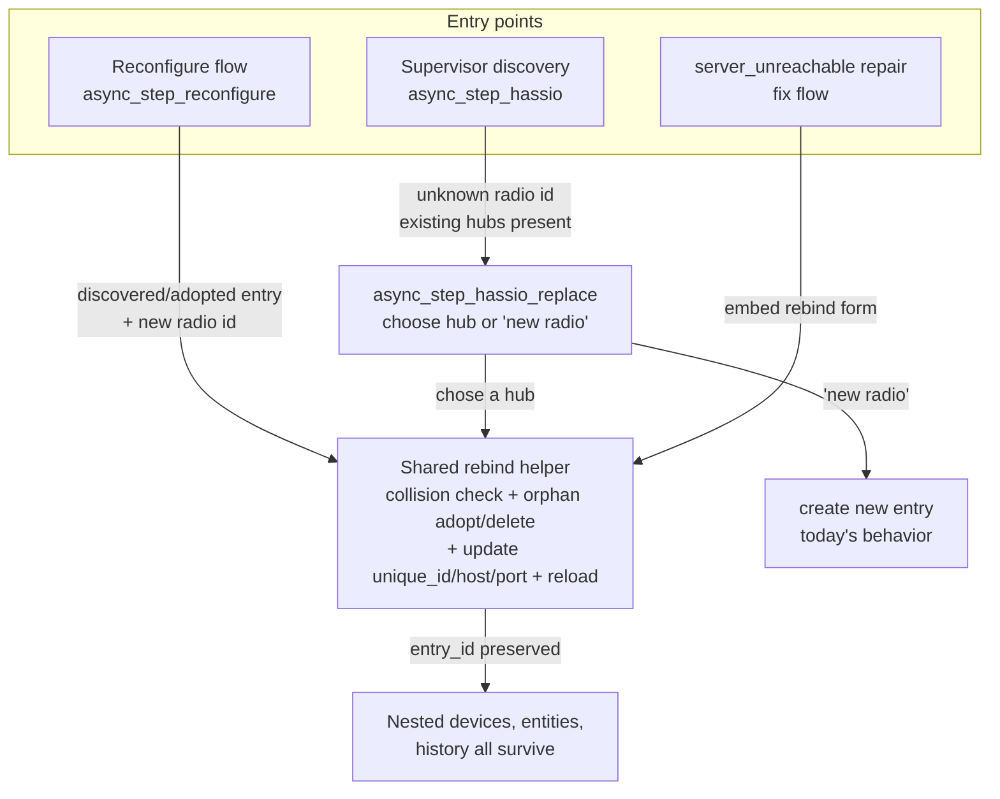
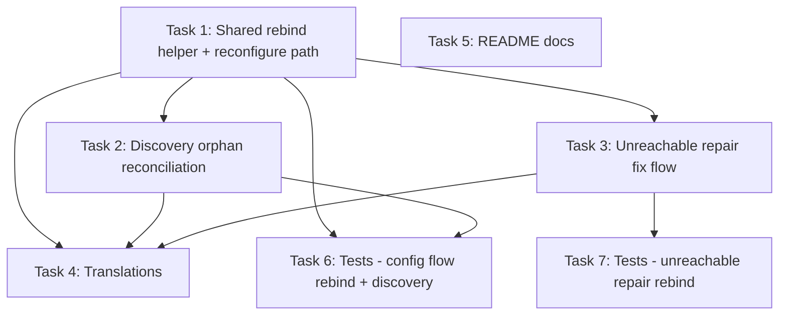

# Plan: Radio Replacement Support (Integration side)

## Original Work Order

> read @RADIO_REPLACEMENT_PLAN.md , plan and execute the work ending in a draft
> PR. That markdown file does not need to be included, since the plan will be in
> task manager.

The referenced `RADIO_REPLACEMENT_PLAN.md` is the design draft this plan
operationalizes. It is the integration half of a two-repo feature (the add-on
half stamps a replacement dongle with a fresh random serial and surfaces its
stable `unique_id` + `host:port`).

## Plan Clarifications

| Question | Answer |
|----------|--------|
| How much of the draft (§A rebind / §B orphan / §C repairs / §D contract) should v1 cover? | **A + B + C′ + D** — all four, with C reframed (below). |
| §C as drafted needs a new "radio vanished + new radio appeared" detector. Keep it? | **No.** Reframe as **C′**: reuse the *existing* `server_unreachable` repair (which already fires when the old radio's host:port goes dead) as the entry point, and give its fix flow a "re-point this hub to a different radio" action. No new detector. |
| How should the C′ fix flow present the rebind? | **Embed the rebind form directly** in the repair fix flow, via a thin shared helper also used by reconfigure. |
| How should the user supply the new radio identity? | **Free-text** stable-radio `unique_id` field (pre-fillable from context). Reliable on Supervisor, manual, and remote servers; no fragile "list unbound discovered radios" enumeration. |
| Maintain backwards compatibility? | Not applicable as a negotiated break — the work is **purely additive**. `device_key`, entity `unique_id` format, and the `entry.data["devices"]` map are untouched, so no migration and no BC break. |

## Executive Summary

When a user's RTL-SDR dongle dies and they swap in a replacement, the paired
add-on stamps the new dongle with a fresh random serial, so it advertises a
**new** stable `unique_id` and possibly a new `host:port`. Today the integration
has no way to tell an existing hub entry "you are now this new radio": the
reconfigure flow preserves a discovered entry's stable `unique_id` and only edits
host/port, and Supervisor discovery of the replacement on a different `host:port`
silently creates a **duplicate, empty** hub entry. This plan makes the existing
hub entry re-bindable to the new radio identity so every decoded sensor — its
entities, history, automations, and dashboards — survives the hardware swap.

The architecture makes this cheap: entities hang off `{hub_entry_id}:{device_key}`,
not the radio serial, and nested devices are rebuilt from `entry.data["devices"]`.
So replacing a radio requires only **rebinding the hub entry's `unique_id` (and
connection target) while keeping its `entry_id`** — nothing in the device or
entity registries is touched. The work is therefore concentrated in the config
flow and repairs surface, with no data-model migration.

Four coordinated changes deliver this: (A) a **rebind path** in
`async_step_reconfigure` accepting a new stable radio `unique_id`; (B) **orphan
reconciliation** so a replacement discovered on a new `host:port` offers to rebind
an existing hub rather than silently duplicating it, plus an adopt-and-delete
fallback in reconfigure; (C′) an **actionable `server_unreachable` repair** whose
fix flow embeds the rebind form (reusing the same shared helper); and (D) the
**cross-repo contract + docs** so the field the user pastes matches what the
add-on prints.

## Context

### Current State vs Target State

| Current State | Target State | Why? |
|---------------|--------------|------|
| Reconfigure preserves a discovered entry's stable `unique_id`; no way to point it at a new radio (`config_flow.py:235-245`). | Reconfigure accepts a new stable radio `unique_id` and rebinds in place, preserving `entry_id`/devices/history. | The core gap — a replaced radio has a new id the user must be able to bind to. |
| A replacement discovered on a new `host:port` routes to `async_step_hassio_confirm` → a brand-new empty hub entry; the real hub is left stale and duplicated. | Discovery of an unknown radio when hubs already exist offers a guided "replace the radio on hub X?" choice; reconfigure can also adopt+delete an already-created orphan. | Prevent/heal the duplicate so the user keeps one hub with all their devices. |
| The `server_unreachable` repair fix flow is a bare `ConfirmRepairFlow()` (dismiss only). | Its fix flow offers to re-point the hub to a different radio (embeds the rebind form). | The dead old radio already raises this exact repair — it is the natural, zero-extra-detector entry point for recovery. |
| Docs/translations describe only edit-connection reconfigure. | "Replacing a radio" docs + strings mirror the add-on's surfaced `unique_id`/`host:port` field verbatim. | Cross-repo procedure must line up so users can follow it end to end. |

### Background

Grounded in `custom_components/rtl_433/config_flow.py` and `repairs.py`:

- A **legacy manual** hub entry has `unique_id` `hub:{host}:{port}` (or empty);
  reconfigure already rebinds it correctly by recomputing host:port — **leave it
  unchanged**.
- A **discovered/adopted** entry has the add-on's stable per-radio `unique_id`;
  this is the branch that needs the rebind.
- `repairs.py` already raises `server_unreachable` (id `server_unreachable_{entry_id}`,
  `is_fixable=True`) and self-clears on reconnect. `async_create_fix_flow`
  currently returns `ConfirmRepairFlow()` for every issue.
- Tests run on **Python 3.14 via `uv run pytest tests/`** (the system Python is
  3.13 and cannot import the test stack). Repairs/diagnostics tests live in
  `tests/test_diagnostics_repairs.py`; config-flow tests in
  `tests/test_config_flow.py` and `tests/test_mut_config_flow.py`.

## Architectural Approach

A single **shared rebind helper** is the spine: one function that, given a hub
entry and a target stable `unique_id` + connection params, performs the
collision-safe rebind (including adopt-and-delete of an empty orphan) and reloads
the entry in place. The reconfigure flow, the discovery replace step, and the
unreachable repair fix flow all funnel through it, so the destructive-feeling
"re-point a hub" logic exists exactly once and is tested once.

### A. Rebind path in `async_step_reconfigure`
**Objective**: Let the user re-point a discovered/adopted hub at a new radio id.

Extend the discovered/adopted branch (`config_flow.py:235`). The reconfigure
schema gains an **optional free-text "new radio id" field**, pre-filled with the
entry's current `unique_id` so leaving it unchanged means "just edit the
connection." On submit, if the supplied id differs from the current one, route
through the shared rebind helper (collision-guarded). The **legacy manual `hub:`**
branch is left exactly as is. The new field is only meaningful for non-`hub:`
entries; for legacy entries it is omitted (host:port already rebinds them).

### B. Orphan reconciliation
**Objective**: Stop a replacement on a new `host:port` from duplicating the hub.

- **B1 (discovery-time, guided):** In `async_step_hassio`, when the advertised
  `unique_id` is unknown (no same-host:port entry to adopt, not already
  configured) **and at least one hub entry already exists**, do not go straight to
  creating a new entry. Route to a new **`async_step_hassio_replace`** step
  offering a select: *"This radio replaces …"* → each existing hub's title, or
  *"It's a new radio."* Choosing a hub runs the shared rebind helper on that
  entry; choosing "new radio" falls through to today's `async_step_hassio_confirm`.
  Always an explicit choice — never a silent auto-rebind.
- **B2 (reconfigure fallback):** The shared rebind helper, when the target id is
  already owned by **another** entry, treats that entry as an orphan **only if it
  has an empty devices map**, deletes it, and rebinds. If the conflicting entry
  has devices (a real hub), it aborts `already_configured` rather than destroy
  data. This lets a user who already has the duplicate recover via reconfigure.

### C′. Actionable unreachable-server repair
**Objective**: Make recovery discoverable by reusing an existing signal.

In `repairs.py`, `async_create_fix_flow` returns a custom `RepairsFlow` for issue
ids prefixed `server_unreachable` (recovering `entry_id` from the issue id);
every other issue keeps `ConfirmRepairFlow()`. The custom flow shows a form with
the **new radio id (free-text) + host/port/path/secure** pre-filled from the
entry, validates connectivity, calls the shared rebind helper, deletes the issue,
and finishes. No new detector is added — the dead radio already raises this issue.

### D. Cross-repo contract + documentation
**Objective**: The field the user pastes must match what the add-on prints.

A new `const.py` key names the radio-id field; translations add strings for the
reconfigure field, the `hassio_replace` step, and the repair fix-flow form. The
field label/semantics match the add-on's surfaced value verbatim. `README.md`
gains a "Replacing a radio" section mirroring the add-on docs (§5 procedure).

## Risk Considerations and Mitigation Strategies

Technical Risks

- **Wrong-hub rebind re-points the wrong devices**: Mitigation — every rebind path requires an explicit user choice (typed/selected id or selected hub); forms show hub title + old/new id + host:port; never auto-rebind silently.
- **Adopt-and-delete destroys a real hub**: Mitigation — the helper deletes a conflicting entry only when its `entry.data["devices"]` map is empty (a genuine orphan); a populated conflicting entry aborts `already_configured`.
- **Import coupling (repairs → config_flow helper)**: Mitigation — place the shared helper in `config_flow.py` (which does not import `repairs.py`), so `repairs.py` importing it introduces no cycle.

Implementation Risks

- **Repair fix flow lives in a `RepairsFlow`, not a `ConfigFlow`**: it cannot call `async_update_reload_and_abort`. Mitigation — the shared helper operates on `hass.config_entries` directly (`async_update_entry` + `async_reload`) and returns a status the caller maps to its own flow result (`async_abort` / `async_create_entry`).
- **Both old and new radio present (revived dongle)**: Mitigation — fresh-random-serial guarantee (paired plan) means ids are distinct; B1 lists the choice explicitly so the user picks.

## Success Criteria

### Primary Success Criteria
1. Reconfiguring a discovered/adopted hub with a new stable radio id rebinds its
   `unique_id` and connection target while preserving `entry_id` and
   `entry.data["devices"]` (verified by test).
2. A rebind whose target id is owned by a **populated** entry aborts
   `already_configured`; one owned by an **empty orphan** deletes the orphan and
   succeeds (verified by test).
3. `async_step_hassio` with an unknown radio id while a hub exists offers the
   replace choice instead of silently creating a duplicate; legacy `hub:`
   reconfigure is unchanged (verified by test).
4. The `server_unreachable` repair fix flow rebinds the hub to a new radio id and
   clears the issue (verified by test).
5. New translation strings exist and `uv run pytest tests/` passes (full suite,
   including mutation-shard coverage for the changed config-flow logic).

## Self Validation

After all tasks, an LLM should:
1. Run `uv run pytest tests/test_config_flow.py tests/test_mut_config_flow.py
   tests/test_diagnostics_repairs.py -q` and confirm all pass (use `uv`, not
   system Python 3.13).
2. Run the full `uv run pytest tests/ -q` and confirm green.
3. `python -c "import json,sys; json.load(open('custom_components/rtl_433/translations/en.json'))"`
   to confirm the translations file is valid JSON, and grep it for the new
   `reconfigure` radio-id field, the `hassio_replace` step, and the
   `server_unreachable` `fix_flow` form keys.
4. `grep -n "Replacing a radio" README.md` to confirm the docs section exists.
5. Inspect `git diff` to confirm **no** changes touch the entity `unique_id`
   format, `device_key` scheme, or `migration.py` (the additive-only guarantee).

## Documentation

- `README.md` — add a "Replacing a radio" section mirroring the paired add-on
  plan's §5 end-to-end procedure.
- `custom_components/rtl_433/translations/en.json` — strings for the new
  reconfigure field, the `hassio_replace` step, and the unreachable fix-flow form.
- `AGENTS.md` — only if the config-flow step inventory in it needs the new
  `hassio_replace` step noted (light touch; not a new doc).

## Resource Requirements

### Development Skills
- Home Assistant config-flow and repairs/issue-registry APIs (`python`).
- The integration's hub/nested-device identity model (already documented in
  `AGENTS.md`).
- pytest with `pytest-homeassistant-custom-component` on Python 3.14 via `uv`.

### Technical Infrastructure
- `uv` toolchain (Python 3.14 test stack); existing `tests/conftest.py` fixtures
  and `MockConfigEntry` patterns.

## Notes
- Purely additive: no config-entry version bump, no `migration.py` change.
- Keep the new radio-id field name aligned verbatim with the paired add-on repo's
  surfaced value (cross-repo contract).
- Commit conventions (per `CONTRIBUTING.md`): Conventional Commits — `feat:` for
  the rebind/repair/discovery flow, `test:` for tests, `docs:` for
  README/translations; one logical change per commit; PR title = first commit.
- Final deliverable is a **draft PR**.

## Execution Blueprint

**Validation Gates:**
- Reference: `/config/hooks/POST_PHASE.md`

### Dependency Diagram

### ✅ Phase 1: Foundation
**Parallel Tasks:**
- ✔️ Task 1: Shared rebind helper + reconfigure rebind path (the spine)
- ✔️ Task 5: README "Replacing a radio" section (no code dependency)

### ✅ Phase 2: Consumers of the rebind helper
**Parallel Tasks:**
- ✔️ Task 2: Discovery-time orphan reconciliation (depends on: 1)
- ✔️ Task 3: Unreachable-server repair rebind fix flow (depends on: 1)

### ✅ Phase 3: Strings + tests
**Parallel Tasks:**
- ✔️ Task 4: Translations for all new surfaces (depends on: 1, 2, 3)
- ✔️ Task 6: Tests — reconfigure rebind + discovery (depends on: 1, 2)
- ✔️ Task 7: Tests — unreachable repair rebind (depends on: 3)

### Post-phase Actions
After Phase 3, run the full suite `uv run pytest tests/ -q` and the Self
Validation steps before opening the draft PR.

### Execution Summary
- Total Phases: 3
- Total Tasks: 7

## Execution Summary

**Status**: ✅ Completed Successfully
**Completed Date**: 2026-06-04

### Results
All 7 tasks across 3 phases completed and committed on branch
`feature/20--radio-replacement-support` (4 commits). Delivered:

- **A — Rebind in reconfigure**: a module-level `async_rebind_hub` helper
  (collision guard + empty-orphan adopt-and-delete) plus an optional `radio_id`
  field in `async_step_reconfigure` that re-points a discovered/adopted hub at a
  new stable radio id, preserving `entry_id`/devices/history. Legacy `hub:`
  branch unchanged.
- **B — Orphan reconciliation**: a new `async_step_hassio_replace` discovery step
  that offers a guided "replace hub X / it's a new radio" choice when an unknown
  radio is discovered while hubs exist; plus the helper's adopt-and-delete
  fallback in reconfigure.
- **C′ — Actionable unreachable repair**: `HubRadioReplaceRepairFlow` embeds the
  rebind form in the existing `server_unreachable` repair (no new detector),
  routed via `async_create_fix_flow`.
- **D — Contract + docs**: translation strings for every new surface, a README
  "Replacing a radio" section, and updated AGENTS.md config-flow inventory.

Validation gates: `uvx ruff check`/`format` clean across `custom_components/` and
`tests/`; full `uv run pytest tests/` green (exit 0, ~1178 tests); `en.json`
valid; no changes to entity `unique_id` format, `device_key`, or `migration.py`
(additive-only guarantee held).

### Noteworthy Events
- The plan's draft §C (a new "radio vanished + new radio appeared" detector) was
  **reframed to C′** at the user's suggestion: reuse the already-existing
  `server_unreachable` signal as the recovery entry point. Less code, more
  discoverable, no speculative detection.
- One existing test (`test_hassio_discovery_distinct_port_is_treated_as_new_radio`)
  asserted behavior the new guided-replace step intentionally changes; it was
  updated (renamed to `..._can_become_new_radio`) to drive the `__new__` path,
  preserving the original intent.
- The rebind-input picker was deliberately **not** built (free-text chosen):
  Home Assistant does not expose a reliable list of unbound discovered radios.

### Necessary follow-ups
- The paired add-on repo (`rtl_433-hass-addons`) must surface each radio's
  `unique_id` + `host:port` in a copy-pasteable form; keep the `radio_id` field
  label in sync with what it prints.
- Open this branch as a **draft PR** for review.

---

Plan Summary:
- Plan ID: 20
- Plan File: /home/andrew.guest/github.com/rtl-433-hass/rtl_433/.ai/task-manager/plans/20--radio-replacement-support/plan-20--radio-replacement-support.md
