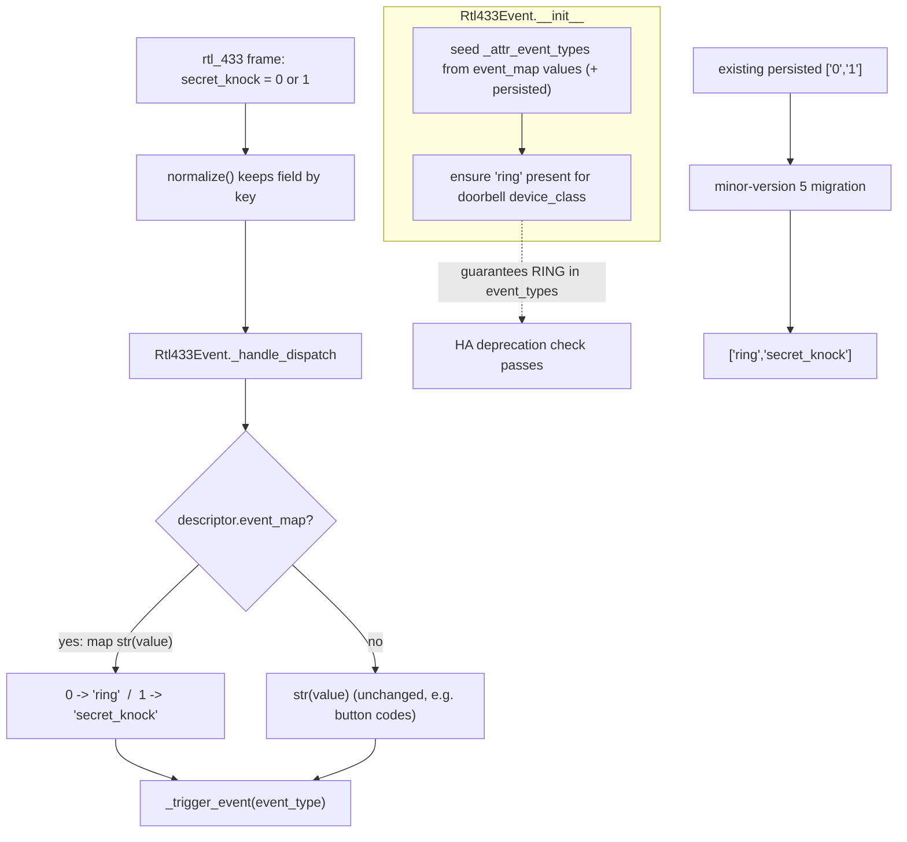
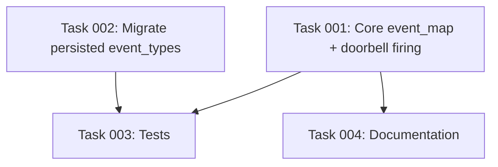

# Plan: Doorbell Standard Event Type (DoorbellEventType.RING)

## Original Work Order
> Implement the Doorbell update as documented at https://developers.home-assistant.io/blog/2026/04/15/doorbell-standard-event-type

## Plan Clarifications

| Question | Answer |
| --- | --- |
| How should a doorbell-class event entity fire its event_type? | Map the raw value to an event type: a regular press (`secret_knock=0`) fires `ring`; a secret knock (`secret_knock=1`) fires a custom type. (Not "always ring" — that would erase the regular-vs-secret distinction the decoder provides.) |
| What should the custom event type for the triple press be named? | `secret_knock` |
| Existing installs may have the doorbell entity's `event_types` persisted as raw `["0", "1"]` strings — migrate them? | Yes. Add a minor-version migration that rewrites persisted doorbell values to the mapped types. (Backwards compatibility for stored config IS wanted here.) |
| Scope: only `secret_knock`, or any doorbell-class field? | Drive the mapping off a declarative descriptor attribute so any doorbell descriptor (including user overrides) can use it; ship the map on `secret_knock`. |

## Executive Summary

Home Assistant has standardized doorbell event entities around `DoorbellEventType.RING` (`"ring"`). Any `event` entity with `device_class = EventDeviceClass.DOORBELL` that does not list `"ring"` in its `event_types` now logs a deprecation warning and "will stop working in Home Assistant 2027.4." This integration's only doorbell entity is the Honeywell ActivLink `secret_knock` field, which today fires the **stringified raw value** (`"0"` / `"1"`) as the `event_type` and auto-populates `event_types` from observed values — so it never carries `"ring"` and is on track to break.

A naive fix ("always fire `ring`") would be wrong: the upstream rtl_433 decoder (`honeywell_wdb.c`) emits `secret_knock` on **every** press as a flag — `0` for a normal single press and `1` for a "secret knock" (three rapid presses). Collapsing both to `ring` would destroy the user's ability to automate on a regular press versus a secret knock. Instead this plan introduces a small, declarative **value→event-type map** on event descriptors: `secret_knock` maps `0 → ring` and `1 → secret_knock`. The entity declares both types up front (guaranteeing `"ring"` is present so the deprecation check passes), fires the mapped type per transmission, and — through the integration's existing device-trigger machinery — exposes "triggered" (any press), "triggered: ring" (regular only), and "triggered: secret_knock" (secret knock only).

A one-time minor-version migration rewrites any already-persisted raw doorbell `event_types` (`"0"`/`"1"`) to the mapped values so existing users' device triggers and stored data stay consistent and no stale numeric subtypes linger. Documentation and the library comment (which currently misdescribes `secret_knock`) are corrected, and focused tests cover the value mapping, the deprecation-compliance invariant, and the migration.

## Context

### Current State vs Target State

| Current State | Target State | Why? |
| --- | --- | --- |
| Doorbell entity fires `str(value)` → `"0"`/`"1"` as the `event_type`. | Doorbell entity fires `ring` for a regular press and `secret_knock` for a triple press. | HA's doorbell standard requires `DoorbellEventType.RING`; the raw `0`/`1` are not meaningful event types. |
| `event_types` for the doorbell auto-populate from observed raw values and never contain `"ring"`. | `event_types` are seeded from a declared value→type map and always contain `"ring"` for a doorbell descriptor. | Without `"ring"` HA logs a deprecation warning and the entity stops working in HA 2027.4. |
| Event descriptors have no way to map a raw value to a named event type. | Event descriptors accept an optional `event_map` (raw-value-string → event-type) attribute. | A declarative map keeps the mechanism generic (user overrides can use it) and avoids hard-coding field names in the entity. |
| `events.yaml` comment claims `secret_knock = 1` only "when pressed 3x". | Comment corrected: `secret_knock` is emitted on every press; `0` = regular, `1` = secret knock. | The current comment is factually wrong and would mislead future maintainers. |
| Existing installs persist doorbell `event_types` as `["0"]`/`["1"]`/`["0","1"]`. | A migration rewrites those to `["ring"]`/`["secret_knock"]`/`["ring","secret_knock"]`. | Keeps stored data and device-trigger subtypes consistent with the new firing behavior; removes stale numeric triggers. |
| `docs/device-library.md` states the fired event_type is always the stringified value and `event_types` are never declared. | Docs document `event_map` and the doorbell `ring` mapping. | Keep the library reference accurate. |

### Background

- The doorbell entity is `custom_components/rtl_433/event.py` (`Rtl433Event`). Its `_handle_dispatch` stringifies the field value as the `event_type`, appends newly-seen types to `_attr_event_types`, persists them, and calls `_trigger_event`.
- `_attr_event_types` is seeded in `__init__` purely from the persisted list; `device_class` is taken straight from the descriptor (`"doorbell"`).
- The installed Home Assistant `event` component already performs the deprecation check in `EventEntity.async_internal_added_to_hass`: if `device_class == EventDeviceClass.DOORBELL and DoorbellEventType.RING not in self.event_types`, it logs the 2027.4 warning. `DoorbellEventType.RING.value == "ring"`; `EventDeviceClass.DOORBELL.value == "doorbell"`.
- Field descriptors are immutable `FieldDescriptor` dataclasses built from `device_library/*.yaml`. The loader (`_descriptor_from_entry`) copies any attribute whose name matches a dataclass field, so adding a new dataclass field is automatically accepted from YAML; unknown keys are ignored. The validator (`_validate_entry`) tolerates extra attributes.
- The normalizer keeps fields by key exclusion only — `secret_knock=0` is **not** dropped — so regular presses reach the entity. The event entity dedupes by object identity, so two presses of the same value still fire twice.
- Device triggers (`device_trigger.py`) enumerate one base "triggered" trigger plus one "triggered: <event_type>" subtype per known `event_type`, preferring the persisted list and falling back to the live `event_types` capability. This already gives the per-type triggers once the entity declares both types.
- Migrations live in `migration.py` behind `version`/`minor_version` gates; the latest bump is `minor_version=4`. The motion migration (`_migrate_motion_event_to_binary_sensor`) is the precedent for sweeping persisted `event_types` and is idempotent.

## Architectural Approach

The change is intentionally small and declarative. Rather than special-casing the doorbell inside the entity, add an optional `event_map` attribute to the descriptor schema and teach `Rtl433Event` to use it. The shipped `secret_knock` descriptor carries the map. A migration aligns stored data. Docs and the library comment are corrected. Tests pin the behavior and the deprecation-compliance invariant.

### Descriptor schema: `event_map`
**Objective**: Provide a generic, declarative way to map a raw field value to a named event type, so the entity stays field-agnostic and user overrides can opt in.

Add an optional `event_map: dict[str, str] | None = None` attribute to `FieldDescriptor` (keys are the stringified raw values, values are the event types to fire). Because the loader derives accepted attribute names from the dataclass fields, the new attribute is picked up from YAML automatically; normalize it defensively (coerce keys/values to strings, ignore a malformed value) in the descriptor builder, mirroring the existing `payload` normalization. No change to `apply_transform` is needed — event types are resolved in the entity, not the transform pipeline.

### Entity behavior: seed declared types and fire the mapped type
**Objective**: Guarantee the doorbell entity always advertises `ring`, and fire the correct mapped event type per press.

In `Rtl433Event.__init__`, seed `_attr_event_types` from the union of the descriptor's `event_map` values and the persisted list (declared types first, stable order). When `device_class == EventDeviceClass.DOORBELL`, ensure `"ring"` is present even if no map is supplied — this is the invariant that satisfies HA's deprecation check at add-time. In `_handle_dispatch`, when an `event_map` exists, resolve the event type as `event_map.get(str(value), str(value))` (unmapped values still pass through verbatim, preserving the button behavior); otherwise keep the current `str(value)`. Newly-observed (unmapped) types continue to be appended and persisted as today. Declared map types are persisted when the entity is added so device triggers list them across restarts even before the first press.

### Stored-data migration
**Objective**: Bring existing installs' persisted doorbell `event_types` in line with the new mapping, without orphaning entities.

Add `_migrate_doorbell_event_types` invoked from `async_migrate_entry` behind a new `minor_version=5` gate. For each device record's persisted `event_types`, rewrite the doorbell field's values using the same `{"0": "ring", "1": "secret_knock"}` map (values already equal to `ring`/`secret_knock` pass through, so the step is idempotent; unknown values pass through unchanged). The entity's `unique_id`/`object_suffix` are unchanged, so — unlike the motion migration — no entity is removed and no repairs issue is raised.

### Documentation and library comment
**Objective**: Keep the human- and assistant-facing docs accurate.

Correct the misleading `secret_knock` comment in `events.yaml`, add the `event_map` map to that descriptor, and update the event-entity section of `docs/device-library.md` to document `event_map` and the doorbell `ring` mapping (the current text asserting the fired type is always the stringified value and that `event_types` are never declared is now only the default case).

## Risk Considerations and Mitigation Strategies

Technical Risks

- **Regular press (`secret_knock=0`) never reaching the entity**: If a value of `0` were filtered out, regular-press `ring` events would never fire.
    - **Mitigation**: Verified the normalizer keeps fields by key exclusion only (value `0` is retained); a regression test asserts a `secret_knock=0` frame fires `ring`.
- **Deprecation check still tripping**: If `"ring"` is absent from `event_types` at add-time, HA logs the warning anyway.
    - **Mitigation**: `__init__` guarantees `"ring"` is present for any doorbell descriptor; a test asserts the invariant for the shipped descriptor.

Implementation Risks

- **Migration not idempotent / double-mapping** (e.g. mapping `"ring"` again): could corrupt stored values on repeated startups.
    - **Mitigation**: The map only rewrites recognized raw values; already-mapped values and unknown values pass through unchanged. A test runs the migration twice and asserts a stable result.
- **Breaking the generic button path**: Changing `_handle_dispatch` could regress remote-button entities that rely on `str(value)`.
    - **Mitigation**: `event_map` is optional; when absent the code path is unchanged. Existing button tests continue to pass.

## Success Criteria

### Primary Success Criteria
1. A `secret_knock=0` frame makes the doorbell entity fire `event_type == "ring"`; a `secret_knock=1` frame fires `event_type == "secret_knock"`.
2. The shipped doorbell entity's `event_types` contains `"ring"` immediately on construction, so Home Assistant logs no doorbell deprecation warning.
3. The device-trigger picker for the doorbell offers base "triggered", "triggered: ring", and "triggered: secret_knock".
4. An install with persisted doorbell `event_types` of `["0", "1"]` is migrated to `["ring", "secret_knock"]`, and re-running the migration leaves the value unchanged.
5. Remote-button event entities (no `event_map`) continue to fire the stringified raw value unchanged.

## Self Validation

After implementation, an LLM should:
1. Run `.venv/bin/python -c "from homeassistant.components.event import DoorbellEventType, EventDeviceClass; print(DoorbellEventType.RING.value, EventDeviceClass.DOORBELL.value)"` and confirm it prints `ring doorbell`.
2. Load the library and assert the `secret_knock` descriptor has `device_class == "doorbell"` and `event_map == {"0": "ring", "1": "secret_knock"}` (e.g. a short `uv run python` snippet that calls `load_library`).
3. Run the full test suite with the project's Python 3.14 toolchain (`uv run pytest`) and confirm the new doorbell/event tests and the migration test pass with no failures.
4. Run `uv run pytest` capturing logs and confirm no "doorbell event entity but does not support the 'ring' event type" warning is emitted for the doorbell entity in tests that add it to hass.
5. Grep `device_library/events.yaml` and `docs/device-library.md` to confirm the corrected `secret_knock` comment and the documented `event_map`/`ring` behavior are present.

## Documentation

- `custom_components/rtl_433/device_library/events.yaml`: correct the `secret_knock` comment and add the `event_map`.
- `docs/device-library.md`: document the optional `event_map` attribute and the doorbell `ring` mapping in the event-entities section.
- `AGENTS.md`: add a short note (if the event-platform/library inventory is described there) that doorbell event fields map `secret_knock` `0→ring`, `1→secret_knock` and that doorbell entities must advertise `ring`. Update only if an existing relevant section exists; do not invent a new top-level section.

## Notes

- The `event_type` subtypes render verbatim in the device-trigger picker (`{subtype}` substitution), so no new translation strings are strictly required; this plan does not add translations (matches the existing `button` field, which has none).
- No new external dependencies. The HA constants (`DoorbellEventType`, `EventDeviceClass`) already exist in the pinned Home Assistant via `pytest-homeassistant-custom-component`.

## Execution Blueprint

**Validation Gates:**
- Reference: `.ai/task-manager/config/hooks/POST_PHASE.md`

### Dependency Diagram

No circular dependencies. Tasks 001 and 002 are independent and run in parallel.

### ✅ Phase 1: Implementation
**Parallel Tasks:**
- ✔️ Task 001: Add declarative `event_map` and make the doorbell entity fire `ring` / `secret_knock`
- ✔️ Task 002: Migrate persisted doorbell `event_types` to the mapped values (minor_version 5)

### ✅ Phase 2: Tests & Documentation
**Parallel Tasks:**
- ✔️ Task 003: Tests — doorbell value mapping, RING compliance, and migration (depends on: 001, 002)
- ✔️ Task 004: Document the `event_map` attribute and the doorbell `ring` mapping (depends on: 001)

### Execution Summary
- Total Phases: 2
- Total Tasks: 4

## Execution Summary

**Status**: ✅ Completed Successfully
**Completed Date**: 2026-06-04

### Results
The integration's doorbell event entity now complies with Home Assistant's `DoorbellEventType.RING` standard while preserving the regular-press vs. secret-knock distinction the rtl_433 Honeywell ActivLink decoder provides:

- Added an optional, declarative `event_map` attribute to `FieldDescriptor` (raw-value-string → event type), auto-accepted by the YAML loader and defensively normalized in `mapping.py`.
- `device_library/events.yaml`'s `secret_knock` descriptor now maps `0 → ring` and `1 → secret_knock`, with a corrected comment (the field is emitted on every press, not only on a triple press).
- `Rtl433Event` seeds `event_types` from the map (guaranteeing `"ring"` for any doorbell-class entity, so HA logs no deprecation warning), fires the mapped event type per transmission, and persists declared types on add so device triggers list them across restarts. The no-`event_map` button path is unchanged.
- A new idempotent `minor_version=5` migration rewrites already-persisted doorbell `event_types` (`"0"`/`"1"`) to `["ring", "secret_knock"]` with no entity removal.
- Documentation updated in `docs/device-library.md` and `AGENTS.md`.

Validation: `ruff check`/`ruff format` and the full pre-commit hook set pass; the unit suite is green (1188 passed). All plan Self Validation steps confirmed (`DoorbellEventType.RING.value == "ring"`; the loaded `secret_knock` descriptor exposes `device_class == "doorbell"` and `event_map == {"0": "ring", "1": "secret_knock"}`; no doorbell `ring` deprecation warning is emitted).

### Noteworthy Events
- **Plan correction during clarification.** The initial design ("always fire `ring`") was wrong: the upstream rtl_433 decoder (`honeywell_wdb.c`) emits `secret_knock` on every press as a `0`/`1` flag, so collapsing both to `ring` would erase the regular-vs-secret distinction. The plan was revised to a value→type mapping after verifying the decoder source and confirming the normalizer keeps `secret_knock=0`.
- The doorbell entity now persists **both** declared map types on add (`["ring", "secret_knock"]`); one existing device-trigger test that expected only `["ring"]` was updated to match this intended behavior.
- No tech debt or dead code introduced; the backwards-compatibility migration was explicitly requested by the user.

### Necessary follow-ups
None. (The HA deprecation removal is scheduled for HA 2027.4; this change resolves it ahead of time, so no scheduled follow-up is required.)
