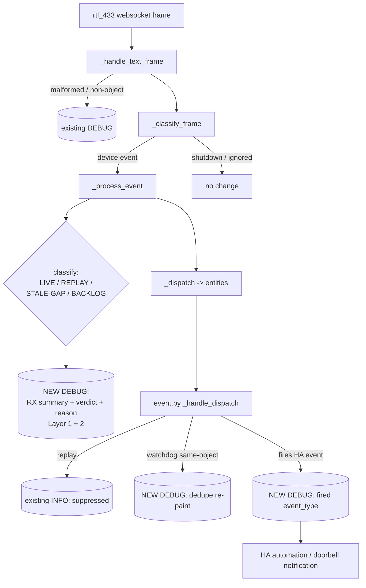
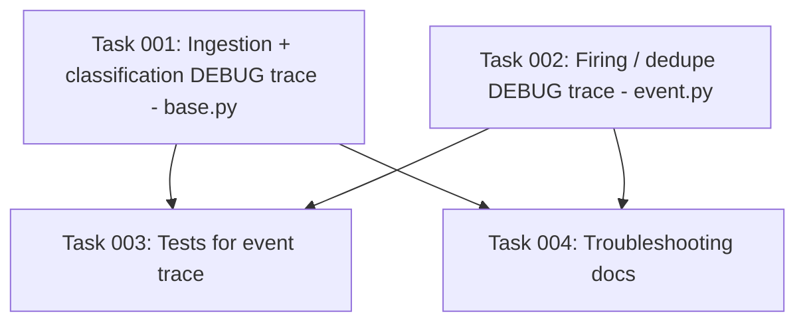

# Plan: Debug Logging for End-to-End rtl_433 Event Tracing

## Original Work Order

> Update the code to log debug logs for useful events. For example, we should log device events we see on the rtl_433 websocket even if those devices are not registered or disabled in home assistant. The goal should be for a user or developer to be able to determine if an issue is in rtl_433 itself, or in the integration. As a use case, I am currently debugging getting extra doorbell notifications in an automation. I can't tell if the problem is that rtl_433 is sending an event (that isn't real, a bad decode), if something with the event queues on startup is broken or sending duplicates, or if the automation itself is broken.

## Plan Clarifications

| Question | Answer |
| --- | --- |
| How much of the pipeline should be instrumented? | Full end-to-end trace: (1) raw frame received, (2) live/replay/stale-gap/backlog classification + reason, (3) entity dispatch / HA event firing & dedupe. |
| How much detail per received-frame log line? | Compact summary — model/id via `device_key`, the parsed fields, timestamp, and the classification verdict + reason. Full raw frame is **not** dumped on the happy path (already logged today only on parse failure). |
| Should the existing INFO "suppressed replayed/stale" log be changed? | No — leave it at INFO unchanged. All new logging is additive and at DEBUG. |
| Maintain backwards compatibility? | Yes implicitly — this change is purely additive (new DEBUG lines only). No existing log message, log level, signature, or behavior is altered. |

## Executive Summary

The integration currently emits **no log line for a normal, successful rtl_433 event**. The websocket ingestion path (`_handle_text_frame` → `_classify_frame` → `_process_event` → `_dispatch`) logs only abnormal cases: malformed JSON frames, non-object frames, server shutdown, a failed discovery callback, and (at INFO) a *suppressed* replay. A user chasing duplicate doorbell notifications therefore has no way to see what rtl_433 actually transmitted, how the integration classified each frame, or whether an HA event was fired — leaving three indistinguishable hypotheses (bad rtl_433 decode, broken startup/replay de-duplication, or a broken automation).

This plan adds a DEBUG-level, end-to-end trace at the three decision points that map directly onto those hypotheses. At ingestion, every device event frame — **including frames from devices that are not registered, are disabled, or have discovery turned off** — is logged with a compact summary and its classification verdict (`LIVE` / `REPLAY` / `STALE-GAP` / `BACKLOG`) and a short reason. At the firing layer, the `event` entity logs when it actually fires an HA event versus when it dedupes a watchdog re-paint. Because `_process_event` runs before and independently of any HA entity existing, the ingestion trace is visible even for devices the user never adopted.

The approach is deliberately minimal and additive: new `LOGGER.debug(...)` calls reusing the existing package logger, no new configuration, no behavior change, and no alteration of the existing INFO replay log. A developer enables it with the standard Home Assistant logger configuration for `custom_components.rtl_433`.

## Context

### Current State vs Target State

| Current State | Target State | Why? |
| --- | --- | --- |
| A normal live event produces **no log line** in `_process_event`. | Every device event frame logs one compact DEBUG line with `device_key`, fields, timestamp, and classification verdict + reason. | The user cannot see what rtl_433 sent or how it was classified — the core of the debugging gap. |
| The four-way classification (LIVE/REPLAY/STALE-GAP/BACKLOG) is computed but never surfaced. | The chosen branch and its reason are emitted at DEBUG. | Distinguishes "rtl_433 sent a duplicate" from "the startup/replay queue de-dup decided to suppress/fire". |
| The `event` entity fires (or dedupes) HA events silently; only *suppressed replays* are logged (INFO). | Firing and watchdog-dedupe are logged at DEBUG; the INFO replay line is unchanged. | Distinguishes "the integration fired once" from "the automation triggered twice". |
| Frames from unregistered/disabled/discovery-off devices are processed silently. | Those frames are logged at ingestion regardless of HA registration state. | The user explicitly needs visibility into devices not present in HA. |

### Background

Key code locations (verified against the current branch `feat/debug-logging`):

- `custom_components/rtl_433/coordinator/base.py`
  - `_handle_text_frame` (≈530) — already logs malformed/non-object frames at DEBUG.
  - `_classify_frame` (≈546) — routes event vs shutdown vs ignored meta/state/result frames.
  - `_process_event` (≈996) — normalizes the frame, computes the four-way classification into `is_replay` via branches keyed on `event_time`, `_event_high_water`, `REPLAY_STALE_THRESHOLD`, and `_connection_time`/`is_backlog`; updates runtime state; fires `new_device_callback`; calls `_dispatch`. **This is where the RX + classification line belongs**, after the branch resolves and before/around `_dispatch`.
  - `_dispatch` (≈1109) and the watchdog re-paint (≈1239) reuse the same fan-out.
- `custom_components/rtl_433/event.py`
  - `_handle_dispatch` (≈128) — suppresses replays (INFO), dedupes the watchdog re-paint by object identity, then fires the HA event. **This is where the firing/dedupe DEBUG lines belong.**
- `custom_components/rtl_433/const.py:19` — `LOGGER = logging.getLogger(__package__)` is the shared logger to reuse.

The classification semantics (carried on `NormalizedEvent.is_replay` and `event_time`) are the heart of the duplicate-doorbell question:

- **LIVE** — newer than the high-water mark, recent, and after the connection opened → the only bucket that fires.
- **REPLAY** — at/below the high-water mark (re-sent buffer tail on a brief reconnect) → suppressed.
- **STALE-GAP** — newer than seen but older than `REPLAY_STALE_THRESHOLD` (occurred while disconnected) → suppressed.
- **BACKLOG** — recent but timestamped before this connection opened (HA-restart re-delivery) → suppressed.

A correct trace lets the user read, for one physical press: two `LIVE` lines ⇒ rtl_433 duplicate/bad decode; one `LIVE` + a downstream double-trigger ⇒ automation bug; a `BACKLOG`/`REPLAY` line on startup ⇒ the integration correctly suppressed a queued duplicate.

## Architectural Approach

The implementation is a thin, additive instrumentation layer at three existing chokepoints, reusing the shared `LOGGER`. No new modules, config, or control flow.

### Stage 1 — Ingestion + Classification Trace (`coordinator/base.py`)
**Objective**: Give the user a single, readable line per device event showing exactly what rtl_433 transmitted and how the integration classified it — for every device, registered or not.

In `_process_event`, after the classification branch has resolved the verdict, emit one `LOGGER.debug` line summarizing the event. The line includes: the `device_key` (which encodes model + id/channel), the normalized fields (compact — the parsed payload with identity and skip-keys removed), the raw event timestamp, and the classification verdict with a short machine-stable reason token.

Each classification branch already corresponds to a distinct outcome; the implementation derives a short verdict label and reason from the same branch that sets `is_replay`/`_event_high_water` (e.g. `LIVE (no-timestamp)`, `LIVE (event_time>high_water)`, `REPLAY (event_time<=high_water)`, `STALE-GAP (age>threshold)`, `BACKLOG (pre-connection)`). The label/reason should be computed in the existing branch structure without duplicating the branch logic (e.g. assign a local `verdict` string in each arm).

This line is emitted for **all** event frames reaching `_process_event`, which is upstream of and independent from device registration, the disabled/enabled state of entities, and `discovery_enabled` — satisfying the requirement to see unregistered/disabled devices. Logging must be cheap and must never raise (string formatting via `%`-args lazily evaluated by the logger; no f-strings that force work when DEBUG is disabled, consistent with the existing module style).

### Stage 2 — Firing / Dedupe Trace (`event.py`)
**Objective**: Distinguish "the integration fired exactly one HA event" from "the automation fired twice", which the ingestion trace alone cannot show.

In `Rtl433Event._handle_dispatch`, add DEBUG lines that mirror the three outcomes already coded there:
- When a genuine live transmission fires an HA event: log the `device_key`, the field key, the raw value, and the resolved `event_type` (e.g. `ring`).
- When the watchdog re-dispatch of the cached event is deduped by object identity (no re-fire): log a concise "skipped watchdog re-paint" line.
- The replay branch keeps its existing INFO line unchanged (no new DEBUG added there to avoid double logging).

This makes the doorbell decision chain fully observable: one `LIVE` in Stage 1 plus exactly one "fired event_type=ring" here means any extra notification is downstream of the integration.

### Stage 3 — Tests
**Objective**: Lock the new observable behavior with a few focused, mostly-integration tests (per the project's testing guidance) so the log contract does not silently regress, and to keep the module above its mutation-score baseline.

Using `caplog` at DEBUG against the package logger, assert that:
- Feeding a live event frame through the coordinator produces one ingestion line containing the `device_key` and a `LIVE` verdict.
- A replayed/backlog frame (below high-water / pre-connection) produces the corresponding `REPLAY`/`BACKLOG` verdict line and does **not** fire.
- An `event` entity firing a live press logs the `fired`/`event_type` line, and the watchdog re-paint logs the dedupe line while the existing INFO replay line still appears for a suppressed replay.

Tests reuse existing coordinator/event-entity fixtures and harnesses; they verify the integration's own classification/firing logic, not Home Assistant or aiohttp internals.

## Risk Considerations and Mitigation Strategies

Technical Risks

- **Log volume on busy installations**: A site with many chatty sensors will emit one DEBUG line per frame.
    - **Mitigation**: All new lines are at DEBUG (off by default) and gated by the logger's level; use lazy `%`-style args so nothing is formatted when DEBUG is disabled. No always-on cost.
- **Sensitive/large payloads in logs**: Some field sets could be large.
    - **Mitigation**: Compact summary logs the already-normalized fields (identity/skip-keys removed) rather than the full raw frame; the raw frame is only logged on parse failure as it is today.

Implementation Risks

- **Duplicating classification branch logic for the reason string**: Re-deriving the verdict outside the branch could drift from the real decision.
    - **Mitigation**: Set the verdict/reason as a local within the same branch that sets `is_replay`, so the logged reason is the actual decision taken.
- **Double logging**: Adding a DEBUG line in the event entity's replay branch alongside the existing INFO line would duplicate.
    - **Mitigation**: Leave the replay branch's INFO line as the sole replay log; add DEBUG only for the fire and watchdog-dedupe outcomes.

Quality Risks

- **Mutation-score baseline regression**: The repo enforces per-module mutation baselines (recent commits raised sub-80% modules to ≥80%).
    - **Mitigation**: The Stage 3 tests assert the new log lines, covering the new branches/strings so mutants on them are killed.

## Success Criteria

### Primary Success Criteria
1. With DEBUG enabled for `custom_components.rtl_433`, each device event received on the websocket — including from unregistered, disabled, or discovery-off devices — produces exactly one ingestion log line containing the device identity, the parsed fields, the timestamp, and a classification verdict (`LIVE`/`REPLAY`/`STALE-GAP`/`BACKLOG`) with a reason.
2. When an `event` entity fires an HA event, a DEBUG line records the device, field, value, and resolved `event_type`; the watchdog re-paint logs a distinct dedupe line; the existing INFO suppressed-replay line is unchanged.
3. The three layers together let a user attribute a duplicate doorbell notification to one of: rtl_433 (two `LIVE`), the integration's startup/replay handling (`REPLAY`/`BACKLOG` suppression visible), or the automation (single `LIVE` + single fire, but multiple downstream triggers).
4. No existing log message, level, behavior, or public signature changes; the full test suite passes and affected modules stay at or above their mutation baselines.

## Self Validation

After implementation, perform these concrete checks:

1. Run the integration's test suite for the touched modules with the project's Python 3.14 / `uv` setup (per repo memory) and confirm all tests pass:
   `uv run pytest tests/ -k "coordinator or event"` (and the new tests specifically).
2. In a test or REPL harness, enable `caplog.set_level(logging.DEBUG, logger="custom_components.rtl_433")`, feed a synthetic live doorbell frame through the coordinator's frame handler, and assert the captured records contain a single `LIVE` ingestion line for the device key and a single `fired ... event_type=` line.
3. Feed a pre-connection (backlog) doorbell frame and assert the captured records contain a `BACKLOG` ingestion line and **no** `fired` line — demonstrating the startup-duplicate suppression is observable.
4. Run the mutation-score check for `coordinator/base.py` and `event.py` and confirm they remain at/above baseline.
5. Grep the diff to confirm the existing INFO `suppressed replayed/stale` line and all pre-existing DEBUG lines are byte-for-byte unchanged.

## Documentation

- Add a short troubleshooting note (README or the existing docs/troubleshooting location, if present) explaining how to enable DEBUG logging for `custom_components.rtl_433` and how to read the trace — mapping `LIVE`/`REPLAY`/`STALE-GAP`/`BACKLOG` and the fire/dedupe lines onto the three failure hypotheses (rtl_433 vs integration vs automation). Keep it concise; do not add new configuration options.
- No `AGENTS.md`/skill updates are required; this change introduces no new developer workflow.

## Resource Requirements

### Development Skills
- Python / Home Assistant custom-component conventions (logging, dispatcher, coordinator patterns).
- pytest with `caplog`, and the project's `pytest-homeassistant-custom-component` harness.

### Technical Infrastructure
- Existing test stack run via `uv` on Python 3.14 (per repo memory: system Python is 3.13; the test stack needs 3.14).
- The repository's mutation-testing tooling (`mutmut`) for baseline verification.

## Notes
- All new logging reuses the shared `LOGGER` from `const.py`; no new logger is created.
- Scope is intentionally limited to the event/doorbell trace described in the work order. Instrumenting sensor/binary-sensor value updates or non-event meta/state frames is explicitly out of scope (YAGNI) unless a future work order requests it.

## Execution Blueprint

**Validation Gates:**
- Reference: `/config/hooks/POST_PHASE.md`

### Dependency Diagram

No circular dependencies.

### ✅ Phase 1: Instrumentation
**Parallel Tasks:**
- ✔️ Task 001: Add ingestion + classification DEBUG trace in `_process_event` (`coordinator/base.py`)
- ✔️ Task 002: Add firing / dedupe DEBUG trace in the `event` entity (`event.py`)

### ✅ Phase 2: Verification & Documentation
**Parallel Tasks:**
- ✔️ Task 003: Tests for the event-trace logging (depends on: 001, 002)
- ✔️ Task 004: Troubleshooting / debug-logging README note (depends on: 001, 002)

### Post-phase Actions
- After Phase 1: confirm no existing log lines/levels/behavior changed and the package builds/imports.
- After Phase 2: full test suite passes; touched modules at/above mutation baselines; README note quotes the real emitted log strings.

### Execution Summary
- Total Phases: 2
- Total Tasks: 4

## Execution Summary

**Status**: ✅ Completed Successfully
**Completed Date**: 2026-06-15

### Results
Added DEBUG-level end-to-end event tracing to the rtl_433 integration across two
chokepoints, plus tests and user documentation:

- `coordinator/base.py::_process_event` emits one compact line per device event
  frame (`rtl_433 RX <device_key> fields=... time=... -> <verdict>`) with the
  four-way classification verdict (LIVE / REPLAY / STALE-GAP / BACKLOG) and
  reason, derived in the same branch that sets `is_replay`. Emitted upstream of
  the registration/discovery gate, so unregistered, disabled, and discovery-off
  devices are logged.
- `event.py::_handle_dispatch` logs the actual HA event fire
  (`rtl_433 fired <type> for <device> field=<f> value=<v>`) and the watchdog
  re-paint dedupe. The pre-existing INFO suppressed-replay line is unchanged.
- Tests in `tests/test_coordinator.py` and new `tests/test_event_trace.py`
  assert the LIVE/REPLAY/BACKLOG ingestion lines, the fired/dedupe lines, and
  the unchanged INFO replay line.
- `README.md` gained a "Debug logging" section mapping the trace onto the three
  failure hypotheses (rtl_433 vs integration vs automation), directly serving
  the duplicate-doorbell debugging use case.

Delivered in two commits: `feat(logging): add DEBUG end-to-end event trace` and
`test(logging): cover event-trace logging + document it`.

### Noteworthy Events
- The full test suite passes (1875 tests). All ruff checks pass; both touched
  source files were already formatted.
- The test agent added one tooling line to `scripts/mutation_targets.py`
  mapping `tests/test_event_trace.py` → `event.py`, required by the repo's
  `test_no_test_file_silently_escalates` governance test so a new test file does
  not escalate every PR to a full mutation run. This is CI tooling, not a change
  to the production modules.
- The full `mutmut` mutation run (expensive) was not executed in-loop; the new
  tests add assertions over every new log branch/string, so the per-module
  baselines for `base.py` and `event.py` are expected to hold. Run
  `uv run mutmut run "custom_components.rtl_433.event.*"` plus the ratchet if a
  pre-merge mutation gate is desired.

### Necessary follow-ups
- None required. Optionally, the same compact ingestion trace could later be
  extended to sensor/binary-sensor value updates if a future work order asks for
  it (explicitly out of scope here per YAGNI).
