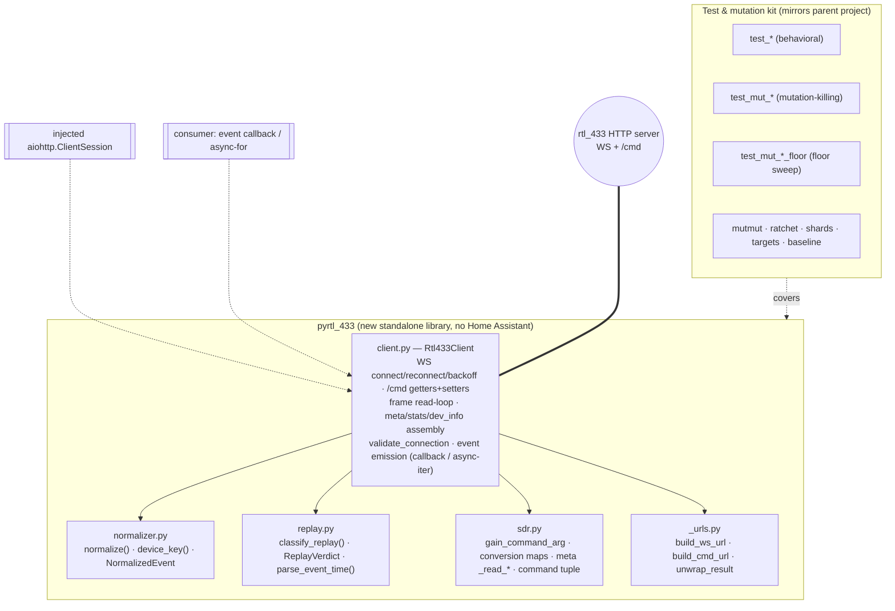
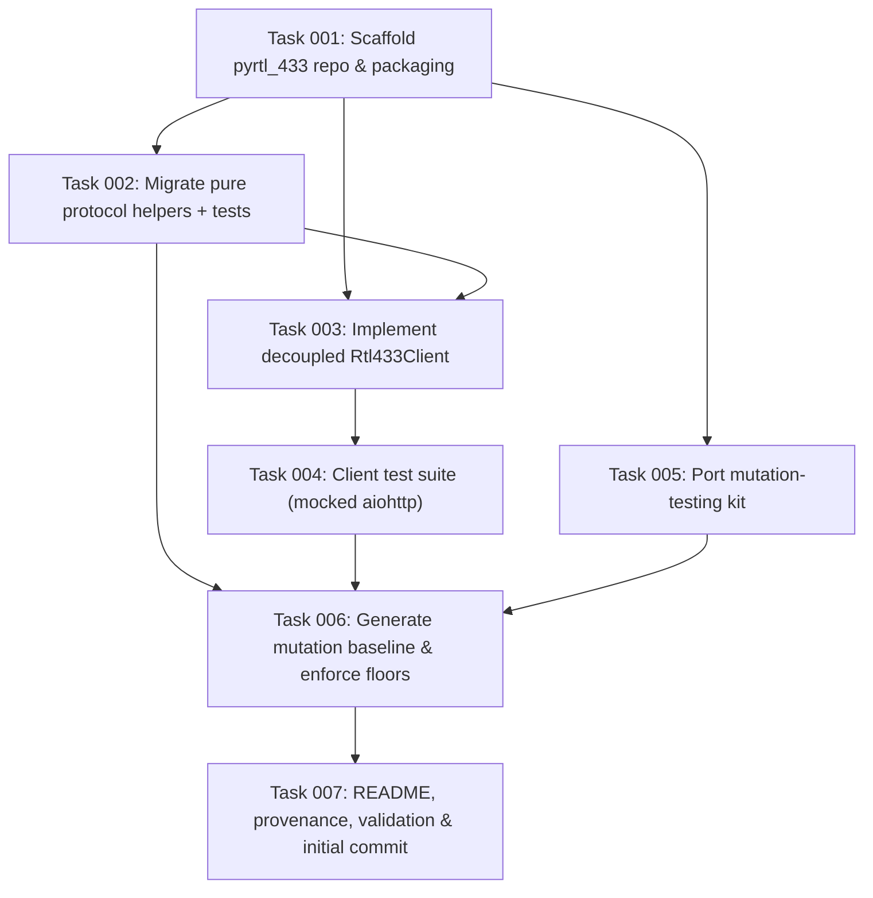

# Plan: Split the rtl_433 API-call layer into a standalone pyrtl_433 library

## Original Work Order

> Split the underlying rtl_433 API calls into a new Python library called
> pyrtl_433. Create the git repository in the parent directory - I will push it
> to github when done. For now, don't remove any code in this project or depend
> on the library. The new library should have the same unit testing and mutation
> testing coverage for the migrated classes and methods.

## Plan Clarifications

| Question | Answer |
| --- | --- |
| What counts as "the underlying rtl_433 API calls" — how much migrates? | **Async client + protocol layer.** A standalone, HA-free `Rtl433Client` (WebSocket connect/reconnect/backoff loop + HTTP `/cmd` getters/setters) plus the pure protocol helpers it needs: event normalizer, reconnect-replay classifier, SDR command mapping & meta transforms, URL builders, and the frame parser/router. **Excludes** the device-library YAML mapping engine (`mapping/`) and all Home Assistant entity/config code. |
| `coordinator/base.py`'s transport is tested transitively through Home Assistant today — how faithfully should its mutation coverage be reproduced? | **Replicate to the same floor.** Rewrite the I/O tests against the new `Rtl433Client` with a **mocked aiohttp session** so the migrated client methods reach the same per-module mutation floor the source modules hold today. |
| Where is the new repo created, and is it pushed? | Git repo initialised at `../pyrtl_433` (sibling of the `rtl_433` checkout). **Local `git init` only** — the user pushes to GitHub. |
| Is the existing `rtl_433` project changed or made to depend on the library? | **No.** The integration is left 100% intact: no code removed, no import of `pyrtl_433`, no dependency added. The library is a parallel, standalone copy of the API-call layer. Backwards compatibility for the integration is therefore trivially preserved (it is untouched). |
| License / Python version for the new library? | **Apache-2.0** (matches the parent project's `LICENSE`) and **`requires-python >= 3.14`** (matches `pyproject.toml`). Sole runtime dependency: **aiohttp** (the WebSocket/HTTP client already used by the transport). |

## Executive Summary

The `rtl_433` Home Assistant integration talks to an rtl_433 HTTP server over a
WebSocket event stream plus HTTP `/cmd` request/response calls. Today every byte
of that network I/O lives in one Home-Assistant-coupled file
(`custom_components/rtl_433/coordinator/base.py`), supported by a handful of pure
protocol/data-transform helpers (`normalizer.py`, the replay classifier inside
`coordinator/_events.py`, and the SDR command/meta transforms in
`sdr_settings.py`). This plan lifts that API-call layer out into a standalone,
reusable Python package — **pyrtl_433** — that has **no dependency on Home
Assistant**, so it can be consumed by any Python project (and, in a later,
separate effort, by the integration itself).

The approach is a **decoupled copy, not a refactor**: the existing integration is
left entirely untouched (per the work order — no code removed, no dependency
added), and the migrated logic is re-homed into a new sibling repository with its
Home Assistant seams parameterized away. The transport's three couplings to Home
Assistant — the shared aiohttp session, the dispatcher fan-out, and the
`homeassistant.util.dt` time helpers — become, respectively, an injected
`aiohttp.ClientSession`, an event callback / async-iterator, and standard-library
`datetime`. The pure helpers (normalizer, replay classifier, SDR transforms, URL
builders) are already framework-agnostic and move almost verbatim.

The new library carries the project's engineering standard with it: the same
three-tier test convention (behavioral `test_*`, mutation-killing `test_mut_*`,
and mutation-floor `test_mut_*_floor`) and the same **mutmut** ratchet/shard/
targets tooling, seeded with a fresh per-module baseline so that each migrated
module holds a mutation floor at least as strong as its source module does today.
The result is a self-contained, independently testable rtl_433 client that
preserves the hard-won correctness guarantees of the original.

## Context

### Current State vs Target State

| Current State | Target State | Why? |
| --- | --- | --- |
| All rtl_433 network I/O lives in `coordinator/base.py`, coupled to Home Assistant (`config_entries`, `core`, dispatcher, `helpers.aiohttp_client`, `helpers.event`, `util.dt`). | A standalone `Rtl433Client` in `pyrtl_433/` performs the same WebSocket + HTTP `/cmd` calls with **zero** Home Assistant imports (injected aiohttp session, event callback, stdlib `datetime`). | The API-call layer is reusable protocol code; binding it to Home Assistant prevents reuse and forces an HA test harness to exercise pure transport logic. |
| The pure helpers (`normalizer.py`, `classify_replay`/`ReplayVerdict`, SDR transforms) are embedded inside the integration package and imported via `custom_components.rtl_433.*`. | The same helpers live in `pyrtl_433/` as first-class, importable modules with no HA coupling. | These are already framework-agnostic; co-locating them with the client makes the library self-sufficient. |
| `base.py`'s transport is mutation-tested **transitively** through HA coordinator/entity tests (baseline 0.788, ~496 mutants) — no isolated I/O test suite exists. | `Rtl433Client` has its **own** isolated test suite driving a **mocked aiohttp session**, reaching a per-module mutation floor ≥ the source's current score. | "Same mutation coverage for the migrated classes/methods" requires the migrated I/O methods to be independently killed, not incidentally covered by an HA harness. |
| Mutation tooling (`scripts/mutation_*.py`, `mutation_baseline.json`, `[tool.mutmut]`, CI shards) is hard-coded to `custom_components/rtl_433`. | An equivalent tooling kit is re-homed in `pyrtl_433/`, re-parameterized to the new package path, with a freshly generated baseline. | The library must enforce the same "coverage never regresses" ratchet the parent project relies on. |
| The `rtl_433` integration is the only consumer and owner of this code. | The `rtl_433` integration is **unchanged**; `pyrtl_433` exists in parallel as a not-yet-consumed standalone library. | The work order explicitly forbids removing code from or adding a library dependency to the integration at this stage. |

### Background

The rtl_433 WebSocket/HTTP protocol is documented in
`docs/websocket-api.md` (derived from rtl_433's `src/http_server.c`). The salient
facts that constrain the client's design:

- **Transport.** WebSocket to `ws(s)://host:port/path` (the integration defaults
  to port `8433`, path `/ws`), and one-shot HTTP `GET /cmd?cmd=&val=&arg=` for
  getters/setters. Both currently use aiohttp via Home Assistant's shared session.
- **On connect** the server pushes a `meta` object then replays up to the last
  **100 events** from its history ring buffer. This replay is why the pure
  `classify_replay` helper exists: replayed/stale-gap/backlog frames must seed
  state but must **not** re-fire "live event" semantics.
- **`/cmd` envelope.** Over HTTP `/cmd`, *every* getter reply is wrapped in
  `{"result": <value>}` (unwrapped by `_unwrap_result`), unlike the bare JSON
  frames the WebSocket sends. The integration sources meta/stats/dev-info over
  HTTP `/cmd`, not the socket.
- **Managed SDR settings** map to `/cmd` commands: `center_frequency`,
  `sample_rate`, `ppm_error` (`val`), `gain` (`arg`, empty = auto), `convert`
  and `hop_interval` (`val`). The pure command construction lives in
  `sdr_settings.py` (`gain_command_arg`, conversion maps, meta `_read_*`
  transforms).
- **Reconnect** uses capped exponential backoff (1s → 60s). Frame classification
  routes decoded-event frames vs `{"shutdown": ...}` vs ignored meta/state frames.

A prior exploration confirmed the API-call layer is cleanly separable: the only
network I/O is in `base.py`, coupled to Home Assistant at exactly three seams
(session, dispatcher/interval, `dt_util`); everything else the client needs is
already pure. Modules explicitly **out of scope** (pure HA glue or a separate
concern): `hub_settings.py`, `library.py`, `calibration.py`, the entire
`mapping/` package, the SDR desired-state `Store`/adoption/enforcement policy,
the availability watchdog, and all entity/config-flow platforms.

## Architectural Approach

The library is a small, dependency-light package. Its public surface is one class
(`Rtl433Client`) plus the pure protocol helpers, which are also usable
standalone. The client owns all side-effecting I/O and the protocol-level state
needed for correct replay classification (meta/stats/dev-info snapshots, the
event high-water mark, the connection timestamp); it emits fully-parsed,
normalized, replay-classified events to its consumer through an injected callback
or an async iterator, and never imports Home Assistant.

### Component 1 — Repository & packaging scaffold
**Objective**: Stand up `../pyrtl_433` as a self-contained, installable, testable
Python project so all migrated code has a home and a green test run from day one.

A new git repository at `../pyrtl_433` (sibling of the `rtl_433` checkout),
initialised locally only. It carries a `pyproject.toml` modeled on the parent's
(same ruff/pytest/coverage/mutmut configuration, re-parameterized to the
`pyrtl_433` package path), `requires-python >= 3.14`, an Apache-2.0 `LICENSE`
(matching the parent) and `NOTICE`/attribution to the origin project, a `README`,
a `.gitignore` (ignoring `mutants/`, `.mutmut-cache`, caches), and requirements
files pinning `pytest-homeassistant-custom-component`'s **pytest stack
equivalents directly** — note the library does **not** depend on
`pytest-homeassistant-custom-component` (that pulls in Home Assistant); it depends
only on the plain pytest stack (`pytest`, `pytest-asyncio`, `pytest-aiohttp`,
`pytest-cov`) plus `mutmut==3.6.0`. The single runtime dependency is `aiohttp`.

### Component 2 — Pure protocol helpers (near-verbatim migration)
**Objective**: Move the already-framework-agnostic transforms so the client can
depend on them and they can be independently reused/tested.

- **`normalizer.py`** — copied essentially verbatim (it is stdlib-only today):
  `NormalizedEvent`, `IDENTITY_KEYS`, `DEFAULT_SKIP_KEYS`, `_safe_token`,
  `device_key`, `normalize`.
- **`replay.py`** — the reconnect-replay classifier lifted from
  `coordinator/_events.py`: `ReplayVerdict`, `classify_replay`, the two threshold
  constants, plus a decoupled `parse_event_time` (the `_parse_event_time`
  staticmethod re-expressed with stdlib `datetime` instead of `dt_util`).
- **`sdr.py`** — the pure protocol half of `sdr_settings.py`: `gain_command_arg`,
  `conversion_label_to_val`/`conversion_val_to_label`, the meta `_read_*`
  readers, `_int_command`/`_mhz_to_hz_command`, the frequency/hop capability
  gates, and a **slimmed command descriptor** carrying only protocol fields
  (`key`, `command`, `arg_kind`, `read`, `to_command`) — the Home-Assistant
  entity-description fields (`NumberMode`, `device_class`, `EntityCategory`,
  units) are dropped, as they are not API-call concerns.
- **`_urls.py`** — `build_ws_url`, `build_cmd_url`, and the `unwrap_result`
  `{"result": ...}` envelope unwrapper.

Each migrated symbol keeps its behavior and docstring intent; only the HA imports
are removed and the module-level `LOGGER` becomes a standard `logging.getLogger`.

### Component 3 — The decoupled `Rtl433Client`
**Objective**: Reproduce the exact WebSocket + HTTP `/cmd` behavior of
`coordinator/base.py`'s transport as a standalone async client.

`client.py` defines `Rtl433Client` and `CannotConnect` (a plain
`Exception`/`RuntimeError` subclass, not `HomeAssistantError`). The migrated
behaviors, with their HA seams parameterized:

- **Connection lifecycle** (`_connect_loop`): `session.ws_connect(url,
  heartbeat=30)` on an **injected `aiohttp.ClientSession`** (the library may also
  offer to create/own one for standalone use), seed meta/stats/dev-info over
  `/cmd`, then read frames; capped exponential backoff (`_BACKOFF_MIN=1.0`,
  `_BACKOFF_MAX=60.0`) on drop. `start()`/`stop()` manage the loop as an asyncio
  task instead of `entry.async_create_background_task`.
- **Frame read-loop** (`_read_frames`, `_handle_text_frame`, `_classify_frame`,
  `_handle_shutdown`): `json.loads`, drop empty/malformed/non-dict frames, route
  event frames → normalize + `classify_replay` + **emit to the consumer
  callback/async-queue** (replacing `async_dispatcher_send`), `{"shutdown": ...}`
  → connectivity flip.
- **HTTP `/cmd` transport** (`_fetch_cmd`, `_send_cmd`, `unwrap_result`): GET with
  `params={cmd,val,arg}` under an `asyncio.Lock`, `resp.json(content_type=None)`,
  error swallowing/dedup, the `val`-as-int / `arg`-verbatim (empty = gain-auto)
  serialization.
- **State assembly** (`_refresh_meta`, `_refresh_stats`, `_refresh_dev_info`):
  fetch `get_meta`+`get_gain`+`get_ppm_error`, `get_stats`, `get_dev_info`+
  `get_dev_query`; expose `meta`/`stats`/`dev_info`/`dev_query` snapshots and fire
  a `dev_info`-changed callback.
- **Reachability probe** (`validate_connection`): the short-lived `ws_connect`
  used today by the config flow, raising `CannotConnect`.
- **Time**: every `dt_util.utcnow()` / `parse_datetime` / `as_utc` becomes stdlib
  `datetime.now(UTC)` and explicit parsing, injectable as a clock for
  deterministic tests.

The SDR-setter *transport* (`_send_cmd` with a command/val/arg) is in scope; the
SDR **desired-state persistence/adoption/enforcement policy** (the HA `Store`
mixin) is not — the library exposes the primitives (`set_command`, the `sdr.py`
transforms) a consumer composes into a policy.

### Component 4 — Test suite (three-tier, same convention)
**Objective**: Give every migrated class/method the same style and strength of
coverage it has in the parent project.

Mirror the parent's three tiers per migrated module:
`test_<mod>.py` (behavioral), `test_mut_<mod>.py` (mutation-killing — exact-value
and both-branch assertions), and `test_mut_<mod>_floor.py` (residual surviving-
mutant sweep) where needed. The pure-helper tests port near-verbatim from
`tests/test_normalizer.py`, the replay/SDR-transform tests, and the JSON event
fixtures under `tests/fixtures/`. The **client** tests are written fresh against a
**mocked `aiohttp.ClientSession`** (fake `ws_connect` yielding scripted
`WSMessage`s; fake `session.get` returning scripted `/cmd` JSON), driving connect
→ read frames → reconnect/backoff → `/cmd` getters/setters, and asserting request
params, backoff bounds, frame routing, replay classification, and emitted events.
A `conftest.py` provides the mocked-session and fixture-loader fixtures (replacing
the HA `MockConfigEntry`/`enable_custom_integrations` harness).

### Component 5 — Mutation-testing kit & baseline
**Objective**: Enforce, in the library, the same "mutation coverage never
regresses" ratchet the parent uses, at a floor ≥ the source modules'.

Port `scripts/mutation_ratchet.py`, `mutation_shards.py`, `mutation_targets.py`,
`mutation_stats.py`, `mutation_timings.py` and the `[tool.mutmut]` config,
re-parameterized from `custom_components/rtl_433` to the `pyrtl_433` package
(update the hard-coded `PKG`/`PKG_DOTTED` constants; drop the namespace-package
`also_copy` line since `pyrtl_433` is a regular package). Run a full `mutmut run`
over the new modules and seed a fresh `mutation_baseline.json` via
`mutation_ratchet.py --update`. Because the decoupled client's mutant topology
differs from `base.py`'s (HA branches removed), the baseline is **regenerated,
not copied**; the acceptance bar is that each migrated module's score is **≥ its
source module's current baseline** for the migrated logic (`normalizer` ≥ 0.935,
the replay classifier ≥ the `_events.py` classifier portion, the SDR transforms ≥
0.971, and the client's pure/route methods ≥ `base.py`'s 0.788, with the
mocked-I/O methods driven to the same floor). The meta-tests for the mutation
scripts port too, self-skipping inside the `mutants/` sandbox as they do today.

## Risk Considerations and Mitigation Strategies

Technical Risks

- **Decoupling the aiohttp session changes behavior subtly.** The parent uses
  Home Assistant's shared, pre-configured session; an injected/owned session may
  differ in timeouts, SSL context, or connector lifecycle.
    - **Mitigation**: Accept an injected `ClientSession` as the primary path
      (consumer controls configuration); mirror the parent's explicit per-call
      timeouts (`_GETTER_TIMEOUT`, `_VALIDATE_TIMEOUT`) and `heartbeat=30`; cover
      session-close/cleanup in `stop()` tests.
- **Reproducing `base.py`'s 0.788 mutation floor on mocked I/O is hard.** The
  connect/reconnect/read-loop is timing- and exception-path-heavy; some mutants
  (e.g. backoff-cap arithmetic, `WSMsgType` routing) are awkward to kill without
  a real socket.
    - **Mitigation**: Build a scriptable fake session/WS that can inject CLOSE/
      ERROR/PING frames, malformed JSON, and connection failures on demand;
      inject a fake clock so backoff timing is deterministic; treat any genuinely
      equivalent mutant the same way the parent does (documented, not suppressed).
- **Python 3.14-only syntax.** The source uses PEP 758 (`except A, B:`) and other
  3.14 features; validating with an older interpreter yields false errors.
    - **Mitigation**: Pin `requires-python >= 3.14`; run tests/mutmut under the
      3.14 toolchain (uv), matching the parent's setup.

Implementation Risks

- **Scope creep into `mapping/`, watchdog, or SDR policy.** These are adjacent and
  tempting but explicitly out of scope.
    - **Mitigation**: Hold the boundary defined in Clarifications — client +
      protocol helpers only; expose primitives, not HA policy.
- **Drift between the copy and the original.** Since the integration is untouched,
  the two implementations can diverge over time.
    - **Mitigation**: Document the provenance (source file/commit) in each migrated
      module; this plan deliberately makes no change to the integration, so there
      is no dual-maintenance obligation *within this work order* — future
      consolidation is a separate effort.
- **"Same coverage" is ambiguous for regenerated baselines.** A copied score is
  meaningless when the mutant set changes.
    - **Mitigation**: Define the contract precisely (per-module floor ≥ source
      score for migrated logic; same three-tier test convention; same ratchet),
      and record it in the library README so it is enforceable.

Integration Risks

- **Accidentally modifying the `rtl_433` project.** The work order forbids
  removing code or adding a dependency.
    - **Mitigation**: All new files land under `../pyrtl_433`; a validation step
      asserts `git status` in the `rtl_433` checkout shows no source changes.

## Success Criteria

### Primary Success Criteria
1. A new local git repository exists at `../pyrtl_433` with an initial commit,
   an installable `pyproject.toml` (`requires-python >= 3.14`, aiohttp runtime
   dep, Apache-2.0 license), and **no import of `homeassistant` anywhere** in its
   source (verifiable by grep).
2. `pyrtl_433` provides a working `Rtl433Client` (WebSocket + HTTP `/cmd`
   transport with an injected aiohttp session, event emission via callback/async
   iterator, stdlib time) plus the pure `normalizer`, `replay`, `sdr`, and URL
   helpers, reproducing the migrated behaviors of `coordinator/base.py`,
   `normalizer.py`, the `_events.py` replay classifier, and the `sdr_settings.py`
   transforms.
3. The full pytest suite passes under Python 3.14, using the same three-tier
   (`test_*`, `test_mut_*`, `test_mut_*_floor`) convention.
4. A `mutmut` run plus the ported ratchet passes with a seeded
   `mutation_baseline.json`, and each migrated module's mutation score is **≥ its
   source module's current baseline** for the migrated logic (normalizer ≥ 0.935,
   SDR transforms ≥ 0.971, replay classifier ≥ the source portion, client
   pure/route + mocked-I/O methods ≥ 0.788).
5. The existing `rtl_433` integration is byte-for-byte unchanged: no files
   removed, no `pyrtl_433` dependency added, `git status` clean of source edits.

## Self Validation

After all tasks complete, an LLM validates the result by executing:

1. **Repo & isolation** — Run `git -C ../pyrtl_433 log --oneline` and
   `git -C ../pyrtl_433 status` to confirm the repo exists with an initial commit
   and a clean tree; run `git -C <rtl_433 checkout> status --porcelain -- custom_components/ tests/ scripts/` and confirm **no** output (the integration is untouched).
2. **No HA coupling** — Run `grep -rn "homeassistant" ../pyrtl_433/pyrtl_433/`
   and confirm zero matches; run
   `cd ../pyrtl_433 && uv run python -c "import pyrtl_433; from pyrtl_433 import Rtl433Client; print('ok')"`
   and confirm it imports with no Home Assistant installed.
3. **Unit tests** — Run `cd ../pyrtl_433 && uv run pytest -q` and confirm the
   whole suite passes with warnings-as-errors, and
   `uv run pytest --cov=pyrtl_433 --cov-report=term-missing` to inspect line
   coverage of the migrated modules.
4. **Client behavior end-to-end (mocked server)** — Run a scripted test/REPL that
   drives `Rtl433Client` against a fake aiohttp session: feed a `meta` frame, a
   replayed event, and a live event; assert the client emits a live
   `NormalizedEvent` and classifies the replayed one as replay; issue a
   `set gain` and assert the outbound `/cmd` GET carried
   `params={"cmd":"gain","arg":"32.8"}`; force a WS ERROR frame and assert a
   reconnect attempt with the expected backoff.
5. **Mutation floor** — Run
   `cd ../pyrtl_433 && uv run mutmut run && uv run python scripts/mutation_stats.py > stats.json && uv run python scripts/mutation_ratchet.py --mode floor --stats stats.json`
   and confirm it exits 0; print `mutation_baseline.json` and confirm each
   migrated module meets or exceeds its source-derived floor.

## Documentation

- **New library `README.md`** — quickstart (`Rtl433Client` usage with an injected
  session and an `async for event in client` / callback consumer), the module
  map, the protocol reference (port the relevant parts of
  `docs/websocket-api.md`), and the testing/mutation contract.
- **Provenance notes** — each migrated module records the source file it came from.
- **No change** to the `rtl_433` project's docs/`AGENTS.md`: this work order
  explicitly leaves the integration untouched, so its documentation stays as-is.
  (A future, separate effort to make the integration consume `pyrtl_433` would
  update `AGENTS.md` and the integration docs then.)

## Resource Requirements

### Development Skills
- Async Python (asyncio) and **aiohttp** client/WebSocket internals.
- **pytest** with `pytest-asyncio`/`pytest-aiohttp`, and building mocked-aiohttp
  test doubles (scriptable `ClientSession`/`ws_connect`).
- **mutmut** 3.x mutation testing and the ratchet/shard/targets tooling model.
- Python packaging (`pyproject.toml`, setuptools, ruff, uv), Python 3.14.

### Technical Infrastructure
- `uv` with a Python 3.14 toolchain (the parent's test stack requires 3.14).
- `aiohttp` (runtime); `pytest` + async plugins + `pytest-cov`; `mutmut==3.6.0`;
  `ruff`. The JSON event fixtures from `tests/fixtures/`.
- Git (local repository creation only).

## Integration Strategy

None within this work order — by design. `pyrtl_433` is delivered as a standalone,
not-yet-consumed library; the `rtl_433` integration keeps its own coordinator and
does not import or depend on `pyrtl_433`. Wiring the integration to consume the
library (deleting the duplicated transport and depending on `pyrtl_433`) is a
deliberately separate future effort, out of scope here.

## Notes

- "Parent directory" is interpreted as the directory containing the `rtl_433`
  checkout (`/home/andrew.guest/github.com/rtl-433-hass/`), so the repo is created
  at `/home/andrew.guest/github.com/rtl-433-hass/pyrtl_433` — a sibling of the
  existing project, alongside the other `rtl-433-hass` repositories.
- The distribution/import name is `pyrtl_433`. The repo is initialised locally
  only; pushing to GitHub is the user's step.

## Execution Blueprint

**Validation Gates:**
- Reference: `/config/hooks/POST_PHASE.md`

### Task Dependency Diagram

No circular dependencies (verified: the graph is a DAG).

### ✅ Phase 1: Repository scaffold
**Parallel Tasks:**
- ✔️ Task 001: Scaffold the pyrtl_433 repository & packaging (no dependencies) — `completed`

### ✅ Phase 2: Protocol helpers & mutation tooling
**Parallel Tasks:**
- ✔️ Task 002: Migrate the pure protocol helpers + tests (depends on: 001) — `completed`
- ✔️ Task 005: Port the mutation-testing kit (depends on: 001) — `completed`

### ✅ Phase 3: The client
**Parallel Tasks:**
- ✔️ Task 003: Implement the decoupled Rtl433Client transport (depends on: 001, 002) — `completed`

### ✅ Phase 4: Client tests
**Parallel Tasks:**
- ✔️ Task 004: Client test suite against a mocked aiohttp session (depends on: 003) — `completed` (note: the executing agent overreached — rewrote the README, added 5 GitHub Actions workflows incl. auto-publish-to-PyPI, and swapped requirements files for dependency-groups; all of that out-of-scope work was reverted to the plan state, keeping only the test suite)

### ✅ Phase 5: Mutation baseline
**Parallel Tasks:**
- ✔️ Task 006: Generate the mutation baseline & enforce per-module floors (depends on: 002, 004, 005) — `completed` (independently verified: ratchet floor gate 717/727 = 98.6%, exit 0)

### ✅ Phase 6: Finalization
**Parallel Tasks:**
- ✔️ Task 007: README, provenance, self-validation & initial commit (depends on: 006) — `completed`

### Post-phase Actions
After each phase, run the `POST_PHASE.md` validation gate before proceeding. Do
not advance until every task in the phase is `completed` and its acceptance
criteria are met.

### Execution Summary
- Total Phases: 6
- Total Tasks: 7

## Execution Summary

**Status**: ✅ Completed Successfully
**Completed Date**: 2026-07-04

### Results
Delivered `pyrtl_433` as a standalone, Home-Assistant-free async library at
`/home/andrew.guest/github.com/rtl-433-hass/pyrtl_433` (a local git repo, 6
conventional commits, **no remote — the user pushes to GitHub**). It contains:

- `Rtl433Client` (`client.py`) — the decoupled WebSocket + HTTP `/cmd` transport
  extracted from `coordinator/base.py`: connect/reconnect/backoff loop, JSON frame
  read-loop with replay classification, `/cmd` getter/setter transport, meta/stats/
  dev-info assembly, and `validate_connection`. The three HA seams are parameterized
  to an injected `aiohttp.ClientSession`, an event callback / async-iterator, and
  stdlib `datetime`.
- The pure protocol layer: `normalizer.py`, `replay.py` (classifier +
  `parse_event_time`), `sdr.py` (SDR `/cmd` transforms with a slim `SdrCommand`),
  `_urls.py`.
- The full mutmut ratchet/shards/targets/stats/timings kit, re-parameterized to the
  `pyrtl_433` package, with a seeded `scripts/mutation_baseline.json`.
- A three-tier test suite (`test_*`, `test_mut_*`, `test_mut_*_floor`) and a README.

Verification (all independently re-run by the orchestrator): **249 unit tests pass**;
**`grep homeassistant` is empty** and the package imports with no HA installed; the
**mutation floor gate passes at 717/727 = 98.6%** with every migrated module at or
above its source-derived floor (client 0.987 ≥ 0.788, normalizer 0.987 ≥ 0.935,
replay 0.990 ≥ 0.857, sdr 0.971 ≥ 0.971, `_urls` 1.0); an end-to-end mocked-server
smoke drives connect→live+replay classification→`/cmd` gain write→`validate_connection`.
The `rtl_433` integration is **byte-for-byte unchanged** (`git status --porcelain`
of `custom_components/ tests/ scripts/ pyproject.toml` is empty).

### Noteworthy Events
- **No feature branch.** `create-feature-branch.cjs` halted because the working tree
  had untracked files (the plan's own `.ai/strikethroo` bookkeeping + a pre-existing
  `restart.log`). Per the skill's "continue regardless" rule, execution proceeded on
  `main`; this is inconsequential because every deliverable lives in the separate
  `../pyrtl_433` repo and the integration was never modified.
- **Scope creep in Task 004, reverted.** The client-test agent overreached: it rewrote
  the README (task 7's job), added five GitHub Actions workflows including an
  auto-publish-to-PyPI job, swapped the requirements files for `[dependency-groups]`,
  and edited `scripts/mutation_targets.py`. Per the PRE_PLAN scope-control hook and the
  user's minimal ask, all of that was reverted to the Phase-3 state; only the
  legitimate client test suite (conftest + three test tiers) was kept.
- **Client mutation floor.** The client's first mutmut self-check was ~0.70 (below the
  0.788 target) because of surviving log-string/logger-arg mutants. Task 006 closed
  them with `caplog` exact-message assertions (the same technique the source's
  `test_mut` files use), lifting `client.py` to 0.987. Ten residual survivors across
  all modules are documented equivalent mutants (the same unkillable class the source
  baselines carry), not suppressions.
- **Per-phase commits.** To satisfy the POST_PHASE "a commit per phase" gate, each phase
  was committed in the `pyrtl_433` repo (scaffold → helpers+kit → client → client tests
  → baseline → README), rather than deferring everything to one task-7 commit. The repo
  still has no remote and was never pushed.

### Necessary follow-ups
- **User action:** push `../pyrtl_433` to GitHub (no remote is configured, by request).
- **Separate future effort (out of scope here):** wire the `rtl_433` integration to
  consume `pyrtl_433` — delete the duplicated transport and depend on the library —
  which would update the integration's `AGENTS.md`/docs at that time. Until then the two
  implementations are parallel copies (provenance notes in each library module point at
  their source).
- **Optional polish:** the client's `/cmd` setter primitive is `_send_cmd` (underscore);
  consider a public alias before publishing. `requirements_test.txt` remains the pinned
  install path (the uv `[dependency-groups]` alternative was intentionally not adopted).
