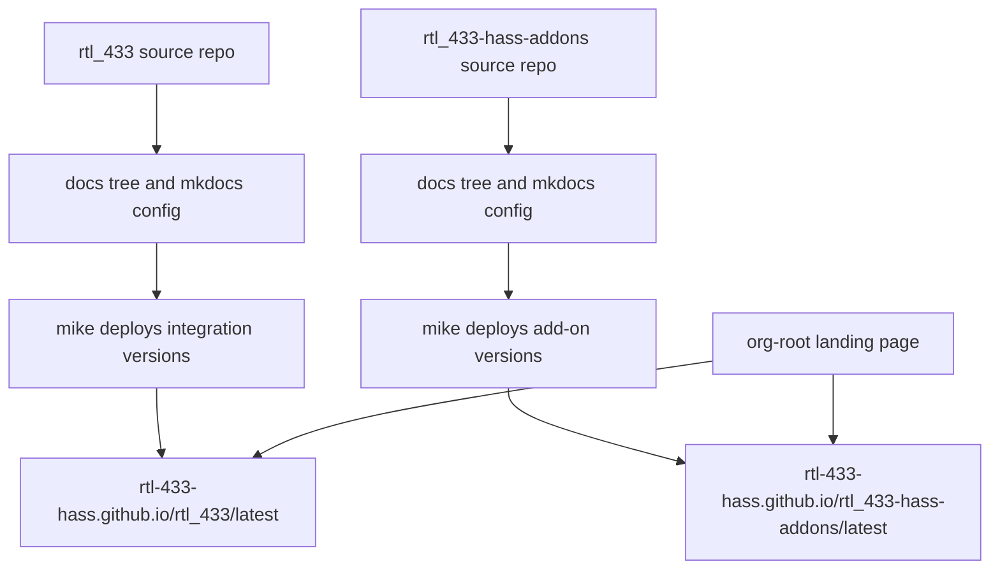

# Plan: Versioned Documentation Sites

## Original Work Order

> Create a plan based on @DOCS_SITE_PLAN.md

## Plan Clarifications

| Question | Answer |
| --- | --- |
| Should the documentation migration preserve backward compatibility for existing README/deep links, for example by adding redirects where feasible? | No, not required. |

## Executive Summary

This plan migrates long-form user documentation out of repository README files and into versioned static documentation sites hosted on GitHub Pages. Each source repository owns and publishes its own documentation site so that release versions map directly to that repository's own tags, while a thin organization-root landing page links users to the integration and add-on documentation.

The planned approach uses Material for MkDocs for Markdown-based static-site generation and `mike` for tag-derived version publishing. This preserves the existing Markdown authoring model while satisfying the hard requirement for release-versioned documentation with a stable `/latest/` URL and a version dropdown.

The expected outcome is a clearer user documentation experience, shorter README files that point to canonical full documentation, and independent version histories for the integration and add-on projects. Backward compatibility for old README anchors and external deep links is not required, so link hygiene focuses on correct new-site navigation rather than preserving every previous URL.

## Context

### Current State vs Target State

| Current State | Target State | Why? |
| --- | --- | --- |
| Long-form user documentation lives primarily in README files and scattered repository documents. | Long-form user documentation lives in structured `docs/` trees rendered as static sites. | A dedicated documentation site is easier to browse, version, and link from product surfaces. |
| Integration and add-on documentation are not published as independently versioned product sites. | Each source repository publishes its own GitHub Pages site with versions derived from its own release tags. | The integration and add-ons release independently and have colliding version numbers, so one combined version stream would be ambiguous. |
| Users rely on repository README content for both overview and detailed operational guidance. | README files are trimmed to short overviews with prominent links to canonical full documentation. | Repository front pages remain useful without carrying all long-form documentation. |
| The organization root does not provide a single simple entry point for users choosing between integration and add-on documentation. | A thin unversioned org-root landing page links to the integration and add-on docs at their `/latest/` URLs. | Users need a clear starting point and product-selection path. |
| Existing relative links and README anchors reflect the current document layout. | Links are rewritten for the new docs structure; old README anchor compatibility is not required. | The migration should produce correct new navigation without spending scope on historical URL preservation. |

### Background

The integration repository currently has release tags such as `v0.9.1` through the current integration version line, while the add-on repository has its own independent `v*` tags and colliding version numbers. A single combined documentation repository would not be able to produce version entries that unambiguously correspond to both products. Co-locating docs with each source repository keeps the version dropdown aligned with real product releases.

The selected generator is Material for MkDocs because it accepts plain Markdown and is widely used for Home Assistant custom integration documentation. The selected versioning mechanism is `mike`, which publishes static version directories and aliases such as `/latest/` to a repository's `gh-pages` branch. Read the Docs and Docusaurus were considered but do not meet the hosting and tag-derived versioning requirements in the same way.

The add-on repository has an additional product-surface constraint: Home Assistant Supervisor renders the add-on README files in-product. Those README files must remain present and useful, but should become lean entry points that link to the canonical long-form site.

## Architectural Approach

The architecture uses one documentation site per source repository, plus one unversioned organization landing page. Each product site is built from a local `docs/` tree, configured by a root `mkdocs.yml`, and deployed by GitHub Actions. Release tags publish immutable product-version directories and update the `/latest/` alias.

### Per-Repository Documentation Sites

**Objective**: Create independently versioned documentation sites for the integration and add-on repositories.

Each source repository will contain its own documentation source under `docs/` and its own root `mkdocs.yml`. The integration site will cover installation, configuration, discovery, availability, diagnostics, hub entities, device library, calibration, WebSocket API, multiple servers, and screenshots. The add-on site will cover installation, configuration, per-radio overrides, PPM, noise floor, random serial behavior, radio replacement, SoapySDR/HackRF, logging, and migration.

The source repositories remain the authority for their respective product documentation. This avoids a combined repository with ambiguous version labels and allows each product's documentation versions to follow its own release tags.

### Static Site Tooling and Configuration

**Objective**: Standardize each product site on a Markdown-first MkDocs toolchain with release-aware versioning.

Each product site will use Material for MkDocs for presentation and `mike` for version publishing. The MkDocs configuration will set the correct `site_name`, product-specific `site_url`, repository URL, Material theme options, version provider configuration, navigation, and required Markdown extensions.

The configuration should keep authoring close to the existing Markdown model. Tooling is limited to what is required for the documented site architecture and the versioned publishing workflow.

### Documentation Content Migration

**Objective**: Move long-form user-facing content into structured documentation pages while keeping README files concise.

The integration README will be reduced to a short overview, badges, and a prominent link to the full documentation site. Existing long-form sections will be split into the target documentation pages described in `DOCS_SITE_PLAN.md`. `WEBSOCKET_API.md` will become the WebSocket API documentation page, and the existing device-library reference will be incorporated into the integration documentation tree.

The add-on README files that Home Assistant Supervisor renders must remain in place. They should stay lean and link users to the canonical long-form add-on documentation site for details.

### GitHub Pages Deployment and Version Publication

**Objective**: Publish preview and release documentation through GitHub Pages with a stable latest URL.

Each source repository will have a documentation workflow that publishes unreleased documentation from `main` as a development version and publishes release documentation from `v*` tags as `MAJOR.MINOR` versions. The workflow will update the `latest` alias on release tags and set `latest` as the default version.

The deployment target is each repository's `gh-pages` branch, managed by `mike`. GitHub Pages must be configured to serve the branch root. The workflow needs repository write permissions and full tag history so it can publish the correct version metadata.

### Organization Landing Page

**Objective**: Provide a simple unversioned entry point at the organization GitHub Pages root.

The organization-root site will introduce the project, help users choose between the integration and add-on documentation, and link prominently to the `/latest/` URLs for both product sites. It does not need release versioning because it is a routing and orientation page rather than product-version documentation.

## Risk Considerations and Mitigation Strategies

Technical Risks

- **Version publishing mismatch**: The `mike` workflow could publish incorrect version labels if tag parsing does not match the repositories' `v*` release format.
    - **Mitigation**: Validate tag-derived `MAJOR.MINOR` output against existing release tags before enabling release publication.
- **GitHub Pages branch management errors**: `mike` force-manages the `gh-pages` branch, and manual edits could be lost.
    - **Mitigation**: Document that `gh-pages` is generated output and should not be hand-edited.
- **Cross-repository coordination**: The plan spans the integration repo, the add-on repo, and an org-root landing page repo.
    - **Mitigation**: Keep each source repository independently buildable and deployable, with the landing page only linking to published product URLs.

Implementation Risks

- **Content drift during migration**: Moving README sections into multiple pages could accidentally omit important user guidance.
    - **Mitigation**: Compare migrated page coverage against the original README and supporting docs before trimming the README.
- **Broken new-site links**: Reorganizing documentation can create incorrect relative links or image paths.
    - **Mitigation**: Run the static-site build in strict mode or equivalent validation and inspect generated navigation and image references.
- **Add-on store README regression**: Over-trimming add-on README files could harm the in-product Supervisor experience.
    - **Mitigation**: Preserve lean but useful add-on README content with clear outbound links to the canonical site.

Scope Risks

- **Unrequested backward compatibility work**: Adding redirect maps for old README anchors could expand the migration beyond the confirmed scope.
    - **Mitigation**: Do not require old README anchor compatibility; focus on correct links within the new documentation structure.
- **Unnecessary tooling expansion**: Adding alternate generators, custom documentation frameworks, or additional deployment services would complicate the project.
    - **Mitigation**: Keep the implementation centered on Material for MkDocs, `mike`, GitHub Actions, and GitHub Pages as specified.

## Success Criteria

### Primary Success Criteria

1. The integration repository has a structured `docs/` site with the content areas listed in `DOCS_SITE_PLAN.md` and a concise README linking to the full documentation.
2. The add-on repository has a structured `docs/` site, while preserving lean add-on README files for Home Assistant Supervisor with links to the full documentation.
3. Each product repository publishes versioned documentation to GitHub Pages from its own release tags, with a working version dropdown and stable `/latest/` URL.
4. The organization-root landing page links clearly to the integration and add-on `/latest/` documentation sites.
5. The generated documentation sites build successfully and all new-site navigation, internal links, and image references resolve correctly.

## Self Validation

After implementation is complete, validate the real output as follows:

1. Build each product documentation site locally using its configured docs tooling and confirm the build exits successfully without unresolved navigation, Markdown, or link errors.
2. Serve each generated site locally and open the integration and add-on home pages in a browser to confirm the page layout, navigation sections, version selector, and content pages render correctly.
3. Inspect the generated integration site and confirm pages exist for installation, configuration, discovery, availability, diagnostics, hub entities, device library, calibration, WebSocket API, multiple servers, and screenshots.
4. Inspect the generated add-on site and confirm pages exist for installation, configuration, and advanced topics covering the add-on-specific areas from the source plan.
5. Trigger or locally simulate the tag-derived documentation workflow logic and confirm a `vX.Y.Z` tag maps to an `X.Y` documentation version and updates the `latest` alias as expected.
6. Open the deployed or locally generated organization landing page and verify that its integration and add-on links point to the expected `/latest/` URLs.
7. Check the integration README and add-on README files to confirm they remain concise entry points and link to the canonical documentation sites.

## Documentation

This plan is itself a documentation migration. Required documentation updates include the product documentation pages, trimmed repository README files, the add-on README files rendered by Home Assistant Supervisor, and any contributor-facing note needed to explain that `gh-pages` is generated output managed by `mike`. Updating `AGENTS.md` is not required unless implementation changes repository maintenance conventions beyond the generated `gh-pages` warning.

## Resource Requirements

### Development Skills

Successful implementation requires experience with MkDocs configuration, Material for MkDocs theming, `mike` versioning, GitHub Actions, GitHub Pages, Markdown documentation migration, and link/image validation in static sites.

### Technical Infrastructure

The work requires the integration repository, the add-on repository, and the organization-root GitHub Pages repository. It also requires Python documentation tooling for Material for MkDocs and `mike`, GitHub Actions permissions to write `gh-pages`, full git tag history in documentation workflows, and GitHub Pages configured to serve each generated site.

### External Dependencies

The deployment depends on GitHub Pages, GitHub Actions, the existing `v*` release tags produced by release-please, Material for MkDocs, and `mike`.

## Integration Strategy

The documentation migration integrates with the existing release process by consuming the `v*` tags already produced by release-please. It should not require a release-process change. Each product repository owns its own documentation workflow and generated `gh-pages` branch, while the organization-root landing page remains unversioned and only links to the product documentation sites.

## Notes

Old README anchor and external deep-link compatibility is explicitly out of scope. The implementation should still rewrite links inside the new documentation corpus so that the generated sites are internally coherent.
