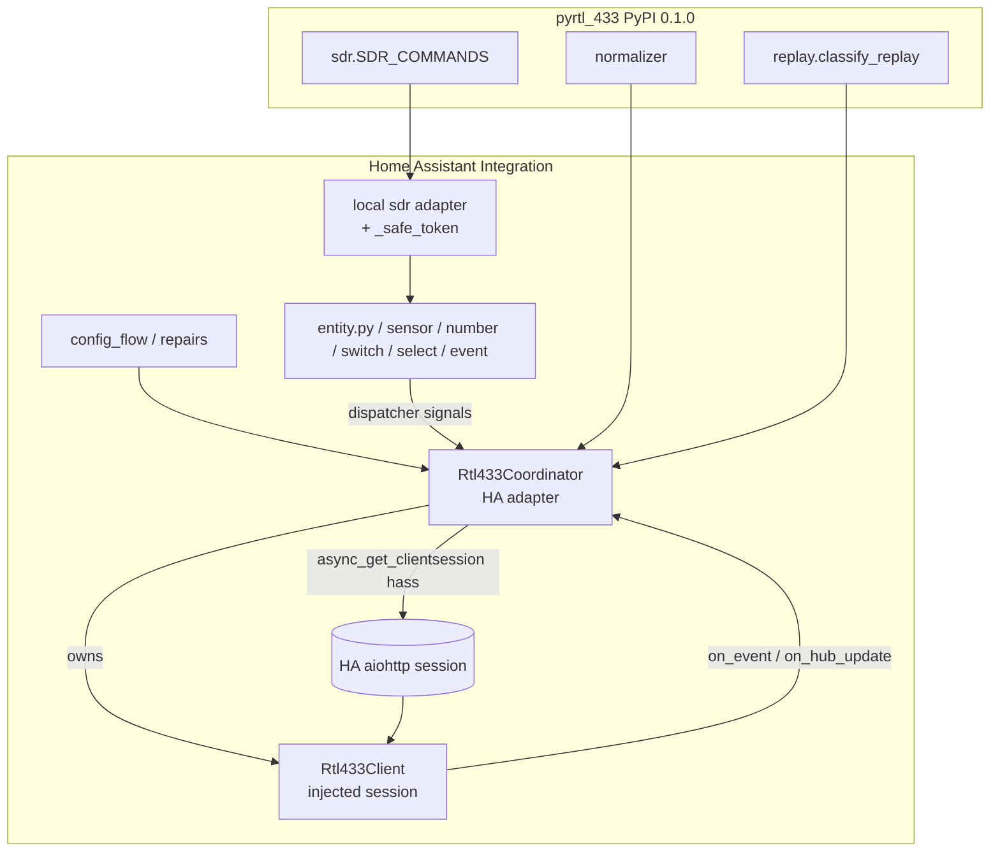
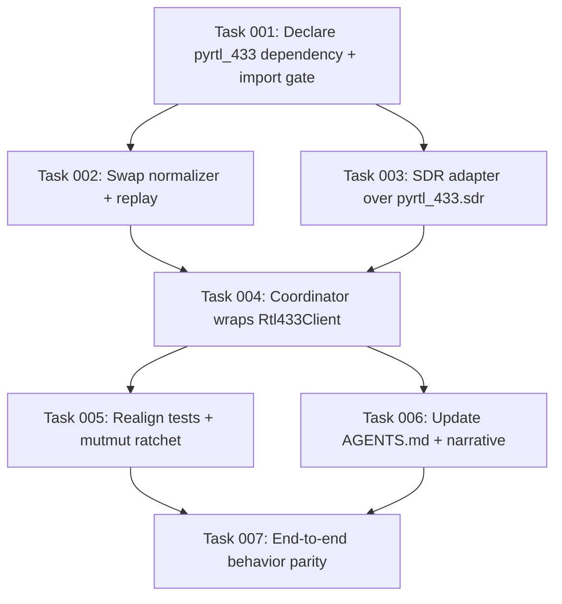

# Plan: Consume pyrtl_433 as the Integration's Transport & Helper Dependency

## Original Work Order
> I have split out the underlying API code for rtl_433 into a new pyrtl_433 project. It's hosted in the same github org and published to pypi. Update the integration to use that as a dependency.

## Plan Clarifications

| Question | Answer |
|----------|--------|
| Is `pyrtl_433` actually published to PyPI, and at what version? | Yes — `pyrtl_433` **0.1.0** is on PyPI (released 2026-07-04, `requires-python >=3.14`). The sibling repo README was stale. |
| How deep should the migration go? | **Full swap.** Re-architect `Rtl433Coordinator` to wrap `pyrtl_433.Rtl433Client`, replace the pure helper modules (`normalizer`, replay classifier, SDR transforms) with `pyrtl_433` imports/adapters, and delete all duplicated code. Retire the mutmut ratchet on the extracted transport. |
| Is backwards compatibility required? | **Only user-facing behavior.** HA entities, config entries, restored state, and stored SDR settings must behave identically to end users. Internal module import paths and test-facing internals may be freely deleted, renamed, or rewritten. |

## Executive Summary

Plan 24 extracted the rtl_433 integration's framework-agnostic protocol layer into a
standalone, Home-Assistant-free library, `pyrtl_433`, now published to PyPI at version
0.1.0. That extraction was a *parallel copy*: the integration was left byte-for-byte
unchanged and still carries its own duplicate of the WebSocket/HTTP transport, the event
normalizer, the replay classifier, and the SDR `/cmd` transforms. This plan closes that
loop by making the integration **consume** `pyrtl_433` as a declared dependency and
deleting the now-redundant local copies.

The migration is a *full swap*. The pure helper modules (`normalizer.py`, the
`classify_replay`/`ReplayVerdict` logic in `coordinator/_events.py`, and the transform
registry in `sdr_settings.py`) are replaced by imports from `pyrtl_433.normalizer`,
`pyrtl_433.replay`, and `pyrtl_433.sdr`, bridged by thin local adapters where the library's
public API differs from what the integration consumes (notably the `SdrSetting`→`SdrCommand`
rename and the un-exported `_safe_token`). The transport — today embedded directly in the
817-line `Rtl433Coordinator` and its three mixins, reading the aiohttp session from `hass`
and fanning events out over the HA dispatcher — is re-architected so the coordinator *owns*
a `pyrtl_433.Rtl433Client`, injects Home Assistant's shared `aiohttp.ClientSession`, and
wires the client's `on_event`/`on_hub_update` callbacks into the existing dispatcher-based
entity update path.

This approach was chosen because it is the extraction's stated purpose: a single source of
truth for the protocol layer, tested once in `pyrtl_433`, consumed everywhere else. The key
benefits are the elimination of ~1,700 lines of duplicated, drift-prone transport/helper
code from the integration, and a clean seam that lets protocol fixes ship from one place.
The principal cost — accepted deliberately — is that the mutmut mutation-testing ratchet on
the extracted transport is retired here (that logic now lives in and is verified by
`pyrtl_433`'s own suite), and the substantial integration test surface that reaches into the
old transport internals must be rewritten against the new adapter seam.

## Context

### Current State vs Target State

| Current State | Target State | Why? |
|---------------|--------------|------|
| `manifest.json` `requirements: []`; `requirements.txt` empty with a "NO third-party runtime dependency" comment | `manifest.json` pins `pyrtl_433==0.1.0`; requirements/narrative updated | The integration must declare and install the new dependency the way HACS/HA expect |
| Transport (WS connect loop, `/cmd` GET/SET, URL builders, connection probe) embedded in `Rtl433Coordinator`/`base.py` + mixins, session pulled from `hass` at 4 `async_get_clientsession` sites | Coordinator owns a `pyrtl_433.Rtl433Client` constructed with the injected HA session; transport code deleted from `base.py` | Single source of truth; the library is the transport, the coordinator is its HA adapter |
| Events fanned out by the coordinator's internal `_read_frames`→`_process_event`→`_dispatch` chain | Client `on_event`/`on_hub_update` callbacks feed the existing `_dispatch`/`_emit_hub_update` path | Preserve identical entity-update behavior while sourcing events from the library |
| `normalizer.py` (`normalize`, `device_key`, `NormalizedEvent`, `DEFAULT_SKIP_KEYS`, `_safe_token`) local copy | Imported from `pyrtl_433.normalizer`; `_safe_token` re-homed locally (not exported by the library) | Remove duplication; entity slug logic (`_safe_token`) must remain available to `entity.py` |
| Replay classifier (`classify_replay`, `ReplayVerdict`, `_parse_event_time`) local in `coordinator/_events.py` | Imported from `pyrtl_433.replay` (`classify_replay`, `ReplayVerdict`, `parse_event_time`) | Remove duplication; classifier is a pure, drop-in match |
| SDR transforms as `SdrSetting`/`SDR_SETTINGS`/`SDR_SETTINGS_BY_KEY` in `sdr_settings.py` | Sourced from `pyrtl_433.sdr` (`SdrCommand`/`SDR_COMMANDS`/`SDR_COMMANDS_BY_KEY`) via a local adapter reconciling the rename and field-shape differences | Remove duplication while keeping `_sdr.py`/`entity.py`/`select.py`/`repairs.py` consumers working unchanged in behavior |
| `mutmut` `source_paths` and shard tests target the local transport + extracted helpers | Ratchet scoped to code that still lives in the integration; extracted-code shards retired | The extracted logic is no longer in-repo to mutate; its coverage moves to `pyrtl_433` |
| Tests construct `Rtl433Coordinator` and reach into `.base` internals (`_SdrStore`, `_send_cmd`, `_fetch_cmd`, `_build_ws_url`, `_unwrap_result`, `CannotConnect`) across ~dozens of files | Tests exercise the coordinator via the new client-adapter seam; transport-internal assertions removed or moved | Internals changed; user-facing behavior is what must stay green |
| `AGENTS.md` describes a self-contained, dependency-free integration | `AGENTS.md` documents the `pyrtl_433` dependency and the adapter architecture | AI-facing docs must match reality |

### Background

- **Provenance is documented.** Every `pyrtl_433` module carries a docstring naming the
  integration source file it was extracted from (`client.py`←`coordinator/base.py`,
  `normalizer.py`←`normalizer.py`, `replay.py`←`coordinator/_events.py`,
  `sdr.py`←`sdr_settings.py`, `_urls.py`←`coordinator/base.py`). These pointers define the
  exact delete/replace correspondence.
- **API seams that require adapters, not straight imports:**
  - The `/cmd` setter primitive in the library is the underscore `Rtl433Client._send_cmd`
    (no public alias). The coordinator will call it directly; document the wart.
  - `pyrtl_433.sdr` renamed the integration's `SdrSetting`→`SdrCommand`,
    `SDR_SETTINGS`→`SDR_COMMANDS`, `SDR_SETTINGS_BY_KEY`→`SDR_COMMANDS_BY_KEY`, and added
    fields (`key`, `command`, `arg_kind`, `capability`, `available`). Consumers in
    `coordinator/_sdr.py`, `entity.py`, `select.py`, and `repairs.py` must be reconciled.
  - `pyrtl_433.normalizer` does **not** export `_safe_token`, which `entity.py` imports for
    entity-id slugging. It must be re-homed locally.
  - `sdr.py` and `replay.parse_event_time` are **not** re-exported from the library's
    top-level `__init__`; consume them from their submodules.
- **Event delivery model differs.** The library exposes events via an `on_event` callback
  and an `async for` iterator; the coordinator uses HA-dispatcher push. The adapter wires
  the callback into the existing dispatch path — the iterator is not used.
- **Python floor is aligned.** Both projects require `>=3.14`; tests already run under 3.14
  via `uv`. No floor change is needed.
- **Stale artifacts to ignore/remove:** `coordinator/__pycache__/_http.cpython-314.pyc` has
  no matching source; confirm nothing imports `coordinator._http`.
- **The false-positive to not chase:** `except A, B:` in the library's `replay.py`/`sdr.py`
  is valid PEP 758 syntax on Python 3.14 — it is *not* a bug and does not block import under
  the required interpreter.

## Architectural Approach

The integration keeps its Home Assistant surface (entities, config flow, coordinator as a
`DataUpdateCoordinator`, dispatcher signals) exactly as-is. What changes is the *inside* of
the coordinator and the helper modules: the protocol layer is delegated to `pyrtl_433`.

### Dependency Declaration & Environment
**Objective**: Make `pyrtl_433==0.1.0` a first-class, installed dependency so the
integration resolves it at runtime and in CI, and so the test environment can import it.

Pin `pyrtl_433==0.1.0` in `manifest.json` `requirements` (HA's canonical mechanism; HA
installs manifest requirements into its environment). Update `requirements.txt` and its
"NO third-party runtime dependency" narrative comment to reflect the new dependency, and add
`pyrtl_433==0.1.0` to the test requirements so the pytest environment (Python 3.14 via `uv`)
can import it. Confirm the library imports cleanly under 3.14 before any code is rewritten —
this is the gate for the rest of the plan.

### Helper-Module Replacement (normalizer, replay, SDR)
**Objective**: Delete the duplicated pure logic and source it from `pyrtl_433`, keeping every
consumer's behavior identical.

- **Normalizer**: Replace local `normalize`/`device_key`/`NormalizedEvent`/`DEFAULT_SKIP_KEYS`
  usages with imports from `pyrtl_433.normalizer`. Re-home `_safe_token` (used by `entity.py`)
  into a small local module since the library does not export it. Verify `NormalizedEvent`
  field parity (`is_replay`, `event_time`, `is_repaint`) so dataclass consumers are unaffected.
- **Replay classifier**: Replace `classify_replay`/`ReplayVerdict`/`_parse_event_time` in
  `coordinator/_events.py` with `pyrtl_433.replay` equivalents (`parse_event_time` is now a
  module-level function, not a staticmethod). The `_EventProcessingMixin` behavior around
  them is retained.
- **SDR transforms**: Introduce a local adapter that maps the library's
  `SdrCommand`/`SDR_COMMANDS`/`SDR_COMMANDS_BY_KEY` (and `gain_command_arg`, `KEY_*`,
  conversion helpers) onto exactly what `coordinator/_sdr.py`, `entity.py`, `select.py`, and
  `repairs.py` consume today. Reconcile the field-shape differences so entity generation and
  restored SDR settings are byte-identical in behavior.

### Transport Re-architecture (coordinator wraps Rtl433Client)
**Objective**: Delete the embedded WebSocket/HTTP transport and have the coordinator drive a
`pyrtl_433.Rtl433Client`, preserving all HA-facing behavior (availability, reconnect,
refresh cadence, dispatcher fan-out, SDR settings management, connection validation).

The coordinator constructs `Rtl433Client(host, port=..., path=..., secure=...,
session=async_get_clientsession(hass), on_event=..., on_hub_update=..., skip_keys=...,
clock=...)`. The client's `start()`/`stop()` replace the internal `_connect_loop`/
`_read_frames`; its `on_event` callback feeds the existing `_process_event`→`_dispatch`
chain; `on_hub_update` drives `_emit_hub_update`. The client's `refresh_meta`/`refresh_stats`/
`refresh_dev_info` replace `_refresh_*`, and `_send_cmd`/reads back the SDR `/cmd` path.
`validate_connection` is delegated to `Rtl433Client.validate_connection(session, ...)`.
`CannotConnect` is sourced from the library. Availability/watchdog logic that is HA-specific
stays in the integration and observes the client's connection state/callbacks. Delete
`_build_ws_url`/`_build_cmd_url`/`_unwrap_result` and the embedded frame reader; remove the
stale `_http` pyc.

### Test Suite & Mutation-Ratchet Realignment
**Objective**: Keep user-facing behavior verified while removing tests that only asserted the
now-deleted transport internals, and rescope the mutmut ratchet to code that still lives in
the integration.

Rewrite/retire tests that import deleted internals (`.base._SdrStore`, `_send_cmd`,
`_fetch_cmd`, `_build_ws_url`, `_unwrap_result`) or construct the coordinator to poke the old
transport. Behavioral coverage (config flow, repairs, diagnostics, entity generation,
availability, SDR controls, replay/normalization *as observed through the coordinator*) must
stay green. Update `mutmut` `source_paths` to drop the extracted transport/helper files and
retire the extracted-code shard tests (`test_mut_coordinator_base*`, `test_mut_sdr_settings_floor`,
etc.) that target logic now owned by `pyrtl_433`. Where a helper adapter contains new local
logic (SDR name/shape reconciliation, `_safe_token`), ensure it is covered.

### Documentation
**Objective**: Make the human- and AI-facing docs describe the new dependency and architecture.

Update the repo-root `AGENTS.md` (currently describes a dependency-free integration) to
document the `pyrtl_433==0.1.0` dependency, the coordinator-as-adapter architecture, the
`_send_cmd` private-API wart, and the SDR adapter seam. Update any README/HACS narrative that
claims zero third-party runtime dependencies.

## Risk Considerations and Mitigation Strategies

Technical Risks

- **Transport behavior drift (reconnect, heartbeat, availability timing)**: The library's
  `start()`/`stop()`/refresh cadence may differ subtly from the integration's hand-rolled
  `_connect_loop` (e.g. `heartbeat=30`, watchdog interval).
    - **Mitigation**: Diff the library's connect/refresh behavior against the current
      coordinator before wiring; keep HA-specific availability/watchdog logic in the
      integration and drive it from client callbacks/state; validate end-to-end against a
      live or replayed rtl_433 stream.
- **SDR adapter mismatch (`SdrSetting`→`SdrCommand`)**: Field-shape/name differences could
  silently change which entities are generated or how `/cmd` args are composed.
    - **Mitigation**: Build an explicit adapter with parity assertions; cover with tests that
      compare generated entities/commands before vs after.
- **`_safe_token` divergence**: Re-homing the slug helper risks entity-id changes if the copy
  differs from the library's internal version.
    - **Mitigation**: Move the existing integration implementation verbatim; assert entity-id
      stability for representative devices.

Implementation Risks

- **Large test rewrite surface**: Dozens of test files (heaviest: the `test_mut_*` shards)
  import deleted internals; churn risk is high.
    - **Mitigation**: Categorize tests as behavioral (keep/adapt) vs transport-internal
      (retire); rescope mutmut deliberately rather than forcing dead assertions to pass.
- **Dependency not installable in the pytest env**: If the 3.14 `uv` env can't resolve
  `pyrtl_433==0.1.0`, everything downstream is blocked.
    - **Mitigation**: Make dependency install + clean import the first, gating step; stop and
      surface if it fails.

Integration Risks

- **HACS/HA runtime install**: `manifest.json` requirements must be exactly right or HA fails
  to load the integration for users.
    - **Mitigation**: Pin the exact published version; validate the manifest and a cold start.

## Success Criteria

### Primary Success Criteria
1. `manifest.json` declares `pyrtl_433==0.1.0`; the integration imports and loads with no
   local copy of the transport, normalizer, replay classifier, or SDR transform registry
   remaining in `custom_components/rtl_433/`.
2. The coordinator drives a `pyrtl_433.Rtl433Client` (injected HA aiohttp session, callbacks
   wired to the dispatcher); all deleted transport helpers (`_build_ws_url`, `_build_cmd_url`,
   `_unwrap_result`, embedded frame reader/connect loop) are gone.
3. The full pytest suite passes under Python 3.14, with transport-internal tests retired and
   behavioral coverage intact; the mutmut ratchet is rescoped to remaining in-repo code and
   still passes.
4. End-user behavior is unchanged: entities generated, entity ids, availability transitions,
   SDR settings restore, config flow, repairs, and diagnostics all behave identically to the
   pre-migration integration.
5. `AGENTS.md` and any zero-dependency narrative are updated to reflect the `pyrtl_433`
   dependency and adapter architecture.

## Self Validation

After all tasks complete, an executing agent should:

1. In the 3.14 `uv` test environment, run `python -c "import pyrtl_433; from pyrtl_433 import Rtl433Client, normalize, classify_replay; from pyrtl_433.sdr import SDR_COMMANDS; print('ok')"` and confirm it prints `ok` (dependency resolvable and importable).
2. Run `rg -n "class CannotConnect|_build_ws_url|_build_cmd_url|_unwrap_result|def classify_replay|def normalize\b" custom_components/rtl_433/` and confirm the duplicated definitions are gone (only imports/adapters remain), and `rg -n "coordinator\._http" custom_components/ tests/` returns nothing.
3. Run the full test suite via the project's `uv`-based Python 3.14 invocation and confirm it passes; capture the summary line (passed count, 0 failed).
4. Run the mutmut ratchet check the project uses and confirm it passes with the rescoped `source_paths` (extracted transport/helper shards no longer referenced).
5. Load the integration end-to-end: start Home Assistant (or the project's test harness that instantiates the config entry) against a live or replayed rtl_433 WebSocket, and confirm devices are discovered, an event updates a sensor entity, an SDR setting (e.g. sample rate) round-trips via the `/cmd` path, and the entity becomes `unavailable` then recovers on disconnect/reconnect — matching pre-migration behavior. Capture evidence (log lines or entity-state snapshots).
6. Diff generated entity ids for a representative fixture device set before vs after to confirm `_safe_token`/normalizer parity.

## Documentation

- `AGENTS.md` (repo root): add the `pyrtl_433==0.1.0` dependency, the coordinator-as-adapter
  architecture, the `_send_cmd` private-API note, and the SDR adapter seam.
- `requirements.txt` narrative comment and any README/HACS text asserting "no third-party
  runtime dependency" must be corrected.

## Resource Requirements

### Development Skills
- Home Assistant custom-integration internals (coordinators, `DataUpdateCoordinator`,
  dispatcher signals, config entries, `async_get_clientsession`).
- Async Python (aiohttp, asyncio callbacks/tasks), Python 3.14.
- pytest with `pytest-homeassistant-custom-component`; `mutmut` mutation testing.

### Technical Infrastructure
- `pyrtl_433==0.1.0` from PyPI.
- `uv`-managed Python 3.14 environment (system Python is 3.13; test stack needs 3.14).
- The sibling `pyrtl_433` checkout at `/home/andrew.guest/github.com/rtl-433-hass/pyrtl_433`
  for API reference and provenance cross-checks.

## Integration Strategy

The change is internal to the integration package; the HA-facing contract (entities, config
flow, dispatcher signals, stored data) is held constant. `pyrtl_433` is consumed as a normal
PyPI dependency declared in `manifest.json`, the mechanism HA/HACS already use to install
integration requirements.

## Notes

- The `/cmd` setter is only `Rtl433Client._send_cmd` (underscore, no public alias) in
  0.1.0 — the coordinator calls it directly; a public alias upstream would be a nice future
  cleanup but is out of scope here.
- Retiring the transport mutmut shards is an accepted, deliberate consequence of moving the
  transport's source of truth to `pyrtl_433` (where it carries its own ratchet).
- Related memory: `[[pyrtl-433-standalone-library]]` (the extraction), `[[run-tests-python314-uv]]`
  (test env), `[[python314-except-pep758]]` (do not chase the `except A, B:` false positive).

## Execution Blueprint

**Validation Gates:**
- Reference: `.ai/strikethroo/config/hooks/POST_PHASE.md`

### Dependency Diagram

No circular dependencies: the graph is a DAG (1 → {2,3} → 4 → {5,6} → 7).

### ✅ Phase 1: Establish the Dependency
**Parallel Tasks:**
- ✔️ Task 001: Declare `pyrtl_433==0.1.0` and verify clean import under Python 3.14 (gate) — completed

### Phase 2: Replace Pure Helper Modules
**Parallel Tasks:**
- Task 002: Swap normalizer + replay classifier to `pyrtl_433`; re-home `_safe_token` (depends on: 001)
- Task 003: Replace SDR transforms with `pyrtl_433.sdr` via a local adapter (depends on: 001)

### Phase 3: Re-architect the Transport
**Parallel Tasks:**
- Task 004: Re-architect `Rtl433Coordinator` to wrap `pyrtl_433.Rtl433Client` (depends on: 002, 003)

### Phase 4: Realign Verification & Docs
**Parallel Tasks:**
- Task 005: Realign the pytest suite and rescope the mutmut ratchet (depends on: 004)
- Task 006: Update `AGENTS.md` and the dependency narrative (depends on: 004)

### Phase 5: Prove Parity
**Parallel Tasks:**
- Task 007: Verify end-to-end behavior parity against a live/replayed stream (depends on: 005, 006)

### Post-phase Actions
After each phase, run `.ai/strikethroo/config/hooks/POST_PHASE.md` validation before advancing.
Phase 3 is the highest-risk gate (transport swap); Phase 5 is the behavior-parity gate that
guards the plan's primary success criterion.

### Execution Summary
- Total Phases: 5
- Total Tasks: 7
