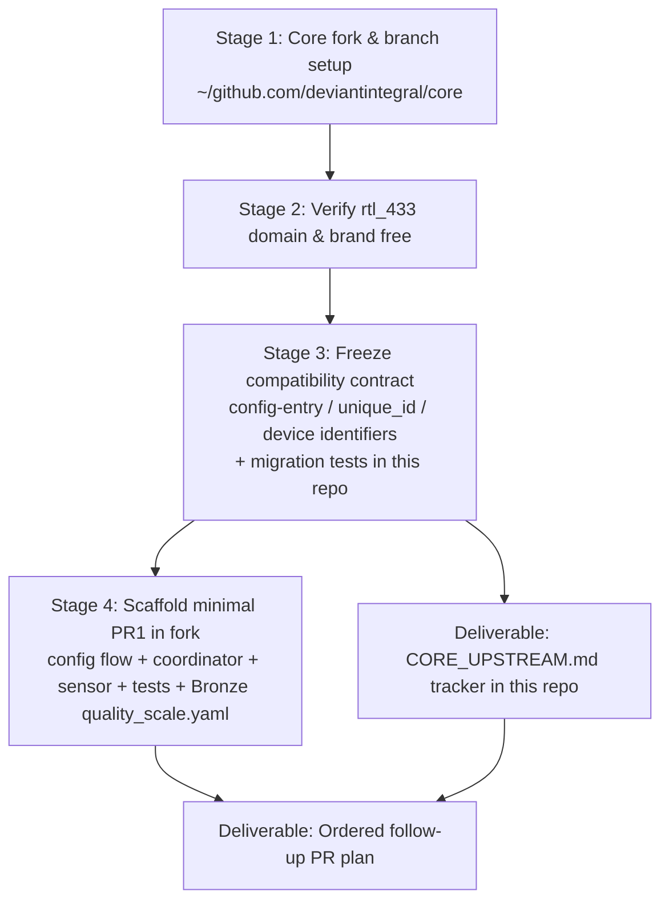
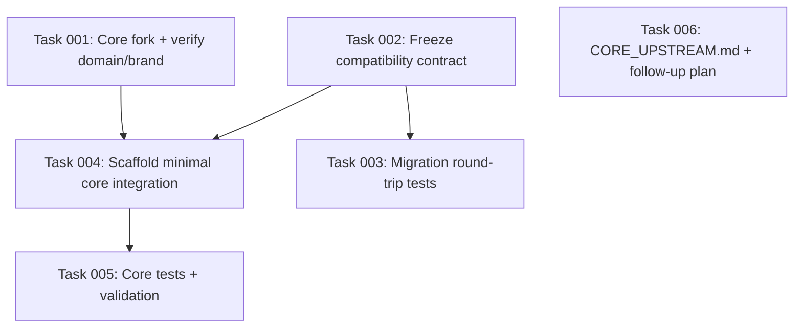

# Plan: Upstream the rtl_433 Integration into Home Assistant Core

## Original Work Order

> Upstream the rtl_433 Home Assistant integration into Home Assistant core as a minimal, iteratively-expanded integration, while keeping the existing HACS custom component (this repo, ~/github.com/rtl-433-hass/rtl_433) as the feature-ahead parallel channel.
>
> CONTEXT / CONSTRAINTS
> - The integration domain is `rtl_433` and MUST stay a single shared domain across both HACS and core. Do NOT invent a second domain. Home Assistant loads custom_components/rtl_433/ in preference to homeassistant/components/rtl_433/ (logging the "custom integration" warning), and that override IS the parallel-delivery mechanism — no hard namespace collision.
> - The integration is a thin async wrapper over the pyrtl_433 PyPI library. pyrtl_433 is already fully async (aiohttp websockets; client.py has 12 async def methods and an async iterator; sdr.py/replay.py/normalizer.py are pure sync helpers with no I/O). This matches core's "thin integration + external async library" expectation, so no executor wrappers are needed.
> - Current requirement pin: pyrtl_433==0.1.1. Pin aiohttp minimum to whatever core ships (core manages aiohttp centrally and rejects conflicting versions).
>
> PHASE 0 — FORK & ENVIRONMENT SETUP (on this machine)
> - Check out a fork of home-assistant/core following the existing directory pattern ~/github.com/<owner>/<repo>. Target path: ~/github.com/deviantintegral/core. Owner "deviantintegral" matches the current codeowner (@deviantintegral) and an existing ~/github.com/deviantintegral/ org directory.
> - Use the gh CLI to fork home-assistant/core to deviantintegral if not already forked, clone it to ~/github.com/deviantintegral/core, set `upstream` remote to https://github.com/home-assistant/core.git, and create a long-lived branch `rtl_433-integration` off `dev`.
> - Confirm there is NO existing `rtl_433` domain in home-assistant/core (dev branch) and NO existing brand registration in home-assistant/brands, so the domain is free. Report if either is taken.
>
> COMPATIBILITY CONTRACT — FREEZE BEFORE PR1 (this is the real risk, not the domain)
> Because both codebases share the domain, config entries and entities must round-trip between the HACS full version and the minimal core version in either direction. Freeze and document, as an ABI, in this repo:
> - ConfigEntry version/minor_version scheme + monotonic migrations (core's minimal version must not choke on options the full version writes; migrations must not downgrade).
> - Entity unique_id format (identical between both — else duplicate/orphaned entities on switch).
> - Device identifier tuples (DOMAIN, ...) (identical — else duplicate devices).
> Add migration tests that load an "old"/full-schema entry against the minimal code.
>
> PR1 — MINIMAL CORE INTEGRATION (Bronze quality scale)
> Scope strictly to: manifest.json, __init__.py, config_flow.py, const.py, one DataUpdateCoordinator, sensor platform ONLY, plus tests under tests/components/rtl_433/ and a quality_scale.yaml targeting Bronze. Mirror the current flat file layout from custom_components/rtl_433/ into homeassistant/components/rtl_433/ using RELATIVE imports (from .const import DOMAIN, etc.) so files copy across verbatim. Strip everything else. Use syrupy snapshots per core conventions.
>
> FOLLOW-UP PR SEQUENCE (each PR adds one platform AND raises the quality scale one tier)
> Plan (do not implement in this run) the ordered upstreaming of the remaining modules currently in custom_components/rtl_433/: binary_sensor, event, device_trigger, number, select, switch, repairs, calibration, device_library, mapping, diagnostics, options_flow, hub_settings, sdr_settings. Order by quality-scale tier requirements, not feature preference.
>
> DELTA DISCIPLINE
> Create CORE_UPSTREAM.md in this repo (~/github.com/rtl-433-hass/rtl_433) tracking, per module: upstreamed vs HACS-only, and the commit/PR where each landed. This is what prevents the long-lived branch from silently drifting over the months-long core review.
>
> DELIVERABLES OF THIS WORKFLOW RUN
> 1. The core fork checked out at ~/github.com/deviantintegral/core on branch rtl_433-integration with upstream remote set.
> 2. Confirmation the rtl_433 domain/brand is free (or report the conflict).
> 3. The frozen compatibility-contract document + migration tests in this repo.
> 4. The minimal PR1 file set scaffolded in the core fork at homeassistant/components/rtl_433/ with tests and Bronze quality_scale.yaml.
> 5. CORE_UPSTREAM.md tracker seeded in this repo.
> 6. The ordered follow-up PR plan for the remaining modules.

## Plan Clarifications

| Question | Answer |
| --- | --- |
| Repo strategy for the minimal core version? | Long-lived branch (`rtl_433-integration`) in a fork of `home-assistant/core`, continuously rebased onto `dev`; features cherry-picked upstream one PR at a time. (Answered earlier in session.) |
| Is backwards compatibility required? | Yes — explicitly. Config entries and entities created by the HACS full version must round-trip to/from the minimal core version. This is the central constraint of the work order, not an add-on. |
| Fork owner / path? | `deviantintegral/core` cloned to `~/github.com/deviantintegral/core`, matching the existing `~/github.com/<owner>/<repo>` layout and the `@deviantintegral` codeowner identity. |

## Executive Summary

This plan establishes the foundation for contributing the `rtl_433` integration to Home Assistant core under core's mandated "start minimal, iterate" model, while the mature HACS custom component in this repository continues to serve users as the feature-ahead channel. Home Assistant deliberately loads a `custom_components/rtl_433/` package in preference to a same-named `homeassistant/components/rtl_433/` core package (emitting only a "custom integration" warning), so the two can coexist under one shared domain with no hard namespace collision — the override behaviour *is* the parallel-delivery mechanism. The approach was chosen because a second domain would fracture the user base, duplicate brand registration, and make config entries and entities unable to migrate between the two builds.

The genuine risk is not the domain but schema divergence: because both builds share the `rtl_433` domain, config entries and entities must round-trip cleanly in either direction between the full HACS version and the minimal core version. The plan therefore freezes a compatibility contract (config-entry version/migration scheme, entity `unique_id` format, and device identifier tuples) as an ABI before any core code ships, backed by migration tests that load a full-schema entry against the minimal code. Only then is the minimal PR1 file set scaffolded in the core fork.

The expected outcome of this workflow run is a correctly wired core fork on a long-lived `rtl_433-integration` branch, a verified-free `rtl_433` domain and brand, a frozen and test-backed compatibility contract in this repo, a Bronze-tier minimal integration (config flow + one coordinator + sensor platform + tests + `quality_scale.yaml`) scaffolded in the fork, a `CORE_UPSTREAM.md` delta tracker seeded in this repo, and a documented ordered follow-up PR sequence for the remaining modules. The follow-up modules themselves are planned but not implemented in this run.

## Context

### Current State vs Target State

| Current State | Target State | Why? |
| --- | --- | --- |
| Integration exists only as a HACS custom component under `custom_components/rtl_433/`. | Same integration additionally exists as a minimal core integration under `homeassistant/components/rtl_433/` in a `home-assistant/core` fork. | Core distribution reaches all users without HACS and confers official maintenance status. |
| No `home-assistant/core` fork checked out on this machine. | Fork cloned to `~/github.com/deviantintegral/core`, `upstream` remote set, long-lived `rtl_433-integration` branch off `dev`. | A stable working tree is required to scaffold and iterate the core PRs over a months-long review. |
| Domain/brand availability for `rtl_433` in core is unverified. | Confirmed free in `home-assistant/core@dev` and `home-assistant/brands` (or conflict reported). | A taken domain would invalidate the single-shared-domain strategy and force a rethink. |
| Config-entry version, `unique_id` format, and device identifier tuples are defined only implicitly by the current HACS code. | The same three are frozen and documented as an explicit ABI, with migration tests loading a full-schema entry against minimal code. | Shared-domain coexistence requires entries and entities to round-trip in both directions without duplication or corruption. |
| The full integration ships ~20 modules (event, device_trigger, calibration, repairs, options_flow, device_library, several platforms, etc.). | A minimal Bronze-tier subset (config flow + one coordinator + sensor only) is scaffolded in the fork; remaining modules are sequenced for later PRs. | Core reviewers reject large first PRs; the quality scale is climbed incrementally, one platform per PR. |
| No mechanism tracks which modules have been upstreamed. | `CORE_UPSTREAM.md` in this repo records per-module upstreamed/HACS-only status and the landing commit/PR. | Prevents silent drift between the long-lived branch and the HACS source of truth over a long review. |

### Background

The integration was recently refactored to consume the standalone `pyrtl_433` PyPI library as its transport and helper layer (plan 25, PR #114). `pyrtl_433` is already fully asynchronous: all network I/O flows through `aiohttp` websockets in `client.py` (twelve `async def` methods plus an async iterator), while `sdr.py`, `replay.py`, and `normalizer.py` are pure synchronous helper functions with no I/O. This matches Home Assistant core's strongly preferred "thin integration over an external async library" shape, so the core integration needs no `async_add_executor_job` wrappers and will not trip core's blocking-call checks.

Home Assistant core mandates that a new integration's first PR be minimal and grow through follow-up PRs, each raising the integration's quality scale. The current HACS codebase already uses relative intra-package imports (`from .const import DOMAIN`), which means individual module files can be copied between `custom_components/rtl_433/` and `homeassistant/components/rtl_433/` nearly verbatim; only test files and any absolute references need rewriting. Core also manages the `aiohttp` version centrally and rejects requirements that pin a conflicting version, so the integration must constrain only a compatible minimum.

The single-shared-domain decision rests on documented Home Assistant loader behaviour: a custom component shadows a core component of the same domain and logs a non-fatal warning. This lets existing HACS users keep the feature-ahead build automatically after core ships, and lets them migrate seamlessly later — provided the compatibility contract holds. A prior session already selected the long-lived-branch strategy over a separate fork workflow or a generate-from-full approach.

## Architectural Approach

The work decomposes into four architectural stages that must be executed in order: environment setup, domain/brand availability verification, the compatibility-contract freeze (with tests), and the minimal PR1 scaffold — followed by two documentation deliverables (the delta tracker and the follow-up sequence) that record state rather than produce runtime code.

### Stage 1 — Core Fork and Long-Lived Branch Setup
**Objective**: Provide a correct, stable working tree in which the core integration is authored and rebased over the length of the review.

Fork `home-assistant/core` to the `deviantintegral` account via the `gh` CLI if not already forked, then clone it to `~/github.com/deviantintegral/core` to match the machine's `~/github.com/<owner>/<repo>` convention. Set the `origin` remote to the fork and an `upstream` remote to `https://github.com/home-assistant/core.git`, fetch `upstream`, and create a long-lived branch `rtl_433-integration` off `upstream/dev`. The clone is large; a treeless or blobless partial clone is acceptable to reduce footprint provided the `dev` branch and the ability to add files under `homeassistant/components/` and `tests/components/` are preserved. No core code is written in this stage.

### Stage 2 — Domain and Brand Availability Verification
**Objective**: Confirm the single-shared-domain strategy is viable before any code is scaffolded.

Verify that no `homeassistant/components/rtl_433/` directory exists on `upstream/dev` and that no `rtl_433` domain appears in core's generated integration manifest list. Independently verify that `home-assistant/brands` contains no `rtl_433` core brand registration. If either is taken, halt and report the conflict rather than proceeding, since a taken domain invalidates the coexistence approach.

### Stage 3 — Compatibility Contract Freeze (the central risk control)
**Objective**: Guarantee config entries and entities round-trip between the HACS full build and the minimal core build in both directions.

Read the current HACS integration's config-entry handling, entity `unique_id` construction, and device identifier tuple construction, and document all three verbatim as a frozen ABI in this repository. Define the config-entry `version`/`minor_version` scheme and require migrations to be monotonic and non-destructive (the minimal core version must tolerate options written by the full version; migrations must never downgrade). Capture the exact `unique_id` string format and the exact `(DOMAIN, …)` device identifier tuple shape so both builds produce byte-identical values. Back the contract with migration tests in this repo that construct a full-schema/"old" config entry and assert the minimal code loads it without producing duplicate or orphaned entities or devices.

### Stage 4 — Minimal PR1 Scaffold (Bronze quality scale)
**Objective**: Produce the smallest reviewable core integration that core will accept as the first PR.

Scaffold, under `homeassistant/components/rtl_433/` in the fork: `manifest.json` (domain `rtl_433`, `pyrtl_433==0.1.1` requirement, `aiohttp` minimum compatible with core, single codeowner), `const.py`, `__init__.py` with one `DataUpdateCoordinator`, `config_flow.py`, and the `sensor` platform only — mirroring the current flat layout and preserving relative imports so files copy across cleanly. Add tests under `tests/components/rtl_433/` using `syrupy` snapshots per core conventions, and a `quality_scale.yaml` targeting Bronze. Every other module from the HACS build is deliberately excluded from this scaffold.

### Stage 5 — Delta Tracker and Follow-Up Sequence (documentation deliverables)
**Objective**: Keep the long-lived branch from silently drifting and define the upstreaming order for the remaining modules.

Seed `CORE_UPSTREAM.md` in this repository with a per-module table (upstreamed vs HACS-only, plus the landing commit/PR once known) covering every module in `custom_components/rtl_433/`. Produce an ordered follow-up PR plan for the remaining modules — `binary_sensor`, `event`, `device_trigger`, `number`, `select`, `switch`, `repairs`, `calibration`, `device_library`, `mapping`, `diagnostics`, `options_flow`, `hub_settings`, `sdr_settings` — ordered by the quality-scale tier each unlocks rather than by feature preference. These modules are planned but not implemented in this run.

## Risk Considerations and Mitigation Strategies

Technical Risks

- **Config-entry / entity schema divergence between the two builds**: A shared domain means a user can switch builds in either direction; mismatched `unique_id` or device identifier formats produce duplicate or orphaned entities, and an over-eager migration can corrupt entries written by the other build.
    - **Mitigation**: Freeze all three (entry version/migrations, `unique_id`, device identifiers) as an explicit ABI in Stage 3 before any core code ships, and gate it with round-trip migration tests loading a full-schema entry against minimal code.
- **`aiohttp` version conflict with core**: Pinning an `aiohttp` version incompatible with core's centrally managed version causes CI rejection.
    - **Mitigation**: Constrain only a compatible minimum; defer the upper bound to core's central management.
- **Large core clone footprint / slow setup**: A full `home-assistant/core` clone is heavy.
    - **Mitigation**: Use a partial (treeless/blobless) clone while preserving `dev` and the ability to add component and test files.

Implementation Risks

- **Domain or brand already taken in core**: Would invalidate the single-shared-domain strategy after work has begun.
    - **Mitigation**: Verify availability in Stage 2 and halt-and-report on any conflict before scaffolding.
- **Scope creep into a non-minimal first PR**: Copying too many modules yields a PR core will reject.
    - **Mitigation**: Stage 4 restricts the scaffold to config flow + one coordinator + sensor only; all other modules are explicitly deferred to the Stage 5 sequence.
- **Long-lived branch drifts from the HACS source of truth over a months-long review**: Upstreamed and HACS-only modules become hard to distinguish.
    - **Mitigation**: `CORE_UPSTREAM.md` records per-module status and landing commit/PR, updated as each PR lands.

Integration Risks

- **Fork remotes misconfigured**: Working against the wrong remote or base branch derails later rebases.
    - **Mitigation**: Explicitly set `origin` to the fork and `upstream` to `home-assistant/core`, branch off `upstream/dev`, and verify remotes before scaffolding.

## Success Criteria

### Primary Success Criteria
1. A `home-assistant/core` fork is checked out at `~/github.com/deviantintegral/core` with `origin` (fork) and `upstream` (`home-assistant/core`) remotes set and a `rtl_433-integration` branch based on `upstream/dev`.
2. The `rtl_433` domain is confirmed absent from `home-assistant/core@dev` and the `rtl_433` brand absent from `home-assistant/brands` (or any conflict is explicitly reported).
3. A compatibility-contract document exists in this repo fixing the config-entry version/migration scheme, `unique_id` format, and device identifier tuples, accompanied by passing migration tests that load a full-schema entry against the minimal code.
4. A minimal Bronze-tier integration (`manifest.json`, `const.py`, `__init__.py` with one coordinator, `config_flow.py`, `sensor` platform, `tests/components/rtl_433/` with syrupy snapshots, and `quality_scale.yaml`) is scaffolded under `homeassistant/components/rtl_433/` in the fork and passes core's linting/hassfest-style checks locally.
5. `CORE_UPSTREAM.md` is seeded in this repo with a per-module upstreamed/HACS-only table.
6. An ordered follow-up PR plan for the remaining modules exists, sequenced by quality-scale tier.

## Self Validation

After all tasks complete, an LLM should execute these concrete checks:

1. Run `git -C ~/github.com/deviantintegral/core remote -v` and confirm `origin` points at the `deviantintegral/core` fork and `upstream` at `home-assistant/core`; run `git -C ~/github.com/deviantintegral/core branch --show-current` and confirm it prints `rtl_433-integration`; run `git -C ~/github.com/deviantintegral/core log -1 --oneline upstream/dev` to confirm `upstream/dev` is fetched.
2. Run `test -d ~/github.com/deviantintegral/core/homeassistant/components/rtl_433 && echo scaffolded` and list the directory to confirm exactly `manifest.json`, `const.py`, `__init__.py`, `config_flow.py`, `sensor.py`, and `quality_scale.yaml` are present (no extra platform modules).
3. Run `python -m script.hassfest` (or the targeted manifest/quality-scale validators) inside the fork and confirm the `rtl_433` integration passes; run `git -C ~/github.com/deviantintegral/core grep -n "from custom_components" -- homeassistant/components/rtl_433` and confirm zero matches (all imports relative).
4. From the core fork, run `python -m pytest tests/components/rtl_433 -q` and confirm the snapshot tests pass; confirm a `quality_scale.yaml` with a Bronze target exists via `grep -i bronze ~/github.com/deviantintegral/core/homeassistant/components/rtl_433/quality_scale.yaml`.
5. In this repo, run the migration test(s) added in Stage 3 (e.g. `uv run pytest -k migration_contract` or the equivalent path) and confirm a full-schema config entry loads under the minimal-code path without producing duplicate or orphaned entities/devices.
6. Confirm `git -C ~/github.com/deviantintegral/core log upstream/dev -- homeassistant/components/rtl_433 | head` shows no pre-existing core history for the domain (domain was free), and that `CORE_UPSTREAM.md` and the compatibility-contract document exist in this repo via `ls` at the repo root.

## Documentation

- Create `CORE_UPSTREAM.md` at the root of this repository (the delta tracker; itself a deliverable).
- Create the compatibility-contract document in this repository capturing the frozen ABI.
- Update this repository's `AGENTS.md`/`CLAUDE.md` (if present) to note that the integration is being upstreamed under a shared domain and that `unique_id`, device identifiers, and config-entry migrations are now a frozen compatibility contract that must not change without a coordinated migration.
- No changes to the core fork's own documentation are required in this run beyond the standard integration files (`manifest.json`, `quality_scale.yaml`); the core-side documentation PR to `home-assistant/home-assistant.io` is out of scope for this run and belongs to the follow-up sequence.

## Resource Requirements

### Development Skills
- Home Assistant core integration conventions (config flow, coordinators, entity platforms, quality scale, hassfest).
- Home Assistant config-entry migration and entity/device registry semantics.
- Python async (`aiohttp`), `pytest`, and `syrupy` snapshot testing.
- Git remote/branch management against a large upstream fork; `gh` CLI.

### Technical Infrastructure
- `gh` CLI authenticated to the `deviantintegral` GitHub account.
- Local Python toolchain able to run core's test suite and hassfest (Python 3.14 via `uv` for this repo's own tests, per existing project convention).
- Network access to fork/clone `home-assistant/core` and read `home-assistant/brands`.

### External Dependencies
- `pyrtl_433==0.1.1` on PyPI (already an existing requirement).
- `home-assistant/core` (`dev` branch) and `home-assistant/brands` as read references.

## Integration Strategy

The core integration and the HACS custom component share the `rtl_433` domain and coexist via Home Assistant's custom-component-over-core loader precedence. The HACS build remains the feature-ahead channel; the core build starts minimal and climbs the quality scale through follow-up PRs. The frozen compatibility contract is what makes the two safely interchangeable for end users, and `CORE_UPSTREAM.md` is the ledger that keeps the long-lived core branch reconciled with the HACS source of truth.

## Notes

- The follow-up modules (`binary_sensor`, `event`, `device_trigger`, `number`, `select`, `switch`, `repairs`, `calibration`, `device_library`, `mapping`, `diagnostics`, `options_flow`, `hub_settings`, `sdr_settings`) are sequenced but explicitly **not** implemented in this run.
- Opening the actual GitHub PR against `home-assistant/core` is a human action outside this run; this run prepares the branch and scaffold up to the point of PR submission.
- The core-side user documentation PR (`home-assistant/home-assistant.io`) and brand-assets PR (`home-assistant/brands`) are part of the eventual core submission but out of scope for this run.

## Execution Blueprint

**Validation Gates:**
- Reference: `/config/hooks/POST_PHASE.md`

### Dependency Diagram

No circular dependencies. Every task appears in exactly one phase below.

### ✅ Phase 1: Foundations (Fork, Contract, Roadmap)
**Parallel Tasks:**
- ✔️ Task 001: Set up core fork and verify rtl_433 domain/brand availability (no dependencies) — `completed` (fork at `deviantintegral/core-2`; domain & core brand free)
- ✔️ Task 002: Freeze the HACS/core compatibility contract as an ABI (no dependencies) — `completed` (`COMPATIBILITY_CONTRACT.md`)
- ✔️ Task 006: Seed CORE_UPSTREAM.md tracker and ordered follow-up PR plan (no dependencies) — `completed` (`CORE_UPSTREAM.md`)

### Phase 2: Build on the Contract
**Parallel Tasks:**
- Task 003: Add config-entry round-trip migration tests (depends on: 002)
- Task 004: Scaffold the minimal core integration (depends on: 001, 002)

### Phase 3: Validate the Scaffold
**Parallel Tasks:**
- Task 005: Add core tests and validate the minimal integration (depends on: 004)

### Post-phase Actions
Run `/config/hooks/POST_PHASE.md` validation after each phase. Do not advance until it succeeds. Task 001 has a halt gate: if the `rtl_433` domain or core brand is taken, stop the entire run and report the conflict before Phase 2.

### Execution Summary
- Total Phases: 3
- Total Tasks: 6
