# Plan: Union Devices Across Multiple rtl_433 Receivers

## Original Work Order

> **Issue rtl-433-hass/rtl_433 #123 — "feature: Add ability to union devices from two rtl_433 instances"** (opened by `gdt`, confirmed by maintainer `deviantintegral`).
>
> Consider someone with two rtl_433 instances on the same frequency, say 2x RPi3 at two ends of a building, to get better coverage. As the docs read, devices show up as separate devices under two "hubs" — but they aren't separate; they are the same sensor received by two RF→HA gateways. This should be like the BLE proxies, where the device shows up top-level: one set of entities for the Acurite T/H sensor even if both receivers see it, and data flowing if either is working.
>
> Suggested model: an integration instance is a logical location; within it one can add multiple rtl_433 instances that are logically merged. Normal use = one integration instance with multiple rtl_433 instances; people monitoring two distinct places (km apart) would have two integration instances. Also: call the rtl_433 instances "receivers" instead of "hubs" — "hub" implies extra hardware; this is just "a dongle on a computer".
>
> Maintainer confirmation (`deviantintegral`): tuned a second radio and observed two devices, each with unique history. Notes HA can already combine entities from different integrations onto one device (seen with UniFi), so "perhaps we just clean up the device IDs," but flags that the lack of something like a MAC address may make this tricky, and is unsure what happens if both expose the same entities.

*This plan is grounded in a direct reading of the current source (`custom_components/rtl_433/`), not the documentation alone.*

## Plan Clarifications

| # | Question | Answer |
|---|----------|--------|
| 1 | How much of the phased roadmap should this plan cover? | **Full roadmap.** One plan covering both device grouping (Level 1) and true entity union (Level 2): logical-location entry, per-receiver subentries, cross-receiver aggregation, frame-timestamp dedup, and merged availability. Level 1 is delivered as a stable internal milestone on the way to Level 2 (location-scoped per Clarification #6). |
| 2 | What is the backwards-compatibility / migration bar? | **Seamless, preserve history.** In-place `async_migrate_entry` preserving entity IDs and history for the surviving entity, matching the project's established v1→v2 precedent. Where HA's unique-id constraint forces two histories to merge (Level 2), **auto-merge** and raise a **Repairs notice** naming which receiver's duplicate history was dropped. Backwards compatibility with existing single-receiver installs is **required**. |
| 3 | Include the hub→receiver rename, and how deep? | **Full rename including internals.** Rename "hub"→"receiver" across user-facing strings, docs, and config-flow labels **and** internal identifiers (`hub_entry_id`, `signal_hub_update`, `Rtl433HubEntity`, `CONF_HUB_ENTRY_ID`, etc.). This includes the `:hub:` literal baked into the SDR-control entity `unique_id`s, accepting a dedicated migration that rewrites those unique_ids so existing SDR-control entities are preserved. |
| 4 | Cross-receiver value dedup keys on `event_time`, which is each rtl_433 host's own decode clock (skew-prone). What rule? | **Debounce window + reject stale** *(resolved autonomously; recommended default — interactive prompt declined)*. Frames for the same `(device_key, field)` within a small window (~2–5 s, configurable constant) are treated as the **same transmission**: the first applied value wins and the near-duplicate from the other receiver is ignored. `event_time` is used to **reject clearly-old frames** (reconnect backlog replays). Robust to modest NTP skew between hosts; assumes hosts are roughly time-synced (see risk + assumption). |
| 5 | On a forced history merge, which of two colliding entities survives (recorder history isn't queryable at migration time)? | **First receiver by creation order** *(resolved autonomously; recommended default)*. Deterministically keep the entity belonging to the **earliest-added receiver** (subentry creation order), rewrite it to the location-scoped `unique_id`, remove the other, and raise a Repairs notice naming the dropped receiver. Predictable, no per-collision prompt. |
| 6 | How is the Level 1 "device grouping" checkpoint scoped, given no location entry exists before Level 2? | **Location-scoped from the start** *(resolved autonomously; recommended default)*. Level 1 is an **internal milestone**, not a separately-shipped state across standalone config entries: the location + per-receiver-subentry topology is built first, and device identity is location-scoped immediately. This avoids false cross-site merges and makes Level 1→Level 2 a pure identity-narrowing step (device-level → entity-level) within one location. |
| 7 | *(auto-resolved from codebase)* Are HA config subentries available in the targeted HA version? | **Yes.** `hacs.json` pins `homeassistant: 2026.4.0`; `ConfigSubentryFlow` is GA well before that. No version bump to the minimum is required. |
| 8 | *(assumption)* Discovery-toggle scope, `via_device` of merged devices, and mapping of existing reconfigure/Supervisor-discovery flows onto subentries. | **Assumed defaults, flagged for task-gen:** the discovery toggle stays **per-receiver** (governs whether *that* receiver may introduce new devices) while new-device registration **dedupes at the location**; merged sensor devices use `via_device` = the **location device** (a device has one parent; per-receiver relationship is expressed via the diagnostic entities, not `via_device`); existing `async_step_reconfigure` / `async_step_hassio*` move to **subentry** scope, and a Supervisor-discovered server defaults to a **new location** with an option to attach to an existing one. |

## Executive Summary

Today the integration models **one config entry = one rtl_433 server = one WebSocket endpoint** ("hub"), and every decoded RF device's identity is scoped to that entry. Entity `unique_id`s are `f"{hub_entry_id}:{device_key}:{object_suffix}"` (`entity.py:164`), device-registry identifiers are `(DOMAIN, f"{hub_entry_id}:{device_key}")` with `via_device=(DOMAIN, hub_entry_id)` (`entity.py:181-187`), and the per-device dispatcher signals, coordinator runtime state, and availability watchdog are all keyed per entry (`const.py:235-257`, `coordinator/base.py:232-236`). Consequently, when two receivers hear the same physical sensor, HA shows two devices with two separate histories — exactly the duplication `gdt` reported and `deviantintegral` reproduced.

Crucially, the merge key the feature needs **already exists**: `device_key` is a deterministic RF fingerprint derived from `model` plus the present identity fields (id / channel / subtype), format `<model-token>-<id>[-ch..][-st..]` (`const.py:83-85`, `entity.py:84`). The entire cost of this feature is **decoupling identity, availability, and dispatch from the per-receiver entry id**, plus adding **one cross-receiver aggregation layer** that dedupes on frame timestamp and merges availability. The cross-config-entry re-homing machinery this requires also already exists and is proven: `_rehome_device_objects` (`migration.py:328`) moves registry devices and entities between config entries without losing history, and `async_migrate_entry` already performed a structurally similar consolidation (the 0.1.0 per-device-entry → hub model).

This plan delivers the feature in two coherent levels behind one config-entry version bump, preceded by the vocabulary rename:

- **Rename (hub → receiver), including internals.** User-facing strings, docs, and flow labels, plus internal identifiers and the `:hub:` SDR-control unique-id literal, with a migration that rewrites the affected unique_ids so no SDR-control entity is orphaned.
- **Level 1 — device grouping (a location-scoped internal milestone).** With the location topology already in place, key the device-registry `identifiers` on the **location** (not the receiver), so both receivers' entities in a location collapse onto a single device-registry device (HA merges devices across config entries/subentries when they share an identifier — the mechanism `deviantintegral` intuited). This yields one device card with per-receiver entities and preserved coverage information, and is a low-risk checkpoint that de-risks the entity-level union. Entity `unique_id`s remain receiver-scoped at this milestone, so each field still appears once per receiver; Level 2 then narrows identity from device-level to entity-level. *Scoping to the location from the start (Clarification #6) avoids false cross-site merges — two distant locations that happen to hear the same `model+id` never merge.*
- **Level 2 — entity union (the actual ask).** With one **config subentry per receiver** (host/port/path) under the location entry, keep one coordinator per receiver (the WebSocket transport is inherently per-endpoint and cannot be merged below the socket). Add a thin **location-level aggregator** keyed by the existing `device_key` that fans every receiver's device-update signal into one location-scoped device and one set of entities. Value application uses a **skew-tolerant dedup** (Clarification #4): frames for the same `(device_key, field)` within a short debounce window (~2–5 s) are treated as one transmission (first-applied wins; the other receiver's near-duplicate is ignored), and `event_time` is used to **reject clearly-old frames** (reconnect backlog replays) — so a stale or replayed frame from one receiver never overwrites a fresher value from another, without assuming perfectly-synced host clocks (`NormalizedEvent.event_time` is already carried on every event). Availability is computed as **"seen by any receiver within the timeout"**, and **per-receiver RSSI / SNR / last-seen** are exposed as diagnostic entities so coverage detail survives the merge.

All upgrades are seamless: existing single-receiver installs migrate in place with entity IDs and history preserved. Where the Level 2 union forces two histories for one physical sensor to become one (HA rejects duplicate unique_ids, so one entity must be rewritten and the other removed), the migration auto-merges and raises a Repairs notice naming which receiver's duplicate history was dropped. The default mental model presented to users is **one location with receivers added freely**; multiple location entries are documented only for genuinely distant (km-apart) sites — deliberately *not* framed as "one integration instance = one logical location."

## Context

### Current State vs Target State

| Aspect | Current State | Target State | Why? |
|--------|---------------|--------------|------|
| Config-entry topology | One entry per rtl_433 server ("hub"); one WebSocket endpoint per entry (`config_flow.py` `async_step_user`) | A **location** config entry containing one **config subentry per receiver** (host/port/path); multiple location entries only for distant sites | A config entry should represent the logical thing the user manages (a coverage location), with receivers as sub-things behind it |
| Device identity | `(DOMAIN, f"{hub_entry_id}:{device_key}")`, `unique_id` `f"{hub_entry_id}:{device_key}:{object_suffix}"`, `via_device` the hub (`entity.py:164,181-187`) | Location-scoped, receiver-agnostic identity keyed on `device_key`; both receivers map one physical sensor to one device and one entity set | The RF fingerprint (`device_key`) is the true identity; the receiver that heard it is not part of the sensor's identity |
| Duplication | Same sensor heard by two receivers → two devices, two histories | One device, one set of entities; data from whichever receiver heard it | The issue's core request (BLE-proxy-like union) |
| Coordinator | One coordinator per entry, per-device state (`devices`/`last_seen`/`available`/`device_fields`) scoped to that entry (`coordinator/base.py:232-236`) | One coordinator **per receiver** (transport stays per-endpoint), plus a location-level aggregator over them | Transport cannot be merged below the socket; merging happens above the coordinators |
| Value updates | `_handle_dispatch` applies `event.fields` unconditionally, even for replays (`entity.py:265-267`) | **Skew-tolerant dedup**: near-simultaneous frames (within a ~2–5 s window) are one transmission (first-applied wins); `event_time` rejects clearly-old frames (backlog replays) | With two receivers, receiver A's replayed old frame would otherwise clobber receiver B's fresh value; window tolerates host clock skew without assuming perfect NTP sync |
| Availability | Per-device against one coordinator's `last_seen`, per-coordinator watchdog (`entity.py:209-215`) | "Available if **any** receiver heard it within the effective timeout" (max last-seen across receivers) | A merged device must not drop out when just one receiver's timer expires |
| Coverage visibility | Implicit (two separate devices) | Explicit **per-receiver RSSI / SNR / last-seen** diagnostic entities under the merged device | Preserve the per-receiver signal detail the merge would otherwise hide |
| Vocabulary | "hub" in UI, docs, and code identifiers; `:hub:` in SDR-control unique_ids (`entity.py:350`) | "receiver" everywhere, incl. internals and the SDR-control unique-id literal (migrated) | "hub" implies extra hardware; the maintainer/reporter both prefer "receiver" |
| Config-entry `VERSION` | `2` | `3` | Triggers the new migration path |
| Upgrade path | n/a | `async_migrate_entry` v2→v3: rename unique_ids, re-home to location identity, auto-merge duplicate histories with a Repairs notice | Seamless, history-preserving upgrade (Clarification #2) |

### Background

- **The merge key already exists.** `device_key` (from `pyrtl_433.normalizer`, documented at `const.py:83-85`) is `model` + the present subset of identity fields (id / channel / subtype). `device_key` tokens never contain `:` (the normalizer's `_safe_token` maps unsafe characters to `_`), so `:`-delimited unique_ids remain safe to construct and parse. This is the "clean up the device IDs" the maintainer asked about; there is no MAC-address gap to fill — the fingerprint is already the identity.
- **HA merges devices across config entries by shared identifier.** Dropping the receiver-id prefix from `DeviceInfo.identifiers` alone (`entity.py:182`) collapses both receivers' entities onto one device-registry device — this is Level 1 and is nearly free. It does **not** merge entities: their `unique_id`s stay receiver-scoped, so each field still appears once per receiver (the "what if they expose the same entities" concern). True entity union (Level 2) additionally requires receiver-agnostic `unique_id`s.
- **HA forbids duplicate unique_ids.** When Level 2 rewrites both receivers' entities for one sensor to the same receiver-agnostic `unique_id`, they collide; HA refuses the duplicate, so exactly one entity survives and the other must be removed. The loss of that second entity's separate history is therefore *mandated by HA*, not a design preference — hence the auto-merge-with-Repairs-notice policy (Clarification #2).
- **Replay classification is already correct at the source.** Replayed frames (`is_replay=True`) deliberately do **not** refresh `last_seen`/`available` (`_events.py:85-87`), and the backlog gate keeps a reconnect replay from registering phantom new devices (`_events.py:64-68,143-149`). What is missing for the multi-receiver case is guarding the *value write* in `_handle_dispatch` (`entity.py:265-267`) on `event_time`, so a late replay from one receiver cannot overwrite a newer live value already applied from another. `NormalizedEvent.event_time` is present on every event and is the hook.
- **Cross-entry re-homing is proven.** `_rehome_device_objects` (`migration.py:328`) adds the new `config_entry_id` to a device *before* removing the old association, so devices/entities are never momentarily orphaned, preserving history; `async_migrate_entry` already used it for the v1→v2 consolidation. The Level 1/Level 2 migrations reuse this pattern.
- **The `:hub:` literal is the one rename gotcha.** SDR-control entities embed `f"{hub_entry_id}:hub:{setting.object_suffix}"` in their `unique_id` (`entity.py:350`). A "full rename" must rewrite that literal in the entity registry (via `entity_registry.async_update_entity(new_unique_id=…)`) or those controls orphan. All other `object_suffix` values must remain stable (AGENTS.md guardrail).
- **Out of scope:** the device-library YAML / mapping system (`mapping/`, `normalizer.py`, `sdr_settings.py` semantics), the WebSocket transport in `pyrtl_433`, network discovery of servers, and any SNR-preferred packet selection (deferred — last-event-wins keyed by `event_time` is sufficient for v1).

## Architectural Approach

The work divides into six components. Because Level 1 device grouping is **location-scoped** (Clarification #6), the location/receiver subentry topology is a prerequisite for it, so the delivery order is: the vocabulary rename (with its unique-id migration); the location/receiver subentry topology; Level 1 device grouping (location-scoped identity); the location-level aggregation with skew-tolerant dedup; merged availability with per-receiver diagnostics; and the seamless migration plus docs. Level 1 is an **internal milestone** (one device card per sensor within a location) that de-risks the entity-level union; Level 2 narrows identity from device-level to entity-level on top of it.



```mermaid
graph TD
    subgraph Before["Current — one entry per receiver"]
        HA["Receiver A entry<br/>(coordinator A)"]
        HB["Receiver B entry<br/>(coordinator B)"]
        HA --> DA["Device A:Acurite-…"]
        HB --> DB["Device B:Acurite-…"]
        DA --> EA["temp/humidity entities (A)"]
        DB --> EB["temp/humidity entities (B)"]
    end
    subgraph L1["Level 1 — device grouping"]
        HA1["Receiver A entry"]
        HB1["Receiver B entry"]
        HA1 --> D1["One device (shared identifier)"]
        HB1 --> D1
        D1 --> E1["temp/humidity ×2 (per receiver)"]
    end
    subgraph L2["Level 2 — entity union"]
        LOC["Location entry"]
        SA["Receiver subentry A<br/>(coordinator A)"]
        SB["Receiver subentry B<br/>(coordinator B)"]
        LOC --> SA
        LOC --> SB
        SA --> AGG["Location aggregator<br/>(keyed by device_key)"]
        SB --> AGG
        AGG --> DM["One merged device"]
        DM --> EM["one temp / one humidity"]
        DM --> DIAG["per-receiver RSSI/SNR/last-seen diagnostics"]
    end
```

```mermaid
sequenceDiagram
    participant RA as Receiver A coord
    participant RB as Receiver B coord
    participant AGG as Location aggregator
    participant Ent as Merged entities
    RA->>AGG: event(device_key, fields, event_time=T1)
    AGG->>AGG: clearly newer than last applied? apply
    AGG->>Ent: apply value; last_seen[A]=now
    RB->>AGG: near-dup(device_key, fields, event_time≈T1 ± skew)
    AGG->>AGG: within debounce window? same transmission → ignore value
    RB->>AGG: replay(device_key, fields, event_time=T0 ≪ T1)
    AGG->>AGG: clearly older than window? reject (stale/backlog)
    AGG->>Ent: (no stale overwrite); availability = any-receiver-fresh
```

### Component 1 — Vocabulary rename (hub → receiver), including internals

**Objective**: Replace "hub" with "receiver" across user-facing strings, docs, flow labels, and internal identifiers, preserving all existing entities.

Rename user-facing text in `translations/en.json` (flow titles, step labels, options-menu strings, repairs text) and all documentation. Rename internal identifiers — `hub_entry_id` parameters/attributes, `CONF_HUB_ENTRY_ID`, `signal_hub_update`/`SIGNAL_HUB_UPDATE`, `Rtl433HubEntity`/`Rtl433HubControl`, `signal_new_device` framing, and the `_migrate_hub_entry` naming — so the codebase reads in the new vocabulary. Because this is delivered alongside Level 2, the concept formerly called "hub" (one endpoint + one coordinator) becomes the **receiver**, and the new parent concept is the **location**. The one identity-affecting rename is the `:hub:` literal in SDR-control `unique_id`s (`entity.py:350`): the v2→v3 migration rewrites each existing SDR-control entity's `unique_id` from `…:hub:…` to the new receiver literal via the entity registry, so those controls are preserved rather than recreated. All other `object_suffix`/unique-id tails are left byte-identical.

### Component 2 — Level 1: location-scoped device identity (device grouping)

**Objective**: Collapse both receivers' entities onto a single device-registry device with no aggregation layer, as a low-risk internal milestone. *Depends on Component 3 (the location topology must exist first).*

Change the nested-device `DeviceInfo.identifiers` from `(DOMAIN, f"{receiver_entry_id}:{device_key}")` to a **location-scoped** identifier `(DOMAIN, f"{location_entry_id}:{device_key}")`. HA then merges the two receivers' device-registry devices into one card whenever both register the same identifier — but only within the same location, so two distant-site locations that happen to hear the same `model+id` never merge (Clarification #6). Entity `unique_id`s remain receiver-scoped at this milestone, so each field still appears once per receiver — correct and non-lossy device grouping. The migration re-homes existing devices onto the location-scoped identifier using `_rehome_device_objects`, preserving entity IDs and history. This component alone answers the "show up top-level like BLE proxies" request at the device granularity and requires no coordinator changes.

### Component 3 — Level 2: location entry with per-receiver config subentries

**Objective**: Model a logical location containing multiple receivers using HA config subentries, keeping one coordinator per receiver.

Introduce a parent **location** config entry and a `ConfigSubentryFlow` where each subentry carries one receiver's connection target (`host`/`port`/`path`) and per-receiver settings (the managed-SDR toggle, initial frequency, discovery toggle). Setup forwards platforms once on the location entry and constructs **one coordinator per receiver subentry** (the transport is inherently per-endpoint). The existing single-endpoint user step becomes the "add a receiver" subentry step; adding a second receiver to a location is the new primary path, and adding a whole new location remains available for distant sites. The managed-SDR desired-state `Store` stays keyed per receiver (`sdr_store_key`), and SDR-control entities attach to their receiver, not to the merged sensor devices.

### Component 4 — Level 2: location-level aggregation with skew-tolerant dedup

**Objective**: Fan every receiver's per-device events into one location-scoped device and one entity set, without stale frames overwriting fresh values and without assuming perfectly-synced host clocks.

Add a thin **location aggregator** that subscribes to every receiver-coordinator's per-device dispatch and re-emits a single **location-scoped, receiver-agnostic** device-update signal keyed by `device_key`. Nested-device `DeviceInfo.identifiers` and entity `unique_id`s become location-scoped and receiver-agnostic (`{location_entry_id}:{device_key}[:{object_suffix}]`), so one physical sensor yields exactly one device and one entity per field regardless of how many receivers hear it.

The dedup rule accounts for the provenance of `event_time`: it derives from the rtl_433 frame's own `time` field, stamped by **each receiver's host clock** at decode (per `coordinator/base.py`; `event_tz` applies HA's zone to offset-less stamps), so two receivers can disagree by their hosts' clock skew. Rather than a strict newest-`event_time`-wins comparison (which skew can invert), the aggregator keeps the last-applied `(event_time, applied_at)` per `(device_key, field)` and applies the rule from Clarification #4: a frame whose `event_time` is within a short **debounce window** (`_MERGE_DEBOUNCE`, ~2–5 s) of the last applied one is treated as the **same transmission** and its value is **ignored** (first-applied wins); a frame clearly **older** than the window is **rejected** as a stale/backlog replay; a frame clearly **newer** is applied. This fixes the unconditional apply at `entity.py:265-267` for the multi-receiver case, correctly ignores reconnect replays from any receiver, and tolerates modest inter-host skew. New-device registration is deduplicated at the location level so a device first heard by receiver B after receiver A already registered it does not create a second device.

### Component 5 — Level 2: merged availability + per-receiver diagnostics

**Objective**: Keep a merged device available while any receiver still hears it, and preserve per-receiver coverage detail.

Redefine availability for merged devices as **seen by any receiver within the effective timeout**: the aggregator tracks per-receiver `last_seen` for each `device_key` and the merged `available` is true when the most recent across receivers is within the resolved timeout (reusing the existing device-class-aware `_effective_timeout` resolution). The per-coordinator watchdogs continue to run per receiver; the merged availability is computed over their union. To preserve the coverage information the merge would otherwise hide, expose **per-receiver diagnostic entities** — RSSI, SNR, and last-seen per receiver — attached to the merged device, so a user can still see which receiver is hearing a sensor and how well. These are `EntityCategory.DIAGNOSTIC` and receiver-labeled.

### Component 6 — Seamless migration, config/options/translations, and docs

**Objective**: Upgrade existing installs in place with history preserved, auto-merging forced-duplicate histories with a visible notice, and align all human-facing surfaces.

Bump config-entry `VERSION` to `3` and extend `async_migrate_entry` to: (a) rewrite the `:hub:` SDR-control unique_ids (Component 1); (b) **convert each existing standalone receiver ("hub") config entry into its own new location entry with a single receiver subentry** — a deliberately **non-merging** default, since the integration cannot know which of a user's existing separate entries belong to the same physical location; re-home each entry's nested devices/entities onto the new location-scoped identity via `_rehome_device_objects`, preserving entity IDs and history; and (c) provide the **forced-merge path** used when a user *later* consolidates receivers into one location: where two receivers' entities for one physical sensor map to the same location-scoped `unique_id`, deterministically **keep the entity of the earliest-added receiver (subentry creation order), remove the other, and raise a Repairs issue** (`ir.async_create_issue`, mirroring `repairs.async_raise_motion_moved`) naming which receiver's duplicate history was dropped (Clarification #5).

The upgrade itself is therefore **loss-free for every existing install** — single- or multi-receiver — because it never auto-merges separate entries; the only place history can be dropped is when a user *actively* moves/adds a second receiver into a location, at which point the deterministic keep-first + Repairs-notice policy applies. Update `config_flow.py`/`options_flow.py`, `translations/en.json`, `README.md`, `AGENTS.md`, and the documentation screenshots to describe the location/receiver model and the union behavior. Document the default mental model as **one location with receivers added freely**, reserving multiple location entries for genuinely distant sites, and document how to move an existing receiver into a shared location to opt into union.

## Risk Considerations and Mitigation Strategies

<details>
<summary>Technical Risks</summary>

- **Forced history loss on entity union**: HA rejects duplicate unique_ids, so merging two receivers' histories for one sensor must drop one; recorder history is not queryable at migration time, so "keep the longer history" is not determinable.
    - **Mitigation**: Use a **deterministic** rule — keep the earliest-added receiver's entity (subentry creation order), remove the other, and raise a Repairs notice naming the dropped receiver (Clarifications #2/#5). Crucially, the **upgrade never triggers this**: existing separate entries each become their own location (no auto-merge), so loss can only happen when a user actively consolidates receivers. Cover with a migration test that seeds two receivers' entities for one `device_key`, consolidates them, and asserts a deterministic survivor + a raised issue.
- **Stale/replayed frame overwriting a fresh value, amplified by inter-host clock skew**: with two receivers on two hosts, `event_time` (each host's decode clock) can disagree, and one receiver may replay an old frame after the other delivered a live one; the current `_handle_dispatch` applies values unconditionally.
    - **Mitigation**: Use the **skew-tolerant debounce rule** in the aggregator (Component 4) rather than strict newest-`event_time`-wins: within-window frames are one transmission (first-applied wins), clearly-old frames are rejected; never advance last-seen/availability on `is_replay` frames (already true at `_events.py:85-87`). Make the window a named constant so it can be tuned. Tests: (a) interleave a live frame (T1) then a replay (T0≪T1) from the other receiver and assert no value regression; (b) two within-window near-duplicates from both receivers apply exactly once; (c) a modest skew (both within the window) does not cause flapping.
- **`:hub:` unique-id rewrite orphaning SDR controls**: renaming the literal without migrating the entity registry would drop existing SDR-control entities.
    - **Mitigation**: Rewrite each affected `unique_id` via `entity_registry.async_update_entity` in the v2→v3 migration; assert pre/post that every SDR-control entity_id is preserved. Keep all other object_suffixes byte-identical.
- **Availability flapping across receivers**: computing availability from a single receiver's watchdog would drop the merged device when one receiver's timer expires.
    - **Mitigation**: Merged availability = max last-seen across receivers vs the effective timeout (Component 5); test a two-receiver device where one goes silent and assert it stays available while the other is fresh.
- **Config-subentry API fit**: subentries are available at the pinned minimum (`hacs.json` → HA 2026.4.0), but the platform/registry wiring must be validated early.
    - **Mitigation**: Prove a minimal location-entry + one-receiver-subentry setup end-to-end (platform forward, coordinator construction, device registration) before building the aggregator; keep the coordinator per-receiver so most existing setup logic is reused unchanged.
- **`device_key` identity stability**: merging by `model+id[+channel]` inherits `device_key`'s limits — some rtl_433 devices use rolling IDs that change on battery replacement, and a few models have non-unique factory IDs, so a merge could momentarily group/ungroup incorrectly.
    - **Mitigation**: This is **not a regression** — single-receiver installs already key devices by `device_key` today; the multi-receiver merge uses the same key. Document the limitation; no new mechanism (e.g. a synthetic MAC) is introduced. The existing per-device removal/re-add path handles a changed id as it does today.
</details>

<details>
<summary>Implementation Risks</summary>

- **Migration ordering / idempotency across the rename + re-home + merge steps**: a partially-applied migration must converge.
    - **Mitigation**: Make each v2→v3 step idempotent and independently re-runnable (the existing migrations already follow this discipline); anchor all consolidation on the location entry; test re-running migration twice yields no further changes.
- **Double device/entity creation under the aggregator**: a device first heard by a second receiver could create a duplicate.
    - **Mitigation**: Deduplicate new-device registration and entity creation at the location level by `device_key`/`unique_id` (the entity platforms already dedupe by unique_id); cover a "second receiver hears an already-known device" path.
- **Per-receiver settings vs merged sensors coupling**: SDR controls and managed-settings are per receiver, but sensors are merged — mixing the two scopes could misattach control entities.
    - **Mitigation**: Keep SDR-control/diagnostic entities on the receiver device and merged sensor entities on the location-scoped device; the aggregator only handles decoded-device events, never SDR meta.
</details>

<details>
<summary>Scope / UX Risks</summary>

- **"One instance = one location" over-modeling**: forcing users to think in logical locations is not how most HA users reason.
    - **Mitigation**: Default UX is a single location with receivers added freely; multi-location is documented only for km-apart sites (Clarification framing).
- **SNR-preferred packet selection creep**: choosing the "best" packet within a debounce window adds complexity for marginal value.
    - **Mitigation**: Explicitly deferred; last-event-wins keyed by `event_time` is the v1 rule. Revisit only if users report meaningful value churn between receivers.
</details>

## Success Criteria

### Primary Success Criteria

1. A physical RF sensor heard by two receivers in the same location appears as **exactly one device with one set of entities**; each mapped field is a single entity, and its value updates when **either** receiver hears the sensor.
2. A merged device is **available while any receiver has heard it within the effective timeout**, and only unavailable once **no** receiver has, using the existing device-class-aware timeout resolution.
3. A **stale or replayed** frame from one receiver never overwrites a **fresher** value already applied from another; near-simultaneous frames from both receivers (within the debounce window) apply exactly once; and modest inter-host clock skew does not cause value flapping.
4. Per-receiver **RSSI / SNR / last-seen** diagnostic entities are exposed on the merged device so coverage detail survives the merge.
5. The integration models a **location** config entry containing one **config subentry per receiver** (host/port/path); a single location with multiple receivers is the primary path, and multiple locations remain available for distant sites.
6. All user-facing text, documentation, and internal identifiers use **"receiver"** instead of "hub", including the SDR-control `unique_id` literal, with **existing SDR-control entities preserved** across the rename.
7. Upgrading an existing install is **seamless and loss-free**: every existing receiver ("hub") entry becomes its own location with one receiver subentry, with all entity IDs and history preserved and **no auto-merge**. Union is opt-in (move/add a receiver into a shared location); only then, on a forced duplicate-history merge, the **earliest-added receiver's** entity survives deterministically and a **Repairs notice** names the dropped receiver.
8. Level 1 (device grouping) is demonstrably a **location-scoped internal milestone**: within one location, before the aggregation layer, both receivers' entities appear under one device-registry device with preserved history; two distinct locations hearing the same `model+id` do **not** merge.
9. The full unit test suite passes, including new tests for cross-receiver union, timestamp dedup, merged availability, the subentry flow, the `:hub:`→receiver unique-id migration, and the duplicate-history auto-merge.

## Self Validation

After all tasks are complete, an LLM should execute these concrete checks:

1. **Run the unit suite with coverage**: `uv run pytest --cov=custom_components/rtl_433 tests/` and confirm all tests pass, including the new union, dedup, availability, subentry, rename-migration, and auto-merge tests.
2. **Union behavior**: in a test, set up a location with two receiver subentries; feed the same `device_key` from both and assert one device and one entity per field. Feed a clearly-newer frame (beyond the debounce window) and assert the value advances; feed a within-window near-duplicate from the other receiver and assert the value is applied exactly once (not twice).
3. **Stale-overwrite guard + skew tolerance**: feed a live frame (T1) from receiver A, then a replay (T0≪T1) from receiver B, and assert the merged entity's value does not regress to T0; feed two frames whose `event_time`s differ only within the debounce window (simulated skew) and assert no flapping.
4. **Merged availability**: with two receivers hearing one device, let one go silent past its timeout and assert the device stays available; let both go silent and assert it goes unavailable.
5. **Rename migration**: build a v2 install with an SDR-control entity whose unique_id contains `:hub:`, run migration, and assert the entity_id is preserved and its unique_id now uses the receiver literal. Confirm `grep -rn ":hub:" custom_components/rtl_433/` returns only the migration's rewrite logic (reading the legacy literal), not any runtime construction site.
6. **No-merge upgrade + deterministic consolidation**: build a v2 install with two separate receiver ("hub") entries that both have entities for one physical sensor; run migration and assert **two locations, no merge, all entity IDs preserved**. Then consolidate the two receivers into one location and assert exactly one entity survives — the **earliest-added receiver's** — and a Repairs issue was raised naming the dropped receiver.
7. **Level 1 checkpoint (location-scoped)**: within a single location before the aggregation layer, assert both receivers' entities appear under one device-registry device with preserved history; assert a second location hearing the same `model+id` produces a *separate* device.
8. **Vocabulary sweep**: confirm `grep -rin "hub" custom_components/rtl_433/ translations/ README.md` shows only migration-legacy reads (reading old keys/literals), with no user-facing string or new runtime identifier using "hub".
9. **Version bump**: verify `VERSION = 3` in `config_flow.py` and that `async_migrate_entry` handles v2→v3.

## Documentation

The following documentation updates are **required**:

- **`README.md`** — describe the location/receiver model, adding multiple receivers to one location, the union behavior (one device/one entity set, data from any receiver), per-receiver diagnostics, and the guidance that multiple location entries are for genuinely distant sites. Remove "hub" vocabulary.
- **Screenshots in `docs/images/`** — recapture to show a location with multiple receivers, a merged device with one entity set, and the per-receiver diagnostics; ensure every image referenced by the README exists and is current. (Treat the prose rewrite as the always-deliverable; recapture is isolated and non-blocking if the harness cannot run in the execution environment.)
- **`AGENTS.md`** — update the repository-shape / model notes to the location + per-receiver-subentry topology, the aggregation layer, and the union/dedup/availability invariants.
- **`translations/en.json`** — rename hub→receiver, add the subentry-flow strings and the duplicate-history Repairs text.

**Does this plan need to update documentation / AGENTS.md?** Yes — README prose, README screenshots, AGENTS.md, and translations all require updates.

## Resource Requirements

### Development Skills

- Home Assistant integration internals: config entries **and config subentries** (`ConfigSubentryFlow`), `async_migrate_entry`, device & entity registries (cross-entry re-homing, unique-id rewrites), `async_forward_entry_setups`, OptionsFlow, the dispatcher helper, Repairs, and `EntityCategory.DIAGNOSTIC`.
- Familiarity with this codebase's coordinator/mixin structure (`coordinator/base.py`, `_events.py`, `_watchdog.py`), the `device_key`/replay/`event_time` model from `pyrtl_433`, and the existing v1→v2 migration precedent.
- `pytest` with `pytest-homeassistant-custom-component`, including registry assertions, `MockConfigEntry`, subentry setup, and time control (freezegun) for availability/dedup tests.

### Technical Infrastructure

- `uv` test environment on the CI Python version; the pinned HA test stack.
- The existing container/screenshot harness (`tests/integration/`) for recapturing documentation screenshots.

## Integration Strategy

The coordinator package, normalizer, mapping library, SDR settings, and device-library YAML are reused largely unchanged; the transport stays per-receiver. The new surface is: the location/receiver subentry topology (`config_flow.py`/`options_flow.py`/`__init__.py`), the location aggregator (a new module) with the skew-tolerant debounce dedup and merged availability, location-scoped device identity in `entity.py`, per-receiver diagnostics, the rename across the tree, and the v2→v3 migration. Because Level 1 device grouping is location-scoped (Clarification #6), the subentry topology (Component 3) lands **before** the device-grouping identity change (Component 2); Level 1 is then a validated internal milestone — one device card per sensor within a location — before the aggregation layer (Component 4) narrows identity to the entity level. The safe, non-merging upgrade (each existing entry → its own location) means no existing install changes behavior until the user deliberately consolidates receivers.

### Notes

- **Decision Log (this planning session).**
  - Scope = full roadmap (Level 1 device grouping **and** Level 2 entity union) in one plan, with Level 1 as a location-scoped internal milestone (Clarifications #1/#6).
  - Migration bar = seamless, history-preserving; forced-duplicate merges auto-resolve with a Repairs notice naming the dropped receiver's history (Clarification #2).
  - Rename = full, including internals and the `:hub:` SDR-control unique-id literal, which gets a dedicated unique-id migration (Clarification #3).
  - Default UX = one location with receivers added freely; multi-location only for distant sites — **not** "one integration instance = one logical location".
  - **Dedup rule = skew-tolerant debounce window** (Clarification #4): within-window frames are one transmission (first-applied wins), clearly-old frames rejected; not strict newest-`event_time`-wins, because `event_time` is each host's decode clock.
  - **Forced-merge survivor = earliest-added receiver by subentry creation order** (Clarification #5); deterministic, no per-collision prompt.
  - **Level 1 is location-scoped and an internal milestone** (Clarification #6); the subentry topology precedes it, so grouping never merges across locations.
  - **Upgrade is non-merging**: each existing receiver entry becomes its own location; union is strictly opt-in, so the upgrade cannot lose history.
  - SNR-preferred packet selection is **deferred**; v1 rule is the debounce window above (first-applied wins), not SNR-weighted selection.
- **Assumptions.** The suite is green and deterministic at the start; `device_key` remains a stable, sufficient RF fingerprint (no MAC-equivalent is needed); receiver hosts are roughly time-synced (e.g. NTP) so the debounce window absorbs skew; HA config subentries are available (confirmed: min HA 2026.4.0). Discovery-toggle scope, merged-device `via_device`, and the reconfigure/Supervisor-discovery mapping onto subentries are assumed per Clarification #8 and to be confirmed during task generation.
- **Data contract — merged device identity & aggregator state.** Merged sensor device identity is `(DOMAIN, f"{location_entry_id}:{device_key}")`; merged entity `unique_id` is `f"{location_entry_id}:{device_key}:{object_suffix}"`; `via_device` is the location device. The aggregator keys state by `device_key`, holding per-`(device_key, field)` last-applied `(event_time, applied_at)` for the debounce dedup and per-`(device_key, receiver)` `last_seen` for merged availability. Per-receiver diagnostics (`rssi`/`snr`/`last_seen`) are `EntityCategory.DIAGNOSTIC` entities keyed `f"{location_entry_id}:{device_key}:{receiver_id}:{diag_suffix}"`. SDR-control entities stay receiver-scoped (`f"{receiver_id}:receiver:{object_suffix}"` after the `:hub:` rewrite).
- **Follow-ups (out of scope).** SNR/RSSI-weighted packet selection within the debounce window; a UI affordance to move a receiver between locations; a release `version` bump (handled by release-please).

### Change Log

- 2026-07-23 (refinement): Resolved three open decisions autonomously with recommended defaults after the interactive prompt was declined, and recorded them as Clarifications #4–#6 (skew-tolerant debounce dedup; earliest-receiver survivor; location-scoped Level 1). Added Clarifications #7 (subentries available at min HA 2026.4.0, auto-resolved) and #8 (discovery-toggle/`via_device`/reconfigure-mapping assumptions). Reworked Component 4's dedup around the provenance of `event_time` (each host's decode clock) and a named debounce window; reordered the delivery so the subentry topology precedes location-scoped Level 1 grouping; specified a **non-merging** upgrade (each existing entry → its own location) with a deterministic keep-first forced-merge path and Repairs notice on opt-in consolidation. Added a merged-identity/aggregator **data contract**, a `device_key` id-stability risk, and a clock-sync assumption; updated the state table, Executive Summary, success criteria (#3/#7/#8), and self-validation (#2/#3/#6/#7) to match.

*Note: the workspace's `config/hooks/PRE_PLAN.md`, `config/hooks/POST_PLAN.md`, and `config/templates/PLAN_TEMPLATE.md` referenced in `.init-metadata.json` are not materialized in this checkout, so those hooks could not be executed; this plan's structure was conformed to the repository's existing plans.*
