# Plan: Union Devices Across Multiple rtl_433 Receivers

## Original Work Order

> **Issue rtl-433-hass/rtl_433 #123 — "feature: Add ability to union devices from two rtl_433 instances"** (opened by `gdt`, confirmed by maintainer `deviantintegral`).
>
> Consider someone with two rtl_433 instances on the same frequency, say 2x RPi3 at two ends of a building, to get better coverage. As the docs read, devices show up as separate devices under two "hubs" — but they aren't separate; they are the same sensor received by two RF→HA gateways. This should be like the BLE proxies, where the device shows up top-level: one set of entities for the Acurite T/H sensor even if both receivers see it, and data flowing if either is working.
>
> Suggested model: an integration instance is a logical location; within it one can add multiple rtl_433 instances that are logically merged. Normal use = one integration instance with multiple rtl_433 instances; people monitoring two distinct places (km apart) would have two integration instances. Also: call the rtl_433 instances "receivers" instead of "hubs" — "hub" implies extra hardware; this is just "a dongle on a computer".
>
> Maintainer confirmation (`deviantintegral`): tuned a second radio and observed two devices, each with unique history. Notes HA can already combine entities from different integrations onto one device (seen with UniFi), so "perhaps we just clean up the device IDs," but flags that the lack of something like a MAC address may make this tricky, and is unsure what happens if both expose the same entities.

*This plan is grounded in a direct reading of the current source (`custom_components/rtl_433/`), not the documentation alone.*

## Plan Clarifications

| # | Question | Answer |
|---|----------|--------|
| 1 | How much of the phased roadmap should this plan cover? | **Full roadmap.** One plan covering both device grouping (Level 1) and true entity union (Level 2): logical-location entry, per-receiver subentries, cross-receiver aggregation, frame-timestamp dedup, and merged availability. Level 1 is delivered as a stable, shippable intermediate on the way to Level 2. |
| 2 | What is the backwards-compatibility / migration bar? | **Seamless, preserve history.** In-place `async_migrate_entry` preserving entity IDs and history for the surviving entity, matching the project's established v1→v2 precedent. Where HA's unique-id constraint forces two histories to merge (Level 2), **auto-merge** and raise a **Repairs notice** naming which receiver's duplicate history was dropped. Backwards compatibility with existing single-receiver installs is **required**. |
| 3 | Include the hub→receiver rename, and how deep? | **Full rename including internals.** Rename "hub"→"receiver" across user-facing strings, docs, and config-flow labels **and** internal identifiers (`hub_entry_id`, `signal_hub_update`, `Rtl433HubEntity`, `CONF_HUB_ENTRY_ID`, etc.). This includes the `:hub:` literal baked into the SDR-control entity `unique_id`s, accepting a dedicated migration that rewrites those unique_ids so existing SDR-control entities are preserved. |

## Executive Summary

Today the integration models **one config entry = one rtl_433 server = one WebSocket endpoint** ("hub"), and every decoded RF device's identity is scoped to that entry. Entity `unique_id`s are `f"{hub_entry_id}:{device_key}:{object_suffix}"` (`entity.py:164`), device-registry identifiers are `(DOMAIN, f"{hub_entry_id}:{device_key}")` with `via_device=(DOMAIN, hub_entry_id)` (`entity.py:181-187`), and the per-device dispatcher signals, coordinator runtime state, and availability watchdog are all keyed per entry (`const.py:235-257`, `coordinator/base.py:232-236`). Consequently, when two receivers hear the same physical sensor, HA shows two devices with two separate histories — exactly the duplication `gdt` reported and `deviantintegral` reproduced.

Crucially, the merge key the feature needs **already exists**: `device_key` is a deterministic RF fingerprint derived from `model` plus the present identity fields (id / channel / subtype), format `<model-token>-<id>[-ch..][-st..]` (`const.py:83-85`, `entity.py:84`). The entire cost of this feature is **decoupling identity, availability, and dispatch from the per-receiver entry id**, plus adding **one cross-receiver aggregation layer** that dedupes on frame timestamp and merges availability. The cross-config-entry re-homing machinery this requires also already exists and is proven: `_rehome_device_objects` (`migration.py:328`) moves registry devices and entities between config entries without losing history, and `async_migrate_entry` already performed a structurally similar consolidation (the 0.1.0 per-device-entry → hub model).

This plan delivers the feature in two coherent levels behind one config-entry version bump, preceded by the vocabulary rename:

- **Rename (hub → receiver), including internals.** User-facing strings, docs, and flow labels, plus internal identifiers and the `:hub:` SDR-control unique-id literal, with a migration that rewrites the affected unique_ids so no SDR-control entity is orphaned.
- **Level 1 — device grouping.** Drop the receiver-id prefix from the device-registry `identifiers` so both receivers' entities collapse onto a single device-registry device (HA merges devices across config entries when they share an identifier — the mechanism `deviantintegral` intuited). This yields one device card with per-receiver entities and preserved coverage information, is low-risk, and de-risks Level 2. Entity `unique_id`s remain receiver-scoped at this level, so each field still appears once per receiver.
- **Level 2 — entity union (the actual ask).** Introduce a **logical-location** parent config entry with one **config subentry per receiver** (host/port/path). Keep one coordinator per receiver (the WebSocket transport is inherently per-endpoint and cannot be merged below the socket). Add a thin **location-level aggregator** keyed by the existing `device_key` that fans every receiver's device-update signal into one location-scoped device and one set of entities, **gates value application on `event_time`** so a stale or replayed frame from one receiver never overwrites a newer value from another (`NormalizedEvent.event_time` is already carried on every event), computes **availability as "seen by any receiver within the timeout"**, and exposes **per-receiver RSSI / SNR / last-seen** as diagnostic entities so coverage detail survives the merge.

All upgrades are seamless: existing single-receiver installs migrate in place with entity IDs and history preserved. Where the Level 2 union forces two histories for one physical sensor to become one (HA rejects duplicate unique_ids, so one entity must be rewritten and the other removed), the migration auto-merges and raises a Repairs notice naming which receiver's duplicate history was dropped. The default mental model presented to users is **one location with receivers added freely**; multiple location entries are documented only for genuinely distant (km-apart) sites — deliberately *not* framed as "one integration instance = one logical location."

## Context

### Current State vs Target State

| Aspect | Current State | Target State | Why? |
|--------|---------------|--------------|------|
| Config-entry topology | One entry per rtl_433 server ("hub"); one WebSocket endpoint per entry (`config_flow.py` `async_step_user`) | A **location** config entry containing one **config subentry per receiver** (host/port/path); multiple location entries only for distant sites | A config entry should represent the logical thing the user manages (a coverage location), with receivers as sub-things behind it |
| Device identity | `(DOMAIN, f"{hub_entry_id}:{device_key}")`, `unique_id` `f"{hub_entry_id}:{device_key}:{object_suffix}"`, `via_device` the hub (`entity.py:164,181-187`) | Location-scoped, receiver-agnostic identity keyed on `device_key`; both receivers map one physical sensor to one device and one entity set | The RF fingerprint (`device_key`) is the true identity; the receiver that heard it is not part of the sensor's identity |
| Duplication | Same sensor heard by two receivers → two devices, two histories | One device, one set of entities; data from whichever receiver heard it | The issue's core request (BLE-proxy-like union) |
| Coordinator | One coordinator per entry, per-device state (`devices`/`last_seen`/`available`/`device_fields`) scoped to that entry (`coordinator/base.py:232-236`) | One coordinator **per receiver** (transport stays per-endpoint), plus a location-level aggregator over them | Transport cannot be merged below the socket; merging happens above the coordinators |
| Value updates | `_handle_dispatch` applies `event.fields` unconditionally, even for replays (`entity.py:265-267`) | Value application **gated on `event_time`**: a stale/replayed frame never overwrites a newer applied value | With two receivers, receiver A's replayed old frame would otherwise clobber receiver B's fresh live value |
| Availability | Per-device against one coordinator's `last_seen`, per-coordinator watchdog (`entity.py:209-215`) | "Available if **any** receiver heard it within the effective timeout" (max last-seen across receivers) | A merged device must not drop out when just one receiver's timer expires |
| Coverage visibility | Implicit (two separate devices) | Explicit **per-receiver RSSI / SNR / last-seen** diagnostic entities under the merged device | Preserve the per-receiver signal detail the merge would otherwise hide |
| Vocabulary | "hub" in UI, docs, and code identifiers; `:hub:` in SDR-control unique_ids (`entity.py:350`) | "receiver" everywhere, incl. internals and the SDR-control unique-id literal (migrated) | "hub" implies extra hardware; the maintainer/reporter both prefer "receiver" |
| Config-entry `VERSION` | `2` | `3` | Triggers the new migration path |
| Upgrade path | n/a | `async_migrate_entry` v2→v3: rename unique_ids, re-home to location identity, auto-merge duplicate histories with a Repairs notice | Seamless, history-preserving upgrade (Clarification #2) |

### Background

- **The merge key already exists.** `device_key` (from `pyrtl_433.normalizer`, documented at `const.py:83-85`) is `model` + the present subset of identity fields (id / channel / subtype). `device_key` tokens never contain `:` (the normalizer's `_safe_token` maps unsafe characters to `_`), so `:`-delimited unique_ids remain safe to construct and parse. This is the "clean up the device IDs" the maintainer asked about; there is no MAC-address gap to fill — the fingerprint is already the identity.
- **HA merges devices across config entries by shared identifier.** Dropping the receiver-id prefix from `DeviceInfo.identifiers` alone (`entity.py:182`) collapses both receivers' entities onto one device-registry device — this is Level 1 and is nearly free. It does **not** merge entities: their `unique_id`s stay receiver-scoped, so each field still appears once per receiver (the "what if they expose the same entities" concern). True entity union (Level 2) additionally requires receiver-agnostic `unique_id`s.
- **HA forbids duplicate unique_ids.** When Level 2 rewrites both receivers' entities for one sensor to the same receiver-agnostic `unique_id`, they collide; HA refuses the duplicate, so exactly one entity survives and the other must be removed. The loss of that second entity's separate history is therefore *mandated by HA*, not a design preference — hence the auto-merge-with-Repairs-notice policy (Clarification #2).
- **Replay classification is already correct at the source.** Replayed frames (`is_replay=True`) deliberately do **not** refresh `last_seen`/`available` (`_events.py:85-87`), and the backlog gate keeps a reconnect replay from registering phantom new devices (`_events.py:64-68,143-149`). What is missing for the multi-receiver case is guarding the *value write* in `_handle_dispatch` (`entity.py:265-267`) on `event_time`, so a late replay from one receiver cannot overwrite a newer live value already applied from another. `NormalizedEvent.event_time` is present on every event and is the hook.
- **Cross-entry re-homing is proven.** `_rehome_device_objects` (`migration.py:328`) adds the new `config_entry_id` to a device *before* removing the old association, so devices/entities are never momentarily orphaned, preserving history; `async_migrate_entry` already used it for the v1→v2 consolidation. The Level 1/Level 2 migrations reuse this pattern.
- **The `:hub:` literal is the one rename gotcha.** SDR-control entities embed `f"{hub_entry_id}:hub:{setting.object_suffix}"` in their `unique_id` (`entity.py:350`). A "full rename" must rewrite that literal in the entity registry (via `entity_registry.async_update_entity(new_unique_id=…)`) or those controls orphan. All other `object_suffix` values must remain stable (AGENTS.md guardrail).
- **Out of scope:** the device-library YAML / mapping system (`mapping/`, `normalizer.py`, `sdr_settings.py` semantics), the WebSocket transport in `pyrtl_433`, network discovery of servers, and any SNR-preferred packet selection (deferred — last-event-wins keyed by `event_time` is sufficient for v1).

## Architectural Approach

The work divides into six components delivered in dependency order: the vocabulary rename (with its unique-id migration); Level 1 device grouping; the location/receiver subentry topology; the location-level aggregation with timestamp dedup; merged availability with per-receiver diagnostics; and the seamless migration plus docs. Level 1 is a shippable checkpoint; Level 2 builds on it.

```mermaid
graph TD
    subgraph Before["Current — one entry per receiver"]
        HA["Receiver A entry<br/>(coordinator A)"]
        HB["Receiver B entry<br/>(coordinator B)"]
        HA --> DA["Device A:Acurite-…"]
        HB --> DB["Device B:Acurite-…"]
        DA --> EA["temp/humidity entities (A)"]
        DB --> EB["temp/humidity entities (B)"]
    end
    subgraph L1["Level 1 — device grouping"]
        HA1["Receiver A entry"]
        HB1["Receiver B entry"]
        HA1 --> D1["One device (shared identifier)"]
        HB1 --> D1
        D1 --> E1["temp/humidity ×2 (per receiver)"]
    end
    subgraph L2["Level 2 — entity union"]
        LOC["Location entry"]
        SA["Receiver subentry A<br/>(coordinator A)"]
        SB["Receiver subentry B<br/>(coordinator B)"]
        LOC --> SA
        LOC --> SB
        SA --> AGG["Location aggregator<br/>(keyed by device_key)"]
        SB --> AGG
        AGG --> DM["One merged device"]
        DM --> EM["one temp / one humidity"]
        DM --> DIAG["per-receiver RSSI/SNR/last-seen diagnostics"]
    end
```



```mermaid
sequenceDiagram
    participant RA as Receiver A coord
    participant RB as Receiver B coord
    participant AGG as Location aggregator
    participant Ent as Merged entities
    RA->>AGG: event(device_key, fields, event_time=T1)
    AGG->>AGG: newer than last applied? yes
    AGG->>Ent: apply value; last_seen[A]=now
    RB->>AGG: replay(device_key, fields, event_time=T0<T1)
    AGG->>AGG: older than last applied? drop value write
    AGG->>Ent: (no stale overwrite); availability = any-receiver-fresh
```

### Component 1 — Vocabulary rename (hub → receiver), including internals

**Objective**: Replace "hub" with "receiver" across user-facing strings, docs, flow labels, and internal identifiers, preserving all existing entities.

Rename user-facing text in `translations/en.json` (flow titles, step labels, options-menu strings, repairs text) and all documentation. Rename internal identifiers — `hub_entry_id` parameters/attributes, `CONF_HUB_ENTRY_ID`, `signal_hub_update`/`SIGNAL_HUB_UPDATE`, `Rtl433HubEntity`/`Rtl433HubControl`, `signal_new_device` framing, and the `_migrate_hub_entry` naming — so the codebase reads in the new vocabulary. Because this is delivered alongside Level 2, the concept formerly called "hub" (one endpoint + one coordinator) becomes the **receiver**, and the new parent concept is the **location**. The one identity-affecting rename is the `:hub:` literal in SDR-control `unique_id`s (`entity.py:350`): the v2→v3 migration rewrites each existing SDR-control entity's `unique_id` from `…:hub:…` to the new receiver literal via the entity registry, so those controls are preserved rather than recreated. All other `object_suffix`/unique-id tails are left byte-identical.

### Component 2 — Level 1: shared device identity (device grouping)

**Objective**: Collapse both receivers' entities onto a single device-registry device with no aggregation layer, as a low-risk shippable checkpoint.

Change the nested-device `DeviceInfo.identifiers` from `(DOMAIN, f"{receiver_entry_id}:{device_key}")` to a receiver-agnostic identifier keyed on `device_key` (scoped to the location once Level 2 lands; scoped to a shared domain-level key in the interim). HA then merges the two receivers' device-registry devices into one card whenever both register the same identifier. Entity `unique_id`s remain receiver-scoped at this level, so each field still appears once per receiver — correct and non-lossy device grouping. The migration re-homes existing devices onto the shared identifier using `_rehome_device_objects`, preserving entity IDs and history. This component alone answers the "show up top-level like BLE proxies" request at the device granularity and requires no coordinator changes.

### Component 3 — Level 2: location entry with per-receiver config subentries

**Objective**: Model a logical location containing multiple receivers using HA config subentries, keeping one coordinator per receiver.

Introduce a parent **location** config entry and a `ConfigSubentryFlow` where each subentry carries one receiver's connection target (`host`/`port`/`path`) and per-receiver settings (the managed-SDR toggle, initial frequency, discovery toggle). Setup forwards platforms once on the location entry and constructs **one coordinator per receiver subentry** (the transport is inherently per-endpoint). The existing single-endpoint user step becomes the "add a receiver" subentry step; adding a second receiver to a location is the new primary path, and adding a whole new location remains available for distant sites. The managed-SDR desired-state `Store` stays keyed per receiver (`sdr_store_key`), and SDR-control entities attach to their receiver, not to the merged sensor devices.

### Component 4 — Level 2: location-level aggregation with timestamp dedup

**Objective**: Fan every receiver's per-device events into one location-scoped device and one entity set, without stale frames overwriting fresh values.

Add a thin **location aggregator** that subscribes to every receiver-coordinator's per-device dispatch and re-emits a single **location-scoped, receiver-agnostic** device-update signal keyed by `device_key`. Nested-device `DeviceInfo.identifiers` and entity `unique_id`s become location-scoped and receiver-agnostic (`{location_entry_id}:{device_key}[:{object_suffix}]`), so one physical sensor yields exactly one device and one entity per field regardless of how many receivers hear it. The aggregator maintains the last-applied `event_time` per `(device_key, field)` and **drops a value write whose `event_time` is not newer** than what was already applied — fixing the unconditional apply at `entity.py:265-267` for the multi-receiver case and correctly ignoring reconnect replays from any receiver. New-device registration is deduplicated at the location level so a device first heard by receiver B after receiver A already registered it does not create a second device.

### Component 5 — Level 2: merged availability + per-receiver diagnostics

**Objective**: Keep a merged device available while any receiver still hears it, and preserve per-receiver coverage detail.

Redefine availability for merged devices as **seen by any receiver within the effective timeout**: the aggregator tracks per-receiver `last_seen` for each `device_key` and the merged `available` is true when the most recent across receivers is within the resolved timeout (reusing the existing device-class-aware `_effective_timeout` resolution). The per-coordinator watchdogs continue to run per receiver; the merged availability is computed over their union. To preserve the coverage information the merge would otherwise hide, expose **per-receiver diagnostic entities** — RSSI, SNR, and last-seen per receiver — attached to the merged device, so a user can still see which receiver is hearing a sensor and how well. These are `EntityCategory.DIAGNOSTIC` and receiver-labeled.

### Component 6 — Seamless migration, config/options/translations, and docs

**Objective**: Upgrade existing installs in place with history preserved, auto-merging forced-duplicate histories with a visible notice, and align all human-facing surfaces.

Bump config-entry `VERSION` to `3` and extend `async_migrate_entry` to: (a) rewrite the `:hub:` SDR-control unique_ids (Component 1); (b) re-home nested devices onto the shared/location identity (Components 2/4) via `_rehome_device_objects`; and (c) where two receivers' entities for one physical sensor now map to the same receiver-agnostic `unique_id`, **keep one, remove the other, and raise a Repairs issue** (`repairs.async_raise_*`) naming which receiver's duplicate history was dropped — consistent with how the codebase already surfaces migration-visible changes (`_migrate_motion_event_to_binary_sensor` → `repairs.async_raise_motion_moved`). A single-receiver install migrates with no merges and no history loss. Update `config_flow.py`/`options_flow.py`, `translations/en.json`, `README.md`, `AGENTS.md`, and the documentation screenshots to describe the location/receiver model and the union behavior. Document the default mental model as **one location with receivers added freely**, reserving multiple location entries for genuinely distant sites.

## Risk Considerations and Mitigation Strategies

<details>
<summary>Technical Risks</summary>

- **Forced history loss on entity union**: HA rejects duplicate unique_ids, so merging two receivers' histories for one sensor must drop one.
    - **Mitigation**: Make it explicit and auditable — auto-merge the surviving entity and raise a Repairs notice naming the receiver whose duplicate history was dropped (Clarification #2). Prefer keeping the entity with the longer/most-recent history where determinable. Cover with a migration test that seeds two receivers' entities for one `device_key` and asserts one survivor + a raised issue.
- **Stale/replayed frame overwriting a fresh value**: with two receivers, one may replay an old frame after the other delivered a live one; the current `_handle_dispatch` applies values unconditionally.
    - **Mitigation**: Gate value application on `event_time` in the aggregator (Component 4); never advance last-seen/availability on `is_replay` frames (already true at `_events.py:85-87`). Test: interleave a live frame (T1) then a replay (T0<T1) from the other receiver and assert the value does not regress.
- **`:hub:` unique-id rewrite orphaning SDR controls**: renaming the literal without migrating the entity registry would drop existing SDR-control entities.
    - **Mitigation**: Rewrite each affected `unique_id` via `entity_registry.async_update_entity` in the v2→v3 migration; assert pre/post that every SDR-control entity_id is preserved. Keep all other object_suffixes byte-identical.
- **Availability flapping across receivers**: computing availability from a single receiver's watchdog would drop the merged device when one receiver's timer expires.
    - **Mitigation**: Merged availability = max last-seen across receivers vs the effective timeout (Component 5); test a two-receiver device where one goes silent and assert it stays available while the other is fresh.
- **Config-subentry maturity / API fit**: subentries are a relatively recent HA config-entries feature; the platform/registry wiring must be validated early.
    - **Mitigation**: Prove a minimal location-entry + one-receiver-subentry setup end-to-end (platform forward, coordinator construction, device registration) before building the aggregator; keep the coordinator per-receiver so most existing setup logic is reused unchanged.
</details>

<details>
<summary>Implementation Risks</summary>

- **Migration ordering / idempotency across the rename + re-home + merge steps**: a partially-applied migration must converge.
    - **Mitigation**: Make each v2→v3 step idempotent and independently re-runnable (the existing migrations already follow this discipline); anchor all consolidation on the location entry; test re-running migration twice yields no further changes.
- **Double device/entity creation under the aggregator**: a device first heard by a second receiver could create a duplicate.
    - **Mitigation**: Deduplicate new-device registration and entity creation at the location level by `device_key`/`unique_id` (the entity platforms already dedupe by unique_id); cover a "second receiver hears an already-known device" path.
- **Per-receiver settings vs merged sensors coupling**: SDR controls and managed-settings are per receiver, but sensors are merged — mixing the two scopes could misattach control entities.
    - **Mitigation**: Keep SDR-control/diagnostic entities on the receiver device and merged sensor entities on the location-scoped device; the aggregator only handles decoded-device events, never SDR meta.
</details>

<details>
<summary>Scope / UX Risks</summary>

- **"One instance = one location" over-modeling**: forcing users to think in logical locations is not how most HA users reason.
    - **Mitigation**: Default UX is a single location with receivers added freely; multi-location is documented only for km-apart sites (Clarification framing).
- **SNR-preferred packet selection creep**: choosing the "best" packet within a debounce window adds complexity for marginal value.
    - **Mitigation**: Explicitly deferred; last-event-wins keyed by `event_time` is the v1 rule. Revisit only if users report meaningful value churn between receivers.
</details>

## Success Criteria

### Primary Success Criteria

1. A physical RF sensor heard by two receivers in the same location appears as **exactly one device with one set of entities**; each mapped field is a single entity, and its value updates when **either** receiver hears the sensor.
2. A merged device is **available while any receiver has heard it within the effective timeout**, and only unavailable once **no** receiver has, using the existing device-class-aware timeout resolution.
3. A **stale or replayed** frame from one receiver never overwrites a **newer** value already applied from another (value writes are gated on `event_time`).
4. Per-receiver **RSSI / SNR / last-seen** diagnostic entities are exposed on the merged device so coverage detail survives the merge.
5. The integration models a **location** config entry containing one **config subentry per receiver** (host/port/path); a single location with multiple receivers is the primary path, and multiple locations remain available for distant sites.
6. All user-facing text, documentation, and internal identifiers use **"receiver"** instead of "hub", including the SDR-control `unique_id` literal, with **existing SDR-control entities preserved** across the rename.
7. Upgrading an existing install is **seamless**: single-receiver installs keep all entity IDs and history; where the union forces a duplicate-history merge, one entity survives and a **Repairs notice** names which receiver's duplicate history was dropped.
8. Level 1 (device grouping) is demonstrably a **stable intermediate**: with only Component 2 applied, both receivers' entities appear under one device card with preserved history and no aggregation.
9. The full unit test suite passes, including new tests for cross-receiver union, timestamp dedup, merged availability, the subentry flow, the `:hub:`→receiver unique-id migration, and the duplicate-history auto-merge.

## Self Validation

After all tasks are complete, an LLM should execute these concrete checks:

1. **Run the unit suite with coverage**: `uv run pytest --cov=custom_components/rtl_433 tests/` and confirm all tests pass, including the new union, dedup, availability, subentry, rename-migration, and auto-merge tests.
2. **Union behavior**: in a test, set up a location with two receiver subentries; feed the same `device_key` from both with distinct `event_time`s and assert one device, one entity per field, and that the value reflects the newest frame regardless of arrival order.
3. **Stale-overwrite guard**: feed a live frame (T1) from receiver A, then a replay (T0<T1) from receiver B, and assert the merged entity's value does not regress to T0.
4. **Merged availability**: with two receivers hearing one device, let one go silent past its timeout and assert the device stays available; let both go silent and assert it goes unavailable.
5. **Rename migration**: build a v2 install with an SDR-control entity whose unique_id contains `:hub:`, run migration, and assert the entity_id is preserved and its unique_id now uses the receiver literal. Confirm `grep -rn ":hub:" custom_components/rtl_433/` returns only the migration's rewrite logic (reading the legacy literal), not any runtime construction site.
6. **Duplicate-history auto-merge**: seed two receivers' entities for one physical sensor (colliding post-migration unique_id), run migration, and assert exactly one entity survives and a Repairs issue was raised naming the dropped receiver's history.
7. **Level 1 checkpoint**: with only the device-grouping identity change applied, assert both receivers' entities appear under a single device-registry device with preserved history.
8. **Vocabulary sweep**: confirm `grep -rin "hub" custom_components/rtl_433/ translations/ README.md` shows only migration-legacy reads (reading old keys/literals), with no user-facing string or new runtime identifier using "hub".
9. **Version bump**: verify `VERSION = 3` in `config_flow.py` and that `async_migrate_entry` handles v2→v3.

## Documentation

The following documentation updates are **required**:

- **`README.md`** — describe the location/receiver model, adding multiple receivers to one location, the union behavior (one device/one entity set, data from any receiver), per-receiver diagnostics, and the guidance that multiple location entries are for genuinely distant sites. Remove "hub" vocabulary.
- **Screenshots in `docs/images/`** — recapture to show a location with multiple receivers, a merged device with one entity set, and the per-receiver diagnostics; ensure every image referenced by the README exists and is current. (Treat the prose rewrite as the always-deliverable; recapture is isolated and non-blocking if the harness cannot run in the execution environment.)
- **`AGENTS.md`** — update the repository-shape / model notes to the location + per-receiver-subentry topology, the aggregation layer, and the union/dedup/availability invariants.
- **`translations/en.json`** — rename hub→receiver, add the subentry-flow strings and the duplicate-history Repairs text.

**Does this plan need to update documentation / AGENTS.md?** Yes — README prose, README screenshots, AGENTS.md, and translations all require updates.

## Resource Requirements

### Development Skills

- Home Assistant integration internals: config entries **and config subentries** (`ConfigSubentryFlow`), `async_migrate_entry`, device & entity registries (cross-entry re-homing, unique-id rewrites), `async_forward_entry_setups`, OptionsFlow, the dispatcher helper, Repairs, and `EntityCategory.DIAGNOSTIC`.
- Familiarity with this codebase's coordinator/mixin structure (`coordinator/base.py`, `_events.py`, `_watchdog.py`), the `device_key`/replay/`event_time` model from `pyrtl_433`, and the existing v1→v2 migration precedent.
- `pytest` with `pytest-homeassistant-custom-component`, including registry assertions, `MockConfigEntry`, subentry setup, and time control (freezegun) for availability/dedup tests.

### Technical Infrastructure

- `uv` test environment on the CI Python version; the pinned HA test stack.
- The existing container/screenshot harness (`tests/integration/`) for recapturing documentation screenshots.

## Integration Strategy

The coordinator package, normalizer, mapping library, SDR settings, and device-library YAML are reused largely unchanged; the transport stays per-receiver. The new surface is: the location/receiver subentry topology (`config_flow.py`/`options_flow.py`/`__init__.py`), the location aggregator (a new module) with `event_time` dedup and merged availability, receiver-agnostic device identity in `entity.py`, per-receiver diagnostics, the rename across the tree, and the v2→v3 migration. Level 1 (Component 2) is intentionally sequenced and shippable on its own so the low-risk device-grouping win can land and be validated before the Level 2 aggregation and subentry topology are introduced.

### Notes

- **Decision Log (this planning session).**
  - Scope = full roadmap (Level 1 device grouping **and** Level 2 entity union) in one plan, with Level 1 as a shippable intermediate (Clarification #1).
  - Migration bar = seamless, history-preserving; forced-duplicate merges auto-resolve with a Repairs notice naming the dropped receiver's history (Clarification #2).
  - Rename = full, including internals and the `:hub:` SDR-control unique-id literal, which gets a dedicated unique-id migration (Clarification #3).
  - Default UX = one location with receivers added freely; multi-location only for distant sites — **not** "one integration instance = one logical location".
  - SNR-preferred packet selection is **deferred**; v1 rule is last-event-wins keyed by `event_time`.
- **Assumptions.** The suite is green and deterministic at the start; `device_key` remains a stable, sufficient RF fingerprint (no MAC-equivalent is needed); HA config subentries are available in the targeted HA version.
- **Follow-ups (out of scope).** SNR/RSSI-preferred packet selection within a debounce window; a UI affordance to move a receiver between locations; a release `version` bump (handled by release-please).

*Note: the workspace's `config/hooks/PRE_PLAN.md`, `config/hooks/POST_PLAN.md`, and `config/templates/PLAN_TEMPLATE.md` referenced in `.init-metadata.json` are not materialized in this checkout, so those hooks could not be executed; this plan's structure was conformed to the repository's existing plans.*
