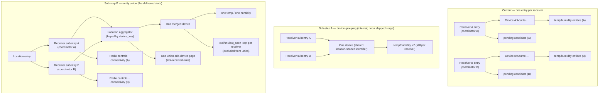
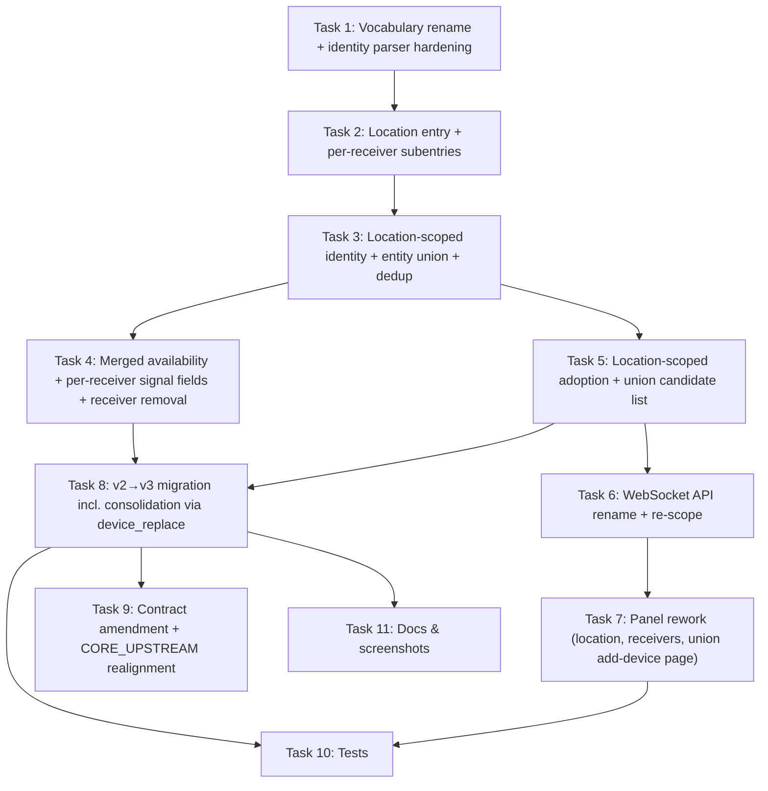

# Plan: Union Devices Across Multiple rtl_433 Receivers

## Original Work Order

> **Issue rtl-433-hass/rtl_433 #123 — "feature: Add ability to union devices from two rtl_433 instances"** (opened by `gdt`, confirmed by maintainer `deviantintegral`).
>
> Consider someone with two rtl_433 instances on the same frequency, say 2x RPi3 at two ends of a building, to get better coverage. As the docs read, devices show up as separate devices under two "hubs" — but they aren't separate; they are the same sensor received by two RF→HA gateways. This should be like the BLE proxies, where the device shows up top-level: one set of entities for the Acurite T/H sensor even if both receivers see it, and data flowing if either is working.
>
> Suggested model: an integration instance is a logical location; within it one can add multiple rtl_433 instances that are logically merged. Normal use = one integration instance with multiple rtl_433 instances; people monitoring two distinct places (km apart) would have two integration instances. Also: call the rtl_433 instances "receivers" instead of "hubs" — "hub" implies extra hardware; this is just "a dongle on a computer".
>
> Maintainer confirmation (`deviantintegral`): tuned a second radio and observed two devices, each with unique history. Notes HA can already combine entities from different integrations onto one device (seen with UniFi), so "perhaps we just clean up the device IDs," but flags that the lack of something like a MAC address may make this tricky, and is unsure what happens if both expose the same entities.

*This plan is grounded in a direct reading of the current source (`custom_components/rtl_433/`), not the documentation alone. All line citations were re-verified against `main` on 2026-09-11.*

## Plan Clarifications

| # | Question | Answer |
|---|----------|--------|
| 1 | How much of the phased roadmap should this plan cover? | **Full roadmap.** One plan covering both device grouping (Level 1) and true entity union (Level 2): logical-location entry, per-receiver subentries, cross-receiver aggregation, frame-timestamp dedup, and merged availability. Level 1 is delivered as a stable internal milestone on the way to Level 2 (location-scoped per Clarification #6). |
| 2 | What is the backwards-compatibility / migration bar? | **Seamless, preserve history.** In-place `async_migrate_entry` preserving entity IDs and history for the surviving entity, matching the project's established v1→v2 precedent. Where HA's unique-id constraint forces two histories to merge (Level 2), **auto-merge** and raise a **Repairs notice** naming which receiver's duplicate history was dropped. Backwards compatibility with existing single-receiver installs is **required**. |
| 3 | Include the hub→receiver rename, and how deep? | **Full rename including internals.** Rename "hub"→"receiver" across user-facing strings, docs, and config-flow labels **and** internal identifiers (`hub_entry_id`, `signal_hub_update`, `Rtl433HubEntity`, `CONF_HUB_ENTRY_ID`, etc.). This includes the `:hub:` literals baked into control-entity `unique_id`s, accepting a dedicated migration that rewrites those unique_ids so existing control entities are preserved. *(Scope re-measured in Clarification #11.)* |
| 4 | Cross-receiver value dedup keys on `event_time`, which is each rtl_433 host's own decode clock (skew-prone). What rule? | **Debounce window + reject stale** *(resolved autonomously; recommended default — interactive prompt declined)*. Frames for the same `(device_key, field)` within a small window (~2–5 s, configurable constant) are treated as the **same transmission**: the first applied value wins and the near-duplicate from the other receiver is ignored. `event_time` is used to **reject clearly-old frames** (reconnect backlog replays). Robust to modest NTP skew between hosts; assumes hosts are roughly time-synced (see risk + assumption). |
| 5 | On a forced history merge, which of two colliding entities survives (recorder history isn't queryable at migration time)? | **First receiver by creation order** *(resolved autonomously; recommended default)*. Deterministically keep the entity belonging to the **earliest-added receiver** (subentry creation order), rewrite it to the location-scoped `unique_id`, remove the other, and raise a Repairs notice naming the dropped receiver. Predictable, no per-collision prompt. *(Mechanism revised in Clarification #13 — it must route through `async_replace_device`.)* |
| 6 | How is the Level 1 "device grouping" checkpoint scoped, given no location entry exists before Level 2? | **Location-scoped from the start** *(resolved autonomously; recommended default)*. Level 1 is an **internal step**, not a separately-shipped state across standalone config entries: the location + per-receiver-subentry topology is built first, and device identity is location-scoped immediately. This avoids false cross-site merges and makes Level 1→Level 2 a pure identity-narrowing step (device-level → entity-level) within one location. *(Simplified further in Clarification #24: because it ships to nobody, Level 1 is delivered as the first sub-step of the union component rather than as its own component, phase and validation gate.)* |
| 7 | *(auto-resolved from codebase)* Are HA config subentries available in the targeted HA version? | **Yes.** `hacs.json` pins `homeassistant: 2026.9.0` (the test stack runs 2026.9.1); `ConfigSubentryFlow` is GA well before that. No version bump to the minimum is required. *(Pin corrected from the 2026.4.0 cited in an earlier refinement; the conclusion is unchanged and the newer floor is what makes the single-owner registry model in Clarification #16 unconditional rather than a compatibility concern.)* |
| 8 | ~~Discovery-toggle scope~~, `via_device` of merged devices, and mapping of existing reconfigure/Supervisor-discovery flows onto subentries. | **Partly superseded.** The *discovery toggle no longer exists* — it was retired by the minor 7→8 migration step (`_strip_discovery_toggle`) and replaced by the approval workflow; see Clarification #12. `via_device` is likewise superseded: the tuple form is gone from `DeviceInfo` (Clarification #14). What survives: existing `async_step_reconfigure` / `async_step_hassio*` move to **subentry** scope, and a Supervisor-discovered server defaults to a **new location** with an option to attach to an existing one. |
| 9 | **`COMPATIBILITY_CONTRACT.md` now freezes the exact three surfaces this plan rewrites** (config-entry version ladder §1, entity `unique_id` templates §2, device-registry identifier tuples §3) and this plan additionally breaks the §4 invariant `hub_entry_id == entry.entry_id`. The contract requires any such change to ship in the HACS build and the future Core build *simultaneously*. How should the plan proceed? | **Proceed and amend the contract** *(user-selected)*. Plan 27 is treated as **the** coordinated breaking ABI change. It carries a dedicated deliverable that (a) revises `COMPATIBILITY_CONTRACT.md` to a new revision documenting the location/receiver templates and the v3 ladder, and (b) updates `CORE_UPSTREAM.md` so the Bronze PR1 vertical slice carries the new templates from the start rather than landing the frozen v2 shape and immediately breaking it. The contract's non-downgrade rule is preserved: the v3 ladder is forward-only and the Core build must learn `version = 3`. |
| 10 | Main already uses "receiver" to mean **the SDR radio inside a hub** ("Set the receiver's center frequency", "the receiver's availability timeout"), colliding with this plan's proposed meaning of "receiver" = the rtl_433 server. How is the collision resolved? | **Receiver = server; the SDR sense becomes "radio"** *(user-selected)*. Keep the word the issue reporter and maintainer asked for: a **receiver** is one rtl_433 server/endpoint. Every existing string, identifier, and doc sentence that currently means the SDR *hardware* is reworded to **"radio"** (or "tuner" where it reads better). Keeping this inside plan 27 is deliberate: it means **one** ABI break and **one** unique-id migration rather than two. |
| 11 | *(auto-resolved from codebase)* How large is the rename surface now, versus the single `:hub:` site the plan originally cited? | **Roughly 6× larger, and no longer cosmetic.** There are **four** runtime `:hub:` unique-id construction sites, not one: SDR controls (`entity.py:390`), hub noise-level sensors (`sensor.py:582`), hub connectivity (`binary_sensor.py:186`), plus the documented template in `sdr_settings.py:103`. There are **five** hub-scoped dispatcher signals (`const.py:273,291,303,318,339`), themselves named a frozen contract by `AGENTS.md`. Raw occurrence counts: ~839 in `custom_components/**/*.py`, ~4,935 in `tests/`, ~491 across `*.md` + `docs/`, ~91 in `frontend/rtl_433-panel.js`, 18 in `translations/`. **Critically**, the `:hub:` rewrite cannot be a literal swap: under one location with two receivers, `f"{entry_id}:hub:{object_suffix}"` would *collide* between receivers, so the template must gain a receiver discriminator (see Data Contract). |
| 12 | Devices are now **adopted / ignored / pending** per coordinator (the approval workflow, `adoption.py` + `coordinator/base.py:266-283`), which replaced the retired discovery toggle. How should this behave across receivers in one location? | **One union add-device page** *(user-selected, verbatim)*: "The add a device page should be a single page that is the union of all discovered devices across all receivers. A device received by multiple radios should show the last received data." So: pending/adopted/ignored state is **location-scoped**; a sensor heard by two receivers appears as **one** candidate row, not two; adopting or ignoring it once applies to the whole location. The candidate card displays **last-received-wins** data (the most recently arrived frame from any receiver), which is deliberately a *simpler* rule than the debounce dedup used for adopted entity values — a discovery preview only needs to show the freshest sample, while a recorded entity value needs the anti-regression guard of Clarification #4. |
| 13 | *(auto-resolved from codebase)* How should the forced duplicate-history merge rewrite the registry, given `device_replace.py` now exists? | **Route it through `async_replace_device`, do not open-code it.** `AGENTS.md` states that helper is "the **only** sanctioned place to rewrite a nested device's registry `identifiers` or entity `unique_id`s; do not open-code a re-key elsewhere." It already implements the load-bearing ordering this merge needs — *free the duplicate rows first, then mutate survivors in place via `async_update_entity`* — precisely so `entity_id` and recorder history carry through. The plan therefore **extends `device_replace.py`** with the location-consolidation case rather than adding registry surgery to `migration.py`. |
| 14 | *(auto-resolved from codebase)* Is the plan's `via_device` data contract still valid, and has availability changed? | **No and yes — both moved.** (a) `via_device` (the identifier tuple) is **deprecated and gone from `DeviceInfo`** as of the HA 2026.9 migration; the code now sets `via_device_id=dr.async_get_device_id_by_identifier(...)` (`entity.py:173-177`). The data contract is restated in those terms. (b) Availability is now **two gates**, not one (`entity.py:187-215`): a **transport gate** (`hub_available` — false the instant the WebSocket drops, no grace window, and it overrides even never-expire devices) *and* the per-device silence gate. The plan's original Component 4 merged only the silence gate; merging must now cover both, and naively unioning them independently introduces a correctness bug (see Component 4). |
| 15 | The panel (`frontend/rtl_433-panel.js`, 3,732 lines) and the **documented public** WebSocket commands (`rtl_433/hubs`, `rtl_433/settings/hub`, `docs/websocket-api.md:286-600`) both encode the hub model. In scope? | **Panel updated + full breaking API rename** *(user-selected)*. The panel is reworked to present a location containing receivers and merged devices, including the single union add-device page from Clarification #12. The WebSocket commands are renamed outright to the new vocabulary (`rtl_433/receivers`, `rtl_433/settings/receiver`, …) with **no compatibility aliases**, and `docs/websocket-api.md` is rewritten to match. *(Blast radius re-scoped in Clarification #20: the commands are not considered a public API yet, so no release-note or deprecation obligation attaches.)* |
| 16 | *(auto-resolved from codebase)* Does HA still merge device-registry devices across config entries by shared identifier — the mechanism the plan's Level 1 relies on? | **No. The registry became single-owner and the plan's stated mechanism is obsolete.** Registry storage **v3 (HA 2026.8)** gives every device exactly **one** `config_entry_id` and **one** `config_subentry_id`; `config_entries`, `config_entries_subentries` and `primary_config_entry` are deprecated shims that return singletons (`device_registry.py:396-412`), device lookups are scoped by `config_entry_id`, and devices that previously spanned entries were **split** into one row per entry with a read-only *composite* synthesis (`_restore_composite_device`, `device_registry.py:1926`). Level 1 still works, but for a different reason: both receivers are **subentries of one location entry**, so their devices share an owner. Two separate location entries hearing the same `model+id` therefore cannot merge even accidentally — Clarification #6's goal is now enforced by HA itself. |
| 17 | *(auto-resolved from codebase)* Who owns a **merged** device, given a device belongs to exactly one subentry? | **The location entry, with `config_subentry_id = None`** — and this is a hard deadline, not a preference. HA warns that assigning an existing device to a different subentry, *"or by adding entities from several subentries that share a device"*, silently moves the device, and that this **raises in HA Core 2027.8** (`device_registry.py:2482-2500`). So merged sensor entities — **and Component 4's per-receiver signal entities (`rssi` / `snr` / `last_seen`), which are receiver-specific but hang off the shared merged device** — must be added via `async_add_entities` with **no** `config_subentry_id`. Only receiver-owned entities (radio controls, noise sensors, connectivity) pass their receiver's subentry id. |
| 18 | Two code paths parse identity by colon segments — `device_trigger.py:190` (`split(":", 2)`, requires exactly 3 parts) and `__init__.py:504` (`ident.split(":", 1)[1]`). The Data Contract's 4-segment receiver template mis-parses under both (`device_key` would come out as `receiver`). How is this resolved? | **Harden the parsers; keep the 4-segment templates** *(user-selected)*. The Data Contract's shapes stand; both parsers gain explicit segment-count branching and recognition of the `receiver` marker, so a receiver-control or per-receiver-diagnostic unique_id is never mistaken for a device-field one. Consequence: **`receiver` becomes a reserved token** that a `device_key` may not equal — assert this against `pyrtl_433.naming.safe_token` output and cover it with a test. Parser hardening ships in the rename task, alongside the templates it protects. |
| 19 | What does the initial config flow (`async_step_user`) create under the two-level topology? | **The location and its first receiver in one flow** *(user-selected)*. The user enters host/port/path exactly as today; the flow creates the location entry **and** its first receiver subentry together. This preserves the current single-receiver UX with no added step, keeps Supervisor discovery straightforward, and makes a receiver-less location unreachable by construction. |
| 20 | What happens when a user deletes a receiver subentry from a location? | **Remove that receiver's own entities; keep merged devices** *(user-selected)*. Drop the receiver device, its radio controls, noise sensors, connectivity entity, and its per-receiver signal entities (`rssi` / `snr` / `last_seen`) on every merged device; **merged sensor devices and their history survive**, and merged availability is recomputed over the remaining receivers. A merged device that only the removed receiver ever heard goes **unavailable but is not deleted** — deleting it stays an explicit user action. |
| 21 | Is the WebSocket command rename a breaking change to a public API requiring release notes? | **No — the API is not public yet** *(user-selected, verbatim: "I don't consider the WebSocket API to be public yet. No need for release notes at all.")*. `docs/websocket-api.md` is still rewritten to match the new commands, but the plan carries **no** release-note deliverable, no deprecation window, and no compatibility aliases. The corresponding Scope/UX risk is downgraded accordingly. |
| 22 | Per-receiver signal detail: are `rssi` / `snr` / `last_seen` new diagnostic entities, and how do they behave under the union? | **Neither new nor merged.** `rssi` and `snr` are **already mapped device fields** (`pyrtl_433.library/data/misc.yaml`: `platform: sensor`, `device_class: signal_strength`, `entity_category: diagnostic`, `enabled_by_default: false`), and `last_seen` is the synthetic field at `sensor.py:270-276`. So the plan does **not** build a parallel diagnostic-entity class — it reuses those mappings with a receiver segment, yielding **one entity per (sensor × receiver)** on the merged device, exactly so a user can read *"strong at Attic (−62 dB), weak at Garage (−89 dB)"* off one device page. Critically, these three fields are **excluded from the dedup/union** of Component 3: merging them would produce a single value showing whichever receiver won the debounce race, which is meaningless for a signal measurement. Two consequences: the receiver label must live in `_attr_name` (not only the unique_id), or `_attr_has_entity_name = True` (`entity.py:128`) mints two entities both called "RSSI" and HA appends `_2` — the issue #132 failure mode; and they inherit `enabled_by_default: false` (see #23). |
| 23 | Signal entities are opt-in, so the A-vs-B comparison would need hand-enabling two entities per sensor. How is it surfaced? | **The panel shows it; the entities stay default-off** *(user-selected)*. The merged device view and the union add-device page render *"heard by Attic (−62) / Garage (−89)"* directly from **aggregator state**, so the headline comparison needs no entity enabled at all. `rssi` / `snr` keep `enabled_by_default: false`, avoiding *sensors × receivers × 2* entity growth for users who only want the union. Users who want history or automations on signal strength enable the entities as they do today. |
| 24 | Level 1 was a component, a phase, a task, a success criterion and a validation step — but Clarification #6 made it an internal state no user ever reaches. Is that warranted? | **No — collapse it into the union work** *(user-selected simplification)*. Level 1's whole content is two edits in `entity.py` (the device identifier at :165 and the `via_device_id` relink at :173-177) that Level 2 immediately narrows again at :147. Delivering it as its own phase put a validation gate on a state that ships to nobody. It becomes the **first sub-step of the union component**: grouping lands and is sanity-checked in the same task that then narrows identity to the entity level, keeping the useful debugging order without the ceremony. The blueprint drops from **8 phases / 12 tasks to 7 phases / 11 tasks**, and the Level 1 success criterion and validation step are folded into the union ones. |
| 25 | Task 002 left a gap: deleting a location's **last** receiver subentry leaves a receiver-less entry that `async_setup_entry` refuses with `ConfigEntryError`. What should that do? | **Blocking was chosen but is not implementable; the location cascades instead** *(user-selected, amended on implementation)*. HA offers **no veto hook** for a subentry removal — `config_entries.async_remove_subentry` is a plain callback, and `supported_subentry_types` only gates whether a *type* supports add/reconfigure, not whether a given instance may be deleted. Refusing the user-facing delete is therefore impossible. The intent behind the choice — never leave a receiver-less entry that can never load again — is delivered by having the **location follow its last receiver out**: the update listener removes the entry when its subentries empty. Net user-visible behaviour: deleting the last receiver deletes the location. Note this is narrower than Clarification #20, which governs what removing a *non-final* receiver does (drop its own entities, keep merged devices) — that behaviour is unchanged. |

## Executive Summary

Today the integration models **one config entry = one rtl_433 server = one WebSocket endpoint** ("hub"), and every decoded RF device's identity is scoped to that entry. Entity `unique_id`s are `f"{hub_entry_id}:{device_key}:{object_suffix}"` (`entity.py:147`), device-registry identifiers are `(DOMAIN, f"{hub_entry_id}:{device_key}")` linked to the hub via `via_device_id` (`entity.py:165,173-177`), and the per-device dispatcher signals, coordinator runtime state, adoption sets, and availability watchdog are all keyed per entry (`const.py:273-344`, `coordinator/base.py:266-295`). Consequently, when two receivers hear the same physical sensor, HA shows two devices with two separate histories — exactly the duplication `gdt` reported and `deviantintegral` reproduced — and, since the approval workflow landed, the same sensor also queues as **two separate pending candidates** the user must approve twice.

Crucially, the merge key the feature needs **already exists**: `device_key` is a deterministic RF fingerprint derived from `model` plus the present identity fields (id / channel / subtype), format `<model-token>-<id>[-ch..][-st..]`, now produced by the extracted `pyrtl_433` library (`pyrtl_433.naming.safe_token`, itself a frozen contract). The core cost of this feature is **decoupling identity, availability, adoption, and dispatch from the per-receiver entry id**, plus adding **one cross-receiver aggregation layer** that dedupes on frame timestamp and merges both availability gates. The cross-config-entry re-homing machinery this requires already exists and is proven (`_rehome_device_objects`, `migration.py:336`), as does the in-place re-key path the forced merge needs (`async_replace_device`, `device_replace.py` — the only sanctioned place to rewrite a nested device's identity, per `AGENTS.md`).

Two constraints tightened underneath the plan and are now load-bearing. First, Home Assistant's device registry became **single-owner** in storage v3 (HA 2026.8): a device belongs to exactly one config entry and one subentry, lookups are entry-scoped, and the multi-entry accessors are deprecated shims. The plan's original Level 1 mechanism — *two config entries registering the same identifier merge into one device* — therefore no longer exists; grouping now works because both receivers are **subentries of one location entry**, which as a bonus makes the cross-location isolation guarantee structural rather than conventional. Second, and more sharply, a device shared by entities from two subentries is **silently moved today and raises in HA Core 2027.8**, which makes merged-device ownership a dated correctness requirement: merged devices, their field entities, and the per-receiver signal entities attached to them are all owned by the **location entry with no subentry**, and only receiver-owned entities carry a subentry id.

What has changed most since this plan was first written is not the technical shape but the **governance**: `COMPATIBILITY_CONTRACT.md` now declares the config-entry version ladder, the entity `unique_id` templates, and the device-registry identifier tuples a **FROZEN**, byte-level ABI shared with a future minimal Home Assistant Core build, changeable only by a coordinated migration shipped in both builds at once. Plan 27 rewrites all three and breaks the §4 invariant `hub_entry_id == entry.entry_id`. Per Clarification #9 the plan therefore owns that coordination explicitly: it ships a contract revision and a `CORE_UPSTREAM.md` realignment as first-class deliverables, so the Bronze PR1 slice carries the new templates rather than landing the frozen v2 shape and immediately breaking it.

The work is delivered as: the **vocabulary rename** (hub→receiver for the server, and the existing "receiver"→"radio" for the SDR, resolving a collision main introduced); the **location entry with per-receiver subentries**; **location-scoped identity and the entity union** via a location aggregator with skew-tolerant dedup (device grouping and entity union delivered as ordered sub-steps of one component rather than two — Clarification #24); **merged availability across both gates** plus per-receiver signal fields kept out of the union; **location-scoped adoption with a single union add-device page**; the **panel and public WebSocket API** reworked to the location model with a breaking command rename; and the **ABI amendment plus a seamless, non-merging v2→v3 migration**. Existing installs upgrade in place with entity IDs and history preserved and **no automatic merging** — each existing entry becomes its own location. Union is strictly opt-in; only when a user deliberately consolidates receivers can a duplicate history be dropped, and then deterministically (earliest-added receiver survives) with a Repairs notice naming what was dropped.

## Context

### Current State vs Target State

| Aspect | Current State | Target State | Why? |
|--------|---------------|--------------|------|
| Config-entry topology | One entry per rtl_433 server ("hub"); one WebSocket endpoint per entry (`config_flow.py` `async_step_user`) | A **location** config entry containing one **config subentry per receiver** (host/port/path); multiple location entries only for distant sites | A config entry should represent the logical thing the user manages (a coverage location), with receivers as sub-things behind it |
| Device identity | `(DOMAIN, f"{hub_entry_id}:{device_key}")`, `unique_id` `f"{hub_entry_id}:{device_key}:{object_suffix}"` (`entity.py:147,165`) | Location-scoped, receiver-agnostic identity keyed on `device_key` | The RF fingerprint (`device_key`) is the true identity; the receiver that heard it is not part of the sensor's identity |
| Duplication | Same sensor heard by two receivers → two devices, two histories | One device, one set of entities; data from whichever receiver heard it | The issue's core request (BLE-proxy-like union) |
| Device-registry ownership | A device belongs to one config entry; no subentries exist (`entity.py:165`) | Merged devices owned by the **location entry with `config_subentry_id = None`**; receiver devices and their controls owned by their **receiver subentry** | Registry storage v3 (HA 2026.8) gives each device exactly one owner, and entities from two subentries sharing a device **raise in HA Core 2027.8** (Clarifications #16/#17) |
| Device→parent link | `via_device_id=dr.async_get_device_id_by_identifier(...)` resolving `(DOMAIN, hub_entry_id)` (`entity.py:173-177`); the `via_device` tuple form is gone (HA 2026.9) | Same mechanism, resolving the **location** device instead of the hub device | The tuple API is removed upstream; only the id form remains (Clarification #14) |
| Coordinator | One coordinator per entry, per-device state (`devices`/`last_seen`/`available`/`device_fields`) scoped to that entry (`coordinator/base.py:291-295`) | One coordinator **per receiver** (transport stays per-endpoint), plus a location-level aggregator over them | Transport cannot be merged below the socket; merging happens above the coordinators |
| Value updates | `_handle_dispatch` applies `event.fields` unconditionally, even for replays (`entity.py:267`) | **Skew-tolerant dedup**: near-simultaneous frames (within a ~2–5 s window) are one transmission (first-applied wins); `event_time` rejects clearly-old frames (backlog replays) | With two receivers, receiver A's replayed old frame would otherwise clobber receiver B's fresh value; window tolerates host clock skew without assuming perfect NTP sync |
| Availability | **Two gates** per device: the receiver's transport (`hub_available`, no grace window, overrides never-expire) AND per-device silence vs `last_seen` (`entity.py:187-215`) | A device is available if **some** receiver both **is connected** and **heard it within the effective timeout** — evaluated per receiver, then OR-ed | A merged device must survive one receiver going quiet *or* offline; OR-ing the two gates independently would wrongly keep a device alive on a dead receiver's stale timestamp |
| Adoption / discovery | `adopted` / `ignored` / `pending` sets live on each coordinator (`coordinator/base.py:266-283`); `SIGNAL_PENDING_UPDATE` is hub-scoped (`const.py:339`); the discovery **toggle was retired** in minor 7→8 | Location-scoped adoption state; **one union add-device page** across all receivers; a device heard by two receivers is one candidate row showing last-received data | A user should approve a physical sensor once, not once per receiver (Clarification #12) |
| Coverage visibility | Implicit (two separate devices); `rssi`/`snr` already exist as opt-in diagnostic device fields | The **same** `rssi` / `snr` / `last_seen` fields kept **per receiver** on the merged device (excluded from the union), plus a panel display of *heard by A (−62) / B (−89)* from aggregator state | Preserve the per-receiver signal detail the merge would otherwise hide, without merging a signal measurement into a meaningless winner-takes-all value (Clarifications #22/#23) |
| Vocabulary — the server | "hub" in UI, docs, code identifiers, five dispatcher signals, and four `:hub:` unique-id sites | "receiver" everywhere, incl. internals, signals, and the control unique-id templates (migrated) | "hub" implies extra hardware; the maintainer/reporter both prefer "receiver" |
| Vocabulary — the SDR | "receiver" already means the SDR radio ("the receiver's center frequency", `translations/en.json:27,67,253`) | "radio" (or "tuner") for the SDR hardware sense | Frees the word "receiver" for the server without ambiguity (Clarification #10) |
| Panel + WebSocket API | 3,732-line panel over hub-centric commands `rtl_433/hubs`, `rtl_433/settings/hub`, per-hub pending lists (`websocket_api.py:573,966`; documented `docs/websocket-api.md:286-600`) | Panel presents a location containing receivers and merged devices, with the union add-device page; commands renamed outright (`rtl_433/receivers`, `rtl_433/settings/receiver`) | The UI is now the primary surface for discovery; leaving it hub-shaped would contradict the whole model (Clarification #15) |
| Identity ABI | `COMPATIBILITY_CONTRACT.md` §1–§4 **FROZEN**; `config_flow.py:139-140` declares `VERSION = 2`, `MINOR_VERSION = 8`; `migration.py` rejects `entry.version > 2` | Contract revised to a new revision; `VERSION = 3`; the future-schema guard raised to `> 3`; `CORE_UPSTREAM.md` PR1 scoped to the new templates | The contract permits this only as a coordinated, forward-only change shipped in both builds (Clarification #9) |
| Upgrade path | n/a | `async_migrate_entry` v2(minor 8)→v3: rewrite control unique_ids, convert each entry to its own location + one receiver subentry, re-home to location identity; **no auto-merge** | Seamless, history-preserving, loss-free upgrade (Clarification #2) |

### Background

- **The merge key already exists.** `device_key` is `model` + the present subset of identity fields (id / channel / subtype). It is now produced by the extracted **`pyrtl_433`** library (`pyrtl_433.naming.safe_token` / `display_name` / `identity_suffix`), where `safe_token` is itself called out by `AGENTS.md` as a **frozen contract** because unique_ids, entity_ids and dispatcher signals embed it. `device_key` tokens never contain `:`, so `:`-delimited unique_ids remain safe to construct and parse — including the new three- and four-segment forms in the Data Contract. This is the "clean up the device IDs" the maintainer asked about; there is no MAC-address gap to fill.
- **The identity surfaces are contractually frozen.** `COMPATIBILITY_CONTRACT.md` (status: **FROZEN**) and `AGENTS.md:50-68` bind the HACS build and the future minimal Core build to byte-identical `unique_id` templates, identifier tuples, and a shared version ladder, because both ship under the same `rtl_433` domain and therefore read and write the same registries. This plan changes all of them, so the amendment is part of the deliverable, not an afterthought (Clarification #9). `CORE_UPSTREAM.md` currently scopes `entity.py`, `const.py`, `config_flow.py`, `coordinator/` and `sensor.py` into an in-flight Bronze PR1 — those are the very modules this plan rewrites, so the two efforts must be sequenced deliberately rather than discovered in conflict.
- **The device registry is now single-owner, so grouping happens *within* one entry — not across entries.** Registry storage v3 (HA 2026.8) gives each device exactly one `config_entry_id` and one `config_subentry_id`; the multi-entry accessors are deprecated shims returning singletons and lookups are scoped by entry (`device_registry.py:396-412`), so the old "two entries registering the same identifier merge into one device" behaviour is **gone** (Clarification #16). Level 1 works because both receivers are **subentries of a single location entry**: dropping the receiver-id prefix from `DeviceInfo.identifiers` (`entity.py:165`) makes them register the same location-scoped identifier under the same owning entry. It does **not** merge entities — their `unique_id`s stay receiver-scoped, so each field still appears once per receiver (the "what if they expose the same entities" concern). True entity union (Level 2) additionally requires receiver-agnostic `unique_id`s. A useful side effect: two separate location entries can no longer merge by accident, so Clarification #6's isolation guarantee is enforced by HA rather than by our identifier prefix alone.
- **A shared device must live in exactly one subentry, and HA will start raising on violations.** Adding entities from several subentries that share a device silently moves the device today and **raises in HA Core 2027.8** (`device_registry.py:2482-2500`). Merged devices are therefore owned by the **location entry with no subentry**, and so are the per-receiver diagnostics that hang off them; only receiver-owned entities carry a `config_subentry_id` (Clarification #17).
- **HA forbids duplicate unique_ids.** When Level 2 rewrites both receivers' entities for one sensor to the same receiver-agnostic `unique_id`, they collide; HA refuses the duplicate, so exactly one entity survives and the other must be removed. The loss of that second entity's separate history is therefore *mandated by HA*, not a design preference — hence the auto-merge-with-Repairs-notice policy (Clarification #2).
- **The in-place re-key path already exists and is guarded.** `device_replace.py` (`async_replace_device`) re-points a nested device and every entity under it from one `device_key` to another so `entity_id`, recorder history, statistics, dashboards and automations survive. Its module docstring documents the load-bearing ordering — *free the duplicate rows first, then mutate survivors via `async_update_entity`* — which is exactly the ordering the forced merge needs, and `AGENTS.md:204-207` forbids open-coding a re-key anywhere else. The consolidation path extends this module (Clarification #13).
- **Replay classification is already correct at the source**, and now lives in the library. `pyrtl_433.replay` provides `classify_replay` / `parse_event_time` / `REPLAY_STALE_THRESHOLD`; replayed frames deliberately do not refresh `last_seen`/`available`, and `coordinator/_events.py` re-derives the HA-side pre-connection backlog gate off `_connection_time`. What is missing for the multi-receiver case is guarding the *value write* in `_handle_dispatch` (`entity.py:267`) on `event_time`, so a late replay from one receiver cannot overwrite a newer live value already applied from another.
- **Cross-entry re-homing is proven, and already tracks the current registry API.** `_rehome_device_objects` (`migration.py:336-353`) moves each device onto the target entry in a **single `new_config_entry_id` update** — the API that replaced the old add-then-remove pair now that a device has one owner — so devices/entities are never momentarily orphaned and history is preserved; `async_migrate_entry` already used it for the v1→v2 consolidation.
- **The `:hub:` rewrite is not a literal swap.** Four runtime sites build `…:hub:…` unique_ids — SDR controls (`entity.py:390`), hub noise-level sensors (`sensor.py:582`), hub connectivity (`binary_sensor.py:186`), plus the documented template at `sdr_settings.py:103`. Under one location with two receivers, a template scoped only to the entry id would **collide between receivers**, so the replacement must carry a receiver discriminator, not merely a renamed literal. All *device-field* `object_suffix` values must remain byte-identical (contract §2, AGENTS.md guardrail).
- **More code embeds the entry-scoped identity than the four `:hub:` sites.** Beyond them, the entry id is baked into the platform dedupe helper (`entity.py:608`), the orphan-device prefix scan (`__init__.py:501-504`), the phantom-device and last-seen migration steps (`migration.py:114,300`), the re-key helper's five construction sites (`device_replace.py:85-122`), and **two parsers that decompose a unique_id by colon segment** — `device_trigger.py:178-194` and `__init__.py:504`. The parsers are the sharp edge: both assume the 3-segment device-field shape, so the 4-segment receiver and diagnostic templates must be handled explicitly (Clarification #18). `device_replace.py`'s module docstring additionally hardcodes the v2 templates and asserts that "nothing in `COMPATIBILITY_CONTRACT.md` moves" — a statement this plan falsifies, so the docstring is part of the change.
- **Five dispatcher signals are hub-scoped** (`SIGNAL_DEVICE_UPDATE`, `SIGNAL_NEW_DEVICE`, `SIGNAL_HUB_UPDATE`, `SIGNAL_HUB_AVAILABILITY`, `SIGNAL_PENDING_UPDATE` — `const.py:273,291,303,318,339`). The aggregator subscribes to per-receiver signals and re-emits location-scoped equivalents; the rename touches all five.
- **Out of scope:** the device-library YAML / mapping system, the WebSocket transport in `pyrtl_433`, network discovery of servers, SNR-preferred packet selection (deferred — the debounce rule is sufficient for v1), and calibration semantics.

## Architectural Approach

The work divides into eight components. Because device grouping is **location-scoped** (Clarification #6), the location/receiver subentry topology is a prerequisite for it, so the delivery order is: the vocabulary rename (with its unique-id migration); the location/receiver subentry topology; location-scoped identity and the entity union with skew-tolerant dedup (grouping then union, as ordered sub-steps of one component — Clarification #24); merged availability with per-receiver signal fields; location-scoped adoption and the union add-device page; the panel and WebSocket API rework; the ABI contract amendment; and the seamless migration plus docs.

```mermaid
graph TD
    subgraph Before["Current — one entry per receiver"]
        HA["Receiver A entry<br/>(coordinator A)"]
        HB["Receiver B entry<br/>(coordinator B)"]
        HA --> DA["Device A:Acurite-…"]
        HB --> DB["Device B:Acurite-…"]
        DA --> EA["temp/humidity entities (A)"]
        DB --> EB["temp/humidity entities (B)"]
        HA --> PA["pending candidate (A)"]
        HB --> PB["pending candidate (B)"]
    end
    subgraph L1["Sub-step A — device grouping (internal; not a shipped stage)"]
        SA1["Receiver subentry A"]
        SB1["Receiver subentry B"]
        SA1 --> D1["One device (shared location-scoped identifier)"]
        SB1 --> D1
        D1 --> E1["temp/humidity ×2 (still per receiver)"]
    end
    subgraph L2["Sub-step B — entity union (the delivered state)"]
        LOC["Location entry"]
        SA["Receiver subentry A<br/>(coordinator A)"]
        SB["Receiver subentry B<br/>(coordinator B)"]
        LOC --> SA
        LOC --> SB
        SA --> AGG["Location aggregator<br/>(keyed by device_key)"]
        SB --> AGG
        AGG --> DM["One merged device"]
        AGG --> PU["One union add-device page<br/>(last-received-wins)"]
        DM --> EM["one temp / one humidity"]
        DM --> DIAG["rssi/snr/last_seen kept per receiver<br/>(excluded from union)"]
        SA --> RA["Radio controls + connectivity (A)"]
        SB --> RB["Radio controls + connectivity (B)"]
    end
```

```mermaid
sequenceDiagram
    participant RA as Receiver A coord
    participant RB as Receiver B coord
    participant AGG as Location aggregator
    participant Ent as Merged entities
    RA->>AGG: event(device_key, fields, event_time=T1)
    AGG->>AGG: clearly newer than last applied? apply
    AGG->>Ent: apply value; last_seen[A]=now
    RB->>AGG: near-dup(device_key, fields, event_time≈T1 ± skew)
    AGG->>AGG: within debounce window? same transmission → ignore value
    RB->>AGG: replay(device_key, fields, event_time=T0 ≪ T1)
    AGG->>AGG: clearly older than window? reject (stale/backlog)
    AGG->>Ent: (no stale overwrite)
    Note over AGG,Ent: availability = OR over receivers of<br/>(receiver connected AND heard within timeout)
```

### Component 1 — Vocabulary: hub → receiver (server), receiver → radio (SDR)

**Objective**: Establish one unambiguous vocabulary before any structural change lands, preserving every existing entity.

Two renames run together because they collide (Clarification #10). **"Receiver" becomes the rtl_433 server/endpoint**: rename user-facing text in `translations/en.json`, all documentation, and internal identifiers — `hub_entry_id`, `CONF_HUB_ENTRY_ID`, the five `SIGNAL_HUB_*` / `signal_hub_*` helpers (`const.py:273-344`), `Rtl433HubEntity` / `Rtl433HubControl`, `hub_settings.py`, `_migrate_hub_entry`. Simultaneously, **the existing "receiver" sense — the SDR hardware — becomes "radio"**: the affected strings are the tuning/frequency/sample-rate texts at `translations/en.json:27,67,253` and their doc counterparts, plus any identifier that means the tuner. The resulting mental model is *a receiver is a computer running rtl_433; it contains a radio.*

The identity-affecting part is the four `:hub:` unique-id sites (Clarification #11). Because a location can hold several receivers, the replacement template must discriminate by receiver, so `f"{hub_entry_id}:hub:{object_suffix}"` becomes `f"{location_entry_id}:receiver:{receiver_subentry_id}:{object_suffix}"` (see Data Contract). The v2→v3 migration rewrites each existing control entity's `unique_id` to the new form via the entity registry, so radio controls, hub noise sensors and the connectivity sensor are preserved rather than recreated. All *device-field* `object_suffix` tails stay byte-identical.

Because the new templates are four segments where the device-field template is three, this component also **hardens the two unique_id/identifier parsers** that currently assume the 3-segment shape: `_device_field_from_unique_id` (`device_trigger.py:178-194`, `split(":", 2)` requiring exactly three parts) and the orphan-device prefix scan (`__init__.py:501-504`, `ident.split(":", 1)[1]`). Both gain explicit segment-count branching and recognition of the literal `receiver` marker, so a receiver control or a per-receiver diagnostic is never mis-read as a device field (Clarification #18). The consequence is a new invariant: **`receiver` is a reserved token that no `device_key` may equal**, asserted against `pyrtl_433.naming.safe_token` output and covered by a test. Parser hardening ships here, in the same task as the templates it protects, rather than being discovered later by a mis-parsed automation trigger.

### Component 2 — Location entry with per-receiver config subentries

**Objective**: Model a logical location containing multiple receivers using HA config subentries, keeping one coordinator per receiver.

Introduce a parent **location** config entry and a `ConfigSubentryFlow` where each subentry carries one receiver's connection target (`host`/`port`/`path`) and per-receiver settings (the managed-radio toggle, initial frequency). Setup forwards platforms once on the location entry and constructs **one coordinator per receiver subentry** (the transport is inherently per-endpoint). Per Clarification #19, `async_step_user` keeps its current shape — the user enters host/port/path exactly as today — and creates the **location entry and its first receiver subentry together**, so the common single-receiver install gains no extra step and a receiver-less location is unreachable by construction. The same endpoint form is reused as the "add a receiver" subentry step; adding a second receiver to a location is the new primary path, and adding a whole new location remains available for distant sites. The managed-radio desired-state `Store` stays keyed per receiver (`sdr_store_key`), and radio-control entities attach to their receiver device, not to the merged sensor devices.

Subentry ownership is load-bearing and must be applied deliberately at every `async_add_entities` call (Clarification #17): **receiver-owned** entities (radio controls, noise sensors, connectivity) are added with their receiver's `config_subentry_id` and register a receiver device under that subentry; **everything hanging off a merged device** — the merged field entities *and* the per-receiver diagnostics — is added with **no** `config_subentry_id`, so the merged device is owned by the location entry alone. Getting this wrong does not fail loudly today: HA logs a deprecation and silently moves the device, and only starts raising in HA Core 2027.8.

The existing config-entry `unique_id` schemes must be re-homed deliberately: manual hubs key on `unique_id = hub:{host}:{port}` and managed-radio hubs carry a stable radio unique_id (`serial:…` / `usbpath:…` / `template:…`), with `async_rebind_hub` maintaining them. Under the new topology those identities describe a **receiver**, so they move to the **subentry**, and the location entry's own `unique_id` is left unset (a location is a user-named grouping with no intrinsic hardware identity). `async_step_reconfigure` and `async_step_hassio*` move to subentry scope; a Supervisor-discovered server defaults to a new location with an option to attach to an existing one (Clarification #8).

### Component 3 — Location-scoped identity and the entity union (Levels 1 and 2)

**Objective**: Collapse every receiver's view of a sensor onto one location-scoped device and one entity set, without stale frames overwriting fresh values and without assuming perfectly-synced host clocks. *Depends on Component 2.*

This component delivers what earlier drafts split into "Level 1" (device grouping) and "Level 2" (entity union). They are collapsed because Level 1 ships to nobody — its entire content is two edits in `entity.py` that Level 2 immediately narrows again, so giving it its own phase put a validation gate on a state no user reaches (Clarification #24). The order is kept as **sub-steps**, because grouping is the low-risk, provably non-lossy half and is worth sanity-checking before identity narrows to the entity level and forced history merges become possible.

**Sub-step A — device grouping (was Level 1).** Change the nested-device `DeviceInfo.identifiers` from `(DOMAIN, f"{receiver_entry_id}:{device_key}")` to a **location-scoped** identifier `(DOMAIN, f"{location_entry_id}:{device_key}")`, and resolve `via_device_id` from the **location** device rather than the hub device (`entity.py:173-177`; the `via_device` tuple form no longer exists — Clarification #14). Both receivers then register the *same* identifier under the *same* owning config entry (the location), so HA resolves them to one device-registry device. Note the mechanism changed under the plan's feet: since registry storage v3 (HA 2026.8) a device has a single owner and lookups are entry-scoped, so this works **because the receivers are subentries of one entry**, not because HA merges identifiers across entries — that behaviour is gone (Clarification #16). The upside is that the isolation guarantee is now structural: two distant-site location entries that happen to hear the same `model+id` *cannot* merge, even by accident (Clarification #6). The merged device is created with **no `config_subentry_id`**, owned by the location entry rather than by either receiver (Clarification #17). Entity `unique_id`s remain receiver-scoped at this milestone, so each field still appears once per receiver — correct and non-lossy device grouping. The migration re-homes existing devices onto the location-scoped identifier using `_rehome_device_objects` (`migration.py:336`), preserving entity IDs and history.

**Sub-step B — entity union and dedup (was Level 2).**

Add a thin **location aggregator** that subscribes to every receiver-coordinator's per-device dispatch and re-emits a single **location-scoped, receiver-agnostic** device-update signal keyed by `device_key`. Nested-device `DeviceInfo.identifiers` and entity `unique_id`s become location-scoped and receiver-agnostic, so one physical sensor yields exactly one device and one entity per field regardless of how many receivers hear it.

The dedup rule accounts for the provenance of `event_time`: it derives from the rtl_433 frame's own `time` field, stamped by **each receiver's host clock** at decode (`event_tz` applies HA's zone to offset-less stamps), so two receivers can disagree by their hosts' clock skew. Rather than a strict newest-`event_time`-wins comparison (which skew can invert), the aggregator keeps the last-applied `(event_time, applied_at)` per `(device_key, field)` and applies the rule from Clarification #4: a frame whose `event_time` is within a short **debounce window** (`_MERGE_DEBOUNCE`, ~2–5 s) of the last applied one is treated as the **same transmission** and its value is **ignored** (first-applied wins); a frame clearly **older** than the window is **rejected** as a stale/backlog replay; a frame clearly **newer** is applied. This fixes the unconditional apply at `entity.py:267` for the multi-receiver case, correctly ignores reconnect replays from any receiver, and tolerates modest inter-host skew. The window is a named constant so it can be tuned; the dedup deliberately stays in the integration rather than in `pyrtl_433`, because it is a Home-Assistant-side merge policy over multiple clients, not a property of any single client's stream.

**Not every field is unioned.** The signal-quality fields — `rssi`, `snr` (mapped device fields in `pyrtl_433.library/data/misc.yaml`) and the synthetic `last_seen` (`sensor.py:270-276`) — describe *the link between one receiver and the sensor*, not the sensor's state, so they are **excluded from the union and the dedup** and stay per receiver (Clarification #22). Merging them would yield one value reflecting whichever receiver happened to win the debounce race, which is meaningless for a signal measurement and actively misleading as a coverage indicator. The aggregator therefore partitions incoming fields into *unioned sensor fields* and *per-receiver link fields* on the way in; everything not in the link set unions as described above.

### Component 4 — Merged availability across both gates + per-receiver signal detail

**Objective**: Keep a merged device available while any receiver can still vouch for it, and preserve per-receiver coverage detail.

Availability is now **two gates**, not one (`entity.py:187-215`, Clarification #14): the receiver's **transport** gate (`hub_available` — false the moment the WebSocket drops, with no grace window, overriding even never-expire devices) and the **per-device silence** gate against `last_seen`. Merging these naively — "any receiver connected" AND "max last_seen across receivers is fresh" — introduces a correctness bug: receiver A could be connected but deaf to the device while receiver B, which heard it a minute ago, is offline; the independent OR would report the device available on the strength of a dead receiver's timestamp.

The correct generalization evaluates the pair **per receiver and then OR-s**: a receiver *vouches* for a device when it **is connected** and **heard the device within the effective timeout**; the merged device is available when **at least one receiver vouches**. The aggregator therefore tracks per-`(device_key, receiver)` `last_seen` alongside each receiver's live transport state, reusing the existing device-class-aware `_effective_timeout` resolution and the never-expire exemption semantics unchanged. The per-coordinator watchdogs continue to run per receiver; the merged value is computed over their union.

To preserve the coverage information the merge would otherwise hide, keep the **signal-quality fields per receiver** rather than unioning them. These are not new entities: `rssi` and `snr` are already mapped device fields (`pyrtl_433.library/data/misc.yaml` — `platform: sensor`, `device_class: signal_strength`, `entity_category: diagnostic`, `enabled_by_default: false`) and `last_seen` is the synthetic field at `sensor.py:270-276`. The union simply leaves them receiver-scoped (Component 3's exclusion set), so one sensor heard by two receivers yields **one `rssi` entity per receiver** on the merged device and a user reads *"strong at Attic (−62 dB), weak at Garage (−89 dB)"* straight off the device page. Reusing the existing field mapping means there is **one** entity-construction path, not a bespoke diagnostic class beside it.

Two mechanics are load-bearing here (Clarifications #22/#17):

- **The receiver label must be in `_attr_name`, not only the unique_id.** `_attr_has_entity_name = True` (`entity.py:128`) and `_attr_name = descriptor.name` (`entity.py:155`) would otherwise produce two entities both named "RSSI" on one device, and HA mints `sensor.<device>_rssi_2` for the second — the `_2`-suffix failure mode from issue #132. The name carries the receiver (`RSSI Attic`); the unique_id carries the subentry id.
- **They are added with no `config_subentry_id`.** This is the one place the ownership rule is genuinely counter-intuitive: the entities are *about* a receiver but *hang off the merged device*. Adding them under their receiver's subentry would make entities from two subentries share a device — silently moving it today and **raising in HA Core 2027.8**. Receiver association travels via the name, translation key and unique_id segment, never via the subentry.

Because these entities keep `enabled_by_default: false`, the headline A-vs-B comparison is surfaced by the **panel**, reading per-receiver RSSI/SNR/last-seen directly from aggregator state (Clarification #23). No entity needs enabling to see coverage, and a location with many sensors does not pay *sensors × receivers × 2* in entities for a feature most users only want to glance at.

**Removing a receiver** (Clarification #20) is the inverse operation and is specified here rather than left to the registry's default cascade: deleting a receiver subentry removes that receiver's device, its radio controls, noise sensors and connectivity entity, **and its per-receiver signal entities on every merged device**; merged sensor devices and their history **survive**, and merged availability is recomputed over the remaining receivers. A merged device that only the removed receiver ever heard therefore goes **unavailable but is not deleted** — removing it stays an explicit user action, consistent with the existing device-removal flow.

### Component 5 — Location-scoped adoption and the union add-device page

**Objective**: Let a user approve a physical sensor once for the whole location, and present one candidate per sensor rather than one per receiver.

The approval workflow currently keeps `adopted` / `ignored` / `pending` on each coordinator (`coordinator/base.py:266-283`), with `adoption.py` as the single implementation shared by the options flow and the panel's WebSocket API, and `SIGNAL_PENDING_UPDATE` scoped per hub (`const.py:339`). Under a location, that means the same sensor queues twice and must be approved twice — a regression the union feature would otherwise introduce.

Move the three sets to **location scope** and re-point `adoption.py` at the location, so adopting or ignoring a `device_key` applies to every receiver in it. The aggregator merges each receiver's pending map into a single location-wide candidate list keyed by `device_key` and re-emits one location-scoped pending signal. Per Clarification #12 the candidate row for a sensor heard by several receivers shows **last-received-wins** data — the most recently arrived frame from any receiver, with no debounce — which is intentionally simpler than the adopted-value rule in Component 3: a discovery preview only needs the freshest sample, whereas a recorded entity value needs the anti-regression guard. The candidate also records which receivers have heard it, so the page can show coverage before adoption. The existing backlog/replay gate that prevents a reconnect from repopulating the candidate list is preserved per receiver and applied before the merge, and the pending-map cap is enforced on the merged list so several receivers cannot multiply the bound.

### Component 6 — Panel and public WebSocket API on the location model

**Objective**: Make the primary discovery surface speak the location/receiver model, including the single union add-device page.

`websocket_api.py` and `frontend/rtl_433-panel.js` currently present a hub-centric model. Rework the panel to show a **location** containing receivers and merged devices: one add-device page that lists the union of candidates across all receivers (Component 5), per-receiver status and radio controls on their own cards, and merged devices showing **per-receiver signal detail read from aggregator state** — *heard by Attic (−62 dB) / Garage (−89 dB)* — so coverage is legible without enabling any diagnostic entity (Clarification #23). Per Clarification #15 the WebSocket commands are renamed outright to the new vocabulary — `rtl_433/hubs` → `rtl_433/receivers`, `rtl_433/settings/hub` → `rtl_433/settings/receiver`, and the remaining `rtl_433/devices/*` and `rtl_433/settings/*` commands re-scoped from an `entry_id` naming a hub to a location entry id plus, where the action is receiver-specific, a receiver subentry id. **No compatibility aliases are kept.** `docs/websocket-api.md:286-600` is rewritten alongside the rename. Per Clarification #21 these commands are **not considered a public API**, so the plan carries no release-note deliverable, no deprecation window and no alias obligation — the documentation rewrite is the whole of the external surface work.

### Component 7 — Compatibility-contract amendment and Core-upstream realignment

**Objective**: Make the ABI break legitimate, coordinated, and non-downgrading, as the contract requires.

Per Clarification #9 this plan is the coordinated breaking change the contract contemplates, so the amendment is a deliverable rather than a consequence. Revise `COMPATIBILITY_CONTRACT.md` to a new revision that: restates §1 with `VERSION = 3` and the v2(minor 8)→v3 step, and raises the future-schema guard from `entry.version > 2` to `> 3` while keeping the non-downgrade rule intact; restates §2 with the location-scoped device-field template and the new four-segment receiver-control template; restates §3 with the location device, the receiver device, and the location-scoped nested-device tuple plus its `via_device_id` link; and replaces the §4 invariant (`hub_entry_id == entry.entry_id`) with the new two-level invariant — the **location** entry id is the identity scope, and the receiver is identified by its **subentry** id. Update `CORE_UPSTREAM.md` so the Bronze PR1 slice (`__init__.py`, `const.py`, `config_flow.py`, `coordinator/`, `sensor.py`, `entity.py`) is scoped to the **new** templates from the start, rather than landing the frozen v2 shape and immediately breaking it, and record the sequencing decision so the long-lived core branch does not drift.

### Component 8 — Seamless migration, config/options/translations, and docs

**Objective**: Upgrade existing installs in place with history preserved, auto-merging forced-duplicate histories with a visible notice, and align all human-facing surfaces.

Bump config-entry `VERSION` to `3` (from the current `VERSION = 2, MINOR_VERSION = 8`, `config_flow.py:139-140`) and extend `async_migrate_entry` to: (a) rewrite the four families of `:hub:` control unique_ids into the new receiver-discriminated form (Component 1); (b) **convert each existing standalone receiver ("hub") config entry into its own new location entry with a single receiver subentry** — a deliberately **non-merging** default, since the integration cannot know which of a user's existing separate entries belong to the same physical location; re-home each entry's nested devices/entities onto the new location-scoped identity via `_rehome_device_objects`, preserving entity IDs and history; and (c) provide the **forced-merge path** used when a user *later* consolidates receivers into one location. Per Clarification #13 that path is implemented by **extending `device_replace.py`**, not by open-coding registry surgery in `migration.py`: it reuses the module's load-bearing ordering (free the duplicate rows first, then mutate survivors via `async_update_entity`) to keep the survivor's `entity_id` and history, deterministically keeping the entity of the **earliest-added receiver** (subentry creation order), removing the other, and raising a Repairs issue (`ir.async_create_issue`) naming which receiver's duplicate history was dropped (Clarification #5).

The upgrade itself is therefore **loss-free for every existing install** — single- or multi-receiver — because it never auto-merges separate entries; the only place history can be dropped is when a user *actively* moves or adds a second receiver into a location, at which point the deterministic keep-first + Repairs-notice policy applies. `device_replace.py`'s module docstring currently hardcodes the v2 templates and states that "nothing in `COMPATIBILITY_CONTRACT.md` moves" — this plan falsifies both, so the docstring is rewritten in the same change as the consolidation case it documents. Update `config_flow.py` / `options_flow.py`, `translations/en.json`, `README.md`, `AGENTS.md`, `docs/`, and the documentation screenshots to describe the location/receiver model, the union behavior, and the receiver-vs-radio vocabulary. Document the default mental model as **one location with receivers added freely**, reserving multiple location entries for genuinely distant sites, and document how to move an existing receiver into a shared location to opt into union.

## Risk Considerations and Mitigation Strategies

Contract / Governance Risks

- **Breaking a FROZEN ABI shared with an in-flight Core upstreaming effort**: `COMPATIBILITY_CONTRACT.md` binds both builds to byte-identical identity surfaces, and `CORE_UPSTREAM.md` lists the very modules this plan rewrites as in-PR for Bronze PR1. Landing plan 27 without coordination would either break an upstream review in progress or silently desynchronize the two builds.
    - **Mitigation**: Treat the amendment as a first-class deliverable (Component 7, Clarification #9): revise the contract to a new revision in the same change, keep the ladder forward-only and non-downgrading, and update `CORE_UPSTREAM.md` so PR1 carries the new templates. Before implementation starts, confirm PR1's actual upstream state and sequence accordingly — if PR1 has already been submitted for review, decide explicitly whether to amend it or to land plan 27 first and rebase it.
- **Core build left unable to read a v3 entry**: the contract requires the Core build to tolerate what the full build writes and never downgrade; a v3 entry met by a Core build that still rejects `version > 2` would be treated as unsupported.
    - **Mitigation**: The contract revision specifies the `> 3` guard and the v3 ladder as the *minimum* Core must implement; flag this as a hard prerequisite in `CORE_UPSTREAM.md` and verify the guard change is included in the same amendment.

Technical Risks

- **Forced history loss on entity union**: HA rejects duplicate unique_ids, so merging two receivers' histories for one sensor must drop one; recorder history is not queryable at migration time, so "keep the longer history" is not determinable.
    - **Mitigation**: Deterministic rule — keep the earliest-added receiver's entity (subentry creation order), remove the other, raise a Repairs notice naming the dropped receiver (Clarifications #2/#5), implemented through `device_replace.py` so the survivor is mutated in place and keeps its `entity_id` (Clarification #13). The **upgrade never triggers this**: existing separate entries each become their own location. Cover with a test that seeds two receivers' entities for one `device_key`, consolidates, and asserts a deterministic survivor plus a raised issue.
- **Merged availability computed as an independent OR of the two gates**: "any receiver connected AND max last_seen fresh" wrongly reports a device available when the only receiver that heard it is offline and the only connected receiver is deaf to it.
    - **Mitigation**: Evaluate the pair per receiver and OR the *result* — a receiver vouches only when connected *and* fresh (Component 4). Test the exact cross-product: A connected+stale, B offline+fresh ⇒ unavailable; A connected+fresh, B offline ⇒ available.
- **Stale/replayed frame overwriting a fresh value, amplified by inter-host clock skew**: `event_time` is each host's decode clock, and one receiver may replay an old frame after the other delivered a live one; `_handle_dispatch` applies values unconditionally (`entity.py:267`).
    - **Mitigation**: Skew-tolerant debounce rule in the aggregator (Component 3) rather than strict newest-wins; never advance last-seen/availability on replay frames (already true). Named, tunable constant. Tests: live-then-replay shows no regression; two within-window near-duplicates apply exactly once; modest skew does not flap.
- **Control unique_id collision between receivers in one location**: simply swapping the `:hub:` literal for `:receiver:` keeps the template scoped to the entry id, so two receivers under one location would generate identical control unique_ids and HA would drop one set.
    - **Mitigation**: The replacement template carries the receiver subentry id (Component 1, Data Contract). Test a location with two receivers and assert both full sets of radio controls, noise sensors and connectivity entities exist and are distinct.
- **Losing control entities across the rename**: rewriting the four `:hub:` families without migrating the entity registry would orphan radio controls, hub noise sensors and the connectivity sensor.
    - **Mitigation**: Rewrite each affected `unique_id` via `entity_registry.async_update_entity` in the v2→v3 migration; assert pre/post that every control `entity_id` is preserved. Keep all device-field object_suffixes byte-identical.
- **Adoption state lost or double-counted when moving to location scope**: `adopted` mirrors `entry.data[CONF_DEVICES]` and `ignored` mirrors `entry.data[CONF_IGNORED_DEVICES]`; re-scoping them to the location while two entries are being folded risks dropping approvals or resurrecting ignored devices.
    - **Mitigation**: The non-merging upgrade means each entry's sets move wholesale to its own new location — a pure relocation, no set arithmetic. Set union only occurs on deliberate consolidation, where `adopted` and `ignored` union and `ignored` wins a conflict (a device the user explicitly hid stays hidden). Test both paths, including the pending-map cap on the merged list.
- **Merged device silently moved between subentries, raising in HA Core 2027.8**: a device belongs to exactly one subentry, and adding entities from two subentries that share a device silently moves it (`device_registry.py:2482-2500`). Component 4's per-receiver signal entities (`rssi` / `snr` / `last_seen`) are precisely this shape — receiver-specific entities on a shared merged device — so the natural implementation is the broken one, and it fails as a log line today and a hard error later.
    - **Mitigation**: Fix the ownership rule at every `async_add_entities` call site (Clarification #17): merged-device entities, per-receiver signal entities included, pass **no** `config_subentry_id`; only receiver-owned entities pass one. Test that the merged device's `config_subentry_id is None` with two receivers attached, and assert no deprecation warning is emitted (`caplog`) after both receivers' platforms have loaded.
- **Building on the pre-2026.8 registry model**: the plan was originally written against a registry where a device could span config entries. That is no longer true, and several project helpers and mental models still read that way.
    - **Mitigation**: The mechanism is restated throughout (Clarification #16) — grouping is intra-entry via subentries, not cross-entry. `_rehome_device_objects` already uses the single-owner `new_config_entry_id` move, so the migration path is unaffected; verify no new code calls the deprecated `config_entries` / `config_entries_subentries` / `primary_config_entry` accessors.
- **Mis-parsed identity in the two segment-based parsers**: `device_trigger.py:190` requires exactly three colon segments and `__init__.py:504` takes everything after the first colon, so the 4-segment receiver-control and diagnostic templates decode to a bogus `device_key` of `receiver` — silently breaking device triggers and the orphan-device scan rather than erroring.
    - **Mitigation**: Harden both parsers with explicit segment-count branching and `receiver`-marker recognition in the same task as the rename (Clarification #18); enforce the new reserved-token invariant (no `device_key` may equal `receiver`) with an assertion over `pyrtl_433.naming.safe_token` output and a test that feeds each of the three unique_id shapes through both parsers.
- **Config-subentry API fit**: subentries are available at the pinned minimum (`hacs.json` pins HA **2026.9.0**; the test stack runs 2026.9.1), but the platform/registry wiring must be validated early.
    - **Mitigation**: Prove a minimal location-entry + one-receiver-subentry setup end-to-end (platform forward, coordinator construction, device registration, subentry ownership, subentry-scoped entry `unique_id`) before building the aggregator; keep the coordinator per-receiver so most existing setup logic is reused unchanged.
- **`device_key` identity stability**: merging by `model+id[+channel]` inherits `device_key`'s limits — rolling IDs change on battery replacement, and a few models have non-unique factory IDs.
    - **Mitigation**: Not a regression — single-receiver installs already key devices by `device_key`. Document the limitation; `async_replace_device` already handles the battery-swap re-key. No synthetic MAC is introduced.

Implementation Risks

- **Rename blast radius**: ~839 "hub" occurrences in the integration, ~4,935 in tests, ~491 in docs, ~91 in the panel JS, plus two *senses* of "receiver" being separated at once (Clarification #11).
    - **Mitigation**: Sequence the rename first, as its own phase with its own commit, so later structural diffs are readable. Mechanical identifier renames and semantic string rewrites are separate passes: identifiers can be swept, but each "receiver"→"radio" string must be read to confirm it means the SDR. Finish with the vocabulary sweep in Self Validation.
- **Migration ordering / idempotency across rename + re-home + subentry conversion**: a partially-applied migration must converge.
    - **Mitigation**: Make each v2→v3 step idempotent and independently re-runnable (the existing ladder already follows this discipline); anchor all consolidation on the location entry; test re-running migration twice yields no further changes, and test entering the migration from `minor_version` 1 through 8.
- **Double device/entity creation under the aggregator**: a device first heard by a second receiver could create a duplicate.
    - **Mitigation**: Deduplicate new-device registration and entity creation at the location level by `device_key`/`unique_id` (platforms already dedupe by unique_id); cover a "second receiver hears an already-known device" path.
- **Per-receiver settings vs merged sensors coupling**: radio controls and managed settings are per receiver, but sensors are merged.
    - **Mitigation**: Keep radio-control/connectivity entities on the **receiver device** (owned by its subentry) and merged sensor entities plus per-receiver diagnostics on the **location-scoped merged device** (owned by no subentry); the aggregator only handles decoded-device events, never radio meta.
- **Receiver removal cascading into merged devices**: deleting a receiver subentry must not take merged devices and their history with it, but its per-receiver diagnostics on those surviving devices must not be left orphaned either, and merged availability must be recomputed without it.
    - **Mitigation**: Implement the removal semantics explicitly (Clarification #20) rather than relying on the registry's default cascade: drop the receiver's own device and entities plus its diagnostics on every merged device, keep merged devices and history, recompute availability over the remaining receivers. Test that a merged device heard by both receivers survives removal of one with its `entity_id` and history intact and stays available, and that one heard only by the removed receiver survives as **unavailable rather than deleted**.
- **Panel and API rewritten against a moving model**: the panel is 3,732 lines over commands that this plan renames outright, while the underlying topology is still changing beneath it.
    - **Mitigation**: Land the WebSocket API rename and re-scoping before the panel edits, so the panel is written once against the final command set; keep `adoption.py` the single implementation behind both the options flow and the panel so the two surfaces cannot diverge.

Scope / UX Risks

- **Renaming the WebSocket commands with no alias**: any out-of-tree consumer of `rtl_433/hubs` / `rtl_433/settings/hub` breaks silently on upgrade.
    - **Mitigation**: Accepted, and re-scoped as low severity (Clarification #21): the maintainer does not consider these commands public yet, so there is no stability guarantee to honour, no deprecation window and no release-note obligation. They are admin-only panel-support commands whose only in-tree consumer is the panel this plan rewrites. Rewrite `docs/websocket-api.md` in the same change so the documentation never describes a command that no longer exists.
- **"One instance = one location" over-modeling**: forcing users to think in logical locations is not how most HA users reason.
    - **Mitigation**: Default UX is a single location with receivers added freely; multi-location is documented only for km-apart sites.
- **Vocabulary churn confusing existing users**: "hub" appears throughout existing docs, screenshots and community posts, and "receiver" is simultaneously being reassigned from the SDR to the server.
    - **Mitigation**: Lead the README with an explicit one-line glossary — *a receiver is a computer running rtl_433; it contains a radio* — and recapture screenshots so the UI and docs never disagree.
- **SNR-preferred packet selection creep**: choosing the "best" packet within a debounce window adds complexity for marginal value.
    - **Mitigation**: Explicitly deferred; first-applied-wins within the window is the v1 rule. Revisit only if users report meaningful value churn between receivers.

## Success Criteria

### Primary Success Criteria

1. A physical RF sensor heard by two receivers in the same location appears as **exactly one device with one set of entities**; each mapped field is a single entity, and its value updates when **either** receiver hears the sensor. Two distinct locations hearing the same `model+id` do **not** merge.
2. A merged device is **available while at least one receiver is both connected and has heard it within the effective timeout**, and unavailable once no receiver satisfies both — including the cross-product case where the only connected receiver is deaf and the only receiver that heard it is offline.
3. A **stale or replayed** frame from one receiver never overwrites a **fresher** value already applied from another; near-simultaneous frames from both receivers (within the debounce window) apply exactly once; and modest inter-host clock skew does not cause value flapping.
4. Per-receiver **signal detail survives the merge**: `rssi` / `snr` / `last_seen` are **excluded from the union** and remain one entity per (sensor × receiver) on the merged device — reusing the existing library field mappings, named with their receiver so no `_2` entity-id suffix appears — and the panel shows the per-receiver comparison from aggregator state without requiring any entity to be enabled.
5. The integration models a **location** config entry containing one **config subentry per receiver** (host/port/path); a single location with multiple receivers is the primary path, and multiple locations remain available for distant sites.
6. The **add-device page is a single location-wide union**: a sensor heard by several receivers is **one** candidate row showing the **last-received** data and which receivers heard it; adopting or ignoring it once applies to the whole location.
7. All user-facing text, documentation, panel strings, and internal identifiers use **"receiver"** for the rtl_433 server and **"radio"** for the SDR hardware, with no remaining use of "hub" outside migration-legacy reads, and with **every existing control entity preserved** across the rename.
8. Two receivers in one location each expose their **own complete, non-colliding** set of radio controls, noise sensors and connectivity entity — i.e. the control `unique_id` template discriminates by receiver.
9. `COMPATIBILITY_CONTRACT.md` is revised to a new revision that documents `VERSION = 3`, the raised `> 3` future-schema guard, the new `unique_id` and identifier templates, and the replacement for the §4 invariant; `CORE_UPSTREAM.md` records the realignment of the Bronze PR1 slice onto the new templates.
10. Upgrading an existing install is **seamless and loss-free**: every existing receiver ("hub") entry becomes its own location with one receiver subentry, with all entity IDs and history preserved and **no auto-merge**. Union is opt-in; only then, on a forced duplicate-history merge, does the **earliest-added receiver's** entity survive deterministically — re-keyed in place via `device_replace.py` — and a **Repairs notice** names the dropped receiver.
11. The panel presents the location/receiver model and the union add-device page, and the WebSocket commands are renamed with `docs/websocket-api.md` rewritten to match.
12. **Registry ownership is correct under the single-owner model**: a merged device is owned by the **location entry with `config_subentry_id is None`**, receiver-owned entities (radio controls, noise sensors, connectivity) carry their receiver's subentry id, and per-receiver diagnostics on merged devices carry **none** — with no subentry-move deprecation warning emitted once both receivers' platforms have loaded.
13. **The 4-segment templates survive both segment parsers**: `device_trigger.py`'s `_device_field_from_unique_id` and `__init__.py`'s orphan-device scan each correctly classify all three unique_id shapes, never decoding a receiver control or diagnostic as a device field, and `receiver` is enforced as a reserved token no `device_key` may equal.
14. **Setting up the integration is a single step**: `async_step_user` collects host/port/path as today and creates the location entry plus its first receiver subentry together; no receiver-less location is reachable.
15. **Removing a receiver is non-destructive to merged data**: deleting a receiver subentry removes its own device and entities and its per-receiver diagnostics from every merged device, while merged devices keep their `entity_id`s and history; a device still heard by another receiver stays available, and one heard only by the removed receiver becomes unavailable rather than being deleted.
16. The full unit test suite passes, including new tests for cross-receiver union, timestamp dedup, merged availability (both gates), the union pending list, the subentry flow and ownership, the unique-id parsers, the control unique-id migration, receiver removal, and the duplicate-history auto-merge.

## Self Validation

After all tasks are complete, an LLM should execute these concrete checks:

1. **Run the unit suite with coverage**: `uv run pytest --cov=custom_components/rtl_433 tests/` and confirm all tests pass, including the new union, dedup, availability, adoption-union, subentry, rename-migration, and auto-merge tests.
2. **Union behavior**: set up a location with two receiver subentries; feed the same `device_key` from both and assert one device and one entity per field. Feed a clearly-newer frame (beyond the debounce window) and assert the value advances; feed a within-window near-duplicate from the other receiver and assert the value is applied exactly once.
3. **Stale-overwrite guard + skew tolerance**: feed a live frame (T1) from receiver A, then a replay (T0≪T1) from receiver B, and assert the merged entity's value does not regress; feed two frames whose `event_time`s differ only within the debounce window and assert no flapping.
4. **Merged availability, all four cross-product cases**: with two receivers hearing one device, assert (a) one silent past timeout, other fresh ⇒ available; (b) one offline, other connected+fresh ⇒ available; (c) only-connected receiver stale + only-fresh receiver offline ⇒ **unavailable**; (d) both silent ⇒ unavailable.
5. **Union add-device page**: feed one unadopted `device_key` from both receivers and assert the pending list contains **one** row, that its displayed data is the last-received frame, and that it records both receivers; adopt it once and assert it leaves the pending list for the whole location and creates exactly one device.
6. **Control unique-id migration and non-collision**: build a v2 (minor 8) install with SDR-control, hub-noise and connectivity entities whose unique_ids contain `:hub:`, run migration, and assert every `entity_id` is preserved and each unique_id now uses the receiver-discriminated form. Then add a second receiver to the location and assert both receivers have full, distinct control sets. Confirm `grep -rn ':hub:' custom_components/rtl_433/` returns only the migration's legacy-read logic.
7. **No-merge upgrade + deterministic consolidation**: build a v2 install with two separate hub entries that both have entities for one physical sensor; run migration and assert **two locations, no merge, all entity IDs preserved**. Then consolidate the two receivers into one location and assert exactly one entity survives — the **earliest-added receiver's**, with its original `entity_id` intact — and a Repairs issue was raised naming the dropped receiver. Confirm the consolidation went through `device_replace.py` (no registry mutation open-coded in `migration.py`).
8. **Migration idempotency and ladder entry**: run the v2→v3 migration twice and assert the second run changes nothing; run it from a fixture at each of `minor_version` 1–8 and assert all converge to the same v3 state.
9. **Vocabulary sweep**: confirm `grep -rin 'hub' custom_components/rtl_433/ docs/ README.md AGENTS.md` shows only migration-legacy reads, with no user-facing string, panel string, or runtime identifier using "hub"; and confirm every remaining use of "receiver" means the rtl_433 server while the SDR sense reads "radio" (inspect `translations/en.json` tuning/frequency/sample-rate strings specifically).
10. **Contract amendment**: verify `VERSION = 3` in `config_flow.py`, that `async_migrate_entry` handles v2→v3 and rejects only `version > 3`, and that `COMPATIBILITY_CONTRACT.md` §1–§4 and `CORE_UPSTREAM.md` have been revised to match the shipped templates — diff the documented templates against the actual construction sites and assert they agree byte-for-byte.
11. **WebSocket API**: exercise the renamed commands against a running instance (e.g. `rtl_433/receivers`, `rtl_433/settings/receiver`, the union pending command) and confirm each returns the location-shaped payload documented in the rewritten `docs/websocket-api.md`; confirm the old `rtl_433/hubs` name is gone.
12. **Per-receiver signal fields**: with one sensor heard by two receivers, assert `rssi` / `snr` / `last_seen` produce **one entity per receiver** on the merged device (not one merged entity), that each carries its receiver in the entity name and that **no `entity_id` gained a `_2` suffix**, and that feeding a lower-RSSI frame from receiver B never changes receiver A's `rssi` entity. Assert the mapped *sensor* fields on the same device did union to one entity each. Then confirm the panel renders the per-receiver comparison with both `rssi` entities left disabled.
13. **Registry ownership and parser classification**: with a location holding two receivers and one merged device, read the device registry and assert the merged device's `config_entry_id` is the location entry and its `config_subentry_id` is `None`, while each receiver device carries its own subentry id; assert every entity on the merged device (fields *and* per-receiver diagnostics) has `config_subentry_id is None`. Assert `caplog` contains no "assigns an existing device to a different config subentry" report after both receivers load. Then feed one unique_id of each shape (3-segment device field, 4-segment receiver control, 4-segment diagnostic) through `_device_field_from_unique_id` and the `__init__.py` orphan scan and assert each is classified correctly and none yields `device_key == "receiver"`.
14. **Single-step setup**: run `async_step_user` with host/port/path and assert it produces one location entry containing exactly one receiver subentry, with the receiver's connection data on the subentry and the location entry's own `unique_id` unset.
15. **Receiver removal**: in a location with two receivers and a device heard by both, remove one subentry and assert the merged device and its entity IDs survive, its per-receiver diagnostics for the removed receiver are gone, the removed receiver's own device and controls are gone, and the merged device is still `available`. Repeat with a device heard only by the removed receiver and assert it becomes `unavailable` but is **not** deleted.
16. **Real-system end-to-end**: bring up a dev Home Assistant with the integration loaded and a location containing two receiver subentries pointed at two `ws-bridge`/replay sources emitting the same `device_key` (reuse the `tests/integration/` harness). Inspect the registries (a script over the HA websocket, or `config/.storage/core.device_registry` + `core.entity_registry`) to confirm exactly **one** device for that sensor with **one** entity per field, per-receiver diagnostics attached, and the device staying `available` when one source is silenced. Open the panel and capture screenshots of the location view and the union add-device page as evidence.

## Documentation

The following documentation updates are **required**:

- **`README.md`** — the location/receiver model, adding multiple receivers to one location, the union behavior (one device/one entity set, data from any receiver), the union add-device page, per-receiver diagnostics, and the guidance that multiple location entries are for genuinely distant sites. Lead with the vocabulary glossary (*a receiver is a computer running rtl_433; it contains a radio*). Remove "hub" vocabulary.
- **`COMPATIBILITY_CONTRACT.md`** — revised to a new revision: §1 `VERSION = 3` ladder and the raised future-schema guard, §2 new `unique_id` templates, §3 new identifier tuples and the `via_device_id` link, §4 replaced by the location-entry/receiver-subentry invariant. **This is a gating deliverable, not a courtesy update** (Clarification #9).
- **`CORE_UPSTREAM.md`** — realign the Bronze PR1 slice onto the new templates and record the sequencing decision.
- **`AGENTS.md`** — the location + per-receiver-subentry topology, the aggregation layer, the union/dedup/availability invariants, location-scoped adoption, the receiver-vs-radio vocabulary, the extension of the `device_replace.py` "only sanctioned re-key" rule to cover consolidation, and **two new guardrails**: the subentry-ownership rule (merged devices and everything on them carry no `config_subentry_id`; only receiver-owned entities do — Clarification #17) and the reserved-`receiver`-token rule for the segment-based identity parsers (Clarification #18).
- **`custom_components/rtl_433/device_replace.py`** (module docstring) — currently hardcodes the v2 `unique_id` / identifier templates and states that "nothing in `COMPATIBILITY_CONTRACT.md` moves"; both are falsified by this plan, so the docstring is rewritten alongside the consolidation case it gains.
- **`docs/websocket-api.md`** — rewrite the "Home Assistant discovery commands" section for the renamed, location-scoped commands. No deprecation notice or migration table is needed: the commands are not treated as a public API (Clarification #21).
- **`docs/availability.md`**, **`docs/device-discovery.md`**, **`docs/hub-entities.md`** (renamed), **`docs/configuration.md`**, **`docs/index.md`** — merged availability across both gates, the union discovery page, receiver-scoped control entities, and the new topology.
- **`translations/en.json`** — hub→receiver, receiver→radio for the SDR sense, subentry-flow strings, and the duplicate-history Repairs text.
- **Screenshots in `docs/images/`** — recapture to show a location with multiple receivers, the union add-device page, a merged device with one entity set, and the per-receiver diagnostics; ensure every image referenced by the README exists and is current. (Treat the prose rewrite as the always-deliverable; recapture is isolated and non-blocking if the harness cannot run in the execution environment.)

**Does this plan need to update documentation / AGENTS.md?** Yes — README, the compatibility contract, the upstream tracker, AGENTS.md, the `docs/` set, translations, and screenshots all require updates.

## Resource Requirements

### Development Skills

- Home Assistant integration internals: config entries **and config subentries** (`ConfigSubentryFlow`), `async_migrate_entry`, device & entity registries — specifically the **single-owner model introduced by registry storage v3 (HA 2026.8)**: one `config_entry_id` / `config_subentry_id` per device, entry-scoped lookups, the `new_config_entry_id` move API, and the deprecated multi-entry accessors to avoid — plus unique-id rewrites, `via_device_id` resolution, `async_forward_entry_setups`, OptionsFlow, the dispatcher helper, Repairs, and `EntityCategory.DIAGNOSTIC`.
- Familiarity with this codebase's coordinator/mixin structure (`coordinator/base.py`, `_events.py`, `_watchdog.py`), the adoption workflow (`adoption.py`), the re-key helper (`device_replace.py`), and the `device_key`/replay/`event_time` model now provided by **`pyrtl_433`** (`naming`, `replay`, `availability`, `sdr`).
- Home Assistant custom-panel frontend work: the 3,732-line `frontend/rtl_433-panel.js` and the `websocket_api.py` command layer.
- `pytest` with `pytest-homeassistant-custom-component`, including registry assertions, `MockConfigEntry`, subentry setup, and time control (freezegun) for availability/dedup tests.
- Judgement about a shared, frozen ABI: reading `COMPATIBILITY_CONTRACT.md` as a binding spec and amending it deliberately.

### Technical Infrastructure

- `uv` test environment on the CI Python version; the pinned HA test stack; `pyrtl_433` ≥ 0.4.0.
- The existing container/screenshot harness (`tests/integration/`) for recapturing documentation screenshots and the end-to-end validation.
- Visibility into the upstream Core PR1 state (to sequence Component 7 correctly).

## Integration Strategy

The coordinator package, the `pyrtl_433` library surface, the mapping library, radio settings, and the device-library YAML are reused largely unchanged; the transport stays per-receiver. The new surface is: the location/receiver subentry topology (`config_flow.py` / `options_flow.py` / `__init__.py`), the location aggregator (a new module) with the skew-tolerant debounce dedup and merged two-gate availability, location-scoped device identity in `entity.py`, per-receiver diagnostics, location-scoped adoption (`adoption.py` + coordinator), the panel and WebSocket command rework, the consolidation case added to `device_replace.py`, the rename across the tree, the contract amendment, and the v2→v3 migration.

Ordering is load-bearing. The **rename lands first** so every later diff is readable in one vocabulary. The **subentry topology (Component 2) precedes identity work (Component 3)**, because grouping is location-scoped (Clarification #6); within Component 3, grouping precedes union as an ordered sub-step rather than a separate phase (Clarification #24). The **WebSocket API rename precedes the panel edits**, so the panel is written once against the final command set. The **contract amendment (Component 7) lands with the code that breaks the contract**, in the same change, never after. The safe, non-merging upgrade means no existing install changes behavior until the user deliberately consolidates receivers.

## Notes

### Decision Log

- **This planning session (2026-09-11 refinement, post-rebase onto `main`)**
  - **ABI**: plan 27 is the coordinated breaking change `COMPATIBILITY_CONTRACT.md` contemplates; it ships the contract revision and `CORE_UPSTREAM.md` realignment as deliverables (Clarification #9).
  - **Vocabulary**: *receiver* = the rtl_433 server; the pre-existing "receiver" sense (the SDR) becomes *radio*. Kept inside plan 27 so there is one ABI break and one migration, not two (Clarification #10).
  - **Adoption**: one location-wide union add-device page; a sensor heard by several receivers is one candidate showing last-received data; adopt/ignore applies to the location (Clarification #12).
  - **Panel/API**: panel reworked to the location model; WebSocket commands renamed outright with **no aliases** and `docs/websocket-api.md` rewritten (Clarification #15). The commands are **not treated as a public API**, so no release note, deprecation window or alias is owed (Clarification #21).
  - **Forced merge routes through `device_replace.py`**, never open-coded registry surgery, per the `AGENTS.md` sanctioned-re-key rule (Clarification #13).
  - **Control unique_ids gain a receiver discriminator** — the `:hub:` rewrite is not a literal swap, or two receivers in one location would collide (Clarification #11).
  - **Merged availability evaluates both gates per receiver, then OR-s** — an independent OR of "any connected" and "any fresh" is a correctness bug (Clarification #14).
- **This planning session (2026-09-11 refinement, HA 2026.9 registry pass)**
  - **The device registry became single-owner** (storage v3, HA 2026.8): one `config_entry_id` and one `config_subentry_id` per device, entry-scoped lookups, deprecated multi-entry accessors. Level 1 grouping is therefore **intra-entry via subentries**, not cross-entry identifier merging — the plan's original stated mechanism no longer exists (Clarification #16).
  - **Merged devices are owned by the location entry with no subentry**, and so are the per-receiver diagnostics attached to them; only receiver-owned entities carry a subentry id. HA silently moves the device otherwise and **raises in HA Core 2027.8** (Clarification #17).
  - **The two segment-based identity parsers are hardened** rather than the templates being reshaped; `receiver` becomes a reserved token no `device_key` may equal (Clarification #18).
  - **Setup stays one step**: `async_step_user` creates the location and its first receiver subentry together (Clarification #19).
  - **Receiver removal is non-destructive to merged data**: the receiver's own entities and its diagnostics go, merged devices and history stay, availability is recomputed (Clarification #20).
  - **The WebSocket API is not public**, so the rename carries no release-note, deprecation or alias obligation — only the doc rewrite (Clarification #21).
- **Earlier planning sessions**
  - Scope = full roadmap (device grouping **and** entity union) in one plan; grouping is a location-scoped internal step, since superseded into sub-step A of the union component (Clarifications #1/#6/#24).
  - Migration bar = seamless, history-preserving; forced-duplicate merges auto-resolve with a Repairs notice (Clarification #2).
  - Dedup rule = skew-tolerant debounce window, not strict newest-`event_time`-wins, because `event_time` is each host's decode clock (Clarification #4).
  - Forced-merge survivor = earliest-added receiver by subentry creation order (Clarification #5).
  - Upgrade is **non-merging**: each existing entry becomes its own location; union is strictly opt-in, so the upgrade cannot lose history.
  - Default UX = one location with receivers added freely; multi-location only for distant sites.
  - SNR-preferred packet selection **deferred**.

### Assumptions

- The suite is green and deterministic at the start; `device_key` remains a stable, sufficient RF fingerprint (no MAC-equivalent is needed); receiver hosts are roughly time-synced (e.g. NTP) so the debounce window absorbs skew; HA config subentries are available (confirmed: `hacs.json` pins min HA 2026.9.0, test stack 2026.9.1), and the single-owner device registry (storage v3, HA 2026.8) is therefore always in effect — no pre-v3 registry shape needs supporting.
- The Bronze Core PR1 has **not yet been merged** (per `CORE_UPSTREAM.md`, whose landing-PR column is empty), so realigning its scope is still possible. **Confirm this before implementation** — if PR1 is already in review, Component 7's sequencing decision must be revisited.
- On deliberate consolidation, `adopted` and `ignored` sets union across the merged receivers and `ignored` wins a conflict.
- Existing config-entry `unique_id` schemes (`hub:{host}:{port}`, `serial:…`, `usbpath:…`, `template:…`) describe a **receiver** and therefore move to the subentry; the location entry carries no `unique_id`.
- The candidate card on the union add-device page records which receivers heard a device (so coverage is visible pre-adoption); this is additive to the last-received-wins display rule.

### Data Contract — identity, aggregator state, and signals

*Supersedes the pre-rebase contract; the `via_device` tuple form no longer exists (Clarification #14).*

| Surface | Template |
|---|---|
| Location device identifier | `(DOMAIN, location_entry_id)` |
| Receiver device identifier | `(DOMAIN, f"{location_entry_id}:receiver:{receiver_subentry_id}")` |
| Merged sensor device identifier | `(DOMAIN, f"{location_entry_id}:{device_key}")`, linked by `via_device_id` resolved from the **location** device |
| Merged device-field entity `unique_id` | `f"{location_entry_id}:{device_key}:{object_suffix}"` — `object_suffix` byte-identical to today |
| Receiver control entity `unique_id` (radio controls, noise sensors, connectivity) | `f"{location_entry_id}:receiver:{receiver_subentry_id}:{object_suffix}"` — replaces `f"{hub_entry_id}:hub:{object_suffix}"`; the receiver segment is what prevents collisions between receivers in one location |
| Per-receiver signal entity `unique_id` (`rssi`, `snr`, `last_seen` — the union's exclusion set) | `f"{location_entry_id}:{device_key}:{receiver_subentry_id}:{object_suffix}"` — the **existing** library field mappings with a receiver segment, not a new entity class; `object_suffix` byte-identical to today. Entity **name** must also carry the receiver (`RSSI Attic`) or HA appends `_2` (issue #132) |

**Registry ownership** (Clarification #17 — a device has exactly one owner since registry storage v3, HA 2026.8):

| Object | `config_entry_id` | `config_subentry_id` |
|---|---|---|
| Location device | location entry | `None` |
| Receiver device | location entry | that receiver's subentry |
| Merged sensor device | location entry | **`None`** |
| Merged field entities | location entry | **`None`** |
| Per-receiver signal entities `rssi` / `snr` / `last_seen` (on the merged device) | location entry | **`None`** — receiver identity is carried by the unique_id and name, never by the subentry |
| Radio controls, noise sensors, connectivity | location entry | that receiver's subentry |

`device_key` tokens never contain `:` (`pyrtl_433.naming.safe_token`, a frozen contract), so every template above parses unambiguously by segment count plus the literal `receiver` marker — **but only once the parsers actually check both**. Today `device_trigger.py:190` accepts exactly three segments and `__init__.py:504` splits once, so the 4-segment forms decode to `device_key == "receiver"`. Both are hardened in Component 1, and the grammar gains one invariant: **`receiver` is reserved and no `device_key` may equal it.**

**Aggregator state**, keyed by `device_key`: per-`(device_key, field)` last-applied `(event_time, applied_at)` for the debounce dedup; per-`(device_key, receiver)` `last_seen` plus each receiver's live transport state for the two-gate merged availability; and a merged pending-candidate map (last-received-wins, recording the set of receivers that have heard each candidate) behind the union add-device page, with the existing cap enforced on the merged list.

**Dispatcher signals**: the five hub-scoped signals (`SIGNAL_DEVICE_UPDATE`, `SIGNAL_NEW_DEVICE`, `SIGNAL_HUB_UPDATE`, `SIGNAL_HUB_AVAILABILITY`, `SIGNAL_PENDING_UPDATE`, `const.py:273-344`) are renamed to receiver scope; the aggregator subscribes to the per-receiver forms and re-emits location-scoped equivalents for device updates, new devices, and the pending list.

### Follow-ups (out of scope)

SNR/RSSI-weighted packet selection within the debounce window; a UI affordance to move a receiver between locations; automatic detection that two existing entries are co-located (the upgrade is deliberately non-merging); a release `version` bump (handled by release-please).

### Change Log

- 2026-07-23 (refinement): Resolved three open decisions autonomously with recommended defaults after the interactive prompt was declined, recorded as Clarifications #4–#6 (skew-tolerant debounce dedup; earliest-receiver survivor; location-scoped Level 1). Added Clarifications #7–#8. Reworked Component 3's dedup around the provenance of `event_time`; reordered delivery so the subentry topology precedes location-scoped Level 1 grouping; specified a non-merging upgrade with a deterministic keep-first forced-merge path and Repairs notice. Added a merged-identity data contract, a `device_key` id-stability risk, and a clock-sync assumption.
- 2026-09-11 (refinement, after rebasing onto `main` — ~40 commits since the plan was last synced): Re-verified every source citation against the current tree and corrected the stale ones. Added Clarifications #9–#15 and marked #8 partly superseded. **New governance scope**: `COMPATIBILITY_CONTRACT.md` now freezes the three identity surfaces this plan rewrites and binds them to a future Core build, so the contract revision and `CORE_UPSTREAM.md` realignment became a first-class component (#8). **New vocabulary conflict resolved**: `main` already uses "receiver" for the SDR, so the SDR sense becomes "radio" (#10). **Rename re-measured**: four `:hub:` unique-id sites (not one) and five hub-scoped dispatcher signals, and the replacement template must carry a receiver discriminator or collide (#11). **New adoption scope**: the discovery toggle was retired and replaced by an adopted/ignored/pending approval workflow, so the plan gained a location-scoped adoption component with a single union add-device page (#12). **Availability corrected**: a transport gate was added upstream, and merging it independently of the silence gate is a correctness bug — the two are now evaluated per receiver and OR-ed (#14). **Forced merge re-homed** onto `device_replace.py`, now the only sanctioned re-key path (#13). **New panel/API scope**: the 3,732-line panel and the documented public WebSocket commands are renamed and reworked (#15). Replaced `via_device` with `via_device_id` throughout. Updated the state table, Executive Summary, all diagrams, risks (new Contract/Governance category), success criteria (now 13), self-validation (now 13), documentation list, resources, integration strategy, data contract, and the execution blueprint (now 8 phases / 12 tasks).

- 2026-09-11 (refinement, HA 2026.9 registry pass): Re-verified every citation against the working tree. **Corrected a plan-invalidating premise**: HA registry storage v3 (2026.8) made the device registry single-owner, so the plan's stated Level 1 mechanism — cross-config-entry identifier merging — no longer exists; grouping is now intra-entry via subentries, and cross-location isolation is enforced by HA (#16). **Added a dated correctness constraint**: entities from two subentries sharing a device silently move it today and **raise in HA Core 2027.8**, so merged devices, their field entities and their per-receiver diagnostics are owned by the location entry with no subentry (#17) — added as a Data Contract ownership table, a state-table row, a technical risk, a success criterion and a validation step. **Found two identity parsers that mis-decode the 4-segment templates** (`device_trigger.py:190`, `__init__.py:504`) and folded hardening plus a reserved-`receiver`-token invariant into the rename task (#18). Specified **single-step setup** (#19) and **receiver-removal semantics** (#20), neither previously covered. **Removed the release-note deliverable and downgraded the public-API risk** — the maintainer does not consider the WebSocket commands public (#21). Corrected the `hacs.json` pin (2026.9.0, not 2026.4.0) in three places, corrected the stale `_rehome_device_objects` description (single `new_config_entry_id` move, not add-then-remove), and added the previously-uncited entry-scoped identity sites (`entity.py:608`, `__init__.py:501-504`, `migration.py:114,300`, `device_replace.py:85-122`, `device_trigger.py:184`) plus the `device_replace.py` docstring as a deliverable. Success criteria now 17, self-validation now 16.

- 2026-09-11 (simplification pass): Cut scope against the YAGNI bar in `PRE_PLAN.md`. **Per-receiver signal detail stopped being a second entity system**: `rssi` and `snr` are already mapped device fields (`pyrtl_433.library/data/misc.yaml`, diagnostic, `enabled_by_default: false`) and `last_seen` is synthetic (`sensor.py:270-276`), so the plan now reuses those mappings with a receiver segment instead of building a bespoke diagnostic-entity class. That also closed a latent correctness gap: the three fields are now explicitly **excluded from the dedup/union**, since a merged `rssi` would show whichever receiver won the debounce race. Added the requirement that the receiver label live in `_attr_name`, not only the unique_id, or `_attr_has_entity_name` mints an `_2` entity-id suffix (the issue #132 failure mode). The A-vs-B comparison is surfaced by the **panel from aggregator state** with the entities left default-off, avoiding *sensors × receivers × 2* entity growth (#22/#23). **Level 1 collapsed into the union component** (#24): it ships to nobody, so it is now sub-step A of Component 3 rather than its own component, phase, task, success criterion and validation step — the useful grouping-before-union order is kept without the validation gate on an unreachable state. Components 9 → 8, blueprint **8 phases / 12 tasks → 7 phases / 11 tasks**, success criteria 16, self-validation 16. Deliberately **not** cut: the contract amendment, the rename/union coupling (one ABI break, one migration), config subentries (now forced by the single-owner registry), and the union add-device page.

## Execution Blueprint

**Validation Gates:**
- Reference: `/config/hooks/POST_PHASE.md`

> **Task files have been removed.** The seven task files previously under `tasks/` were generated against the pre-rebase plan and predated Components 6–8 and Clarifications #9–#15, so they were deleted rather than left to mislead an executor. Run task generation for plan 27 to regenerate them from the phases below before executing this blueprint.

### Dependency Diagram

```mermaid
graph TD
    T1["Task 1: Vocabulary rename + identity parser hardening"]
    T2["Task 2: Location entry + per-receiver subentries"]
    T3["Task 3: Location-scoped identity + entity union + dedup"]
    T4["Task 4: Merged availability + per-receiver signal fields + receiver removal"]
    T5["Task 5: Location-scoped adoption + union candidate list"]
    T6["Task 6: WebSocket API rename + re-scope"]
    T7["Task 7: Panel rework (location, receivers, union add-device page)"]
    T8["Task 8: v2→v3 migration incl. consolidation via device_replace"]
    T9["Task 9: Contract amendment + CORE_UPSTREAM realignment"]
    T10["Task 10: Tests"]
    T11["Task 11: Docs & screenshots"]
    T1 --> T2 --> T3 --> T4
    T3 --> T5
    T4 --> T8
    T5 --> T6 --> T7
    T5 --> T8
    T8 --> T9
    T8 --> T10
    T8 --> T11
    T7 --> T10
```

### ✅ Phase 1: Vocabulary
**Parallel Tasks:**
- ✔️ Task 001: hub→receiver (server) and receiver→radio (SDR) rename across code, signals, translations, panel strings and docs; harden the two segment-based identity parsers (`device_trigger.py`, `__init__.py`) for the 4-segment templates and enforce `receiver` as a reserved token (Clarification #18)

### ✅ Phase 2: Topology foundation
**Parallel Tasks:**
- ✔️ Task 002: Location entry + per-receiver config subentries, single-step `async_step_user` creating the location and its first receiver together (Clarification #19), entry-`unique_id` re-homing, and the subentry-ownership rule at every `async_add_entities` call site (Clarification #17) (depends on: 001)

### ✅ Phase 3: Identity + entity union
**Parallel Tasks:**
- ✔️ Task 003: Location-scoped device identity and `via_device_id` relink (sub-step A, the former Level 1), then the location aggregator, entity union and skew-tolerant debounce dedup with the `rssi`/`snr`/`last_seen` exclusion set (sub-step B) — one task, two ordered sub-steps per Clarification #24 (depends on: 002)

### ✅ Phase 4: Availability + adoption
**Parallel Tasks:**
- ✔️ Task 004: Merged two-gate availability, per-receiver signal fields (excluded from the union, receiver-named, added with no subentry id), and receiver-removal semantics (Clarification #20) (depends on: 003)
- ✔️ Task 005: Location-scoped adoption + union candidate list (depends on: 003)

### ✅ Phase 5: Surfaces
**Parallel Tasks:**
- ✔️ Task 006: WebSocket API rename and location re-scoping (depends on: 005)
- ✔️ Task 007: Panel rework — location view, receiver cards, union add-device page, per-receiver signal display from aggregator state (depends on: 006)

### ✅ Phase 6: Migration + contract
**Parallel Tasks:**
- ✔️ Task 008: v2→v3 migration, control unique-id rewrite, non-merging conversion, consolidation via `device_replace.py` (depends on: 004, 005)
- ✔️ Task 009: `COMPATIBILITY_CONTRACT.md` revision + `CORE_UPSTREAM.md` realignment (depends on: 008)

### ✅ Phase 7: Tests & docs (file-disjoint, parallel)
**Parallel Tasks:**
- ✔️ Task 010: Test suite (depends on: 007, 008)
- ✔️ Task 011: Docs & screenshots, including the `device_replace.py` module docstring whose hardcoded v2 templates this plan falsifies (depends on: 008)

### Post-phase Actions
Each phase ends with the `POST_PHASE.md` gate: linting passes (`uv run ruff check custom_components/rtl_433`) and a conventional-commit for the phase is created; the plan's task/phase statuses are updated (✅ phase, ✔️ tasks). Tests (`uv run pytest tests/`) are additionally run at each phase boundary since most phases change runtime behavior.

*Parallelism note: Phases 1–3 touch heavily overlapping files (`__init__.py`, `config_flow.py`, `entity.py`, `coordinator/base.py`), so they are deliberately single-task phases to avoid conflicting edits — Phase 3 keeps grouping and union as ordered sub-steps of one task for the same reason (Clarification #24). Phase 4 splits cleanly (availability/signal fields vs adoption), Phase 5 is strictly sequential (the panel is written against the final command set), Phase 6 pairs the migration with the contract amendment that must ship with it, and only Phase 7 (tests vs docs) is fully file-disjoint.*

### Execution Summary
- Total Phases: 7
- Total Tasks: 11
