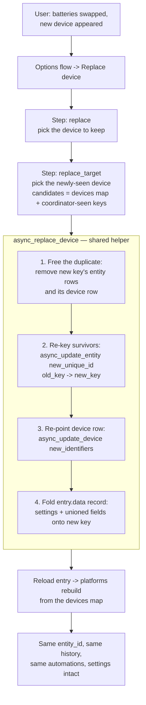
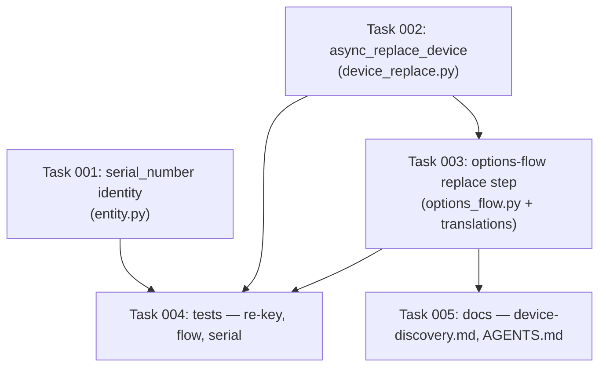

# Plan: Device ID Replacement (battery-swap identity recovery)

## Original Work Order

> Implement issue #126: a mechanism for dealing with changed rtl_433 device IDs.
> Devices whose transmitter id changes on battery swap currently appear as a
> brand-new HA device with new entities and lost history, because device_key
> (`<model>-<id>[-ch..][-st..]`) is baked into the device registry identifiers,
> every entity unique_id, the device display name, and the per-device config
> records in `entry.data[CONF_DEVICES]`. Wanted: surface the identity fields
> (id/channel/subtype) on the device pane for debugging, and add a "replace
> device" / click-to-adopt flow (modeled on the existing hub
> `_repoint_entry_unique_id` in `config_flow.py`) that re-points an existing
> device onto a newly discovered device_key so history, calibration, timeout
> overrides and automations are preserved.

Upstream issue: [#126 — feature: Add mechanism for dealing wtih changed IDs](https://github.com/rtl-433-hass/rtl_433/issues/126).
The reporter's Acurite 986 fridge/freezer sensor draws a new transmitter id on
every battery change; they want the temperature history of *the freezer* to
survive the swap. The issue thread converges on two asks: expose the identity
fields in the device pane ("good for debugging anyway"), and offer "this is a new
id for an existing device" as a pick-one adoption, explicitly noting that a
free-text editable id field is "only for nerds".

## Plan Clarifications

| Question | Answer |
|----------|--------|
| How should a device be re-pointed onto its new transmitter id — rewrite the registry rows in place, or keep an alias map that routes the new id onto a canonical key? | **In-place re-key.** Rewrite the device-registry row's `identifiers` and every entity `unique_id` from the old `device_key` to the new one, move the `entry.data[CONF_DEVICES]` record, and delete the duplicate device HA already created. The registry rows survive, so `entity_id` — and therefore recorder history — is preserved. |
| Where should the replace flow be launched from? | **The options flow only.** A new `replace` step alongside `hub` / `device` / `mappings`. No new repair detector, no new-device-notification action. |
| How should the identity fields (id / channel / subtype) be surfaced on the device pane? | **`DeviceInfo.serial_number`.** Home Assistant renders it natively on the device info card; the hub device already uses the same field for the dongle serial (`__init__.py:218`). No extra entities. |
| Is backwards compatibility required — may this bump `MINOR_VERSION`? | **Purely additive; no migration.** The `unique_id` template, the `identifiers` tuple, and the config-entry version ladder are all unchanged. Existing installs are untouched until a user deliberately runs a replace. |

## Executive Summary

Many cheap 433 MHz sensors roll a fresh random transmitter id whenever their
batteries are pulled. Because the integration derives `device_key` as
`<model-token>-<id>[-ch..][-st..]` and bakes that key into the device-registry
identifiers (`entity.py:182`), every entity `unique_id` (`entity.py:164`), the
device display name (`entity.py:78`), and the per-device record in
`entry.data[CONF_DEVICES]`, a battery change presents as a *different device*:
new entities, empty history, dead automations, and a stale original that simply
goes unavailable. There is no supported recovery today — the manual workaround is
to delete the old device and rename the new entities onto the freed entity ids,
which rescues `entity_id`-keyed automations but loses the long-run statistics the
reporter actually cares about, and silently drops device triggers, calibration,
and timeout overrides.

This plan adds a deliberate, user-driven **"Replace device"** step to the hub's
options flow: pick the device you still care about, pick the newly-seen device
that is really the same hardware, confirm, done. Under the hood a single shared
helper performs the re-key — it frees the duplicate's entity rows, rewrites each
surviving entity's `unique_id` onto the new `device_key`, re-points the device
registry row's `identifiers`, folds the stored per-device settings (calibration,
timeout override, motion clear delay, event types) onto the new key, and reloads
the entry so the platforms rebuild. Because the *registry rows themselves*
survive, the `entity_id` never changes and recorder history, statistics,
dashboards, and automations all carry straight through.

Crucially this stays inside the frozen HACS ↔ Core ABI. `COMPATIBILITY_CONTRACT.md`
freezes the *templates* — `f"{hub_entry_id}:{device_key}:{object_suffix}"` and
`(DOMAIN, f"{hub_entry_id}:{device_key}")` — not the particular `device_key` value
a given registry row happens to carry. A re-keyed row still matches the template
exactly, and the minimal core build, computing `device_key` from the new id it now
hears, resolves to the very same row. (An alias map would not have this property:
it would live only in the full build's `entry.data`, and core would happily create
a duplicate device for the new id — which is why it was rejected.) Alongside the
flow, `DeviceInfo.serial_number` starts carrying the decoded id (plus channel and
subtype when present), so the pane shows *which* transmitter a device is before
and after the swap.

## Context

### Current State vs Target State

| Current State | Target State | Why? |
|---------------|--------------|------|
| A battery swap yields a brand-new device: new registry row, new entities, empty history; the original goes permanently unavailable. | An options-flow **Replace device** step re-points the original device onto the new `device_key`, preserving entity ids, history, and statistics. | The core gap — issue #126. The hardware is the same freezer; the history must follow it. |
| The decoded `id` / `channel` / `subtype` appear only inside the device *name* (`entity.py:78`), and are lost the moment a user renames the device. | `DeviceInfo.serial_number` carries the identity suffix independently of the name, rendered natively on the device info card. | The reporter's second ask: the id must live in an id field, not in a name that renaming destroys. Also makes the replace step's candidate list verifiable at a glance. |
| Per-device settings (calibration, timeout override, motion clear delay, standardized event types) are keyed by `device_key` and are silently orphaned by a swap. | The replace helper folds the old record's settings onto the new key. | A user who calibrated a water meter should not have to redo it because a battery died. |
| The only recovery is manual: delete the old device, rename the new entities onto the freed entity ids. | Recovery is one options-flow step, with no entity renaming and no manual bookkeeping. | The manual path rescues `entity_id`-keyed automations only; device triggers, calibration and long-run statistics are still lost. |
| The hub can be re-pointed at a replacement radio (plan 20, `config_flow.py:73` `_repoint_entry_unique_id`); nested devices have no equivalent. | Nested devices gain the analogous, deliberately-scoped re-point path. | Symmetry with an already-shipped, already-tested pattern the maintainer chose as the model. |

### Background

Grounded in the current tree:

- `device_key` is computed by **`pyrtl_433.normalizer.device_key`** (not local
  code): model token, then `-<id>`, then `-ch<channel>`, then `-st<subtype>`, for
  whichever identity keys the event carries. `normalizer.py` retains only the
  `_safe_token` slug helper.
- Nested devices are **never explicitly registered**. Only the hub device is
  created via `async_get_or_create` (`__init__.py:173`); nested rows come into
  existence implicitly from each entity's `DeviceInfo` (`entity.py:181`). So the
  re-key must go through the device registry API directly, and the entry reload
  is what rebuilds the entities afterwards.
- `entry.data[CONF_DEVICES]` is the authoritative map used to recreate nested
  devices on startup; `async_upsert_device` (`entity.py:392`) merges into it and
  is union-only, never a clobber.
- The hub device already sets **`serial_number`** from the dongle's `dev_info`
  (`__init__.py:218`), so the field is established precedent in this codebase.
- Writing `entry.data` and reloading is the established way to rebuild platforms;
  `_async_update_listener` in `__init__.py` already reloads on the option changes
  that alter entity composition.
- **`COMPATIBILITY_CONTRACT.md` is FROZEN** over three surfaces: entity
  `unique_id` templates, device `identifiers` tuples, and the
  `VERSION`/`MINOR_VERSION` ladder. This plan changes none of them; it changes
  only which `device_key` *value* an existing row carries. `DeviceInfo` fields
  other than `identifiers` (name, model, manufacturer, `serial_number`) are **not**
  part of the contract.
- Tests run as **`uv run pytest tests/`** on Python 3.14 via `uv` (the system
  Python cannot import the test stack). Config-flow tests live in
  `tests/test_config_flow.py` / `tests/test_mut_config_flow.py`; the options flow
  is exercised from the same files.
- CI enforces a **mutation-testing floor** (`scripts/mutation_ratchet.py --mode
  floor`), so new logic needs tests that kill mutants, not just line coverage.
- Related but distinct, and deliberately **not** merged into this plan: plan 27
  ("union devices across receivers", issue #123) on the unmerged
  `claude/rtl433-device-dedup-ko9sbi` branch proposes a *location-scoped device
  identity*. That is a different feature (one device heard by two receivers) and
  is docs-only today. This plan is confined to a single hub and does not
  introduce an identity indirection layer, so the two remain composable.

## Architectural Approach

One shared re-key helper is the spine; the options-flow step is a thin two-form
wrapper around it. The helper is the only place that mutates registries, so the
destructive-feeling logic exists once and is tested once — mirroring how plan 20
funnelled reconfigure, discovery, and the repair fix flow through a single hub
rebind helper.

### A. Identity on the device pane (`serial_number`)
**Objective**: Make a device's transmitter identity visible and rename-proof, so a
user can tell which physical unit a row is — before a swap, to note the id, and
after one, to confirm the replace picked the right candidate.

Add a small helper beside `_device_display_name` in `entity.py` that recovers the
identity suffix from a `device_key` — the same `removeprefix(f"{_safe_token(model)}-")`
operation the display name already performs, returned raw rather than
concatenated onto the model. Feed it into the nested device's `DeviceInfo` as
`serial_number` (`entity.py:181`). For `Fineoffset-WH51-00c50f` the pane then
shows model `Fineoffset-WH51`, serial number `00c50f`; for a channel-bearing
device such as `Foo-5-ch3-st2` it shows `5-ch3-st2`, preserving the full
disambiguating tuple in one field.

Model-only devices (where the key *is* the model token, so there is no suffix)
get no `serial_number` rather than a misleading empty or duplicated value — the
same edge case `_device_display_name` already handles by returning the bare
model. This is presentation only: no new entities, no recorder rows, and nothing
in the frozen contract is touched.

### B. Shared re-key helper (`async_replace_device`)
**Objective**: Perform the identity transfer atomically enough that a failure
part-way cannot leave two half-devices, and centralize it for testing.

Lives in a new sibling module, `custom_components/rtl_433/device_replace.py`,
rather than alongside `async_upsert_device` in `entity.py` — that file is already
~640 lines, and a sibling module holding one specialized concern is the
established shape here (`migration.py`, `library.py` and `hub_settings.py` were
all split out of `__init__.py` the same way). It also keeps the helper's task
from colliding with the `entity.py` edit in component A, so the two can be built
in parallel. Signature takes `hass`, the hub `entry`, `old_key`, `new_key`; it
returns nothing and raises a typed error on a guard violation so the flow can
render a form error rather than a traceback.

Ordering is load-bearing, because the entity registry rejects a `unique_id`
collision:

1. **Free the duplicate.** Remove every entity registry row belonging to
   `new_key` (unique_id prefix `f"{entry.entry_id}:{new_key}:"`), then remove the
   `new_key` device row if one exists. These are the throwaway rows HA created
   when the re-batteried sensor first transmitted; they hold no history worth
   keeping.
2. **Re-key the survivors.** For each entity row whose unique_id starts with
   `f"{entry.entry_id}:{old_key}:"`, call `async_update_entity` with
   `new_unique_id` rebuilt as `f"{entry.entry_id}:{new_key}:{object_suffix}"` —
   the object suffix (everything after the second colon) is carried across
   untouched, so the template is honoured verbatim. The registry row, and hence
   the `entity_id` and every recorder row keyed to it, survives.
3. **Re-point the device row.** `async_update_device(new_identifiers={(DOMAIN,
   f"{entry.entry_id}:{new_key}")})`. A user-assigned `name_by_user` is a separate
   registry field and is preserved automatically; the generated `name` is
   recomputed on the next entity construction after the reload.
4. **Fold the stored record.** Move `entry.data[CONF_DEVICES][old_key]` onto
   `new_key`: carry the old record's `timeout_override`, `calibration`,
   `motion_clear_delay` and `event_types` (the user's deliberate settings), and
   union `fields` with anything the new device already observed, so a field the
   replacement has transmitted but the original never did is not dropped. Delete
   the old key. Write once via `async_update_entry`.

Then reload the entry so the platforms rebuild every entity from the updated
devices map, and the coordinator's runtime dicts (`devices`, `last_seen`,
`available`, `_discovered`) are rebuilt from scratch — which is why no separate
runtime-state transfer is needed.

Guards, each surfaced as a form error: `old_key` must exist in the devices map;
`new_key` must differ from `old_key`; `new_key` must not be the hub. A `new_key`
that is not yet in the devices map is explicitly **allowed** — see step C.

### C. Options-flow "Replace device" step
**Objective**: Two picks and a confirmation, with enough context on screen that
the user can tell the candidates apart.

Add `replace` to the `async_step_init` menu (`options_flow.py:97`), joining
`hub` / `device` / `mappings`. Following the existing `async_step_device`
precedent, the picker steps are deliberately picker-only so each form's defaults
can be derived from the previous choice:

- **`async_step_replace`** — pick the device to keep. Options are the
  `entry.data[CONF_DEVICES]` entries, labelled with model, key, and last-seen
  state so the stale one is obvious. Aborts with `no_devices` when the map is
  empty, matching `async_step_device`.
- **`async_step_replace_target`** — pick the new identity to adopt. Candidates are
  the union of the devices map and the coordinator's seen-device keys
  (`coordinator.devices`), minus the device chosen on the previous step. The
  coordinator source matters: the docs recommend disabling discovery in urban
  areas, and a user with discovery off never gets a registered row for the
  replacement — but the coordinator has still heard it, so it can still be
  offered. Labels carry model and key, and same-model candidates sort first,
  since a battery swap keeps the model.
- On submit, call the helper and finish. The step writes `entry.data` (not
  `entry.options`), so it ends with an explicit reload rather than
  `async_create_entry` — the calibration steps' `_write_device_record` is the
  local precedent for a device step that persists into `entry.data`.

Strings for both steps, the menu label, and the error/abort reasons go in
`translations/en.json`.

### D. Documentation
**Objective**: A user hitting this after a battery change must be able to find
the recovery without reading source.

`docs/device-discovery.md` already owns the device lifecycle (registration,
discovery toggle, deleting devices) and is the natural home: a **"Replacing a
device that changed id"** section covering why the id changes, the step-by-step
recovery, and what is preserved versus lost. The device pane's new serial number
is worth a sentence there too, since it is how a user identifies the candidate.
`AGENTS.md` gains a short note in the config-entry model section recording that
`device_key` is now re-pointable and that the helper is the single place allowed
to rewrite device identity.

## Risk Considerations and Mitigation Strategies

Technical Risks

- **Entity `unique_id` collision mid-re-key**: if the duplicate's rows are not
  fully removed before the survivors are rewritten, `async_update_entity` raises
  and the device is left half-migrated.
    - **Mitigation**: the helper's step order (free, then re-key) is the
      mitigation; a test asserts the two-device case where the new device already
      has a full set of entities, which is the common real-world state.
- **Misreading the frozen ABI**: an over-broad reading of
  `COMPATIBILITY_CONTRACT.md` would make any `device_key` change look breaking.
    - **Mitigation**: the contract freezes templates, not values; the re-key
      re-emits both templates verbatim. `tests/test_migration_roundtrip.py`
      guards the contract and must stay green untouched — if it fails, the design
      is wrong, not the test.
- **Recorder history is keyed on `entity_id`, not `unique_id`**: the whole
  premise fails if the registry row is recreated rather than updated.
    - **Mitigation**: `async_update_entity` mutates the existing row in place and
      leaves `entity_id` alone; a test asserts `entity_id` stability across the
      replace, which is the property the user actually cares about.
- **Replacing onto a coordinator-seen but unregistered key**: the devices map has
  no record to union against.
    - **Mitigation**: the fold treats a missing target record as an empty one, so
      the old record's settings and fields transfer wholesale.

Implementation Risks

- **Mutation-testing floor**: CI ratchets on killed mutants, so a lightly-tested
  helper full of guard branches can regress the floor even at full line coverage.
    - **Mitigation**: test each guard's rejection path and each fold branch
      explicitly, not just the happy path.
- **Scope creep toward auto-detection**: "click-to-adopt" invites a detector that
  guesses which stale device a new id belongs to.
    - **Mitigation**: explicitly out of scope per the clarifications — the user
      picks. The PRE_PLAN hook's YAGNI rule applies; a detector can be layered on
      the same helper later without rework.

Integration Risks

- **Overlap with plan 27 (union devices across receivers)**: that unmerged plan
  proposes a location-scoped device identity, which would touch the same key
  derivation.
    - **Mitigation**: this plan introduces no indirection layer and no change to
      how `device_key` is *derived* — only a supported way to move a row from one
      key to another. Plan 27 can adopt or replace that later on its own terms.
      The plan ids are also deliberately kept distinct (this is 28, not 27) so
      strikethroo's `grep -l "^id: N$"` plan lookup cannot match two directories.

## Success Criteria

### Primary Success Criteria

1. A nested device's pane shows the decoded identity suffix as its **serial
   number**, independent of the device name, and model-only devices show no
   serial number.
2. The hub options flow offers **Replace device**, which re-points a chosen
   device onto a chosen newly-seen `device_key` in two picks.
3. After a replace: every surviving entity keeps its **`entity_id`** (and
   therefore its recorder history), the device-registry row is the *same row* now
   carrying the new identifiers, the duplicate device and its entities are gone,
   and `entry.data[CONF_DEVICES]` holds one record under the new key with the old
   record's calibration, timeout override, motion clear delay and event types
   intact and its `fields` unioned.
4. `unique_id` and `identifiers` still match the `COMPATIBILITY_CONTRACT.md`
   templates byte-for-byte, `VERSION`/`MINOR_VERSION` are unchanged, and
   `tests/test_migration_roundtrip.py` passes unmodified.
5. `uv run pytest tests/` is green and the mutation ratchet floor
   (`uv run python scripts/mutation_ratchet.py --mode floor`) is not regressed.

## Self Validation

Execute after all tasks are complete:

1. Run `uv run pytest tests/` and confirm zero failures. Then run
   `uv run pytest tests/test_migration_roundtrip.py -v` specifically and confirm
   the ABI guard passes **without having been edited** —
   `git diff --stat origin/main -- tests/test_migration_roundtrip.py` must be
   empty.
2. Run `uv run python scripts/mutation_stats.py > /tmp/stats.json` followed by
   `uv run python scripts/mutation_ratchet.py --mode floor --stats /tmp/stats.json`
   and confirm it exits 0.
3. Write a throwaway script under the job's tmp dir that boots a
   `pytest-homeassistant-custom-component` hass instance with a hub entry whose
   `entry.data[CONF_DEVICES]` holds two devices — `Acurite-986-1a2b` (with a
   `timeout_override` and a calibration) and `Acurite-986-9f3c` — feeds one event
   for each through the coordinator, and prints, before and after invoking the
   replace step: every entity's `entity_id` + `unique_id`, the device rows'
   `identifiers`, and `entry.data[CONF_DEVICES]`. Confirm from the printed output
   that the `entity_id` values are unchanged, the `unique_id` values moved from
   `…:Acurite-986-1a2b:…` to `…:Acurite-986-9f3c:…`, exactly one device row
   remains, and the calibration and timeout override survived under the new key.
4. In the same script, assert the recorder-facing property directly: capture
   `entity_registry.async_get(entity_id).id` (the immutable registry row id)
   before and after the replace and confirm it is identical — that row id is what
   proves history continuity rather than a recreated row.
5. Grep the built entity metadata for the serial number: instantiate a nested
   entity for `Fineoffset-WH51-00c50f` and print `DeviceInfo["serial_number"]`,
   confirming `00c50f`; repeat for a model-only key and confirm the field is
   absent.
6. Run `uv run pytest tests/ -k "replace or serial"` and confirm the new tests are
   collected and pass, so the suite genuinely covers the new surfaces.

## Documentation

- `docs/device-discovery.md` — new **"Replacing a device that changed id"**
  section: why ids change on battery swap, the two-step options-flow recovery,
  what is preserved (entity ids, history, calibration, timeout override, motion
  clear delay, event types) and what is not (the duplicate device's own brief
  history). Plus a sentence on the device pane's new serial number.
- `custom_components/rtl_433/translations/en.json` — strings for the `replace`
  and `replace_target` steps, the menu entry, and the error/abort reasons.
- `AGENTS.md` — a note in the config-entry model section that `device_key` is
  re-pointable via the shared helper, and that the helper is the only sanctioned
  place to rewrite device identity.
- `COMPATIBILITY_CONTRACT.md` — **no change**; the templates are unchanged. Worth
  an explicit statement in the PR body so a reviewer does not have to re-derive
  it.

## Resource Requirements

### Development Skills

- Home Assistant config/options flow authoring (`voluptuous` schemas,
  `SelectSelector`, multi-step picker flows).
- Home Assistant device and entity registry APIs (`async_update_entity`,
  `async_update_device`, `async_remove`), and the `entity_id` / `unique_id` /
  registry-row-id distinction that underpins history continuity.
- `pytest` with `pytest-homeassistant-custom-component`, including mutation-aware
  test design against the CI ratchet.

### Technical Infrastructure

- `uv` (Python 3.14 toolchain) — the system Python cannot import the test stack.
- `mutmut` plus `scripts/mutation_ratchet.py` for the CI floor.
- No new runtime dependencies; `pyrtl_433` is untouched by this plan.

## Integration Strategy

Purely additive against the existing hub model. The options flow gains one menu
entry and two steps; `entity.py` gains one presentation helper and one registry
helper; no existing call site changes behaviour until a user runs a replace. The
frozen ABI surfaces are re-emitted verbatim, so the in-flight core build
(`CORE_UPSTREAM.md`, plan 26) needs no coordinated change — a core build reading a
re-keyed entry resolves the new id to the same registry row the full build left
behind.

## Notes

- Deliberately **out of scope**, and each layerable on the same helper later: an
  automatic "stale device + new id of the same model" detector or repair; a
  free-text editable id field (the reporter himself called this "only for
  nerds"); a device-page reconfigure entry point; and any cross-hub or
  cross-receiver identity unification (that is plan 27's territory).
- Plan id 28 was chosen over the 27 returned by `get-next-plan-id.cjs` because the
  unmerged `claude/rtl433-device-dedup-ko9sbi` branch already carries
  `.ai/strikethroo/plans/27--union-devices-across-receivers/`; two directories with
  `id: 27` would break the plan lookup documented in `STRIKETHROO.md`.
- The 14 files under `.ai/strikethroo/config/` are absent from `main` because the
  repo's unanchored `config/` gitignore rule swallows them (fixed on that same
  unmerged branch by commit `a75955e`). They were restored into this worktree so
  the workflow could run, and remain git-ignored here — this plan does not adopt
  that unrelated gitignore fix.

## Execution Blueprint

**Validation Gates:**
- Reference: `/config/hooks/POST_PHASE.md`

### Dependency Diagram

No circular dependencies: the graph is a DAG rooted at 001 and 002.

### ✅ Phase 1: Independent Foundations
**Parallel Tasks:**
- ✔️ Task 001: Surface the decoded identity as the nested device's serial number
- ✔️ Task 002: Shared in-place device re-key helper (`async_replace_device`)

These touch disjoint files (`entity.py` vs. the new `device_replace.py`), so they
are safely parallel.

### Phase 2: User-Facing Flow
**Parallel Tasks:**
- Task 003: Options-flow "Replace device" step and translations (depends on: 002)

### Phase 3: Verification and Documentation
**Parallel Tasks:**
- Task 004: Tests for the re-key helper, the replace flow, and the serial number (depends on: 001, 002, 003)
- Task 005: Document the replace flow and the device serial number (depends on: 003)

### Post-phase Actions

- **After Phase 1**: `uv run pytest tests/` green; `tests/test_migration_roundtrip.py`
  passing **unmodified** — if it fails, the re-key design violates the frozen ABI
  and execution must halt rather than edit the guard.
- **After Phase 2**: `uv run pytest tests/` green; `translations/en.json` parses
  (`python3 -c "import json; json.load(open('custom_components/rtl_433/translations/en.json'))"`).
- **After Phase 3**: full suite green plus the mutation floor
  (`uv run python scripts/mutation_stats.py > stats.json` then
  `uv run python scripts/mutation_ratchet.py --mode floor --stats stats.json`),
  followed by the plan's Self Validation steps.

### Execution Summary
- Total Phases: 3
- Total Tasks: 5
