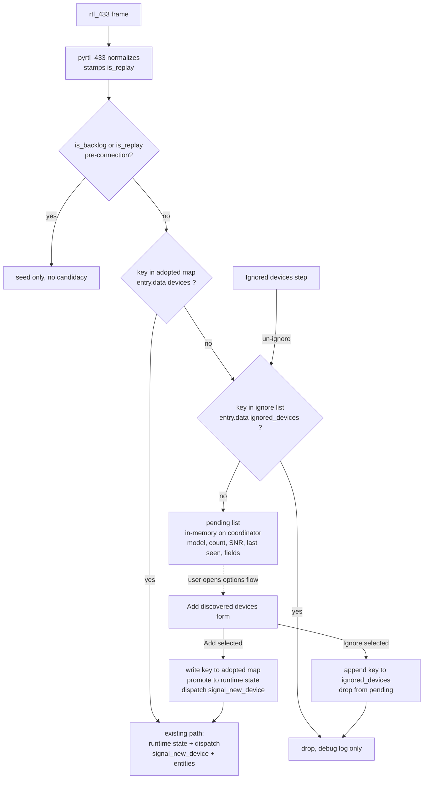
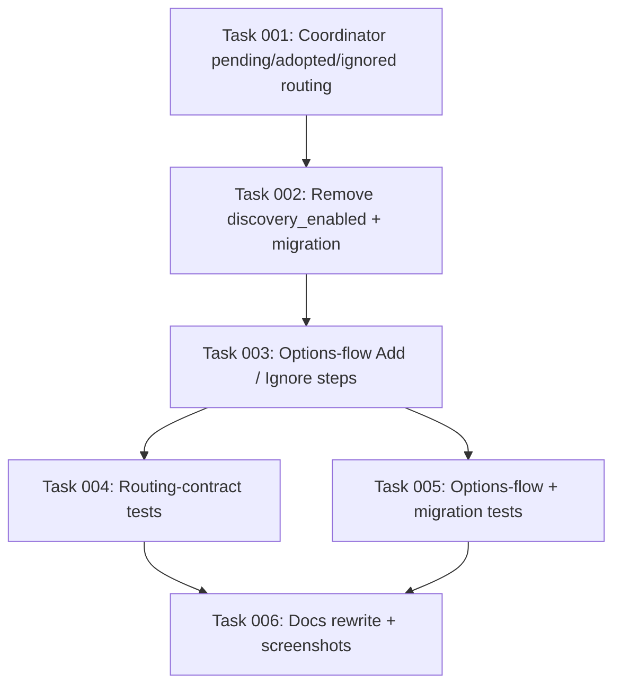

# Plan: Pending-Device Approval Flow

## Original Work Order

> Look at https://github.com/rtl-433-hass/rtl_433/issues/128 and
> https://github.com/rtl-433-hass/rtl_433/issues/131. What I'd like to do is
> adopt the same UI flow as Zigbee Home Automation (ZHA) in core. Users should
> enable discovery like how you enable pairing for ZHA, and then get a display of
> all discovered devices, just like ZHA. But instead of adding them
> automatically, a user should then click an "Add" button to add them in. If
> possible, we should reuse code from ZHA in core (I don't know if anything there
> is considered a public API or not).
>
> As a part of this, we should make sure to add both tests and docs updates with
> screenshots showing the new flow.

Amended mid-planning by the user:

> Actually, I want to amend this; instead of discovery being started, it should
> always run (but not automatically add devices). Then, if a user goes to the
> view of discovered devices, they can add them immediately. Discovered but not
> added devices can clear after a home assistant restart - they don't need to be
> persistent.

## Plan Clarifications

| Question | Answer |
| --- | --- |
| ZHA's add-device page is frontend-only (a hard-coded `zha` config panel plus the `zha/devices/permit` websocket command in `homeassistant/components/zha/websocket_api.py`). None of it is reachable from a custom integration. Which core primitive should host the "discovered devices → Add" view? | **An options-flow step.** `Settings → rtl_433 → Configure → Add discovered devices → checkbox list → Add`. Reuses the existing `entry.data["devices"]` adoption record; no device-registry migration; low BC risk. The config-subentry alternative (a native "Add device" button on the integration card) was rejected as too large a refactor for the benefit. |
| What becomes of the per-hub `discovery_enabled` toggle? | **Removed entirely.** Observation always runs and nothing is ever auto-added, so the toggle has no remaining meaning. The key is stripped from existing entries by a migration. This is a deliberate, user-approved behavioural BC break for anyone relying on auto-add. |
| What replaces the per-device persistent notification (issue #128)? | **Nothing.** No notification at all. The existing `INFO`/`DEBUG` log line is the only signal, per issue #128's literal suggestion. |
| Is issue #131's "seen N times" threshold in scope? | **No.** The pending list surfaces a sighting count and SNR so the user can judge weak decodes by eye; no configurable minimum-hits filter. |
| Is a persistent dismissal list in scope? | **Yes**, modelled on Home Assistant's *ignored discovered integrations*. The verb is **Ignore** / **Ignored**, never "reject". Ignored devices persist across restarts, never re-enter the pending list, and can be un-ignored from the UI. |
| Is backwards compatibility required? | **No** for the discovery behaviour itself — auto-add is removed for everyone, including existing installs. **Yes** for existing *adopted* devices: every device already in `entry.data["devices"]` must keep its device-registry entry, entities, entity IDs, and per-device settings untouched. |

## Executive Summary

Today every device the rtl_433 server decodes is registered in Home Assistant the
first time it is heard, and each one raises its own persistent notification. In a
non-urban location this produced 77 notifications in a single day (issue #128)
alongside a device registry full of neighbours' sensors and bad decodes that the
user never wanted (issue #131). The only defence is a per-hub discovery toggle
that is all-or-nothing: leave it on and accept everything, or turn it off and
receive nothing.

This plan inverts that default. Observation always runs, but observation and
*adoption* become separate steps. A device heard for the first time is recorded in
an in-memory **pending list** on the coordinator — no device-registry entry, no
entities, no notification. The user reviews the pending list at
`Settings → Devices & Services → rtl_433 → Configure → Add discovered devices`,
which renders each candidate with its model, device key, sighting count, signal
level, and most recent field values, and adds the selected ones with a single
submit. The same form carries an **Ignore** action for devices the user never
wants to see again; ignored keys persist in `entry.data` and are filtered out of
the pending list forever, with a separate step to un-ignore them — matching how
Home Assistant handles ignored discovered integrations.

The user's original request was to reuse ZHA's UI. Investigation established that
this is not possible: ZHA's add-device experience is a bespoke page in the
`home-assistant/frontend` repository, wired to a `zha`-specific config panel route
and the `zha/devices/permit` websocket command, and none of it is a public API a
custom integration can call or render. The reusable core primitives are the
options flow, `SelectSelector`, and the config-entry data/options stores. The
result is functionally the same two-step *observe-then-approve* model users know
from ZHA, delivered through the surfaces actually available to a custom component.

## Context

### Current State vs Target State

| Current State | Target State | Why? |
| --- | --- | --- |
| Every device heard post-connection is auto-registered as an HA device with entities | Heard devices enter an in-memory pending list; a device is registered only when the user explicitly adds it | Issue #131 — users receive neighbours' devices and bad decodes they never asked for |
| One persistent notification per newly discovered device | No notification; the existing log line is the only signal | Issue #128 — 77 notifications in a day is unusable and unactionable |
| Per-hub `discovery_enabled` boolean gates auto-add (on = accept everything, off = ignore everything) | Toggle removed from `const.py`, both config-flow steps, the options hub step, the coordinator, and diagnostics; stripped from existing entries by a migration | With nothing auto-added there is nothing left for the toggle to gate; keeping it would be a second, redundant discovery concept |
| No way to permanently dismiss an unwanted device — deleting it only lasts until it next transmits | Per-hub persistent **ignore list** in `entry.data`; ignored keys never enter the pending list and are un-ignorable from the options flow | Issue #131 — the user must be able to make a neighbour's sensor go away for good |
| Deleting a device re-arms discovery so it silently returns on its next transmission | Deleting drops the device back to *pending*; it returns only if the user adds it again | Deletion that silently undoes itself is the core complaint behind both issues |
| The coordinator's runtime state (`devices`, `last_seen`, `available`, `device_fields`) covers every heard device | That runtime state covers *adopted* devices only; pending candidates are held in a separate structure | Keeps every existing consumer (watchdog, diagnostics, entity platforms) operating on exactly the set it operates on today |

### Background

- **`discovery_enabled` is load-bearing across the codebase.** It appears in
  roughly 140 places across `custom_components/rtl_433/` and `tests/`
  (`const.py`, `config_flow.py` user + reconfigure steps, `options_flow.py` hub
  step, `hub_settings.py`, `coordinator/base.py`, `coordinator/_events.py`,
  `diagnostics.py`, `__init__.py`, `translations/en.json`, and a dozen test
  modules). Its removal is the single largest mechanical component of this work.
- **The adoption record already exists.** `entry.data[CONF_DEVICES]` is the
  restart-safe "ever-adopted" map, already consulted by `__init__.py` to decide
  whether a device is genuinely new. It becomes the authoritative adopted set;
  no new persistence layer is required for adoption.
- **The registration path is already a callback seam.** `_maybe_register_device`
  in `coordinator/_events.py` calls `new_device_callback`, which dispatches
  `signal_new_device` for the entity platforms to build the device at runtime
  (the `dynamic-devices` Quality Scale rule). Adoption from the options flow
  reuses that exact seam rather than inventing a second registration path.
- **Replay classification must be preserved.** `pyrtl_433` stamps `is_replay` and
  the coordinator re-derives `is_backlog` from the connect-edge anchor. Both
  gates exist so a reconnect re-broadcast is not mistaken for a live first
  sighting. Under the new model a backlog frame must not create a *pending* entry
  either, or every reconnect would repopulate the list with stale candidates.
- **The config entry is at `VERSION = 2`, `MINOR_VERSION = 7`**, with an
  established minor-version-bump migration pattern in `migration.py`.
- **The screenshot harness is real and driveable.** `tests/integration/` runs
  rtl_433 against recorded RF captures behind a Node WebSocket bridge and
  captures documentation screenshots with Playwright (`./run-harness.sh full`,
  `screenshot.mjs`). Under the new behaviour, replayed captures naturally produce
  a populated pending list, so the new screenshots are capturable without
  synthesising fake state.
- **Mutation testing is ratcheted in CI** (`mutmut`, `scripts/mutation_ratchet.py`,
  `scripts/mutation_baseline.json`). Adding and removing code shifts per-module
  mutation scores, so the ratchet must be re-run rather than assumed.

## Architectural Approach

The change decomposes into one behavioural core (splitting observation from
adoption in the coordinator), one persistence addition (the ignore list), one UI
surface (three options-flow steps), one subtraction (the toggle and the
notification), and the test/docs work that proves it.

### Coordinator: separate observation from adoption

**Objective**: make "heard" and "adopted" independent states, so nothing reaches
the device registry without an explicit user action, while every existing
consumer of coordinator runtime state keeps seeing exactly the set it sees today.

`Rtl433Coordinator` gains an `adopted` set (seeded at construction from
`entry.data[CONF_DEVICES]`), an `ignored` set (seeded from the new
`entry.data[CONF_IGNORED_DEVICES]`), and a `pending` mapping of device key to a
small pending-candidate record holding the latest `NormalizedEvent`, the sighting
count, first/last-seen timestamps, and the signal level drawn from the event's
existing fields.

`_on_client_event` gains an early branch. A frame whose key is not in `adopted`
is routed to the pending recorder and returns immediately — it does **not** touch
`devices`, `last_seen`, `available`, `seen_fields`, or `device_fields`, and does
not `_dispatch`. This isolation is deliberate: it means the availability
watchdog, diagnostics, and the entity platforms need no changes at all, because
the state they read continues to describe adopted devices only. Frames for
adopted keys follow today's path unchanged.

The existing `is_backlog` / `is_replay` gates are preserved and applied *before*
pending candidacy, so a reconnect replay neither adopts nor re-populates the
pending list. `new_device_callback` keeps its current role for adopted devices
(so a restart's first live frame still wires up entities) and loses its
notification responsibility entirely.

Adoption is a new coordinator method that promotes a pending record into runtime
state — moving the stored `NormalizedEvent` into `devices`, seeding `last_seen` /
`available` / `device_fields`, adding the key to `adopted` and `_discovered`,
removing it from `pending` — and then invokes the same `new_device_callback`
seam so the entity platforms build the device exactly as they do for a live
first sighting. Ignoring a device simply drops it from `pending` and adds it to
`ignored`.

Because the pending list lives only in coordinator memory, it is empty after a
restart or reload by construction — no eviction logic, no persistence, no TTL.

### Persistent ignore list

**Objective**: let a user make an unwanted device permanently invisible, with the
same semantics and vocabulary as Home Assistant's ignored discovered integrations.

A new `CONF_IGNORED_DEVICES` key in `const.py` stores a list of device keys under
`entry.data`. It is written by the options flow and read by the coordinator. Like
the availability timeout, a change is applied live through the existing update
listener rather than forcing a reload, so ignoring a device takes effect on its
next transmission without tearing down the WebSocket.

Un-ignoring removes the key from the list; the device re-enters the pending list
the next time it transmits (not retroactively, since pending state is in-memory
and the device was never recorded while ignored).

### Options-flow surface

**Objective**: deliver the observe-then-approve experience through the options
flow, the only surface a custom integration controls that can render a rich,
multi-select device list.

The `async_step_init` menu gains two entries alongside the existing `hub`,
`device`, and `mappings` steps:

- **`add_devices`** — the primary view. Renders one row per pending device with a
  label built from model, device key, sighting count, signal level, relative
  last-seen, and a short summary of the latest field values, so the user can tell
  a real sensor from a one-off bad decode without leaving the form. Two optional
  multi-select fields drive the two actions: *Add* adopts the selected keys,
  *Ignore* adds them to the ignore list. Both are applied on submit. When the
  pending list is empty the step reports that no devices are waiting rather than
  rendering an empty form.
- **`ignored_devices`** — lists the currently ignored keys and un-ignores the
  selected ones. Hidden or reporting "none" when the list is empty.

Both steps read the live coordinator through `hass.data[DOMAIN][entry.entry_id]`
and degrade gracefully when the hub is not loaded. All user-visible strings go in
`translations/en.json` under `options.step`, following the existing structure.

### Removals

**Objective**: delete the two mechanisms the new model replaces, rather than
leaving them as dead or contradictory settings.

`CONF_DISCOVERY_ENABLED` is removed from `const.py`, both `config_flow.py` steps
(user and reconfigure), the `options_flow.py` hub step, `hub_settings.py`,
`coordinator/base.py`, `coordinator/_events.py`, `diagnostics.py`, `__init__.py`
(including its branch in the update listener), and `translations/en.json`. A
minor-version migration bumps `MINOR_VERSION` to 8 and strips the key from both
`entry.data` and `entry.options` on existing entries so no stale value survives.

The `persistent_notification.async_create` call in `__init__.py`'s
`new_device_callback` is deleted along with its now-inapplicable docstring
paragraphs. Dismissing notifications *already* raised on existing installations is
an explicit non-goal — they are user-dismissible and enumerating them would
require private `persistent_notification` internals.

`async_remove_config_entry_device` keeps evicting runtime state but its comments
and behaviour change meaning: a deleted device's next transmission makes it a
pending candidate again rather than silently recreating it.

### Tests

**Objective**: prove the behavioural contract — that nothing is auto-added, that
the two lists route correctly, and that adoption produces exactly the device the
old auto-add path produced.

Coverage targets the custom logic this plan introduces, not the framework: the
coordinator's routing decision across the adopted / ignored / pending / replay /
backlog matrix; the options-flow add, ignore, and un-ignore round trip including
the empty-list cases; the migration stripping the toggle while preserving adopted
devices and their settings; the absence of any persistent notification on first
sighting; and the delete-then-retransmit path landing in pending rather than the
device registry. Existing modules that assert auto-add behaviour or set
`discovery_enabled` are updated to the new contract.

### Documentation and screenshots

**Objective**: make the new flow discoverable, and show it rather than describe it.

`docs/device-discovery.md` is rewritten around observe-then-approve: what the
pending list is, that it clears on restart, how to add, how to ignore and
un-ignore, and that deleting a device returns it to pending. The "Discovery
Toggle" section is removed. New screenshots are captured with the existing
`tests/integration/` Playwright harness: the options menu showing the new entries,
the populated "Add discovered devices" form, and the ignored-devices step.
Existing screenshots that show the removed toggle (the hub-settings shot) are
recaptured. `AGENTS.md` guardrails and `docs/diagnostics.md` are updated wherever
they reference the toggle or auto-add.

## Risk Considerations and Mitigation Strategies

Technical Risks

- **Pending devices leaking into adopted-only runtime state**: if a pending
  device's frame still wrote `devices` / `last_seen` / `available`, the
  availability watchdog would emit unavailability for devices that do not exist
  in HA, and diagnostics would report them as real.
  - **Mitigation**: route pending frames through a dedicated recorder that
    returns before any shared-state mutation, and assert in tests that a pending
    device appears in none of `devices`, `last_seen`, `available`, or
    `device_fields`.
- **Adoption producing a different device than auto-add produced**: the options
  flow runs outside the event-callback context, so an adopted device could end up
  with missing seeded fields or entities.
  - **Mitigation**: adoption promotes the stored `NormalizedEvent` into the same
    runtime state the live path writes and reuses the identical
    `new_device_callback` / `signal_new_device` seam. A test adopts a device and
    asserts the resulting registry entry and entity set match those produced by
    the pre-change auto-add path.
- **Replay/backlog frames repopulating the pending list on every reconnect**:
  would restore exactly the noise problem the plan removes.
  - **Mitigation**: apply the existing `is_backlog` / `is_replay` gates before
    pending candidacy, with explicit tests for both.
- **Mutation-score regression breaking CI**: removing a branch-heavy toggle and
  adding new conditional routing shifts per-module scores against the ratchet
  floor in `scripts/mutation_baseline.json`.
  - **Mitigation**: run `mutmut` over the touched modules and the ratchet script
    as part of validation; treat surviving mutants in the new routing logic as a
    test gap to close, not a floor to lower.

Implementation Risks

- **Breadth of the `discovery_enabled` removal (~140 references)**: an
  incompletely removed key leaves a form field that silently does nothing, or a
  test that passes for the wrong reason.
  - **Mitigation**: treat the removal as its own task, and gate it on a
    repository-wide search for both the constant and the raw
    `"discovery_enabled"` string returning no hits outside the migration that
    strips it.
- **Options-flow multi-select ergonomics with many pending devices**: the
  reporter saw 77 devices in a day; a flat checkbox list of that size is hard to
  use.
  - **Mitigation**: sort the list most-recently-seen first and put the
    discriminating signal (sighting count, signal level, latest values) in each
    label. A cap or paging is explicitly out of scope for this plan.
- **User confusion during the behaviour change**: after upgrading, devices stop
  appearing and no notification explains why.
  - **Mitigation**: this is the user's chosen trade-off (no notification). The
    documentation rewrite is the mitigation, and the release note must state the
    behaviour change plainly.

Integration Risks

- **Existing adopted devices must survive untouched**: a regression here would
  orphan entities and break automations for every current user.
  - **Mitigation**: the migration only strips a key; it never rewrites
    `entry.data[CONF_DEVICES]`. A round-trip migration test asserts adopted
    devices, their per-device overrides, calibrations, and entity IDs are
    unchanged.
- **Screenshot harness drift**: the harness must produce a populated pending list
  for the new screenshots, which depends on the replayed captures being treated as
  live rather than backlog.
  - **Mitigation**: capture the screenshots by actually running the harness and
    inspect the rendered form; do not hand-author or mock the images.

## Success Criteria

### Primary Success Criteria

1. With a hub connected and devices transmitting, no device is added to the
   Home Assistant device registry and no persistent notification is raised until
   the user explicitly adds it.
2. `Settings → Devices & Services → rtl_433 → Configure → Add discovered devices`
   lists every non-ignored, non-adopted device heard since the last restart, each
   showing model, device key, sighting count, signal level, and last-seen; adding
   a selection creates exactly those devices with the same entities the previous
   auto-add path created.
3. Ignoring a device removes it from the pending list, persists across a restart,
   prevents it from re-entering the list on subsequent transmissions, and can be
   undone from the ignored-devices step.
4. `discovery_enabled` no longer exists anywhere in the integration or its tests,
   and existing config entries are migrated with the key stripped and every
   already-adopted device, override, and calibration preserved.
5. Deleting an adopted device returns it to the pending list on its next
   transmission instead of silently recreating it.
6. `uv run pytest tests/` passes, and the mutation ratchet does not regress.
7. `docs/device-discovery.md` describes the new flow and carries newly captured
   screenshots of the options menu, the populated add form, and the ignored list.

## Self Validation

Execute after all tasks are complete:

1. Run `uv run pytest tests/` and confirm zero failures; run
   `uv run pytest --cov=custom_components/rtl_433 tests/` and confirm the new
   coordinator-routing and options-flow modules are covered.
2. Run `grep -rn "discovery_enabled\|CONF_DISCOVERY_ENABLED" custom_components/ tests/ docs/ AGENTS.md`
   and confirm the only hits are inside the migration that strips the key and its
   test.
3. Run `uv run mutmut run "custom_components.rtl_433.coordinator.*"` and
   `"custom_components.rtl_433.options_flow.*"`, then
   `uv run python scripts/mutation_stats.py > /tmp/stats.json` and
   `uv run python scripts/mutation_ratchet.py --mode floor --stats /tmp/stats.json`;
   confirm the ratchet passes.
4. Start the container harness with `cd tests/integration && ./run-harness.sh full`.
   With RF captures replaying, open Home Assistant and confirm
   `Settings → Devices & Services → rtl_433` shows **no** nested RF devices and
   the notification drawer is empty.
5. Drive the options flow in that live instance with Playwright: open
   `Configure`, screenshot the menu showing "Add discovered devices", open that
   step, and screenshot the populated pending list. Confirm the labels carry
   model, sighting count, and signal level.
6. In the same session, select two devices to add and one to ignore, submit, and
   confirm via the HA UI that exactly the two selected devices now exist as
   devices with entities, and that the ignored device is absent from the pending
   list on re-entry. Screenshot the resulting device list.
7. Open the ignored-devices step, screenshot it, un-ignore the device, and confirm
   it reappears in the pending list after its next transmission.
8. Restart the Home Assistant container and confirm the pending list is empty
   while the two added devices and the ignore list both persist.
9. Confirm the captured PNGs are written under `docs/images/` and render in the
   built docs (`mkdocs build --strict`).

## Documentation

- **`docs/device-discovery.md`** — rewritten around observe-then-approve; the
  "Discovery Toggle" section removed; new sections for the pending list, adding,
  ignoring, un-ignoring, restart behaviour, and deletion returning a device to
  pending. New screenshots embedded.
- **`docs/images/`** — new screenshots of the options menu, the populated add
  form, and the ignored-devices step; recapture of the hub-settings shot that
  currently shows the removed toggle.
- **`docs/diagnostics.md`** — update if it references `discovery_enabled` in the
  diagnostics payload.
- **`AGENTS.md`** — update the guardrails and architecture notes that describe the
  discovery toggle, the auto-add path, and the new-device notification.
- **`CHANGELOG.md`** — handled by release-please from conventional commits; the
  commit for the behaviour change must make the BC break explicit.

## Resource Requirements

### Development Skills

- Home Assistant custom-integration internals: config entries, options flows,
  selectors, the device/entity registries, dispatcher signals, and minor-version
  migrations.
- Python async, and the existing coordinator/mixin architecture.
- `pytest` with `pytest-homeassistant-custom-component`.
- Playwright/Node for the containerised screenshot harness.
- MkDocs Material for the documentation build.

### Technical Infrastructure

- `uv` for the test environment (`uv run pytest tests/`).
- `mutmut` and `scripts/mutation_ratchet.py` for the mutation gate.
- Docker Compose plus the recorded RF captures under `tests/integration/` for the
  end-to-end harness and screenshots.

## Integration Strategy

The change lands as a single feature branch off `main`. Adoption deliberately
reuses the existing `new_device_callback` / `signal_new_device` seam rather than
adding a parallel registration path, so the entity platforms, availability
watchdog, device triggers, and diagnostics are untouched by the core behavioural
change. Persistence reuses `entry.data`, so no new store is introduced and the
existing migration machinery covers the upgrade.

## Notes

- **On reusing ZHA**: the user asked whether ZHA's code could be reused. It cannot.
  ZHA's device-add experience lives in `home-assistant/frontend` as a
  `zha`-specific config panel, driven by the `zha/devices/permit` websocket
  command registered in `homeassistant/components/zha/websocket_api.py`. Neither
  the panel route nor the command is available to a custom integration, and
  neither is a documented public API. What this plan reuses from core instead is
  the supported custom-integration surface: `OptionsFlow`, `SelectSelector`, the
  config-entry data store, and the migration pattern — plus ZHA's *interaction
  model*, which is the part the user actually wanted.
- The user-facing verb is **Ignore** / **Ignored** throughout code, translations,
  and documentation, matching Home Assistant's ignored-discovery vocabulary.
  "Reject" must not appear.
- The pending list is in-memory by explicit decision; do not add persistence,
  a TTL, or an eviction policy.

## Execution Blueprint

**Validation Gates:**
- Reference: `/config/hooks/POST_PHASE.md`

The chain 001 → 002 → 003 is deliberately serial: all three edit the same core
files (`const.py`, `coordinator/`, `__init__.py`, `options_flow.py`), so
overlapping them would produce conflicting edits rather than useful parallelism.
Parallelism is taken where it is real — the two test tasks touch disjoint test
modules and depend only on the finished implementation.

### ✅ Phase 1: Coordinator Core
**Parallel Tasks:**
- ✔️ Task 001: Split observation from adoption in the coordinator — pending/adopted/ignored routing, the adopt/ignore API, notification removal, and delete-returns-to-pending

### ✅ Phase 2: Retire the Discovery Toggle
**Parallel Tasks:**
- ✔️ Task 002: Remove `discovery_enabled` integration-wide and strip it from existing entries with a `MINOR_VERSION = 8` migration (depends on: 001)

### ✅ Phase 3: Approval UI
**Parallel Tasks:**
- ✔️ Task 003: Add the "Add discovered devices" and "Ignored devices" options-flow steps, their translations, and live ignore-list updates (depends on: 002)

### Phase 4: Verification
**Parallel Tasks:**
- Task 004: Test the observation/adoption routing contract (depends on: 003)
- Task 005: Test the add/ignore options flow and the toggle-stripping migration (depends on: 003)

### Phase 5: Documentation
**Parallel Tasks:**
- Task 006: Rewrite the discovery docs, capture screenshots of the new flow from the container harness, and update `AGENTS.md` (depends on: 004, 005)

### Post-phase Actions

Each phase ends with `uv run ruff check custom_components/ tests/`,
`uv run ruff format --check custom_components/ tests/`, `uv run pytest tests/`,
and a conventional-commit commit describing the phase.

### Execution Summary
- Total Phases: 5
- Total Tasks: 6
