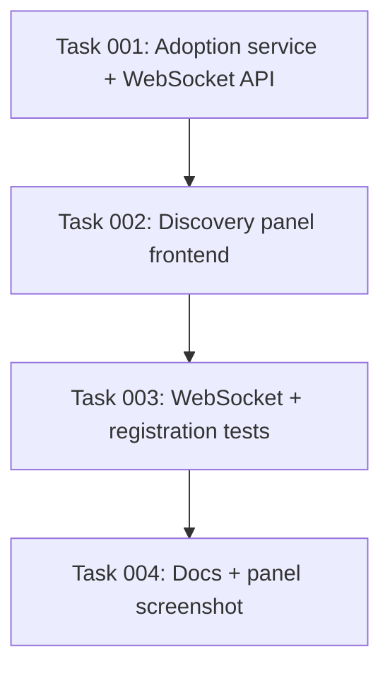

# Plan: WebSocket API and Discovery Panel

## Original Work Order

> also, are we able to ship frontend components with our integration? Would that
> allow us to more closely mirror what ZHA does?

> Yes, let's do this. We're already at 22K LOC changed in this PR. If it's that
> complex, we may as well go all the way (and I can rebase / simplify later). Do
> the websocket commands and the frontend components.

## Plan Clarifications

| Question | Answer |
| --- | --- |
| Can a custom integration ship frontend code at all? | **Yes**, and core integrations already do. `knx`, `lcn`, `dynalite`, and `insteon` each register a custom panel with `panel_custom.async_register_panel` plus `hass.http.async_register_static_paths`, and register their own `websocket_api` commands. Verified against the installed Home Assistant 2026.8. |
| Can the panel hang off the integration card rather than only the sidebar? | **Yes.** `panel_custom.async_register_panel` accepts `config_panel_domain`, which `dynalite` and `insteon` pass their own domain to. This is the piece an earlier answer in this session got wrong by claiming only a sidebar entry was reachable. |
| Is a JS build pipeline required? | **No, and we are not adding one.** `knx` and `dynalite` ship pre-built bundles as PyPI packages because they are large SPAs. This panel is one table, so it ships as a hand-written vanilla ES-module web component inside the integration directory, which HACS already distributes. No npm, no rollup, no second release pipeline. |
| Does the options-flow approval UI stay? | **Yes**, but the duplication is removed at the logic layer, not by deleting a surface. Both surfaces become thin presentation over one shared adoption service, so there is exactly one implementation of add / ignore / un-ignore. The options flow remains the universally available path (the panel is admin-only and depends on a JS module loading); the panel becomes the richer one. |
| Was the "22K LOC" figure in the work order correct? | **No** — corrected before starting. That number included a `site/` build-output directory accidentally committed and since removed from history. The branch is ~4,700 insertions across 63 files. The user's instruction was reaffirmed against the smaller number by proceeding. |

## Executive Summary

The approval flow shipped in plan 29 works, but its surface is a config-flow
form: a frozen snapshot rendered once, with every candidate listed twice (once
under Add, once under Ignore) because a form has no per-row actions. For the
reporter in issue #128 with 77 devices, that is a 154-row form that is already
stale by the time it renders.

This plan adds the two pieces that let the integration present the same data the
way ZHA presents it. First, a **WebSocket API** — `rtl_433/devices/pending`,
`.../add`, `.../ignore`, `.../unignore`, and a subscription that pushes changes —
which is the direct analogue of ZHA's `zha/devices/permit` and is independently
useful for scripting and diagnostics. Second, a **custom panel**: a vanilla
ES-module web component registered with `panel_custom.async_register_panel` and
served from the integration directory, rendering a live table with per-row Add
and Ignore buttons, sortable by signal or sighting count.

Both surfaces sit on one shared adoption service extracted from the existing
options flow, so there is a single implementation of what it means to adopt or
ignore a device, and the options flow keeps working unchanged for anyone the
panel does not reach.

## Context

### Current State vs Target State

| Current State | Target State | Why? |
| --- | --- | --- |
| Adding devices is only possible through a config-flow form | A live panel with per-row Add / Ignore, plus the existing form | A form cannot show per-row actions or update as devices transmit |
| Every candidate is rendered twice, once per multi-select | One row per candidate, two buttons on it | 77 devices currently means a 154-row form |
| The list is a snapshot; a device heard after the form renders is invisible until reopened | The panel subscribes and updates as candidates appear | The pending list changes continuously by design |
| Adopt / ignore / un-ignore logic lives inside `Rtl433OptionsFlow` methods | The same logic lives in a shared `adoption.py` service that both the options flow and the WebSocket commands call | Two surfaces must not mean two implementations |
| No programmatic access to the pending list | Five WebSocket commands, admin-gated | Scriptable, testable independently of any UI, and the panel's data source |
| No frontend assets in the integration | `custom_components/rtl_433/frontend/` shipped and served as a static path | The panel has to come from somewhere; HACS ships the integration directory as-is |

### Background

- **Verified core precedent** (Home Assistant 2026.8, read from the installed
  package): `homeassistant/components/dynalite/panel.py` registers WebSocket
  commands, calls `hass.http.async_register_static_paths([StaticPathConfig(...)])`,
  then `panel_custom.async_register_panel(hass=..., frontend_url_path=DOMAIN,
  config_panel_domain=DOMAIN, webcomponent_name=..., module_url=...,
  embed_iframe=True, require_admin=True)`. `knx/websocket.py` does the same with
  ~25 commands.
- **ZHA remains unreusable.** Its add-device page is still a hard-coded route in
  the frontend repository. What this plan reproduces is the *interaction model*
  and now also the *placement* (via `config_panel_domain`), using the supported
  panel API rather than ZHA's code.
- **`embed_iframe=False` is the right choice here**, unlike `knx`/`dynalite`.
  Those embed large SPAs with their own routing. A non-iframe panel gets `hass`,
  `narrow`, `route`, and `panel` set directly as properties on the custom
  element, and inherits Home Assistant's theme CSS custom properties — which is
  what lets a hand-written component look native without importing anything.
- **Home Assistant frontend internals are not a public API.** The `hass` object
  and the `ha-*` components are not versioned for third parties. The mitigation
  is to depend on as little of it as possible: `hass.connection.sendMessagePromise`,
  `hass.localize` where useful, and CSS custom properties for theming. No `ha-*`
  component imports, no internal module imports.
- **`async_setup` does not currently exist** in `__init__.py`; the integration is
  entry-only. Panel and command registration happen once per Home Assistant run,
  not once per entry, so they need a guard (`async_panel_exists`, as dynalite
  does) or an `async_setup`.
- The existing logic to extract lives in `options_flow.py`:
  `_apply_add_and_ignore` (adopt loop + `async_upsert_device` + ignore-list
  write) and the submit branch of `async_step_ignored_devices`.

## Architectural Approach

```mermaid
flowchart TD
    C[Rtl433Coordinator<br/>pending / adopted / ignored] --> S[adoption.py<br/>shared service]
    S --> OF[options_flow.py<br/>add_devices / ignored_devices]
    S --> WS[websocket_api.py<br/>5 commands + subscribe]
    C -. SIGNAL_PENDING_UPDATE .-> WS
    WS <-. hass.connection .-> P[frontend/rtl_433-panel.js<br/>vanilla ES module]
    P --> UI[Live table<br/>per-row Add / Ignore]
    REG[__init__.py<br/>static path + panel_custom] --> P
```

### Shared adoption service

**Objective**: one implementation of adopt / ignore / un-ignore, called by both
surfaces.

A new `adoption.py` exposes `async_adopt_devices`, `async_ignore_devices`, and
`async_unignore_devices`, each taking `(hass, entry, coordinator, device_keys)`
and returning what was actually applied — a key that is no longer pending must be
reported as skipped, not silently dropped, because the WebSocket caller needs to
tell the user. The bodies move verbatim in behaviour from `options_flow.py`; the
options flow becomes a caller. No behaviour changes, and the plan-29 tests must
continue to pass untouched, which is the check that the extraction was faithful.

### WebSocket API

**Objective**: expose the pending list and the three actions, and push changes.

`websocket_api.py` registers, all `@websocket_api.require_admin`:

- `rtl_433/hubs` — the loaded hubs, so the panel can address one.
- `rtl_433/devices/pending` — candidates for a hub: key, model, sighting count,
  signal level, first/last seen (ISO), and the latest field values.
- `rtl_433/devices/add` / `.../ignore` / `.../unignore` — take `entry_id` and
  `device_keys`, return applied and skipped keys.
- `rtl_433/devices/subscribe` — a subscription that pushes the pending list when
  it changes.

A new `SIGNAL_PENDING_UPDATE` dispatcher signal backs the subscription. It must
**not** fire a message per RF frame: membership changes (a new candidate, an
adopt, an ignore) push immediately, while repeat-sighting updates to an existing
candidate are coalesced behind a short throttle. A busy receiver in an urban area
is exactly the case that must not flood a WebSocket connection.

### Frontend panel

**Objective**: the ZHA-style page — a live table with per-row actions.

`frontend/rtl_433-panel.js` defines one custom element, `<rtl-433-panel>`, in
plain ES-module JavaScript with no imports and no build step. It receives `hass`
as a property, calls the commands above, subscribes for updates, and renders a
table with one row per candidate carrying model, key, sighting count, signal
level, last seen, latest values, and **Add** / **Ignore** buttons, plus a view of
ignored devices with **Un-ignore**. Sorting by last-seen, sighting count, or
signal level is a column click. Styling uses Home Assistant's theme custom
properties (`--primary-text-color`, `--card-background-color`, and friends) so it
follows the user's theme, including dark mode.

Registration happens once per run in `__init__.py`, guarded so a second hub entry
does not re-register: a static path at `/rtl_433_panel` serving the directory,
then `panel_custom.async_register_panel` with `config_panel_domain=DOMAIN` so the
panel is reachable from the integration card, `require_admin=True`, and
`embed_iframe=False`. `manifest.json` gains the `http`, `websocket_api`, and
`panel_custom` dependencies.

### Tests and documentation

**Objective**: cover the new API and prove the panel loads; show it.

WebSocket coverage drives `hass_ws_client` end to end — list, add, ignore,
un-ignore, the subscription firing on a membership change and not firing per
frame, admin gating, and unknown/unloaded `entry_id` handling. Registration
coverage asserts the panel and static path exist once after two entries are set
up. The plan-29 options-flow tests must pass unmodified. Documentation gets a
panel section and a screenshot captured from the container harness.

## Risk Considerations and Mitigation Strategies

<details>
<summary>Technical Risks</summary>

- **Frontend internals shift under us**: `hass` and the `ha-*` components are not
  a public API, so a Home Assistant release can break the panel.
  - **Mitigation**: depend on the smallest possible surface — `hass.connection`
    for messaging and CSS custom properties for theme — and import no `ha-*`
    components or internal modules. A broken panel then degrades to a broken
    *page*, while the options flow keeps working.
- **Subscription flooding**: a busy receiver decodes constantly; a naive
  per-frame push would saturate the WebSocket.
  - **Mitigation**: push on membership change, coalesce repeat sightings behind a
    throttle, and test that N frames for one existing candidate do not produce N
    messages.
- **Double registration with multiple hubs**: panel and static-path registration
  are per-run, not per-entry.
  - **Mitigation**: guard with `async_panel_exists` as dynalite does, and test
    with two entries.
</details>

<details>
<summary>Implementation Risks</summary>

- **The extraction silently changes behaviour**: moving adopt/ignore out of the
  options flow could alter what gets written.
  - **Mitigation**: the plan-29 options-flow and migration tests must pass
    **unmodified**. Any test change during the extraction task is a signal the
    behaviour moved and must be justified in the report.
- **Scope**: this is a second large feature on an already-large branch.
  - **Mitigation**: the user explicitly chose this, against a corrected diff
    figure, and intends to rebase/simplify later. Each phase commits separately
    so pieces can be dropped independently.
- **No JS test infrastructure exists** in the repository.
  - **Mitigation**: do not invent one. The panel is covered by the Python
    registration test and by a real screenshot from the container harness; the
    logic worth testing lives in the WebSocket layer, which is Python.
</details>

## Success Criteria

### Primary Success Criteria

1. Five WebSocket commands work end to end against a running hub, are
   admin-gated, and handle an unknown or unloaded `entry_id` without raising.
2. The subscription pushes on a membership change and does **not** push once per
   RF frame for an already-known candidate.
3. The panel appears from the integration card, lists pending devices live, and
   its per-row Add / Ignore / Un-ignore buttons work against a real hub.
4. Adopting from the panel produces exactly the device adopting from the options
   flow produces.
5. Every plan-29 options-flow, migration, and routing test passes **unmodified**.
6. `uv run pytest tests/` passes; ruff clean; `mkdocs build --strict` succeeds.
7. No npm, rollup, or second release pipeline is introduced.

## Self Validation

1. `uv run pytest tests/` exits 0; confirm the plan-29 test files are unchanged
   in `git diff` for the extraction commit.
2. `grep -rn "ha-\|import " custom_components/rtl_433/frontend/*.js` — confirm the
   panel imports nothing and uses no `ha-*` component.
3. Start the container harness (`cd tests/integration && ./run-harness.sh full`).
   In the running instance, open Settings → Devices & Services → rtl_433 and
   confirm the panel is reachable from the integration card.
4. In the panel, confirm the table lists the harness's devices with live sighting
   counts, and that leaving it open while captures replay makes a newly heard
   device appear without a reload.
5. Click Add on one device and Ignore on another; confirm via the HA UI that
   exactly the added device exists with entities, and that the ignored one is
   gone from the table. Screenshot the panel in this state.
6. Open the ignored view, Un-ignore, and confirm the device returns after its
   next transmission.
7. Exercise the API directly over the WebSocket (`rtl_433/devices/pending`) and
   confirm the payload matches what the panel renders.
8. Confirm the panel renders correctly in both light and dark themes.

## Documentation

- `docs/device-discovery.md` — a panel section, presented as the primary way to
  add devices, with the options flow as the alternative. Screenshot.
- `docs/websocket-api.md` — document the five commands; the file already exists.
- `AGENTS.md` — the shared adoption service, the WebSocket layer, the panel and
  its registration guard, and the no-build-step constraint.

## Resource Requirements

### Development Skills

- Home Assistant `websocket_api`, `panel_custom`, `http` static paths, and
  dispatcher signals.
- Vanilla web components: custom elements, shadow DOM, ES modules — no framework.
- `pytest` with `hass_ws_client`.
- Playwright for the harness screenshot.

### Technical Infrastructure

- No new runtime dependencies and no JS toolchain.
- The existing `uv` test environment and container harness.

## Notes

- The panel is **additive**. The options-flow steps from plan 29 stay, and both
  call the same service.
- Do not add a build step, an npm package, or a separate frontend repository. If
  the panel outgrows a single hand-written file, that is a decision to revisit
  deliberately, not to drift into.
- The user-facing verb remains **Ignore** / **Ignored**.

## Execution Blueprint

**Validation Gates:**
- Reference: `/config/hooks/POST_PHASE.md`



Fully serial by necessity: the panel is written against the API contract, the
tests assert both, and the screenshot must show test-verified behaviour. There is
no honest parallelism to take here.

### ✅ Phase 1: API Foundation
**Parallel Tasks:**
- ✔️ Task 001: Extract the adoption service and add the WebSocket API

### ✅ Phase 2: Panel
**Parallel Tasks:**
- ✔️ Task 002: Ship the discovery panel (depends on: 001)

### ✅ Phase 3: Verification
**Parallel Tasks:**
- ✔️ Task 003: Test the WebSocket API and panel registration (depends on: 002)

### ✅ Phase 4: Documentation
**Parallel Tasks:**
- ✔️ Task 004: Document the panel and the WebSocket API, with a screenshot (depends on: 003)

### Post-phase Actions

Each phase ends with ruff check + format, `uv run pytest tests/`, and a
conventional-commit commit.

### Execution Summary
- Total Phases: 4
- Total Tasks: 4
