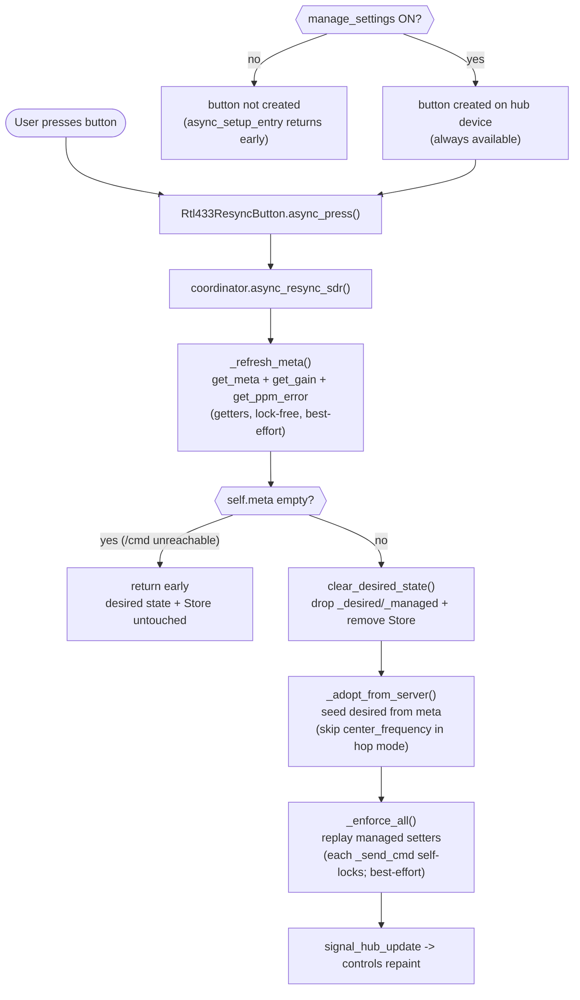
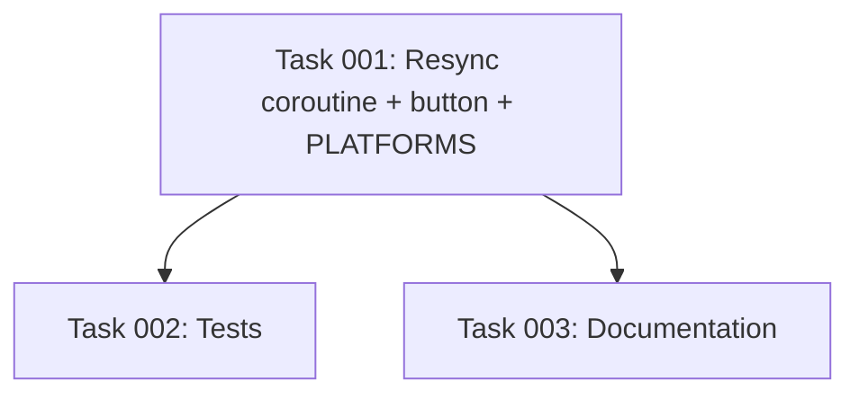

# Plan: One-Click "Re-sync SDR settings from server" Hub Button

## Original Work Order

> When the integration manages the rtl_433 receiver's SDR settings, Home Assistant becomes the authority and re-applies its stored desired state on every reconnect, overriding direct edits to the rtl_433 config file. The only documented way to make Home Assistant re-adopt the server's current settings is an awkward three-step dance: turn 'Manage settings' off, restart rtl_433, then turn it back on. Add a one-click control (a button entity on the hub) that re-syncs/re-adopts the rtl_433 server's current SDR settings into Home Assistant's managed desired state, replacing the dance.

## Plan Clarifications

| Question | Assumption / Decision |
|---|---|
| Button entity vs. service vs. options-flow action? | **Button entity.** It is UI-discoverable, needs no YAML, and fits the existing hub-control pattern (`number`/`select`/`switch` all subclass `Rtl433HubControl`). A service is the alternative but is YAGNI: a single button is the minimal viable surface for the requested one-click action. |
| Which `EntityCategory`? | `EntityCategory.CONFIG`, matching the existing managed controls (`Rtl433HubControl._attr_entity_category`, `entity.py:276`). The button changes managed configuration state, so CONFIG is the consistent category. |
| Localization via `translations/en.json` or `_attr_name`? | **`_attr_name` set directly in Python**, mirroring the existing controls which source their names from `SdrSetting.name` rather than translation keys (`sdr_settings.py:246-338`; `Rtl433HubControl.__init__` at `entity.py:288`). No `translations/en.json` change is required. |
| Behavior when management is off? | The button entity is **not created** (the platform's `async_setup_entry` returns early when `coordinator.manage_settings` is `False`, exactly like `number.py:79`, `select.py:85`, `switch.py:87`). |
| Behavior when `/cmd`/meta is unreachable on press? | The press is **best-effort and never raises** into Home Assistant: the coroutine composes existing methods that already swallow `/cmd` errors (`_refresh_meta` `base.py:457`, `_adopt_from_server`'s empty-meta guard `base.py:625`, `_enforce_all`'s per-send `_send_cmd` swallow `base.py:560`). With **refresh-first** ordering, an empty-meta result (`/cmd` never reachable) short-circuits *before* the Store is cleared, so the prior desired state is left **intact** — there is no data-loss window. _(Revised — see "Resync ordering" below.)_ |
| Hop-mode handling? | Unchanged. Re-adoption reuses `_adopt_from_server`, which already **skips `center_frequency` when `len(frequencies) > 1`** (`base.py:627-631`), so a re-sync never pins a hopping receiver. |
| Should the press churn the config entry / trigger a reload? | No. Re-sync only rewrites the per-hub desired-state `Store` (`base.py:225-227`), never `entry.options`, so it does not reload the entry — consistent with the deliberate Store-not-options design (`AGENTS.md:233-241`). |
| **Resync ordering — clear-first or refresh-first?** | **Refresh-first, guard on empty meta.** `async_resync_sdr()` runs `_refresh_meta()` **first**; if `self.meta` is still empty (`/cmd` unreachable and never previously fetched) it **returns early without clearing**, leaving the existing desired state and Store intact. Only when meta is present does it `clear_desired_state()` → `_adopt_from_server()` → `_enforce_all()`. This eliminates the "data-loss surprise" the original clear-first ordering carried (clearing the Store before a fetch that might fail) and is strictly safer than the documented dance, while producing the identical end-state when `/cmd` is reachable. |
| **Button `available` semantics?** | **Always available** — the button defines **no `available` override** and inherits the default `True`. This is genuinely consistent with the existing controls: `Rtl433HubControl.available` returns `self._setting.available(meta)` (`entity.py:298`) and `SdrSetting.available` defaults to `_always` → `True` (`sdr_settings.py:170`), so the managed controls are effectively always-available too. The earlier framing ("button mirrors the controls' reachability gate / hides when meta empty") was inaccurate and is dropped; the refresh-first guard makes a press during an outage a safe no-op, so no availability gate is needed. |
| **Serialization / locking of the resync?** | **Per-call `_cmd_lock` only — no outer lock.** Each `/cmd` self-serializes through `_cmd_lock` as it does today (`_send_cmd` `base.py:553`); the resync adds **no** surrounding `async with self._cmd_lock`. Home Assistant runs a single event loop, so the steps interleave with the connect loop's adopt/enforce only at `await` boundaries, and `_enforce_all` is idempotent — the worst case is a redundant, convergent re-enforce. (Factual correction: `_refresh_meta` issues **getters via `_fetch_cmd`**, which does **not** take `_cmd_lock` (`base.py:420-440`); only `_enforce_all`'s `_send_cmd` calls take the lock. The original plan's claim that `_refresh_meta` takes the command lock was wrong.) |

## Executive Summary

When a hub has "Manage rtl_433 settings from Home Assistant" enabled, Home Assistant adopts the server's SDR settings once (on first connect) and thereafter replays its stored *desired* state on every reconnect, overriding any direct edits to the rtl_433 config file. Today the only way to make Home Assistant re-adopt the server's *current* settings is a three-step dance: toggle management off (which wipes the desired-state Store), restart rtl_433, then toggle management back on so the next connect re-adopts from scratch. This plan replaces that dance with a single button.

The approach adds a new `button` platform (`button.py`) that statically registers exactly one hub button entity — "Re-sync SDR settings from server" — created only when `manage_settings` is on, and (like the existing managed controls) always available. Pressing it calls a new public coordinator coroutine (`async_resync_sdr()`) that performs the adopt sequence in-process in a **refresh-first** order: re-fetch the server's meta, and only if meta is present, clear the current desired state, re-adopt from the server, and re-enforce. If `/cmd` is unreachable so meta is empty, it returns early **before clearing** — leaving the existing desired state intact (no data-loss window). It composes already-tested methods (`_refresh_meta`, `clear_desired_state`, `_adopt_from_server`, `_enforce_all`) into one safe public operation rather than introducing new SDR logic. No outer lock is added: each `/cmd` self-serializes through the existing `_cmd_lock` per call (`_send_cmd` `base.py:553`), and `_enforce_all` is idempotent, so a redundant interleave with the connect loop merely re-enforces the same state.

The key benefit is a discoverable, one-click re-sync with no YAML, no entry reload, and no rtl_433 restart, while preserving every existing safety property: hop-mode center-frequency guarding, `/cmd`-down best-effort behavior, and per-call serialized command issuance. `Platform.BUTTON` is added to `PLATFORMS` so the new platform is forwarded alongside the others.

## Context

### Current State vs Target State

| Current State | Target State | Why? |
|---|---|---|
| Re-adopting the server's current SDR settings requires the documented off → restart rtl_433 → on dance (`README.md:240-248`, `AGENTS.md:255-259`). | A single hub button, "Re-sync SDR settings from server", re-adopts on one press. | The dance is awkward, slow (requires an rtl_433 restart), and easy to get wrong; a one-click control is the requested UX. |
| `PLATFORMS` does not include `Platform.BUTTON` (`const.py:22-29`). | `PLATFORMS` includes `Platform.BUTTON`. | The new button platform must be forwarded for the hub entry like the other control platforms. |
| The coordinator exposes `clear_desired_state()`, `_adopt_from_server()`, `_refresh_meta()`, `_enforce_all()` as separate (mostly private) steps; no single public re-adopt operation exists (`base.py:457,612,654,689`). | A new public `async_resync_sdr()` coroutine composes those steps (refresh-first, guard on empty meta) into one safe, best-effort operation. | The button needs one public entry point. Per-call `_cmd_lock` already prevents `/cmd` requests from interleaving; the only added concern is multi-step convergence with the connect loop, which idempotent re-enforce handles — so no outer lock is introduced. |
| AGENTS.md and README state there is **deliberately no** re-adopt button/service (`AGENTS.md:255-260`, `README.md:240-248`). | Both documents describe the new button as the supported re-sync path and remove the "dance is the only way" framing. | The documented design constraint is being intentionally reversed; the docs must change in lockstep (`AGENTS.md:260` explicitly requires this). |

### Background

- Managed-SDR state lives in two coordinator fields persisted to a per-hub `Store` keyed by `entry_id`: `_desired` (registry key → desired value) and `_managed` (the subset HA actively manages) (`base.py:222-227`).
- The connect loop adopts on first connect only when `_desired` is empty, then enforces on every (re)connect, wrapped so a failure never kills the loop (`base.py:333-344`).
- **Setter** `/cmd` issuance is serialized through `self._cmd_lock` (`base.py:224`, acquired inside `_send_cmd` at `base.py:553`), so two setter requests can never interleave. **Getter** `/cmd` calls go through `_fetch_cmd` (`base.py:420-440`), which does **not** take the lock; `_refresh_meta` is therefore lock-free. `_cmd_lock` is a non-reentrant `asyncio.Lock`.
- `_adopt_from_server()` (`base.py:612`) seeds desired state from `self.meta`, skips `center_frequency` in hop mode (`base.py:627-631`), and seeds the gain pair explicitly (`base.py:639-650`); it persists via `_persist_desired()` and never raises on empty meta.
- `clear_desired_state()` (`base.py:689`) drops `_desired`/`_managed` and removes the Store.
- The existing hub controls (`number.py`, `select.py`, `switch.py`) all subclass `Rtl433HubControl` / `Rtl433HubEntity` (`entity.py:218-298`), set `_attr_name` directly, use `EntityCategory.CONFIG`, attach to the hub device, repaint on `signal_hub_update`, and gate their `async_setup_entry` on `coordinator.manage_settings` (`number.py:79`, `select.py:85`, `switch.py:87`).
- Tests for this surface live in `tests/test_sdr_controls.py`, with a managed-hub `coordinator` fixture (`tests/test_sdr_controls.py:110-121`), `_META_SINGLE`/`_META_HOPPING` meta fixtures (`:60-71`), `_mock_setters` (`:89-107`), and an autouse `_no_socket` patch (`:344-352`). Store assertions use the `hass_storage` fixture and `sdr_store_key` (`:299-338`).

## Architectural Approach

The implementation has three small components: a new coordinator public coroutine, a new button platform, and the `PLATFORMS` registration. No new SDR command logic is introduced — the button is a thin UI entry point over a composition of existing, individually tested coordinator methods.

### Component 1: Coordinator `async_resync_sdr()` coroutine

**Objective**: Provide one safe, best-effort public operation that re-adopts the server's current SDR settings into the managed desired state, so the button has a single entry point — without wiping HA's managed state when the server is unreachable.

The coroutine composes the existing methods in a **refresh-first** order. It re-fetches meta first and **only proceeds to clear/adopt/enforce when meta is present**; an empty-meta result short-circuits before any state is destroyed. Because `clear_desired_state()` removes the Store and resets `_desired`/`_managed`, and `_adopt_from_server()` re-persists via `_persist_desired()`, the net effect when `/cmd` is reachable is the Store ends up re-seeded from the server's current meta — exactly the end-state the toggle dance produces, without the restart. When `/cmd` is unreachable, the operation is a no-op and the prior state survives.

Ordering and rationale:

1. `_refresh_meta()` — pull the server's current `get_meta` / `get_gain` / `get_ppm_error` into `self.meta` (best-effort; getters swallow their own errors and never raise).
2. **Empty-meta guard** — if `self.meta` is still empty (`/cmd` unreachable and not previously fetched), `return` immediately. The Store and `_desired`/`_managed` are left untouched, so a press during an outage never destroys HA's managed state. _(See clarification: "Resync ordering".)_
3. `clear_desired_state()` — drop the stale desired state and the Store so the subsequent adopt starts from the documented empty-state semantics.
4. `_adopt_from_server()` — seed `_desired`/`_managed` from the refreshed meta (hop-mode guard intact; persists via `_persist_desired()`).
5. `_enforce_all()` — replay the newly adopted managed fields so the server reflects the adopted desired state (gain emitted once; each send best-effort).

Locking: **no outer lock is added.** Getters (`_refresh_meta` → `_fetch_cmd`, `base.py:420-440`) do not take `_cmd_lock`; only the setter sends in `_enforce_all` (`_send_cmd`, `base.py:553`) do, and they self-serialize per call exactly as the connect loop's enforcement does today. Wrapping the coroutine in `async with self._cmd_lock` would **deadlock** at the first `_send_cmd` because `_cmd_lock` is a non-reentrant `asyncio.Lock` (`base.py:224`). Because Home Assistant runs a single event loop, the only interleaving is at `await` boundaries against the connect loop's adopt/enforce; the worst case is a redundant `_enforce_all`, which is idempotent (it replays the same managed fields, `base.py:654`) and converges to the same state. This matches the existing per-call serialization pattern and is the minimal, YAGNI-aligned choice.

The body is structured so a failure can never propagate as an unhandled error from a button press; the press is best-effort exactly like adoption/enforcement on connect (`base.py:338-343`).

### Component 2: `button.py` platform

**Objective**: Expose the re-sync action as a single hub button entity, gated and styled consistently with the existing managed controls.

- A new module `custom_components/rtl_433/button.py` defines `Rtl433ResyncButton` subclassing `Rtl433HubEntity` (it is not a per-`SdrSetting` control, so it subclasses the hub-entity base directly rather than `Rtl433HubControl`) and Home Assistant's `ButtonEntity`.
- `_attr_name = "Re-sync SDR settings from server"` (set directly, mirroring the controls). `_attr_entity_category = EntityCategory.CONFIG`. `_attr_unique_id = f"{hub_entry_id}:hub:resync_sdr"`, following the existing `f"{hub_entry_id}:hub:{suffix}"` convention (`entity.py:287`).
- **No `available` override**: the button inherits the default `available = True`, consistent with the existing managed controls. (`Rtl433HubControl.available` returns `self._setting.available(meta)` (`entity.py:298`), and `SdrSetting.available` defaults to `_always` → `True` (`sdr_settings.py:170`), so the controls are effectively always-available too — there is no meta/reachability gate to mirror.) Because the press is best-effort and the refresh-first guard makes an outage press a no-op, an availability gate is unnecessary. It still repaints on `signal_hub_update` via the inherited `Rtl433HubEntity` subscription (`entity.py:238-256`).
- `async_press()` awaits `coordinator.async_resync_sdr()`.
- `async_setup_entry` resolves the coordinator from `hass.data[DOMAIN][entry.entry_id]`, returns early when `not coordinator.manage_settings`, and otherwise adds exactly one `Rtl433ResyncButton` — the same shape as `number.py`/`select.py`/`switch.py` `async_setup_entry` (`number.py:72-85`).

### Component 3: `PLATFORMS` registration

**Objective**: Forward the new platform for the hub entry alongside the others.

Add `Platform.BUTTON` to the `PLATFORMS` list in `const.py:22-29`. The hub entry forwards `PLATFORMS` once in `async_setup_entry` (`__init__.py:228`) and unloads them in `async_unload_entry` (`__init__.py:283`); adding the platform is sufficient for both setup and teardown.

## Risk Considerations and Mitigation Strategies

Technical Risks

- **Re-entrant `_cmd_lock` deadlock.** `_cmd_lock` is a non-reentrant `asyncio.Lock` (`base.py:224`) and `_send_cmd` acquires it (`base.py:553`); `_enforce_all` issues `_send_cmd` calls, so wrapping the coroutine in an outer `async with self._cmd_lock` would deadlock at the first send. (`_refresh_meta` is lock-free — it uses `_fetch_cmd`, `base.py:420-440` — so it is not part of the hazard.)
    - **Mitigation**: Add **no** outer lock. The setter sends in `_enforce_all` self-serialize per call as they do today; the getter (`_refresh_meta`) and the desired-state mutations (`clear`/`adopt`) need no command lock.
- **Race with the connect loop's enforcement.** A press during a reconnect could interleave adopt/enforce with the loop's adopt/enforce.
    - **Mitigation**: Per-call `_cmd_lock` serialization guarantees no two `/cmd` requests interleave; the worst case is a redundant enforce, which is idempotent (enforcement is designed to replay the same managed fields on every connect, `base.py:654`).
- **`/cmd` unreachable on press.** A press when the server is down would otherwise raise into the UI.
    - **Mitigation**: Compose only methods that already swallow `/cmd` errors; the press is best-effort and never raises. The refresh-first empty-meta guard turns an outage press into a no-op. The button is **always available** (it is not gated on meta), consistent with the existing controls.

Implementation Risks

- **Data-loss surprise on press.** A clear-first ordering would wipe the Store before re-fetching; if the meta fetch then failed, the prior managed state would be gone with nothing re-adopted.
    - **Mitigation**: Resolved by design. `async_resync_sdr()` is **refresh-first**: it re-fetches meta and **returns early if meta is empty, before `clear_desired_state()`**, so a press during a `/cmd` outage leaves the prior desired state and Store intact. The destructive clear/adopt runs only when the server's settings were actually retrieved — strictly safer than the dance.
- **Button created on the wrong (device) entry.** PLATFORMS is forwarded once on the hub entry; the per-device entries are nested devices under it.
    - **Mitigation**: Follow the existing control platforms exactly — resolve the coordinator from `hass.data[DOMAIN][entry.entry_id]` and gate on `manage_settings`; the helper pattern already only runs for the hub entry that owns the coordinator.

Documentation Risks

- **Docs claim no re-adopt action exists.** `AGENTS.md:255-260` and `README.md:240-248` state the absence is "by design" and require lockstep updates.
    - **Mitigation**: Update both documents as part of this work (see Documentation), replacing the "only way is the dance" framing with the button as the supported re-sync path.

## Success Criteria

### Primary Success Criteria

1. With `manage_settings` on and `/cmd` reachable, a single hub button entity named "Re-sync SDR settings from server" exists on the hub device (`EntityCategory.CONFIG`, unique_id ending `:hub:resync_sdr`).
2. Pressing the button (with `/cmd` reachable) re-fetches meta first, then **clears and re-seeds the per-hub desired-state Store from the server's current meta**: after a press against a known meta, `get_desired(...)`/`is_managed(...)` reflect the server's adopted values and the Store payload matches.
3. In hop mode (more than one configured frequency), a press does **not** adopt `center_frequency` (it stays unmanaged), preserving the existing hop guard.
4. When `manage_settings` is off, the button entity is **not created**.
5. When `/cmd`/meta is unreachable (meta empty), a press never raises and is a **no-op that leaves the prior desired state and Store intact** (refresh-first guard; no data loss). The button itself is **always available** — it is not gated on meta or connectivity.
6. `Platform.BUTTON` is present in `PLATFORMS` and the button is forwarded on hub setup and removed on unload.

## Self Validation

After all tasks are complete, an LLM should verify the implementation as follows:

1. Run the SDR-controls test suite to confirm existing behavior is intact and new assertions pass:
   `python -m pytest tests/test_sdr_controls.py -q` (from the repo root, in the project's test environment).
2. Press-reseeds-from-server (refresh-first): using the managed-hub `coordinator` fixture and `hass_storage`, seed a stale desired state and persist it (so `sdr_store_key(entry.entry_id)` exists in `hass_storage` with the stale values), register `_META_SINGLE` getters via `aioclient_mock`, set `coordinator.connected = True`, then drive `coordinator.async_resync_sdr()`. Because the coroutine refreshes meta first and meta is non-empty, it clears and re-adopts. Assert: `coordinator.get_desired("center_frequency") == 433920000` (the server value, not the stale one), `coordinator.is_managed(KEY_GAIN_AUTO)` is correct for the meta, and the Store payload under `sdr_store_key(entry.entry_id)` now holds the re-adopted values.
3. Hop-mode guard: drive `async_resync_sdr()` with `_META_HOPPING` getters registered and assert `coordinator.get_desired("center_frequency") is None` and `not coordinator.is_managed("center_frequency")`, while other fields are managed.
4. `/cmd`-down no-op (no data loss): seed a stale desired state and persist it, ensure `coordinator.meta` is empty (do not pre-populate it), register all getters as HTTP 500, then drive `async_resync_sdr()`. Assert it does not raise, `coordinator.meta` is still empty, the empty-meta guard returned **before** clearing so `get_desired(...)`/`is_managed(...)` and the Store payload are **unchanged** (still the seeded stale values), and **no setter `/cmd` was issued**.
5. Button gating (integration): with the `_no_socket` autouse patch, set up a hub entry with `manage_settings=True` and assert exactly one button entity with unique_id ending `:hub:resync_sdr` is registered on the hub device; set up another with `manage_settings=False` and assert no such button entity exists.
6. Always-available: confirm the button defines **no `available` override** and that `button.available` is `True` both when `coordinator.meta` is populated and when it is empty (consistent with the existing controls, which are effectively always-available).
7. Confirm `Platform.BUTTON` appears in `const.PLATFORMS` and that `button.py` exists with an `async_setup_entry` that returns early when `not coordinator.manage_settings`.

## Documentation

This plan **requires documentation updates** (answering the POST_PLAN question):

- **`README.md` (`:240-248`)**: Replace the "Re-syncing from the rtl_433 config (the only way)" section. Remove the "deliberately no re-adopt button or service" framing and the three-step dance as the only path; document the new "Re-sync SDR settings from server" hub button as the supported one-click re-sync. Note that it only re-adopts when the server's `/cmd` is reachable (a press while `/cmd` is unreachable is a safe no-op that leaves the current settings untouched — no data loss), that it is always shown (not hidden), and that in hop mode the center frequency stays unmanaged.
- **`AGENTS.md` (`:255-260`)**: Update the "HA is the authority; no re-adopt action — by design" bullet to reflect that a re-adopt **button** now exists (`button.py`, coordinator `async_resync_sdr()`), describe its composition (**refresh meta → guard on empty meta → clear → adopt → enforce**, no outer `_cmd_lock`), its gating (`manage_settings` on; always available), and that it does not churn the config entry. Add `Platform.BUTTON` to any platform inventory in AGENTS.md if one is listed.
- No `translations/en.json` change is required: the button name is set via `_attr_name` directly, consistent with the existing controls.

## Resource Requirements

### Development Skills
- Home Assistant custom-integration development: entity platforms (`ButtonEntity`), `EntityCategory`, hub-device entity attachment, dispatcher-driven repaint.
- Familiarity with this integration's coordinator/desired-state/Store model and `_cmd_lock` serialization.
- pytest with `pytest-homeassistant-custom-component` fixtures (`hass`, `aioclient_mock`, `hass_storage`).

### Technical Infrastructure
- Existing code: `custom_components/rtl_433/coordinator/base.py`, `entity.py`, `const.py`, `number.py`/`select.py`/`switch.py` (patterns), `tests/test_sdr_controls.py`.
- Home Assistant's `homeassistant.components.button.ButtonEntity` and `homeassistant.const.Platform.BUTTON`.

## Notes

- Scope is deliberately minimal (YAGNI): one button, one new coordinator coroutine, one `PLATFORMS` entry, plus doc updates. No service, no extra options, no new configuration keys.
- The button intentionally subclasses `Rtl433HubEntity` (not `Rtl433HubControl`), because it is a hub-level action rather than a per-`SdrSetting` control; it still reuses the hub-device attachment, the `signal_hub_update` repaint subscription, and the `:hub:` unique_id convention.

### Refinement Change Log

- 2026-05-27 (refine-plan): Pressure-tested the plan against `base.py` / `entity.py` / `sdr_settings.py` and resolved three issues with the user:
  - **Resync ordering → refresh-first.** Reordered `async_resync_sdr()` to `_refresh_meta()` → guard-on-empty-meta → `clear_desired_state()` → `_adopt_from_server()` → `_enforce_all()`. The original clear-first ordering wiped the Store before a fetch that could fail (the "data-loss surprise"); refresh-first short-circuits before clearing when `/cmd` is unreachable, so prior state survives. Updated exec summary, mermaid, Component 1, risks, Success Criteria #2/#5, and Self Validation #2/#4.
  - **Button availability → always available.** Corrected the inaccurate claim that the button "mirrors the controls' reachability gate." The controls use `SdrSetting.available` which defaults to `True` (`sdr_settings.py:170`), so they are effectively always-available; the button now defines no `available` override. Updated Component 2, risks, Success Criterion #5, Self Validation #6, and the doc bullets.
  - **Locking → per-call `_cmd_lock` only.** Removed the internal contradiction ("under `self._cmd_lock`" vs. "do not wrap"). Corrected the factual error that `_refresh_meta` takes the command lock — it uses `_fetch_cmd`, which is lock-free (`base.py:420-440`); only `_enforce_all`'s `_send_cmd` calls take the non-reentrant lock. No outer lock is added; idempotent re-enforce handles interleaving with the connect loop. Updated exec summary, Background, Component 1, and the Current/Target table.

## Execution Blueprint

**Validation Gates:**
- Reference: `.ai/task-manager/config/hooks/POST_PHASE.md`

### Dependency Diagram

### ✅ Phase 1: Implementation
**Parallel Tasks:**
- ✔️ Task 001: Implement `async_resync_sdr()` + `button.py` + `Platform.BUTTON`

### ✅ Phase 2: Verification & Docs
**Parallel Tasks:**
- ✔️ Task 002: Tests for the resync button + coroutine (depends on: 001)
- ✔️ Task 003: Document the resync button — README + AGENTS.md (depends on: 001)

### Execution Summary
- Total Phases: 2
- Total Tasks: 3

## Execution Summary

**Status**: ✅ Completed Successfully
**Completed Date**: 2026-05-28

### Results
- Added `async_resync_sdr()` to the coordinator (refresh-first: `_refresh_meta()` → empty-meta guard returns before clearing → `clear_desired_state()` → `_adopt_from_server()` → `_enforce_all()`; no outer `_cmd_lock`).
- Added `custom_components/rtl_433/button.py` (`Rtl433ResyncButton`, hub-attached, `EntityCategory.CONFIG`, unique_id `:hub:resync_sdr`, no `available` override, created only when `manage_settings` is on) and `Platform.BUTTON` to `PLATFORMS`.
- Added 6 tests (refresh-first reseed, hop guard, /cmd-down no-op with no data loss + no setter, button gating, always-available, PLATFORMS). Replaced the dance docs in README/AGENTS.md.
- Full suite: 107 passed; `ruff` clean.

### Noteworthy Events
- All four composed coordinator methods are async (verified) and are awaited. No outer lock added (the non-reentrant `_cmd_lock` would deadlock at the first `_send_cmd`).

### Necessary follow-ups
- None.
