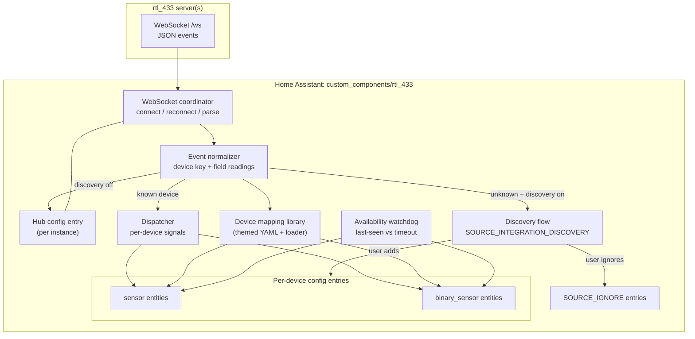

# Plan: rtl_433 WebSocket Home Assistant Integration

## Original Work Order

> We are creating a Home Assistant integration for the rtl_433 websocket API. Key features:
>
> Support for multiple integration config entries to support multiple rtl_433 instances.
> Device discovery similar to Battery Notes: When a new device is discovered, it is shown in HA's device discovery.
> The ability in each addon instance to turn off new device discovery.
> To start: use the same logic as the example code in the rtl_433/examples directory for mapping signals to devices.
> Global, and per-device availability configurations. Since devices may go offline just by not sending a signal, we need to have a timeout to mark a device as unavailable.
>
> Development and testing:
> - following the setup in deviantintegral/flameconnect_ha for CI, automated testing, renovate, and so on
> - conventional commits
> - No need for a separate python library dependency since we are just parsing json and then mapping to HA devices.
> - Full unit test coverage with fixtures for mapping messages to devices.
> - Use playwright-cli plus the Home Assistant docker container to create screenshots of the integration.
> - Use the rtl_433 docker container plus sample data to mock sending real data to Home Assistant for integration tests and creating screenshots for documentation.
> - Treat device mappings as a device library - it shouldn't just be one giant python file. It needs to be easy for contributors and AIs to add support for new devices.

## Plan Clarifications

| # | Question | User guidance | Resolution adopted in this plan |
|---|----------|---------------|---------------------------------|
| 1 | When a discovered device is added, how is it modeled in HA? | "The important thing is that a new entry shows up at the top of the Integrations list." (Asked whether this matches Battery Notes.) | Mirror Battery Notes exactly. A per-instance **hub** config entry runs the WebSocket client; each newly observed device triggers `discovery_flow.async_create_flow()` with `SOURCE_INTEGRATION_DISCOVERY`, producing a "discovered" card at the top of Settings → Devices & Services. Accepting creates a **per-device config entry** that owns that device's entities; dismissing creates a `SOURCE_IGNORE` entry so it is not re-surfaced. |
| 2 | How should the device-mapping library be organized? | "Investigate if instead of executable python code, a csv or yaml file can define mappings… users could in the UI add their own mappings. Other possibility: read the rtl_433 source code and dynamically generate mappings." | Investigation result: rtl_433 has **no centralized machine-readable field registry** — 200+ C decoders embed field/unit definitions individually, and HA semantics (`device_class`, `state_class`) do not exist in the source at all. Source-generation is therefore rejected as brittle. Adopt a **data-driven YAML mapping library** (multiple themed files) seeded by porting the curated `rtl_433_mqtt_hass.py` `mappings` table, loaded by a thin Python loader. A documented drop-in user-override YAML file is included. A full in-UI mapping editor is explicitly **out of scope** (YAGNI) but the data-driven design keeps it possible later. |
| 3 | flameconnect_ha could not be read (private/404). How to source the CI/test/Renovate setup? | "I gave you the wrong name, its https://github.com/deviantintegral/flame_connect_ha" | Repo located and inspected. The CI/tooling and `custom_components` structure are mirrored from `flame_connect_ha` (see Background for the concrete file inventory). |
| 4 | Greenfield identifiers, or compatibility with the existing rtl_433-over-MQTT naming? | "If there is a good reason to greenfield this, I want to know it." | **Greenfield, with reasons.** (a) The MQTT-discovery unique_ids (e.g. `Acurite-606TXN-1-T`) carry no instance scoping; with multiple rtl_433 instances the same `model`+`id` would collide. (b) HA keys entities by `(platform, unique_id)`; entities created here live under the `rtl_433` platform, not `mqtt`, so identical unique_id strings would **not** transfer history from the MQTT integration regardless. String-matching therefore buys no real migration benefit while constraining the design. We adopt a clean, instance-scoped unique_id scheme. |

## Executive Summary

This plan delivers a native Home Assistant custom integration that consumes the rtl_433 HTTP server's WebSocket event stream (`ws://<host>:<port>/ws`, default port 8433) and turns decoded RF sensor messages into Home Assistant devices and entities. Each rtl_433 server is represented by its own "hub" config entry, so multiple instances are supported side-by-side. As the hub observes JSON events, it identifies the originating physical device (by `model` plus its identifying keys such as `id`/`channel`) and, for previously unseen devices, surfaces them through Home Assistant's discovery mechanism — appearing at the top of the Integrations list exactly as the Battery Notes integration does. Accepting a discovery creates a per-device config entry that owns the device's sensor and binary_sensor entities; the hub can have new-device discovery switched off per instance.

The signal-to-entity mapping reuses the proven logic from rtl_433's own `examples/rtl_433_mqtt_hass.py`: a registry that maps each known field name (e.g. `temperature_C`, `humidity`, `battery_ok`, `wind_avg_km_h`, `rain_mm`) to a Home Assistant entity descriptor carrying `device_class`, `unit_of_measurement`, `state_class`, display name, value transform, and a unique-id suffix. Rather than a single Python file, these mappings are expressed as a **data-driven YAML device library** split into thematic files, making it trivial for contributors and AI agents to add or correct device support without touching integration logic. Because devices may simply stop transmitting, every entity participates in an availability model: a configurable global timeout (per hub) with per-device overrides marks entities unavailable when no message arrives within the window.

The development and testing approach is mirrored from `deviantintegral/flame_connect_ha`: conventional-commit enforcement, ruff lint/format with pre-commit, `release-please` automation, Renovate, and GitHub Actions for hassfest + HACS validation and a pytest matrix. Quality is anchored by full unit-test coverage that drives recorded JSON fixtures through the mapping library, plus a containerized integration path where the rtl_433 Docker image replays sample data into a Home Assistant Docker container and Playwright CLI captures screenshots for tests and documentation.

## Context

### Current State vs Target State

| Current State | Target State | Why? |
|---------------|--------------|------|
| Repository contains only the AI task-manager scaffolding; no integration code exists | A complete, HACS-installable `custom_components/rtl_433` integration | The work order is to create the integration from scratch |
| rtl_433 users wire sensors into HA via MQTT discovery (`rtl_433_mqtt_hass.py`) and an external MQTT broker | Direct WebSocket connection from HA to the rtl_433 HTTP server, no broker required | Removes the MQTT broker dependency; native integration with first-class config/discovery UX |
| A single rtl_433 feed maps to a flat set of MQTT-discovered entities | Multiple rtl_433 servers, each a hub config entry, each owning discovered per-device entries | The work order requires multiple instances and per-instance discovery control |
| New sensors appear automatically and silently (MQTT autoconfig) | New devices appear as explicit "discovered" cards the user can add or ignore, per Battery Notes | The work order requires Battery-Notes-style discovery and a per-instance discovery off switch |
| Field→entity mapping lives in one large Python script | A data-driven YAML device library split into themed files plus a thin loader | The work order requires a contributor/AI-friendly device library, not one giant Python file |
| Devices that stop transmitting still appear "available" with stale state | Configurable availability timeout (global + per-device) marks entities unavailable | RF devices have no link state; silence is the only offline signal |
| No project tooling | CI/test/release/renovate tooling mirrored from `flame_connect_ha`, conventional commits | The work order specifies this exact development setup |

### Background

**rtl_433 WebSocket API.** The rtl_433 HTTP output mode (`-F http`) exposes a WebSocket endpoint at `ws://<host>:<port>/ws` (default `127.0.0.1:8433`) that emits one JSON object per decoded transmission. Empty frames act as keep-alives. Each event contains a `model` plus device-identifying keys (`id`, and/or `channel`, sometimes `subtype`) and a variable set of measurement fields. The integration connects to a user-supplied host/port and treats this stream as its sole data source. No separate Python client library is required — events are parsed as JSON and mapped directly, per the work order.

**Mapping reference (`rtl_433_mqtt_hass.py`).** This upstream example defines a `mappings` table of ~80+ recognized field keys grouped by domain — temperature (`temperature_C`, `temperature_1_C`…`temperature_4_C`, `temperature_F`), humidity/moisture, pressure, wind (`wind_avg_km_h`, `wind_max_m_s`, `wind_dir_deg`, gusts), rain (`rain_mm`, `rain_rate_mm_h`, …), power/electrical (`power_W`, `energy_kWh`, `current_A`, `voltage_V`, `battery_mV`), air quality (`pm2_5_ug_m3`, `co2_ppm`), light/UV (`lux`, `uv`, `uvi`), and binary states (`battery_ok`, `tamper`, `reed_open`, `contact_open`, `alarm`, `closed`, `detect_wet`). Each entry specifies the HA `device_type` (sensor vs binary_sensor), an `object_suffix` for the unique id, and a `config` block (`device_class`, `name`, `unit_of_measurement`, `value_template`, `state_class`). A `SKIP_KEYS` set (`type`, `model`, `subtype`, `channel`, `id`, `mic`, `mod`, `freq`, `sequence_num`, …) is excluded from entity creation. This table is the seed content for the YAML device library; the mapping *semantics* are reused while the MQTT *transport* is discarded.

**Battery Notes discovery model.** Battery Notes calls `discovery_flow.async_create_flow(hass, DOMAIN, context={"source": SOURCE_INTEGRATION_DISCOVERY}, data=…)`, which routes to `async_step_integration_discovery` in the config flow and renders a discovered card at the top of the Integrations list. Accepting creates a config entry; ignoring is honored by checking for an existing `SOURCE_IGNORE` entry with the same `unique_id` so dismissed items do not re-surface. This integration applies the same pattern, with the per-device `unique_id` derived from the hub plus the device key.

**Tooling reference (`deviantintegral/flame_connect_ha`).** The repository was inspected and provides the template for this project's structure and CI:
- `.github/workflows/`: `codeql.yml`, `conventional-commits.yml`, `copilot-setup-steps.yml`, `lint.yml`, `release.yml`, `test.yml`, `validate.yml`.
- Root config: `pyproject.toml`, `renovate.json`, `.pre-commit-config.yaml`, `requirements.txt`, `requirements_dev.txt`, `requirements_test.txt`, `release-please-config.json`, `.release-please-manifest.json`, `hacs.json`, `.editorconfig`, `.gitattributes`, `.gitignore`, `.markdownlint.json`, `.prettierignore`, `.prettierrc.yml`.
- Structured `custom_components/<domain>/`: `__init__.py`, `manifest.json`, `const.py`, `data.py`, `diagnostics.py`, `repairs.py`, a `config_flow_handler/` package (with `schemas/` and `validators/` subpackages), a `coordinator/` package (`base.py`), an `entity/` package (`base.py`), and one package per platform (`sensor/`, `binary_sensor/`, etc.), plus `translations/en.json`.
- `tests/`: `conftest.py` and one test module per platform/concern.

**rtl_433 field source.** There is no single machine-readable file in rtl_433 enumerating output fields and units; definitions are embedded across 200+ C decoders and HA-specific semantics are absent. This is why the device library is seeded from the curated `rtl_433_mqtt_hass.py` table and maintained as data, rather than generated from source.

## Architectural Approach

The integration is a hub-and-device custom component for Home Assistant. One config entry per rtl_433 server (the **hub**) maintains a resilient WebSocket connection and a runtime view of observed devices. Incoming JSON events are normalized into a device key and a set of field readings; the mapping library converts recognized fields into entity descriptors. Known devices have their readings dispatched to live entities; unknown devices either trigger a discovery flow (Battery-Notes style) or, when discovery is disabled for that hub, are recorded but not surfaced. Accepting a discovery creates a per-device config entry whose `sensor`/`binary_sensor` platforms instantiate entities from the device's current and historically seen fields. Availability is enforced by per-device "last seen" timestamps measured against a configurable timeout.

### Hub Config Entry and WebSocket Coordinator
**Objective**: Establish and maintain the connection to one rtl_433 server and act as the single ingestion point for its events.

The hub config flow collects the server host and port (default 8433) and an optional path, validating reachability of the WebSocket endpoint before creating the entry. A coordinator owns the WebSocket lifecycle: connect, parse JSON frames, ignore keep-alives, and reconnect with backoff on drop. The hub holds runtime state (observed device keys, last-seen timestamps, the per-hub "new device discovery" flag, and the resolved availability defaults). Multiple hubs coexist because all per-hub state is scoped to the config entry. The coordinator does not create entities directly; it normalizes events and fans them out via Home Assistant's dispatcher keyed by device, so device entries subscribe only to their own device's updates. An options flow exposes the per-instance discovery toggle and the hub-level default availability timeout.

### Event Normalization and the Device Mapping Library
**Objective**: Convert heterogeneous rtl_433 JSON into a stable device identity and a set of Home Assistant entity descriptors, in a way that is easy for contributors and AI agents to extend.

Normalization derives a deterministic device key from identity fields (`model` plus the present subset of `id`/`channel`/`subtype`) and separates measurement fields from skip-fields. The mapping library is a data-driven registry loaded from multiple **themed YAML files** (for example: temperature, humidity, pressure, wind, rain, power/electrical, air-quality, light/UV, and binary states), plus an optional misc file. Each YAML entry is keyed by the rtl_433 field name and carries the attributes needed to build an entity: target platform (sensor or binary_sensor), `device_class`, `unit_of_measurement`, `state_class`, display name, an optional value transform/rounding, an optional payload mapping for binary states (e.g. which value means "on"), and the unique-id suffix. A thin loader parses and validates these files at startup into in-memory descriptors and exposes lookup by field name. The seed content is a faithful port of the `rtl_433_mqtt_hass.py` `mappings` table and its `SKIP_KEYS`. To honor the "users can add their own mappings" intent without over-building, the loader also reads an optional user-supplied override YAML from the Home Assistant config directory, layered on top of the shipped library; a graphical mapping editor is intentionally deferred. Splitting the library by theme and expressing it as data (not code) means adding a device/field is a small, reviewable YAML change with no integration-logic risk.

### Device Discovery and Per-Device Config Entries
**Objective**: Surface newly seen devices through Home Assistant's discovery UX, on a per-instance opt-out basis, and model each accepted device as its own configurable entry.

When the hub normalizes an event for a device that has neither an existing device config entry nor a `SOURCE_IGNORE` entry, and the hub's discovery toggle is on, it calls `discovery_flow.async_create_flow()` with `SOURCE_INTEGRATION_DISCOVERY`, mirroring Battery Notes so the device appears at the top of the Integrations list. The discovery data carries the parent hub reference and the device key/metadata. The config flow's `async_step_integration_discovery` presents the device for confirmation; accepting creates a per-device config entry, while dismissing yields a `SOURCE_IGNORE` entry checked on subsequent sightings to prevent re-prompting. With the toggle off, unknown devices are tracked in hub runtime state (for diagnostics and for retroactive discovery if re-enabled) but no flow is created. Each device config entry registers a Home Assistant device and sets up the `sensor` and `binary_sensor` platforms, which build entities from the device's mapped fields and update on dispatcher signals from the hub.

### Availability Model
**Objective**: Reflect the real online/offline status of RF devices that signal presence only by transmitting.

Every device tracks a last-seen timestamp updated on each event. A watchdog compares last-seen against an effective timeout and flips the device's entities to unavailable when exceeded, restoring them on the next event. The effective timeout resolves per device: a per-device override (from the device entry's options) takes precedence over the hub-level default, which itself defaults to a sensible configurable value. Because timeout needs vary widely (some sensors report every 30–60 s, others every several minutes), the value is configurable at both levels rather than hard-coded; the plan does not fix a single magic constant beyond a documented default.

### Entities and Quality Surfaces
**Objective**: Provide correct, well-classified entities plus the standard integration quality surfaces.

A shared base entity centralizes device-info, availability wiring, and dispatcher subscription. The `sensor` platform covers measurement fields with proper `device_class`/`state_class`/units from the library; the `binary_sensor` platform covers boolean states (battery, tamper, contact/reed, alarm, leak). Diagnostics export (with redaction) exposes hub connection state, observed devices, last-seen times, and unmatched field keys to aid contributors in extending the library. `repairs`/`translations` follow the reference project's conventions; scope for repairs is limited to genuinely actionable issues (e.g. unreachable server) rather than speculative cases.

### Development, Testing, and Documentation Tooling
**Objective**: Match the prescribed `flame_connect_ha` engineering setup and the specified testing strategy.

Project tooling mirrors `flame_connect_ha`: conventional commits (enforced in CI), ruff + pre-commit, Renovate, `release-please` automation, `hacs.json`, split `requirements*.txt`, and GitHub Actions for CodeQL, lint, hassfest + HACS validation, and a pytest matrix. Unit tests drive recorded rtl_433 JSON fixtures (one per representative model) through normalization and the mapping library, asserting correct device identity, entity set, classes, units, value transforms, binary payload handling, skip-field exclusion, and availability transitions — targeting full coverage of the mapping path. A containerized integration path uses the rtl_433 Docker image replaying sample data to feed a Home Assistant Docker container running the integration, with Playwright CLI capturing screenshots (discovery card, device page, options flow, unavailable state) for both integration assertions and documentation.

## Risk Considerations and Mitigation Strategies

Technical Risks

- **WebSocket endpoint/behavior variance across rtl_433 versions**: path, port, or frame conventions may differ.
    - **Mitigation**: Make host/port/path configurable with the documented `8433` / `/ws` defaults; validate during config flow; tolerate keep-alive/empty frames and malformed JSON without crashing the coordinator.
- **Unmapped or novel fields produce no entity (silent gaps)**: rtl_433 emits many model-specific keys not in the seed library.
    - **Mitigation**: Record unmatched field keys in diagnostics so contributors can see exactly what to add; the data-driven YAML library makes additions low-risk.
- **Device-key ambiguity / collisions**: some models lack stable `id`, or reuse `channel`; multiple instances can see the same `model`+`id`.
    - **Mitigation**: Derive the key from the present identity fields and scope unique_ids by hub/config entry; document the keying rules; cover edge cases (missing id, channel-only) with fixtures.

Implementation Risks

- **Discovery loops or duplicate entries**: repeated sightings could spam discovery flows.
    - **Mitigation**: Follow Battery Notes precisely — check for existing device entries and `SOURCE_IGNORE` entries before creating a flow; dedupe by unique_id; gate on the per-hub toggle.
- **Availability flapping**: bursty or delayed transmissions could toggle availability noisily.
    - **Mitigation**: Single watchdog comparison against a configurable timeout with sane defaults and per-device override; restore on any event; document tuning.
- **Scope creep into an in-UI mapping editor**: the user floated UI-editable mappings.
    - **Mitigation**: Deliver data-driven YAML plus a drop-in user override now; explicitly defer a graphical editor (YAGNI) while keeping the architecture compatible with it.

Integration & Quality Risks

- **HACS/hassfest validation drift**: manifest, brands, and quality-scale requirements evolve.
    - **Mitigation**: Run hassfest + HACS validation in CI from the start (mirroring `flame_connect_ha`); keep `manifest.json`/`hacs.json` conformant.
- **Flaky containerized integration/screenshot tests**: timing between rtl_433 replay, HA startup, and Playwright capture.
    - **Mitigation**: Wait on explicit readiness signals (HA API up, entity present) before capture; keep deterministic sample data; separate fast unit tests from the slower container job.

## Success Criteria

### Primary Success Criteria
1. Two or more rtl_433 servers can be added as separate hub config entries simultaneously, each connecting to its own `ws://host:port/ws` and ingesting events independently without unique_id collisions.
2. A newly observed device appears as a discovered card at the top of Settings → Devices & Services (Battery-Notes behavior); accepting creates a per-device config entry with correctly classified `sensor`/`binary_sensor` entities, and ignoring prevents re-prompting via a `SOURCE_IGNORE` entry.
3. Turning off "new device discovery" on a hub stops new discovery cards from appearing for that instance while existing devices continue updating.
4. Recognized fields from the seed library (temperature, humidity, pressure, wind, rain, power, air quality, light/UV, and binary states) produce entities with the correct `device_class`, `unit_of_measurement`, `state_class`, and value handling, matching the `rtl_433_mqtt_hass.py` semantics; `SKIP_KEYS` produce no entities.
5. After no events for longer than the effective timeout, a device's entities become unavailable and recover on the next event; the per-device override takes precedence over the hub default.
6. Adding support for a new device/field requires only a YAML change in the themed device library (no integration-logic edits), and a user-supplied override YAML is honored.
7. Unit tests cover the full mapping path from recorded JSON fixtures to entity descriptors and availability transitions; CI passes hassfest + HACS validation, lint, conventional-commit, and the pytest matrix.
8. The containerized path (rtl_433 Docker replaying sample data → HA Docker → Playwright CLI) produces screenshots of the discovery card, a device page with entities, the options flow, and an unavailable-state example.

## Self Validation

After all tasks are complete, an agent should verify the implementation against the real system, not merely re-run unit tests:

- Bring up the Home Assistant Docker container with the integration installed and an rtl_433 Docker container replaying the committed sample data into its `-F http` WebSocket. Use Playwright CLI to open the HA UI, add a hub config entry pointing at the rtl_433 container, and screenshot the resulting connection state.
- After replay begins, use Playwright CLI to confirm a discovered-device card appears at the top of Settings → Devices & Services; screenshot it. Accept it and screenshot the created device page, verifying expected entities (e.g. a temperature sensor with `°C` and `measurement` state class, a battery binary_sensor) are present with correct classes/units.
- Trigger the ignore path on a second discovered device and confirm via the config entries list (UI or `curl` to the HA config-entries API) that a `SOURCE_IGNORE` entry exists and the card does not reappear after further replay.
- Add a second hub entry for a second rtl_433 source replaying an overlapping `model`+`id`; confirm via the entity registry (HA API/`curl`) that both instances' entities exist with distinct, instance-scoped unique_ids.
- Toggle "new device discovery" off on a hub via its options flow, replay an unseen device, and confirm no new discovery card appears; screenshot the options flow.
- Stop replay and wait past a deliberately short configured availability timeout; use Playwright CLI / the HA states API to confirm the device's entities report `unavailable`, then resume replay and confirm they recover. Screenshot the unavailable state.
- Add a temporary entry to a user-override mapping YAML for a previously unmapped field present in the sample data; restart and confirm via the HA API that the corresponding entity is now created, demonstrating the data-driven library and override mechanism.

## Documentation

- **README.md**: purpose, HACS installation, configuring a hub (host/port), discovery behavior and the per-instance discovery toggle, availability timeout configuration (global + per-device), and a gallery of the Playwright-generated screenshots.
- **Device library contributor guide**: the YAML mapping schema (one entry per field key: platform, device_class, unit, state_class, name, value transform, binary payload, unique-id suffix), where the themed files live, how to add/correct a mapping, how to read diagnostics' unmatched-keys to find gaps, and how the user-override file works.
- **AGENTS.md / AI-facing docs**: machine-oriented description of the device-library format and the add-a-mapping workflow so AI agents can extend support safely, plus how to run unit tests and the containerized screenshot path.
- **CONTRIBUTING / commit conventions**: conventional commits and the `release-please` flow, mirroring the reference project.

## Resource Requirements

### Development Skills
- Home Assistant custom-integration development: config flows (including `async_step_integration_discovery`), options flows, coordinators, dispatcher, entity platforms, device/entity registry, availability, diagnostics.
- Async Python and WebSocket client handling (reconnect/backoff, resilient JSON parsing).
- Familiarity with rtl_433's JSON event vocabulary and the `rtl_433_mqtt_hass.py` mapping semantics.
- Test engineering with `pytest-homeassistant-custom-component` and fixture design.
- CI/release tooling: GitHub Actions, ruff, pre-commit, Renovate, release-please, hassfest/HACS validation.
- Container orchestration (Docker for rtl_433 + HA) and Playwright CLI automation.

### Technical Infrastructure
- Home Assistant Docker image and the rtl_433 Docker image (with a sample-data replay capability into `-F http`).
- Committed sample rtl_433 capture/JSON data representative of multiple device models.
- Playwright CLI for screenshot capture.
- GitHub Actions runners for CodeQL, lint, validate (hassfest + HACS), test matrix, conventional-commits, and release.
- No third-party Python runtime dependency for parsing/mapping (stdlib JSON + a YAML parser already available in the HA environment), per the work order.

## Integration Strategy

The component installs under `custom_components/rtl_433/` and is distributed via HACS as a custom repository. It integrates with Home Assistant exclusively through documented extension points (config/options flows, discovery flow, coordinator + dispatcher, entity platforms, device/entity registry, diagnostics) and depends only on a reachable rtl_433 HTTP server's WebSocket endpoint — no MQTT broker and no bespoke Python client library. It is deliberately independent of the existing rtl_433-over-MQTT path; the two can run concurrently, and migration is treated as out of scope per the greenfield decision.

## Notes

- **Greenfield decision is intentional and reasoned** (see Clarification #4): instance-scoped unique_ids are required for multi-instance safety, and HA cannot transfer history across platforms by string-matching unique_ids, so MQTT-name compatibility is not pursued.
- **Source-generated mappings rejected** (see Clarification #2): rtl_433 has no centralized machine-readable field registry and no HA semantics in source; the YAML library seeded from `rtl_433_mqtt_hass.py` is the maintainable choice.
- **In-UI mapping editor deferred**: the data-driven YAML library plus a drop-in user-override file satisfies the near-term "users can add mappings" intent; a graphical editor is out of scope unless requested later.
- **No backwards compatibility required**: confirmed greenfield; there is no prior version of this integration to preserve.
- This plan is a PRD only; task and phase decomposition happens in the task-generation step.
