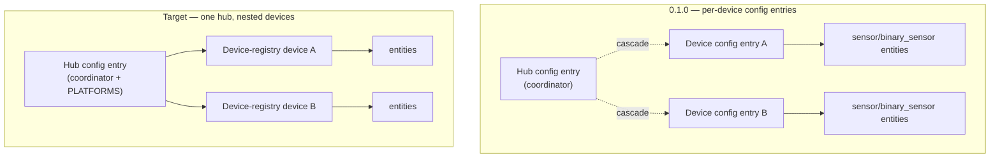
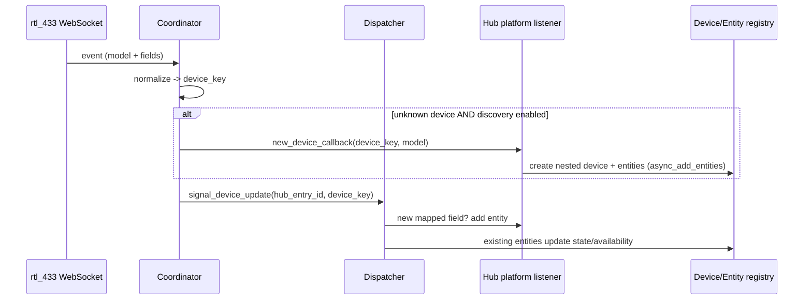
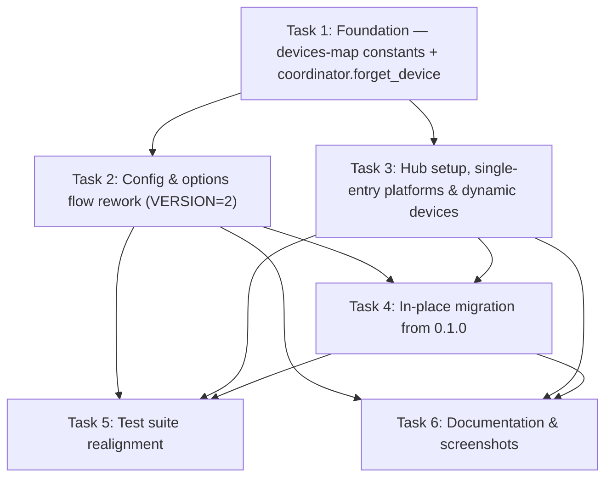

# Plan: Hub + Nested Devices Refactor (rfxtrx-style)

## Original Work Order

> Refactor the integration to implement a hub + devices approrach as mentioned in this summary. If possible, we should support upgrading in place without needing to uninstall the 0.1.0 release.
>
> rfxtrx is in core and is almost the same shape as rtl_433 — an RF receiver, integration_type: "hub", iot_class: "local_push". I just checked how it's built:
> - One config entry, with async_forward_entry_setups(entry, PLATFORMS) on that single entry.
> - Decoded RF devices become device-registry devices nested under that one entry (not config entries).
> - It implements async_remove_config_entry_device so you can remove an individual stale device.
> - Device management (add/configure/remove) happens through an OptionsFlow, not per-device config entries.
>
> That's exactly the ha_carrier pattern — and the opposite of what we built.
>
> The underlying core principle: a config entry represents a service/connection you set up (the hub), not an auto-discovered sub-thing behind it. And discovery_flow / SOURCE_INTEGRATION_DISCOVERY is meant for surfacing a new hub/instance to configure (e.g. "an rtl_433 server was found on the network"), not for sub-sensors behind an already-configured hub. Using it to mint a config entry per temperature sensor is precisely what a core reviewer would push back on.
>
> It also lines up with the Integration Quality Scale: rules like dynamic-devices (add devices at runtime via a listener) and stale-devices (async_remove_config_entry_device) are written assuming the hub-with-nested-devices model. The per-device-config-entry approach doesn't fit them.
>
> Worth noting: the pattern we copied — Battery Notes — is a HACS-only integration, not core. Its "every device is its own entry" design works for its niche (per-device battery metadata) but wouldn't be accepted for RF sub-devices in core.
>
> So all three signals agree:
> - Core conventions → nested (rfxtrx).
> - ha_carrier (your reference) → nested.
> - Your own expectation when you installed it → nested.
>
> This effectively reverses the original plan's Clarification #1, but for good, well-precedented reasons. "Discovery" isn't abandoned — it just moves to the right level: discover/configure the server (the hub entry), and let the RF devices appear as nested devices (auto-added, gated by the discovery toggle), removable via the device page like rfxtrx.
>
> Want me to go ahead and refactor to the nested (rfxtrx-style) model — modeling it on rfxtrx's async_remove_config_entry_device + options-flow device management, with a migration for the entry you already have on 0.1.0? Given the size, I can run it through the task-manager as a small focused plan, or just implement it directly — your call.
>
> *(Follow-up instruction: "Make sure the plan includes updating the README and any screenshots with these changes.")*

## Plan Clarifications

| # | Question | Answer |
|---|----------|--------|
| 1 | Should this refactor add network discovery of the rtl_433 server (zeroconf/SSDP/DHCP), or just remove per-device config-entry discovery and keep server setup manual? | **Out of scope — manual only.** Keep the user-step server setup (host/port/path). RF devices auto-appear as nested devices, gated by the discovery toggle. No network discovery transport is added. |
| 2 | Where should the per-device availability-timeout override live, now that there are no per-device config entries? | **Keep it, via the hub options flow.** The hub OptionsFlow lets the user pick a known device and set its timeout override (rfxtrx-style options-flow device management). Existing overrides are migrated onto the hub. |
| 3 | What is the bar for preserving existing entities on the in-place upgrade from 0.1.0? | **Seamless — keep entity IDs & history.** Re-home existing registry devices/entities (same unique_ids) onto the hub entry and remove the legacy per-device config entries via `async_migrate_entry`. Dashboards, automations, and history keep working. |
| 4 | After a device is removed from its device page, if discovery is ON and it transmits again, what happens? | **Re-appears (rfxtrx-like).** No persistent ignore list. Removal sticks only while discovery is off; with discovery on, a transmitting device is re-added. |

## Executive Summary

The rtl_433 integration today follows the HACS-only Battery Notes pattern: a hub config entry owns the WebSocket coordinator, and **every decoded RF device is minted as its own config entry** through `SOURCE_INTEGRATION_DISCOVERY` with a confirm card. This plan refactors the integration to the Home Assistant **core** convention demonstrated by `rfxtrx` (and by the user's `ha_carrier` reference): a **single hub config entry** with the RF devices represented as **device-registry devices nested under that one entry**. Platforms are forwarded once on the hub; new devices are auto-added at runtime through a dispatcher listener (the Quality Scale `dynamic-devices` rule), gated by the existing discovery toggle; stale devices are removed from their device page via `async_remove_config_entry_device` (the `stale-devices` rule); and per-device configuration moves into the hub's OptionsFlow.

This approach is chosen because a config entry should represent a *service/connection you set up* (the hub), not an auto-discovered sub-thing behind it. `SOURCE_INTEGRATION_DISCOVERY` is intended to surface a new hub/instance to configure, not a per-sensor entry — so the present design would be rejected by a core reviewer and does not fit the Integration Quality Scale rules written around the hub-with-nested-devices model. The refactor also collapses a large amount of cross-entry bookkeeping (cascade removal, parent-hub lookups, `ConfigEntryNotReady` deferral, per-entry options) into the simpler single-entry shape.

Because the 0.1.0 entity unique_ids already encode `{hub_entry_id}:{device_key}:{object_suffix}` and device identifiers already encode `(DOMAIN, "{hub_entry_id}:{device_key}")`, the upgrade can be **seamless**: an `async_migrate_entry` (config-entry `VERSION` 1 → 2) re-homes the existing registry devices and entities onto the hub entry and removes the obsolete per-device config entries, so entity IDs, history, dashboards, and automations are preserved with no manual uninstall. README prose and the documentation screenshots are updated to describe the nested model.

## Context

### Current State vs Target State

| Aspect | Current State (0.1.0) | Target State | Why? |
|--------|------------------------|--------------|------|
| Config-entry topology | One hub entry **plus one config entry per RF device** (`entry_type` discriminator) | **One hub config entry only**; RF devices are device-registry devices nested under it | A config entry must represent the service you set up (the hub), not an auto-discovered sub-device; required for core acceptance |
| Platform setup | `async_forward_entry_setups` runs **per device entry** | `async_forward_entry_setups(entry, PLATFORMS)` runs **once on the hub entry** | Matches rfxtrx; entities for all devices are managed under one entry |
| New device handling | `new_device_callback` → `discovery_flow.async_create_flow` (`SOURCE_INTEGRATION_DISCOVERY`) → confirm card → mints a device config entry | `new_device_callback` → dispatcher signal → hub platform listener creates the nested device + entities at runtime | `SOURCE_INTEGRATION_DISCOVERY` is for hubs, not sub-sensors; satisfies the `dynamic-devices` Quality Scale rule |
| New-device opt-in | Per-device **confirm card** (accept/ignore) | **Auto-added**, gated by the existing per-hub discovery toggle | Confirm-per-device is the Battery Notes niche; nested model auto-populates while the toggle governs new arrivals |
| Stale-device removal | Delete the device's config entry; hub deletion cascade-removes children | `async_remove_config_entry_device` removes a single device from its device page | Satisfies the `stale-devices` rule; no cascade bookkeeping needed |
| Per-device timeout override | Per-device entry **OptionsFlow** | **Hub OptionsFlow** with a device picker | No per-device entries exist anymore; preserves feature parity |
| Per-device persisted state | `observed_fields` + timeout override in each **device entry's** options | Consolidated **per-hub devices map** in the hub entry's `data` (`entry.data["devices"]`) | Single entry owns all device state; one source of truth for recreation + overrides |
| Removed-device re-add | `SOURCE_IGNORE` entry suppresses re-prompt indefinitely | No ignore list; re-appears if discovery is on and it transmits | Minimal state; matches rfxtrx toggle semantics (Clarification #4) |
| Coordinator state on removal | Device entry removed; coordinator runtime state left untouched | Removing a device also **evicts its `device_key` from coordinator runtime state** | Lets the next event be treated as new so the device re-appears with discovery on; without this, Clarification #4 silently fails |
| Upgrade path | n/a (0.1.0 is the baseline) | `async_migrate_entry` `VERSION` 1 → 2 re-homes registry objects, removes legacy device entries | Seamless in-place upgrade, preserving entity IDs/history (Clarification #3) |
| Config-entry `VERSION` | `1` | `2` | Triggers the migration |

### Background

- The integration already declares `integration_type: "hub"` and `iot_class: "local_push"` in `manifest.json`, so the manifest needs no structural change for the model shift (a `version` bump for the release is separate).
- The coordinator (`coordinator/base.py`) is already cleanly decoupled: it imports nothing from `config_flow.py`/`entity.py`/`mapping.py` and exposes injectable hooks (`new_device_callback`, `effective_timeout_resolver`, `skip_keys`). The new-device hook contract (`(device_key, model)`) is reused as-is; only what the wiring in `__init__.py` *does* with the callback changes (dispatch instead of discovery flow).
- Entity identity is stable and already hub-scoped: unique_id `{hub_entry_id}:{device_key}:{object_suffix}`, device identifier `(DOMAIN, "{hub_entry_id}:{device_key}")`, `via_device` `(DOMAIN, hub_entry_id)`. Preserving these strings across the migration is what makes the upgrade seamless. `object_suffix` values must remain stable (per AGENTS.md guardrails).
- `device_key` tokens never contain `:` (the normalizer's `_safe_token` maps unsafe characters to `_`), so `:`-delimited unique_ids remain safe to construct and, where needed, to parse.
- The `dynamic-devices` and `stale-devices` Integration Quality Scale rules are the explicit design targets for the runtime-add and device-removal behaviors.
- Out of scope: network discovery of the server, the device-library YAML/mapping system (`mapping.py`, `normalizer.py`, `device_library/*.yaml` are unchanged), and the container/screenshot *harness* mechanics (only the captured screenshots and README change).

## Architectural Approach

The work divides into the model collapse (config entries → one hub + nested devices), the runtime lifecycle (registry-driven recreation, dynamic add, device removal), per-device configuration via the hub OptionsFlow, the seamless migration, and the documentation/screenshot refresh. The diagrams below summarize the topology change and the runtime flow.

### Config-entry model collapse

**Objective**: Reduce the integration to a single hub config entry and forward platforms once on it.

Remove the `entry_type` discriminator and the device-entry code paths from `__init__.py` (`_async_setup_device_entry`, the `ConfigEntryNotReady` deferral, and the cascade logic in `async_remove_entry`). `async_setup_entry` sets up the hub directly: load the library, register the hub device, construct and start the coordinator, wire the reachability watcher and options-update listener, and call `async_forward_entry_setups(entry, PLATFORMS)`. `const.py` retains `CONF_HUB_ENTRY_ID`/`CONF_DEVICE_KEY`/`CONF_MODEL` as internal identity keys but the `CONF_ENTRY_TYPE`/`ENTRY_TYPE_*` discriminator and its helpers (`is_hub_entry`/`is_device_entry`) are removed or collapsed to a single hub assumption. `diagnostics.py` drops its device-entry branch (`_resolve_coordinator` always resolves the hub).

### Devices-map-driven device & entity lifecycle (dynamic-devices)

**Objective**: Recreate known devices' entities on startup and add new devices/fields at runtime under the one hub entry.

Per-device state (model, observed mapped fields, and any timeout override) is consolidated into a single **per-hub devices map** stored in **`entry.data["devices"]`** (an integration-managed, discovered-state structure, rfxtrx-style — not free-form user config), replacing the per-device config entries and their `observed_fields`/timeout options. This map is the **authoritative source of truth** for what to recreate; the persisted entity registry is not consulted to decide *what* to build, it simply reconciles by unique_id so existing entity_ids and history are preserved. On hub setup, the `sensor`/`binary_sensor` platforms iterate the devices map and create entities for every known device using the existing unique_id/`DeviceInfo` scheme. A single dispatcher listener registered on the hub entry handles **all** devices: when the coordinator reports a new device (gated by `discovery_enabled`) it creates the nested device + its initial entities and adds the device to the map; when an event carries a previously unseen mapped field for an existing device it adds that entity and appends the field to the map. Map writes go through `hass.config_entries.async_update_entry(entry, data=…)` and only when the map actually changes. This generalizes the current per-device `async_setup_device_platform` to a hub-wide listener.

### Stale-device removal (stale-devices)

**Objective**: Let a user remove an individual device from its device page.

Implement `async_remove_config_entry_device(hass, entry, device_entry)` so Home Assistant shows the per-device "Delete" affordance. It **returns `False` for the hub device** (identifier `(DOMAIN, entry.entry_id)`) so the hub itself cannot be deleted out from under its config entry, and `True` for nested RF devices. Allowing removal of a nested device performs three coordinated steps: drop the device (and its `device_key`) from the hub's `entry.data["devices"]` map, **evict that `device_key` from the coordinator's runtime state** (`devices`/`last_seen`/`available`/`device_fields`), and let HA remove the registry device and entities. The coordinator eviction is essential: without it, a re-transmitting device is not treated as new (`is_new` stays `False`) and would never re-appear, silently breaking Clarification #4. Because there is no persistent ignore list (Clarification #4), a removed device re-appears only if discovery is enabled and it transmits again. Hub deletion now naturally removes all nested devices/entities (they belong to the one entry), so the bespoke cascade in `async_remove_entry` is deleted.

### Per-device configuration via the hub OptionsFlow

**Objective**: Preserve hub-level settings and the per-device timeout override without per-device config entries.

Rework the OptionsFlow into a small menu: a hub step (discovery toggle + default availability timeout, as today, persisted to `entry.options`) and a device step that lists known devices and lets the user set/clear a per-device availability-timeout override. Because the single source of truth for per-device state is `entry.data["devices"]`, the device step writes the override into that map via `async_update_entry(entry, data=…)` rather than into `entry.options` (a deliberate, documented departure from the usual options-write so the coordinator's `effective_timeout_resolver` reads exactly one place — re-pointed from "search child entries" to "read the devices map"). The `async_step_integration_discovery` and `async_step_confirm` steps and the separate device OptionsFlow class are removed.

### Seamless in-place migration from 0.1.0

**Objective**: Upgrade an existing 0.1.0 install with no manual uninstall and no loss of entities/history.

Bump the config-entry `VERSION` to `2` and add `async_migrate_entry`. The hub entry is the migration anchor: it discovers all legacy child device entries (those carrying `CONF_HUB_ENTRY_ID == hub.entry_id`), and for each one **re-homes the device-registry device and its entities onto the hub config entry first** (add the hub `config_entry_id`, then remove the legacy entry's association) so removing the legacy config entry cannot delete them, folds the child's `model`/`device_key`/`observed_fields`/timeout override into the hub's new devices map, and then removes the legacy device config entry. Any legacy `entry_type: "device"` entry that is processed independently is handled idempotently and converges on the same invariant: after migration only the hub entry remains, every entity keyed `{hub_entry_id}:{device_key}:{object_suffix}` is owned by the hub, and the legacy `async_remove_entry` cascade is never triggered during migration. Ordering between the hub and child migrations is treated as a managed risk (below).

### Config-flow, translations, diagnostics & repairs touch-ups

**Objective**: Keep the user-facing flow text and support surfaces consistent with the nested model.

The hub user step is unchanged. `translations/en.json` drops the `flow_title` and `confirm` discovery strings, **rewords the `already_configured` abort** from "This device is already configured." to refer to the *server* (the only remaining uniqueness abort is the hub host/port), and gains the OptionsFlow menu/device-step strings; the `cannot_connect` error and `server_unreachable` repair are unchanged. `repairs.py` (hub reachability) is unaffected by the model change. Diagnostics continue to export the hub snapshot and the `unmatched_field_keys` contributor feedback loop.

### Tests, documentation & screenshots

**Objective**: Realign the test suite and all human-facing documentation, including screenshots, with the nested model.

Update `tests/conftest.py` (remove the device-entry builder; the hub builder grows a devices map), rewrite `tests/test_config_flow.py` (drop discovery/confirm/ignore tests; add hub + device OptionsFlow and a `async_remove_config_entry_device` test), and rework `tests/test_lifecycle.py` to set up a single hub entry, assert nested-device + entity creation and dynamic late-field/late-device add, and add a migration test that builds the 0.1.0 shape (hub + device entries with pre-seeded registry objects) and asserts seamless consolidation with preserved unique_ids. `README.md` is rewritten where it describes the Battery Notes discovery model (the "Discovery", "Per-device override", options, and architecture sections), and the documentation **screenshots are recaptured** to show the nested device topology instead of the discovery/confirm card. AGENTS.md repository-shape notes are updated to match.

## Risk Considerations and Mitigation Strategies

Technical Risks

- **Migration ordering between the hub entry and legacy device entries**: Home Assistant may invoke `async_migrate_entry` for a legacy device entry before the hub entry, and migration runs before setup.
    - **Mitigation**: Make the migration idempotent and anchor all consolidation on the hub entry; have any independently processed legacy device entry converge on the same invariant rather than depending on order. Verify with a migration test that seeds both orderings.
- **Accidental deletion of entities/devices during migration**: removing a legacy device config entry will delete its registry device/entities if they are still associated only with that entry.
    - **Mitigation**: Always re-home (add the hub `config_entry_id` to the device and update each entity's `config_entry_id` to the hub) *before* removing the legacy config entry; assert post-migration that unique_ids and entity_ids are unchanged.
- **Unique_id / object_suffix drift**: any change to the unique_id scheme or `object_suffix` values would orphan existing entities and break history preservation.
    - **Mitigation**: Reuse the exact 0.1.0 unique_id (`{hub_entry_id}:{device_key}:{object_suffix}`) and device-identifier strings unchanged; treat `object_suffix` stability as a hard constraint (AGENTS.md guardrail).
- **Coordinator runtime state not evicted on device removal**: leaving a removed device's `device_key` in the coordinator's in-memory dicts makes `_process_event` treat its next event as not-new, so the rfxtrx-like re-add (Clarification #4) silently never fires.
    - **Mitigation**: `async_remove_config_entry_device` evicts the `device_key` from `devices`/`last_seen`/`available`/`device_fields`; cover the remove-then-retransmit-with-discovery-on path in `test_lifecycle.py`.

Implementation Risks

- **Single hub-wide dynamic-add listener regressing per-device behavior**: generalizing the per-device platform setup to one hub-wide listener could misroute fields or double-create entities across many devices.
    - **Mitigation**: Dedupe by unique_id within the hub setup (as the current per-device helper already does) and key all routing by `device_key`; cover multi-device and late-field scenarios in `test_lifecycle.py`.
- **Persisted devices-map writes on the event loop**: folding observed fields/overrides into the hub entry on each new field could churn config-entry writes.
    - **Mitigation**: Only write when the map actually changes (the current "write only if the set grew" guard), store deterministically (sorted) for diff-friendly entries.

Quality / Documentation Risks

- **Stale screenshots/README**: leaving the Battery Notes discovery screenshots and prose would misrepresent the shipped behavior.
    - **Mitigation**: Recapture the documentation screenshots via the existing harness and rewrite the affected README sections as an explicit, required deliverable (Clarification follow-up).
- **Screenshot harness may not run in the execution environment**: recapturing screenshots depends on the container/Playwright/RF-capture harness (Docker, Node, real captures), which may be unavailable where tasks execute.
    - **Mitigation**: Treat the README *prose* rewrite as the always-deliverable, non-blocking part. If the harness cannot run, capture as many screenshots as the environment allows and explicitly flag the specific images that still need recapture (with the exact `run-harness.sh` invocation) rather than blocking the whole refactor; the screenshot task is isolated so it can be completed separately if needed.

## Success Criteria

### Primary Success Criteria

1. The integration exposes **exactly one config entry per rtl_433 server**; RF devices appear as **device-registry devices nested under that hub entry**, with no `entry_type: "device"` config entries created at runtime.
2. A newly observed device is **auto-added** as a nested device with its entities when the hub's discovery toggle is on, and **not added** when it is off; an existing device's entities are recreated on restart regardless of the toggle.
3. `async_remove_config_entry_device` removes a single device (its registry device + entities) from its device page; deleting the hub entry removes all nested devices/entities.
4. The hub OptionsFlow exposes the discovery toggle and default availability timeout, plus a per-device availability-timeout override selectable by device.
5. Upgrading an existing 0.1.0 install in place (no uninstall) migrates to the single-hub model with **all entity IDs, unique_ids, and history preserved** and **no leftover per-device config entries**.
6. The full unit test suite passes, including new tests for nested-device creation, dynamic add, device removal, the hub/device OptionsFlow, and the 0.1.0 → nested migration.
7. `README.md`, its screenshots, and `AGENTS.md` describe the nested (hub + devices) model with no remaining references to Battery Notes-style per-device discovery/confirm cards.

## Self Validation

After all tasks are complete, an LLM should execute the following concrete checks:

1. **Run the unit suite with coverage**: `uv run pytest --cov=custom_components/rtl_433 tests/` and confirm all tests pass, including the new migration and nested-device tests.
2. **Grep for removed surfaces**: confirm `grep -rn "SOURCE_INTEGRATION_DISCOVERY\|async_step_integration_discovery\|async_step_confirm" custom_components/rtl_433/` returns nothing, and that any remaining matches for `grep -rn "ENTRY_TYPE_DEVICE\|entry_type" custom_components/rtl_433/` are confined to the `async_migrate_entry` helper (which legitimately reads the legacy discriminator to find 0.1.0 device entries) and not to any runtime setup/flow path. Confirm `grep -rn "async_remove_config_entry_device\|async_migrate_entry" custom_components/rtl_433/__init__.py` shows both are implemented.
3. **Confirm the version bump**: verify `VERSION = 2` in `config_flow.py`.
4. **Migration smoke test**: in a test (or a scripted HA fixture), build the 0.1.0 shape — a hub entry plus two device config entries with pre-seeded device-registry devices and entities — run setup so migration executes, then assert: only the hub config entry remains, the two devices are still present and now associated with the hub entry, and every entity's `unique_id` and `entity_id` are unchanged.
5. **Runtime add/remove/re-add**: in `test_lifecycle.py`, feed an event for a brand-new device with discovery on and assert a nested device + entities are created; feed it with discovery off and assert none are; exercise `async_remove_config_entry_device` and assert the device and its entities are gone *and* the `device_key` is evicted from coordinator state; then, with discovery still on, feed the same device's event again and assert it re-appears (Clarification #4). Also assert `async_remove_config_entry_device` returns `False` for the hub device.
6. **Recapture and visually verify screenshots**: run the screenshot harness (`tests/integration/run-harness.sh full`) and confirm the produced images show the nested device topology (device page under the hub) and the reworked options flow, with no discovery/confirm card image remaining referenced by the README.
7. **README link/section check**: confirm the README "Discovery", options, and architecture sections describe nested devices, and that every image referenced by the README exists in `docs/images/`.

## Documentation

The following documentation updates are **required** (the README + screenshot update is an explicit deliverable per the user's follow-up):

- **`README.md`** — rewrite the sections that currently describe the Battery Notes per-device discovery model: the intro/feature bullets ("Battery Notes-style discovery"), the **Discovery** section (accept/ignore confirm cards → auto-added nested devices gated by the toggle), the **Per-device override** section (now reached through the hub options flow), the **Options** section, and the **architecture** description. Remove references to per-device config entries and `SOURCE_IGNORE`.
- **Screenshots in `docs/images/`** — recapture using the existing screenshot harness so they reflect the nested model: replace the discovery-card screenshot with the device-page/hub topology and the updated options flow; ensure every image referenced by `README.md` exists and is current.
- **`AGENTS.md`** — update the "Repository shape" / model notes so they describe one hub entry with nested devices and the `async_remove_config_entry_device` + migration surfaces (the file currently references `coordinator.py` as a single module; keep repository-shape notes accurate to the package layout).
- No change to `docs/device-library.md` (the mapping/library system is unchanged).

**Does this plan need to update documentation / AGENTS.md?** Yes — README prose, README screenshots, and AGENTS.md all require updates as described above.

## Resource Requirements

### Development Skills

- Home Assistant integration internals: config-entry lifecycle, `async_migrate_entry`, device & entity registries, `async_forward_entry_setups`, `async_remove_config_entry_device`, OptionsFlow, and the dispatcher helper.
- Familiarity with the Integration Quality Scale `dynamic-devices` and `stale-devices` rules and the rfxtrx reference implementation.
- `pytest` with `pytest-homeassistant-custom-component`, including registry assertions and `MockConfigEntry` setup.

### Technical Infrastructure

- `uv` for the test environment (`uv venv`; `uv pip install -r requirements_test.txt`; `uv run pytest`), Python 3.13 to match CI.
- The existing container/screenshot harness (`tests/integration/`, Playwright + the ws-bridge) for recapturing documentation screenshots against real RF captures.

## Integration Strategy

The coordinator package, normalizer, mapping library, and device-library YAML are reused unchanged; only the wiring in `__init__.py`, the flows in `config_flow.py`, the platform setup in `entity.py`/`sensor.py`/`binary_sensor.py`, the diagnostics hub-only path, the translations, and the tests/docs change. The migration is the integration's bridge from 0.1.0: it is the only code that understands the legacy per-device-entry shape, and it exists solely to consolidate those into the hub before the new runtime code takes over.

- This plan deliberately reverses Clarification #1 of the original (archived) plan 01 — moving from per-device config entries to nested devices — for the well-precedented reasons in the work order (core conventions, the ha_carrier/rfxtrx reference, and Quality Scale alignment).
- The release that ships this refactor should bump `manifest.json` `version` (e.g. to a `0.2.0` minor) given the config-entry model change; the exact release number is handled by the project's release-please flow and is out of this plan's scope.
- No persistent per-device ignore list is introduced (Clarification #4); if a "stays gone" behavior is wanted later it would be a separate, additive change.

### Data Contract — `entry.data["devices"]`

The single source of truth for nested-device state on the hub entry. A map keyed by `device_key`, each value carrying:

- `model` — the rtl_433 model string (for `DeviceInfo` name/model).
- `fields` — the list of observed mapped field keys (what entities to recreate); stored sorted for diff-friendly entries.
- `timeout_override` — optional per-device availability-timeout override (seconds); absent/None means "use the hub default".

Recreation on startup reads this map; the dynamic-add listener appends to it; the OptionsFlow device step writes `timeout_override` into it; `async_remove_config_entry_device` deletes the device's key from it. The coordinator's `effective_timeout_resolver` reads `timeout_override` from this map (replacing the 0.1.0 "search child config entries" logic). The legacy `CONF_OBSERVED_FIELDS` device-entry option and the per-device entry's timeout option are folded into this map during migration.

### Decision Log (this refinement session)

These decisions were resolved from the codebase and the four prior clarifications, without new user input:

- **Devices-map location**: `entry.data["devices"]` (integration-managed discovered state), not `entry.options`; the OptionsFlow device step writes overrides into `data`. (G3/G4)
- **Coordinator eviction on removal**: required for Clarification #4 to function; removal clears the `device_key` from coordinator runtime state. (G1)
- **Hub-device removal**: `async_remove_config_entry_device` returns `False` for the hub device, `True` for nested devices. (G2)
- **Translation reword**: `already_configured` now refers to the server, not a device. (G5)
- **Screenshot harness**: README prose is the always-deliverable; screenshot recapture is isolated and non-blocking if the harness cannot run in the execution environment. (G7)

### Change Log

- 2026-05-26: Refinement session. Pinned `entry.data["devices"]` as the per-device source of truth and added its data contract; added the coordinator-state-eviction requirement on device removal (fixes a latent Clarification #4 failure) and a matching test/validation step; specified `async_remove_config_entry_device` refuses the hub device; reworded the `already_configured` translation; scoped the `entry_type` grep check to the migration helper; added technical risk (coordinator eviction) and documentation risk (screenshot-harness availability) with mitigations.
- 2026-05-26: Task generation. Decomposed into 6 file-disjoint tasks across 4 phases (see Execution Blueprint).

## Execution Blueprint

**Validation Gates:**
- Reference: `/config/hooks/POST_PHASE.md`

### Dependency Diagram

### Phase 1: Foundation ✅
**Parallel Tasks:**
- ✔️ Task 1: Foundation — devices-map constants, new-device signal, `coordinator.forget_device`

### Phase 2: Flows & core runtime (file-disjoint, parallel)
**Parallel Tasks:**
- Task 2: Config & options flow rework — `config_flow.py`, `translations/en.json` (depends on: 1)
- Task 3: Hub setup, single-entry platforms & dynamic devices — `__init__.py`, `entity.py`, `sensor.py`, `binary_sensor.py`, `diagnostics.py` (depends on: 1)

### Phase 3: Migration
**Parallel Tasks:**
- Task 4: In-place migration from 0.1.0 — `__init__.py` `async_migrate_entry` (depends on: 2, 3)

### Phase 4: Tests & docs (file-disjoint, parallel)
**Parallel Tasks:**
- Task 5: Test suite realignment — `tests/*` (depends on: 2, 3, 4)
- Task 6: Documentation & screenshots — `README.md`, `AGENTS.md`, `docs/images/*` (depends on: 2, 3, 4)

### Post-phase Actions
Each phase ends with the `POST_PHASE.md` gate: lint passes and a conventional-commit for the phase is created.

### Execution Summary
- Total Phases: 4
- Total Tasks: 6
