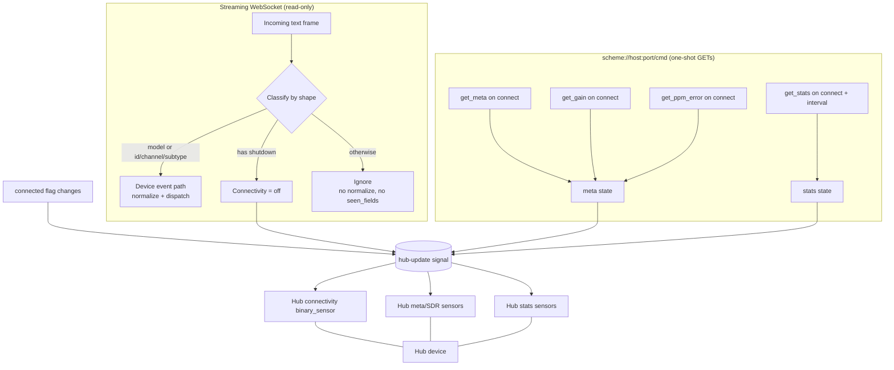
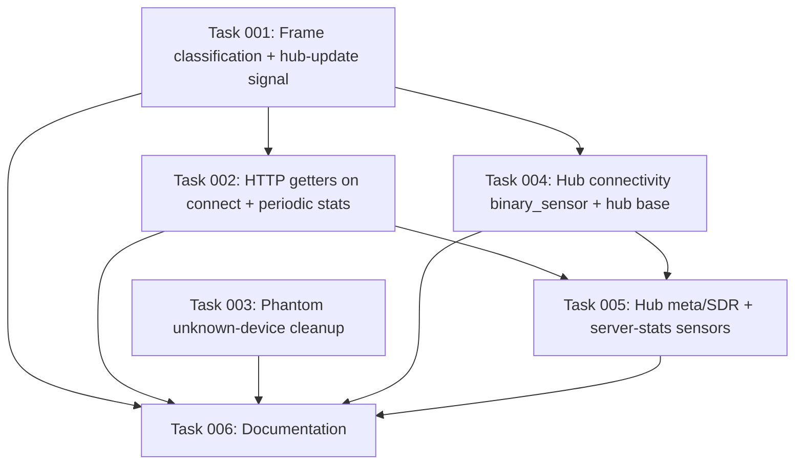

# Plan: Hub Observability + WebSocket Frame Routing

## Original Work Order

> Plan A — "Hub observability + frame routing" for the rtl_433 Home Assistant integration (custom_components/rtl_433).
>
> This plan covers a correctness fix plus three hub-level features that build on it. Scope:
>
> 1. FRAME-ROUTING FIX (bug). Today coordinator/base.py `_handle_text_frame` runs EVERY JSON-object frame through `normalize()`, which keys on `model`. The WebSocket API (see WEBSOCKET_API.md) also pushes non-event frames that have NO `model`: the `meta` object on connect, periodic state/stats frames, RPC `{"result":...}`/`{"error":...}` responses, and `{"shutdown":"goodbye"}` on server shutdown. These all normalize to device_key="unknown", which (a) fires new_device_callback("unknown","") and persists a phantom "unknown" device into entry.data[CONF_DEVICES] (__init__.py:404 calls async_upsert_device unconditionally), and (b) pollutes coordinator.seen_fields with meta field names (frequencies, hop_times, center_frequency, samp_rate, ...) so they surface as misleading unmatched_field_keys in diagnostics. Fix: classify incoming frames by shape and only treat decoded-device frames (those with a `model` key, or at least an identity key) as events; route meta/stats/result/error/shutdown frames to dedicated handlers (or ignore). Add tests — there is currently NO test covering these frame types.
>
> 2. HUB CONNECTIVITY binary_sensor (#1). The coordinator already tracks self.connected but nothing surfaces it. Add a binary_sensor with device_class=connectivity on the hub device, reflecting WebSocket connection state, flipped proactively on the {"shutdown":"goodbye"} frame (depends on the frame-routing fix). This gives an immediate "server up/down" signal instead of waiting for every device's availability timeout.
>
> 3. HUB META / SDR diagnostic sensors (#2). Parse the `meta` frame pushed on connect (center_frequency, samp_rate, conversion_mode, hop times, frequencies, stats_interval, etc.) and optionally the getters (get_gain, get_center_frequency, get_sample_rate, get_ppm_error, get_hop_interval, get_dev_info) and surface them as EntityCategory.DIAGNOSTIC sensors (or attributes) on the hub device.
>
> 4. HUB STATS sensors (#3). Consume the state/stats frames (and/or get_stats) — events decoded, frames, throughput — as diagnostic sensors on the hub device for observability.
>
> Key context: this is a local_push HA custom integration (manifest integration_type=hub, iot_class=local_push). Platforms today are SENSOR + BINARY_SENSOR (const.py PLATFORMS). The hub device is registered in __init__.py async_setup_entry with identifiers={(DOMAIN, entry.entry_id)}. Coordinator is a plain push class (coordinator/base.py), not a DataUpdateCoordinator. Tests live in tests/ (test_coordinator.py, etc.) and use pytest-homeassistant-custom-component; run `uv run pytest tests/`. The integration follows HA Quality Scale conventions. Do NOT issue control commands over the streaming WebSocket — this plan is read-only/observability only.

## Plan Clarifications

| Question | Decision |
| --- | --- |
| How should meta/SDR values (#2) be represented? | **Individual DIAGNOSTIC sensors** — one per scalar (center frequency, sample rate, frequency correction/ppm, gain, hop interval, conversion mode). Array-valued fields (`frequencies`, `hop_times`) become extra-state attributes on a relevant sensor rather than their own entities. |
| Where do #2/#3 get their data? | **Active getters over HTTP.** On (re)connect the coordinator fetches the getters via one-shot HTTP GETs to the server's `/cmd` endpoint (never over the streaming WebSocket): `get_meta`, `get_gain`, `get_ppm_error` for #2, and `get_stats` for #3. `get_stats` is refreshed periodically (only while connected) so the throughput sensors stay live. The streaming WebSocket remains strictly read-only/event-streaming. |
| How to handle phantom "unknown" devices already persisted in existing installs? | **Clean up existing too.** On setup, idempotently drop any persisted `"unknown"` record from `entry.data[CONF_DEVICES]` and remove a stale `"unknown"` registry device and its entities, in addition to preventing new ones via the frame-routing fix. |
| *(refinement)* How is the `/cmd` URL built? | **Server root.** Always `scheme://host:port/cmd` (https when the hub is `secure`/wss), independent of the configured WebSocket path. The rtl_433 server routes `/cmd` only at the exact root path, while WS works on any path. If a reverse proxy does not expose `/cmd`, the meta/stats/gain/ppm sensors stay `unknown` and the event stream + connectivity sensor keep working (graceful degradation). |
| *(refinement)* `get_meta` has no gain/ppm — make extra getter calls? | **Yes.** `meta_data()` in the server contains `center_frequency`, `samp_rate`, `conversion_mode`, `frequencies[]`, `hop_times[]`, `duration`, and `report_*` flags — but **not** gain or ppm. So on connect the coordinator additionally calls `get_gain` (string; empty ⇒ "auto") and `get_ppm_error` (int) to populate those two sensors. Hop interval is taken from `meta.hop_times[0]`. |
| *(refinement)* Which `get_stats` values become sensors? | **Counters + per-protocol attribute.** Sensors: *Decoded events* (`frames.events`, `state_class=total_increasing`), *OOK frames* (`frames.count`), *FSK frames* (`frames.fsk`), *Enabled decoders* (`enabled`). The per-protocol `stats[]` array and the tz-naive `since` string are exposed as **attributes** on the Decoded-events sensor (not as their own entities; `since` is not made a timestamp sensor because it carries no timezone). |
| *(refinement)* Event-frame classifier | **`model` OR identity key.** A frame is a decoded-device event if it has a `model` key **or** any identity key (`id`/`channel`/`subtype`) — this preserves the normalizer's support for model-less identity events. A `shutdown` frame drives connectivity; all other non-event frames (`meta`/state/`result`/`error`) are ignored on the socket, since #2/#3 are sourced via HTTP getters. |

## Executive Summary

The integration today is a one-way consumer of the rtl_433 WebSocket event
stream: every JSON object it receives is normalized as if it were a decoded
device event. The WebSocket API also pushes non-event frames (a `meta` object on
connect, periodic state/stats frames, RPC responses, and a shutdown notice),
most of which carry no `model` key. These currently normalize to a single
`"unknown"` device key, which creates a phantom "unknown" device record and
pollutes the diagnostics' `unmatched_field_keys` with SDR-config field names.
This plan first fixes that classification bug, then builds three hub-level
observability features on top of the now-clean frame routing.

The approach keeps the streaming socket read-only. Frames are classified by
shape — a frame with a `model` key or any identity key (`id`/`channel`/`subtype`)
is a decoded-device event, a `shutdown` frame toggles connectivity, and
everything else is ignored. Hub configuration and server statistics are obtained
deterministically by issuing getters as one-shot HTTP GETs to the server's
`/cmd` endpoint at `scheme://host:port/cmd` (the same command set as the
WebSocket, on a separate transport): `get_meta` plus `get_gain` and
`get_ppm_error` for the SDR/meta sensors, and `get_stats` for the server-stats
sensors. A new hub-update dispatcher signal lets statically-registered hub
entities reflect connection state, SDR/meta configuration, and server stats on
the existing hub device.

The result is an immediate "server up/down" signal, a diagnostic view of what
the SDR is actually tuned to (including gain and ppm, which are *not* in the meta
object and require their own getters), a live throughput view for the receiver,
and the removal of a misleading phantom device — all while preserving the
integration's local-push character for the device event stream itself.

## Context

### Current State vs Target State

| Current State | Target State | Why? |
| --- | --- | --- |
| `_handle_text_frame` normalizes every JSON object as a device event. | Frames are classified by shape; only frames with `model` or an identity key are treated as events. | Non-event frames must not be mistaken for devices; model-less identity events must still be kept. |
| `meta`/stats/`result`/`error`/`shutdown` frames create a phantom `"unknown"` device and persist it to `entry.data[CONF_DEVICES]`. | These frames never create or persist a device; a `shutdown` frame updates connectivity instead. | Eliminates a phantom device and its entities. |
| Meta field names (`frequencies`, `samp_rate`, …) enter `seen_fields` and appear as `unmatched_field_keys` in diagnostics. | Only real device measurement fields enter `seen_fields`. | Diagnostics stop suggesting SDR config as mappable device fields. |
| Existing installs may already hold a persisted `"unknown"` device. | On setup, a one-time idempotent cleanup removes it and any stale registry objects. | Existing users are not left with a stale phantom device. |
| `coordinator.connected` is tracked but never surfaced. | A hub `connectivity` binary_sensor reflects it and flips proactively on `shutdown`. | Immediate server up/down signal without waiting on per-device timeouts. |
| The SDR's tuned configuration is invisible in HA. | Individual DIAGNOSTIC sensors on the hub show center frequency, sample rate, conversion mode, hop interval (from meta), gain (`get_gain`), and ppm (`get_ppm_error`). | Operators can see what the receiver is actually doing. |
| Receiver throughput/health is invisible in HA. | DIAGNOSTIC sensors on the hub show decoded events, OOK/FSK frame counts, and enabled-decoder count from `get_stats`. | Observability for tuning antenna placement and spotting decode regressions. |

### Background

- The coordinator (`coordinator/base.py`) is a plain push class, not a
  `DataUpdateCoordinator`. It owns the WebSocket lifecycle, per-device runtime
  state, and an availability watchdog running on a 30 s `async_track_time_interval`.
- The hub device is registered in `__init__.py:async_setup_entry` with
  `identifiers={(DOMAIN, entry.entry_id)}`; nested RF devices link to it via
  `via_device`. Hub entities will attach to this same hub device.
- Entity platforms (`sensor.py`, `binary_sensor.py`) currently build only
  *per-device* entities through `entity.py:async_setup_hub_platform`, driven by
  `entry.data[CONF_DEVICES]` and per-device dispatcher signals.
- The data-source decision deliberately puts the getters on the `/cmd` HTTP
  endpoint, not the streaming WebSocket, so the streaming socket carries only
  inbound event frames and the "no commands on the streaming socket" constraint
  holds. Because #2/#3 are HTTP-sourced, the pushed `meta`/state frames are not
  consumed at all — they are simply ignored by the classifier.
- The exact server payloads were verified against the rtl_433 C source
  (`merbanan/rtl_433/src/http_server.c` and `r_api.c`); see the **Data
  Contracts** subsection below.
- The server binds unauthenticated by default; the integration sends no
  credentials, consistent with current behavior.

## Architectural Approach

The work has two layers: a coordinator layer (frame classification, hub runtime
state, HTTP getters, a hub-update signal) and an entity layer (statically
registered hub entities that render that state). The connectivity sensor depends
on the frame-routing fix (for the `shutdown` path); the meta and stats sensors
depend on the HTTP getters and the hub-update signal.



### Frame Classification and Routing
**Objective**: Stop non-event frames from being treated as devices, which is the
root correctness fix and the prerequisite for the connectivity sensor's
proactive shutdown path.

The frame handler in the coordinator gains a small classifier that inspects each
parsed JSON object before any normalization. A frame is treated as a
decoded-device event when it has a `model` key **or** any identity key
(`id` / `channel` / `subtype`); such frames follow the existing event path
unchanged, which preserves the normalizer's support for model-less,
channel/id-only devices (*refinement clarification*). A frame carrying a
`shutdown` key updates connectivity state and is otherwise dropped. Any other
object — the `meta` object, periodic state/stats frames, and RPC
`{"result":...}` / `{"error":...}` responses — is dropped without normalization,
so it never derives a device key, never invokes the new-device callback, and
never adds keys to `seen_fields`. Because #2/#3 are sourced over HTTP, no pushed
non-event frame needs a handler other than `shutdown`.

### Hub Runtime State and Update Signal
**Objective**: Give hub entities a single, well-defined source of truth and a
push notification when it changes, mirroring the existing per-device dispatcher
pattern.

The coordinator gains hub-scoped runtime state: the latest meta/SDR
configuration (assembled from `get_meta` + `get_gain` + `get_ppm_error`) and the
latest server-stats payload (`get_stats`), alongside the existing `connected`
flag. A new hub-level dispatcher signal (formatted per hub entry, like the
existing `signal_device_update` / `signal_new_device` helpers in `const.py`) is
emitted whenever connectivity, meta, or stats change. Hub entities subscribe to
this one signal and read the coordinator's hub state, exactly as per-device
entities read `coordinator.devices`.

### On-Connect HTTP Getter Seeding
**Objective**: Obtain SDR configuration and server statistics deterministically,
independent of whether the server is configured to push state frames, without
sending commands over the streaming socket.

On each successful WebSocket (re)connect the coordinator issues one-shot HTTP
GETs to `scheme://host:port/cmd` (https when `secure`/wss), using the shared
Home Assistant aiohttp client session and the hub's host/port/secure settings.
The URL is built from host/port only — never the configured WS path — because
the server routes `/cmd` exclusively at the root path (*refinement
clarification*). The getters issued are:

- `get_meta` — the meta object (see Data Contracts).
- `get_gain` — gain string (empty string ⇒ presented as "auto").
- `get_ppm_error` — integer ppm.
- `get_stats` — the statistics report.

`get_stats` is additionally re-fetched on a fixed-interval timer (a module
constant) **only while connected**, so the throughput sensors stay live; the
meta getters are fetched on connect only, since SDR configuration does not
change on its own at runtime. Each getter response updates the hub state and
triggers the hub-update signal. Getter failures (including a proxy that does not
expose `/cmd`) are logged at debug and leave the previous values intact; they
never disturb the event stream or the connect loop.

### Hub Connectivity binary_sensor
**Objective**: Surface connection state immediately.

A single `connectivity`-class binary_sensor is registered on the hub device. Its
state follows `coordinator.connected`: on when the WebSocket is open, off when
the connect loop is between attempts or after a `shutdown` frame. The entity
itself remains available regardless of connection state (it is reporting that
state), so it does not participate in the per-device availability/timeout model.

### Hub Meta / SDR Diagnostic Sensors
**Objective**: Show what the SDR is tuned to.

Individual `EntityCategory.DIAGNOSTIC` sensors are registered on the hub device:

- **Center frequency** — `meta.center_frequency` (Hz; frequency device class).
- **Sample rate** — `meta.samp_rate` (Hz).
- **Conversion mode** — `meta.conversion_mode` (integer enum: 0 native / 1 si /
  2 customary; exposed as the integer, mapping documented).
- **Hop interval** — `meta.hop_times[0]` (seconds; absent ⇒ unknown).
- **Gain** — `get_gain` string; an empty string is presented as "auto".
- **Frequency correction (ppm)** — `get_ppm_error` integer.

The array-valued `meta.frequencies` and `meta.hop_times` are exposed as
extra-state attributes on the center-frequency (or hop-interval) sensor rather
than as their own entities. Meta/SDR sensors retain their last value while
disconnected; the connectivity sensor signals staleness.

### Hub Server-Stats Sensors
**Objective**: Show receiver throughput/health.

`EntityCategory.DIAGNOSTIC` sensors on the hub device, sourced from `get_stats`:

- **Decoded events** — `frames.events`, `state_class=total_increasing`
  (cumulative since the server's `since`; tolerates the server's periodic
  counter reset).
- **OOK frames** — `frames.count`.
- **FSK frames** — `frames.fsk`.
- **Enabled decoders** — `enabled`.

The per-protocol `stats[]` array and the `since` string are exposed as
extra-state attributes on the Decoded-events sensor. `since` is **not** made a
timestamp sensor because the server formats it without a timezone offset
(`%Y-%m-%dT%H:%M:%S`), which would be ambiguous to parse.

### Existing Phantom-Device Cleanup
**Objective**: Remove the phantom device that prior versions may have persisted.

During hub setup, an idempotent cleanup removes any `"unknown"` key from
`entry.data[CONF_DEVICES]` (writing the entry back only if it changed) and, if a
device-registry device with identifier `(DOMAIN, f"{entry_id}:unknown")` exists,
removes it along with its entities. Because the frame-routing fix prevents
recreation, this runs safely on every setup and converges to a clean state after
one run.

## Data Contracts

Verified against the rtl_433 C source (`http_server.c`, `r_api.c`). Task
generators should treat these as the parsing contract; read all fields
defensively (missing keys ⇒ the corresponding sensor is `unknown`).

**`get_meta`** (`meta_data()`): `frequencies` (int array), `hop_times` (int
array), `center_frequency` (int), `duration` (int), `samp_rate` (int),
`conversion_mode` (int), `fsk_pulse_detect_mode` (int),
`after_successful_events_flag` (int), and the `report_*` flags plus
`stats_interval` (int). **No `gain`, no `ppm_error`, no scalar `hop_interval`.**

**`get_gain`**: returns the gain string (e.g. `"32.8"`; empty string ⇒ auto).
**`get_ppm_error`**: returns an integer.
**`get_hop_interval`**: returns `hop_times[0]` (we read this from the meta array
instead of a separate call).

**`get_stats`** (`create_report_data(cfg, 2)`):

```
{
  "enabled": <int>,                  // number of enabled decoders
  "since":   "YYYY-MM-DDTHH:MM:SS",  // tz-naive window start
  "frames":  { "count": <ook>, "fsk": <fsk>, "events": <total events> },
  "stats":   [ { "device": <num>, "name": <str>, "events": <int>,
                 "ok": <int>, "messages": <int>, "fail_*"/"abort_*": <int> }, ... ]
}
```

The `/cmd` endpoint executes one command per request and returns the getter's
JSON as the response body; each getter above is a separate GET.

## Risk Considerations and Mitigation Strategies

<details>
<summary>Technical Risks</summary>

- **`/cmd` unreachable behind a reverse proxy** (the `/ws` default hints at a
  proxy; `/cmd` is only at the server root).
    - **Mitigation**: Getter failures are caught, logged at debug, and leave
      prior values intact; the event stream and connectivity sensor (driven by
      the WebSocket itself) are unaffected, so the hub still functions.
- **`get_stats` / `get_meta` payload shape varies across rtl_433 builds.**
    - **Mitigation**: Parse against the documented Data Contracts; treat missing
      keys as `unknown`; never assume a key is present.
- **`since` is timezone-naive and `gain` may be empty.**
    - **Mitigation**: Expose `since` as an attribute (not a timestamp sensor);
      present empty `gain` as "auto".
- **`frames.*` counters reset on the server's stats cycle.**
    - **Mitigation**: Use `state_class=total_increasing` for Decoded events so
      HA handles resets.
</details>

<details>
<summary>Implementation Risks</summary>

- **Hub entities are a new shape in the entity platforms** (one-per-hub, static)
  alongside the existing per-device dynamic setup.
    - **Mitigation**: Register hub entities once during platform setup, attached
      to the existing hub device identifiers; keep them independent of the
      per-device `async_setup_hub_platform` flow.
- **Cleanup touching the device/entity registry could remove the wrong objects**.
    - **Mitigation**: Target only the `(DOMAIN, f"{entry_id}:unknown")`
      identifier; make the operation idempotent; never touch the hub device or
      real nested devices.
- **Periodic `get_stats` polling could be seen as scope beyond a pure push
  integration.**
    - **Mitigation**: A single fixed-interval timer, only while connected, with
      no user-facing option; documented as the mechanism that keeps stats live.
- **Per-connect getter burst** (4+ GETs on every reconnect).
    - **Mitigation**: Getters are small and sequential off the connect path;
      reconnect uses the existing capped backoff so bursts are bounded.
</details>

<details>
<summary>Quality Risks</summary>

- **Regression in the existing device-event path** while refactoring frame
  handling, including dropping legitimate model-less identity events.
    - **Mitigation**: The event path is preserved for `model`-or-identity-key
      frames; add tests that assert meta/stats/result/error/shutdown frames
      produce no device and no `seen_fields` pollution, that a model-less
      identity event (e.g. `{"channel": 1, ...}`) still creates its device, and
      that a normal `model` event is unchanged.
</details>

## Success Criteria

### Primary Success Criteria
1. Feeding the coordinator a `meta` object, a state/stats frame, an RPC
   `result`/`error` frame, and a `{"shutdown":"goodbye"}` frame creates no
   device, persists nothing to `entry.data[CONF_DEVICES]`, and adds nothing to
   `coordinator.seen_fields`; a normal `model`-bearing event and a model-less
   identity event (`id`/`channel` present) both still create their device.
2. A hub `connectivity` binary_sensor exists on the hub device, reads "connected"
   while the socket is open, and flips to "disconnected" on a `shutdown` frame
   and while the connect loop is retrying.
3. Hub DIAGNOSTIC sensors for center frequency, sample rate, conversion mode, and
   hop interval reflect `get_meta`; **Gain** reflects `get_gain` (empty ⇒ "auto")
   and **Frequency correction (ppm)** reflects `get_ppm_error`;
   `frequencies`/`hop_times` are present as attributes; all getters target
   `scheme://host:port/cmd`.
4. Hub DIAGNOSTIC sensors reflect `get_stats`: Decoded events
   (`frames.events`, total_increasing), OOK frames (`frames.count`), FSK frames
   (`frames.fsk`), Enabled decoders (`enabled`); per-protocol `stats[]` and
   `since` are attributes; the events sensor refreshes on the interval timer
   while connected.
5. On a config entry that previously held an `"unknown"` device record, setup
   removes it (and any stale registry device/entities); re-running setup is a
   no-op.
6. `uv run pytest tests/` passes, including new tests for frame classification
   (events, model-less identity events, shutdown, and ignored frames), the
   connectivity sensor, the HTTP getters (meta/gain/ppm/stats), and the cleanup.

## Self Validation

After all tasks are complete, perform these concrete checks:

1. Run `uv run pytest tests/` and confirm the full suite passes, including the
   new frame-classification, connectivity, getter, and cleanup tests.
2. Run `uv run ruff check custom_components/rtl_433` (and the project's
   pre-commit config) and confirm no new lint violations.
3. With the test fixtures, feed the coordinator, in sequence, a `meta` object, a
   stats frame, an RPC `result` frame, a `shutdown` frame, a model-less identity
   event, and one real `model` event; assert exactly two devices exist (the
   identity event and the model event), neither key is `"unknown"`, and
   `seen_fields` contains only those events' measurement fields.
4. Drive mocked `/cmd` HTTP responses for `get_meta`, `get_gain`,
   `get_ppm_error`, and `get_stats` through the getter path and assert: the
   meta/SDR sensors (including Gain="auto" for an empty string and the ppm value)
   and the stats sensors (Decoded events / OOK / FSK / Enabled decoders) populate
   from the documented payload shapes, and the hub-update signal fires.
5. Assert the getter URL resolves to `http(s)://host:port/cmd` regardless of the
   configured WS path, and that a getter HTTP failure leaves prior sensor values
   intact and does not affect the connectivity sensor.
6. Construct a config entry whose `data[CONF_DEVICES]` contains an `"unknown"`
   record, run setup, and assert the record is gone and a second setup makes no
   further change.
7. Inspect the diagnostics export for a hub that has received meta/stats frames
   on the socket and confirm `unmatched_field_keys` no longer lists meta field
   names such as `frequencies`, `samp_rate`, or `center_frequency`.

## Documentation

- **README.md** — add the new hub-level entities (connectivity, SDR/meta
  diagnostics including gain & ppm, server stats) to the feature list and/or a
  short "Hub entities" subsection; note that stats reflect `get_stats` and
  refresh periodically, and that the hub sensors require the server's `/cmd`
  endpoint to be reachable at `host:port/cmd`.
- **AGENTS.md** — record the frame-classification contract (a frame is an event
  iff it has `model` or an identity key; only `shutdown` is otherwise handled),
  that hub meta/stats come from `/cmd` HTTP getters at the server root, the exact
  getter set (`get_meta` + `get_gain` + `get_ppm_error` + `get_stats`), and the
  Data Contracts, so future changes preserve them.
- **WEBSOCKET_API.md** — optionally enrich: the current doc does not enumerate
  the `get_stats` payload or note that gain/ppm are absent from `get_meta`; the
  Data Contracts here can be folded in. Not strictly required.

## Resource Requirements

### Development Skills
- Home Assistant custom-component development (config entries, entity platforms,
  device/entity registries, dispatcher signals, `EntityCategory`/device classes).
- Async Python with `aiohttp` (WebSocket and HTTP client via the shared HA
  session).
- `pytest` with `pytest-homeassistant-custom-component`.

### Technical Infrastructure
- Existing test harness (`uv run pytest tests/`) and fixtures in `tests/`.
- `ruff` and the repository pre-commit configuration.
- The verified Data Contracts (above) as the parsing contract; no live SDR
  required for unit tests.

## Integration Strategy

Hub entities attach to the already-registered hub device, so they appear under
the existing hub in Settings → Devices & Services with no new config entry or
config-flow change. The per-device event pipeline is untouched apart from the
frame classifier guarding its entry. The HTTP getters reuse the hub's existing
connection parameters and the shared HA aiohttp session, targeting the server
root `/cmd`.

## Notes

- The periodic `get_stats` refresh is the one element that goes modestly beyond
  the literal work order (which says "consume the state/stats frames"); it is
  included because connect-time-only stats would not give meaningful throughput
  observability. It is a single fixed-interval timer, only while connected, with
  no user option, and can be dropped if the reviewer prefers strictly
  connect-time seeding.
- This plan is read-only/observability only. Live SDR control (set frequency,
  gain, etc.) and per-protocol enable/disable are explicitly out of scope and
  belong to a separate effort.
- Auth/TLS to the `/cmd` endpoint follows the same posture as the WebSocket: no
  credentials are sent; users needing access control front rtl_433 with a
  reverse proxy.

### Decision Log
- `/cmd` URL is the server root `scheme://host:port/cmd`, not WS-path-relative;
  graceful degradation when a proxy hides it.
- Gain and ppm are sourced from `get_gain` / `get_ppm_error` (they are absent
  from `get_meta`); hop interval comes from `meta.hop_times[0]`.
- Stats sensors are a fixed set (events/OOK/FSK/enabled) with `stats[]` and
  `since` as attributes; `since` is not a timestamp sensor (tz-naive).
- Event classifier keys on `model` OR identity key, preserving model-less
  identity events.

### Change Log
- 2026-05-26: Refinement pass. Corrected meta sourcing (gain/ppm require
  `get_gain`/`get_ppm_error`, not `get_meta`); pinned the exact `get_stats`
  sensor set and payload shape; fixed the frame classifier to include identity
  keys; locked the `/cmd` URL to the server root; added a verified **Data
  Contracts** section and this Decision/Change Log. Verified all payload shapes
  against the rtl_433 C source.

## Execution Blueprint

**Validation Gates:**
- Reference: `.ai/task-manager/config/hooks/POST_PHASE.md`

### Dependency Diagram



No circular dependencies; every task appears in exactly one phase below.

### ✅ Phase 1: Coordinator core fix + setup cleanup
**Parallel Tasks:**
- ✔️ Task 001: Coordinator frame classification, hub-update signal, and connectivity state (no deps; edits `const.py`, `coordinator/base.py`, `tests/test_coordinator.py`)
- ✔️ Task 003: Phantom "unknown" device cleanup on hub setup (no deps; edits `__init__.py`, `tests/test_lifecycle.py`)

### ✅ Phase 2: HTTP getters + connectivity entity
**Parallel Tasks:**
- ✔️ Task 002: Coordinator HTTP getters (/cmd) on connect + periodic stats refresh (depends on: 001; edits `coordinator/base.py`, coordinator tests)
- ✔️ Task 004: Hub connectivity binary_sensor + hub entity base (depends on: 001; edits `entity.py`, `binary_sensor.py`, `tests/test_lifecycle.py`)

### Phase 3: Hub diagnostic sensors
**Parallel Tasks:**
- Task 005: Hub meta/SDR + server-stats diagnostic sensors (depends on: 002, 004; edits `sensor.py`, `tests/test_lifecycle.py`)

### Phase 4: Documentation
**Parallel Tasks:**
- Task 006: README hub entities + AGENTS frame/getter contracts (depends on: 001, 002, 003, 004, 005; edits `README.md`, `AGENTS.md`, optionally `WEBSOCKET_API.md`)

### Post-phase Actions
After each phase: run `uv run ruff check custom_components/rtl_433` and the
phase's tests (`uv run pytest tests/`), then create one conventional commit for
the phase. Mark the phase ✅ and its tasks ✔️ / `completed` before advancing.

### Execution Summary
- Total Phases: 4
- Total Tasks: 6
