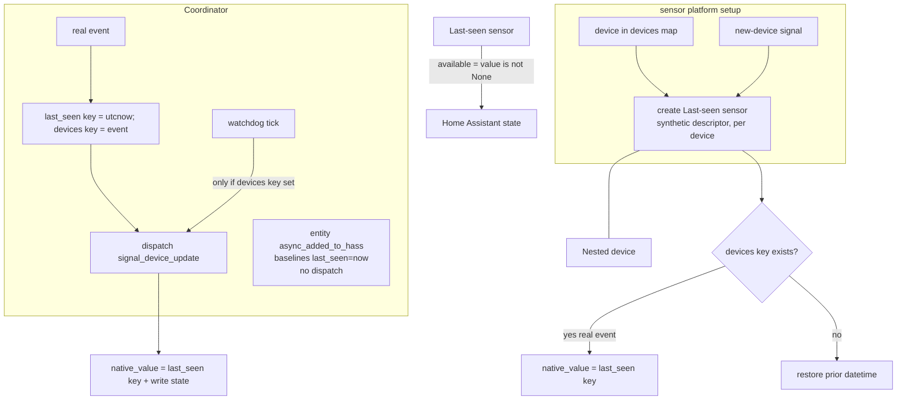
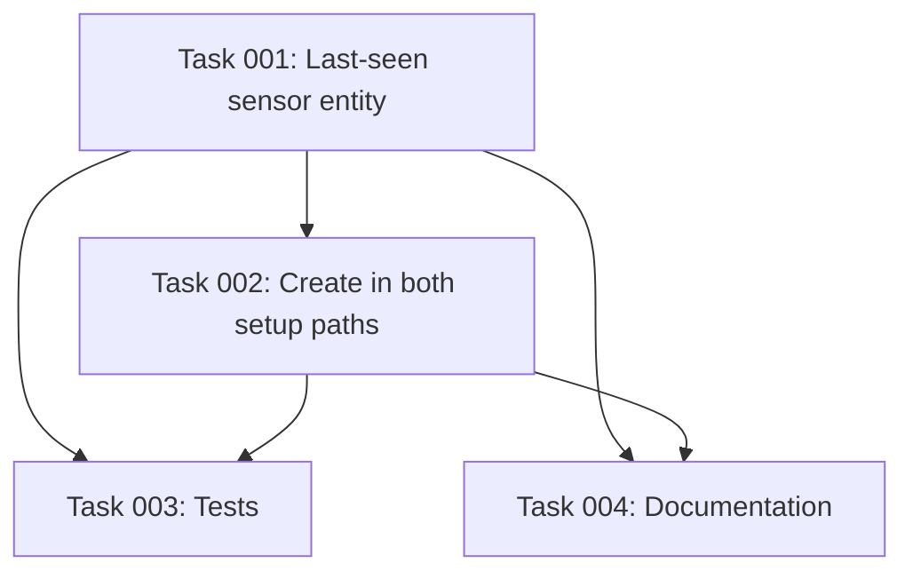

# Plan: Per-Device "Last Seen" Sensor

## Original Work Order

> Plan B — "Per-device Last-seen sensor" for the rtl_433 Home Assistant integration (custom_components/rtl_433).
>
> Scope: add a per-device diagnostic sensor with device_class=timestamp named "Last seen" that reports the UTC datetime each RF device was last heard from. For RF devices that announce presence only by transmitting, "when did we last hear from this?" is one of the most useful things to graph/alert on.
>
> Key context and existing hooks:
> - The coordinator (coordinator/base.py) ALREADY maintains self.last_seen: dict[str, datetime] (UTC) per device_key, updated in _process_event on every event (base.py:143, ~line 290). It also fires the per-device dispatcher signal signal_device_update(entry_id, device_key) on every event (and on watchdog availability changes).
> - Per-device entities are built by entity.py:async_setup_hub_platform, which is shared by sensor.py and binary_sensor.py. Entities are created from entry.data[CONF_DEVICES] (the devices map) + coordinator.device_fields, and new fields are added dynamically via the signal_device_update listener. Each entity subscribes via async_dispatcher_connect to signal_device_update and updates on dispatch (see Rtl433Entity in entity.py: _handle_dispatch / _apply_value, and the available property which compares dt_util.utcnow() - last_seen to the effective timeout).
> - This is a local_push integration. The Last-seen sensor is NOT driven by a mapping-library field (it is not an rtl_433 measurement field); it is a synthetic per-device diagnostic entity derived from coordinator.last_seen[device_key]. So it must be created for EVERY device unconditionally (every device has a last_seen), not gated on observed mapped fields — unlike the measurement sensors which require a matching FieldDescriptor.
> - The sensor should restore its last value across restarts (RestoreEntity / RestoreSensor pattern, consistent with how measurement sensors restore — see sensor.py _async_restore_state and entity.py).
> - unique_id convention is f"{entry.entry_id}:{device_key}:{object_suffix}" (entity.py:311). Pick a stable object_suffix like "last_seen".
> - Tests live in tests/ (test_mapping.py, test_coordinator.py, etc.), use pytest-homeassistant-custom-component; run `uv run pytest tests/`. Follow HA Quality Scale conventions.
>
> Out of scope: hub-level entities, frame routing, stats, event platform (those are separate plans). Keep it minimal and additive: one new diagnostic timestamp sensor per device.

## Plan Clarifications

| Question | Decision |
| --- | --- |
| Should the Last-seen sensor stay available after the device goes silent, or follow the per-device availability timeout like the measurement sensors? | **Always available.** Once it has a value, the Last-seen sensor remains available and keeps showing the last-seen timestamp even after the device's availability timeout elapses, so "last_seen older than X" automations and staleness dashboards keep working. This intentionally overrides the base entity's timeout-based availability. |
| Backwards compatibility / migration? | None required. The change is purely additive — a new diagnostic sensor appears for each existing and future device on the next setup. No schema or config-entry migration. |
| *(refinement)* How is the displayed value sourced so restore survives the base's startup baselining? | The sensor holds its **own** `native_value` (a datetime). It seeds from `coordinator.last_seen[device_key]` **only when** `coordinator.devices[device_key]` exists (i.e. a *real* event has been seen this session); otherwise it restores the prior timestamp from its last state. It updates to `coordinator.last_seen[device_key]` on each dispatch. It must **not** display the base's `async_added_to_hass` baseline (which sets `last_seen = utcnow()` on add), or every restart would show "now" instead of the true prior time. |
| *(refinement)* How is the timestamp restored, given `device_class=timestamp` needs a tz-aware datetime? | Restore via **RestoreSensor** (its `native_value` round-trips as a datetime) or by parsing the prior ISO state with `dt_util.parse_datetime` into a tz-aware datetime. The existing string-assignment restore in `sensor.py:_async_restore_state` is insufficient for a timestamp sensor and is not reused as-is. |
| *(refinement)* How is the entity built, given `Rtl433Entity.__init__` requires a `FieldDescriptor`? | Construct a **synthetic** sensor `FieldDescriptor` (sentinel `field_key`, `platform="sensor"`, `name="Last seen"`, `object_suffix="last_seen"`, `device_class="timestamp"`, `entity_category="diagnostic"`, `enabled_by_default=True`) and a dedicated `Rtl433Entity`/`SensorEntity` subclass that overrides value/restore/dispatch/availability. The synthetic `field_key` never matches an event field, so the base's field-driven `_apply_value` path is bypassed. `object_suffix="last_seen"` must not collide with any library `object_suffix` (it does not; the `time` field uses `UTC`). |
| *(refinement)* Enabled by default? | **Yes** — the feature's purpose is staleness alerting/graphing, so it ships enabled. Reviewer-overridable if per-device entity count is a concern. |

## Executive Summary

RF devices announce their presence only by transmitting, so the single most
useful operational question about each one is "when did we last hear from it?"
The coordinator already records this (`coordinator.last_seen[device_key]`,
updated on every event) and already drives per-device entity updates through the
`signal_device_update` dispatcher — but nothing exposes the timestamp to the
user. This plan adds one synthetic per-device diagnostic sensor,
`device_class=timestamp`, named "Last seen", to surface it.

Unlike the existing measurement sensors, which exist only when a matching device
library field descriptor is found, the Last-seen sensor is not tied to any
rtl_433 field — every device has a `last_seen`, so the sensor is created
unconditionally for every nested device, in both the startup-from-devices-map
path and the dynamic new-device path. Because `Rtl433Entity` is coupled to a
`FieldDescriptor`, the sensor is built from a small synthetic descriptor and a
dedicated subclass that overrides value handling, availability, dispatch, and
restore.

Two correctness details drive the design. First, the base entity's
`async_added_to_hass` baselines `coordinator.last_seen[device_key]` to "now" on
add; the Last-seen sensor must therefore display its **own** value (seeded from a
*real* event when one exists, otherwise restored from the prior state) rather
than reading that shared baseline, or it would show "now" after every restart.
Second, a `timestamp` sensor needs a tz-aware datetime, so restoration uses
RestoreSensor / `dt_util.parse_datetime`, not the raw string assignment the
measurement sensors use. Finally, the sensor stays available even after the
device falls silent and its measurement sensors go `unavailable` — the value is
most useful precisely when a device has stopped reporting.

## Context

### Current State vs Target State

| Current State | Target State | Why? |
| --- | --- | --- |
| `coordinator.last_seen[device_key]` is tracked but never surfaced to the user. | A "Last seen" diagnostic timestamp sensor exposes it per device. | The most useful operational signal for RF devices is currently invisible. |
| All per-device entities are field-driven (require a `FieldDescriptor`). | One synthetic per-device sensor is created from a synthetic descriptor, independent of any mapped field. | Every device has a `last_seen`; the sensor must not depend on library coverage. |
| The base entity baselines `last_seen=now` on add and restores plain string values. | The Last-seen sensor displays its own value (real event → restore → dispatch) and restores a tz-aware datetime. | Avoids showing "now" after restart and satisfies the timestamp device class. |
| When a device goes silent, all its entities become `unavailable`. | Measurement sensors still go `unavailable`; the Last-seen sensor stays available. | Staleness alerts/dashboards need the timestamp exactly when the device is silent. |
| No single value to alert on "device hasn't reported in N minutes". | A timestamp value supports "last_seen older than X" automations directly. | Enables presence/staleness automations without templating availability. |

### Background

- `Rtl433Entity` (`entity.py`) subscribes to `signal_device_update(entry_id, device_key)`
  in `async_added_to_hass`, handles dispatches in `_handle_dispatch`, exposes an
  `available` property based on the silence timeout, and — importantly — in
  `async_added_to_hass` sets `coordinator.last_seen[device_key] = dt_util.utcnow()`
  and `available[device_key] = True` when the coordinator has no entry yet
  (the "restore then time out" baseline). This baseline does **not** dispatch.
- `coordinator.last_seen` is runtime-only; it is empty for every device after a
  restart until that device next transmits (or until the base baselines it).
- `coordinator.devices[device_key]` is set only by `_process_event` on a *real*
  event, so its presence is a reliable "a real event has been seen this session"
  signal that distinguishes a true timestamp from the startup baseline.
- The watchdog (`_async_watchdog`) re-dispatches only when
  `coordinator.devices.get(device_key)` is not `None`, so no dispatch carrying
  the baseline-only state reaches entities before a real event.
- `Rtl433Entity.__init__` requires a `FieldDescriptor` and uses
  `descriptor.object_suffix`, `name`, `entity_category`, `enabled_by_default`,
  and `icon`; `Rtl433Sensor` additionally seeds from `last_event.fields[field_key]`
  and restores via a raw-string assignment — neither applies to a synthetic
  timestamp sensor.
- `entity.py:async_setup_hub_platform` builds entities for both `sensor` and
  `binary_sensor` from the devices map and the new-device signal, with a
  per-device `created` unique_id dedup cache and a `_remove_device` teardown
  registered in `coordinator.device_removers`.

## Architectural Approach

The Last-seen sensor is a new sensor-platform entity that bypasses the
field-descriptor value path but reuses the existing per-device lifecycle
(creation in both setup paths, dedup, removal, dispatcher subscription). It
diverges from the base entity in three deliberate places: value source,
restoration type, and availability.

### Synthetic Last-Seen Sensor Entity
**Objective**: Provide a per-device timestamp entity decoupled from the device
library, built on the shared base without a real field.

A dedicated `Rtl433Entity`/`SensorEntity` subclass is constructed from a
synthetic `FieldDescriptor` (`platform="sensor"`, `name="Last seen"`,
`object_suffix="last_seen"`, `device_class="timestamp"`,
`entity_category="diagnostic"`, `enabled_by_default=True`), giving it the base
identity, `DeviceInfo`/`via_device`, and dispatcher wiring for free while its
sentinel `field_key` ensures the base's field-driven `_apply_value` is never
triggered. `unique_id` follows the convention and ends `:last_seen`.

### Value Sourcing and Update
**Objective**: Always show the *true* last-seen time, never the startup baseline.

The entity holds its own `native_value` (a datetime):

- **At construction**, it seeds `native_value = coordinator.last_seen[device_key]`
  **only if** `coordinator.devices.get(device_key)` is not `None` (a real event
  has been seen this session — e.g. the new-device path, where the entity is
  created right after the event).
- **On `async_added_to_hass`** (after `super()` runs its baseline + dispatcher
  subscription), if `native_value` is still `None`, it restores the prior
  timestamp (see below).
- **On dispatch** (`_handle_dispatch` override), it sets
  `native_value = coordinator.last_seen[device_key]` and writes state. Only real
  events and qualifying watchdog re-dispatches reach this path, both of which
  carry a true `last_seen`; the non-dispatching baseline never does.

### State Restoration
**Objective**: Preserve the true prior timestamp across restarts as a tz-aware
datetime.

On startup, when no real event has been seen yet, the sensor restores its prior
value using **RestoreSensor** (whose `native_value` round-trips as a datetime)
or by parsing the prior ISO state with `dt_util.parse_datetime` into a tz-aware
datetime. This deliberately does not reuse `sensor.py`'s raw-string restore,
which would yield a string where a `timestamp` sensor requires a datetime. The
restored value is shown until the device next transmits, at which point a real
dispatch overwrites it with the fresh time.

### Availability Override
**Objective**: Keep the timestamp readable when the device is silent.

The sensor overrides `available` to be `True` whenever `native_value` is not
`None` (a real/restored timestamp exists), independent of the per-device silence
timeout. This is the central behavioral difference from the measurement sensors
and is what makes the value useful for staleness alerting.

### Unconditional Creation in Both Setup Paths
**Objective**: Ensure exactly one Last-seen sensor per device, present or future,
without depending on mapped fields.

In `async_setup_hub_platform`, when `platform == "sensor"`, one Last-seen sensor
is created per device alongside (and independent of) the field-driven
measurement sensors: once for every device in the startup devices-map iteration,
and once in the new-device handler for a newly observed device. The existing
`created` unique_id dedup cache prevents duplicates, and the existing
`_remove_device` teardown forgets it on device removal so it is recreated cleanly
if the device returns. The `binary_sensor` platform is unchanged and creates no
Last-seen sensor.

## Risk Considerations and Mitigation Strategies

Technical Risks

- **Showing the startup baseline ("now") instead of the restored prior time.**
    - **Mitigation**: Display the entity's own `native_value`; seed from
      `coordinator.last_seen` only when `coordinator.devices[device_key]` exists;
      otherwise restore. Add a test that asserts the post-restart value (before
      any new event) equals the restored prior timestamp, not "now".
- **`timestamp` device class requires a tz-aware datetime.**
    - **Mitigation**: Restore via RestoreSensor / `dt_util.parse_datetime`;
      `coordinator.last_seen` is already `dt_util.utcnow()` (tz-aware).
- **Coupling the synthetic entity to the descriptor-based base.**
    - **Mitigation**: Use a synthetic `FieldDescriptor` and a dedicated subclass;
      keep the sentinel `field_key` out of any real event so the base field path
      is inert.

Implementation Risks

- **Creating the sensor in the wrong platform or twice.**
    - **Mitigation**: Create it only when `platform == "sensor"`; rely on the
      existing `created` unique_id dedup cache and `_remove_device` teardown.
- **`object_suffix` collision with a library field.**
    - **Mitigation**: Use `last_seen`; confirmed not used by any shipped
      descriptor (the `time` field uses `UTC`).

Quality Risks

- **Availability override could mask a genuinely removed device.**
    - **Mitigation**: "Available once it has a value" still reflects removal — a
      removed device's entity is torn down via `_remove_device`; the override
      only decouples availability from the silence timeout, not from entity
      lifecycle.
- **Regression in existing per-device entity setup** while extending the shared
  helper.
    - **Mitigation**: Keep the measurement-sensor path untouched; add tests for
      creation in both paths, value/update behavior, restore-not-baseline,
      always-available, and no creation on binary_sensor.

## Success Criteria

### Primary Success Criteria
1. Every nested device (including one whose events contain no library-mapped
   fields) gets exactly one `device_class=timestamp`, DIAGNOSTIC "Last seen"
   sensor, enabled by default, with `unique_id` ending `:last_seen`.
2. On a fresh real event for a device, the sensor's value equals the coordinator's
   updated `last_seen` (a tz-aware datetime).
3. **After a restart, before any new event arrives, the sensor shows the restored
   prior timestamp — not the startup baseline "now".**
4. After the device's availability timeout elapses with no new event, the device's
   measurement sensors are `unavailable` while the Last-seen sensor is still
   available and shows the prior timestamp.
5. The `binary_sensor` platform creates no Last-seen sensor.
6. `uv run pytest tests/` passes, including new tests for creation in both setup
   paths, the value/update behavior, the restore-not-baseline behavior, the
   availability override, and the timestamp restore type.

## Self Validation

After all tasks are complete, perform these concrete checks:

1. Run `uv run pytest tests/` and confirm the suite passes, including the new
   Last-seen sensor tests.
2. Run `uv run ruff check custom_components/rtl_433` and the repository
   pre-commit config; confirm no new violations.
3. In a test, set up a hub with two devices in the devices map — one with mapped
   measurement fields and one with none — and assert that exactly one
   `:last_seen` sensor exists per device, enabled by default, with
   `device_class=timestamp` and `EntityCategory.DIAGNOSTIC`.
4. Dispatch a fresh event for a device and assert the sensor's native value
   equals the coordinator's updated `last_seen` (datetime); then advance time past
   the effective timeout, trigger the watchdog, and assert the measurement sensors
   report unavailable while the Last-seen sensor remains available with the
   unchanged timestamp.
5. Restore-not-baseline: with a known prior state, add the entity to a hub where
   `coordinator.last_seen` has only the base's `async_added_to_hass` baseline (no
   real event), and assert the sensor reports the **restored prior timestamp**,
   not the baseline "now"; then deliver a real event and assert it updates to the
   new time.

## Documentation

- **README.md** — mention the per-device "Last seen" diagnostic sensor in the
  feature/availability section, noting it stays available after a device goes
  silent (unlike measurement sensors) so it can drive staleness automations.
- **AGENTS.md** — note that the Last-seen sensor is a synthetic, non-field-driven
  per-device entity built from a synthetic descriptor, created unconditionally on
  the sensor platform, with an always-available override and a value sourced from
  the coordinator's `last_seen` (guarded by `coordinator.devices` presence) so it
  never shows the startup baseline; future refactors of `async_setup_hub_platform`
  and the base `async_added_to_hass` baseline must preserve this.
- **WEBSOCKET_API.md** — no change (this plan adds no new API usage).

## Resource Requirements

### Development Skills
- Home Assistant custom-component development: sensor platform, `SensorEntity`,
  `RestoreSensor`/`RestoreEntity`, `device_class=timestamp`, `EntityCategory`,
  dispatcher subscriptions, device registry `DeviceInfo`, and `dt_util`.
- `pytest` with `pytest-homeassistant-custom-component`.

### Technical Infrastructure
- Existing test harness (`uv run pytest tests/`) and fixtures in `tests/`.
- `ruff` and the repository pre-commit configuration.

## Integration Strategy

The sensor attaches to existing nested devices via their current
`DeviceInfo`/identifiers and reuses the per-device dispatcher and lifecycle
hooks, so it appears automatically under every device with no config-flow,
config-entry, or migration changes. It is additive and independent of the device
library and of the other planned hub-level work.

## Notes

- This plan is intentionally narrow: one synthetic diagnostic sensor per device.
  Hub-level entities, frame routing, server stats, and the event platform are
  separate plans and are out of scope here.
- The always-available behavior is one deliberate divergence from the existing
  entity availability model; the own-value/restore-not-baseline behavior is the
  other, and is the subtle correctness point a task generator must implement.

### Decision Log
- Display the sensor's own `native_value`; seed from `coordinator.last_seen` only
  when `coordinator.devices[device_key]` exists; otherwise restore. Never display
  the base `async_added_to_hass` baseline.
- Restore as a tz-aware datetime (RestoreSensor / `dt_util.parse_datetime`), not
  the raw-string assignment used by measurement sensors.
- Build from a synthetic `FieldDescriptor` + dedicated subclass; `object_suffix`
  is `last_seen`.
- Always available once it has a value; enabled by default.

### Change Log
- 2026-05-26: Refinement pass. Identified and fixed two correctness gaps in the
  draft: (1) reading `coordinator.last_seen` directly would show the base
  `async_added_to_hass` startup baseline ("now") after every restart, defeating
  restore — corrected to an own-value design seeded via the `coordinator.devices`
  presence guard; (2) a `timestamp` sensor needs a tz-aware datetime, so restore
  must use RestoreSensor / `dt_util.parse_datetime`, not the string assignment in
  `sensor.py`. Documented the synthetic-descriptor construction, enabled-by-default
  decision, and added a restore-not-baseline success criterion, self-validation
  step, and this Decision/Change Log.

## Execution Blueprint

**Validation Gates:**
- Reference: `.ai/task-manager/config/hooks/POST_PHASE.md`

### Dependency Diagram

### ✅ Phase 1: Synthetic entity
**Parallel Tasks:**
- ✔️ Task 001: Implement the `Rtl433LastSeenSensor` entity + synthetic descriptor (`sensor.py`)

### Phase 2: Lifecycle wiring
**Parallel Tasks:**
- Task 002: Add the `per_device_factory` hook to `async_setup_hub_platform` and create one Last-seen sensor per device in both setup paths (depends on: 001)

### Phase 3: Verification & docs
**Parallel Tasks:**
- Task 003: Integration tests for creation/value/restore-not-baseline/always-available/no-binary-sensor (depends on: 001, 002)
- Task 004: README.md + AGENTS.md documentation (depends on: 001, 002)

### Post-phase Actions
After each phase, run the `POST_PHASE.md` validation gate (`uv run pytest tests/`
and `uv run ruff check custom_components/rtl_433`). Phase 3 tasks run in parallel
but touch disjoint files (`tests/test_lifecycle.py` vs. `README.md`/`AGENTS.md`).

### Execution Summary
- Total Phases: 3
- Total Tasks: 4
