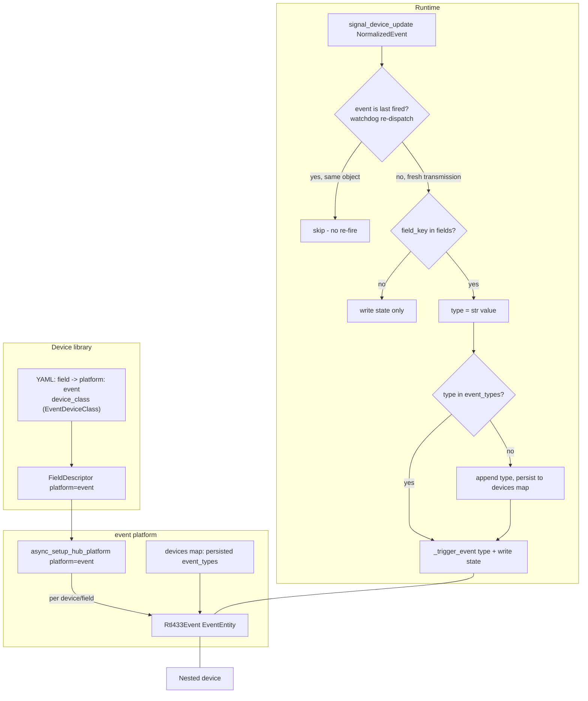

# Plan: Event Entity Platform

## Original Work Order

> Plan C — "Event entity platform" for the rtl_433 Home Assistant integration (custom_components/rtl_433).
>
> Scope: add a third HA entity platform, `event` (homeassistant.components.event.EventEntity), so momentary/one-shot RF transmissions — remote-control button presses, doorbells, PIR/motion triggers, tilt/shock, key fobs — are represented as HA Event entities instead of being forced into binary_sensors that need a faked "off". These RF signals are fire-and-forget: the device transmits when something happens and there is no "off" transmission, which is exactly what HA's `event` entity is designed for.
>
> How the integration works today (key hooks):
> - Device support is DATA-DRIVEN via a YAML device library, not Python. mapping.py defines a FieldDescriptor dataclass with fields including platform (str), device_class (str|None), state_class (str|None), object_suffix, entity_category, etc. lookup(field_key, registry) resolves an rtl_433 field name to a FieldDescriptor. The library is loaded via load_library + load_user_overrides (user overrides at <config>/rtl_433_mappings.yaml), cached on hass.data[DOMAIN][DATA_LIBRARY].
> - const.py PLATFORMS = [SENSOR, BINARY_SENSOR]. Each forwarded platform calls entity.py:async_setup_hub_platform(hass, entry, async_add_entities, platform, entity_cls). That helper builds entities for every device in entry.data[CONF_DEVICES] whose mapped field has descriptor.platform == <this platform>, subscribes to signal_new_device + per-device signal_device_update to add new devices/fields dynamically, and persists observed mapped fields back into the devices map. sensor.py and binary_sensor.py are thin wrappers over it (each defines a platform-specific Rtl433Entity subclass and a PLATFORM constant).
> - Rtl433Entity base (entity.py) subscribes to signal_device_update(entry_id, device_key); _handle_dispatch is called with the NormalizedEvent on each event; _apply_value(raw_value) applies the field value; measurement entities restore state.
>
> Design for the event platform:
> - Add Platform.EVENT to const.py PLATFORMS and create event.py as a thin wrapper over async_setup_hub_platform (same pattern as sensor.py/binary_sensor.py), with an Rtl433Event(EventEntity) subclass.
> - EventEntity requires event_types (the list of possible event values) and fires via _trigger_event(event_type, attributes) + async_write_ha_state. On each dispatch, if the descriptor's field_key is present in the NormalizedEvent.fields, trigger an event whose type is derived from the field value (e.g. a "command"/"event"/"button" field whose value is the button name, or a momentary trigger). Event entities do NOT hold steady state, so the restore pattern used by measurement sensors does NOT apply.
> - The device library (FieldDescriptor / YAML schema) must support platform: event, including how to declare the allowed event_types for a field and an optional event device_class (EventDeviceClass: e.g. doorbell, button, motion). Decide the YAML schema additions needed (e.g. an event_types list and/or device_class) and whether a field's distinct observed values auto-populate event_types or must be declared. This is the main schema-design question.
> - Seed the shipped library with at least one real example mapping that uses platform: event (pick a representative rtl_433 momentary device/field), and document it in docs/device-library.md.
>
> Context: local_push HA custom integration (manifest integration_type=hub). Tests in tests/ (test_mapping.py covers the library/FieldDescriptor schema; test_config_flow, test_coordinator, etc.) use pytest-homeassistant-custom-component; run `uv run pytest tests/`. Follow HA Quality Scale conventions. Docs: docs/device-library.md is the authoritative device-library reference and must be updated for the new platform/schema.
>
> Out of scope: hub-level entities, frame routing, stats sensors, last-seen sensor (separate plans); SDR control; converting existing binary_sensor mappings to events (existing mappings stay as-is unless trivially/representatively migrated as the example).

## Plan Clarifications

| Question | Decision |
| --- | --- |
| How are an event field's `event_types` defined? | **Auto-populated from observed values.** A `platform: event` mapping does not declare a fixed `event_types` list; the entity discovers types from the distinct field values it observes at runtime. To keep the type set stable across restarts (and avoid an entity created with an empty capability list), observed types are persisted per device-field in the hub devices map and used to rebuild the entity on startup. |
| How is the fired event_type derived from the field value? | **Value-as-type, with single-value = momentary.** The raw field value, stringified, is the fired event type. A field that only ever emits one distinct value therefore behaves as a momentary trigger that fires that one type on every transmission (covers doorbell/motion/single-button). `device_class` carries the optional `EventDeviceClass` (doorbell/button/motion). |
| Availability of event entities | **Always available (confirmed, 2026-05-26 refinement).** Event entities stay available rather than going `unavailable` after the per-device silence timeout (events are momentary, so timeout-based unavailability would hide the entity almost all the time). This mirrors the convention for HA event entities and the Last-seen-sensor decision in the sibling plan (04). Implemented by overriding the base `available` property to return `True`. |
| Backwards compatibility / migration | **Additive, no migration.** A new platform, a reused-then-extended descriptor, and a new optional devices-map sub-key. Existing library files, mappings, and config entries are unaffected; no schema version bump. |
| *(refinement)* How many shipped `platform: event` examples, and which? | **Three**, one per `EventDeviceClass`: a remote/key-fob **button** field (`device_class: button`) that demonstrates multi-value auto-population, a PIR/**motion** field (`device_class: motion`) that demonstrates the single-value momentary case, and a **doorbell**-press field (`device_class: doorbell`, also single-value). Each must be a real rtl_433 field currently neither mapped nor in `_skip_keys.yaml`, verified against rtl_433 output during implementation, and collected in a new themed `device_library/events.yaml`. |
| *(refinement)* What attributes does the fired event carry? | **Type only — no extra attributes.** The `event_type` is the stringified field value; `_trigger_event(event_type)` is called with no attribute dict (YAGNI). A future optional attribute payload can be layered on without breaking this. |
| *(refinement)* How does an event entity obtain its persisted `event_types` at construction, given the shared `entity_cls(coordinator, hub_entry_id, device_key, model, descriptor)` signature used by all three platforms? | The entity reads them itself in `__init__` from `coordinator.entry.data[CONF_DEVICES][device_key][DEVICE_EVENT_TYPES][field_key]`, seeding `_attr_event_types` with a **copy** of that list (so in-place growth never mutates the persisted dict). No change to `async_setup_hub_platform` or the shared constructor signature is required. |
| *(refinement)* Does the event entity replay the coordinator's last event on construction, the way `sensor.py`/`binary_sensor.py` seed `_apply_value` from `coordinator.devices[device_key]`? | **No.** Replaying on `__init__` would fire a stale event before the entity is even added to hass. The event entity fires **only on live dispatch**. The last *displayed* event is restored by HA's `EventEntity.async_internal_added_to_hass` (HA-owned, `@final`); the base measurement-restore hook `_async_restore_state` is overridden as a **no-op** for events. |
| *(refinement)* The availability watchdog re-dispatches the cached last event (`coordinator.devices[device_key]`, fields present) when a device goes stale. Won't the base `_handle_dispatch` re-fire that event? | **Yes, so `Rtl433Event` overrides `_handle_dispatch` to dedupe by object identity.** It fires only when the dispatched `NormalizedEvent` is a *different object* than the one it last fired on (`event is self._last_fired_event`). A real repeat transmission is a fresh `normalize()` object (→ fires); a watchdog re-dispatch reuses the same cached object (→ skipped). Identity (`is`), **not** value-equality — a genuine repeat of the same value is a distinct object that must fire. |
| *(refinement)* Can an event entity be created before any value is seen (empty `event_types`)? | **Yes.** HA's `EventEntity` accepts an empty `event_types` at creation (verified in source: `state` is `None`, `capability_attributes` exposes `[]`); only `_trigger_event` rejects a type absent from the list. The entity is therefore created on the normal field-driven path, and a newly seen type is appended to `_attr_event_types` before firing — **no separate deferred-creation path is needed.** |

## Executive Summary

rtl_433 decodes many momentary, fire-and-forget transmissions — remote button
presses, doorbells, motion/PIR triggers, key fobs — that have no "off" state.
The integration currently has only `sensor` and `binary_sensor` platforms, so
these signals either get shoehorned into a binary_sensor with a faked reset or
go unmapped. Home Assistant's `event` entity exists precisely for this shape.
This plan adds a third platform, `event`, driven by the same data-driven device
library, so a YAML mapping with `platform: event` turns a momentary field into a
proper HA Event entity.

Per the schema decisions, event types are not declared up front; the entity
auto-populates its `event_types` from the distinct values it observes, and the
fired type is the stringified field value. A field that only ever emits one
value collapses naturally into a momentary single-type trigger. Because the type
set is value-derived, the observed types are persisted per device-field in the
hub devices map so the entity is rebuilt with its known types after a restart
rather than starting empty. New, never-before-seen values are added to the
entity's `event_types` in place before the event is fired and are persisted for
next time.

The platform reuses the existing per-device lifecycle: `event.py` is a thin
wrapper over `async_setup_hub_platform` (exactly like `sensor.py` /
`binary_sensor.py`), the new `Rtl433Event` entity subclasses the shared base and
HA's `EventEntity`, and it attaches to the same nested device. Event entities
hold no steady measurement state, so the measurement restore path does not apply
and they remain available between events. Crucially, the entity fires **only on a
genuinely new transmission**: it dedupes the coordinator's watchdog re-dispatch
(which re-sends the cached last event to refresh availability) by object
identity, and it does not replay the last event on construction. The fired event
carries the stringified value as its `event_type` and **no extra attributes**.
The shipped library gains **three** representative `platform: event` examples — a
button/remote, a motion/PIR, and a doorbell field — in a new
`device_library/events.yaml`, and `docs/device-library.md` documents the new
platform and schema. The change is additive — no existing mapping or config entry
is altered.

## Context

### Current State vs Target State

| Current State | Target State | Why? |
| --- | --- | --- |
| Only `sensor` and `binary_sensor` platforms exist (`const.py` PLATFORMS). | A third `event` platform is added and forwarded for the hub entry. | Momentary RF signals need an entity type designed for fire-and-forget events. |
| Momentary fields (button/doorbell/motion) must be forced into a binary_sensor with a faked "off", or stay unmapped. | A `platform: event` mapping produces a native HA Event entity. | Removes the awkward faked-reset modelling; matches HA conventions. |
| `FieldDescriptor` / loader supports only sensor + binary_sensor semantics. | The descriptor/loader support `platform: event` (reusing `device_class` for `EventDeviceClass`). | The data-driven library must express event mappings without Python changes. |
| The devices map stores per-device model + observed field keys (+ timeout override). | It additionally stores observed event types per event-field. | Auto-populated `event_types` must persist so entities rebuild with a stable type set. |
| Per-device entities go `unavailable` after the silence timeout. | Event entities stay available between transmissions. | A momentary entity would otherwise be unavailable almost always. |
| The watchdog re-dispatches the cached last event to refresh availability; sensors re-apply it idempotently. | Event entities ignore re-dispatches of an already-fired event (dedupe by object identity). | Re-applying a cached event is harmless for a sensor but would re-fire a momentary HA event. |

### Background

- `async_setup_hub_platform` (`entity.py`) is platform-agnostic: it builds
  entities for descriptors whose `platform` matches the wrapper's `PLATFORM`,
  handles new devices via `signal_new_device`, adds entities for newly observed
  mapped fields via the per-device `signal_device_update` listener, dedupes by
  `unique_id`, and persists observed field keys via `async_upsert_device`.
- `Rtl433Entity` (`entity.py`) owns identity, `DeviceInfo`/`via_device`,
  availability, dispatcher subscription, and `_handle_dispatch` (which calls the
  subclass `_apply_value` when the field is present). Subclasses are thin.
- `FieldDescriptor` accepts attributes by name; `_descriptor_from_entry` ignores
  unknown YAML keys (debug-logged), so adding a known attribute is safe and an
  older loader tolerates a newer file.
- `apply_transform` branches on `descriptor.platform` (`binary_sensor` vs
  sensor); the event platform needs no numeric/boolean transform — the raw value
  is stringified to a type.
- HA's `EventEntity` validates that a fired `event_type` is within
  `event_types`, exposes the type set as state attributes, and restores its last
  event itself; it does not hold steady state.
- The devices map record currently holds `model`, `fields` (sorted field keys),
  and optional `timeout_override`. Adding an optional per-field event-types
  structure is consistent with how `fields` is unioned and persisted.

## Architectural Approach

The work spans three layers: the device library (schema + loader + three
examples), the entity platform (`event.py` wrapper + `Rtl433Event`), and
devices-map persistence for the auto-populated, value-derived types. The entity itself
manages type growth and firing; the platform helper reuses its existing
field-driven creation path.

### Device-Library Schema and Loader Support
**Objective**: Let a YAML mapping declare a momentary field as an event without
Python changes, in the established data-driven style.

A mapping entry with `platform: event` is recognized by the loader. It uses the
existing required attributes (`platform`, `name`, `object_suffix`) and the
optional `device_class` attribute now interpreted as an `EventDeviceClass`
(`doorbell`, `button`, `motion`), plus the usual optional `entity_category`,
`enabled_by_default`, and `icon`. No new required attribute is introduced:
`event_types` are not declared (they are auto-populated), consistent with the
schema decision. `_descriptor_from_entry` already tolerates extra keys, so the
loader change is limited to recognizing the new platform value; descriptors with
`platform: event` flow through `lookup` unchanged.

### Event Platform Wiring
**Objective**: Add the platform with minimal surface, mirroring the existing
platforms.

`Platform.EVENT` is appended to `const.py` `PLATFORMS` so it is forwarded for the
hub entry alongside sensor and binary_sensor. A new `event.py` defines `PLATFORM
= "event"` and `Rtl433Event(Rtl433Entity, EventEntity)`, and its
`async_setup_entry` delegates to `async_setup_hub_platform`, exactly like
`binary_sensor.py`. Entities are created for any device whose observed mapped
field resolves to an `event`-platform descriptor; devices with no event fields
get no event entity.

### Event Entity Behavior
**Objective**: Fire HA events from momentary transmissions with value-derived,
auto-populated types — once per genuine transmission, never on a re-dispatch.

`Rtl433Event(Rtl433Entity, EventEntity)` fires events rather than holding state.
Concrete behavior, grounded in the verified HA `EventEntity` contract:

- **Construction.** `__init__` calls `super().__init__(...)`, sets
  `_attr_device_class` from `descriptor.device_class` (interpreted as an
  `EventDeviceClass`), and seeds `_attr_event_types` with a **copy** of the
  persisted types for this field (see persistence section), or `[]` when none
  exist yet. `_attr_event_types` **must** be set here because HA's `@final`
  `capability_attributes` reads `event_types` and raises if `_attr_event_types`
  is unset. The entity does **not** replay `coordinator.devices[device_key]` the
  way the sensor/binary_sensor constructors do — replaying would fire a stale
  event before the entity is added.
- **Fire path.** The entity **overrides `_handle_dispatch`** (it does not just
  override `_apply_value`) so it can dedupe the watchdog re-dispatch. On dispatch
  it first checks `event is self._last_fired_event`; if it is the *same object*
  (a watchdog re-dispatch of the cached last event), it writes state and returns
  without firing. Otherwise, if `descriptor.field_key` is in `event.fields`, it
  records `self._last_fired_event = event`, stringifies the value to a candidate
  type, appends the type to `_attr_event_types` if absent (and schedules
  persistence — see below), then calls `self._trigger_event(event_type)` **with
  no attribute dict** and `async_write_ha_state()`. Identity (`is`), not
  value-equality: `NormalizedEvent` is a frozen dataclass, so a genuine repeat of
  the same value is a *distinct* object that must fire, whereas the watchdog
  re-sends the same object reference.
- **Type growth & caching.** `event_types` is an HA `cached_property` backed by
  `_attr_event_types`; both growing it in place (`self._attr_event_types.append`)
  and reassigning a new list are safe (the `_attr_` setter invalidates the cache,
  and an in-place append mutates the same cached list reference). HA validates the
  type against the *current* `event_types` inside `_trigger_event`, so appending
  before the call is sufficient — no entity recreation.
- **Single-value = momentary.** A field that only ever emits one distinct value
  yields a single-type entity that fires that one type on every transmission.
- **Restore & availability.** The measurement restore hook `_async_restore_state`
  is overridden as a **no-op**. The last *displayed* event is restored by HA's
  own `EventEntity.async_internal_added_to_hass` (a `@final`, HA-owned hook,
  separate from `async_added_to_hass`, so the base's `super()` chain is
  untouched — the implementer must simply not override it). The entity overrides
  the base `available` property to return **`True`** unconditionally (always
  available; mirrors plan 04's Last-seen sensor).

### Auto-Populated Event-Type Persistence
**Objective**: Keep the value-derived type set stable across restarts so entities
rebuild with their known types instead of an empty set.

A new optional sub-key is added to each hub devices-map record, alongside the
existing `model` / `DEVICE_FIELDS` / `DEVICE_TIMEOUT_OVERRIDE`:

- **`const.py`**: `DEVICE_EVENT_TYPES: Final = "event_types"` — the record sub-key
  holding `{field_key: sorted list[str]}` (observed event types per event field).

- **Read (startup).** Because all three platforms share the
  `entity_cls(coordinator, hub_entry_id, device_key, model, descriptor)`
  constructor, `Rtl433Event.__init__` reads its own persisted types directly from
  `coordinator.entry.data[CONF_DEVICES][device_key][DEVICE_EVENT_TYPES][field_key]`
  (defaulting to `[]`) and seeds `_attr_event_types` with a **copy**. No change to
  `async_setup_hub_platform` or the shared signature is needed.

- **Write (runtime).** When a new type is observed, the entity schedules a
  persistence write via `self.hass.async_create_task(...)` (the same
  callback-safe pattern the field listener already uses for
  `async_upsert_device`). A dedicated helper in `entity.py`,
  `async_upsert_event_types(hass, entry, device_key, field_key, types)`, unions
  the stored list with `types`, stores it sorted, and calls
  `async_update_entry` **only when the set actually grows** — mirroring
  `async_upsert_device`'s idempotent union write so concurrent writes converge.
  `async_upsert_device`'s own signature is left unchanged (sensor/binary_sensor
  still call it as-is).

This addition is optional and backward compatible: records lacking the
`DEVICE_EVENT_TYPES` key are treated as having no observed types yet, and no
schema-version bump or migration is required.

### Example Mappings and Documentation
**Objective**: Ship working, representative event mappings and document the new
platform/schema.

The shipped library gains **three** `platform: event` mappings, collected in a
new themed file `device_library/events.yaml` (the loader globs `*.yaml` and skips
only underscore-prefixed files, so a new themed file is picked up automatically):

1. a **button/remote** field with `device_class: button` — the multi-value case
   (the value is the button name, so distinct presses auto-populate several
   `event_types`);
2. a **motion/PIR** field with `device_class: motion` — the single-value
   momentary case;
3. a **doorbell**-press field with `device_class: doorbell` — also single-value.

Each must be a real rtl_433 field that is currently **neither mapped (in any
`device_library/*.yaml`) nor listed in `_skip_keys.yaml`** (so no existing
behavior changes), with the concrete field name verified against real rtl_433
output during implementation. The `device_class` values must be valid
`EventDeviceClass` members (`button`, `motion`, `doorbell`). The mappings declare
no `event_types` (auto-populated) and no `payload`/`value_transform` (the value is
stringified directly). `docs/device-library.md` is updated to document the
`event` platform, the auto-populated value-as-type model (including the
single-value momentary case), that the fired event carries no extra attributes,
the `device_class` = `EventDeviceClass` usage, and all three examples.

## Risk Considerations and Mitigation Strategies

Technical Risks

- **Duplicate event fires from the coordinator's watchdog re-dispatch.** When a
  device goes stale the watchdog re-sends the *cached last event*
  (`coordinator.devices[device_key]`, fields still present); the base
  `_handle_dispatch` would re-run the fire path and emit a duplicate HA event.
  This is the highest-risk item because the reuse pattern hides it.
    - **Mitigation**: `Rtl433Event` overrides `_handle_dispatch` and fires only
      when the dispatched `NormalizedEvent` is a *different object* than the one
      it last fired on (`event is self._last_fired_event`), using identity not
      value-equality. Add a test that advancing past the timeout (triggering the
      watchdog) does **not** fire a second event.
- **An unknown fired `event_type` raises `ValueError`.** HA's `_trigger_event`
  rejects a type that is not in `event_types`. (An *empty* `event_types` at
  creation is **not** rejected — verified in source — so no deferred-creation
  path is needed.)
    - **Mitigation**: `__init__` always sets `_attr_event_types` (seeded from
      persisted types or `[]`); a newly seen type is appended to
      `_attr_event_types` *before* `_trigger_event` is called.
- **Restore-lifecycle / multiple-inheritance with `EventEntity`.** `EventEntity`
  restores its last event in `async_internal_added_to_hass` (a `@final`,
  HA-owned hook), *not* in `async_added_to_hass`, so the two restore paths do not
  actually collide.
    - **Mitigation**: Do not override `async_internal_added_to_hass`; keep the
      base `async_added_to_hass` super() chain intact; make the event subclass's
      measurement restore (`_async_restore_state`) a no-op. Add a test that an
      event entity adds cleanly, fires, and restores its last event across a
      reload.
- **Auto-populated types can be unfriendly for integer-coded fields (the type is
  the stringified integer).**
    - **Mitigation**: Accepted per the schema decision; documented. A future
      optional value-to-type map can improve friendliness without breaking the
      model.

Implementation Risks

- **Persisting event types could race with the existing field/model
  devices-map writes.**
    - **Mitigation**: Use the same idempotent union-write pattern as
      `async_upsert_device` (write only on change), so concurrent platform/entity
      writes converge.
- **Choosing one of the three example fields that is already mapped or skipped
  would change existing behavior.**
    - **Mitigation**: For each of the button, motion, and doorbell examples pick a
      field that is currently neither mapped (in any `device_library/*.yaml`) nor
      in `_skip_keys.yaml`, and verify each against the shipped library + real
      rtl_433 output before adding it.

Quality Risks

- **Regression in the shared platform helper used by sensor/binary_sensor.**
    - **Mitigation**: `async_setup_hub_platform` itself needs **no change** (the
      event entity reads its persisted types directly from
      `coordinator.entry.data`); the only `entity.py` addition is the new
      `async_upsert_event_types` helper. Preserve existing sensor/binary_sensor
      tests and add event-platform tests for: creation with empty + seeded
      `event_types`, value-as-type firing, type growth + persistence, the
      momentary single-value case, always-available behavior, **no double-fire on
      watchdog re-dispatch**, and last-event restore across a reload.

## Success Criteria

### Primary Success Criteria
1. `Platform.EVENT` is forwarded for the hub entry, and a device with a
   `platform: event`-mapped observed field produces an `Rtl433Event` entity
   attached to that device; devices with no event fields get none.
2. Dispatching an event whose mapped field carries a value fires an HA event
   whose `event_type` is the stringified value and which carries no extra
   attributes; a previously unseen value is appended to `event_types` and then
   fired (not dropped).
3. A field that only ever emits a single distinct value fires that one type on
   every transmission (momentary trigger), and its `device_class` reflects the
   declared `EventDeviceClass`.
4. Observed event types persist to the devices map (`DEVICE_EVENT_TYPES`) and,
   after a restart, the rebuilt entity exposes the previously observed
   `event_types` without needing a new event first.
5. A watchdog re-dispatch (device going stale) does **not** fire a duplicate
   event; only a genuinely new transmission fires.
6. Event entities remain available between events (do not go `unavailable` on the
   silence timeout) and do not use the measurement restore path; HA restores the
   last fired event across a reload.
7. The shipped library includes the three representative `platform: event`
   mappings (button, motion, doorbell) in `device_library/events.yaml`, each for
   a field not previously mapped or skipped, and `docs/device-library.md`
   documents the platform and schema.
8. `uv run pytest tests/` passes, including new event-platform and schema tests,
   with existing sensor/binary_sensor behavior unchanged.

## Self Validation

After all tasks are complete, perform these concrete checks:

1. Run `uv run pytest tests/` and confirm the full suite passes, including the
   new event-platform and `test_mapping` schema tests.
2. Run `uv run ruff check custom_components/rtl_433` and the repository
   pre-commit config; confirm no new violations.
3. In a test, load the library and assert each of the three example fields
   (button, motion, doorbell) resolves to a `FieldDescriptor` with
   `platform == "event"` and the expected `EventDeviceClass`
   (`button`/`motion`/`doorbell`); assert no existing descriptor changed
   platform and that none of the three field names appears in `_skip_keys.yaml`.
4. Set up a hub, deliver an event carrying the mapped event field with value A,
   then value B, then value A again; assert an event entity exists, that it fired
   types "A", "B", "A" in order, that its `event_types` grew to include both A and
   B, and that the fired event state carries no attributes beyond `event_type`.
5. Deliver a field that only ever carries one value and assert each transmission
   fires that single type (momentary behavior).
6. Simulate a restart: pre-seed the devices map with persisted
   `DEVICE_EVENT_TYPES`, set up the platform, and assert the rebuilt entity
   exposes those `event_types` before any new event arrives; deliver and fire an
   event, reload the entry, and assert HA restored the last fired event.
7. Advance time past the silence timeout and trigger the watchdog; assert the
   event entity is still available (while sibling measurement sensors are not)
   **and** that the watchdog re-dispatch did **not** fire a second event (the
   event count is unchanged from before the watchdog tick).

## Documentation

- **docs/device-library.md** — authoritative update: document the `event`
  platform, that `event_types` are auto-populated from observed values, that the
  fired type is the stringified field value (single-value = momentary trigger)
  carrying no extra attributes, the `device_class` = `EventDeviceClass` mapping,
  the new `events.yaml` themed file, and all three shipped examples (button,
  motion, doorbell).
- **README.md** — add `event` to the entity types the integration produces and a
  one-line description of when momentary devices become event entities.
- **AGENTS.md** — record the event platform's value-as-type/auto-populate model,
  the devices-map event-types persistence (`DEVICE_EVENT_TYPES`), the
  always-available override, and the watchdog-re-dispatch identity-dedup, so
  future refactors of `async_setup_hub_platform`, the watchdog, and the devices
  map preserve them.
- **WEBSOCKET_API.md** — no change (no new API usage).

## Resource Requirements

### Development Skills
- Home Assistant custom-component development: the `event` platform and
  `EventEntity` (`event_types`, `_trigger_event`, `EventDeviceClass`), entity
  platforms, device registry, dispatcher signals, multiple-inheritance with
  `RestoreEntity`.
- YAML device-library schema design and the existing loader (`mapping.py`).
- `pytest` with `pytest-homeassistant-custom-component`.

### Technical Infrastructure
- Existing test harness (`uv run pytest tests/`) and fixtures in `tests/`
  (notably `test_mapping.py`).
- `ruff` and the repository pre-commit configuration.
- rtl_433 field references to choose three representative, currently-unmapped
  momentary fields (button, motion, doorbell) for the example mappings.

## Integration Strategy

The event platform plugs into the existing single-hub, nested-device
architecture: it is forwarded like the other platforms, reuses
`async_setup_hub_platform` and the per-device dispatcher, and attaches entities
to existing nested devices via the same `DeviceInfo`. The only cross-cutting
addition is the optional event-types structure in the devices-map record, written
with the same idempotent union pattern as existing field persistence. No
config-flow or config-entry migration is required.

## Notes

- This plan is additive and read-only with respect to the RF stream; it does not
  convert existing binary_sensor mappings to events (only the three new examples
  use the platform), and it does not touch hub-level entities, frame routing,
  stats, the last-seen sensor, or SDR control — those are separate plans.
- The always-available behavior and the value-as-type/auto-populate model are
  the deliberate design decisions derived from the clarifications; they are
  called out here for reviewer visibility.
- If integer-coded event types prove unfriendly in practice, a future optional
  value-to-type mapping attribute can be layered on without breaking the
  auto-populate model.

### Decision Log (code-verified during refinement)

- **`Rtl433Event` overrides `_handle_dispatch`, not just `_apply_value`**, to
  dedupe the watchdog re-dispatch by object identity (`event is
  self._last_fired_event`). Without this, a device going stale would re-fire its
  last event on every watchdog tick. (`coordinator/base.py` `_async_watchdog` →
  `_dispatch(device_key, self.devices[device_key])`.)
- **Persisted `event_types` are read by the entity from `coordinator.entry.data`,
  not passed by the platform**, because all three platforms share the
  `entity_cls(coordinator, hub_entry_id, device_key, model, descriptor)`
  signature. New const `DEVICE_EVENT_TYPES`; new helper
  `async_upsert_event_types`; `async_upsert_device`'s signature is unchanged.
- **No deferred-creation path.** An empty `event_types` at creation is valid in
  HA (`event` component source); only `_trigger_event` rejects an unknown type,
  handled by append-before-fire.
- **Restore is HA-owned.** `EventEntity.async_internal_added_to_hass` (`@final`)
  restores the last event independently of `async_added_to_hass`; the subclass
  must not override it and makes `_async_restore_state` a no-op. The event entity
  also does **not** replay `coordinator.devices[device_key]` in `__init__`.
- **`event_types` is a `cached_property`** backed by `_attr_event_types`; in-place
  append and reassignment are both cache-safe.

### Change Log

- 2026-05-26: Refinement pass. Confirmed always-available (reviewer). Expanded the
  shipped example from one to **three** (button + motion + doorbell) in a new
  `device_library/events.yaml`; fixed fired-event payload to **type only, no
  attributes**. Added the code-verified Decision Log items above: watchdog
  re-dispatch identity-dedup (new technical risk + success criterion + validation
  step), persisted-types read/write design (`DEVICE_EVENT_TYPES` +
  `async_upsert_event_types`), removal of the unnecessary deferred-creation path,
  corrected restore mechanism (`async_internal_added_to_hass`), and the
  no-`__init__`-replay rule. Updated the mermaid runtime flow, the clarifications
  table, success criteria (now 8), and self-validation accordingly.
