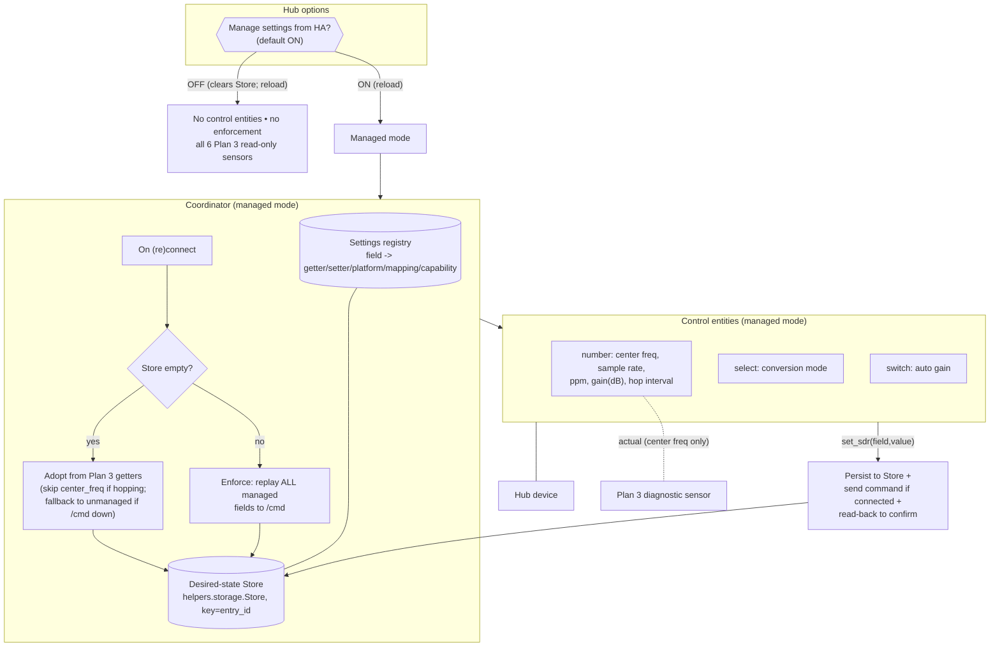
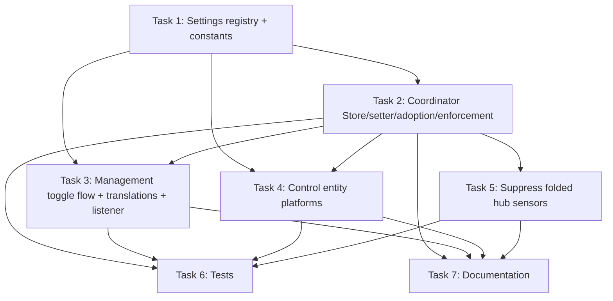

# Plan: Hub SDR Controls (HA-Managed Settings)

## Original Work Order

> Plan 6 — "Hub SDR Controls" for the rtl_433 Home Assistant integration (custom_components/rtl_433). This is a follow-up to Plan 3 (Hub Observability + WebSocket Frame Routing) and DEPENDS ON Plan 3's infrastructure: the on-connect HTTP getters to scheme://host:port/cmd (get_meta/get_gain/get_ppm_error/get_stats), the hub device + hub-update dispatcher signal, and the read-only diagnostic sensors. Plan 3 stays UNCHANGED and is the read-only foundation; Plan 6 layers control on top and reuses the same getter results.
>
> GOAL: Let users configure rtl_433's scalar SDR/runtime settings from Home Assistant so they can avoid managing rtl_433 config files in most cases. HA becomes the desired-state authority for these settings: it adopts the server's current values at setup and re-applies them on every reconnect.
>
> All design decisions below are LOCKED through prior discussion — do not re-litigate them; refine implementation detail only.
>
> 1. CONTROL ENTITIES (new NUMBER + SELECT platforms; add to const.py PLATFORMS) for the genuinely-settable scalar SDR fields, built via a SETTINGS REGISTRY where each entry declares: getter, setter command, platform/entity type, value mapping, and a capability gate (so future upstream setters slot in as registry entries, not a rewrite). The six fields and their /cmd commands (see WEBSOCKET_API.md):
>    - Center frequency -> number (Hz); command center_frequency (val=Hz); live.
>    - Sample rate -> number or select (Hz); command sample_rate (val=Hz); live.
>    - Frequency correction (ppm) -> number; command ppm_error (val); live.
>    - Gain -> select with an "auto" sentinel (empty string = auto); command gain (arg=string); live.
>    - Conversion mode -> select (0 native / 1 si / 2 customary); command convert (val); config-setter (applied next use).
>    - Hop interval -> number (seconds); command hop_interval (val); config-setter.
>
> 2. DESIRED-STATE STORE: coordinator-owned, persisted via the HA Store helper (homeassistant.helpers.storage.Store) keyed by entry_id — NOT entry.options (avoid config-entry reload churn on every value tweak). The coordinator is the single source of truth; control entities read/write through coordinator setters (e.g. coordinator.set_sdr(field, value)).
>
> 3. ADOPTION: on the FIRST successful connect after setup, if the Store holds no SDR state, seed it from Plan 3's on-connect getters and mark those fields managed. The first reconnect-enforcement is then a no-op (pushes back what was already there) — this is how a CLI/config user's existing settings (e.g. 915M) are preserved. Guards: (a) HOP MODE — if meta.frequencies[] has >1 entry, skip adopting/managing center_frequency (pinning it would kill hopping; there is no API command to set a frequency/hop LIST, only single center_frequency); (b) /cmd UNREACHABLE — if the getters fail (proxy hides /cmd), there is nothing to adopt: fall back to unmanaged and surface it, reusing Plan 3's graceful-degradation path.
>
> 4. ENFORCEMENT: on EVERY (re)connect, replay ALL managed settings to /cmd (full enforcement — this was explicitly chosen over "only HA-changed fields"). Accepted tradeoff: once adopted, HA is authoritative and WILL override later edits made directly in the rtl_433 config/flags. The management toggle (below) is the escape hatch. Runtime commands are NOT persisted server-side by rtl_433 (revert to config on restart) — that is WHY reconnect-replay exists.
>
> 5. MANAGEMENT TOGGLE (hub option): label it positively as "Manage rtl_433 settings from Home Assistant", default ON. Lives on the hub options step in config_flow.py (async_step_hub) alongside CONF_DISCOVERY_ENABLED / CONF_AVAILABILITY_TIMEOUT. ON = control entities created + reconnect enforcement runs. OFF = no control entities, no enforcement, HA touches nothing (Plan 3 read-only diagnostic sensors remain either way). Toggling triggers a reload (entity set changes). THE TOGGLE IS THE ONLY RE-SYNC MECHANISM — there is deliberately NO "re-adopt" button/service (a post-hoc button can't work: enforcement fires automatically on reconnect and overwrites the server before any human could act, so reading "current server state" always returns HA's own values). To re-sync HA from the config file: turn the toggle OFF, restart rtl_433, turn it back ON (HA re-adopts the now-live config value on the next connect). Document this dance.
>
> 6. WRITE PATH: control entity write -> coordinator.set_sdr(field, value) -> persist to Store + send the command immediately if connected; read back via the getter to confirm; on /cmd write failure, log (and/or raise a repair) and keep the desired value. Decide optimistic vs confirmed state and document it.
>
> 7. READ-ONLY vs CONTROL coexistence: keep Plan 3's read-only diagnostic sensors for stats, connectivity, and the frequencies[]/hop_times[] array attributes. For fields that become controls, recommend keeping a parallel read-only "actual" sensor only where actual can diverge from desired (center_frequency under hopping); fold the rest into the control entity's state.
>
> 8. OUT OF SCOPE BUT ANTICIPATED by the registry/capability design (the maintainer plans to implement these upstream later): decoder enable/disable (server-side `protocol` command is currently a NO-OP; when implemented it needs a different UX — a multi-select / config subentry seeded from get_protocols `en` flags, NOT one switch per protocol since there can be hundreds); device selection (`device` currently returns "Not implemented"); multi-frequency hop LISTS (no API command). Recommend (as a doc note, not work in this plan) that upstream advertise capabilities (extend the meta object or add get_capabilities) when wiring `protocol`, so the integration can distinguish a real setter from a no-op across server versions and gate controls accordingly.
>
> KEY CONTEXT: HA custom integration, integration_type=hub, iot_class=local_push. Coordinator (coordinator/base.py) is a plain push class, not a DataUpdateCoordinator; it owns the WS lifecycle and (after Plan 3) the on-connect getters. Commands use the SAME command set as the WebSocket but are issued as one-shot HTTP requests to the server root scheme://host:port/cmd (https when secure/wss), never over the streaming WebSocket — preserving the read-only streaming socket. Tests live in tests/ and use pytest-homeassistant-custom-component; run `uv run pytest tests/` and `uv run ruff check custom_components/rtl_433`. Follow HA Quality Scale conventions.
>
> DOCUMENTATION to update: README.md (new HA-managed SDR controls; the HA-as-authority behavior — "once managed, change settings in HA, not the config file"; the toggle as the re-sync mechanism; the /cmd reachability requirement); AGENTS.md (the settings-registry contract, adoption + full-enforcement-on-reconnect semantics, the Store persistence location, the toggle behavior, and the out-of-scope/anticipated upstream items).
>
> TESTS to add: control-entity write -> correct /cmd command + value (incl. gain auto-sentinel and conversion-mode mapping); adoption on first connect (normal, hop-mode skip of center_frequency, and /cmd-failure fallback to unmanaged); full reconnect-replay of all managed fields; toggle ON/OFF creates/removes control entities and enables/disables enforcement; Store persistence across HA restart; /cmd write-failure leaves the desired value intact and does not disturb the event stream.

## Plan Clarifications

| Question | Decision |
| --- | --- |
| After HA adopts the server's current settings, what does reconnect-restore re-apply? | **All adopted fields (full enforcement).** Every managed setting is replayed on every reconnect. Accepted tradeoff: once adopted, HA is authoritative and overrides later direct edits to the rtl_433 config/flags; the management toggle is the escape hatch. |
| Is there a "re-adopt from server" button/service? | **No.** A post-hoc action cannot capture a changed config value because reconnect-enforcement overwrites the server before any human can act. The management toggle (OFF → restart rtl_433 → ON) is the only supported re-sync path, documented as such. |
| How do existing (already-configured) hubs behave after upgrading to this version? | **Managed by default.** Existing hubs follow the same path as new hubs: on first reconnect HA adopts the server's current values (a no-op first enforcement) and gains the new control entities. One code path; no separate migration default. |
| Where is the management toggle offered? | **Both at initial setup and in options.** The connection-details form (`async_step_user`) includes the management toggle (default on) with a short explanation so users can opt out at creation time; the hub options step (`async_step_hub`) lets them change it later. |
| How is the gain control realized, given `gain` is a free-form, tuner-specific string with empty = auto and no API to enumerate valid steps? | **Number (gain in dB) + an "Auto gain" Switch.** The switch expresses the empty=auto sentinel; when off, the Number's dB value is sent. Friendliest for single-value tuners (RTL-SDR, the common case). Multi-stage gain strings (e.g. SoapySDR `LNA=20,VGA=10`) are explicitly not supported by this control. Adds a SWITCH platform alongside NUMBER and SELECT. |
| Entity type for sample rate ("number or select")? | **Number** (Hz, box mode), consistent with the other scalar tuners; no fixed enumerable set is imposed. |
| Where is desired state persisted? | **Coordinator-owned HA `Store` keyed by entry_id**, not `entry.options`, to avoid a config-entry reload on every value change. |
| Does this plan implement decoder/device control? | **No.** Decoder enable/disable, device selection, and multi-frequency hop lists are out of scope (and partly unimplemented server-side); the settings registry is shaped so they can be added later without a rewrite. |
| *(refinement)* Plan 3 also creates read-only diagnostic sensors for the same six fields — how do they coexist with the controls? | **Suppress the folded sensors.** In managed mode Plan 6 modifies Plan 3's hub-sensor builder to skip the five folded fields (sample rate, ppm, gain, conversion mode, hop interval), so each concept has exactly one entity; **center frequency keeps its Plan 3 "actual" sensor** alongside its control (actual ≠ desired under hopping). This relaxes "Plan 3 stays unchanged" to "Plan 3's foundation is reused as-is apart from one guarded skip in its hub-sensor builder." |
| *(refinement)* When management is turned back ON, does HA re-adopt or restore? | **Re-adopt from the server.** Turning management OFF clears the desired-state `Store`; turning ON (or first managed setup) re-adopts on the next connect via the existing empty-Store path. This is what makes the documented `off → restart rtl_433 → on` re-sync pick up a changed config value. Cost: toggling off then on discards previously HA-set values (it re-baselines to the server). |
| *(refinement)* How does flipping the toggle take effect, given the existing update listener does not reload? | **Reload only on toggle change.** `_async_update_listener` keeps applying `discovery`/`timeout` live, but when the management field changes it triggers `async_reload` (the entity set changes). Routine control-value writes go to the `Store` and never touch `entry.options`, so they never reload. |
| *(refinement)* What `EntityCategory` and unique_id do the controls use? | **`EntityCategory.CONFIG`**, with stable unique_ids following the existing hub-entity scheme (`f"{entry_id}:…:{object_suffix}"`) so the managed→unmanaged→managed cycle re-attaches the same entities cleanly. |

## Executive Summary

This plan turns the rtl_433 hub from a read-only observer into a controller for the SDR's scalar runtime settings. It adds three Home Assistant control platforms — `number`, `select`, and `switch` — that expose center frequency, sample rate, frequency correction (ppm), gain (a dB number plus an auto switch), conversion mode, and hop interval as first-class controllable entities on the existing hub device. Users can therefore tune the receiver from dashboards, automations, scripts, and voice, and in most cases avoid hand-editing rtl_433 config files. The controls are driven by a single **settings registry** so each field's getter, setter command, entity type, value mapping, and capability gate live in one declarative place, and so future upstream control commands (decoder enable/disable, device selection) become registry entries rather than new bespoke code.

Home Assistant is made the desired-state authority. The coordinator gains a small **Store-backed desired-state map** (the HA `Store` helper, keyed by entry id) that survives restarts without churning the config entry. On the first successful connect, if no desired state exists yet, HA **adopts** the server's current values from Plan 3's on-connect getters — so an operator who already runs the server at, say, 915 MHz keeps that value, and the first enforcement is a no-op. On every subsequent (re)connect the coordinator **replays all managed settings** to the server's `/cmd` endpoint, which is what makes HA-set values "stick" across rtl_433 restarts (the server does not persist runtime API changes). Because full enforcement means HA will also override later direct config edits, a per-hub **management toggle** ("Manage rtl_433 settings from Home Assistant", default on) is the deliberate and only escape hatch: turning it off removes the controls and stops all enforcement, leaving Plan 3's read-only diagnostics intact.

The approach preserves the integration's existing character: the streaming WebSocket stays strictly read-only, all control is issued as one-shot HTTP requests to `scheme://host:port/cmd` (the same transport Plan 3 uses for getters), and Plan 3's foundation is reused as-is — the one exception being a guarded skip in Plan 3's hub-sensor builder so the five folded diagnostic sensors are not duplicated by their controls in managed mode (*see clarifications*). Adoption is guarded against the two cases where it would misbehave — frequency-hopping servers (where pinning a single center frequency would break hopping) and an unreachable `/cmd` endpoint (where there is nothing to adopt) — by falling back to leaving those settings unmanaged.

## Context

### Current State vs Target State

| Current State | Target State | Why? |
| --- | --- | --- |
| The SDR's configuration is (after Plan 3) visible as read-only DIAGNOSTIC sensors only. | Center frequency, sample rate, ppm, gain, conversion mode, and hop interval are controllable from HA via `number`/`select`/`switch` entities. | Users want to tune the receiver from HA and avoid editing rtl_433 config files. |
| `const.py` `PLATFORMS` is `[SENSOR, BINARY_SENSOR]`. | `PLATFORMS` also includes `NUMBER`, `SELECT`, and `SWITCH`. | The control entities live on new platforms. |
| The coordinator holds no persisted per-hub configuration of its own. | The coordinator owns a `Store`-backed desired-state map (keyed by entry id) that is the single source of truth for managed SDR settings. | A restart-surviving authority is required to re-apply settings on reconnect without config-entry churn. |
| rtl_433 runtime settings revert to the server's config/flags whenever the server restarts. | HA re-applies all managed settings on every reconnect, so HA-set values persist across server restarts. | The server does not persist runtime API changes; reconnect-replay is the persistence mechanism. |
| There is no per-hub way to opt out of HA managing the SDR. | A management toggle "Manage rtl_433 settings from Home Assistant" (default on) is offered both on the initial connection-details form and in the hub options step; it gates the controls and enforcement; off = HA touches nothing. | Operators who manage rtl_433 themselves need an escape hatch they can choose up front; it is also the only supported re-sync path. |
| Control is bespoke per command, if it existed at all. | A settings registry declares each field once (getter, setter, platform, mapping, capability gate). | Keeps the six fields consistent and lets future upstream setters be added without a rewrite. |
| The streaming WebSocket is read-only; getters go over `/cmd`. | Unchanged — control commands also go over `/cmd` (one-shot HTTP), never the streaming socket. | Preserves the read-only streaming socket and the local-push event character. |
| `_async_update_listener` applies `discovery`/`timeout` changes live and never reloads. | It still applies those live, but reloads the entry when the management toggle changes. | Flipping the toggle adds/removes the control entities, which requires a reload; routine value writes (to the `Store`) still never reload. |
| Plan 3 builds a diagnostic sensor for each of the six fields unconditionally. | In managed mode Plan 3's builder skips the five folded fields (center frequency's actual sensor is retained). | Avoids two entities per concept; the control already shows the read-back actual. |

### Background

- **Hard dependency on Plan 3 (not yet implemented).** As of this writing the coordinator (`coordinator/base.py`) has the WebSocket lifecycle and a `connected` flag but **no** `/cmd` getters, **no** hub-update dispatcher signal, and **no** hub diagnostic sensors; `sensor.py`/`binary_sensor.py` build per-device entities only via `entity.py:async_setup_hub_platform`. Plan 6 consumes Plan 3's getters (`get_meta`/`get_gain`/`get_ppm_error`), its hub device registration, and its hub-update signal, and must not begin until Plan 3 has landed. Plan 3's foundation is reused as-is; the **only** change Plan 6 makes to Plan 3 code is a guarded skip in its hub-sensor builder so the five folded diagnostic sensors are not duplicated in managed mode (*see clarifications*).
- **Command transport.** Per `WEBSOCKET_API.md`, the `/cmd` endpoint shares the WebSocket command set but is reachable only at the server **root** (`scheme://host:port/cmd`, `https` when the hub is secure/`wss`), independent of the configured WS path. Live SDR controls (`center_frequency`, `sample_rate`, `ppm_error`, `gain`) take effect immediately on the running receiver; configuration setters (`hop_interval`, `convert`) apply on next use. These changes are **not persisted** by the server across restarts.
- **API ceiling (today).** There is no command to set a frequency/hop **list** (only a single `center_frequency`); `protocol` (decoder enable/disable) is a server-side **no-op** that still returns `Ok`; `device` returns "Not implemented". These bound what can be controlled now and motivate both the hop-mode adoption guard and the capability-gate design.
- **Coordinator shape.** The coordinator is a plain push class (not a `DataUpdateCoordinator`) and already uses the shared HA aiohttp session (`async_get_clientsession`). It owns reconnect with capped backoff. Hub control state and the enforcement hook attach here.
- **Config and options flows today.** `config_flow.py` collects connection details on `async_step_user` (host/port/path/secure → `entry.data`) and has a hub options step (`async_step_hub`) persisting `CONF_DISCOVERY_ENABLED` and `CONF_AVAILABILITY_TIMEOUT` to `entry.options`. The management toggle is added to **both** steps: a default-on field with a short explanation on `async_step_user` (written to `entry.data`) and the same field on `async_step_hub` (written to `entry.options`). The coordinator reads the effective value with the existing options-over-data fallback pattern already used for `CONF_DISCOVERY_ENABLED`/`CONF_AVAILABILITY_TIMEOUT` (`entry.options.get(key, entry.data.get(key, True))`). Config-flow `VERSION` is 2; the new option is additive and does not require a version bump. The new toggle's label and short explanation (`data_description`) must be added to `translations/en.json` for both the `user` and `hub` steps (there is no root `strings.json`).
- **Update listener (reload behavior).** `__init__.py:_async_update_listener` today **deliberately does not reload** — it pushes `discovery`/`timeout` changes onto the running coordinator to avoid tearing down the socket. Plan 6 extends it to compare the management toggle's old vs new effective value and call `hass.config_entries.async_reload(entry.entry_id)` only when that field changed (the entity set changes), while keeping the live-apply path for the other two options.

## Architectural Approach

The work has a coordinator layer (a settings registry, a Store-backed desired-state map, adoption, reconnect enforcement, and a write path) and an entity layer (three new control platforms whose entities read/write the coordinator's desired state). A per-hub management toggle gates whether the entity layer and enforcement exist at all. Plan 3's read-only sensors remain the source for "actual" values and for adoption seeding.

### Settings Registry
**Objective**: Define each controllable field once so the platforms, the write path, adoption, and enforcement all share a single declarative contract, and so future upstream setters are additive.

A module-level registry describes each managed field with: a stable internal key; the Plan 3 getter (or meta field) that yields its current value; the `/cmd` setter command name and how the desired value maps to the command's `arg`/`val`; the HA platform and entity description (name, unit, device class, `EntityCategory`, bounds/options) used to build the entity; the value↔command transforms (e.g. conversion-mode integer↔label, gain dB↔string with the auto sentinel); and a **capability gate** (today always true for the six fields) so entries can later be conditioned on server-advertised capabilities. The six entries are center frequency, sample rate, ppm, gain (paired number+switch), conversion mode, and hop interval. All control entities use `EntityCategory.CONFIG` (they configure the receiver, not measure it) and a stable unique_id following the existing hub-entity scheme (`f"{entry_id}:…:{object_suffix}"`), so the managed→unmanaged→managed cycle re-attaches the same registry entities cleanly. Number bounds/units are documented, defensibly wide values appropriate to common SDR tuners, set in box mode. The registry is the single place the entity platforms iterate over and the single place enforcement/adoption iterate over, keeping them in lockstep.

### Desired-State Store and Coordinator Setter
**Objective**: Give the coordinator a restart-surviving, single source of truth for managed settings that does not churn the config entry.

The coordinator gains a desired-state map persisted with the HA `Store` helper, keyed by the hub entry id, holding each managed field's desired value plus a "managed" marker. The map is loaded during coordinator startup and exposed to entities. A single setter — `set_sdr(field, value)` — updates the map, persists it, and (if currently connected) issues the corresponding `/cmd` command and reads the value back via the field's getter to confirm. Entities never talk to `/cmd` directly; they only call the coordinator setter and read the coordinator's desired/actual state, mirroring how per-device entities read `coordinator.devices`. The Store is chosen over `entry.options` specifically so a routine value change does not trigger a config-entry update/reload.

### Adoption on First Connect
**Objective**: Make HA's first managed state equal to whatever the server is already doing, so existing CLI/config setups are preserved and the first enforcement is a no-op.

On the first successful connect in managed mode, if the Store holds no desired state, the coordinator seeds it from Plan 3's on-connect getter results (`get_meta` for center frequency, sample rate, conversion mode, and hop interval from `hop_times[0]`; `get_gain`; `get_ppm_error`) and marks those fields managed. Two guards apply: if `meta.frequencies[]` has more than one entry the server is frequency-hopping, so center frequency is left **unmanaged** (adopting and later pinning a single value would break hopping, and there is no API to set a hop list); and if the getters cannot be reached (e.g. a reverse proxy that hides `/cmd`), there is nothing to adopt, so the hub falls back to unmanaged and surfaces the condition, reusing Plan 3's graceful-degradation behavior. Adoption seeds once; thereafter the Store is authoritative.

The "adopt iff the Store is empty" rule is also what implements the re-sync semantics (*see clarifications*): turning management **off clears the desired-state Store**, so the next time it is turned **on** the Store is empty and the coordinator re-adopts the server's then-current values on the next connect. This is deliberately a re-baseline, not a pause/resume — toggling off then on discards any previously HA-set values in favor of whatever the server is currently doing, which is exactly what makes the documented `off → restart rtl_433 → on` flow pick up a changed config value.

### Reconnect Enforcement
**Objective**: Make HA-set values persist across server restarts by re-applying them whenever the connection is (re)established.

After each successful connect (and after seeding, when adoption ran), the coordinator replays **all** managed fields by issuing their `/cmd` setter commands in sequence. Because rtl_433 does not persist runtime API changes, this is what restores the user's intended configuration after the server restarts; on a transient reconnect where the server never restarted, the replay is a harmless no-op. Enforcement is full and unconditional in managed mode (chosen over re-applying only user-changed fields), which is precisely why it can override later direct config edits — an accepted tradeoff with the toggle as the escape hatch. Enforcement runs off the connect path with the existing capped backoff, and a getter/command failure is logged at debug and leaves prior desired values intact without disturbing the event stream or the connect loop. All `/cmd` issuance (enforcement replay, adoption read-back, and user writes) is serialized through a single coordinator lock so a user write and a reconnect replay cannot interleave commands to the same server.

### Management Toggle and Entity Gating
**Objective**: Let an operator hand authority back to rtl_433's own config, and provide the only supported re-sync path.

A management toggle labelled "Manage rtl_433 settings from Home Assistant" (default on) gates the whole control layer. It is offered in two places: on the initial connection-details form (`async_step_user`) with a short explanation, so a user can opt out at creation time without ever gaining the control entities; and on the hub options step (`async_step_hub`) so it can be changed later (the coordinator reads the effective value options-over-data). When on, the control entities are created and reconnect enforcement runs. When off, no control entities are created, the coordinator issues no commands at all, and the desired-state `Store` is cleared — Plan 3's read-only diagnostic sensors (all six fields) remain either way. Because the existing `_async_update_listener` does not reload, Plan 6 extends it to call `async_reload` specifically when the management toggle's effective value changes (the entity set changes), while still applying `discovery`/`timeout` live. There is deliberately no "re-adopt" button or service: enforcement fires automatically on reconnect, so any value read after connecting is HA's own; a post-hoc action could never observe a changed config value. The documented re-sync procedure is therefore toggle **off** (clears the Store) → restart rtl_433 (server returns to its config value) → toggle **on** (the empty Store triggers re-adoption from the now-live value on the next connect). Existing hubs upgrade straight into managed mode (default on), identically to new hubs.

### Write Path and Read-Only Coexistence
**Objective**: Define how a user change reaches the server and what the entity shows, and avoid duplicate entities with Plan 3.

A user setting a control calls `coordinator.set_sdr(...)`, which persists the desired value and, when connected, sends the command (through the shared serialization lock) and reads it back via the getter. The entity reflects the **desired** value (optimistic on write) and reconciles to the read-back/actual value when getters refresh; this optimistic-then-confirmed behavior is documented. Control entities are `EntityCategory.CONFIG` with stable hub-scoped unique_ids (*see Settings Registry*) so they survive the toggle cycle. For coexistence with Plan 3's diagnostic sensors: in managed mode the five "folded" fields (sample rate, ppm, gain, conversion mode, hop interval) are represented **only** by their control entities (whose state is the read-back actual), so Plan 3's standalone diagnostic sensors for those five are suppressed to avoid duplicates; **center frequency keeps its Plan 3 read-only "actual" sensor** alongside its number control, because under hopping (or any external change) the actual can legitimately differ from the desired/commanded value. In unmanaged mode all of Plan 3's diagnostic sensors remain and no control entities exist. Stats, connectivity, and the `frequencies[]`/`hop_times[]` array attributes from Plan 3 are untouched in both modes.

### Forward Extensibility (Anticipated, Out of Scope)
**Objective**: Ensure today's design does not have to be rewritten when upstream gains more setters.

The registry's capability gate is the seam for future control: when upstream wires up `protocol` (decoder enable/disable) and `device` (device selection), and ideally advertises capabilities (e.g. extending the `meta` object or adding a `get_capabilities`) so the integration can tell a real setter from the current `protocol` no-op, new fields become registry entries gated on those capabilities. Decoder control specifically will need a different UX (a multi-select or config subentry seeded from `get_protocols` `en` flags, not hundreds of switches). None of this is built in this plan; it is only kept possible by the registry shape and noted in `AGENTS.md`.

## Risk Considerations and Mitigation Strategies

Technical Risks

- **`/cmd` unreachable behind a reverse proxy** (the WS path may be proxied while `/cmd` is only at the server root).
    - **Mitigation**: Adoption falls back to unmanaged; enforcement and write commands are caught, logged at debug, and leave desired values intact. The event stream and Plan 3 connectivity are unaffected.
- **Frequency-hopping servers**: a single `center_frequency` cannot represent a hop list, and enforcing one would disable hopping.
    - **Mitigation**: Detect `len(meta.frequencies) > 1` at adoption and leave center frequency unmanaged; document that hopping setups should manage frequency via rtl_433 config (or the toggle off).
- **Full enforcement overrides later direct config edits** once HA has adopted.
    - **Mitigation**: This is the explicitly chosen behavior; the management toggle is the documented escape hatch and re-sync path, and the README states "once managed, change settings in HA, not the config file".
- **Gain string is tuner-specific** and multi-stage gains cannot be expressed by a single dB number.
    - **Mitigation**: Support the common single-value (RTL-SDR) case via number+auto-switch; document that multi-stage gain strings are unsupported and must be set via rtl_433 config (toggle off).
- **Number bounds/units** for frequency, sample rate, ppm, gain, and hop interval.
    - **Mitigation**: Use documented, defensible wide bounds in box mode appropriate to common SDR tuners; treat out-of-range server values defensively rather than rejecting them.
- **Concurrent `/cmd` issuance** (a user write racing the reconnect replay) interleaving requests to the same server.
    - **Mitigation**: Serialize all `/cmd` issuance through a single coordinator lock.
- **Writing to an unauthenticated server.** The control commands mutate a server that has no auth and binds openly by default; HA now writes to it.
    - **Mitigation**: Same posture as Plan 3 — no credentials are sent; this is a conscious, documented choice, and users needing access control front rtl_433 with a reverse proxy (the management toggle off keeps HA fully passive).

Implementation Risks

- **Hard dependency on unimplemented Plan 3.**
    - **Mitigation**: This plan is a prerequisite-gated follow-up; it must not start before Plan 3 lands, and it reuses Plan 3's getters/signal/hub device rather than reimplementing them.
- **Duplicate entities** between Plan 3 diagnostic sensors and the new controls.
    - **Mitigation**: In managed mode, suppress Plan 3's diagnostic sensors for the five folded fields (a guarded skip in Plan 3's hub-sensor builder) and keep only center frequency's as the "actual"; verify there is exactly one entity per concept per mode.
- **Existing update listener does not reload**, so a toggle change would not take effect.
    - **Mitigation**: Extend `_async_update_listener` to `async_reload` only when the management field's effective value changes; keep the live-apply path for `discovery`/`timeout`. Add a test asserting a toggle change reloads while a timeout change does not.
- **Missing translations** for the new toggle field (label + short explanation).
    - **Mitigation**: Add the field's `data` label and `data_description` to `translations/en.json` for both the `user` and `hub` steps.
- **Toggle reload churn / Store vs entry.options.**
    - **Mitigation**: Persist desired state in a `Store` (no entry reload on value change); only the toggle (which changes the entity set) triggers a reload.
- **Three new platforms (number/select/switch)** alongside the existing per-device dynamic setup.
    - **Mitigation**: Register the hub controls statically against the existing hub device identifiers, independent of the per-device `async_setup_hub_platform` flow.

Quality Risks

- **Regression in Plan 3 read-only behavior or the device-event stream** while adding control.
    - **Mitigation**: Keep the streaming socket read-only (commands go only over `/cmd`); add tests asserting Plan 3 sensors still appear in unmanaged mode and that enforcement/write failures do not disturb the event stream.
- **Optimistic state diverging from reality** (e.g. server rejects a value).
    - **Mitigation**: Read back via the getter after a command and reconcile; document the optimistic-then-confirmed contract.

## Success Criteria

### Primary Success Criteria
1. In managed mode the hub device exposes control entities for center frequency, sample rate, ppm, gain (a dB `number` plus an "Auto gain" `switch`), conversion mode (`select`), and hop interval, all attached to the existing hub device; `NUMBER`, `SELECT`, and `SWITCH` are in `const.py` `PLATFORMS`.
2. Setting any control issues the correct `/cmd` command with the correct argument to `scheme://host:port/cmd` — including the gain auto sentinel (auto switch on ⇒ empty `arg`) and the conversion-mode integer mapping — and the desired value is persisted to the coordinator's `Store`.
3. On first connect with an empty Store, HA adopts the server's current values from Plan 3's getters; with `meta.frequencies` length > 1, center frequency is left unmanaged; if `/cmd` is unreachable, the hub falls back to unmanaged without error.
4. On every reconnect, all managed fields are replayed to `/cmd`; desired state survives an HA restart via the `Store`.
5. The management toggle "Manage rtl_433 settings from Home Assistant" (default on, applied to existing hubs too) is presented on the initial connection-details form with a short explanation and in the hub options step (both labelled via `translations/en.json`), and gates everything: on ⇒ `EntityCategory.CONFIG` controls + enforcement and the five folded Plan 3 sensors are suppressed (center frequency's actual sensor retained); off ⇒ no controls, no commands issued, the desired-state `Store` cleared, all six Plan 3 read-only sensors present. Changing the toggle in options reloads the entry; changing `discovery`/`timeout` does not.
6. Turning management off then on re-adopts the server's then-current values (the empty-Store path), so the documented `off → restart rtl_433 → on` flow picks up a changed config value rather than restoring stale HA values.
7. A `/cmd` write or getter failure leaves prior desired values intact and does not disturb the event stream or the connect loop; concurrent writes and reconnect replays are serialized; there is no re-adopt button/service.
8. `uv run pytest tests/` passes including the new tests, and `uv run ruff check custom_components/rtl_433` reports no new violations.

## Self Validation

After all tasks are complete, perform these concrete checks:

1. Run `uv run pytest tests/` and confirm the full suite passes, including new tests for the write path, adoption (normal/hop-mode/`/cmd`-down), reconnect replay, toggle on/off, Store persistence, and write-failure isolation. Run `uv run ruff check custom_components/rtl_433` and confirm no new violations.
2. With a mocked `/cmd`, drive a write to each control and assert the exact outbound command/argument: `center_frequency` (val Hz), `sample_rate` (val Hz), `ppm_error` (val), `convert` (mapped integer), `hop_interval` (val seconds), and `gain` (arg = dB string when the auto switch is off, empty `arg` when on). Assert the value is written to the `Store`.
3. Seed a coordinator with empty Store and mocked getter responses; assert adoption populates the desired state and marks fields managed; repeat with `meta.frequencies` length > 1 and assert center frequency is left unmanaged; repeat with getters raising and assert the hub falls back to unmanaged and emits no commands.
4. Simulate two successive connects with a non-empty Store and assert that on each connect every managed field's `/cmd` command is replayed. Reload/recreate the coordinator and assert the desired state is restored from the `Store`.
5. Flip the management option off and assert: the desired-state `Store` is cleared, no `number`/`select`/`switch` entities exist for the hub, no `/cmd` commands are issued, and all six Plan 3 diagnostic sensors are present. Flip it back on and assert: the control entities exist with `EntityCategory.CONFIG`, the coordinator re-adopts from the server (the empty Store re-seeds with the server's current values rather than any prior HA values), enforcement runs, and the five folded Plan 3 sensors are absent while the center-frequency actual sensor remains.
6. Assert that an options change to the management toggle triggers `async_reload`, whereas an options change to only `availability_timeout`/`discovery_enabled` does not reload (it is applied live).
7. Inject a `/cmd` failure during a write and during enforcement; assert the desired value is retained, an appropriate debug log (and/or repair) is produced, and a normal device event fed to the coordinator is still processed. Drive a user write concurrently with a reconnect replay and assert the serialization lock prevents interleaved `/cmd` requests.
8. Confirm the control commands target `http(s)://host:port/cmd` regardless of the configured WS path, and that the streaming WebSocket is never used to send a command. Confirm the new toggle field renders with its label and short explanation from `translations/en.json` on both the user and hub steps.

## Documentation

This plan **does** require documentation updates:

- **README.md** — document the new HA-managed SDR controls and the management toggle (including that it can be turned off during initial setup or later in options); the HA-as-authority behavior ("once a hub is managed, change settings in HA, not the rtl_433 config file"); the toggle (off → restart rtl_433 → on) as the only re-sync path; that controls require the server's `/cmd` endpoint reachable at `host:port/cmd`; and that hopping/multi-stage-gain setups should be managed via rtl_433 config (or with the toggle off).
- **AGENTS.md** — record the settings-registry contract (fields, getters, setter commands, value mappings, capability gate); adoption + full-enforcement-on-reconnect semantics and the hop-mode/`/cmd`-down guards; the `Store` persistence location (keyed by entry id, not `entry.options`); the management-toggle behavior and the deliberate absence of a re-adopt action; and the out-of-scope-but-anticipated upstream items (decoder enable/disable, device selection, hop lists) with the suggestion that upstream advertise capabilities.
- **`translations/en.json`** — add the management-toggle field's label and `data_description` (its short explanation) for both the `config` (`user`) and `options` (`hub`) steps; this is a functional requirement (the UI text), not just docs.
- **WEBSOCKET_API.md** — optionally note that the live SDR control and config-setter commands are now exercised by the integration over `/cmd`; not strictly required.

## Resource Requirements

### Development Skills
- Home Assistant custom-component development: config/options flows, the `number`/`select`/`switch` entity platforms, entity descriptions, `EntityCategory`/device classes, device registry, dispatcher signals, and config-entry reload.
- The HA `Store` helper (`homeassistant.helpers.storage`) for restart-surviving state.
- Async Python with `aiohttp` (one-shot HTTP to `/cmd` via the shared HA session).
- `pytest` with `pytest-homeassistant-custom-component`.

### Technical Infrastructure
- A completed/merged Plan 3 (its getters, hub device, hub-update signal, and read-only sensors) — a hard prerequisite.
- The existing test harness (`uv run pytest tests/`) and fixtures in `tests/`; `ruff` and the repository pre-commit configuration.
- The `WEBSOCKET_API.md` command contract as the parsing/command reference; no live SDR required for unit tests.

## Integration Strategy

The control entities attach to the already-registered hub device, so they appear under the existing hub in Settings → Devices & Services with no new config entry. The management toggle extends both the initial `async_step_user` form and the existing `async_step_hub` options step, and the existing `_async_update_listener` is extended to reload the entry only when that toggle changes. The coordinator's new desired-state `Store`, adoption, and enforcement hook into the existing connect lifecycle and reuse Plan 3's getters and the shared HA aiohttp session targeting the server root `/cmd`. The streaming WebSocket and the per-device event pipeline are untouched.

## Notes

- **Prerequisite ordering**: this plan must be executed after Plan 3 lands; it depends on Plan 3's getters, hub device, hub-update signal, and read-only sensors and does not reimplement them.
- **Backwards compatibility**: the change is additive (new platforms, one new hub option, a new `Store`); no config-entry version bump is required. Existing hubs default to managed and adopt their server's current values on first reconnect (a no-op enforcement), so upgrading does not change what the SDR is doing — it only adds entities and makes HA authoritative going forward.
- **Explicitly out of scope** (kept possible by the registry/capability seam, not built here): decoder enable/disable, device selection, and multi-frequency hop lists; multi-stage gain strings; any "re-adopt" button or service.
- **Security posture**: control commands write to an unauthenticated, openly-bound server with no credentials, consistent with Plan 3's read posture; access control is the user's responsibility (reverse proxy), and the management toggle off keeps HA fully passive.

### Change Log
- 2026-05-26: Refinement pass. Resolved the "Plan 3 stays unchanged" vs "suppress folded sensors" contradiction (decision: a guarded skip in Plan 3's hub-sensor builder). Defined toggle re-enable as **re-adopt** (off clears the `Store`; on re-seeds from the server), making the documented re-sync flow work. Corrected the reload assumption (the existing `_async_update_listener` does not reload; extend it to reload only on a management-toggle change). Pinned controls to `EntityCategory.CONFIG` with stable hub-scoped unique_ids. Added a `/cmd` serialization lock, a `translations/en.json` requirement for the new toggle field, and an unauthenticated-write security note. Updated the clarifications table, Current/Target table, success criteria, and self-validation accordingly.

## Execution Blueprint

**Validation Gates:**
- Reference: `/config/hooks/POST_PHASE.md`

### Dependency Diagram

No circular dependencies; the graph is acyclic.

### Phase 1: Foundation — registry + constants
**Parallel Tasks:**
- Task 001: Settings registry module + new `const.py` constants (no dependencies)

### Phase 2: Coordinator control layer
**Parallel Tasks:**
- Task 002: Coordinator desired-state `Store`, `set_sdr`, adoption, reconnect enforcement, serialization lock (depends on: 001)

### Phase 3: Flow, control entities, and sensor coexistence
**Parallel Tasks:**
- Task 003: Management toggle in config/options flow + translations + reload-on-change listener + wiring (depends on: 001, 002)
- Task 004: `number`/`select`/`switch` control platforms + `PLATFORMS` update (depends on: 001, 002)
- Task 005: Suppress the five folded Plan 3 hub sensors in managed mode (depends on: 002)

### Phase 4: Verification and documentation
**Parallel Tasks:**
- Task 006: Tests — write path, adoption (normal/hop/`/cmd`-down), enforcement replay, Store persistence, toggle gating + reload, failure isolation/serialization (depends on: 002, 003, 004, 005)
- Task 007: Documentation — README.md + AGENTS.md (depends on: 002, 003, 004, 005)

### Post-phase Actions
After each phase: run `uv run ruff check custom_components/rtl_433`, then create a conventional-commit for the phase. Mark tasks `completed` and the phase ✅ in this blueprint before advancing.

### Execution Summary
- Total Phases: 4
- Total Tasks: 7
