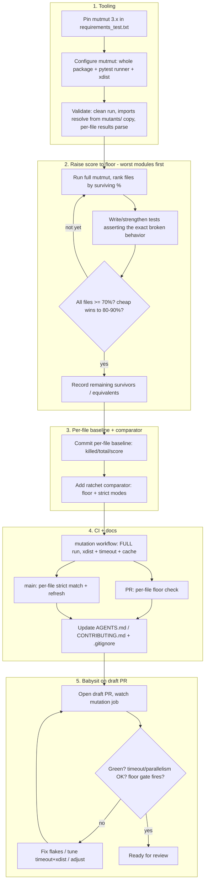

# Plan: Mutation Testing with mutmut

## Original Work Order

> add mutation testing to this project using mutmut. Add tests to cover escaped mutants. CI should fail if mutation test coverage decreases in a PR. We should minimize changes to the source code, making only test changes. We should also avoid disabling mutmut rules or ignoring failures, as we are using AI to generate tests.

## Plan Clarifications

| Question | Answer |
| --- | --- |
| What scope of source should mutation testing cover? | Whole integration (`custom_components/rtl_433/`). |
| How should CI detect a mutation-score decrease in a PR? | Committed per-file baseline file; CI compares current results to it. |
| How exhaustive should the test-writing in this plan be? | **Set up the tooling + ratchet now and kill incrementally.** Target at least a **70% per-file mutation score**; push to **80–90%** where it is cheap. Do not attempt to kill every mutant in this plan. |
| How should CI be bounded given the likely scale (thousands of mutants, slow HA harness)? | **Full-package run on every PR**, made tractable with **pytest-xdist parallelism, coverage-based test selection, and a hard CI timeout** (plus caching). No changed-files diff scoping. |
| How strict should the ratchet comparison be? | **Per-file floor on PR; strict match on the full (main) run.** PR: each file's score must be ≥ its baseline entry (improvements allowed, baseline updated opportunistically). Main: the committed baseline must exactly match current results (fail on any drift, refresh on main). |
| How to handle genuinely-equivalent / unkillable mutants given "no ignoring, no source changes"? | The ratchet records them in the baseline rather than suppressing them; CI only fails on a regression (PR) or un-recorded drift (main). |
| Which mutmut version? | Pin the latest mutmut 3.x. |
| Where should configuration live? | Prefer the existing `pyproject.toml`; fall back to `setup.cfg` only if the pinned mutmut version cannot read pyproject. |
| Maintain backwards compatibility? | Not applicable — this plan changes only tests, config, CI, scripts, and docs; `custom_components/` is left untouched, so there is no runtime BC surface. |

## Executive Summary

This plan adds [mutmut](https://github.com/boxed/mutmut) mutation testing to the rtl_433 Home Assistant integration and uses the surviving ("escaped") mutants as a concrete punch-list for hardening the pytest suite. Mutation testing introduces small, automatic faults into the source and checks that at least one test fails for each; mutants that survive reveal assertions the current ~4,660-line test suite is missing even where line coverage looks complete. We run mutmut against the whole `custom_components/rtl_433/` package (~5,700 lines across 19 modules) and write or strengthen tests to raise the per-file mutation score to a floor of **70%** — opportunistically reaching **80–90%** in modules where kills are cheap — rather than chasing 100% in this pass. Remaining survivors (including genuine equivalents) are recorded, not suppressed, and the bar ratchets upward over time.

To make the gain permanent, the results are frozen into a committed per-file baseline and a small comparator enforces a ratchet. Because a full mutation pass over this codebase is expensive (likely thousands of mutants against a slow-to-import HA test harness), the CI mutation job runs the full package on every PR but is kept tractable with pytest-xdist parallelism, mutmut 3.x coverage-based test selection, a hard timeout, and caching of mutmut's working state. The comparator gates per-file: on a PR it enforces a floor (each file ≥ its baseline, improvements allowed), and on `main` it enforces a strict match so the committed baseline always reflects reality.

This approach satisfies all four constraints simultaneously: it adds real behavioral tests (the point of using AI to generate them), it never modifies integration source, it never disables a mutator or adds `# pragma: no mutate`, and it never suppresses a failure — survivors are recorded in the baseline rather than ignored, so the score cannot silently fall.

## Context

### Current State vs Target State

| Aspect | Current State | Target State | Why? |
| --- | --- | --- | --- |
| Test quality signal | Line coverage only (`pytest --cov`); covered code may have no assertions | Per-file mutation score (floor 70%, stretch 80–90%) plus line coverage | Coverage proves execution, not verification; mutation proves tests detect behavior changes |
| Escaped behaviors | Unknown; untested branches/returns can pass CI | Enumerated as surviving mutants and reduced until each file clears the floor | Turns "we think it's tested" into a measured number with a defined bar |
| Regression protection | A PR can weaken effective testing without any signal | CI fails when a file's mutation score drops below the committed baseline | Implements the work order's "CI fails if mutation coverage decreases" |
| Tooling | No mutmut; `pyproject.toml` has ruff + pytest config; `requirements_test.txt` pins the HA test stack | mutmut 3.x pinned and configured; comparator + per-file baseline committed | Reproducible local and CI mutation runs |
| CI | Per-concern workflows (`test.yml`, `lint.yml`, `validate.yml`, …) | New `mutation` workflow: full run on PR + main, parallelism + timeout | Keeps slow mutation work off the fast pytest job while still gating PRs |
| Source code | `custom_components/rtl_433/` is the unit under test | Unchanged | Work order: minimize source changes — test-only |

### Background

The integration is ~5,700 lines of Python across 19 modules, with the heaviest logic in `coordinator/__init__.py` (716 lines), `entity.py` (616), `mapping.py` (609), `__init__.py` (610), and `config_flow.py` (557). It is exercised by ~4,660 lines of pytest tests under `tests/` (10 test modules plus `conftest.py`) and run with `uv run pytest`. `pyproject.toml` already configures pytest with `asyncio_mode = "auto"`, `testpaths = ["tests"]`, and crucially `filterwarnings = ["error"]` (warnings are hard failures) — a strong determinism baseline that mutation runs benefit from. `requirements_test.txt` pins `pytest-homeassistant-custom-component==0.13.333`, which transitively provides pytest, pytest-asyncio, pytest-cov, pytest-xdist, pytest-timeout, coverage, and freezegun. `tests/conftest.py` enables the custom integration and provides hub-entry and event-fixture builders.

CI is organized as one workflow file per concern under `.github/workflows/`; the relevant one, `test.yml`, runs `uv venv` → `uv pip install -r requirements_test.txt` → `uv run pytest --cov=custom_components/rtl_433 tests/` on Python 3.14. There is no `scripts/` directory today and no `setup.cfg`.

mutmut 3.x is chosen over 2.x because it can use coverage data to run only the tests relevant to each mutant, which materially reduces wall-clock on a codebase this size. The flip side is that 3.x is newer and its configuration mechanism (`[tool.mutmut]` in pyproject vs `[mutmut]` in setup.cfg), its `mutants/` working-copy execution model, and its results/output format must be validated early; the plan pins an exact 3.x release for reproducibility.

## Architectural Approach

The work proceeds in five logical components: stand up and validate the tooling, raise the mutation score to the floor by writing tests (run locally as the working loop), freeze a per-file baseline with a comparator, wire it into CI and the docs, and finally babysit the workflow on a draft PR until it is green.

### Component 1 — Tooling and Configuration
**Objective**: Make mutmut runnable, deterministic, parallel, and scoped to the whole integration, in the same `uv` environment as the existing test stack.

Pin an exact `mutmut` 3.x release in `requirements_test.txt` so it installs alongside the HA test stack. Configure mutmut to mutate the entire `custom_components/rtl_433/` package and to run the project's pytest suite as its test command (matching how CI runs tests, leveraging coverage-driven test selection and pytest-xdist parallelism to contain wall-clock). Configuration goes in `pyproject.toml` (preferred, per clarification) if the pinned mutmut version reads `[tool.mutmut]`; if it does not, fall back to a minimal `setup.cfg [mutmut]` section and document which was used — this is a tooling decision, not a source change. Add mutmut's working artifacts (`mutants/`, `.mutmut-cache`) to `.gitignore`, which currently has no such entries. A short validation step confirms a clean end-to-end run: the integration imports correctly when tests execute against mutmut's `mutants/` working copy (the `conftest.py` integration-enable plumbing and `custom_components` import resolution must still hold), the *unmutated* baseline run is warning-clean (so `filterwarnings = ["error"]` only ever fails on mutation-induced warnings, which still count as legitimate kills), and a machine-readable per-file result (killed/total/score) can be extracted from mutmut's output for the comparator.

### Component 2 — Raise the Mutation Score to the Floor (the bulk of the work)
**Objective**: Write real behavioral tests that bring every file to at least the 70% mutation-score floor, reaching 80–90% where cheap, working worst-covered modules first.

*Per clarification, the goal is a threshold, not exhaustion.* Run a full mutation pass, then rank source files by surviving-mutant percentage and attack the worst first. For each targeted survivor, write or strengthen a pytest test that asserts the specific behavior the mutation breaks — return values, dispatched signals/messages, entity attributes and availability, normalizer/mapping outputs, redaction results, filtering and migration decisions. Emphasis is on meaningful assertions, not coverage-only execution. We explicitly do **not** add `# pragma: no mutate` to source, do **not** disable any mutator, and do **not** weaken, skip, or xfail tests — all of which would violate the work order. Stop raising a file once it clears the 70% floor; opportunistically push to 80–90% when the remaining survivors in that file are easy kills. Work is sequenced per module so progress is reviewable and each module's tests are independently valuable; remaining survivors (cheap-but-deferred kills plus genuine equivalents) are simply recorded in the baseline. mutmut is run **locally** as the working loop throughout this component, and a hard local gate applies before anything is pushed: the full local mutmut run is green and every file is at or above the 70% floor.

### Component 3 — Per-File Baseline and Ratchet Comparator
**Objective**: Make the achieved mutation quality permanent and machine-checkable, with two modes matching the two CI gates.

Freeze the results into a committed per-file baseline file (JSON) recording, per source file, the killed count, total mutant count, and resulting score. Add a small, dependency-light comparator (a committed Python helper under a new `scripts/` directory) with two modes:

- **PR mode (per-file floor):** given a full fresh run, fail if any file's score is below its baseline entry; improvements do **not** fail and the baseline may be refreshed opportunistically (raising the bar). New source files get a fresh entry. This directly implements "CI fails if mutation coverage decreases in a PR."
- **Main mode (per-file strict):** given a full fresh run, fail if the committed baseline does not exactly match current results for any file (drift in either direction), so the committed baseline always reflects reality on `main`; the main job refreshes the baseline when a legitimate improvement landed.

The comparator's exit code drives CI, and it prints which file regressed or drifted and which mutants newly survived so failures are directly actionable. Genuinely-equivalent survivors live in this baseline — recorded, not suppressed.

### Component 4 — CI Integration and Documentation
**Objective**: Enforce the ratchet automatically on every PR while keeping the full run tractable, and tell humans and AI agents how to work with it.

Add a dedicated `mutation` workflow under `.github/workflows/`, running under `uv` with `requirements_test.txt`, that performs a **full-package** mutation run on both pull requests and pushes to `main`. Tractability comes from pytest-xdist parallelism, mutmut 3.x coverage-based test selection, a hard CI timeout (so a runaway run fails loudly rather than hanging), and `actions/cache` of mutmut's working state (`mutants/` / `.mutmut-cache`) keyed on a hash of the source so unchanged mutants are reused between runs. After the run, the workflow invokes the comparator in PR mode on pull requests (per-file floor) and in main mode on pushes to `main` (per-file strict + baseline refresh). Documentation updates explain the workflow: how to run mutation testing locally, how to read survivors, how to add tests to kill them, the 70% floor convention, that the baseline only ratchets upward, and that no mutmut suppression directives are permitted.

### Component 5 — Babysit the Workflow on a Draft PR
**Objective**: Prove the mutation workflow actually works in CI — not just locally — and converge it to green before requesting review.

After the local floor is met (Component 2) and the workflow is committed (Component 4), open a **draft PR** and actively watch the `mutation` job through `gh` until it passes, iterating on whatever CI surfaces that local runs cannot. Concretely: confirm the full run completes within the hard timeout with headroom (tune the timeout and pytest-xdist worker count if it runs hot or out of memory on the runner); confirm mutmut 3.x behaves the same in the GitHub Actions environment as locally (cache population on first run, reuse on a follow-up push, fork-PR cold-cache path); shake out any non-determinism that only appears under CI parallelism by re-running and stabilizing the offending tests (never by skipping or loosening them); and verify the gate has teeth by pushing a commit that deliberately regresses one test, observing the **PR floor gate fail in CI**, then reverting so the job goes green. The draft PR is promoted to ready only once the mutation job is reliably green and the floor gate has been demonstrated to fire.

## Risk Considerations and Mitigation Strategies

Technical Risks

- **mutmut 3.x configuration / `mutants/` model / results format behaves unexpectedly**: The 3.x line is newer; config location, working-copy execution, and machine-readable output must be confirmed.
    - **Mitigation**: An early validation step (Component 1) confirms a clean run, correct import resolution from the `mutants/` copy, and a parseable per-file result before any test-writing is invested; pin an exact version.
- **`filterwarnings = ["error"]` turns benign warnings under mutation into failures**: A mutant could surface a deprecation/runtime warning that fails a test.
    - **Mitigation**: That still correctly counts the mutant as killed; validate during Component 1 that the *unmutated* baseline run is warning-clean so only mutation-induced warnings appear.
- **Equivalent / unkillable mutants conflict with "no ignoring, no source changes"**: Some mutants cannot be distinguished by any test.
    - **Mitigation**: The comparator records them in the baseline rather than suppressing them with directives; with a 70% floor (not 100%), recorded survivors are expected and reviewed.

Implementation Risks

- **Full mutation run is slow / times out in CI**: Full mutation over the package on every PR can be lengthy.
    - **Mitigation**: pytest-xdist parallelism, coverage-based test selection, a hard CI timeout, and `actions/cache` of mutmut working state keyed on source hash so only changed mutants re-run; the job is separate from the fast pytest gate. If wall-clock proves unacceptable, the documented fallback is to scope PR runs to changed files (revisit as follow-up), but the chosen approach is full-run-with-parallelism.
- **Reaching even 70% across all files is a sizable effort**: Some modules may be far below the floor.
    - **Mitigation**: Worst-modules-first sequencing (Component 2) delivers the largest score gains earliest and is reviewable per module; the floor is a threshold, not exhaustion, bounding the effort.
- **Flaky/non-deterministic tests amplified under mutation**: Time/order/async variance produces unstable survivor sets that can falsely trip the floor.
    - **Mitigation**: Lean on the existing warnings-as-errors and `asyncio_mode = "auto"` setup, the conftest fixtures, and require every new test to be deterministic; freezegun is available for time control.
- **Baseline gaming / silent lowering**: A PR could weaken tests and lower the recorded baseline.
    - **Mitigation**: The PR floor blocks any per-file regression; any baseline edit is a visible, reviewable diff; the strict main run guarantees the committed baseline matches reality.
- **Mutant renumbering causes false regressions**: Mutant identities can shift between runs.
    - **Mitigation**: Ratchet on per-file *score* (killed/total ratio), not on specific mutant IDs.
- **Fork PRs lack cache write access**: External contributor PRs may not populate caches the same way.
    - **Mitigation**: Treat a cold cache as a slower-but-correct run bounded by the timeout; correctness does not depend on the cache.

Scope Risks

- **Mutation reveals a genuine source bug**: Killing a mutant might seem to need a source fix.
    - **Mitigation**: Surface it as a separate finding/issue; this test-only plan does not modify `custom_components/`.

## Success Criteria

### Primary Success Criteria
1. `mutmut` (pinned 3.x) runs cleanly both locally and in CI via `uv`, mutating the entire `custom_components/rtl_433/` package, in parallel and under a hard timeout.
2. Every source file reaches at least a 70% mutation score (with 80–90% where it was cheap) via new or strengthened tests; remaining survivors are recorded in the committed per-file baseline.
3. A committed per-file baseline and a two-mode comparator exist; PR mode fails when a file's score drops below baseline, and main mode fails when a full run drifts from the committed baseline.
4. A dedicated CI mutation workflow runs the full pass on PRs and `main`, enforces the ratchet (floor on PR, strict on main), and caches mutmut working state.
5. No mutator is disabled, no `# pragma: no mutate` is added, and no mutation failure is suppressed or ignored.
6. No files under `custom_components/` are modified; all changes are confined to tests, configuration (`pyproject.toml` and/or `setup.cfg`, `requirements_test.txt`, `.gitignore`), `scripts/`, CI workflows, and docs.
7. The full mutmut run passes **locally** with every file at or above the 70% floor before anything is pushed (local gate).
8. The mutation workflow is **green on a draft PR**, and the PR floor gate has been demonstrated to fail in CI on a deliberately-regressed test (then reverted) before the PR is marked ready for review.

## Self Validation

After all tasks are complete, perform these concrete checks:

1. Run the full suite unmutated to confirm a clean, warning-free baseline: `uv run pytest --cov=custom_components/rtl_433 tests/` — expect all tests passing with no warnings (since `filterwarnings = ["error"]`).
2. Run mutmut end-to-end locally (`uv run mutmut run`) and then `uv run mutmut results`; confirm it mutated files across the whole package (including `coordinator/__init__.py`) and that every file's score is ≥ 70% and matches the committed baseline.
3. Confirm the comparator passes on an unchanged tree in main (strict) mode against a fresh full run: exit code 0.
4. Prove the PR floor fails on regression: temporarily weaken assertions in one test so a previously-killed mutant survives and that file drops below baseline, run mutmut + comparator in PR mode, and verify it exits non-zero naming the regressed file and the newly surviving mutant; then revert.
5. Prove main strict mode fails on drift: hand-edit one baseline entry to a wrong value, run the comparator in main mode against a fresh full run, and verify it exits non-zero; then revert.
6. Grep the source tree to confirm no suppression crept in: `grep -rn "no mutate" custom_components/` returns nothing, and `git diff --stat origin/main -- custom_components/` shows no changes under `custom_components/`.
7. Confirm `.gitignore` excludes `mutants/` and `.mutmut-cache` and that neither is committed.
8. Inspect the new CI workflow file to confirm: a full mutation run on PRs and `main`, pytest-xdist parallelism, a hard timeout, mutmut-state caching, the PR floor gate, the main strict gate, and that it is a separate job from `test.yml`.

## Documentation

This plan **does** require documentation updates:

- **AGENTS.md** (assistant-facing dev guide): add a mutation-testing section — how to run mutmut, how to interpret survivors, the 70% floor convention, the rule that tests (never source or mutmut directives) are used to kill mutants, the PR-floor/main-strict gates, and that the baseline only ratchets upward.
- **CONTRIBUTING.md** (human contributors): a short note on the mutation job, running it locally, the 70% floor, and how the per-file baseline is updated.
- **README.md**: optional brief mention under testing/quality if appropriate.

No end-user/device documentation changes are needed, as there is no runtime behavior change.

## Resource Requirements

### Development Skills
- Python testing expertise with pytest, pytest-asyncio, and the Home Assistant custom-component test harness (`pytest-homeassistant-custom-component`).
- Familiarity with mutation testing concepts and mutmut 3.x operation.

### Technical Infrastructure
- Existing `uv` toolchain on Python 3.14.
- A pinned mutmut 3.x release plus the already-present pytest/coverage/asyncio/xdist stack from `pytest-homeassistant-custom-component`.
- GitHub Actions runners (existing) with `actions/cache` for mutmut working state.

### External Dependencies
- None beyond the added mutmut pin; no external services, credentials, or paid infrastructure.

## Notes

### Decision Log
- **Kill ambition = threshold, not exhaustion.** Establish tooling + ratchet now and raise every file to a **70% mutation-score floor** (stretch **80–90%** where cheap), then ratchet upward incrementally over time.
- **CI scope = full run on every PR.** Run the whole package on PRs and `main`, made tractable with pytest-xdist parallelism, coverage-based test selection, a hard timeout, and caching. No changed-files diff scoping (documented fallback only if wall-clock proves unacceptable).
- **Ratchet = per-file floor on PR, strict match on main.** PR fails if any file drops below baseline (improvements allowed, baseline refreshed opportunistically); `main` fails on any drift so the committed baseline always reflects reality.
- **Config home = pyproject preferred, setup.cfg fallback**, resolved at execution time based on what the pinned mutmut 3.x version actually reads.
- **Helper + baseline location = new `scripts/` directory** (no `scripts/` exists today); the baseline JSON lives alongside the comparator.

### Assumptions
- The suite is currently green and deterministic; mutation work starts from that passing baseline.
- Reviewers accept that the committed baseline encodes the team's current mutation bar and is updated (upward only) as part of normal PRs.

### Change Log
- 2026-05-28 (refinement): Repaired file corruption (stray trailing code fences). Set kill ambition to a **70% floor (stretch 80–90%)** instead of exhaustive. Set CI to a **full run on every PR with xdist parallelism + hard timeout + caching** (not changed-files scoping). Specified the two-mode comparator (PR per-file floor, main per-file strict). Added risks for run timeout, threshold effort, flakiness tripping the floor, and fork-PR caching. Added Decision Log and clarified `scripts/`/baseline placement.
- 2026-05-28 (refinement 2): Added an explicit **local mutation gate** (full run green + every file ≥ 70% before pushing) to Component 2 and Success Criteria, and a new **Component 5 — Babysit the Workflow on a Draft PR** (watch the mutation job via `gh`, tune timeout/xdist, validate caching and fork-PR cold-cache paths, stabilize CI-only flakiness, and demonstrate the floor gate fails in CI on a deliberate regression before marking ready). Updated the architecture diagram and success criteria accordingly.

### Follow-up (out of scope)
- Raise the floor over time toward higher per-file scores; surface mutation-score trends; if full-run PR wall-clock becomes painful, scope PR runs to changed files with the full strict run on `main`/nightly.

---

Plan Summary:
- Plan ID: 14
- Plan File: /home/andrew.guest/github.com/rtl-433-hass/rtl_433/.ai/task-manager/plans/14--mutation-testing-with-mutmut/plan-14.md
