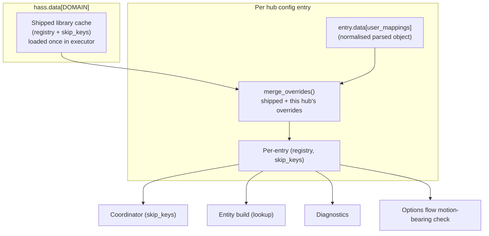
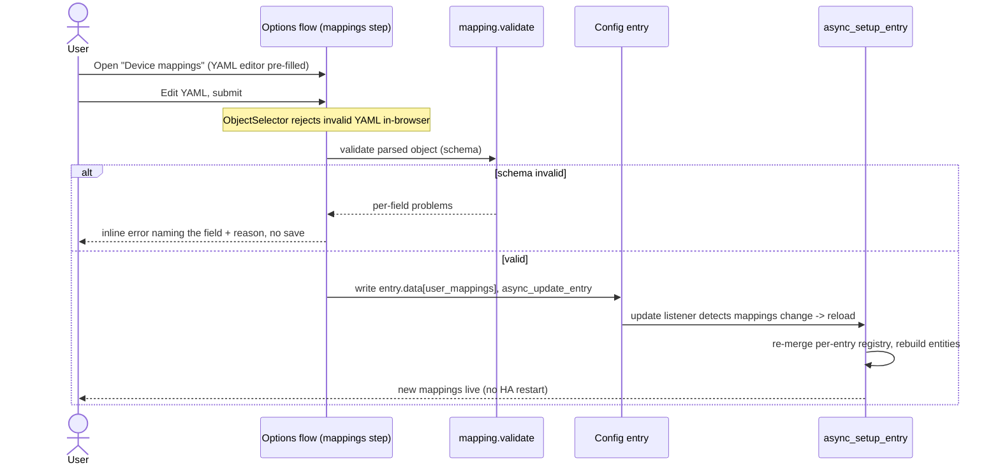
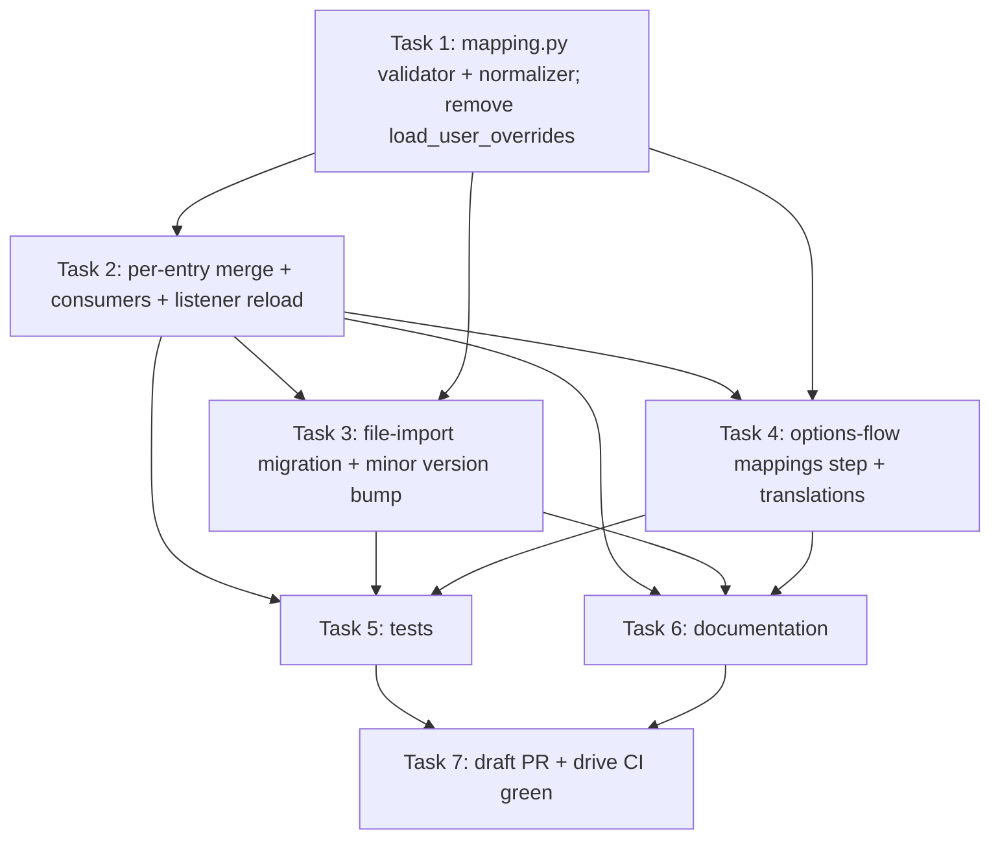

# Plan: UI-Editable Per-Hub Mapping Overrides

## Original Work Order

> re:
>
> > Per-installation user overrides — drop a `<config>/rtl_433_mappings.yaml` file to add or correct mappings without editing the integration.
>
> I want this to be editable in the user interface and not require a home assistant restart. The UI should use whatever editor UI Home Assistant has for editing YAML. Syntax errors should be caught before saving the YAML. There should be no need for a user to use the file manager or ssh in to the container, or use the terminal.
>
> Also: we are creating plan 14 in a different branch, use ID 15 for this one.

## Plan Clarifications

| Question | Decision |
| --- | --- |
| Where are UI-edited mappings stored? | **Per-hub config-entry storage** in `entry.data` (key `CONF_USER_MAPPINGS`), matching how per-device overrides are persisted and avoiding the options-flow wholesale-replace pitfall (see *Background*). The global `<config>/rtl_433_mappings.yaml` file is deprecated as a live source. This is an intentional backwards-compatibility break. |
| How are saved changes applied without an HA restart? | **Reload the affected hub config entry** in place (invalidate the per-entry merge and rebuild entities). No HA restart is needed; a brief socket reconnect is acceptable. |
| Which editor widget? | **Home Assistant's native YAML code editor** via `ObjectSelector` (`ha-yaml-editor`). It blocks unparseable YAML before submit and returns a parsed object. Comments/formatting are not preserved. |
| How much validation before a save is accepted? | **YAML syntax (handled by the editor) plus mapping-schema validation** server-side: a save is rejected with an inline form error when an entry is missing required fields or names an unknown platform, so entries can no longer be silently dropped. |
| What happens to an existing `rtl_433_mappings.yaml` on upgrade? | **Import once, then ignore.** On the first setup after upgrade, seed each hub entry's stored mappings from the existing file (non-destructively — the file is left on disk), then never read it again. |
| Is per-hub scope intended for multi-hub setups? | **Yes.** Each hub config entry owns its own mappings; the same correction is entered once per hub. |
| (Refinement) On import, which hubs are seeded from the global file? | **Every existing hub** is seeded with a copy of the file's mappings, preserving the file's prior global effect. Single-hub setups (the common case) are unaffected. |
| (Refinement) How detailed is a rejected-save error? | **Name the offending field(s) and the reason** (e.g. `custom_field_C: missing required 'platform'`). The validator returns per-entry problems; the form surfaces them. |
| (Refinement) Is the file ever read after migration? | **No — fully retired.** The file is read only during the one-time migration of pre-existing hubs. Hubs added later start empty. The file-reading path (`load_user_overrides`) is removed. |

## Executive Summary

The integration already supports per-installation mapping overrides, but only through a `<config>/rtl_433_mappings.yaml` file that is read once at setup and cached **globally** for every hub. Editing it requires file-system access (file manager / SSH / terminal) and an integration reload or Home Assistant restart to take effect — exactly the friction this work order removes.

This plan moves the override from a global file into **per-hub config-entry storage** and exposes it through a new step in the hub **options flow**, rendered with Home Assistant's native YAML code editor (`ObjectSelector`). The editor rejects unparseable YAML before the form can be submitted; on submit, the integration additionally validates the parsed mapping against the device-library schema and refuses to save (showing an inline error) if any entry is malformed, so the current "silently dropped entry" behaviour can no longer surprise a user. Saving persists the mappings into the entry and reloads that hub in place, rebuilding its entities with the new mappings — no Home Assistant restart.

Because storage becomes per-hub, the device-library merge must move from a single global cache to a per-entry merge layered on top of the still-globally-cached shipped library. Existing users are protected by a one-time migration that seeds each hub's stored mappings from any existing `rtl_433_mappings.yaml`, after which the file is ignored. The net outcome is that adding or correcting a mapping is a fully in-UI, restart-free operation, while the shipped library and its precedence rules are unchanged.

## Context

### Current State vs Target State

| Current State | Target State | Why? |
| --- | --- | --- |
| Overrides live in `<config>/rtl_433_mappings.yaml`, requiring file-system access to edit. | Overrides are edited in the hub options flow using HA's native YAML editor. | The work order requires editing in the UI with no file manager / SSH / terminal. |
| Override file is read once and merged into a single **global** `(registry, skip_keys)` cached on `hass.data[DOMAIN][DATA_LIBRARY]`, shared by all hubs. | The shipped library stays globally cached; the user override is merged **per hub** into a per-entry `(registry, skip_keys)`. | Storage is per-hub, so each hub's merged registry must be independent. |
| Changes take effect only on a manual integration reload or HA restart. | Saving in the UI reloads the affected hub entry in place. | The work order requires no HA restart; entities must rebuild to reflect platform/device-class/unit changes. |
| Malformed override entries are silently dropped at merge time. | Malformed entries are reported as an inline form error and the save is rejected. | A UI editor that silently discards input is a confusing "saved but nothing happened" experience. |
| No UI surface for overrides. | A new "Device mappings" step in the existing hub options menu. | The options flow is the only UI mechanism a custom integration has for editing configuration. |
| Existing file-based customizations would be lost by the storage change. | A one-time migration seeds each hub's stored mappings from the existing file. | Backwards-compatibility break must not silently destroy users' existing mappings. |

### Background

- The override schema and merge semantics already exist in `custom_components/rtl_433/mapping.py`: top-level keys are rtl_433 field names mapping to entry descriptors, with reserved `skip_keys:` (list, unioned) and `models:` (model-scoped, merged) keys. `merge_overrides` is a pure function that layers a parsed mapping over a base `Registry`/skip set; this plan reuses it unchanged for the per-entry merge and feeds it the stored object instead of file contents.
- `merge_overrides` and `_descriptor_from_entry` currently *log and skip* malformed entries. They must remain tolerant for the runtime merge, but the options flow needs a separate **validating** pass that surfaces the same problems as user-visible errors before storing.
- The merged registry is consumed in four places that currently read the global `DATA_LIBRARY`: entity construction (`entity.py`), the options flow's motion-bearing check (`config_flow.py`), diagnostics (`diagnostics.py`), and the coordinator (which receives `skip_keys`). All four must read the per-entry merge instead.
- `ObjectSelector` (frontend `ha-yaml-editor`) parses YAML client-side and returns a parsed object to the flow; this is what enforces "syntax errors caught before saving". The default value supplied to the selector is rendered back as YAML when the step is reopened, so the editor shows the current mappings.
- The hub options step (`async_step_hub`) calls `async_create_entry(data=user_input)` with only the hub-level keys, which **replaces `entry.options` wholesale** (and already drops the per-device options sub-map). Rather than retrofit merge-safety onto that pre-existing behaviour, this plan stores the mappings in **`entry.data`** (written via `async_update_entry(data=...)`, exactly as the per-device timeout/calibration overrides are), which `async_step_hub` never touches. This keeps scope off unrelated options-flow code and makes the stored mappings immune to the wholesale replace.
- Writing to `entry.data` via `async_update_entry` fires the existing `_async_update_listener`, so the same setup-time snapshot + compare pattern already used for `manage_settings` and calibration changes is reused to trigger the in-place reload only when the mappings actually changed.
- Config entries are at `VERSION = 2` with no minor version. The one-time file import is a natural fit for an entry migration (a minor-version bump with `async_migrate_entry`), which runs once before setup and can perform the file read in an executor.
- The shipped library files are parsed by **PyYAML (YAML 1.1)**, which coerces bare `on:`/`off:`/boolean payload keys to Python `True`/`False`; the existing `_normalize_payload` canonicalizes these to string `"on"`/`"off"`. The migration parses the legacy file the same way, so it **must normalize the parsed object to a JSON-serialisable, payload-canonical shape before storing it in `entry.data`** — otherwise boolean dict keys serialise to `"true"`/`"false"` in the config-entry JSON and `_normalize_payload` would not recognise them. Objects coming from the UI editor (parsed by the frontend as YAML 1.2) already use string `"on"`/`"off"` keys and are JSON-safe.

## Architectural Approach

The change has four cooperating components: a per-entry merge in the library loader, a validating parse in the mapping module, a new options-flow step using the native YAML editor, and a one-time file-import migration. The shipped library and the override schema/precedence are untouched.

### Per-Entry Library Merge
**Objective**: Make each hub's merged `(registry, skip_keys)` reflect that hub's own stored overrides while keeping the expensive shipped-library load global and cached.

The global `DATA_LIBRARY` cache is redefined to hold the **shipped library only** (no override merge). During each hub's setup, the integration reads that hub's stored mapping object from `entry.data`, runs the existing `merge_overrides` against a copy of the shipped library, and stores the resulting per-entry `(registry, skip_keys)` in a per-entry location reachable by the four consumers (the coordinator, entity build, diagnostics, and the options flow). The merge itself is pure and cheap; the executor is still used for the shipped-library glob/parse on first load. `load_user_overrides` (the file-reading merge helper) is removed from the codebase, since the file is no longer a live source *(per the file-retirement clarification)*.

### Validating Parse for the UI
**Objective**: Reject malformed mappings at save time with a clear, user-visible reason instead of silently dropping entries.

A new validation entry point in `mapping.py` takes the parsed object returned by the editor and checks it against the device-library schema: the top level must be a mapping; each field entry (other than the reserved `skip_keys`/`models` keys) must be a mapping that supplies the required `platform`, `name`, and `object_suffix` and names a supported platform; `skip_keys` must be a list; the `models:` block must be well-formed. It returns a **structured list of per-entry problems** (each naming the offending field/model and the specific reason) or success, without mutating anything *(per the error-detail clarification)*; the options step renders those problems into the inline form error. The runtime merge path keeps its existing log-and-skip tolerance so a future schema addition can never break a running hub; only the options flow gates on the stricter validation.

### Options-Flow Mappings Step
**Objective**: Provide the in-UI editing surface using Home Assistant's native YAML editor, applied without a restart.

A new "Device mappings" entry is added to the hub options menu. Its step renders a single `ObjectSelector` field pre-filled with the hub's current stored mappings (shown as YAML). On submit, the parsed object is validated; on failure the step re-shows the form with an inline error that names the offending field(s) and reason; on success the mappings are written into **`entry.data[CONF_USER_MAPPINGS]`** via `async_update_entry(data=...)` (leaving `entry.options` and the per-device sub-map untouched). That update fires the options-update listener, which detects a change to the stored mappings — using a setup-time snapshot, mirroring the existing `manage_settings`/calibration change detection — and reloads the hub entry so entities rebuild against the new per-entry registry. Because storage is in `entry.data`, no change to `async_step_hub` or other options steps is needed.

### One-Time File Import Migration
**Objective**: Preserve existing users' file-based mappings exactly once, then stop reading the file.

The config-entry minor version is bumped and an entry migration reads any existing `<config>/rtl_433_mappings.yaml` (in an executor), parses it, **normalizes it to a JSON-serialisable, payload-canonical shape** (so PyYAML's `True`/`False` payload keys become string `"on"`/`"off"` before they hit the config-entry JSON — see *Background*), and seeds the entry's stored mapping object from it. Because the file was previously global, **every existing hub is seeded with a copy** *(per the migration clarification)*, preserving its prior all-hubs effect; single-hub setups are unaffected. The file is left untouched on disk and is **never read again** by the running integration — a hub added after the upgrade starts with empty mappings *(per the file-retirement clarification)*. A hub with no existing file (or an empty/invalid one) migrates to an empty stored mapping. After migration the only live source of overrides is the per-entry stored object.

### Draft Pull Request and CI Verification
**Objective**: Land the work on a feature branch behind a draft PR and prove it green against the repository's CI before it is marked ready.

All work is done on a feature branch off `main` (not the current `docs/` branch). Once the implementation and documentation are complete, a **draft** pull request is opened against `main` with a Conventional-Commits-compliant title (the repo gates PR titles via the *Conventional Commits* workflow) — e.g. `feat(rtl_433): edit mapping overrides in the UI`. The PR body summarises the change, calls out the backwards-compatibility break (file → per-hub UI storage) and the one-time import migration.

The full CI matrix must pass on the PR: **Test** (`pytest` across the supported Python versions), **Lint** (`ruff`), **Validate** (`hassfest` + `hacs`), **Conventional Commits**, and **CodeQL**. Any failures are investigated and fixed on the branch — including failures surfaced only in CI that did not reproduce locally (e.g. a Python-version-specific test, a hassfest manifest complaint about the new minor version, or a lint rule) — and the branch is pushed until every required check is green. The PR stays in **draft** state for human review; it is not merged or marked ready by this work.

## Risk Considerations and Mitigation Strategies

Technical Risks

- **Options-flow steps replacing `entry.options` wholesale**: `async_step_hub` replaces the entire options dict, so anything the mappings feature stored in `entry.options` would be wiped when hub settings are saved.
    - **Mitigation**: store the mappings in `entry.data` (written via `async_update_entry`), which `async_step_hub` never touches; this sidesteps the clobber entirely without modifying the pre-existing hub step. A test asserts that saving hub settings leaves stored mappings intact.
- **Non-JSON-serialisable migrated payloads**: PyYAML parses bare `on:`/`off:` payload keys to Python `True`/`False`, which would serialise to `"true"`/`"false"` strings in the config-entry JSON and defeat `_normalize_payload`.
    - **Mitigation**: the migration normalizes the parsed object to a payload-canonical, JSON-safe shape before storing; a test round-trips a migrated binary `payload` through storage and asserts the descriptor resolves correctly.
- **Per-entry merge diverging from the old global behaviour**: relocating the merge from one global cache to four per-entry consumers risks a consumer still reading the stale global value.
    - **Mitigation**: audit and update all four call sites (`entity.py`, `config_flow.py`, `diagnostics.py`, coordinator wiring) in one change; assert via tests that an override set on one hub affects only that hub's entities.
- **`ObjectSelector` boolean/`on`/`off` key handling**: the editor parses YAML in the frontend, where bare `on`/`off` payload keys may be treated differently than PyYAML treats them.
    - **Mitigation**: the existing `_normalize_payload` already canonicalizes `on`/`off`/boolean keys; ensure stored-object entries flow through the same normalization, and add a test for a binary `payload` round-tripped through the stored-object path.

Implementation Risks

- **Backwards-compatibility break**: users relying on the live file lose that behaviour.
    - **Mitigation**: the one-time import migration seeds stored mappings from the file; documentation clearly states the file is now import-only; the file is never deleted.
- **Reload churn on every save**: reloading the entry reconnects the WebSocket and rebuilds entities.
    - **Mitigation**: reload only when the stored mappings actually changed (snapshot comparison), matching the existing calibration/manage-settings pattern; this is the accepted apply mechanism per the clarifications.
- **Lost comments/formatting**: `ObjectSelector` returns a parsed object, so comments in a migrated file are not preserved once edited in the UI.
    - **Mitigation**: documented as an accepted trade-off of the chosen editor; the original file remains on disk as a record.

Quality Risks

- **Validation drift between the runtime merge and the UI validator**: the tolerant merge and the strict validator could disagree about what is "valid".
    - **Mitigation**: both derive their notion of a valid entry from the same descriptor-construction logic in `mapping.py`; tests assert that anything the validator accepts merges without being dropped.

## Success Criteria

### Primary Success Criteria
1. A user can open the hub's options, select "Device mappings", edit overrides in Home Assistant's native YAML editor, and save — without touching the file system, SSH, or a terminal, and without restarting Home Assistant.
2. Submitting YAML the editor cannot parse is blocked before save; submitting parseable-but-schema-invalid mappings is rejected with an inline form error and nothing is stored.
3. A saved, valid change is reflected in the hub's entities after the automatic in-place reload (e.g. a re-classified field changes platform/device-class), with no other hub affected.
4. On upgrade, an existing `<config>/rtl_433_mappings.yaml` is imported once into each hub's stored mappings; subsequent edits to the file have no effect, and the file is left intact on disk.
5. Stored mappings survive editing other options areas (hub settings, per-device settings) and survive a restart.
6. The work lands on a feature branch behind a **draft** PR against `main`, and every required CI check (Test, Lint, Validate, Conventional Commits, CodeQL) is green — with any CI-only failures fixed on the branch.

## Self Validation

After implementation, perform these concrete checks:

1. Run the full test suite (`pytest`) and the linters/formatters configured in `.pre-commit-config.yaml` (ruff, etc.); confirm a clean pass including new tests for the per-entry merge, the validator, the options step, and the migration.
2. In a Home Assistant dev/test instance with the integration loaded, open the hub's options → "Device mappings"; confirm the field renders as the YAML code editor and is pre-filled with current mappings. Capture a screenshot.
3. In the editor, introduce a YAML syntax error and confirm the form cannot be submitted (editor-level error). Capture a screenshot.
4. Submit a schema-invalid entry (e.g. a field missing `platform`) and confirm the step re-renders with an inline error and nothing is stored. Capture a screenshot.
5. Submit a valid override that re-classifies a known field (e.g. `battery_ok` to a binary `battery` problem sensor); confirm the hub reloads automatically and the affected entity is rebuilt with the new platform/device-class, with no Home Assistant restart. Verify via the entity registry / states.
6. With two hubs configured, set an override on one and confirm via diagnostics/entities that only that hub's entities change.
7. Migration: pre-seed a `<config>/rtl_433_mappings.yaml` that includes a binary `payload` using bare `on:`/`off:` keys, start with two pre-migration hub entries, and confirm: each hub's stored mappings are populated from the file; the migrated `payload` keys are stored as JSON-safe string `"on"`/`"off"` (not `true`/`false`) and the resulting binary_sensor resolves correctly; the file is unchanged on disk; a later edit to the file changes nothing; and a hub added after migration starts with empty mappings.
8. Open a **draft** PR against `main` with a Conventional-Commits-compliant title, then poll the checks (e.g. `gh pr checks --watch`); confirm Test, Lint, Validate, Conventional Commits, and CodeQL all report success. If any check fails, read its logs (`gh run view --log-failed`), fix the cause on the branch, push, and re-confirm until every required check is green. Leave the PR in draft for human review.

## Documentation

- **`docs/device-library.md`** — rewrite the "User overrides" section: the override is now edited in the hub options flow with HA's YAML editor, stored per hub, validated before save, and applied via an automatic reload. Document the one-time file import on upgrade, that the file is otherwise ignored and not deleted, and the loss of comments once edited in the UI.
- **`README.md`** — update the feature bullet (lines ~37–38) and the "Device library and user overrides" section (~296–318) to describe the in-UI editor and per-hub storage instead of dropping a file.
- **`AGENTS.md`** — update any description of the override loading path / `DATA_LIBRARY` semantics to reflect the global-shipped-cache plus per-entry-merge split and the new options step.
- **`custom_components/rtl_433/translations/en.json`** — add the new options menu label, the "Device mappings" step title/description, the editor field label/helper text, and the validation error message(s).

## Resource Requirements

### Development Skills
- Home Assistant custom-integration development: config/options flows, selectors (`ObjectSelector`), config-entry storage, entry migrations (`async_migrate_entry` / minor-version bump), and in-place entry reloads.
- Familiarity with the existing `mapping.py` registry/merge model and the four registry consumers.
- pytest with the Home Assistant test fixtures already used in `tests/`.

### Technical Infrastructure
- A Home Assistant dev/test instance (or the project's existing test harness) for manual UI validation and screenshots.
- No new third-party runtime dependencies (the integration ships zero `requirements`; PyYAML and HA selectors are already available).

## Notes

- Scope is deliberately limited to relocating/UI-enabling the existing override mechanism. The override **schema**, the shipped device library, and the precedence (specificity-first) rules are unchanged.
- The file is import-only after upgrade and is never modified or deleted by the integration; users who prefer file-based workflows are explicitly steered to the UI editor in the documentation.

### Decision Log
- **Storage in `entry.data`, not `entry.options`**: per-device overrides already live in `entry.data[CONF_DEVICES]`, and `async_step_hub` replaces `entry.options` wholesale. Storing mappings in `entry.data` keeps them safe from that replace and keeps the change off unrelated options-flow code.
- **Per-entry merge, global shipped cache**: the expensive shipped-library glob/parse stays a single global executor load; only the cheap, pure `merge_overrides` runs per entry, so per-hub overrides do not multiply I/O.
- **Validator separate from the runtime merge**: the runtime merge stays tolerant (log-and-skip) for forward compatibility; a dedicated validator provides the strict, user-facing gate so the two concerns never conflict.
- **File fully retired after migration**: `load_user_overrides` is removed; migration is the only remaining file read; hubs added post-upgrade start empty.

### Change Log
- 2026-05-28: Added a final delivery component — open a **draft** PR against `main` (Conventional-Commits title) and drive the full CI matrix (Test, Lint, Validate, Conventional Commits, CodeQL) to green, fixing any CI-only failures — with matching Success Criterion and Self-Validation step.
- 2026-05-28: Refinement session. Moved override storage from `entry.options` to `entry.data` (resolves the `async_step_hub` wholesale-replace clobber without touching the hub step). Added the migration normalization requirement (PyYAML `on`/`off` → string keys, JSON-safe) to *Background*, the architecture, and *Risks*. Recorded three new clarifications: import into **every** existing hub, **per-field** rejected-save errors, and **full file retirement** (remove `load_user_overrides`; new hubs start empty). Updated both diagrams and added this Decision Log / Change Log.

## Execution Blueprint

**Validation Gates:**
- Reference: `.ai/task-manager/config/hooks/POST_PHASE.md`

### Dependency Diagram

### Phase 1: Mapping helpers
**Parallel Tasks:**
- Task 1: mapping.py validator + normalizer; remove `load_user_overrides`

### Phase 2: Per-entry merge core
**Parallel Tasks:**
- Task 2: per-entry merge + consumer rewiring + reload-on-change (depends on: 1)

### Phase 3: Migration + UI
**Parallel Tasks:**
- Task 3: one-time file-import migration + minor version bump (depends on: 1, 2)
- Task 4: options-flow "Device mappings" step + translations (depends on: 1, 2)

### Phase 4: Verification
**Parallel Tasks:**
- Task 5: tests (depends on: 2, 3, 4)
- Task 6: documentation (depends on: 2, 3, 4)

### Phase 5: Delivery
**Parallel Tasks:**
- Task 7: draft PR + drive CI green (depends on: 5, 6)

### Execution Summary
- Total Phases: 5
- Total Tasks: 7
