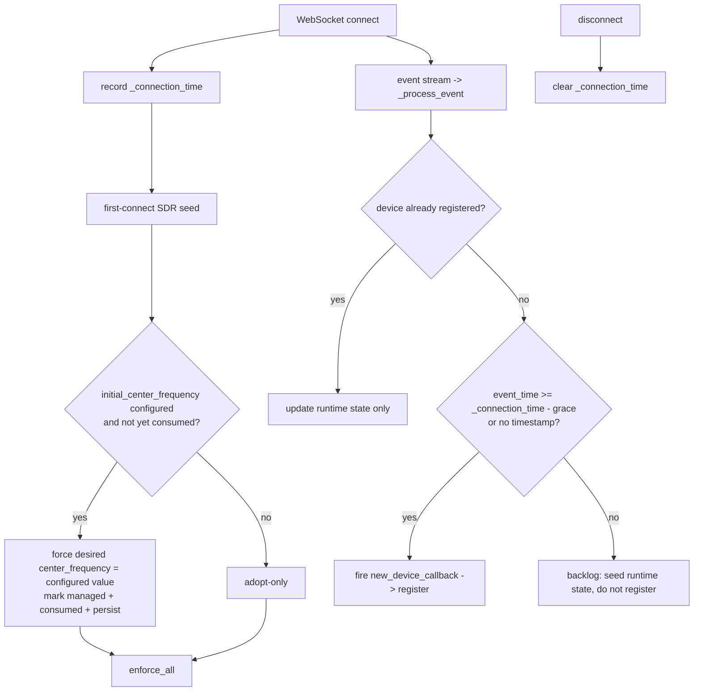
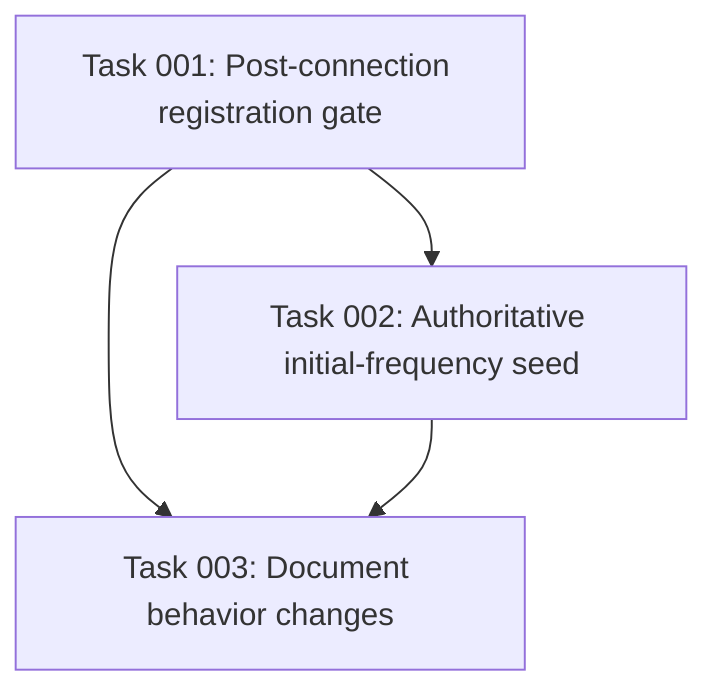

# Plan: Post-Connection Device Registration and Authoritative Initial Frequency

## Original Work Order

> Two issues to fix:
>
> - When I activated a new radio, I tried changing the frequency during setup. However, when the integration connected it picked up all of the previously published devices on the default 433MHz frequency. To prevent confusion, only devices with messages after connecting the integration should be registered.
> - It didn't look like the frequency setting actually stuck. My guess is the "manage settings" feature got confused, and connected and set the frequency based on the default, instead of pushing the value I'd put in during the config flow.

## Plan Clarifications

| Question | Answer |
| --- | --- |
| Where did the frequency appear reverted to 433.92 MHz? | The Center Frequency **control**, the Center Frequency **sensor**, AND the **radio kept receiving 433** — i.e. the desired value, the hardware readback, and the hardware itself were all stuck at the default. |
| Did you actually type a new value during setup? | Yes, a new (non-default) value was typed. |
| How should a backlog message be told apart from a fresh one for issue 1? | **Timestamp gate** (recommended): suppress auto-registration for events whose rtl_433 timestamp predates the connection, with a small grace window for clock skew. |
| Preserve backward compatibility? | **Behavior change is acceptable** as long as it is documented; existing registered devices may be re-evaluated. |

## Executive Summary

This plan fixes two related setup-time defects in the rtl_433 hub coordinator. **Issue 1:** on the first WebSocket connect the coordinator registers every device the server replays from its recent backlog, because the only timing gate (`_event_high_water`) is unset on a first connect and the new-device callback fires regardless of whether an event is part of the pre-connection backlog. The fix tracks a per-connection timestamp and only auto-registers a previously-unknown device once a message timestamped at/after the connection (within a small skew grace) is seen — backlog events still seed runtime state but no longer create/persist devices.

**Issue 2:** the setup-time `initial_center_frequency` only overrides adopted SDR state inside the `if not self._desired:` first-connect branch (`coordinator/base.py:422`). Whenever the desired-state store is already non-empty when that branch is reached — a prior adopt that persisted, a reconnect/retry, or management toggled on after the entry was created — the user's configured frequency is silently dropped and the server's adopted 433.92 MHz wins, exactly matching the reported "control + sensor + hardware all stuck at default." The existing regression test masks this because it drives a test-only helper (`_seed_initial_frequency`) that re-implements the production logic instead of exercising the real connect path. The fix makes the configured initial frequency a one-time authoritative seed that wins over adopted/persisted state independent of the `if not self._desired` guard, and replaces the divergent test helper with a real coordinator method so the path is genuinely covered.

Both fixes share new infrastructure (a tracked connection timestamp) and are deliberately scoped to setup/first-connect behavior. Per the agreed clarification, no migration of already-registered devices or already-saved frequencies is performed; behavior changes only for new connections and new setups going forward.

## Context

### Current State vs Target State

| Current State | Target State | Why? |
| --- | --- | --- |
| On first connect, `_event_high_water` is `None`, so backlog events <30s old classify as "live" and older ones as "stale gap" — both still fire the new-device callback and persist the device. | A previously-unknown device is auto-registered only when an event timestamped at/after the connection time (minus a small skew grace) is observed; backlog events seed runtime state but do not create or persist devices. | The user changed frequency during setup but saw all the old default-band devices appear, causing confusion. |
| The new-device callback's "is this new" decision is `key not in self.devices`, so a backlog event consumes the "new" status and a later genuine live event for the same device cannot trigger registration. | Registration is driven by a discovery gate separate from runtime `devices` tracking, so a device first seen in the backlog still registers on its first post-connection message. | Avoid permanently suppressing a real device that merely happened to also appear in the backlog. |
| `initial_center_frequency` overrides adopted state only inside `if not self._desired:` (`base.py:422`); a non-empty desired store at that point drops the user value. | The configured initial frequency wins over adopted/persisted center frequency exactly once after setup, regardless of whether the desired store is already populated. | The user typed a frequency, but the control, sensor, and hardware all stayed at the default 433.92 MHz. |
| `test_initial_frequency_seeds_over_adoption_on_first_connect` calls a test-only `_seed_initial_frequency` helper that re-implements `_connect_loop`'s seeding branch. | The first-connect seeding is a single real coordinator method exercised by both production and tests. | The duplicated helper let the production regression pass undetected. |
| No record of when the coordinator connected. | The coordinator records the UTC time of each successful WebSocket connect and clears it on disconnect. | Shared prerequisite for the registration timestamp gate. |

### Background

- **Transport / discovery path:** the coordinator streams events over a WebSocket (`coordinator/base.py:405`); each event flows `_handle_text_frame -> _process_event` (`base.py:834`), which normalizes, classifies replay-vs-live via `_event_high_water` and a 30s `REPLAY_STALE_THRESHOLD`, stores runtime state in `self.devices`, and fires `new_device_callback(key, model, is_replay)` (`base.py:900`). The callback in `__init__.py` (~`:421`) dispatches `signal_new_device` and persists the device into `entry.data[CONF_DEVICES]` via the entity platform (`entity.py:~600`). Events already carry a parseable timestamp through `_parse_event_time` (`base.py:796`).
- **Frequency path:** config flow stores `CONF_INITIAL_FREQUENCY` into `entry.data` only when `manage_settings` is on and the value is present (`config_flow.py:189`, `:412`); `__init__.py:480` passes it as `initial_center_frequency`; the coordinator seeds it over adoption only when `_desired` is empty (`base.py:429`). Desired state is loaded once at `async_start` (`base.py:337`) and persisted to a `Store`; `_adopt_from_server` persists adopted values (`base.py:750`).
- The 433.92 default and the `default=DEFAULT_INITIAL_FREQUENCY` form pre-fill were introduced in the most recent release (commit `f955e08`); the user did type a different value, so the defect is in how the configured value is applied at connect time, not in the form default itself.

## Architectural Approach

The work has three components: a shared connection-timestamp primitive, the registration gate (issue 1), and the authoritative initial-frequency seed plus its test de-duplication (issue 2). All changes are confined to `coordinator/base.py` and its tests, with documentation updates; no config-flow schema or storage-migration changes are required.

### Component 1 — Connection timestamp primitive
**Objective**: Provide the single source of truth both fixes rely on for "did this happen after we connected."

Add a coordinator attribute holding the UTC time of the current successful WebSocket connection, set immediately after the socket opens in `_connect_loop` (alongside `self.connected = True`, `base.py:407`) and cleared in the loop's `finally` on disconnect (`base.py:449`). Use the existing `dt_util.utcnow()` already imported. This value is intentionally per-connection (reset on every reconnect) so the registration gate re-arms after each reconnect, matching the existing replay machinery.

### Component 2 — Post-connection device registration gate (Issue 1)
**Objective**: Only auto-register a previously-unknown device after a genuinely post-connection message for it is seen, while keeping runtime state seeding intact.

Introduce a discovery gate in `_process_event` that decides registration independently of the runtime `devices` membership used for liveness/replay. A previously-unknown device fires `new_device_callback` only when the triggering event is "post-connection": its parsed `event_time` is at or after `_connection_time` minus a small skew-grace constant, OR the event has no usable timestamp (preserving the existing "never drop a real one" stance). Backlog events for unknown devices still populate `self.devices`, `seen_fields`, and field diagnostics so the device can seed values, but must not fire the callback and must not be consumed as "already discovered," so the device still registers on its first true post-connection event. Devices already present in `entry.data[CONF_DEVICES]` are unaffected (the `__init__.py` callback already skips known keys and their entities load at startup). Add a named grace constant near `REPLAY_STALE_THRESHOLD` and document the clock-sync assumption.

### Component 3 — Authoritative initial frequency + test de-duplication (Issue 2)
**Objective**: Guarantee the setup-time frequency wins over adopted/persisted SDR state exactly once, and make the real code path testable.

Extract the first-connect SDR seeding currently inline in `_connect_loop` (`base.py:420-435`) into a single real coordinator method, and change the initial-frequency layering so it no longer depends on `_desired` being empty: when `initial_center_frequency` is configured and has not yet been consumed, force the desired center frequency to the configured value, mark it managed, persist, and record that the one-time seed has been consumed (a persisted flag in the existing SDR `Store`, so it is honored across restarts and reconnects but never re-applied after the user later changes the value). Adoption of the *other* fields is unchanged. Then delete the test-only `_seed_initial_frequency` helper in `tests/test_sdr_controls.py` and point those tests (and a new regression that reproduces the "desired already populated" failure) at the extracted production method.

## Risk Considerations and Mitigation Strategies

Technical Risks

- **Clock skew between the rtl_433 server and Home Assistant**: a server clock ahead of HA could make fresh events look pre-connection (suppressed); behind could let recent backlog through.
    - **Mitigation**: apply a small named grace window to the gate, treat missing timestamps as post-connection, and document the synced-clock assumption (the user explicitly chose the timestamp approach knowing this).
- **Backlog-then-live device never registers**: if the gate consumed the "new" status on a backlog event, a later live event could not register the device.
    - **Mitigation**: keep the discovery decision separate from `self.devices` membership so a backlog-seen device still registers on its first post-connection event.

Implementation Risks

- **One-time seed re-applying and clobbering a later user change**: a naive "always force" would overwrite a frequency the user later sets via the control.
    - **Mitigation**: gate the forced seed on a persisted "consumed" flag so it applies exactly once per setup, never again.
- **Divergent test helper hides the real fix**: continuing to test a re-implementation would let the production path regress.
    - **Mitigation**: delete the helper and exercise the extracted production method directly, including a test that reproduces the non-empty-`_desired` failure.

## Success Criteria

### Primary Success Criteria
1. After connecting to a server holding a backlog of devices, only devices whose messages are timestamped at/after the connection (within the grace window) are registered/persisted; backlog-only devices do not appear, and a backlog device that later transmits live still registers on that live event.
2. A hub configured with a non-default initial frequency and managed settings ends the first connect with the desired center frequency, the managed flag, and the enforced `/cmd` all equal to the configured value — even when the desired store is already populated before seeding.
3. The one-time initial-frequency seed is not re-applied on later connects, so a value the user subsequently changes via the control survives.
4. `tests/test_sdr_controls.py` exercises the real first-connect seeding method (no re-implemented helper) and includes a regression covering the previously-non-empty desired-state case.

## Self Validation

After implementation, run the integration's Python 3.14 test suite via `uv` (system Python is 3.13; see project memory) and confirm:
- `uv run pytest tests/test_sdr_controls.py -q` passes, including the new non-empty-`_desired` regression, and that temporarily reverting the Component 3 change makes that regression fail (proving it catches the bug).
- Add/inspect a coordinator test that feeds `_process_event` a backlog event (timestamp before `_connection_time`) followed by a live event (timestamp after), asserting the new-device callback fires exactly once and only for the post-connection event; run `uv run pytest tests/ -q -k "register or discovery or frequency"`.
- Run the full suite `uv run pytest tests/ -q` to confirm no regressions in config-flow or coordinator tests.
- Grep `tests/test_sdr_controls.py` to confirm `_seed_initial_frequency` no longer exists and the tests reference the production method.

## Documentation

Update `AGENTS.md` (and the README setup section if it describes initial-frequency behavior) to state that (a) only devices seen after connection are auto-registered, noting the server/HA clock-sync assumption and grace window, and (b) the setup-time initial frequency authoritatively overrides adopted SDR settings once. Note the behavior change in `CHANGELOG.md` via the normal release-please commit convention.

## Resource Requirements

### Development Skills
- Python / asyncio, Home Assistant coordinator and config-entry patterns, `pytest` with the HA test harness.

### Technical Infrastructure
- `uv`-managed Python 3.14 environment for the test stack; the existing aioclient/Store test fixtures in `tests/`.

## Notes
- Scope is intentionally limited to first-connect/setup behavior; no storage migration and no config-flow schema changes. Existing registered devices and saved frequencies are left intact per the agreed behavior-change-OK clarification.
- A separate, follow-up change (device-name formatting) requested by the user is tracked outside this plan and committed alongside it in the same pull request.

## Execution Blueprint

**Validation Gates:**
- Reference: `/config/hooks/POST_PHASE.md`

### Phase 1: Registration gate
**Parallel Tasks:**
- Task 001: Connection timestamp primitive + post-connection device registration gate (Issue 1), with tests

### Phase 2: Frequency fix
**Parallel Tasks:**
- Task 002: Authoritative initial-frequency seed + test de-duplication (Issue 2) (depends on: 001)

### Phase 3: Documentation
**Parallel Tasks:**
- Task 003: Document the registration-gate and initial-frequency behavior changes (depends on: 001, 002)

### Post-phase Actions
Run the validation gate (`POST_PHASE.md`) after each phase; the full `uv run pytest tests/ -q` suite must pass before advancing.

### Execution Summary
- Total Phases: 3
- Total Tasks: 3
