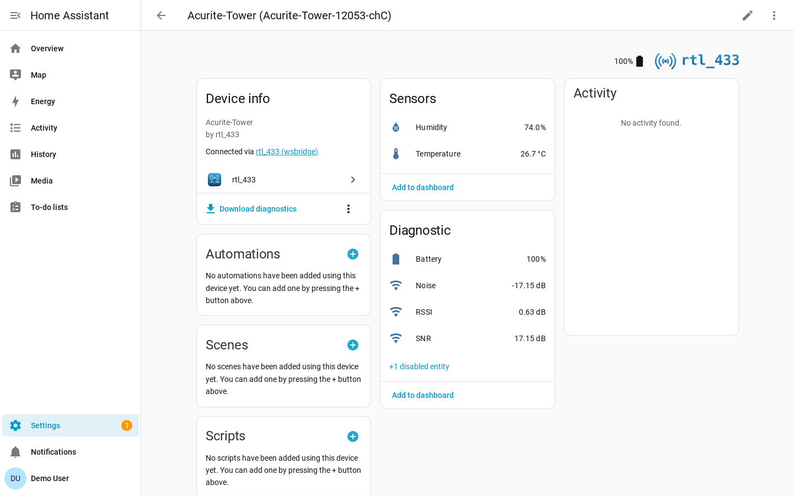
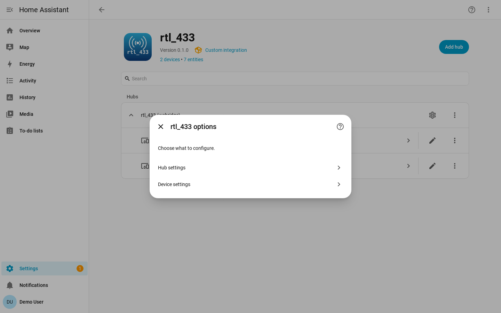
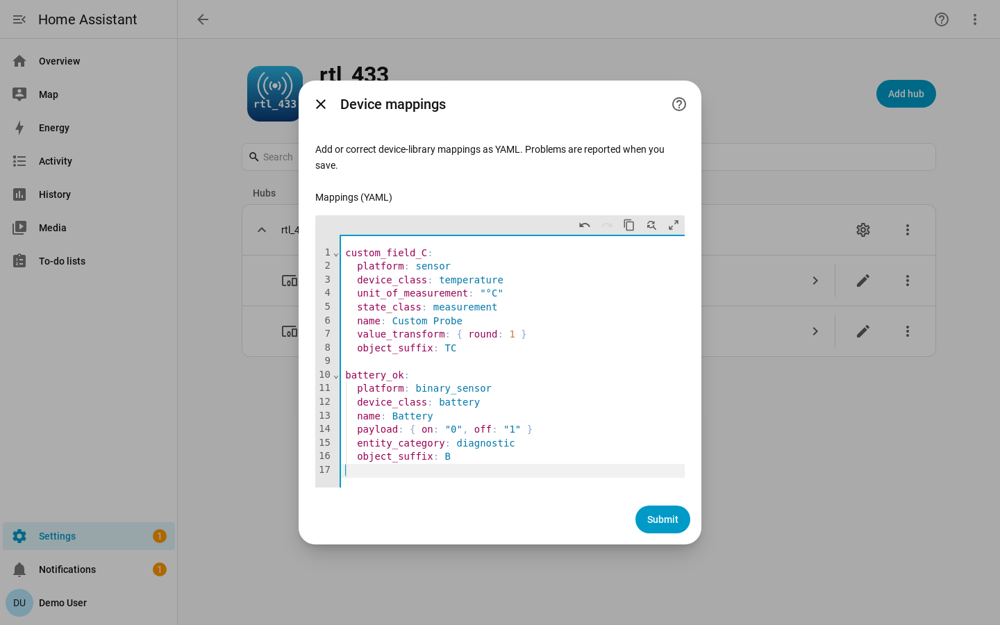
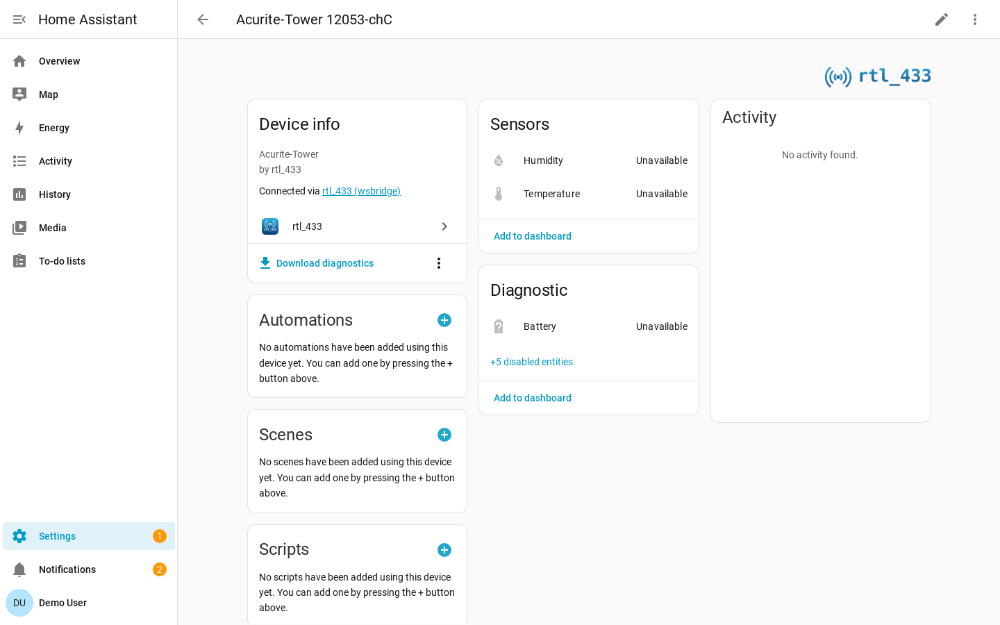

# rtl_433 for Home Assistant

[](https://github.com/rtl-433-hass/rtl_433/actions/workflows/test.yml)
[](https://github.com/rtl-433-hass/rtl_433/actions/workflows/lint.yml)
[](https://github.com/rtl-433-hass/rtl_433/actions/workflows/validate.yml)
[](https://hacs.xyz)

A Home Assistant custom integration that connects to an
[rtl_433](https://github.com/merbanan/rtl_433) HTTP server's WebSocket stream and
turns the 433 MHz / ISM-band devices it decodes (weather stations, soil/leak
sensors, door contacts, energy meters, remotes, doorbells, and more) into
native Home Assistant sensors, binary sensors, and event entities.

It is a **local push** integration: events arrive over a WebSocket as rtl_433
decodes them, so there is no polling and no cloud dependency.

## Overview

[rtl_433](https://github.com/merbanan/rtl_433) decodes RF transmissions from an
SDR and can expose decoded events over an HTTP/WebSocket API (`-F http`). This
integration connects to that endpoint, normalizes each event into a stable
device identity, and maps the raw fields to Home Assistant entities using a
data-driven [device library](docs/device-library.md). You add one hub per
rtl_433 server, and the devices it decodes appear automatically as nested
devices under that hub (rfxtrx-style).

You run one rtl_433 server (with your SDR); this integration is the Home
Assistant side. It does **not** talk to an SDR directly and ships no native
requirements.

## Features

- **Local push** over the rtl_433 WebSocket — no polling, no cloud.
- **Data-driven device library** — device support is YAML, not Python. Add or
  correct a device with a small, reviewable
  [mapping change](docs/device-library.md).
- **Per-hub user overrides** — add or correct mappings from the hub's options
  using Home Assistant's built-in YAML editor; validated before save and applied
  by an automatic reload. No file editing or restart required.
- **Automatic nested devices** — each newly observed device is added
  automatically as a device-registry device under the hub, gated by a per-hub
  discovery toggle. Remove one from its device page; with discovery on it
  re-appears the next time it transmits.
- **Configurable availability** — entities go `unavailable` after a silence
  window; set a hub-wide default and override it per device.
- **Multiple servers** — add one hub per rtl_433 server; identities are scoped
  per hub so two servers that see the same device model never collide.
- **Hub observability** — each hub gets diagnostic entities for its connection,
  SDR/meta configuration (center frequency, sample rate, gain, ppm, …), and
  server statistics (decoded events, OOK/FSK frames). See
  [Hub entities](#hub-entities).
- **Managed SDR settings (optional)** — let Home Assistant own the receiver's
  SDR settings. When on, the hub exposes number/select/switch **controls** for
  frequency, sample rate, gain, ppm, conversion mode, and hop interval; Home
  Assistant adopts the server's current values and re-applies them after every
  reconnect, so your settings survive an rtl_433 restart. See
  [Managing SDR settings from Home Assistant](#managing-sdr-settings-from-home-assistant).
- **Diagnostics feedback loop** — downloadable diagnostics list the
  `unmatched_field_keys` a hub has seen, telling you exactly what to add to the
  library.

## Installation

### HACS (custom repository)

This integration is not (yet) in the default HACS store, so add it as a custom
repository:

1. In Home Assistant, open **HACS**.
2. Click the **⋮** menu (top right) → **Custom repositories**.
3. Enter the repository URL `https://github.com/rtl-433-hass/rtl_433` and choose
   the **Integration** category, then **Add**.
4. Search for **rtl_433** in HACS, open it, and click **Download**.
5. **Restart Home Assistant.**

### Manual

1. Copy the `custom_components/rtl_433` directory from this repository into your
   Home Assistant `<config>/custom_components/` directory, so you end up with
   `<config>/custom_components/rtl_433/`.
2. **Restart Home Assistant.**

## Configuration

Add a hub from **Settings → Devices & Services → Add Integration → rtl_433**.
Each hub points at one rtl_433 server's WebSocket endpoint.

| Field | Default | Description |
| --- | --- | --- |
| **Host** | *(required)* | Hostname or IP of the machine running rtl_433. |
| **Port** | `8433` | The rtl_433 HTTP-API port (`-F http` default). |
| **Path** | `/ws` | The WebSocket path on the rtl_433 HTTP server. |
| **Secure** | off | When on, connect with `wss://` instead of `ws://` (TLS). |
| **Manage rtl_433 settings from Home Assistant** | on | When on, expose SDR controls on the hub and let Home Assistant adopt and enforce the receiver's settings. See [Managing SDR settings from Home Assistant](#managing-sdr-settings-from-home-assistant). |

The integration validates that it can reach the WebSocket before creating the
hub. The hub's identity is derived from `host:port`, so the same server cannot
be added twice.

The **Manage rtl_433 settings from Home Assistant** toggle can be changed later
from the hub options (see [Editing options](#editing-options)).

To point an existing hub at the same server's new address, open **Settings →
Devices & Services → rtl_433 → the hub → Reconfigure** and update the
host/port/path/secure connection target in place; nested devices and their
history are preserved. Use **Reconfigure** for the connection target, and
**Configure** (options) for the discovery toggle, availability timeouts, and the
**Manage rtl_433 settings from Home Assistant** toggle.

### `ws://`, `wss://`, and authentication

- By default the connection is plain **`ws://host:port/path`**.
- Turning on the **Secure** toggle makes it **`wss://`** (TLS). rtl_433's own
  HTTP server does not terminate TLS, so to use `wss://` you put a TLS
  **reverse proxy** (for example nginx or Caddy) in front of rtl_433 and point
  the hub at the proxy.
- There is **no in-integration authentication**. rtl_433's HTTP-API is
  unauthenticated; if you need access control, place it behind a reverse proxy
  or restrict it on your network. The integration sends no credentials.

## Discovery

RF devices appear automatically as **nested devices under the hub** — there is
no card to accept or dismiss:

- When the hub decodes a device it does not yet know, it **adds it
  automatically** as a Home Assistant device under the hub, along with its
  sensor / binary_sensor entities, and raises an **in-app persistent
  notification** (stable per-device id, so a deleted device that later
  re-appears replaces its notification rather than duplicating it). Restarting
  Home Assistant does **not** re-notify for already-known devices.
- To get rid of an unwanted device, open it under **Settings → Devices &
  Services → rtl_433 → the device → Delete**. There is no persistent ignore
  list: with discovery **on**, a deleted device **re-appears** the next time it
  transmits. To keep it gone, turn the hub's discovery toggle off first.

Each hub has its own **discovery toggle** (see options below). Turning discovery
**off** stops new devices on that hub from being added; devices that already
exist keep updating. Turning it back **on** lets new (and previously deleted)
devices appear again as they transmit.

## Availability

RF devices announce their presence only by transmitting, so the integration uses
a silence-based availability model: if no event for a device arrives within its
**availability timeout**, its entities become `unavailable`.

**Two transmit cadences.** How long a device can reasonably stay silent before
"silent" really means "gone" depends on what kind of device it is:

- **Periodic transmitters** (weather / temperature / soil / air quality) send on
  a fixed cadence regardless of any event, so a short timeout suits them — a few
  missed transmissions is a real problem.
- **Event-driven devices** (door/window contacts, motion/PIR, security sensors)
  only transmit on an event, plus at most an occasional supervision heartbeat.
  Long silences are *normal* — a short timeout would flap them to `unavailable`
  constantly. Some cheap generic sensors send **no heartbeat at all**.

| Device | Type | Typical cadence |
| --- | --- | --- |
| Acurite temperature | Periodic | ~16 s |
| Ecowitt / Fine Offset WH51 soil | Periodic | ~72 s |
| Ecowitt WH41 air quality | Periodic | ~10 min |
| GE / Interlogix motion | Event-driven | heartbeat ~1 h |
| Honeywell 5800 contacts | Event-driven | heartbeat ~70–90 min |
| Generic EV1527 door / PIR | Event-driven | **none** — silent for days |
| TPMS (parked vehicle) | Event-driven | **none** — silent until driven |

- **Hub default** — set on the hub options flow (**Hub settings**). When you
  leave it unset, the timeout is chosen **per device by its Home Assistant device
  class** (see below). If you set it explicitly, your value becomes the default
  for every device on the hub that has no per-device override.
- **Device-class-aware defaults** — when no explicit timeout applies, the
  integration picks the default from the device's class: event-driven
  binary-sensor classes (door, window, opening/contact, motion) default to
  **7200 seconds (2 hours)** to ride out their long quiet periods, while periodic
  sensors keep **600 seconds (10 minutes)**. This applies **automatically**,
  including to existing installs that never customized the hub timeout; any
  explicit per-device or hub value you have set is always preserved.
- **Never expire** — set the timeout to `0` (as the hub default or a per-device
  override) and the device is **never** marked `unavailable`. Recommended for
  heartbeat-less generic door/PIR sensors and for TPMS that go silent while the
  vehicle is parked.
- **Per-device override** — set through the hub options flow (**Device
  settings**): pick a device and give it an optional timeout (including `0`) that
  overrides the hub default for that one device. Leave it empty to clear the
  override and fall back to the hub default (or, if that is unset, the
  device-class default).
- **Resolution order** — per-device override → hub default (if you set one) →
  device-class default → 600 s fallback.
- **Restart behavior** — on a Home Assistant restart, the last known states are
  **restored first**, then the timeout runs from the restart; entities only flip
  to `unavailable` once the (restored) silence window elapses without a fresh
  event.
- **Last seen** — every device also gets a diagnostic `timestamp` sensor named
  **Last seen** (disabled by default — enable it from the device page when you
  want it) that reports when the device was last heard from. Unlike the
  measurement sensors — which become `unavailable` after the availability
  timeout elapses with no transmission — the Last seen sensor **stays
  available** and keeps showing the last-heard time, so you can build "no signal
  for N minutes" staleness alerts and dashboards against it. It restores its
  previous value across restarts.
- **Event entities** — momentary, fire-and-forget RF (remote buttons,
  doorbells, key fobs) becomes a native HA **event** entity rather than
  a sensor with a faked "off". Each transmission fires one event whose type is
  the transmitted value; like the Last seen sensor, event entities **stay
  available** between presses instead of going `unavailable`. The shipped
  mappings are in
  [`device_library/events.yaml`](docs/device-library.md#event-entities).
- **Motion / occupancy** — detect-only PIR sensors (which send a trip but never
  an "off") become an occupancy `binary_sensor` that auto-clears to off a set
  time after the last detection (default 90 s, tunable per device in the device
  options). See
  [Motion / occupancy](docs/device-library.md#motion--occupancy).
- **No late event replays** — on reconnect or a Home Assistant restart, rtl_433
  replays its recent event history. Momentary RF events that occurred **while HA
  was disconnected** are intentionally **not re-fired**, so a doorbell press
  from an hour ago can't trigger your automations late (they are logged at
  INFO instead). Their latest readings still seed the corresponding sensors. No
  configuration; nothing to set up.

Both options apply **live** — changing the discovery toggle or a timeout takes
effect without reloading the hub or tearing down the WebSocket.

### Editing options

Open **Settings → Devices & Services → rtl_433 → Configure** on the hub. The
options flow presents a menu:

- **Hub settings** — the **discovery toggle**, the **default availability
  timeout**, and the **Manage rtl_433 settings from Home Assistant** toggle for
  this server.
- **Device settings** — pick a known device and set or clear its **per-device
  availability-timeout override** and, for utility meters, its **consumption
  calibration** (see [Utility-meter calibration](#utility-meter-calibration)).

Changing the **Manage rtl_433 settings from Home Assistant** toggle reloads the
hub (the SDR controls appear or disappear); changing the discovery toggle or a
timeout applies live.

To instead change the hub's connection target (host/port/path/secure) — the
same server at a new address — use **Reconfigure** rather than **Configure**;
nested devices and their history are preserved (see
[Configuration](#configuration)).

## Hub entities

Besides the per-device sensors, each hub exposes its own **diagnostic entities**
on the hub device so you can watch the server itself:

- **Connectivity** (binary_sensor) — `on` while the hub's WebSocket connection is
  open, `off` otherwise. It flips `off` immediately when the server announces a
  shutdown, rather than waiting for a silence timeout.
- **SDR / meta diagnostics** (sensors) — the receiver's current configuration:
  **center frequency**, **sample rate**, **conversion mode**, **hop interval**,
  **gain** (an empty value reads `auto`), and **frequency correction** (ppm). The
  configured `frequencies` and `hop_times` arrays are exposed as attributes on
  the center-frequency sensor.
- **Server statistics** (sensors) — **decoded events** (cumulative; tolerates the
  server's counter resetting), **OOK frames**, **FSK frames**, and **enabled
  decoders**. The per-protocol `stats[]` breakdown and the `since` timestamp are
  exposed as attributes on the decoded-events sensor.

These hub sensors fetch their data over HTTP from the rtl_433 server's `/cmd`
endpoint at the **server root** — `http(s)://host:port/cmd` — independent of the
configured WebSocket path. If a reverse proxy exposes only the WebSocket path and
not `/cmd`, those sensors gracefully degrade to `unknown` while the event stream
and the connectivity sensor keep working. The statistics refresh periodically
while the hub is connected; the SDR/meta values are fetched on each (re)connect.

When **Manage rtl_433 settings from Home Assistant** is on (the default), the
five SDR/meta diagnostic **sensors** above (sample rate, conversion mode, hop
interval, gain, ppm) are replaced by the **controls** described below — the
center-frequency sensor stays, since it still reports the receiver's actual
tuned frequency.

### Managing SDR settings from Home Assistant

By default a new hub adopts and manages the receiver's SDR settings. With
**Manage rtl_433 settings from Home Assistant** on, the hub gains a set of
**controls** (under the hub device, in the config-entity category):

- **Center frequency** (number, Hz) — shown only when the receiver uses a
  **single** frequency (see the hopping note below).
- **Sample rate** (number, Hz)
- **Frequency correction** (number, ppm)
- **Gain** (number, dB) paired with an **Auto gain** switch — with Auto gain
  **on**, gain is set to automatic and the dB value is ignored; with it **off**,
  the **Gain** number's value is sent.
- **Conversion mode** (select: `native` / `si` / `customary`)
- **Hop interval** (number, seconds) — the dwell time per frequency, so it
  applies only when the receiver hops between **multiple** frequencies; with a
  single frequency there is nothing to hop between and the control is hidden.

What "managed" means:

- On the **first connect** Home Assistant **adopts** the server's current
  settings into its desired state, then **re-applies all managed settings on
  every reconnect**, so your values survive an rtl_433 restart.
- **Home Assistant becomes the authority.** Once a hub is managed, change these
  settings **in Home Assistant**, not in the rtl_433 config file — Home
  Assistant re-applies its stored values on the next reconnect and will override
  a direct edit you made to the rtl_433 config.

**Re-syncing from the rtl_433 config (the only way).** There is deliberately no
"re-adopt" button or service. If you have changed the rtl_433 config directly
and want Home Assistant to pick up those values, do this dance:

1. Turn **Manage rtl_433 settings from Home Assistant** **off** (this clears
   Home Assistant's stored desired state).
2. **Restart rtl_433** so it loads its config.
3. Turn the toggle back **on** — on the next connect Home Assistant re-adopts
   the server's now-current settings from scratch.

**Requirements and caveats:**

- The controls need the server's **`/cmd` endpoint reachable** at the server
  root, `http(s)://host:port/cmd` (independent of the WebSocket path). Behind a
  reverse proxy that hides `/cmd`, commands cannot be sent.
- **Hopping setups** (more than one configured frequency) keep **center
  frequency unmanaged**, so Home Assistant never pins a hopping receiver to a
  single frequency — and the **Center frequency** control is hidden
  (unavailable) while the **Hop interval** control becomes available. With a
  single frequency it is the reverse. The frequency *list* itself can only be
  set in the rtl_433 config; the API has no command for it.
- **Multi-stage gain strings** are not supported by the single gain control —
  manage those through the rtl_433 config (or turn the toggle off).

**Turning management off** removes all the controls, stops Home Assistant from
sending any commands, and clears its stored desired state; the six read-only
SDR/meta diagnostic [Hub entities](#hub-entities) sensors come back. The
receiver's settings are left untouched.

## Device library and user overrides

Device support is a set of themed YAML files (the **device library**) that map
each rtl_433 field name to a Home Assistant entity descriptor. Adding or
correcting a device is a small YAML change — no Python. The schema, file layout,
add-a-mapping workflow, and the diagnostics feedback loop are documented in the
contributor guide:

- **[docs/device-library.md](docs/device-library.md)** — the authoritative
  device-library reference.

You can extend or correct the shipped library for your own installation, without
editing the integration files and without touching disk, from the hub's options:

> **Settings → Devices & Services → rtl_433 → Configure → Device mappings**

This opens Home Assistant's built-in YAML editor pre-filled with that hub's
current overrides. Overrides use the same schema as the shipped library:
top-level keys are rtl_433 field names, values are entry mappings, and they may
include a `skip_keys:` list. Overrides win over shipped entries (full
replacement), new fields are added, and `skip_keys` are unioned.

**Overriding one device model.** A top-level key changes a field for *every*
device that emits it. To correct a mapping for a single model without touching
others, nest it under a `models:` block keyed by the exact rtl_433 `model`
string — a model-scoped entry always wins over a global one for that model:

```yaml
models:
  Acurite-Tower: # exact rtl_433 model string
    temperature_C:
      platform: sensor
      device_class: temperature
      unit_of_measurement: "°C"
      state_class: measurement
      name: Outdoor temperature # rename just this model's sensor
      value_transform: { round: 2 }
      object_suffix: T
```

Mapping overrides are **global or model-scoped** — they apply to all devices of a
model, never a single physical unit. Per-*instance* settings (availability
timeout, meter calibration, motion clear delay) live in **Device settings**
instead. See [model-scoped mappings](docs/device-library.md#model-scoped-mappings-models)
for the resolution order and a worked example.

Overrides are stored **per hub** — each hub has its own set. The editor blocks
invalid YAML and **validates the mapping schema on save**, rejecting bad input
with a per-field error rather than silently dropping it; on save the hub
**reloads automatically** so the change takes effect with no restart. If you had
a `<config>/rtl_433_mappings.yaml` from an earlier version, it is **imported once
into each existing hub** on upgrade and then ignored (the file is left on disk,
untouched). See [User overrides](docs/device-library.md#user-overrides) for the
details and examples.

## Utility-meter calibration

Utility meters (electricity, gas, and water meters decoded by the SCM / ERT /
SCMplus protocols) report a raw **consumption counter**, but the RF signal does
**not** carry that counter's unit or scale — different meters report in different
granularities (e.g. some in 1 kWh, others in 10 Wh), so the integration cannot
derive it automatically. Out of the box the consumption sensor is therefore a
plain, unitless `total_increasing` counter, which is **not** eligible for Home
Assistant's Energy dashboard.

To make it Energy-dashboard-eligible, calibrate the device. Open **Settings →
Devices & Services → rtl_433 → Configure → Device settings**, pick the meter, and
set its **consumption calibration**:

- **Commodity** — `none` / `energy` / `gas` / `water`. This sets the sensor's
  `device_class`. Choosing `none` clears any calibration and the sensor reverts
  to the unitless counter. When the meter reports a `MeterType` (or `ert_type`)
  hint, the commodity is **pre-filled** from it; you can always override it.
- **Base unit** — the unit the calibrated counter is expressed in, constrained to
  the units Home Assistant recognizes as convertible for that commodity
  (energy → Wh/kWh/MWh; gas/water → m³/ft³/L/…). Picking a convertible base unit
  is what makes the sensor Energy-dashboard-eligible.
- **Scale** — a multiplier applied to the raw counter so the stored value is in
  the chosen base unit (raw × scale).

Once calibrated, the consumption sensor gains a real `device_class`, the base
unit, and `state_class: total_increasing`, so you can add it to the **Energy
dashboard**. You do **not** need to pick your display unit here: with a
convertible base unit set, Home Assistant does its **own per-entity display-unit
conversion** — switch a water meter from L to gal (or a gas meter between m³ and
ft³) in the entity's settings and HA converts it for you. The integration ships
no conversion engine of its own.

> **Recalibration orphans prior long-term statistics.** Changing the commodity,
> base unit, or scale changes the sensor's native unit / device class, which Home
> Assistant treats as a non-convertible change to a counter it has been recording.
> The entity keeps its ID, but its **previous long-term statistics are orphaned**
> (and the first time a previously-unitless sensor gains a unit the recorder may
> flag the change once). This is inherent to Home Assistant, not specific to this
> integration — calibrate intentionally, ideally once. Saving a calibration
> reloads the hub so the sensor is rebuilt with the new unit/class.

For models whose unit/scale *is* known, a contributor can ship a model-scoped
mapping in the [device library](docs/device-library.md#model-scoped-mappings-models)
so those meters work with no per-device calibration at all.

## Screenshot gallery

These captures are produced by the containerized harness (see
[tests/integration/README.md](tests/integration/README.md)) replaying a real
Acurite capture.

### Device page

An auto-added **Acurite-Tower** device, nested under the hub, with its
temperature, humidity, and battery sensors, plus RSSI / SNR / noise diagnostics.



### Hub options flow

The hub options flow (**Configure** on the hub) opens a menu: the discovery
toggle and default availability timeout live under **Hub settings**, per-device
timeout overrides and calibration under **Device settings**, and the per-hub
mapping overrides under **Device mappings**.



### Device mappings

The **Device mappings** step opens Home Assistant's built-in YAML editor
pre-filled with that hub's current overrides. Edit the per-hub mappings as
YAML — the schema matches the shipped library — and the hub reloads
automatically on save. See [User overrides](docs/device-library.md#user-overrides).



### Unavailable state

After the stream stops and the availability timeout elapses, the device's
entities flip to `unavailable`.



## Multiple servers (instances)

You can add **one hub per rtl_433 server**. Each hub:

- Owns its own WebSocket connection and discovery toggle.
- Scopes device identities to itself — unique IDs are
  **instance-scoped** (`<hub-entry-id>:<device-key>`) — so two servers that
  decode the same model + id produce distinct entities and never collide.

**Architecture:** there is **one config entry per server** (the hub). The RF
devices it decodes are **device-registry devices nested under that hub entry**,
not separate config entries — the same shape Home Assistant's core `rfxtrx`
integration uses. Deleting the hub removes all of its nested devices and
entities, leaving no orphans; deleting a single device (from its device page)
removes just that one.

**Upgrading from 0.1.0:** the upgrade is **seamless and in place** — no
uninstall. On first start the integration re-homes your existing devices and
entities onto the hub entry, preserving their entity IDs and history, so
dashboards and automations keep working.

**Breaking change — motion is now a binary_sensor.** Motion is now an occupancy
`binary_sensor` (with a synthesized auto-off) instead of an event entity, so its
entity_id changes from `event.*_motion` to `binary_sensor.*_motion`. Update any
automations, dashboards, or scripts that referenced the old `event.*_motion`
entity. On upgrade the integration removes the orphaned old entity and raises a
one-time repairs issue flagging the move.

## Development and links

- **Device-library contributor guide:** [docs/device-library.md](docs/device-library.md)
- **AI-agent / maintenance notes:** [AGENTS.md](AGENTS.md)
- **Contributing (commits, releases, CI):** [CONTRIBUTING.md](CONTRIBUTING.md)
- **Integration & screenshot harness:** [tests/integration/README.md](tests/integration/README.md)
- **Issue tracker:** <https://github.com/rtl-433-hass/rtl_433/issues>

Run the unit tests locally (dependencies are managed with
[uv](https://docs.astral.sh/uv/)). The test stack pins Home Assistant 2026.4+,
which **requires Python 3.14** — newer than many distros ship — so install that
interpreter through uv first (no root or system Python changes needed) and pin
the virtualenv to it:

```bash
uv python install 3.14          # standalone CPython 3.14, managed by uv
uv venv --python 3.14           # create .venv on 3.14 (omitting --python may pick an older system Python and fail to install)
uv pip install -r requirements_test.txt
uv run pytest tests/
```
