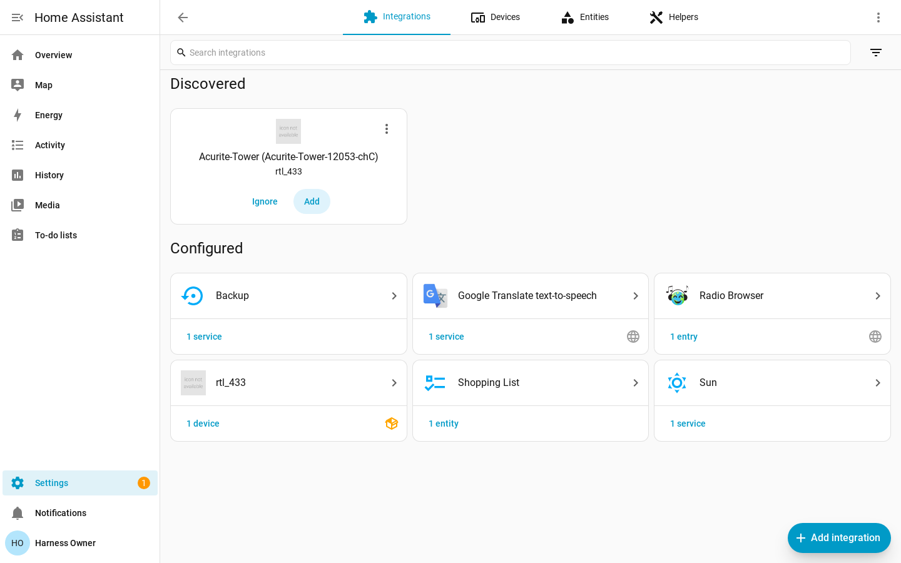

# rtl_433 for Home Assistant

[](https://github.com/rtl-433-hass/rtl_433/actions/workflows/test.yml)
[](https://github.com/rtl-433-hass/rtl_433/actions/workflows/lint.yml)
[](https://github.com/rtl-433-hass/rtl_433/actions/workflows/validate.yml)
[](https://hacs.xyz)

A Home Assistant custom integration that connects to an
[rtl_433](https://github.com/merbanan/rtl_433) HTTP server's WebSocket stream and
turns the 433 MHz / ISM-band devices it decodes (weather stations, soil/leak
sensors, door contacts, energy meters, and more) into native Home Assistant
sensors and binary sensors.

It is a **local push** integration: events arrive over a WebSocket as rtl_433
decodes them, so there is no polling and no cloud dependency.

## Overview

[rtl_433](https://github.com/merbanan/rtl_433) decodes RF transmissions from an
SDR and can expose decoded events over an HTTP/WebSocket API (`-F http`). This
integration connects to that endpoint, normalizes each event into a stable
device identity, and maps the raw fields to Home Assistant entities using a
data-driven [device library](docs/device-library.md). Newly seen devices are
surfaced as discovery cards you accept or ignore, much like the Battery Notes
integration.

You run one rtl_433 server (with your SDR); this integration is the Home
Assistant side. It does **not** talk to an SDR directly and ships no native
requirements.

## Features

- **Local push** over the rtl_433 WebSocket — no polling, no cloud.
- **Data-driven device library** — device support is YAML, not Python. Add or
  correct a device with a small, reviewable
  [mapping change](docs/device-library.md).
- **Per-installation user overrides** — drop a
  `<config>/rtl_433_mappings.yaml` file to add or correct mappings without
  editing the integration.
- **Battery Notes-style discovery** — each newly observed device appears as a
  discovery card you accept (creating a device entry) or dismiss (ignored, never
  re-prompted).
- **Configurable availability** — entities go `unavailable` after a silence
  window; set a hub-wide default and override it per device.
- **Multiple servers** — add one hub per rtl_433 server; identities are scoped
  per hub so two servers that see the same device model never collide.
- **Diagnostics feedback loop** — downloadable diagnostics list the
  `unmatched_field_keys` a hub has seen, telling you exactly what to add to the
  library.

## Installation

### HACS (custom repository)

This integration is not (yet) in the default HACS store, so add it as a custom
repository:

1. In Home Assistant, open **HACS**.
2. Click the **⋮** menu (top right) → **Custom repositories**.
3. Enter the repository URL `https://github.com/rtl-433-hass/rtl_433` and choose
   the **Integration** category, then **Add**.
4. Search for **rtl_433** in HACS, open it, and click **Download**.
5. **Restart Home Assistant.**

### Manual

1. Copy the `custom_components/rtl_433` directory from this repository into your
   Home Assistant `<config>/custom_components/` directory, so you end up with
   `<config>/custom_components/rtl_433/`.
2. **Restart Home Assistant.**

## Configuration

Add a hub from **Settings → Devices & Services → Add Integration → rtl_433**.
Each hub points at one rtl_433 server's WebSocket endpoint.

| Field | Default | Description |
| --- | --- | --- |
| **Host** | *(required)* | Hostname or IP of the machine running rtl_433. |
| **Port** | `8433` | The rtl_433 HTTP-API port (`-F http` default). |
| **Path** | `/ws` | The WebSocket path on the rtl_433 HTTP server. |
| **Secure** | off | When on, connect with `wss://` instead of `ws://` (TLS). |

The integration validates that it can reach the WebSocket before creating the
hub. The hub's identity is derived from `host:port`, so the same server cannot
be added twice.

### `ws://`, `wss://`, and authentication

- By default the connection is plain **`ws://host:port/path`**.
- Turning on the **Secure** toggle makes it **`wss://`** (TLS). rtl_433's own
  HTTP server does not terminate TLS, so to use `wss://` you put a TLS
  **reverse proxy** (for example nginx or Caddy) in front of rtl_433 and point
  the hub at the proxy.
- There is **no in-integration authentication**. rtl_433's HTTP-API is
  unauthenticated; if you need access control, place it behind a reverse proxy
  or restrict it on your network. The integration sends no credentials.

## Discovery

Discovery follows the Battery Notes pattern:

- When the hub sees a device it does not yet have a config entry for, it raises a
  **discovery card** in **Settings → Devices & Services**.
- **Accept** the card to confirm it. This creates a per-device config entry and
  its sensor / binary_sensor entities.
- **Dismiss** the card to ignore the device. Home Assistant records an ignored
  entry under the same identity (`SOURCE_IGNORE`), so the device is **not
  re-surfaced** on later sightings.

Each hub has its own **discovery toggle** (see options below). Turning discovery
off stops new cards from that hub without affecting already-accepted devices.

## Availability

RF devices announce their presence only by transmitting, so the integration uses
a silence-based availability model: if no event for a device arrives within its
**availability timeout**, its entities become `unavailable`.

- **Hub default** — set on the hub options flow. The shipped default is **600
  seconds (10 minutes)**.
- **Per-device override** — each device entry has an options flow with an
  optional timeout that overrides the hub default for that device. Leave it
  empty to fall back to the hub default.
- **Restart behavior** — on a Home Assistant restart, the last known states are
  **restored first**, then the timeout runs from the restart; entities only flip
  to `unavailable` once the (restored) silence window elapses without a fresh
  event.

Both options apply **live** — changing the discovery toggle or a timeout takes
effect without reloading the hub or tearing down the WebSocket.

### Editing options

- **Hub options** (**Configure** on the hub entry): the **discovery toggle** and
  the **default availability timeout**.
- **Device options** (**Configure** on a device entry): the optional
  **per-device availability timeout** override.

## Device library and user overrides

Device support is a set of themed YAML files (the **device library**) that map
each rtl_433 field name to a Home Assistant entity descriptor. Adding or
correcting a device is a small YAML change — no Python. The schema, file layout,
add-a-mapping workflow, and the diagnostics feedback loop are documented in the
contributor guide:

- **[docs/device-library.md](docs/device-library.md)** — the authoritative
  device-library reference.

You can extend or correct the shipped library for your own installation, without
editing the integration files, by creating:

```text
<config>/rtl_433_mappings.yaml
```

(`<config>` is the directory containing your `configuration.yaml`.) It uses the
same schema as the shipped library: top-level keys are rtl_433 field names,
values are entry mappings, and it may include a `skip_keys:` list. Overrides win
over shipped entries (full replacement), new fields are added, and `skip_keys`
are unioned. See [User overrides](docs/device-library.md#user-overrides) for the
details and examples. Changes are picked up on the next reload of the
integration (or a Home Assistant restart).

## Screenshot gallery

These captures are produced by the containerized harness (see
[tests/integration/README.md](tests/integration/README.md)) replaying a real
Acurite capture.

### Discovery card

A discovered device appears at the top of **Settings → Devices & Services**,
ready to accept or dismiss.



### Device page

An accepted **Acurite-Tower** device with its temperature, humidity, and battery
sensors, plus RSSI / SNR / noise diagnostics.


### Hub options flow

The hub options flow exposes the discovery toggle and the default availability
timeout.


### Unavailable state

After the stream stops and the availability timeout elapses, the device's
entities flip to `unavailable`.


## Multiple servers (instances)

You can add **one hub per rtl_433 server**. Each hub:

- Owns its own WebSocket connection and discovery toggle.
- Scopes device identities to itself — unique IDs are
  **instance-scoped** (`<hub-entry-id>:<device-key>`) — so two servers that
  decode the same model + id produce distinct entities and never collide.

**Cascade removal:** deleting a hub also removes all of its child device entries
(and therefore their Home Assistant devices and entities), leaving no orphans.

## Development and links

- **Device-library contributor guide:** [docs/device-library.md](docs/device-library.md)
- **AI-agent / maintenance notes:** [AGENTS.md](AGENTS.md)
- **Contributing (commits, releases, CI):** [CONTRIBUTING.md](CONTRIBUTING.md)
- **Integration & screenshot harness:** [tests/integration/README.md](tests/integration/README.md)
- **Issue tracker:** <https://github.com/rtl-433-hass/rtl_433/issues>

Run the unit tests locally:

```bash
pip install -r requirements_test.txt
pytest tests/
```
