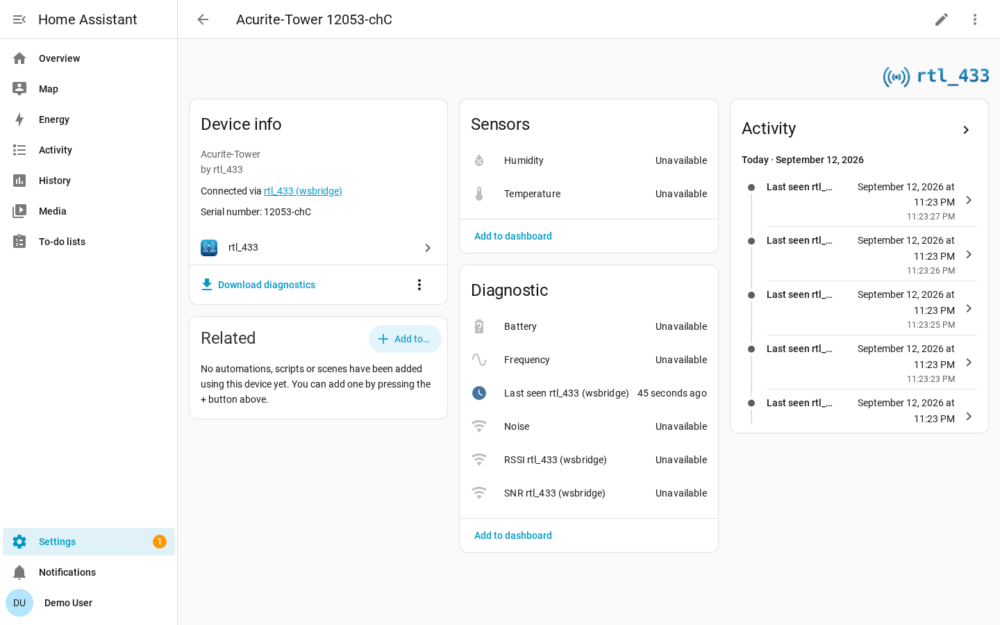

# Availability

RF devices announce their presence only by transmitting, so the integration uses
a silence-based availability model. If no event for a device arrives within its
availability timeout, its entities become `unavailable`.



## Transmit Cadences

How long a device can reasonably stay silent depends on the device type.

| Device type | Typical behavior |
| --- | --- |
| Periodic weather, temperature, soil, and air-quality sensors | Transmit on a regular cadence. |
| Door/window contacts, motion/PIR, buttons, doorbells, and security sensors | Transmit on events, sometimes with an occasional heartbeat. |
| Generic EV1527 door/PIR devices and parked TPMS sensors | May have no heartbeat and stay silent for days. |

Periodic devices use finite timeouts. Event-driven devices default to never
expiring because a long silence is normal and does not imply failure.

## Hub Connection

Silence only means something while the integration is listening. If the
connection to the rtl_433 server drops, no events can arrive for any device, so a
device's last reading says nothing about whether the device is still there.

When the WebSocket has been down for 90 seconds, every device behind that hub is
marked `unavailable` regardless of its own timeout — including event-driven
devices that never expire on silence, and their **Last seen** sensors. This is
the same behavior an MQTT device gets from an availability topic and a last-will
message. The devices come back as soon as the connection is re-established; their
values are the last ones received, and the usual silence timeouts resume from
there.

Shorter drops are ignored. The client retries roughly 1, 3, 7, 15, 31, and 63
seconds after the drop, so a server restart or a brief network blip normally
recovers inside the 90 second window without flapping any device's availability.
A connection that keeps dropping faster than the window does *not* reset it: the
clock runs from the first drop until the link has held for a full 90 seconds, so
a server stuck in a restart loop still marks its devices unavailable.

The same 90 second window is what the **rtl_433 server unreachable** repair issue
uses, so the entities and the repair agree on when the hub is down.

Two kinds of entity are deliberately exempt:

- **`event` entities** (buttons, doorbells, remotes) stay available. An event
  entity's state *is* the timestamp of its last event, so marking it unavailable
  would lose that timestamp across a restart and re-fire plain state-triggered
  automations with a stale timestamp on every reconnect. Condition on the
  **Connectivity** sensor if an automation must ignore events during an outage.
- **The hub's SDR controls** (**Gain**, **Sample rate**, **Frequency
  correction**, **Hop interval**, **Conversion mode**) stay available, because
  they are settings you are writing rather than readings you are trusting. With
  **Manage SDR settings** on — the default — these appear as `number`/`select`
  entities. Turning it off replaces them with read-only diagnostic sensors, and
  those *are* gated on the 90 second window along with the hub's other diagnostic
  sensors (center frequency, frame counters, enabled decoders), whose values are
  fetched over HTTP and would otherwise freeze at whatever was last read.

The **Connectivity** binary sensor is the entity that reports the outage: it
reads the socket state directly, flips to `off` the moment the connection drops —
no grace window — and stays available throughout. The Home Assistant log records
the drop, the moment the devices are marked unavailable, and the reconnect:

```text
INFO  rtl_433 lost the connection to ws://rtl433.local:8433/ws; reconnecting, ...
WARN  rtl_433 has had no connection to ws://rtl433.local:8433/ws for 90s; marking all 12 device(s) ...
INFO  rtl_433 reconnected to ws://rtl433.local:8433/ws after 184s
```

## Timeout Sources

The effective availability timeout is resolved in this order:

1. Per-device override from **Device settings**.
2. Hub default from **Hub settings**, if set.
3. Device-class default.
4. 600 second fallback.

Set a timeout to `0` to make a device never expire. This is already the automatic
default for event-driven devices.

## Restart Behavior

On Home Assistant restart, the last known states are restored first. The timeout
then runs from the restart time, and entities flip to unavailable only after the
restored silence window elapses without a fresh event.

## Last Seen Sensor

Every device gets a diagnostic timestamp sensor named **Last seen**. It reports
when the device was last heard from and restores its previous value across
restarts.

Last seen is enabled by default for event-driven devices because they never
expire and the timestamp is their freshness signal. It is disabled by default for
periodic devices, whose availability already conveys freshness.

Unlike measurement sensors, Last seen stays available after the device falls
silent, so it can drive staleness automations. It does go unavailable while the
hub connection is down, because the timestamp then only records when the
integration stopped listening.
