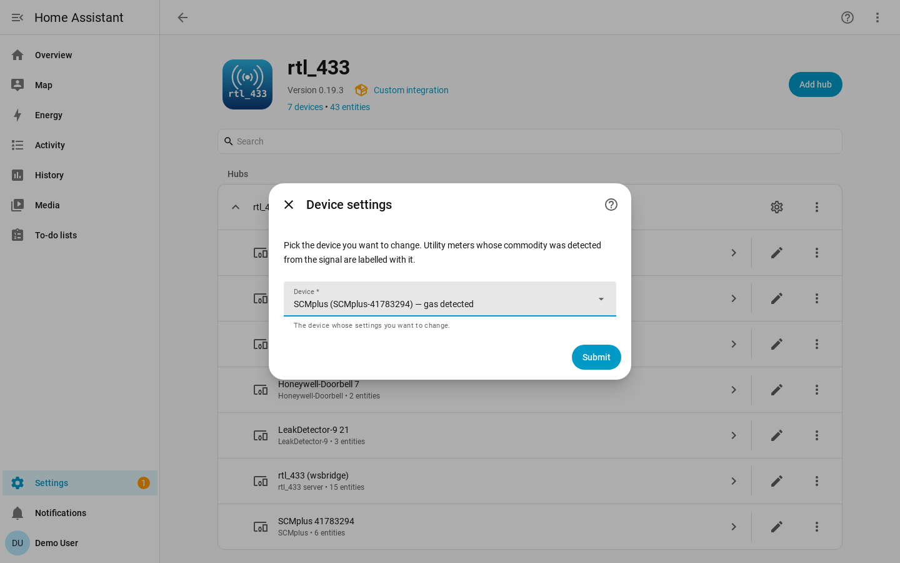
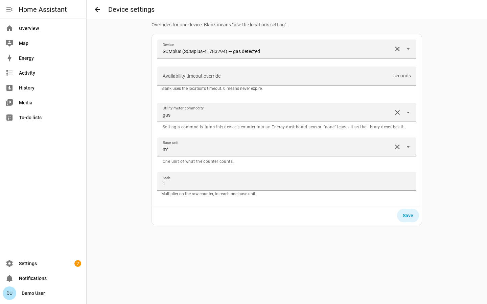
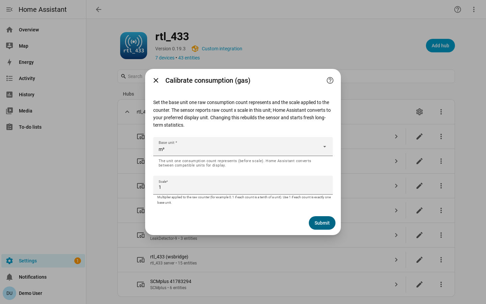

# Utility-Meter Calibration

Utility meters decoded by SCM, ERT, and SCMplus protocols report a raw
consumption counter, but the RF signal does not carry the counter's unit or
scale. Different meters report in different granularities, so the integration
cannot derive Energy-dashboard-ready values automatically.

Out of the box, consumption is a plain unitless `total_increasing` counter. To
make it eligible for Home Assistant's Energy dashboard, calibrate the device.

## Calibration Flow

Open **Settings → Devices & Services → rtl_433 → Configure → Device settings**.
Calibration takes three short steps.

### 1. Pick the meter

Meters whose commodity the integration recognized from the signal are labelled
with it in the picker, so you can tell at a glance which devices are calibratable
and what they measure.

### 2. Choose the commodity

When the meter reports a `MeterType` or `ert_type` hint, the commodity is
pre-filled from it — for the device you picked, however many meters the hub has.
You can override it. Re-editing an already-calibrated device pre-fills its stored
commodity, unit and scale.

Choosing `none` here clears any existing calibration and leaves the counter
unitless.

### 3. Set the base unit and scale

| Field | Meaning |
| --- | --- |
| **Commodity** | `none`, `energy`, `gas`, or `water`. This sets the sensor's device class. Choosing `none` clears calibration. |
| **Base unit** | The unit the calibrated counter is expressed in, constrained to Home Assistant units for that commodity. |
| **Scale** | Multiplier applied to the raw counter so the stored value is in the chosen base unit. |

Once calibrated, the consumption sensor gets a real device class, native unit,
and `state_class: total_increasing`. You do not need to pick the display unit in
the calibration flow: Home Assistant can convert convertible units in the entity
settings.

The counter field itself needs no configuration: SCM and ERT meters report
`consumption_data` and SCMplus meters report `Consumption`, and both ship in the
device library. Neither requires a YAML override.

## Statistics Caveat

Changing commodity, base unit, or scale changes the sensor's native unit or
device class. Home Assistant treats that as a non-convertible change for long
term statistics.

The entity keeps its ID, but previous long-term statistics are orphaned. Calibrate
intentionally, ideally once. Saving a calibration reloads the hub so the sensor is
rebuilt with the new unit and class.

## Model-Scoped Mappings

For models whose unit and scale are authoritatively known, a contributor can ship
a model-scoped mapping in the [device library](device-library.md#model-scoped-mappings-models)
so those meters work without per-device calibration.

The shipped library does not include speculative real-meter consumption mappings.
A wrong scale would silently corrupt Energy data.
