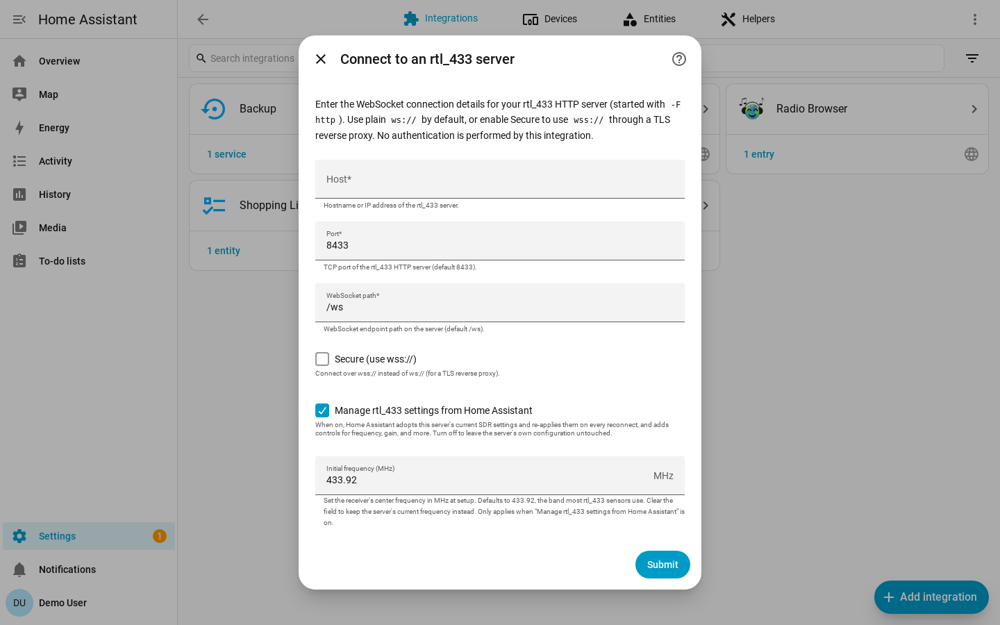

# Configuration

There are two ways to create a hub: automatically through
[add-on discovery](#home-assistant-os-add-on-discovery) (recommended), or
[manually](#manual-configuration) for any other rtl_433 server. Each hub points
at one rtl_433 server's WebSocket endpoint.

## Home Assistant OS Add-On Discovery

If you run the
[rtl_433 add-on](https://github.com/rtl-433-hass/rtl_433-hass-addons) on Home
Assistant OS, each radio it detects is published through Supervisor discovery.
It appears under **Settings → Devices & Services** as a discovered **rtl_433**
card. Click **Add** and confirm; no host or port needs to be typed.

For discovery to work, this integration must already be installed and loaded
when the add-on starts — install the integration, restart Home Assistant, and
then start the add-on. If you started the add-on first and no card appeared,
restart the add-on so it republishes discovery.

Discovered radios use the add-on's stable per-radio identifier, so the same hub
and nested-device history can survive add-on restarts and USB port changes. For
multi-dongle setups, stability is best when each dongle stays in a fixed USB port
or has a unique serial.

## Manual Configuration

Add a hub from **Settings → Devices & Services → Add Integration → rtl_433**.



| Field | Default | Description |
| --- | --- | --- |
| **Host** | required | Hostname or IP of the machine running rtl_433. |
| **Port** | `8433` | The rtl_433 HTTP API port. |
| **Path** | `/ws` | The WebSocket path on the rtl_433 HTTP server. |
| **Secure** | off | Connect with `wss://` instead of `ws://`. |
| **Manage rtl_433 settings from Home Assistant** | on | Expose SDR controls and let Home Assistant adopt and enforce receiver settings. |
| **Initial frequency (MHz)** | `433.92` | Center frequency to apply once on first connect when managed settings are enabled. |

The integration validates that the WebSocket can be reached before creating the
hub. Manual hub identity is derived from `host:port`, so the same server cannot
be added twice.

## Manual rtl_433 Configuration

The integration connects to rtl_433's HTTP/WebSocket server. Start rtl_433 with
HTTP output enabled, for example:

```sh
rtl_433 -F http
```

By default rtl_433 binds to `0.0.0.0:8433`. For localhost-only operation, use a
bind address such as:

```sh
rtl_433 -F http://127.0.0.1:8433
```

## Reconfigure vs Configure

Use **Reconfigure** to point an existing hub at the same server's new address:
host, port, path, or secure mode. Devices and their history are preserved.

Use **Configure** for hub options:

- **Add discovered devices**: add heard devices to Home Assistant, or ignore
  them. Nothing is added without this step — see
  [Device Discovery](device-discovery.md).
- **Ignored devices**: offer previously ignored devices again.
- **Hub settings**: default availability timeout and the managed-settings toggle.
- **Device settings**: per-device availability timeout, motion clear delay, and
  utility-meter calibration.
- **Device mappings**: per-hub mapping overrides.
- **Replace device**: move a device onto the new id it drew after a battery
  change.


The **Hub settings** step configures the default availability timeout for every
device on the hub, and whether Home Assistant manages the server's SDR settings:


The **Device settings** step targets one device for a timeout override, motion
clear delay, or utility-meter calibration. You pick the device first, then
configure it — every field on the second form is pre-filled from the device you
picked, and fields that do not apply to it (such as the motion clear delay on a
non-motion device) are hidden:


Changing timeout options applies live. Changing the managed-settings toggle
reloads the hub because the entity set changes.

## ws, wss, and Authentication

By default the integration connects to `ws://host:port/path`. Turning on
**Secure** connects with `wss://`.

rtl_433's built-in HTTP server does not terminate TLS. To use `wss://`, put a
TLS reverse proxy such as nginx or Caddy in front of rtl_433 and point the hub at
the proxy.

rtl_433's HTTP API is unauthenticated, and the integration sends no credentials.
If you need access control, restrict it on your network or place it behind a
reverse proxy.
