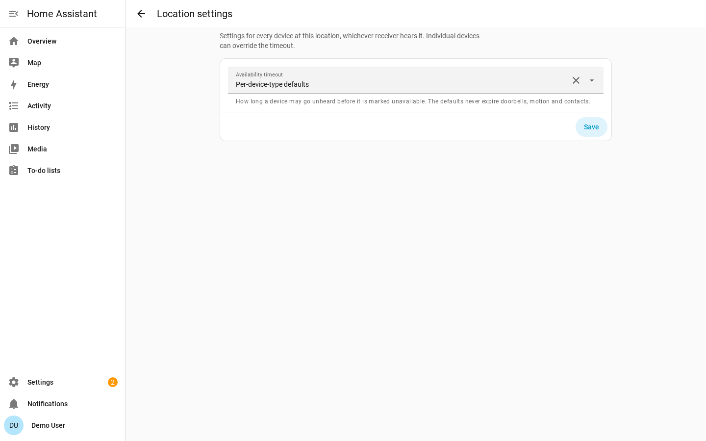
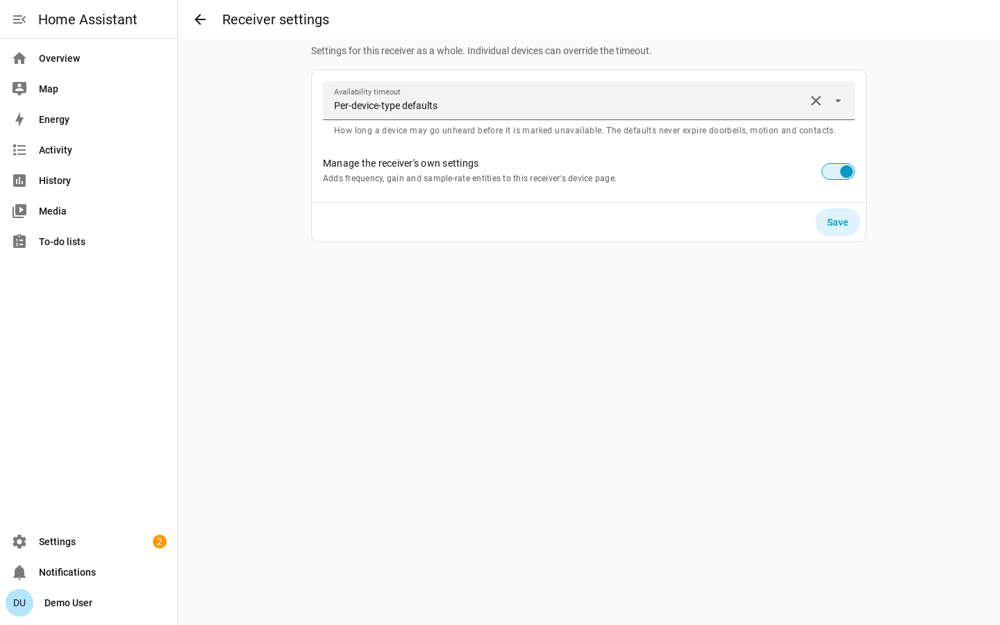

# Configuration

A **receiver** is a computer running rtl_433; it contains a **radio**, the SDR
dongle that receives the airwaves. Home Assistant holds receivers in a
**location**: one integration entry per place, with one receiver inside it for
every rtl_433 server that can hear the same sensors.

There are two ways to create the first one: automatically through
[add-on discovery](#home-assistant-os-add-on-discovery) (recommended), or
[manually](#manual-configuration) for any other rtl_433 server. Either way, the
setup creates the location *and* its first receiver together — there is no extra
step and no receiver-less location to configure. Adding more servers to that
location is [one more form](#adding-receivers-to-a-location).

## Home Assistant OS Add-On Discovery

If you run the
[rtl_433 add-on](https://github.com/rtl-433-hass/rtl_433-hass-addons) on Home
Assistant OS, each radio it detects is published through Supervisor discovery.
It appears under **Settings → Devices & Services** as a discovered **rtl_433**
card. Click **Add** and confirm; no host or port needs to be typed.

For discovery to work, this integration must already be installed and loaded
when the add-on starts — install the integration, restart Home Assistant, and
then start the add-on. If you started the add-on first and no card appeared,
restart the add-on so it republishes discovery.

When a location already exists, the confirmation form asks which **Location**
the new receiver belongs to: pick the existing one to let its receivers share one
view of every sensor they both hear, or *a new location* for a separate site.

Discovered radios use the add-on's stable per-radio identifier, so the same receiver
and nested-device history can survive add-on restarts and USB port changes. For
multi-dongle setups, stability is best when each dongle stays in a fixed USB port
or has a unique serial.

## Manual Configuration

Add a receiver from **Settings → Devices & Services → Add Integration → rtl_433**.


| Field | Default | Description |
| --- | --- | --- |
| **Host** | required | Hostname or IP of the machine running rtl_433. |
| **Port** | `8433` | The rtl_433 HTTP API port. |
| **Path** | `/ws` | The WebSocket path on the rtl_433 HTTP server. |
| **Secure** | off | Connect with `wss://` instead of `ws://`. |
| **Manage rtl_433 settings from Home Assistant** | on | Expose SDR controls and let Home Assistant adopt and enforce radio settings. |
| **Initial frequency (MHz)** | `433.92` | Center frequency to apply once on first connect when managed settings are enabled. |

The integration validates that the WebSocket can be reached before creating the
receiver. Manual receiver identity is derived from `host:port`, so the same server cannot
be added twice.

## Adding Receivers to a Location

A second rtl_433 server covering the same place belongs in the **same location**
as the first, not in a second integration entry. On **Settings → Devices &
Services → rtl_433**, use the location's **Add a receiver** control and fill in
the same connection fields as above.

Do that and the two servers stop being two copies of your house. Every sensor
both of them receive becomes **one** Home Assistant device with **one** set of
entities, fed by whichever receiver receives each transmission — see
[Availability](availability.md#receivers-in-one-location) for what that does to
availability, and [Device Discovery](device-discovery.md) for the single
add-device page it produces.

What is shared, and what is not:

| Setting | Scope |
| --- | --- |
| Which devices are added, and which are ignored | The location — approve once, for every receiver |
| Default availability timeout | The location |
| Per-device timeout, motion clear delay, calibration | The location's device |
| Mapping overrides | The location |
| Connection target (host, port, path, secure) | The receiver |
| **Manage this receiver's radio**, and every radio control | The receiver |

Use a **second location** only for a genuinely distant site — somewhere its
receivers could never hear the same transmitter as the first. Devices never merge
across locations, so two identical sensors at two sites keep two identities.

### Removing a Receiver

Deleting a receiver from a location removes that receiver's own entities: its
radio controls, its diagnostic sensors, its **Connectivity** sensor, and its
per-receiver **RSSI** / **SNR** / **Last seen** entities on every merged device.

The merged devices themselves, and their history, stay. Availability is
recomputed over the receivers that remain, so a device the deleted receiver was
the only one hearing goes `unavailable` rather than disappearing — deleting it
is still your decision to make.

Deleting a location's **last** receiver removes the location with it. A location
with nothing listening can never load again, so it does not linger.

## Manual rtl_433 Configuration

The integration connects to rtl_433's HTTP/WebSocket server. Start rtl_433 with
HTTP output enabled, for example:

```sh
rtl_433 -F http
```

By default rtl_433 binds to `0.0.0.0:8433`. For localhost-only operation, use a
bind address such as:

```sh
rtl_433 -F http://127.0.0.1:8433
```

### Event Timestamps

Every time Home Assistant connects, rtl_433 re-broadcasts a short buffer of
recent events. The integration reads the `time` field on each frame to tell that
backlog apart from traffic it is hearing live, so devices that have gone quiet
are not marked available again and their event entities and device triggers do
not fire a second time.

That only works if the timestamps can be read. rtl_433 emits `time` as a JSON
string in every mode, and these forms are understood:

| rtl_433 setting | Example `time` | |
| --- | --- | --- |
| default | `2026-05-25 10:00:00` | Local wall clock, whole seconds. |
| `time:iso` | `2026-05-25T10:00:00` | ISO-8601. Local, unless you add `tz` or `utc`. |
| `time:unix` | `1779703200` | Epoch seconds, always UTC. |
| `time:off` | *(no field)* | **Timestamps off — see below.** |

Adding `usec` to any of them (`time:iso:usec`) adds a fractional part, and `tz`
(or `utc`) makes the zone explicit. Be explicit if you can: a bare local stamp is
read in Home Assistant's own time zone, so a server in a different zone puts
every event hours away from where it belongs. When that lands in the past, each
frame looks like an event from an old disconnection: values still seed, but
devices stop refreshing their last-seen and go unavailable, and event entities
and device triggers stop firing.

With **no readable timestamp** the integration cannot distinguish a replay from
a live transmission, so it treats every frame as live — the safe direction for a
real event, but it means the re-broadcast backlog is ingested afresh on each
reconnect.

The recommended setting is the most precise one:

```
report_meta time:iso:usec:tz
```

or, on the command line, `-M time:iso:usec:tz`. A sub-second stamp also lets the
integration separate two transmissions from the same device inside one second.

With **more than one receiver in a location**, those timestamps are also what
tell one transmission received twice from two transmissions. Each receiver stamps
the frame with its *own* host's clock, so the integration treats frames for the
same device and field that land within about three seconds of each other as the
same transmission and keeps the first one. That tolerates the usual few hundred
milliseconds of decode and delivery difference, and modest clock skew on top —
but it assumes the receivers' clocks are roughly in sync. Run NTP on each one;
hosts minutes apart will make one receiver's frames look like an old backlog and
get them rejected.

A frame with no readable timestamp is applied rather than guessed at, so with
`time:off` the same transmission received by two receivers is written twice (and an
event entity fires twice). That is the safe direction — a rejected frame would
lose a real reading for good — but it is another reason to leave timestamps on.

## Reconfigure vs Configure

Use **Reconfigure** on a receiver to point it at the same server's new address:
host, port, path, or secure mode. Devices and their history are preserved.

Use **Configure** to open the rtl_433 page for the location. It is where devices
are added and ignored — see [Device Discovery](device-discovery.md) — and it
carries a **Signal coverage** page and four settings pages. The split follows the
topology: a setting about *sensors* belongs to the location, and a setting about
*one radio* belongs to its receiver.

- **Location settings**: the default availability timeout for every device here,
  whichever receiver receives it.
- **Receiver settings**: one receiver's **Manage this receiver's radio** toggle.
  Each receiver has its own row and its own answer.
- **Device settings**: one device's availability timeout, motion clear delay,
  and utility-meter calibration.
- **Device mappings**: the location's mapping overrides.

**Location settings** configures the default availability timeout for every
device at the location. The timeout is one of three choices rather than a bare
number:

- **Per-device-type defaults** — the default, and what keeps event-driven
  devices (doorbells, motion, contacts) from going unavailable on silence.
- **Never expire** — nothing at this location is ever marked unavailable for
  going quiet.
- **A fixed timeout** — a count of seconds that applies to every device without
  an override of its own.



**Receiver settings** is the other half of the split, and there is one page per
receiver, headed by the receiver it belongs to. It carries **Manage this
receiver's radio** — whether Home Assistant adopts and re-applies that server's
radio settings and offers frequency, gain and sample-rate entities for it. Every
other receiver at the location keeps its own answer.



**Device settings** targets one device for a timeout override, motion clear
delay, or utility-meter calibration. Pick the device at the top of the page and
the rest of the form rebuilds from it: every field is pre-filled from that
device, and fields that do not apply to it are not shown — the motion clear delay
only appears for a device that actually auto-clears, and the base unit and scale
only once a commodity is chosen.


**Signal coverage** is not a settings page: it reports how well each receiver
receives each added device, so a second receiver's worth can be read off before any
diagnostic entity is enabled. See
[Device Discovery](device-discovery.md#signal-coverage).

Changing timeout options applies live. Changing a receiver's manage-radio toggle
reloads the location because the entity set changes.

## ws, wss, and Authentication

By default the integration connects to `ws://host:port/path`. Turning on
**Secure** connects with `wss://`.

rtl_433's built-in HTTP server does not terminate TLS. To use `wss://`, put a
TLS reverse proxy such as nginx or Caddy in front of rtl_433 and point the receiver at
the proxy. Each receiver in a location is configured on its own, so one can be
`wss://` behind a proxy while another stays plain `ws://` on the local network.

rtl_433's HTTP API is unauthenticated, and the integration sends no credentials.
If you need access control, restrict it on your network or place it behind a
reverse proxy.
