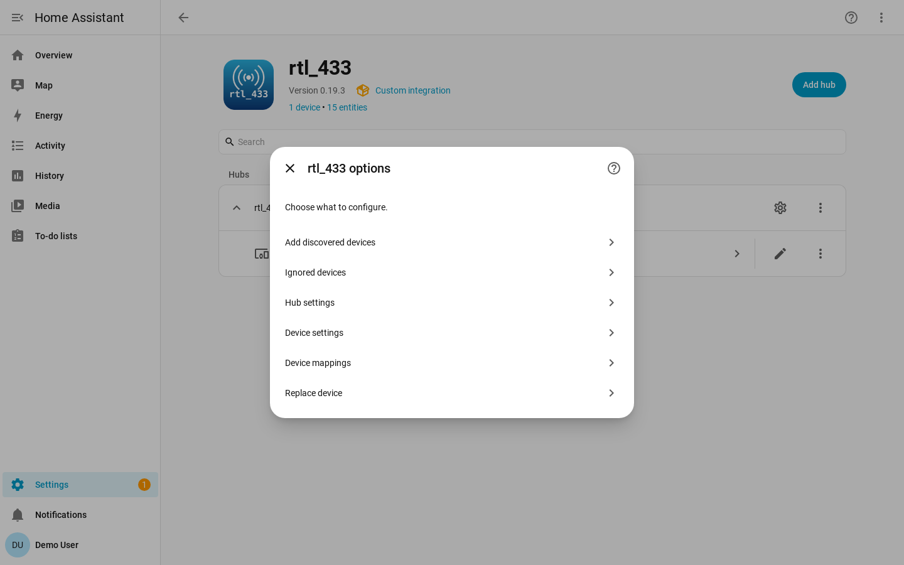
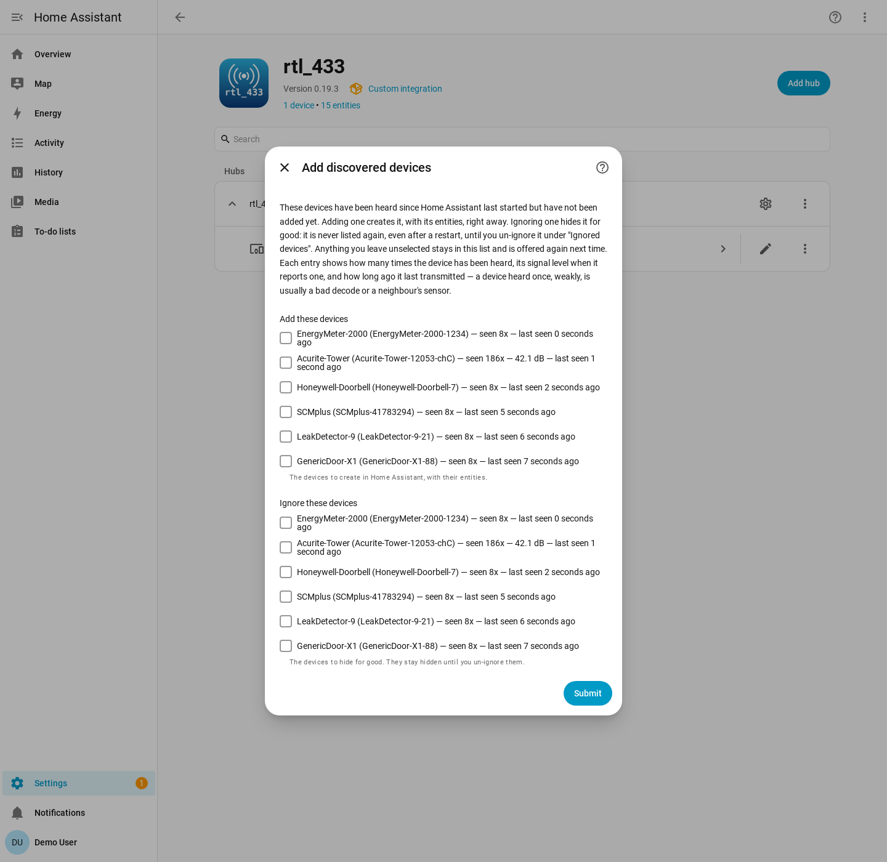

# Device Discovery

Nothing is added to Home Assistant on its own. Every device your rtl_433 server
decodes is heard and held on a list of discovered devices, and you decide which
ones become real devices.

That list is where neighbours' sensors, weak signals, and bad decodes end up. In
a busy area a receiver hears far more than you want to keep, which is why the
integration waits for you to choose.

Doorbells, remotes, and motion sensors only transmit when something happens, so
trigger them once to make them show up.

## Adding Devices

Open **Settings → Devices & Services → rtl_433 → Configure**. The menu starts
with the two discovery steps:

Pick **Add discovered devices** to see everything the hub has heard but not
added yet:

The most recently heard device is at the top. Each row describes one device:

| Part of the row | What it tells you |
| --- | --- |
| **Model and id** | The model rtl_433 decoded, and the id it uses to tell one device of that model from another. |
| **seen *n*x** | How many times the device has transmitted since Home Assistant started. A real sensor keeps checking in; a bad decode is usually heard once. |
| **Signal level** | The signal-to-noise ratio of the most recent message, or its RSSI when no SNR was reported. Only shown when the server reports levels; your own sensors are normally the strongest. |
| **Last seen** | How long ago the device last transmitted. |

Tick every device you want under **Add these devices** and submit. They are
created immediately, with their entities, and start recording history from that
point. Adding several devices is one submit.

Anything you leave unticked stays on the list and is offered again next time.

## Ignoring Devices

Devices you never want to see again go under **Ignore these devices** on the
same form. An ignored device is dropped from the list, is never offered again,
and stays ignored across restarts. It is the way to make a neighbour's sensor go
away for good.

Ignoring is not deleting: an ignored device is simply not offered, and its
messages are dropped as they arrive.

To undo it, open **Configure → Ignored devices**, tick the devices you want back,
and submit:

Un-ignoring is not retroactive. The device reappears under **Add discovered
devices** the next time it transmits, which for a door or motion sensor means
the next time it is triggered.

## The Discovered List Is Temporary

The list of discovered devices is held in memory only. It is empty after a
restart or a reload of the hub, and fills again as devices transmit. A sensor
that reports every few minutes is back almost immediately; one that reports
twice a day takes longer.

So an empty list shortly after a restart is normal — it means nothing has
transmitted yet. Devices you have already added are unaffected: they are stored
with the hub and come back with their entities and history on every start.
Ignored devices are stored too, and stay ignored.

## Deleting Devices

To remove a device you no longer want, open it under **Settings → Devices &
Services → rtl_433 → the device → Delete**.

Deleting removes the device and its entities from Home Assistant, but it does not
stop the transmitter. The device returns to the discovered list the next time it
transmits, so you can add it back. If you want it gone for good, ignore it
instead.

## Post-Connection Registration

Only devices heard after the integration connects count as live sightings. On
connect, the rtl_433 server replays its recent backlog. The integration uses
frame timestamps to tell that replay apart from live traffic: backlog frames
refresh the values of devices you have already added, but they never put a
device on the discovered list, so a reconnect does not fill it with everything
that transmitted while Home Assistant was away.

A device you have not added appears the first time it transmits after the
connection. This assumes the rtl_433 server and Home Assistant clocks are roughly
in sync.

## Replacing a Device That Changed Id

Many battery-powered sensors pick a new random transmitter id every time their
batteries are changed. rtl_433 identifies a device by that id, so the sensor
comes back as a brand-new device with new entities and no history, while the
original stops updating and eventually goes unavailable.

To move the original device onto its new id, open **Settings → Devices &
Services → rtl_433 → Configure → Replace device**. Pick the **Device to keep** —
the existing device whose history you want to preserve — then pick the **New
device**, the one that appeared after the batteries were changed. Devices of the
same model are listed first, since a battery swap does not change the model.

The device you keep takes over the new id, and the duplicate device and its
entities are removed. The kept device's entity ids do not change, so its
history, statistics, dashboards and automations carry straight through, and its
calibration, availability timeout override, motion clear delay and event types
come with it. Any field the replacement has already reported is added to the
device's known fields. The short history the duplicate recorded before the
replace is discarded along with it.

Because those entity ids are kept exactly as they were, they still spell out the
*old* id — an entity named `sensor.acurite_986_1a2b_temperature` keeps that name
after being re-pointed at id `9f3c`. That is what preserves the history, so it is
worth leaving alone. You can rename the entity if the stale id bothers you, but
renaming it starts a new history under the new entity id.

The replacement does not have to be added first. Devices that are only on the
discovered list are offered too, marked *not added yet*, because after a battery
change the replacement is usually one of those. It only has to have been heard
once. If it is not in the list yet, wait until it transmits again and reopen the
step.

To confirm you are picking the right device, check the **Serial number** on the
device info card: it is the id rtl_433 decoded for that device, plus its channel
and subtype when it has them. Unlike the device name, the serial number is not
affected by renaming the device, so it always shows the transmitter the device
is currently tracking — the old id before a replace, the new one after.
