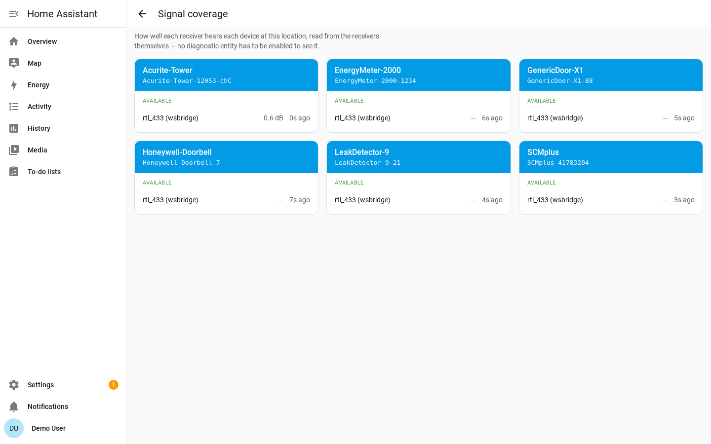

# Device Discovery

Nothing is added to Home Assistant on its own. Every device your rtl_433 servers
decode is heard and held on a list of discovered devices, and you decide which
ones become real devices.

That list is where neighbours' sensors, weak signals, and bad decodes end up. In
a busy area a receiver hears far more than you want to keep, which is why the
integration waits for you to choose.

The list belongs to the **location**, not to one receiver. However many receivers
a location holds, a sensor is **one** row — showing the readings from whichever
receiver heard it last, and naming the receivers that heard it — and adding or
ignoring it once applies to the whole location. That is the point: you are
approving a *sensor*, not a sighting.

Doorbells, remotes, and motion sensors only transmit when something happens, so
trigger them once to make them show up.

## The rtl_433 Page

Open **Settings → Devices & Services → rtl_433 → Configure**. This is the
rtl_433 page, and it works like the Zigbee and Z-Wave pages: it opens on an
overview of the location, with everything else one click away. It is available
to administrators only.

The overview has four parts:

- a card at the top saying whether the location is **Online**, and how many
  devices you have added to it
- **Receivers**, one row per rtl_433 server in this location, with its host, its
  port, and whether it is connected — plus its own **Receiver settings** page
- **My network**, with links to this location's devices and entities on the
  usual Home Assistant pages
- **Signal coverage**, **Location settings**, **Device settings** and **Device
  mappings**, which each open their own page

and, bottom right, an **Add or replace device** button. That is the one that
takes you to the discovered devices.

If you have more than one location, each gets its own **Receivers** card and its
own settings rows, under a heading naming the location, and every row links to
that location's page.

## Adding Devices

Click **Add or replace device**. Every device this location's receivers have
heard and you have not added is here, newest first. If nothing has transmitted
yet the page says it is still searching — which is normal, and the next section
explains why.

Each candidate gets a card — one per sensor, not one per receiver that heard it.
Cards keep their place as devices transmit, so a card does not move under the
cursor while you are reading it.

That capture is of a location with a single receiver, which is why the cards
carry no **Heard by** line and there is no note above them explaining the union:
with nothing to union, the page does not say so. Add a second receiver and both
appear.

The blue heading is the device's identity: the model rtl_433 decoded, and below
it the device key — the id rtl_433 uses to tell one device of that model from
another, with its channel and subtype when it reports them.

| On the card | What it tells you |
| --- | --- |
| **Sightings** | How many times the device has transmitted since Home Assistant started. A real sensor keeps checking in; a bad decode is usually heard once. |
| **Signal** | The signal-to-noise ratio of the most recent message, or its RSSI when no SNR was reported. Only shown when the server reports levels; your own sensors are normally the strongest. |
| **Last seen** | How long ago the device last transmitted. Hover over it for the exact first and last times. |
| **Heard by** | Which of this location's receivers have heard it, with each one's signal level. Only shown once the location has more than one receiver, and only receivers that have actually heard the device are listed — so the line tells you which receivers a sensor is in range of. |
| **Readings** | The most recent message, shown as the entities adding it would create — `Temperature 21.4 °C`, not `temperature_C: 21.4`. This is usually the quickest way to tell two identical sensors apart. |

The readings are the ones you would actually get. A field the device library
does not map creates no entity, and one it maps as disabled by default (the
`SNR`, `RSSI` and `Noise` diagnostics) is not something you would see on the
device page, so neither is listed here.

Where several receivers have heard the candidate, the readings are simply the
most recent message to arrive from any of them. That is a deliberately simpler
rule than the one used for a device you have already added: a preview only needs
the freshest sample, where a recorded value needs the guard against an old frame
overwriting a newer one.

Pick an **Area** before adding to have the new device filed there straight away.
Leave it on *No area* to sort it out later on the device page.

**Add** creates that device and its entities straight away, and starts
recording history from that point — once, for the location, however many
receivers heard it. The card stays where it is and turns green, with a link to
the device that was just created:

**Ignore** hides the device until you un-ignore it — see [Ignoring
Devices](#ignoring-devices).

The page is live. A device heard while it is open appears on its own, sighting
counts climb as devices transmit, and nothing needs a reload. So trigger a
doorbell or open a door sensor and watch it arrive.

Everything the page does is also a Home Assistant WebSocket command, so the same
list and the same actions are available to a script — see [Home Assistant
discovery commands](websocket-api.md#home-assistant-discovery-commands).

### Clearing the List

A location left running for a few weeks in a built-up area accumulates hundreds
of candidates, and the one you came to add is somewhere among them. **Clear
discovered devices** empties the list — on every receiver — so it refills from
live traffic: trigger the doorbell, and it is the only thing on the screen.

Nothing is lost. The list has always been held in memory only, so every device
cleared comes back on its next transmission. Devices you have ignored stay
ignored — that is a decision, and this is not the control for undoing it.

## Signal Coverage

**Signal coverage** answers the question a second receiver is added to answer:
which receivers hear each device, and how well.

One card per device you have added, one row per receiver in the location. Each
row gives that receiver's last signal level for the device and how long ago it
last heard it, so `-62 dB, 30s ago` next to `-89 dB, 4m ago` tells you which
receiver is carrying that sensor. A receiver that has never heard the device says
so, and one whose connection is down says that instead — a distinction that
matters, because "offline" and "online but deaf to this sensor" are different
problems.

The page reads this straight from the receivers. **No diagnostic entity has to be
enabled**, which is the point: `RSSI` and `SNR` are disabled by default, and with
several receivers per sensor there would otherwise be a lot of them to turn on
just to look once. Enable them when you want the history — see
[Per-Receiver Signal Detail](availability.md#per-receiver-signal-detail).

## Location, Receiver, and Device Settings

The rows on the overview each open a settings page. Each one has its own address,
so you can bookmark it or link someone straight to it, and the back arrow returns
you to the overview.

**Location settings** is the default availability timeout for every device at
this location, whichever receiver hears it — see
[Configuration](configuration.md#reconfigure-vs-configure).

**Receiver settings** is one receiver's own page, reached from its row on the
**Receivers** card: whether Home Assistant manages that receiver's radio. Every
other receiver at the location keeps its own answer.

**Device settings** targets one device you have already added: its availability
timeout override, its motion clear delay, and its
[utility-meter calibration](calibration.md). Pick the device at the top and the
rest of the form rebuilds from it, showing only the settings that device
actually has.

**Device mappings** is this location's
[device-library overrides](device-library.md), as YAML. Clearing the editor
removes them all. A document that will not store is refused with every problem
listed, and the overrides you already had are left alone.

## Ignoring Devices

Devices you never want to see again are ignored. Click **Ignore** on the card.
An ignored device is dropped from the list — on every receiver at the location —
is never offered again, and stays ignored across restarts. It is the way to make
a neighbour's sensor go away for good, without having to say so once per
receiver.

Ignoring is not deleting: an ignored device is simply not offered, and its
messages are dropped as they arrive.

To undo it, go back to **Add or replace device**, click **Show ignored
devices** under the cards, and then **Un-ignore**:

The device reappears the next time it transmits, which for a door or motion
sensor means the next time it is triggered.

## The Discovered List Is Temporary

The list of discovered devices is held in memory only. It is empty after a
restart or a reload of the location, and fills again as devices transmit. A sensor
that reports every few minutes is back almost immediately; one that reports
twice a day takes longer.

So an empty list shortly after a restart is normal — it means nothing has
transmitted yet. Devices you have already added are unaffected: they are stored
with the location and come back with their entities and history on every start.
Ignored devices are stored too, and stay ignored.

## Deleting Devices

To remove a device you no longer want, open it under **Settings → Devices &
Services → rtl_433 → the device → Delete**.

Deleting removes the device and its entities from Home Assistant, but it does not
stop the transmitter. The device returns to the discovered list the next time it
transmits, so you can add it back. To keep it out of the list, ignore it
instead.

## Post-Connection Registration

Only devices heard after the integration connects count as live sightings. On
connect, an rtl_433 server replays its recent backlog. The integration uses
frame timestamps to tell that replay apart from live traffic: backlog frames
refresh the values of devices you have already added, but they never put a
device on the discovered list, so a reconnect does not fill it with everything
that transmitted while Home Assistant was away.

Each receiver applies that gate to its own stream, before the lists are merged.
So one receiver reconnecting does not repopulate the location's list with
everything the *other* receiver already heard and you already dismissed.

A device you have not added appears the first time it transmits after the
connection. This assumes the rtl_433 servers and Home Assistant have clocks that
are roughly in sync, and that each server stamps its events with a readable
timestamp — see [Event Timestamps](configuration.md#event-timestamps) for the
accepted forms and what changes without one.

## Replacing a Device That Changed Id

Many battery-powered sensors pick a new random transmitter id every time their
batteries are changed. rtl_433 identifies a device by that id, so the sensor
comes back as a brand-new device with new entities and no history, while the
original stops updating and eventually goes unavailable.

You meet this problem from the new device's side: something you did not add has
appeared on the discovered list, and it is really a sensor you already have. So
that is where the fix starts.

Find the new device's card and click **Replace**, then pick the device it
replaces: the one you already have, whose history you want to keep. Devices of
the same model are listed first, since a battery swap does not change the model.
The button only appears once there is at least one added device the candidate
could stand in for.

There is one replace to do however many receivers heard the sensor. The device
is the location's, so the new id is taken over once and every receiver starts
feeding the same device again — including the per-receiver signal entities, which
follow the device across.

The device you keep takes over the new id. If you had already added the
replacement as a device of its own, it and its entities are removed. The kept
device's entity ids do not change, so its
history, statistics, dashboards and automations carry straight through, and its
calibration, availability timeout override, motion clear delay and event types
come with it. Any field the replacement has already reported is added to the
device's known fields. The short history the duplicate recorded before the
replace is discarded along with it.

Because those entity ids are kept exactly as they were, they still spell out the
*old* id — an entity named `sensor.acurite_986_1a2b_temperature` keeps that name
after being re-pointed at id `9f3c`. That is what preserves the history, so it is
worth leaving alone. You can rename the entity if the stale id bothers you, but
renaming it starts a new history under the new entity id.

The replacement does not have to be added first. The card you start from is a
device you have not added, which is exactly what a battery-swapped sensor looks
like; it only has to have been heard once. If it is not on the page yet, wait
until it transmits again.

To confirm you are picking the right device, check the **Serial number** on the
device info card: it is the id rtl_433 decoded for that device, plus its channel
and subtype when it has them. Unlike the device name, the serial number is not
affected by renaming the device, so it always shows the transmitter the device
is currently tracking — the old id before a replace, the new one after.
