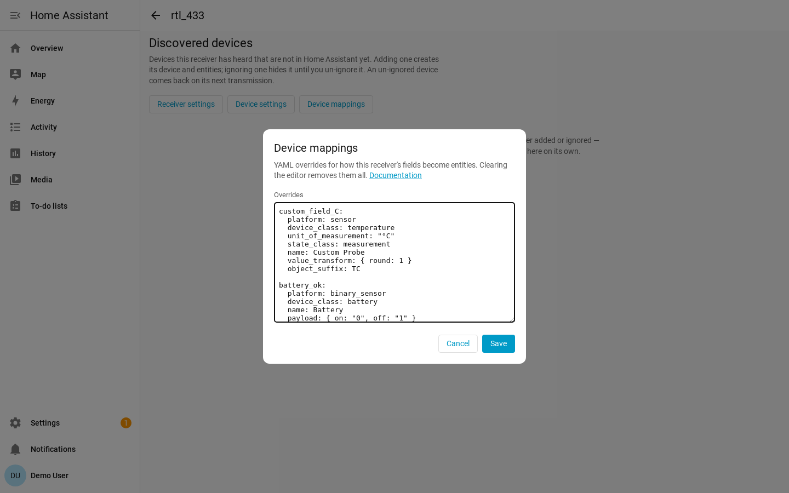

# Device Mapping Library

The rtl_433 integration turns the JSON fields emitted by rtl_433 into Home
Assistant entities using a **data-driven device library**: a set of YAML
files that map each rtl_433 field name to a Home Assistant entity descriptor.

Use device mappings to add support for fields your rtl_433 hardware already
reports, without editing the integration code or waiting for a new release. You
can add mappings from the Home Assistant UI; contributors can add mappings to
the shipped library.

> **Where the shipped library lives.** The YAML files and their loader are part
> of [`pyrtl_433`](https://github.com/rtl-433-hass/pyrtl_433), the integration's
> runtime dependency — not this repository. This page is the
> **Home-Assistant-facing** guide: how to add and override mappings from the UI,
> how the resulting descriptors behave as entities, and how to contribute a
> mapping upstream. The **authoritative YAML schema reference** — every
> attribute, the value transforms, binary payloads, the `models:` block and the
> skip-keys file — is
> [the pyrtl_433 device-library reference](https://rtl-433-hass.github.io/pyrtl_433/latest/device-library/).

## Adding device mappings

You can extend or correct the shipped library **without editing the integration
files** directly from the Home Assistant UI:

> **Settings → Devices & Services → rtl_433 → Configure → Device mappings**

The *Device mappings* step opens Home Assistant's built-in YAML editor pre-filled
with that hub's current mappings. You edit mappings as YAML, using the **same
schema** as the shipped library ([reference](https://rtl-433-hass.github.io/pyrtl_433/latest/device-library/)): top-level keys are rtl_433
field names, values are entry mappings. They may optionally include a `skip_keys:` list to add extra
skip entries, and an optional [`models:` block](#model-scoped-mappings-models) to
add or override model-scoped descriptors.

Mappings are stored **per hub** in that hub's config entry — each hub has its own
independent set. The editor:

- **Blocks invalid YAML syntax** before you can submit.
- **Validates the mapping schema on save** and rejects bad input with a
  per-field error naming the offending field and the reason.
- **Reloads the hub automatically.**



To find fields your device reports that do not yet have entities, download
diagnostics for the hub from **Settings → Devices & Services → the rtl_433
integration → ⋮ → Download diagnostics** and inspect `unmatched_field_keys`. Each
key is either a candidate for a mapping or, if it is genuinely noise/identity
data, an entry for `skip_keys:`.

> **Comments and formatting are not preserved.** The editor returns parsed YAML,
> so any comments or hand-formatting in what you paste are dropped once the
> mappings are stored. The mapping *content* is preserved exactly.

Mappings you add in the UI layer **on top of** the shipped library:

- A field present in both the UI mapping and the shipped library: the **UI mapping
  wins** (full entry replacement, not a deep merge), so you can correct a unit,
  device class, or transform.
- A field present only in the UI mapping: it is **added** as a new mapping.
- `skip_keys` entries in the UI mapping are **unioned** with the shipped skip
  list.
- A `models:` block in the UI mapping is **merged per `(model, field_key)`**: a
  UI model-scoped entry replaces the shipped one for the same model and field,
  while other shipped model fields are preserved. Per the
  [precedence rules](#precedence-specificity-first), a model-scoped entry (from
  either source) always beats a global one — so a **shipped** `models:` entry
  outranks a **UI global** entry for a matching model.

Paste a mapping like the following into the *Device mappings* editor. This
example adds an unmapped field and re-classifies `battery_ok` as a low-battery
binary problem sensor:

```yaml
custom_field_C:
  platform: sensor
  device_class: temperature
  unit_of_measurement: "°C"
  state_class: measurement
  name: Custom Probe
  value_transform: { round: 1 }
  object_suffix: TC

battery_ok:
  platform: binary_sensor
  device_class: battery     # HA "battery": on == problem (low)
  unit_of_measurement: null
  state_class: null
  name: Battery
  payload: { on: "0", off: "1" }   # battery_ok == 0 means low -> problem
  entity_category: diagnostic
  object_suffix: B
```

`skip_keys:` entries work in the editor exactly as in the shipped library, and so
do model-scoped mappings — the way to correct a mapping for **one specific device
model** rather than every device that emits the field. Nest the per-model
descriptors under a [`models:` block](#model-scoped-mappings-models) keyed by the
exact rtl_433 `model` string; a model-scoped entry beats any global one for that
model (see [precedence](#precedence-specificity-first)). For example, to rename
one model's temperature sensor and round it more finely than the global default,
leaving every other model untouched:

```yaml
models:
  Acurite-Tower: # exact rtl_433 model string
    temperature_C:
      platform: sensor
      device_class: temperature
      unit_of_measurement: "°C"
      state_class: measurement
      name: Outdoor temperature
      value_transform: { round: 2 }
      object_suffix: T
```

Mapping overrides are **global or model-scoped only** — they apply to every device
of a model, not a single physical unit. To change settings for one specific unit
(its availability timeout, meter calibration, or motion clear delay), use the
*Device settings* dialog instead.

## Mapping entry schema (summary)

The full schema is documented upstream, where the library lives:
**[pyrtl_433 device-library reference](https://rtl-433-hass.github.io/pyrtl_433/latest/device-library/)**. What follows is only enough to
read and write an entry in the *Device mappings* editor.

Top-level keys are rtl_433 field names **exactly** as they appear in the JSON
event (`temperature_C`, `wind_avg_km_h`, `battery_ok`). Names are matched
**case-sensitively**, and not every decoder uses `snake_case` — SCMplus emits
`Consumption`, ERT-SCM emits `consumption_data`. A key that differs only in case
silently never matches: no entity, no warning, no error.

```yaml
temperature_C:
  platform: sensor            # sensor | binary_sensor | event
  device_class: temperature   # an HA device class, or null
  unit_of_measurement: "°C"   # or null
  state_class: measurement    # measurement | total | total_increasing | null
  name: null                  # null/omitted => HA names it from device_class
  value_transform: { round: 1 }  # numeric transform (sensor only)
  object_suffix: T            # short, STABLE unique-id token
```

`platform` and `object_suffix` are the only truly required attributes;
`device_class`, `unit_of_measurement` and `state_class` are required but may be
`null`. The rest are optional: `value_transform` (`float` / `int` / `scale` /
`offset` / `round`, applied in that order) for sensors, `payload:
{ on: <raw>, off: <raw> }` for binary sensors, `event_map` for event entities,
plus `clear_delay`, `event_driven`, `force_update`, `entity_category`,
`enabled_by_default` and `icon`. A separate `_skip_keys.yaml` in the library
lists identity and transport fields (`model`, `id`, `channel`, `mic`, `mod`,
`protocol`, …) that must never become entities; a UI mapping can add to that
list with a top-level `skip_keys:` sequence.

`object_suffix` is part of every entity's unique id, so **changing it orphans
existing entities**. Treat it as frozen once shipped.

Two attributes change how an entity *behaves* in Home Assistant rather than just
how it looks, so they are documented on this page rather than only upstream:
`clear_delay` ([Motion / occupancy](#motion-occupancy)) and `event_driven`
([Availability classification](#availability-classification)).

### Motion / occupancy

PIR / occupancy decoders (Interlogix, Risco Agility, Kerui, …) emit `motion`
**only on detection** (raw value `1`) and **never send an off** — the hardware is
detect-only. So `motion` is a `binary_sensor` (device class `occupancy`) whose
`payload` declares only an `on` token; the off state is **synthesized** by a
timer rather than received:

```yaml
motion:
  platform: binary_sensor
  device_class: occupancy
  name: Motion
  payload: { on: "1" }   # detect-only: no off token
  clear_delay: 90        # synthesize off 90 s after the last detection
  object_suffix: motion
```

The `clear_delay` attribute (seconds) drives the synthesized off: the sensor
turns `on` on each detection and is auto-cleared to off after the delay elapses
with no re-detection. Every fresh detection **reschedules** the timer, so the
off window restarts on each retrigger. The shipped default is **90 s**.

A stale `on` is never restored across a restart (there would be no live timer to
clear it): the sensor comes back off/unknown until the next detection.

**Per-device override.** The delay can be tuned per device in *Device settings* —
**Settings → Devices & Services → rtl_433 → Configure → (device step)** exposes a
*Motion clear delay (seconds)* field, shown only for motion-bearing devices.
Leave it blank to use the 90 s default. The override is resolved at runtime
(per-device value, else the descriptor default).

### Availability classification

A device is marked *unavailable* when it falls silent past its availability
timeout. RF devices signal presence only by transmitting, so the timeout is
resolved per device: a per-device override, then an explicit hub default, then a
**device-class default** derived from the device's known fields — both its
adopted (persisted) fields and its latest payload, so an event-driven device that
has been silent since a restart is still classified correctly before it next
transmits (rather than briefly expiring its battery at the periodic default).

The class default has two outcomes:

- **Event-driven** → never-expire (the device, and all its entities including
  battery, stay available once seen). These devices transmit *only on a state
  change* — a door opening, motion, a button press — so any finite silence
  timeout would eventually misfire and wrongly hide a healthy device. A field is
  event-driven when it uses `platform: event` **or** sets `event_driven: true`
  (e.g. `motion`, `contact_open`, `reed_open`, `closed`, `alarm`). The set is
  derived from the active library (shipped descriptors plus user mappings).
- **Periodic** → a finite default (10 min). Everything else — temperature,
  humidity, power, etc. — which reports on a regular cadence.

Diagnostic fields such as `battery_ok` do not decide the class on their own. If a
device also has an event-driven field, the whole device uses the event-driven
default, so its battery and other entities stay available between events. An
explicit per-device or hub timeout always overrides the class default.

Because an event-driven device's availability no longer signals freshness, its
per-device **Last seen** timestamp sensor is enabled by default (it ships
disabled for periodic devices). It stays available once seen, so "no signal for
N minutes" automations keep working.

### Event entities

`platform: event` is for **momentary, fire-and-forget** RF fields — a remote
button, a doorbell press — that have no steady "on" / "off"
state to track. Each genuine transmission fires **one** Home Assistant
[event](https://www.home-assistant.io/integrations/event/), and the entity
stays available between presses (no faked "off"). Event entries live in their
own library file, `events.yaml`:

```yaml
button:
  platform: event
  device_class: button     # an EventDeviceClass
  name: Button
  object_suffix: button
```

How event entries differ from `sensor` / `binary_sensor`:

- **By default the fired `event_type` is the stringified field value**
  (`str(value)`). There is **no `payload` and no `value_transform`** — the raw
  value is stringified directly.
- **By default `event_types` are auto-populated, not declared.** Each newly
  observed value is recorded as a valid type the first time it is seen and
  **persisted per device**, so after a restart the entity rebuilds knowing the
  types it has seen before. You never list them in the YAML.
- A field whose value varies (a remote that reports which button was pressed)
  auto-populates several types; a field that only ever emits one distinct value
  fires that one type on every transmission.
- **The fired event carries no extra attributes** — the type is the only
  payload.
- `device_class` is an `EventDeviceClass` (`button`, `doorbell`).

#### `event_map`: naming raw values

The optional `event_map` attribute overrides the default stringified behavior:
it maps a **stringified raw value → named `event_type`**. When present:

- A transmission whose raw value is in the map fires the **mapped** type;
  values **not** in the map still pass through as `str(value)`.
- The mapped types are **declared up front** in `event_types` (in map order),
  rather than only appearing once observed — so a `device_trigger` lists them
  even before the first press.

The doorbell is the shipped example. `secret_knock` is emitted on **every**
press: raw `0` is a regular single press and raw `1` is a "secret knock" (the
button pressed three times rapidly). It maps both onto Home Assistant's doorbell
standard:

```yaml
secret_knock:
  platform: event
  device_class: doorbell
  name: Doorbell
  object_suffix: secret_knock
  event_map:
    "0": ring          # DoorbellEventType.RING — the HA standard type
    "1": secret_knock  # custom type for the 3x-rapid "secret knock"
```

The shipped `events.yaml` has two examples:

| Field | `device_class` | Notes |
|-------|----------------|-------|
| `button` | `button` | Remote / key-fob button code; the value is the pressed code, so distinct presses auto-populate several types. |
| `secret_knock` | `doorbell` | Honeywell ActivLink doorbell press; emitted on every press (`0` regular → `ring`, `1` secret knock → `secret_knock`) via `event_map`. |

## Model-scoped mappings (`models:`)

The top-level keys above are the **global** defaults: a `temperature_C` entry
applies to *every* device that emits `temperature_C`. Some fields, though, need
a different descriptor depending on the **device model** — most notably the
utility-meter consumption counters (`Consumption`, `consumption_data`), whose
unit and scale are *not* carried in the RF signal and differ between meter
models.

For those, a library file (or a UI mapping) may carry an optional top-level
**`models:`** block keyed by the exact rtl_433 `model` string, each model mapping
to a table of `field_key → descriptor` using the same per-field attributes as a
global entry:

```yaml
models:
  Some-Model-Name:            # an exact rtl_433 `model` string
    consumption_data:
      platform: sensor
      device_class: energy
      unit_of_measurement: kWh
      state_class: total_increasing
      name: Consumption
      value_transform: { scale: 1 }
      object_suffix: consumption
```

`models:` is additive and optional, and `models` is a reserved top-level key —
you cannot have a *field* literally named `models`. See the
[schema reference](https://rtl-433-hass.github.io/pyrtl_433/latest/device-library/) for the full rules.

### Lookup resolution order

When the integration builds an entity for a field on a device, it resolves the
descriptor **most-specific first**:

1. The **model-scoped** entry for `(model, field_key)`, if the device's model has
   a `models:` block with that field.
2. Otherwise the **global** flat entry for `field_key`.
3. Otherwise the field is unmapped → no entity.

So a `models:` entry only affects the model it names; every other model keeps the
global descriptor for that same field.

### Precedence (specificity-first)

Combined with [UI mappings](#adding-device-mappings) and the per-device meter
calibration (the *Device settings* dialog), the full precedence for a
single field on a single device is, **highest to lowest**:

1. **Per-device calibration** (commodity + base unit + scale, set in the options
   flow) — applies only to the consumption field(s) of the one calibrated device.
2. **Model-scoped** entry — UI `models:` entry, else shipped `models:` entry.
3. **Global** flat entry — UI flat key, else shipped flat key.
4. Unmapped → no entity.

The rule is **specificity-first**: a model-scoped entry always beats a global one
*regardless of source*. In particular a **shipped** `models:` entry outranks a
**UI global** entry for a matching model. Within each tier the UI mapping beats
the shipped library. (This falls out naturally from the merge: the UI mapping
replaces the shipped entry *within* a tier, and the lookup checks the model tier
before the global tier.)

> **No speculative real-meter mappings ship.** Because a meter's consumption
> unit/scale is not knowable from the signal, the shipped library does **not**
> carry a guessed `models:` consumption mapping for any real model — a wrong
> scale would silently corrupt real Energy data. The example below is purely
> illustrative; for a real meter use the per-device calibration step in the
> *Device settings* dialog (see [Utility-meter calibration](calibration.md)) until a model's unit/scale is authoritatively
> known.

## Contributing device mappings

The easiest way to add support for your own installation is
[Adding device mappings](#adding-device-mappings) — no code, no release wait.

If you want the mapping to ship for **everyone**, contribute it to
**[pyrtl_433](https://github.com/rtl-433-hass/pyrtl_433)**, not to this
repository: the YAML library moved there in pyrtl_433 0.3.0 so every rtl_433
consumer shares one curated set of mappings. The files live under
`pyrtl_433/library/data/`, one themed file per domain (`temperature.yaml`,
`humidity_moisture.yaml`, `power_electrical.yaml`, `events.yaml`, `misc.yaml`, …,
plus `_skip_keys.yaml`). A merged mapping reaches Home Assistant users on the
next pyrtl_433 release and the integration's requirement bump.

### Add-a-mapping workflow

1. **Find the field name.** Watch your rtl_433 stream, or download diagnostics
   for the hub from **Settings → Devices & Services → the rtl_433 integration →
   ⋮ → Download diagnostics**. The export lists unmapped fields your hardware has
   sent in `unmatched_field_keys`. Each key is either a candidate for a mapping
   or, if it is genuinely noise/identity data, an entry for `_skip_keys.yaml`.
   rtl_433 field names are case-sensitive and unit-suffixed (`temperature_C`, not
   `temperature`).
2. **Add the entry in pyrtl_433.** Pick the themed file that matches the field's
   domain (or `misc.yaml`), key the entry by the exact field name, and fill in
   the attributes following the
   [schema reference](https://rtl-433-hass.github.io/pyrtl_433/latest/device-library/). Copy a similar
   existing entry as a template. That repository's own contributing guide covers
   validation and its test suite.
3. **Add a fixture here too.** Once the mapping is merged and released, add a
   fixture under `tests/fixtures/` in *this* repository with a real event from
   your device. `tests/test_fixture_coverage.py` sweeps every fixture against the
   **installed** library and fails if any field in it has no descriptor and no
   skip-key entry — that sweep is what proves the mapping actually matches the
   devices this integration builds entities for.

!!! warning "Field names are matched exactly, and a mismatch is silent"

    A key that differs from the wire name by so much as its case produces no
    entity, no warning, and no error — the sensor simply never appears. SCMplus
    emits `Consumption` (CamelCase) while ERT-SCM emits `consumption_data`
    (snake_case); both decoders are in the same protocol family. Copy the name
    from the decoder's `data_make()` call, or better, from a real event.

    For the SCM family and Acurite this is checked against rtl_433's actual
    output: `tests/fixtures/generated/` holds events decoded from real `.cu8`
    captures by `scripts/regen_capture_fixtures.py`, and CI re-decodes and diffs
    them. See `tests/fixtures/generated/README.md` if you want to extend that
    to another protocol.


## Notes on fields that cannot be expressed declaratively

The upstream `mappings` table includes two `device_automation` entries —
`channel` and `button` — that publish MQTT **device triggers** (e.g.
`button_short_release`) rather than entities. These have no `sensor` /
`binary_sensor` equivalent in this schema:

- `channel` is already a device-identity key and lives in `_skip_keys.yaml`.
- `button` is modelled as an [event entity](#event-entities) instead of an MQTT
  device trigger — see the library's `events.yaml`.

Everything else from the upstream table is ported faithfully.
