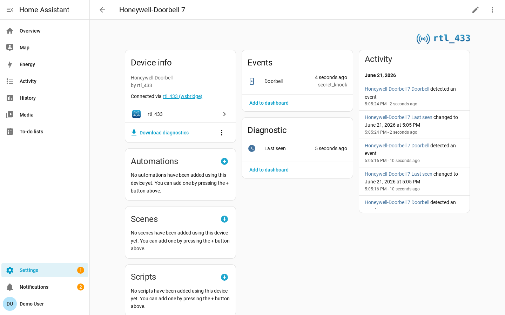

# Event-based Devices

Some RF devices transmit only when something happens. Doorbells, remotes,
buttons, contact sensors, and motion sensors do not behave like periodic weather
sensors, so the integration models them differently.

## Event Entities and Replay Suppression

Momentary RF devices such as remotes, doorbells, and key fobs are native Home
Assistant `event` entities. Each genuine transmission fires one event whose type
is the transmitted value. Event entities stay available between presses.

On reconnect or Home Assistant restart, rtl_433 replays recent event history.
Momentary events that occurred while Home Assistant was disconnected are not
re-fired, so an old doorbell press cannot trigger automations late. Their latest
readings still seed ordinary sensors.

## Motion and Occupancy

Detect-only PIR sensors that send a trip but never an off become occupancy
`binary_sensor` entities. The integration synthesizes the off state after a clear
delay, defaulting to 90 seconds. The delay can be tuned per device in **Device
settings**.

See [Motion / occupancy](device-library.md#motion-occupancy) for the mapping
schema.
