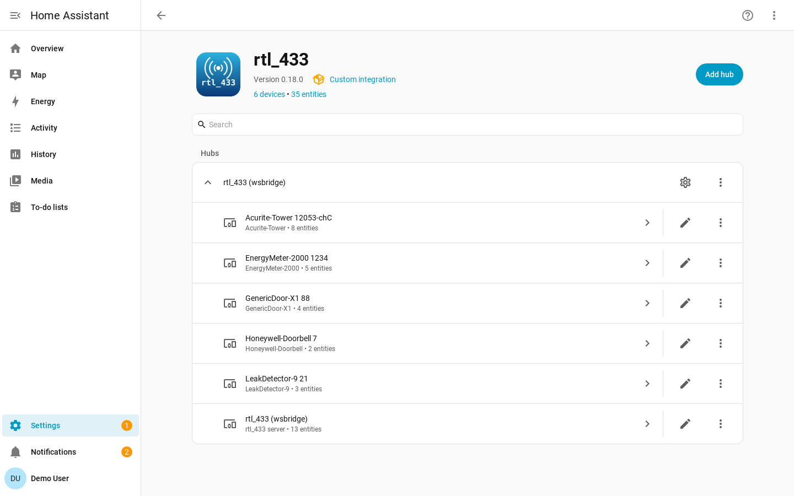

# rtl_433 for Home Assistant

The rtl_433 integration connects Home Assistant to
[rtl_433](https://github.com/merbanan/rtl_433) so you can see weather stations,
security sensors, and more, all as native Home Assistant devices and entities.

rtl_433 receives 433 MHz and other ISM-band transmissions with a
[software-defined radio (SDR)](https://en.wikipedia.org/wiki/Software-defined_radio)
and can expose decoded events through its HTTP API. This integration connects to
that WebSocket endpoint, normalizes each event into a stable device identity, and
maps raw fields to Home Assistant sensors, binary sensors, and events through the
[device library](device-library.md).

The best way to use this integration is to use the
[rtl_433 Home Assistant add-on](https://github.com/rtl-433-hass/rtl_433-hass-addons)
with a supported USB radio. Otherwise, the integration can connect to any rtl_433
server with HTTP output enabled.

## Features

- **Local push** over the rtl_433 WebSocket, with no cloud dependency and no
  polling.
- **Data-driven device library**: add support for additional devices by writing
  YAML snippets in the Home Assistant UI, without having to wait for a new
  version of the integration.
- **Automatic device discovery**: newly observed devices are added automatically,
  and discovery can be disabled to avoid adding unwanted devices.
- **Configurable availability**: silence-based availability with hub defaults,
  device overrides, and event-driven class defaults.
- **Multiple servers**: add one hub per rtl_433 server; device identities are
  scoped per hub.
- **Hub observability**: diagnostic entities for connectivity, SDR/meta values,
  and server statistics.
- **Optional managed SDR settings**: Home Assistant can adopt and re-apply rtl_433
  SDR settings after reconnects.
- **Debugging and Diagnostics**: downloadable diagnostics show unmapped fields so
  missing device support is easy to identify.

## Where to Start

- Install the integration with [Installation](installation.md).
- Add a hub with [Configuration](configuration.md).
- Learn how devices appear in [Device Discovery](device-discovery.md).
- Tune timeouts in [Availability](availability.md).
- Understand doorbells, remotes, and motion sensors in
  [Event-based Devices](event-based-devices.md).
- Add or fix field mappings in [Device Library](device-library.md).
