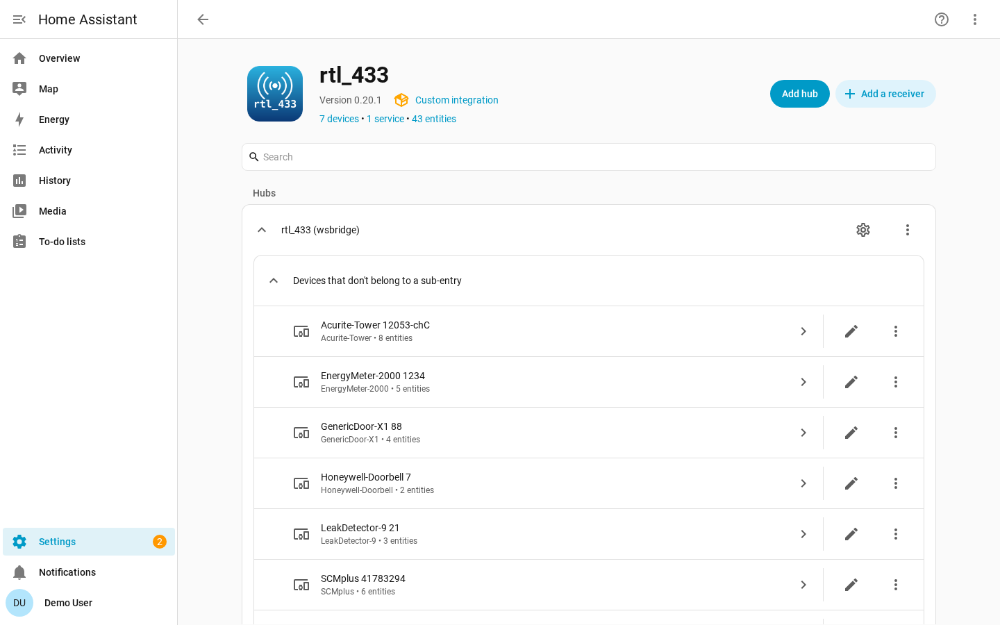

# rtl_433 for Home Assistant

The rtl_433 integration connects Home Assistant to
[rtl_433](https://github.com/merbanan/rtl_433) so you can see weather stations,
security sensors, and more, all as native Home Assistant devices and entities.

rtl_433 receives 433 MHz and other ISM-band transmissions with a
[software-defined radio (SDR)](https://en.wikipedia.org/wiki/Software-defined_radio)
and can expose decoded events through its HTTP API. This integration connects to
that WebSocket endpoint, normalizes each event into a stable device identity, and
maps raw fields to Home Assistant sensors, binary sensors, and events through the
[device library](device-library.md).

## Receivers, Radios, and Locations

**A receiver is a computer running rtl_433; it contains a radio.** The radio is
the SDR dongle; the receiver is the machine running the `rtl_433` process that
decodes what the radio receives and serves it over a WebSocket.

Receivers are grouped into a **location**: one integration entry holding one
receiver per rtl_433 server. Setting the integration up creates a location and
its first receiver together, and **Add a receiver** adds more servers to the same
location.

Everything a location's receivers receive is **unioned**. One physical sensor received
by two receivers is one Home Assistant device with one set of entities, updating
whenever either receiver receives it. Add a second *location* only for a genuinely
distant site, where its receivers could never hear the same transmitter as the
first — devices never merge across locations.

The best way to use this integration is with the
[rtl_433 Home Assistant add-on](https://github.com/rtl-433-hass/rtl_433-hass-addons)
and a supported USB radio: install this integration first, restart Home
Assistant, and then install and start the add-on. Each radio the add-on detects
is discovered automatically — no connection details to type. Otherwise, the
integration can connect to any rtl_433 server with HTTP output enabled.

## Features

- **Local push** over the rtl_433 WebSocket, with no cloud dependency and no
  polling.
- **Data-driven device library**: add support for additional devices by writing
  YAML snippets in the Home Assistant UI, without having to wait for a new
  version of the integration. The shipped library is maintained upstream in
  [`pyrtl_433`](https://github.com/rtl-433-hass/pyrtl_433).
- **You choose which devices to add**: every device your receivers receive is listed
  on one page for you to add, so neighbours' sensors and bad decodes stay out of
  Home Assistant. A sensor two receivers receive is one row, approved once for the
  whole location. Unwanted devices can be ignored until you want them back.
- **Union across receivers**: several rtl_433 servers in one location feed one
  device per sensor and one entity per mapped field, deduped so two decodes of
  the same transmission are not recorded twice.
- **Configurable availability**: silence-based availability with location
  defaults, device overrides, and event-driven class defaults, merged across the
  location's receivers — a device is available while at least one receiver is
  connected and hearing it.
- **Per-receiver signal detail**: RSSI, SNR and Last seen stay per receiver, and
  the **Signal coverage** page compares them without enabling an entity.
- **Receiver observability**: diagnostic entities for connectivity, radio/meta
  values, and server statistics, per receiver.
- **Optional managed radio settings**: Home Assistant can adopt and re-apply each
  receiver's rtl_433 radio settings after reconnects.
- **Debugging and Diagnostics**: downloadable diagnostics show unmapped fields so
  missing device support is easy to identify.

## Where to Start

- Install the integration with [Installation](installation.md).
- Add a location and its receivers with [Configuration](configuration.md).
- Choose which devices to add in [Device Discovery](device-discovery.md).
- Tune timeouts in [Availability](availability.md).
- Understand doorbells, remotes, and motion sensors in
  [Event-based Devices](event-based-devices.md).
- Add or fix field mappings in [Device Library](device-library.md).
