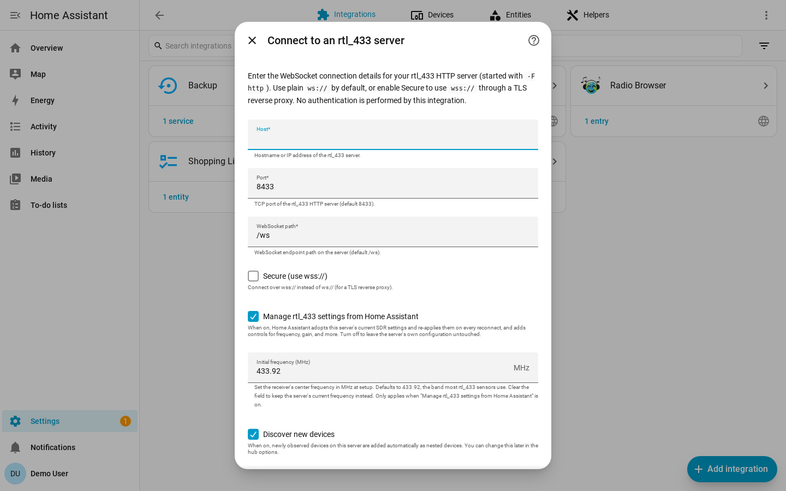

# Installation

## HACS Custom Repository

This integration is not yet in the default HACS store, so add it as a custom
repository:

1. In Home Assistant, open **HACS**.
2. Click the **⋮** menu in the top right, then **Custom repositories**.
3. Enter `https://github.com/rtl-433-hass/rtl_433` and choose the **Integration**
   category.
4. Search for **rtl_433**, open it, and click **Download**.
5. Restart Home Assistant.

## Manual Install

1. Copy `custom_components/rtl_433` from this repository into Home Assistant's
   `<config>/custom_components/` directory.
2. Confirm the final path is `<config>/custom_components/rtl_433/`.
3. Restart Home Assistant.

## Next Step

After installation, add a hub from Home Assistant using the
[configuration guide](configuration.md). You will see the connection form below.

