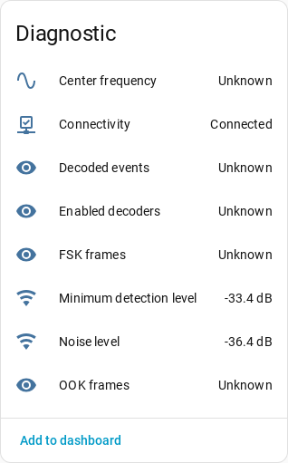

# Receiver Entities

Each receiver exposes diagnostic entities on the receiver device so you can observe the
rtl_433 server itself.

## Connectivity

The **Connectivity** binary sensor is on while the receiver's WebSocket connection is
open and off otherwise. It flips off immediately when the server announces a
shutdown instead of waiting for a silence timeout.

## SDR and Meta Diagnostics

Read-only diagnostic sensors report the radio's current configuration:

- Center frequency.
- Sample rate.
- Conversion mode.
- Hop interval.
- Gain, where an empty value reads as `auto`.
- Frequency correction in ppm.

The configured `frequencies` and `hop_times` arrays appear as attributes on the
center-frequency sensor.

## Radio Noise

Two diagnostic sensors track the radio's noise floor, so you can graph RF
noise over time and alert when it climbs high enough to drown out your devices:

- **Noise level** — the radio's estimated noise level in dB.
- **Minimum detection level** — the auto-adjusted pulse-detection threshold in
  dB; transmissions weaker than this are not decoded.

rtl_433 only reports these when its auto-level feature is active, so run the
server with `-Y autolevel` and optionally `-M noise:30` (a periodic report every
30 seconds). The config-file equivalents are:

```text
pulse_detect autolevel
report_meta noise:30
```

With the Home Assistant add-on, put those two lines in the radio's optional
per-radio override file in the add-on config directory (see the add-on
documentation). Without them the sensors stay `unknown`. Note that `autolevel`
changes reception behavior by design: it continuously adapts the pulse
detector's minimum level to the measured noise floor.

The two sensors update on different schedules, and **Minimum detection level**
is the fussier of the pair. `-M noise:30` emits a report every 30 seconds, but
that report carries only the noise estimate, so **Noise level** refreshes
steadily while **Minimum detection level** updates *only* at the moment
`autolevel` actually re-adjusts the threshold. rtl_433 re-adjusts only when the
estimated noise sits more than 3 dB below the configured `minlevel` (default
-12.1 dB, so roughly below -15 dB) *and* the new threshold differs from the
current one by more than 1 dB. Two consequences are worth knowing before you go
debugging:

- On a radio whose noise floor is above about -15 dB, `autolevel` never
  engages and **Minimum detection level** stays `unknown` however long you wait.
  Check **Noise level** first: it decides whether the threshold can move at all.
- rtl_433 fires a burst of adjustments while it converges at startup, then goes
  quiet. The event stream carries no backlog, so a server that settled before
  Home Assistant connected leaves the sensor `unknown` until the noise floor
  drifts by more than 1 dB. To force an update, nudge the receiver's **Gain** number
  entity far enough to move the floor, then set it back.

Unlike the sensors below, this data arrives over the event stream itself
(rtl_433 ≥ 23.11), so it works even when `/cmd` is proxied away behind a
WebSocket-only proxy.



That capture is from a server reachable only over its WebSocket stream, which is
why the two noise sensors report while the `/cmd`-sourced sensors described below
read `unknown`.

## Server Statistics

Server statistics include cumulative decoded events, OOK frames, FSK frames, and
enabled decoders. Per-protocol `stats[]` and the `since` timestamp appear as
attributes on the decoded-events sensor.

Receiver observability data is fetched over HTTP from the rtl_433 server's `/cmd`
endpoint at the server root, `http(s)://host:port/cmd`, independent of the
configured WebSocket path. If a reverse proxy exposes only the WebSocket path and
not `/cmd`, these sensors degrade to `unknown` while the event stream and
connectivity sensor keep working.

Because those values come from the server, the diagnostic and statistics sensors
go `unavailable` as soon as the receiver connection drops — the same gate that applies
to the devices, see [Availability](availability.md#receiver-connection). Otherwise they
would keep showing a frozen reading. The Connectivity sensor stays available
throughout, and so do the SDR controls below: those are settings you write, not
readings you trust.

## Managing SDR Settings from Home Assistant

By default a new receiver adopts and manages the radio's SDR settings. With
**Manage rtl_433 settings from Home Assistant** enabled, the receiver exposes controls
under the receiver device in the config entity category:

- **Center frequency** number in MHz, available only for single-frequency setups.
- **Sample rate** number in Hz.
- **Frequency correction** number in ppm.
- **Gain** number in dB paired with an **Auto gain** switch.
- **Conversion mode** select with `native`, `si`, and `customary`.
- **Hop interval** number in seconds, available only for multi-frequency hopping
  setups.

Frequency hopping must be configured in rtl_433. Home Assistant can adjust the
hop interval after rtl_433 is already running with multiple frequencies, but it
does not provide an entity for editing the frequency list.

On first connect, Home Assistant adopts the server's current settings into its
desired state. It then re-applies managed settings on every reconnect so values
survive rtl_433 restarts. If an initial frequency was configured during setup,
that value is applied once and takes priority over the adopted frequency.

Once managed, change these settings in Home Assistant rather than editing the
rtl_433 config directly. Home Assistant is the authority and will re-apply its
stored values on the next reconnect.

### Re-Syncing from rtl_433 Config

To pick up direct rtl_433 config edits:

1. Turn **Manage rtl_433 settings from Home Assistant** off. This clears Home
   Assistant's stored desired state.
2. Restart rtl_433 so it loads its config.
3. Turn the toggle back on. On the next connect, Home Assistant re-adopts the
   server's current settings.

### Requirements and Caveats

- The `/cmd` endpoint must be reachable at the server root.
- Hopping setups keep center frequency unmanaged so Home Assistant never pins a
  radio to one frequency.
- The frequency list itself can only be set in the rtl_433 config.
- Multi-stage gain strings are not supported by the single gain control.
- Retuning does not widen the sample rate automatically; high-frequency bands may
  require manually increasing sample rate.

Turning management off removes the controls, stops Home Assistant from sending
commands, and clears its stored desired state. The radio's settings are left
untouched.
